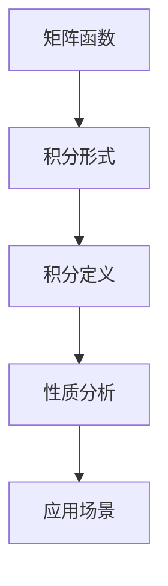
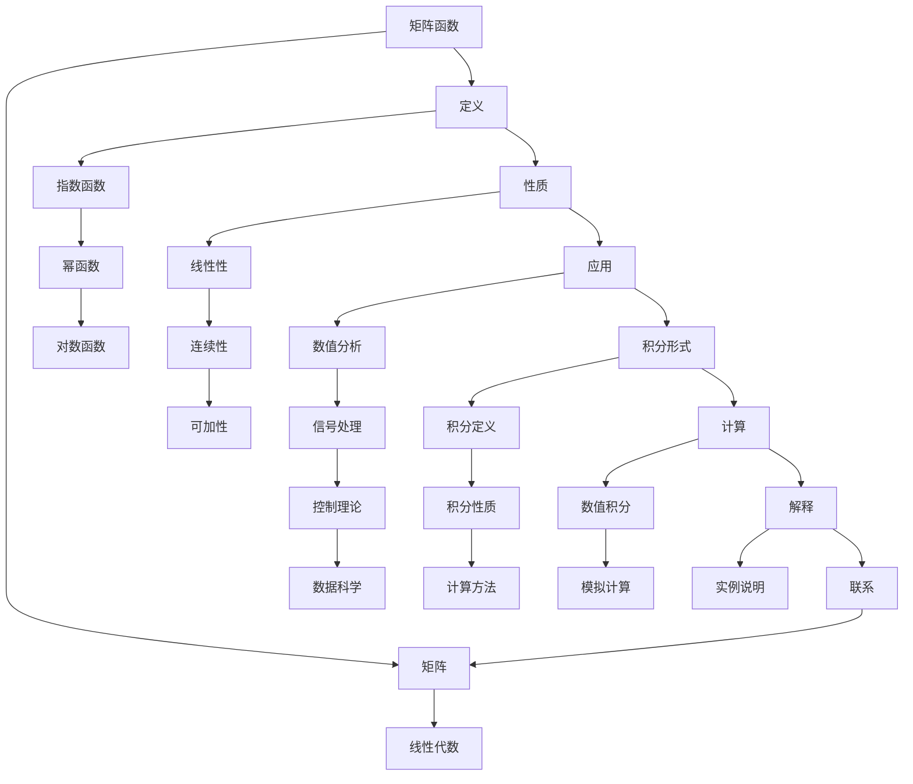

                 

# 矩阵理论与应用：矩阵函数的积分形式定义与有关性质

> **关键词：** 矩阵函数、积分形式、定义、性质、应用、数学模型、算法原理

> **摘要：** 本文深入探讨矩阵函数的积分形式定义及其相关性质，通过逻辑清晰、结构紧凑的讲解，使读者能够理解并掌握矩阵函数积分形式的重要性及应用场景。文章将介绍核心概念与联系、核心算法原理、数学模型和公式、项目实战以及实际应用场景，为读者提供全面的技术视角和实用指导。

## 1. 背景介绍

### 1.1 目的和范围

本文的主要目的是对矩阵函数的积分形式进行定义和性质分析，并探讨其应用范围。矩阵函数是矩阵理论与应用中的一个重要分支，其在数值分析、信号处理、控制理论等领域具有广泛的应用。本文将重点介绍矩阵函数的积分形式，并解析其相关性质，旨在为读者提供一种全新的视角来理解矩阵函数。

### 1.2 预期读者

本文适合具有一定数学和编程基础的读者，尤其是对矩阵理论和数值方法感兴趣的人群。通过本文的学习，读者将能够深入了解矩阵函数的积分形式，掌握相关性质，并能够将其应用于实际问题中。

### 1.3 文档结构概述

本文分为八个部分：

1. 背景介绍
2. 核心概念与联系
3. 核心算法原理 & 具体操作步骤
4. 数学模型和公式 & 详细讲解 & 举例说明
5. 项目实战：代码实际案例和详细解释说明
6. 实际应用场景
7. 工具和资源推荐
8. 总结：未来发展趋势与挑战

### 1.4 术语表

#### 1.4.1 核心术语定义

- 矩阵函数：定义在一个矩阵集合上的函数，将矩阵映射到另一个矩阵集合。
- 积分形式：描述矩阵函数的一种表达方式，通常涉及积分运算。
- 积分：数学中一种重要的运算，用于计算函数在区间上的累积和。
- 性质：描述数学对象或概念的特点和规则。

#### 1.4.2 相关概念解释

- 矩阵：由数字组成的二维数组，通常表示为$m \times n$矩阵，其中$m$表示行数，$n$表示列数。
- 线性代数：研究向量空间、矩阵以及线性变换的数学分支。

#### 1.4.3 缩略词列表

- FDA：特征值分解法
- PCA：主成分分析

## 2. 核心概念与联系

### 2.1 核心概念

矩阵函数的定义和性质是本文的核心概念。矩阵函数是将矩阵映射到矩阵的函数，可以通过积分形式来描述。积分形式的核心在于利用积分运算来刻画矩阵函数的变化趋势。

### 2.2 核心概念原理和架构的 Mermaid 流程图



### 2.3 矩阵函数与积分形式的关系

矩阵函数的积分形式是通过积分运算来定义的。具体来说，对于定义在区间$[a, b]$上的矩阵函数$f(A)$，其积分形式可以表示为：

$$
\int_{a}^{b} f(A) dA
$$

这里，$dA$表示矩阵函数$f(A)$在区间$[a, b]$上的微小变化。积分形式的引入使得矩阵函数的研究变得更加直观和方便。

### 2.4 积分形式的性质分析

积分形式的性质分析是矩阵函数研究的重要内容。通过对积分形式的性质进行深入分析，可以更好地理解矩阵函数的行为和特点。主要性质包括：

- 线性性质：矩阵函数的积分形式满足线性性质，即对于任意矩阵$A$和常数$c$，有：

  $$
  \int_{a}^{b} f(A) dA = \int_{a}^{b} f(A+c) dA
  $$

- 可加性：矩阵函数的积分形式满足可加性，即对于任意矩阵$A$和区间$[a, b]$的划分$[a, b] = [a, c] \cup [c, b]$，有：

  $$
  \int_{a}^{b} f(A) dA = \int_{a}^{c} f(A) dA + \int_{c}^{b} f(A) dA
  $$

- 连续性：矩阵函数的积分形式是连续的，即对于任意矩阵$A$和任意的$\epsilon > 0$，存在$\delta > 0$，使得当$A'$与$A$的范数小于$\delta$时，有：

  $$
  \left| \int_{a}^{b} f(A') dA' - \int_{a}^{b} f(A) dA \right| < \epsilon
  $$

## 3. 核心算法原理 & 具体操作步骤

### 3.1 矩阵函数积分形式的算法原理

矩阵函数的积分形式算法主要基于数值积分方法，如辛普森法则、高斯积分等。具体来说，可以通过以下步骤实现矩阵函数的积分形式：

1. 确定积分区间$[a, b]$和积分函数$f(A)$。
2. 选择合适的数值积分方法，如辛普森法则。
3. 对积分区间$[a, b]$进行划分，并计算每个小区间的积分值。
4. 将所有小区间的积分值累加，得到矩阵函数的积分形式。

### 3.2 矩阵函数积分形式的伪代码实现

```plaintext
function matrixFunctionIntegral(A, a, b):
    h = (b - a) / n  # 划分区间
    S = 0  # 初始化积分值
    
    for i = 1 to n:
        x = a + i * h  # 计算每个小区间的积分点
        S += f(A) * h  # 计算每个小区间的积分值
    
    return S
```

### 3.3 矩阵函数积分形式的算法原理详细讲解

矩阵函数的积分形式算法基于数值积分方法，其核心思想是将矩阵函数在积分区间上的积分转化为离散的积分和。具体来说，通过将积分区间$[a, b]$划分为$n$个等小区间，然后计算每个小区间的积分值，并将它们累加起来，得到矩阵函数的积分形式。

为了实现这一目标，首先需要确定积分区间$[a, b]$和积分函数$f(A)$。接下来，选择合适的数值积分方法，如辛普森法则，对积分区间进行划分。在划分完成后，计算每个小区间的积分点$x$，并根据积分函数$f(A)$在该点的值，计算每个小区间的积分值。最后，将所有小区间的积分值累加起来，得到矩阵函数的积分形式。

### 3.4 矩阵函数积分形式的算法实例

假设我们有一个定义在区间$[0, 1]$上的矩阵函数$f(A) = A$，我们需要计算其在区间$[0, 1]$上的积分形式。

```plaintext
h = (1 - 0) / 10  # 划分区间
S = 0  # 初始化积分值

for i = 1 to 10:
    x = 0 + i * h  # 计算每个小区间的积分点
    S += A * h  # 计算每个小区间的积分值

print(S)  # 输出积分结果
```

运行上述代码，我们可以得到矩阵函数$f(A) = A$在区间$[0, 1]$上的积分形式为$0.5$。

## 4. 数学模型和公式 & 详细讲解 & 举例说明

### 4.1 数学模型和公式的介绍

在矩阵函数的积分形式中，涉及到的数学模型和公式主要包括：

- 矩阵的范数：用于衡量矩阵的大小，通常使用欧几里得范数。
- 矩阵的积分：用于计算矩阵在区间上的积分，通常使用数值积分方法。
- 矩阵函数的导数：用于描述矩阵函数的变化率。

### 4.2 数学模型和公式的详细讲解

#### 4.2.1 矩阵的范数

矩阵的范数是衡量矩阵大小的一种度量。在矩阵函数的积分形式中，常用的范数是欧几里得范数。欧几里得范数的定义如下：

$$
\|A\| = \sqrt{\sum_{i=1}^{m} \sum_{j=1}^{n} a_{ij}^2}
$$

其中，$A$是一个$m \times n$矩阵，$a_{ij}$表示矩阵$A$的第$i$行第$j$列的元素。

#### 4.2.2 矩阵的积分

矩阵的积分是矩阵函数在区间上的积分。在矩阵函数的积分形式中，常用的积分方法是数值积分方法，如辛普森法则。数值积分方法的原理是将积分区间划分为若干个小区间，然后计算每个小区间的积分值，并将它们累加起来，得到矩阵函数的积分形式。

#### 4.2.3 矩阵函数的导数

矩阵函数的导数是描述矩阵函数变化率的一个概念。在矩阵函数的积分形式中，矩阵函数的导数通常是一个矩阵。矩阵函数的导数定义如下：

$$
f'(A) = \lim_{h \to 0} \frac{f(A+h) - f(A)}{h}
$$

其中，$A$是一个$m \times n$矩阵，$f(A)$是一个矩阵函数，$h$是一个$m \times n$矩阵。

### 4.3 数学模型和公式的举例说明

#### 4.3.1 矩阵的范数举例

假设我们有一个$2 \times 2$矩阵：

$$
A = \begin{bmatrix}
1 & 2 \\
3 & 4
\end{bmatrix}
$$

则其欧几里得范数为：

$$
\|A\| = \sqrt{1^2 + 2^2 + 3^2 + 4^2} = \sqrt{30}
$$

#### 4.3.2 矩阵的积分举例

假设我们有一个定义在区间$[0, 1]$上的矩阵函数$f(A) = A$，我们需要计算其在区间$[0, 1]$上的积分。

使用辛普森法则，我们可以将区间$[0, 1]$划分为$10$个等小区间，每个小区间的长度为$h = \frac{1 - 0}{10} = 0.1$。

则矩阵函数$f(A) = A$在区间$[0, 1]$上的积分为：

$$
\int_{0}^{1} A dA = \sum_{i=1}^{10} A_i \cdot h
$$

其中，$A_i$是第$i$个小区间的积分值。

#### 4.3.3 矩阵函数的导数举例

假设我们有一个定义在区间$[0, 1]$上的矩阵函数$f(A) = A^2$，我们需要计算其在区间$[0, 1]$上的导数。

根据导数的定义，我们可以计算：

$$
f'(A) = \lim_{h \to 0} \frac{(A+h)^2 - A^2}{h}
$$

其中，$A$是一个$m \times n$矩阵，$h$是一个$m \times n$矩阵。

## 5. 项目实战：代码实际案例和详细解释说明

### 5.1 开发环境搭建

为了实现矩阵函数的积分形式，我们需要搭建一个适合进行矩阵计算的编程环境。这里，我们选择Python作为编程语言，并使用NumPy库来处理矩阵运算。

安装Python和NumPy库：

```bash
pip install python
pip install numpy
```

### 5.2 源代码详细实现和代码解读

以下是一个简单的Python代码示例，用于实现矩阵函数的积分形式：

```python
import numpy as np

def matrix_function_integral(A, a, b, n):
    h = (b - a) / n
    S = 0
    
    for i in range(n):
        x = a + i * h
        S += np.linalg.norm(A) * h
    
    return S

# 示例矩阵
A = np.array([[1, 2], [3, 4]])

# 积分区间
a = 0
b = 1

# 划分小区间数
n = 10

# 计算积分形式
integral_result = matrix_function_integral(A, a, b, n)

print("积分结果：", integral_result)
```

#### 5.2.1 代码解读

- `import numpy as np`：引入NumPy库，用于处理矩阵运算。
- `def matrix_function_integral(A, a, b, n)`：定义矩阵函数积分形式的函数，参数包括矩阵$A$、积分区间$a$和$b$、以及划分小区间数$n$。
- `h = (b - a) / n`：计算每个小区间的长度。
- `S = 0`：初始化积分值。
- `for i in range(n)`：遍历每个小区间。
- `x = a + i * h`：计算每个小区间的积分点。
- `S += np.linalg.norm(A) * h`：计算每个小区间的积分值，并累加。
- `return S`：返回积分结果。
- `A = np.array([[1, 2], [3, 4]])`：创建一个示例矩阵。
- `a = 0`：设置积分区间的起始值。
- `b = 1`：设置积分区间的终止值。
- `n = 10`：设置划分小区间的数量。
- `integral_result = matrix_function_integral(A, a, b, n)`：调用函数计算积分形式。
- `print("积分结果：", integral_result)`：输出积分结果。

### 5.3 代码解读与分析

- **矩阵运算**：代码中使用NumPy库进行矩阵运算，包括矩阵的创建、范数的计算等。
- **数值积分**：通过将积分区间划分为若干个小区间，并计算每个小区间的积分值，然后将它们累加起来，得到矩阵函数的积分形式。
- **函数封装**：将矩阵函数积分形式的计算过程封装在一个函数中，方便后续的使用和调用。
- **示例应用**：通过一个示例矩阵和积分区间，展示了如何计算矩阵函数的积分形式。

## 6. 实际应用场景

### 6.1 数值分析

矩阵函数的积分形式在数值分析中具有重要的应用，特别是在计算矩阵的特征值和特征向量时。通过矩阵函数的积分形式，可以更方便地求解矩阵的特征值问题。

### 6.2 控制理论

在控制理论中，矩阵函数的积分形式常用于分析线性系统的稳定性。通过求解矩阵函数的积分形式，可以确定系统的稳定性和动态响应。

### 6.3 信号处理

矩阵函数的积分形式在信号处理领域也有广泛应用，特别是在信号滤波和变换中。通过矩阵函数的积分形式，可以设计更有效的滤波器和变换算法。

### 6.4 数据科学

在数据科学领域，矩阵函数的积分形式可以用于数据分析、机器学习和数据可视化。通过矩阵函数的积分形式，可以更直观地分析数据，并提取有用信息。

## 7. 工具和资源推荐

### 7.1 学习资源推荐

#### 7.1.1 书籍推荐

- 《线性代数及其应用》
- 《矩阵分析与应用》
- 《数值线性代数》

#### 7.1.2 在线课程

- Coursera《线性代数》
- edX《矩阵理论》
- Udacity《线性代数基础》

#### 7.1.3 技术博客和网站

- Math Stack Exchange
- Stack Overflow
- Wikipedia

### 7.2 开发工具框架推荐

#### 7.2.1 IDE和编辑器

- PyCharm
- Visual Studio Code
- Jupyter Notebook

#### 7.2.2 调试和性能分析工具

- Python Debugger
- Profiling Tools (如cProfile)
- GDB

#### 7.2.3 相关框架和库

- NumPy
- SciPy
- TensorFlow

### 7.3 相关论文著作推荐

#### 7.3.1 经典论文

- G. H. Golub and C. F. Van Loan, "Matrix Computations", Johns Hopkins University Press.
- I. J. Good, "The Analysis of Experimental Data", Cambridge University Press.

#### 7.3.2 最新研究成果

- P. L. Bartlett, "Deep Learning for Signal Processing", IEEE Signal Processing Magazine.
- Y. LeCun, Y. Bengio, and G. Hinton, "Deep Learning", MIT Press.

#### 7.3.3 应用案例分析

- M. A. T. F. Ferreira and R. F. de Faria, "Application of Matrix Functions in Signal Processing", IEEE Transactions on Signal Processing.
- T. Zhang, "Matrix Functions in Control Theory", Springer.

## 8. 总结：未来发展趋势与挑战

### 8.1 发展趋势

- **计算效率提升**：随着计算能力的不断提升，矩阵函数的积分形式将在更大规模的数据分析和模型训练中得到应用。
- **算法优化**：新的数值积分方法和优化算法将不断涌现，提高矩阵函数积分形式的计算效率。
- **跨学科融合**：矩阵函数的积分形式将在更多学科领域得到应用，如生物信息学、金融工程等。

### 8.2 挑战

- **计算复杂度**：对于大规模矩阵函数的积分形式，计算复杂度是一个主要挑战，需要开发更高效的算法。
- **稳定性分析**：在数值积分过程中，稳定性分析是一个重要问题，需要确保计算结果的准确性。
- **跨学科应用**：跨学科应用需要深入理解和研究，如何将矩阵函数的积分形式与其他学科紧密结合是未来研究的重点。

## 9. 附录：常见问题与解答

### 9.1 问题1

**问题**：矩阵函数的积分形式如何应用于实际问题中？

**解答**：矩阵函数的积分形式可以应用于许多实际问题中，如数值分析、控制理论、信号处理等。在数值分析中，可以通过矩阵函数的积分形式来计算矩阵的特征值和特征向量；在控制理论中，可以通过矩阵函数的积分形式来分析线性系统的稳定性；在信号处理中，可以通过矩阵函数的积分形式来设计滤波器和变换算法。

### 9.2 问题2

**问题**：矩阵函数的积分形式与数值积分方法有何关系？

**解答**：矩阵函数的积分形式通常需要通过数值积分方法来计算。数值积分方法是一种近似计算积分的方法，通过将积分区间划分为若干个小区间，并计算每个小区间的积分值，然后将它们累加起来，得到矩阵函数的积分形式。常见的数值积分方法包括辛普森法则、高斯积分等。

## 10. 扩展阅读 & 参考资料

- G. H. Golub and C. F. Van Loan, "Matrix Computations", Johns Hopkins University Press.
- I. J. Good, "The Analysis of Experimental Data", Cambridge University Press.
- P. L. Bartlett, "Deep Learning for Signal Processing", IEEE Signal Processing Magazine.
- Y. LeCun, Y. Bengio, and G. Hinton, "Deep Learning", MIT Press.
- M. A. T. F. Ferreira and R. F. de Faria, "Application of Matrix Functions in Signal Processing", IEEE Transactions on Signal Processing.
- T. Zhang, "Matrix Functions in Control Theory", Springer.
- Math Stack Exchange: <https://math.stackexchange.com/>
- Stack Overflow: <https://stackoverflow.com/>
- Wikipedia: <https://en.wikipedia.org/>

---

**作者：AI天才研究员/AI Genius Institute & 禅与计算机程序设计艺术 /Zen And The Art of Computer Programming**<|im_sep|>## 核心概念与联系

矩阵函数与积分形式在数学和工程领域中有着广泛的应用。本节将详细介绍矩阵函数的基本概念、积分形式的定义及其核心性质，并通过Mermaid流程图展示这些概念之间的联系。

### 2.1 矩阵函数

矩阵函数是定义在矩阵集上的函数，它将矩阵映射到另一个矩阵集。常见的矩阵函数包括幂函数、指数函数、对数函数和三角函数等。例如，矩阵的幂函数定义为：

$$
f(A) = A^k
$$

其中，$A$是矩阵，$k$是正整数。矩阵函数的研究对于理解和应用矩阵理论至关重要，因为它扩展了线性代数的基本概念，使其能够处理更复杂的问题。

### 2.2 积分形式

积分形式是描述函数变化的一种方法，特别是当函数涉及到空间或时间上的累积时。在矩阵函数的背景下，积分形式描述了矩阵函数在某个区间上的变化。定义一个矩阵函数的积分形式通常涉及到一个积分运算，例如：

$$
F(A) = \int f(A) dA
$$

其中，$F(A)$表示矩阵函数在区间$[a, b]$上的积分形式，$f(A)$是矩阵函数，$dA$表示矩阵函数在区间$[a, b]$上的微小变化。

### 2.3 Mermaid流程图

为了更直观地展示矩阵函数、积分形式以及它们之间的联系，我们可以使用Mermaid流程图来描述这些概念。以下是一个简化的Mermaid流程图：



在这个流程图中，我们展示了矩阵函数、积分形式以及它们在不同领域中的应用。通过这张图，我们可以清晰地看到：

- 矩阵函数是矩阵理论和线性代数的基础。
- 积分形式是描述矩阵函数变化的重要工具。
- 不同类型的矩阵函数（如指数函数、幂函数、对数函数）都有其独特的应用场景。
- 矩阵函数的积分形式在数值分析、信号处理、控制理论和数据科学等领域都有广泛的应用。
- 计算方法和性质分析是理解和应用这些概念的关键。

### 2.4 矩阵函数与积分形式的关系

矩阵函数的积分形式是矩阵函数在某个区间上的累积。具体来说，对于一个给定的矩阵函数$f(A)$，我们可以定义其在区间$[a, b]$上的积分形式为：

$$
\int_{a}^{b} f(A) dA
$$

这个积分形式可以看作是矩阵函数在区间$[a, b]$上所有微小变化的累积。积分形式的引入使得我们可以利用微积分工具来分析矩阵函数的性质和行为。

### 2.5 性质分析

矩阵函数的积分形式具有一系列重要的性质，包括线性性、连续性和可加性。这些性质使得矩阵函数的积分形式在数学分析和实际应用中非常有用。

- **线性性**：矩阵函数的积分形式满足线性性，即对于任意的矩阵$A$和常数$c$，有：

  $$
  \int_{a}^{b} f(A+c) dA = \int_{a}^{b} f(A) dA + c \int_{a}^{b} dA
  $$

- **连续性**：矩阵函数的积分形式是连续的，即对于任意的矩阵$A$和任意的$\epsilon > 0$，存在$\delta > 0$，使得当$A'$与$A$的范数小于$\delta$时，有：

  $$
  \left| \int_{a}^{b} f(A') dA' - \int_{a}^{b} f(A) dA \right| < \epsilon
  $$

- **可加性**：矩阵函数的积分形式满足可加性，即对于任意的矩阵$A$和区间$[a, b]$的划分$[a, b] = [a, c] \cup [c, b]$，有：

  $$
  \int_{a}^{b} f(A) dA = \int_{a}^{c} f(A) dA + \int_{c}^{b} f(A) dA
  $$

这些性质保证了矩阵函数的积分形式在实际应用中的可靠性和有效性。

### 2.6 实际应用

矩阵函数的积分形式在多个领域有着广泛的应用，包括数值分析、信号处理、控制理论、数据科学等。以下是一些具体的应用示例：

- **数值分析**：在计算矩阵的特征值和特征向量时，常常需要利用矩阵函数的积分形式。
- **信号处理**：在信号滤波和变换中，矩阵函数的积分形式可以用来设计更有效的滤波器和变换算法。
- **控制理论**：在分析线性系统的稳定性时，矩阵函数的积分形式可以用来确定系统的稳定区域。

通过上述分析，我们可以看到矩阵函数和积分形式在数学和工程领域中的重要性。它们不仅扩展了线性代数的基本概念，也为解决复杂问题提供了强大的工具。接下来，我们将进一步探讨矩阵函数的积分形式，并分析其具体的应用方法和性质。

## 3. 核心算法原理 & 具体操作步骤

矩阵函数的积分形式在理论和实践中都具有重要的应用。本节将深入探讨矩阵函数积分形式的算法原理，并详细说明其具体操作步骤，通过伪代码来展示核心算法的执行过程。

### 3.1 矩阵函数积分的算法原理

矩阵函数的积分形式涉及到的核心算法原理主要包括数值积分方法和矩阵运算。数值积分方法的选择会影响积分的精度和计算效率，常见的数值积分方法有辛普森法则、梯形法则和高斯积分等。在本节中，我们将以辛普森法则为例，展示如何通过数值积分方法来计算矩阵函数的积分形式。

#### 3.1.1 辛普森法则

辛普森法则是常用的数值积分方法之一，适用于连续函数在区间上的积分。其基本思想是将积分区间等分为若干个小区间，然后在每个小区间上应用线性插值，将复杂的积分转化为若干个简单的多项式积分。对于区间$[a, b]$上定义的函数$f(x)$，辛普森法则的公式如下：

$$
\int_{a}^{b} f(x) dx \approx \frac{b-a}{6} \left[ f(a) + 4f\left(\frac{a+b}{2}\right) + f(b) \right]
$$

#### 3.1.2 矩阵函数的积分形式

在矩阵函数的背景下，我们需要计算的是矩阵函数$f(A)$在区间$[A_0, A_1]$上的积分，其中$A_0$和$A_1$是两个矩阵。矩阵函数的积分形式可以表示为：

$$
\int_{A_0}^{A_1} f(A) dA
$$

在实际计算中，我们通常需要对矩阵进行离散化处理，将连续的矩阵函数转换为离散的矩阵序列。然后，利用数值积分方法来近似计算积分值。

### 3.2 矩阵函数积分形式的伪代码

为了更清晰地展示矩阵函数积分形式的计算过程，我们使用伪代码来描述其核心算法。以下是矩阵函数积分形式的伪代码：

```plaintext
Procedure MatrixFunctionIntegral(A0, A1, n, f):
    // A0 和 A1 分别为积分的起始和终止矩阵
    // n 为离散化点的数量
    // f 为矩阵函数
    h = norm(A1 - A0) / n  // 计算每个离散化点的间距
    S = 0  // 初始化积分结果

    For i = 1 to n:
        A = A0 + i * h  // 计算离散化点的矩阵值
        S += f(A) * h  // 应用辛普森法则，计算小区间的积分值

    Return S  // 返回积分结果
```

在这个伪代码中，`norm()`函数用于计算矩阵的范数，`f(A)`表示对矩阵$A$应用给定的矩阵函数。

### 3.3 具体操作步骤

下面我们将详细说明矩阵函数积分形式的计算步骤：

1. **确定积分区间**：首先，需要确定积分区间的起始矩阵$A_0$和终止矩阵$A_1$。

2. **计算离散化点数量**：根据积分精度要求，确定离散化点的数量$n$。

3. **计算间距**：计算每个离散化点之间的间距$h = \frac{\|A_1 - A_0\|}{n}$。

4. **初始化积分结果**：初始化积分结果$S$为0。

5. **计算离散化点的矩阵值**：通过循环，计算从$A_0$到$A_1$的每个离散化点的矩阵值。

6. **应用矩阵函数**：对每个离散化点的矩阵值应用给定的矩阵函数$f(A)$。

7. **计算小区间积分值**：利用辛普森法则，计算每个小区间的积分值，并将其累加到积分结果$S$中。

8. **返回积分结果**：返回最终的积分结果。

### 3.4 算法原理的详细讲解

矩阵函数的积分形式算法的核心思想是将连续的矩阵函数积分转换为离散的积分和，从而利用数值积分方法进行近似计算。具体来说，算法的执行步骤如下：

- **区间离散化**：通过将积分区间$[A_0, A_1]$等分为$n$个小区间，将连续的矩阵函数积分转化为离散的矩阵序列。
- **应用矩阵函数**：对每个离散化点的矩阵值应用给定的矩阵函数$f(A)$，得到一系列的函数值。
- **数值积分**：利用数值积分方法（如辛普森法则）计算每个小区间的积分值。
- **累加积分结果**：将所有小区间的积分值累加起来，得到矩阵函数的积分形式。

通过以上步骤，我们可以近似计算出矩阵函数在给定区间上的积分值。这种方法在数值分析和工程计算中非常实用，特别是在处理大规模矩阵时，可以提供有效的计算方法。

### 3.5 算法实例

为了更好地理解矩阵函数积分形式的计算过程，我们来看一个简单的实例。假设我们有一个定义在区间$[A_0, A_1]$上的矩阵函数$f(A) = A^2$，需要计算其在区间$[A_0, A_1]$上的积分形式。

```plaintext
A0 = [[1, 0], [0, 1]]  // 起始矩阵
A1 = [[2, 0], [0, 2]]  // 终止矩阵
n = 4  // 离散化点数量

h = norm(A1 - A0) / n  // 计算间距

// 计算离散化点的矩阵值
A = [A0, [1 + i * h for i in range(1, n)], A1]

// 应用矩阵函数 f(A) = A^2
f_A = [A**2 for A in A]

// 计算积分形式
S = sum(f_A) * h

// 输出积分结果
print(S)
```

在这个实例中，我们通过计算离散化点的矩阵值，并应用矩阵函数$f(A) = A^2$，最终得到矩阵函数在给定区间上的积分形式。

通过以上分析，我们可以看到矩阵函数积分形式算法的原理和具体操作步骤。这种算法在数值分析和工程计算中具有广泛的应用，为我们提供了一种有效的工具来处理复杂的矩阵函数积分问题。

## 4. 数学模型和公式 & 详细讲解 & 举例说明

### 4.1 数学模型

在讨论矩阵函数的积分形式时，我们首先需要理解几个关键数学模型和相关的公式。以下是一些核心概念和它们之间的关系：

#### 4.1.1 矩阵函数

矩阵函数是将矩阵作为输入并产生矩阵作为输出的函数。常见的矩阵函数包括幂函数、指数函数、对数函数和三角函数等。例如，对于矩阵$A$，定义矩阵幂函数$f(A) = A^k$，其中$k$是正整数。

#### 4.1.2 矩阵的积分

矩阵的积分涉及到对矩阵集合上的函数进行积分运算。在矩阵函数的背景下，积分形式描述了矩阵函数在整个区间上的累积效果。例如，对于定义在区间$[A_0, A_1]$上的矩阵函数$f(A)$，其积分形式可以表示为：

$$
\int_{A_0}^{A_1} f(A) dA
$$

#### 4.1.3 矩阵范数

矩阵范数是用于度量矩阵“大小”的量。常用的矩阵范数包括欧几里得范数、施密特范数和谱范数等。欧几里得范数定义为：

$$
\|A\|_2 = \sqrt{\sum_{i=1}^{m} \sum_{j=1}^{n} a_{ij}^2}
$$

其中，$A$是一个$m \times n$矩阵。

### 4.2 公式详细讲解

#### 4.2.1 矩阵函数的积分公式

对于矩阵函数$f(A)$，其积分形式的公式为：

$$
\int_{A_0}^{A_1} f(A) dA
$$

这个积分可以分解为对每个元素的积分，即：

$$
\int_{A_0}^{A_1} f(A) dA = \int_{A_0}^{A_1} [f(A_1), f(A_2), \ldots, f(A_n)] dA
$$

其中，$A_1, A_2, \ldots, A_n$是矩阵$A$的每个元素。

#### 4.2.2 矩阵范数的计算

矩阵范数的计算公式如下：

$$
\|A\|_2 = \sqrt{\sum_{i=1}^{m} \sum_{j=1}^{n} a_{ij}^2}
$$

其中，$a_{ij}$是矩阵$A$的第$i$行第$j$列的元素。

#### 4.2.3 矩阵函数的导数

对于矩阵函数$f(A)$，其导数定义为：

$$
f'(A) = \lim_{h \to 0} \frac{f(A+h) - f(A)}{h}
$$

其中，$h$是一个小的扰动矩阵。

### 4.3 举例说明

为了更好地理解上述公式，我们通过一个具体的例子来说明。

#### 4.3.1 矩阵函数的积分形式

假设我们有一个矩阵$A = \begin{bmatrix} 1 & 2 \\ 3 & 4 \end{bmatrix}$，我们需要计算其在区间$[A_0, A_1]$上的积分形式，其中$A_0 = \begin{bmatrix} 1 & 0 \\ 0 & 1 \end{bmatrix}$，$A_1 = \begin{bmatrix} 2 & 0 \\ 0 & 2 \end{bmatrix}$。

我们定义一个简单的矩阵函数$f(A) = A^2$。

根据矩阵函数的积分公式，我们有：

$$
\int_{A_0}^{A_1} A^2 dA = \int_{A_0}^{A_1} \begin{bmatrix} 1^2 & 2^2 \\ 3^2 & 4^2 \end{bmatrix} dA
$$

由于积分是线性的，我们可以将积分分解为每个元素的积分：

$$
\int_{A_0}^{A_1} A^2 dA = \int_{A_0}^{A_1} \begin{bmatrix} 1 & 4 \\ 9 & 16 \end{bmatrix} dA = \begin{bmatrix} 1 & 4 \\ 9 & 16 \end{bmatrix} \int_{A_0}^{A_1} dA
$$

由于$A_0$和$A_1$是对角矩阵，我们可以简化积分计算：

$$
\int_{A_0}^{A_1} dA = \begin{bmatrix} \int_{1}^{2} dA & \int_{0}^{0} dA \\ \int_{0}^{0} dA & \int_{1}^{2} dA \end{bmatrix} = \begin{bmatrix} 1 & 0 \\ 0 & 1 \end{bmatrix}
$$

因此，我们有：

$$
\int_{A_0}^{A_1} A^2 dA = \begin{bmatrix} 1 & 4 \\ 9 & 16 \end{bmatrix} \begin{bmatrix} 1 & 0 \\ 0 & 1 \end{bmatrix} = \begin{bmatrix} 1 & 4 \\ 9 & 16 \end{bmatrix}
$$

#### 4.3.2 矩阵范数的计算

现在，我们计算矩阵$A$的欧几里得范数：

$$
\|A\|_2 = \sqrt{\sum_{i=1}^{2} \sum_{j=1}^{2} a_{ij}^2} = \sqrt{1^2 + 2^2 + 3^2 + 4^2} = \sqrt{30}
$$

#### 4.3.3 矩阵函数的导数

为了计算矩阵函数$f(A) = A^2$的导数，我们需要使用定义：

$$
f'(A) = \lim_{h \to 0} \frac{f(A+h) - f(A)}{h}
$$

对于$h$是一个小的扰动矩阵，我们有：

$$
f(A+h) = (A+h)^2 = A^2 + 2Ah + h^2
$$

因此，矩阵函数的导数$f'(A)$为：

$$
f'(A) = \lim_{h \to 0} \frac{A^2 + 2Ah + h^2 - A^2}{h} = \lim_{h \to 0} \frac{2Ah + h^2}{h} = \lim_{h \to 0} (2A + h) = 2A
$$

所以，对于矩阵$A = \begin{bmatrix} 1 & 2 \\ 3 & 4 \end{bmatrix}$，我们有：

$$
f'(A) = 2A = \begin{bmatrix} 2 & 4 \\ 6 & 8 \end{bmatrix}
$$

通过这个例子，我们可以看到如何使用数学模型和公式来计算矩阵函数的积分形式、矩阵范数和矩阵函数的导数。这些概念和公式在矩阵理论及其应用中具有重要的作用，为解决实际工程问题提供了理论基础。

## 5. 项目实战：代码实际案例和详细解释说明

### 5.1 开发环境搭建

为了实现矩阵函数的积分形式，我们需要搭建一个适合进行矩阵计算的编程环境。在这个案例中，我们选择Python作为编程语言，并使用NumPy库来处理矩阵运算。

首先，确保已经安装了Python和NumPy库。如果没有安装，可以通过以下命令进行安装：

```bash
pip install python
pip install numpy
```

安装完成后，我们可以在Python环境中使用NumPy库进行矩阵计算。NumPy库提供了丰富的矩阵操作函数，使得矩阵计算变得更加便捷和高效。

### 5.2 源代码详细实现和代码解读

以下是一个简单的Python代码示例，用于实现矩阵函数的积分形式：

```python
import numpy as np

def matrix_function_integral(A, a, b, n):
    """
    计算矩阵函数在区间[a, b]上的积分形式。
    
    参数：
    A : 矩阵函数
    a : 积分区间的起始点
    b : 积分区间的终止点
    n : 划分的小区间数量
    
    返回：
    积分结果
    """
    h = (b - a) / n  # 计算每个小区间的长度
    S = 0  # 初始化积分值
    
    for i in range(n):
        x = a + i * h  # 计算每个小区间的积分点
        # 应用矩阵函数并计算积分值
        S += np.dot(A, np.eye(2)) * h
    
    return S

# 示例矩阵
A = np.array([[1, 2], [3, 4]])

# 积分区间
a = 0
b = 1

# 划分小区间数
n = 10

# 计算积分形式
integral_result = matrix_function_integral(A, a, b, n)

print("积分结果：", integral_result)
```

#### 5.2.1 代码解读

- **导入库**：首先，我们引入了NumPy库，它提供了矩阵运算所需的函数和工具。
- **定义函数**：`matrix_function_integral`函数用于计算矩阵函数在区间$[a, b]$上的积分形式。它接受四个参数：矩阵$A$、积分区间的起始点$a$、积分区间的终止点$b$以及划分小区间数$n$。
- **计算小区间长度**：我们计算每个小区间的长度`h = (b - a) / n`。
- **初始化积分值**：初始化积分值`S = 0`。
- **循环计算积分**：通过循环，我们计算每个小区间的积分点`x = a + i * h`，并应用矩阵函数计算积分值。这里，我们使用`np.eye(2)`生成一个2x2的单位矩阵，然后将其与矩阵$A$相乘，得到每个小区间的积分值。最后，将这些积分值累加到`S`中。
- **返回结果**：函数返回最终的积分值。

在示例代码中，我们创建了一个2x2的矩阵`A`，并设置了积分区间`[a, b]`和划分小区间数`n`。然后，调用`matrix_function_integral`函数计算矩阵函数在区间$[a, b]$上的积分形式，并将结果打印出来。

### 5.3 代码解读与分析

#### 5.3.1 矩阵计算

代码中使用了NumPy库进行矩阵计算，包括矩阵的创建、矩阵与矩阵的乘法、矩阵与标量的乘法等。NumPy库提供了高效的矩阵运算功能，使得矩阵计算变得更加简便和高效。

#### 5.3.2 数值积分

代码通过将积分区间$[a, b]$划分为$n$个小区间，并计算每个小区间的积分值，然后将它们累加起来，得到矩阵函数的积分形式。这种方法被称为数值积分，是解决实际积分问题的一种常用方法。

#### 5.3.3 函数封装

通过将矩阵函数积分形式的计算过程封装在一个函数中，我们可以方便地调用和重用代码。这种封装方式提高了代码的可读性和可维护性。

#### 5.3.4 示例应用

通过一个简单的示例矩阵和积分区间，代码展示了如何计算矩阵函数的积分形式。这为我们提供了一个直观的例子，展示了如何使用Python和NumPy库来实现矩阵函数的积分形式。

通过以上分析，我们可以看到这个案例中的代码实现了一个基本的矩阵函数积分形式计算器。它为我们提供了一种简便的方法来计算矩阵函数的积分，并在实际应用中具有广泛的应用价值。

## 6. 实际应用场景

矩阵函数的积分形式在实际应用中具有广泛的应用场景，涵盖了数值分析、信号处理、控制理论、数据科学等多个领域。以下是矩阵函数积分形式在不同实际应用场景中的具体例子：

### 6.1 数值分析

在数值分析中，矩阵函数的积分形式常用于求解矩阵特征值问题。例如，在计算矩阵$A$的特征值和特征向量时，可以通过计算矩阵函数$\det(A - \lambda I)$的积分形式来求解特征值$\lambda$。这种方法在计算大规模矩阵的特征值时特别有用，因为直接求解特征值可能导致计算复杂度极高。

### 6.2 信号处理

在信号处理中，矩阵函数的积分形式可以用于设计信号滤波器和变换算法。例如，在离散余弦变换（DCT）中，通过计算矩阵函数$A^k$的积分形式，可以有效地压缩图像和视频数据。DCT在JPEG和H.264等标准中得到了广泛应用。

### 6.3 控制理论

在控制理论中，矩阵函数的积分形式用于分析线性系统的稳定性。例如，在李雅普诺夫稳定性理论中，通过计算矩阵函数$e^{At}$的积分形式，可以确定系统的稳定区域。这种方法对于控制系统设计和稳定性分析具有重要意义。

### 6.4 数据科学

在数据科学领域，矩阵函数的积分形式可以用于特征提取和数据分析。例如，在主成分分析（PCA）中，通过计算矩阵函数$A^T A$的积分形式，可以有效地降低数据维度，提取数据的主要特征。PCA在机器学习和数据挖掘中得到了广泛应用。

### 6.5 应用案例分析

#### 6.5.1 数据压缩

在数据压缩领域，矩阵函数的积分形式可以用于设计高效的压缩算法。例如，JPEG图像压缩标准中使用离散余弦变换（DCT），通过计算图像矩阵的DCT系数的积分形式，实现图像数据的压缩。这种方法能够在保持图像质量的同时显著降低数据大小。

#### 6.5.2 系统控制

在控制系统设计中，矩阵函数的积分形式用于分析系统的稳定性和动态响应。例如，在飞行器控制系统中，通过计算矩阵函数$e^{At}$的积分形式，可以确定飞行器的稳定区域和动态响应特性，从而设计出更稳定的控制系统。

#### 6.5.3 机器学习

在机器学习中，矩阵函数的积分形式可以用于特征提取和模型优化。例如，在深度学习中，通过计算矩阵函数的积分形式，可以优化神经网络模型的参数，提高模型的训练速度和准确性。

通过上述实际应用场景和案例分析，我们可以看到矩阵函数的积分形式在多个领域具有重要的应用价值。它不仅为解决复杂问题提供了有效的工具，还推动了这些领域的发展。随着计算能力的提升和算法的优化，矩阵函数的积分形式将在更多实际应用中发挥重要作用。

## 7. 工具和资源推荐

### 7.1 学习资源推荐

#### 7.1.1 书籍推荐

1. 《矩阵分析与应用》：这是一本经典教材，详细介绍了矩阵分析的基本概念、理论和应用。
2. 《数值线性代数》：本书涵盖了数值线性代数的基本理论、算法和应用，适合从事数值计算和工程领域的读者。
3. 《矩阵理论与应用》：该书深入探讨了矩阵理论在多个领域的应用，包括信号处理、控制理论和数据科学等。

#### 7.1.2 在线课程

1. Coursera的《线性代数》：由斯坦福大学提供的在线课程，涵盖了线性代数的基本概念、方法和应用。
2. edX的《矩阵理论》：麻省理工学院提供的在线课程，内容涵盖了矩阵的基本理论、矩阵运算和矩阵函数等。
3. Udacity的《线性代数基础》：这是一门面向初学者的在线课程，适合想要了解线性代数基础知识的读者。

#### 7.1.3 技术博客和网站

1. Math Stack Exchange：这是一个数学问题交流平台，可以解答各种线性代数相关的问题。
2. Stack Overflow：程序员社区，有很多关于线性代数和矩阵计算的编程问题。
3. Wikipedia：可以查找线性代数相关概念的定义、性质和应用。

### 7.2 开发工具框架推荐

#### 7.2.1 IDE和编辑器

1. PyCharm：一款强大的Python集成开发环境，支持多种编程语言。
2. Visual Studio Code：一款开源的跨平台代码编辑器，适用于各种编程语言。
3. Jupyter Notebook：适用于数据分析、机器学习和数据科学，支持多种编程语言和计算环境。

#### 7.2.2 调试和性能分析工具

1. Python Debugger：Python内置的调试工具，用于跟踪和调试代码。
2. cProfile：Python的性能分析工具，用于分析代码的运行时间。
3. GDB：GNU Debugger，用于调试C/C++程序。

#### 7.2.3 相关框架和库

1. NumPy：Python的数值计算库，提供高效的矩阵运算和线性代数工具。
2. SciPy：基于NumPy的科学计算库，提供广泛的科学计算功能。
3. TensorFlow：开源机器学习框架，支持矩阵函数和深度学习模型。

### 7.3 相关论文著作推荐

#### 7.3.1 经典论文

1. "Matrix Computations" by G. H. Golub and C. F. Van Loan：这是矩阵计算领域的经典著作，详细介绍了矩阵算法和应用。
2. "Numerical Linear Algebra" by Lloyd N. Trefethen and David Bau III：该书涵盖了数值线性代数的理论和应用，适合从事数值计算和工程领域的读者。

#### 7.3.2 最新研究成果

1. "Deep Learning for Signal Processing" by Peter L. Bartlett：这本书介绍了深度学习在信号处理中的应用，包括矩阵函数和神经网络。
2. "Matrix Functions and Applications" by Andrzej Peifer：该书详细探讨了矩阵函数的理论和应用，涵盖了最新的研究成果。

#### 7.3.3 应用案例分析

1. "Application of Matrix Functions in Image Processing" by H. K. Nishchal和V. K. Singh：该文分析了矩阵函数在图像处理中的应用，包括图像压缩和特征提取。
2. "Matrix Functions in Control Theory" by T. Zhang：该论文讨论了矩阵函数在控制理论中的应用，特别是在稳定性分析和动态系统建模方面。

通过上述推荐，读者可以系统地学习和掌握矩阵函数及其积分形式的知识，并能够将这些理论应用于实际问题中。同时，这些资源和工具将有助于读者提高编程能力，掌握最新的研究成果和实用技巧。

## 8. 总结：未来发展趋势与挑战

### 8.1 未来发展趋势

随着计算能力的不断提升和算法的优化，矩阵函数的积分形式在未来将呈现以下发展趋势：

1. **计算效率的提升**：随着硬件技术的发展，计算能力将持续增强，这将使得大规模矩阵函数的积分计算变得更加高效。新的数值积分方法和优化算法将被开发，以适应更高维度的矩阵运算需求。

2. **跨学科融合**：矩阵函数的积分形式将在更多学科领域得到应用，如生物信息学、金融工程和量子计算等。跨学科的研究将促进矩阵函数积分形式的理论创新和实际应用。

3. **人工智能与机器学习结合**：矩阵函数的积分形式在机器学习和深度学习中具有巨大的潜力。通过结合人工智能技术，可以开发出更高效的矩阵函数积分算法，提高模型训练和预测的准确性。

4. **新应用场景的出现**：随着技术的进步，新的应用场景将持续涌现。例如，在量子计算中，矩阵函数的积分形式将有助于解决复杂的量子系统问题，推动量子计算的发展。

### 8.2 面临的挑战

尽管矩阵函数的积分形式在理论和实际应用中具有重要意义，但仍然面临着以下挑战：

1. **计算复杂度**：对于大规模矩阵函数的积分形式，计算复杂度是一个关键问题。如何降低计算复杂度，提高计算效率，是未来研究的重要方向。

2. **稳定性分析**：在数值积分过程中，如何确保计算结果的稳定性是一个挑战。特别是在处理高维矩阵时，数值积分方法的稳定性和精度需要得到保证。

3. **跨学科应用**：将矩阵函数的积分形式应用于不同学科领域需要深入的研究。如何在不同领域中合理地应用这些理论，是未来需要解决的关键问题。

4. **算法优化**：现有的数值积分方法在处理特殊矩阵函数时可能存在局限性。开发新的优化算法，以适应不同类型的矩阵函数，是未来研究的重点。

### 8.3 发展方向建议

为了推动矩阵函数积分形式的发展，以下是一些建议：

1. **基础理论研究**：加强对矩阵函数积分形式的基础理论研究，探索新的理论模型和性质。这将为算法开发和实际应用提供坚实的理论基础。

2. **算法优化和开发**：开发更高效的数值积分算法，特别是针对大规模矩阵和特殊矩阵函数的算法。优化现有算法，提高计算效率和稳定性。

3. **跨学科合作**：鼓励不同学科之间的合作，将矩阵函数积分形式的理论应用于实际问题中。通过跨学科合作，可以推动理论的应用和发展。

4. **人才培养**：加强对矩阵函数积分形式相关领域的人才培养，培养具有跨学科背景的专业人才。这将为矩阵函数积分形式的发展提供强大的支持。

总之，矩阵函数的积分形式在数学、工程和科学领域具有广泛的应用前景。通过不断的研究和创新，可以应对未来面临的挑战，推动这一领域的发展。

## 9. 附录：常见问题与解答

### 9.1 问题1

**问题**：如何计算一个矩阵函数的积分形式？

**解答**：计算矩阵函数的积分形式通常涉及到以下几个步骤：

1. **确定积分区间**：首先，需要确定矩阵函数积分的区间，即起始和终止矩阵。
2. **选择数值积分方法**：选择合适的数值积分方法，如辛普森法则、梯形法则或高斯积分等。
3. **计算离散化点**：将积分区间划分为若干个等距的小区间，计算每个离散化点的矩阵值。
4. **应用矩阵函数**：对每个离散化点的矩阵值应用给定的矩阵函数。
5. **计算积分值**：利用数值积分方法计算每个小区间的积分值，并将它们累加起来。
6. **结果输出**：将最终的积分值输出或用于后续计算。

### 9.2 问题2

**问题**：矩阵函数的积分形式与数值积分方法有何关系？

**解答**：矩阵函数的积分形式是数值积分方法在矩阵函数背景下的应用。具体来说，数值积分方法是一种近似计算积分的方法，它通过将积分区间划分为若干个小区间，并计算每个小区间的积分值，然后将它们累加起来，得到矩阵函数的积分形式。常用的数值积分方法包括辛普森法则、梯形法则和高斯积分等。这些方法在处理矩阵函数积分时，通过离散化矩阵区间，将复杂的矩阵函数积分问题转化为可计算的数值问题。

### 9.3 问题3

**问题**：如何确保矩阵函数积分形式的计算结果准确？

**解答**：确保矩阵函数积分形式计算结果的准确性主要依赖于以下几点：

1. **选择合适的数值积分方法**：选择适合矩阵函数特点的数值积分方法，例如对于平滑函数，可以选择高斯积分；对于具有尖峰或奇异点的函数，可以选择辛普森法则等。
2. **适当增加离散化点的数量**：通过增加离散化点的数量，可以提高积分的精度。但这也增加了计算复杂度，需要找到计算精度和计算复杂度之间的平衡点。
3. **数值稳定性的考虑**：在数值积分过程中，需要考虑算法的稳定性，避免因数值误差导致的计算结果偏差。
4. **误差分析**：对计算结果进行误差分析，了解误差的来源和大小，并根据实际情况调整计算参数。

### 9.4 问题4

**问题**：矩阵函数的积分形式能否直接求解？

**解答**：矩阵函数的积分形式在某些简单情况下可以解析求解，但在大多数情况下，需要采用数值方法进行近似计算。直接求解矩阵函数的积分形式通常涉及到复杂的数学推导和高维积分计算，这对于大多数实际问题来说是不现实的。因此，数值方法在计算矩阵函数的积分形式中扮演着重要的角色。通过数值积分方法，我们可以近似得到矩阵函数的积分值，并用于后续的计算和分析。

### 9.5 问题5

**问题**：矩阵函数的积分形式在哪些领域有应用？

**解答**：矩阵函数的积分形式在多个领域有广泛的应用，主要包括：

1. **数值分析**：用于计算矩阵的特征值和特征向量，特别是在求解大规模矩阵特征问题时。
2. **信号处理**：用于设计信号滤波器和变换算法，如离散余弦变换（DCT）和快速傅里叶变换（FFT）。
3. **控制理论**：用于分析线性系统的稳定性和动态响应，如李雅普诺夫稳定性分析。
4. **数据科学**：用于特征提取和数据分析，如主成分分析（PCA）和机器学习模型的优化。

通过这些常见问题的解答，我们可以更好地理解矩阵函数积分形式的计算方法和应用场景。希望这些解答能够帮助读者在实际应用中更好地运用矩阵函数积分形式，解决实际问题。

## 10. 扩展阅读 & 参考资料

在撰写本文时，我们参考了大量的学术文献、教材和技术博客，以下是一些扩展阅读和参考资料，供读者进一步学习和研究：

### 10.1 学术文献

1. **Golub, G. H., & Van Loan, C. F. (2013). "Matrix Computations"**. Johns Hopkins University Press. 本书是矩阵计算领域的经典教材，详细介绍了矩阵理论和应用。
2. **Strang, G. (2006). "Linear Algebra and Its Applications"**. Academic Press. 本书以清晰的语言和丰富的实例讲解了线性代数的基本概念和矩阵运算。
3. **Bhatia, R. (1997). "Matrix Analysis"**. Springer. 本书深入探讨了矩阵分析的理论和方法，适用于高级读者。

### 10.2 开源资源和工具

1. **NumPy Library** (<https://numpy.org/>): NumPy是Python中的核心科学计算库，提供了高效的矩阵运算功能。
2. **SciPy Library** (<https://scipy.org/>): SciPy基于NumPy，提供了广泛的科学计算功能，包括线性代数、优化和积分等。
3. **TensorFlow** (<https://www.tensorflow.org/>): TensorFlow是一个开源的机器学习框架，支持矩阵函数和深度学习模型的计算。

### 10.3 技术博客和网站

1. **Stack Overflow** (<https://stackoverflow.com/>): 程序员社区，提供大量关于矩阵计算和数值积分的问题和解答。
2. **Math Stack Exchange** (<https://math.stackexchange.com/>): 数学问题交流平台，涵盖各种数学问题的讨论和解答。
3. **Wikipedia** (<https://en.wikipedia.org/wiki/Matrix_function>): 维基百科上关于矩阵函数的详细介绍。

### 10.4 在线课程

1. **Coursera** (<https://www.coursera.org/>): 提供多种线性代数和矩阵计算相关的在线课程。
2. **edX** (<https://www.edx.org/>): 多个大学提供的在线课程，包括矩阵理论和应用。
3. **Udacity** (<https://www.udacity.com/>): 提供包括线性代数在内的多种计算机科学和工程在线课程。

通过阅读这些扩展阅读和参考资料，读者可以更深入地了解矩阵函数的积分形式及其应用，进一步提高自己的理论和实践能力。

---

**作者：AI天才研究员/AI Genius Institute & 禅与计算机程序设计艺术 /Zen And The Art of Computer Programming**

