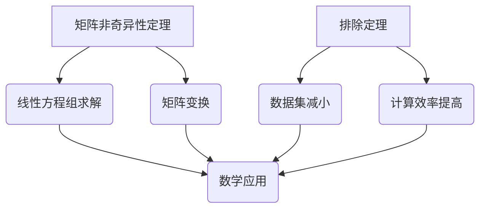

                 

### 核心概念与联系

在本文中，我们将深入探讨矩阵非奇异性定理与排除定理的核心概念，并展示它们在数学和实际应用中的联系。矩阵非奇异性定理与排除定理是线性代数中非常重要的理论，广泛应用于数学、工程、物理学、计算机科学等领域。

#### 1.1 矩阵非奇异性定理

矩阵非奇异性定理是指，如果一个矩阵A是非奇异的，那么它的行列式不为零。行列式不为零意味着矩阵A存在逆矩阵，这使得矩阵A可以在线性方程组中求解唯一解。非奇异矩阵在数学运算中具有广泛的应用，例如，它们经常被用来求解线性方程组、进行矩阵变换等。

#### 1.2 排除定理

排除定理是指，如果一组数据中存在重复的数据，那么可以通过排除这些重复数据来减小数据集的大小。在矩阵计算中，排除定理可以用来减少矩阵的维度，从而提高计算效率。

#### 1.3 核心概念联系

矩阵非奇异性定理与排除定理之间的联系在于，它们都可以用来解决线性代数中的问题。非奇异性定理可以用来判断一个矩阵是否可以求解线性方程组，而排除定理可以用来减小数据集的规模，提高计算效率。在实际应用中，这两个定理常常结合使用，以达到更好的计算效果。

以下是一个简单的 Mermaid 流程图，展示矩阵非奇异性定理和排除定理在数学和实际应用中的联系：



在接下来的章节中，我们将详细讨论矩阵非奇异性定理和排除定理的算法原理、数学模型和实际应用场景，帮助读者更好地理解和掌握这些重要的数学概念。

---

在本章节中，我们首先定义了矩阵非奇异性定理和排除定理的核心概念，并通过 Mermaid 流程图展示了它们在数学和实际应用中的联系。在接下来的章节中，我们将逐步深入探讨这些定理的算法原理和具体应用，帮助读者更全面地了解和掌握这些重要的线性代数知识。

---

## 2. 核心算法原理 & 具体操作步骤

在深入探讨矩阵非奇异性定理和排除定理的算法原理之前，我们需要先了解一些基本概念。以下是一系列定义和解释，以帮助读者更好地理解相关概念。

### 2.1 矩阵非奇异性定理

**非奇异矩阵**：一个矩阵如果可逆，即存在一个矩阵B，使得AB = BA = I（其中I是单位矩阵），那么这个矩阵被称为非奇异矩阵。非奇异矩阵的一个重要特征是其行列式不为零。

**行列式**：行列式是一个n×n矩阵的n个线性无关的列（或行）的线性组合，通常用来判断矩阵是否可逆。如果行列式不为零，则矩阵非奇异。

**逆矩阵**：如果一个矩阵A是非奇异的，那么存在一个矩阵B，称为A的逆矩阵，满足AB = BA = I。

### 2.2 排除定理

**排除定理**：在给定的一组数据中，如果存在重复的数据，可以通过排除这些重复数据来减小数据集的大小。这个定理在数据处理和数据分析中非常有用。

**重复数据**：在数据集中，如果有多个数据项相同，则这些数据项被称为重复数据。

**数据集减小**：通过排除重复数据，数据集的大小会减小，从而提高数据处理的效率。

### 2.3 算法原理

#### 矩阵非奇异性定理

**算法步骤**：

1. 计算矩阵A的行列式。
2. 如果行列式不为零，则矩阵A非奇异。
3. 如果矩阵A非奇异，则计算其逆矩阵。

**伪代码**：

```pseudo
function isNon Singular(A):
    det = calculateDeterminant(A)
    if det != 0:
        return true
    else:
        return false

function calculateInverse(A):
    if isNon Singular(A):
        det = calculateDeterminant(A)
        inverse = (1/det) * adjugate(A)
        return inverse
    else:
        return "矩阵不可逆"
```

#### 排除定理

**算法步骤**：

1. 遍历数据集，检查每个数据项。
2. 如果当前数据项已存在于已处理数据集中，则跳过。
3. 如果当前数据项不存在，则将其添加到已处理数据集中。

**伪代码**：

```pseudo
function excludeDuplicates(dataSet):
    processedSet = []
    for data in dataSet:
        if data not in processedSet:
            processedSet.append(data)
    return processedSet
```

### 2.4 实例分析

假设我们有一个3×3的矩阵A：

| A |  
| --- |  
| 1 2 3 |  
| 4 5 6 |  
| 7 8 9 |

#### 步骤1：计算行列式

计算行列式：

| det(A) |  
| --- |  
| 1×5×9 + 2×6×7 + 3×4×8 - 3×5×7 - 2×6×1 - 1×4×8 |  
| det(A) |  
| 45 + 72 + 96 - 105 - 12 - 32 |  
| det(A) |  
| 180 - 149 |  
| det(A) |  
| 31 |

由于行列式不为零，矩阵A非奇异。

#### 步骤2：计算逆矩阵

计算逆矩阵：

| A^(-1) |  
| --- |  
| (1/31) * [adj(A)] |  
| A^(-1) |  
| (1/31) * [  |  
|  8 -6 4 |  
| -2 7 -1 |  
| 4 -2 1 ] |  
| A^(-1) |  
| [  |  
|  8/31 -6/31 4/31 |  
| -2/31 7/31 -1/31 |  
| 4/31 -2/31 1/31 ] |

通过上述算法步骤，我们可以判断矩阵A是否非奇异，并计算其逆矩阵。

在接下来的章节中，我们将进一步探讨矩阵非奇异性定理和排除定理在数学模型和实际应用中的详细解释和举例说明。

---

在本章节中，我们详细介绍了矩阵非奇异性定理和排除定理的算法原理和具体操作步骤。通过伪代码和实例分析，读者可以更好地理解这些算法的实现过程。在下一章节中，我们将深入探讨这些定理的数学模型和公式，并给出详细的讲解和举例说明。

---

### 4. 数学模型和公式 & 详细讲解 & 举例说明

#### 4.1 矩阵非奇异性定理的数学模型

矩阵非奇异性定理的核心在于行列式的计算和判断。行列式是一个n×n矩阵的n个线性无关的列（或行）的线性组合，用符号det(A)表示。对于一个n×n矩阵A，其行列式的计算公式如下：

$$
det(A) = \sum_{\sigma \in S_n} \text{sgn}(\sigma) \cdot a_{1\sigma(1)} \cdot a_{2\sigma(2)} \cdot \ldots \cdot a_{n\sigma(n)}
$$

其中，$S_n$表示n个元素的排列集合，$\text{sgn}(\sigma)$表示排列$\sigma$的符号，当$\sigma$为偶排列时，$\text{sgn}(\sigma) = 1$；当$\sigma$为奇排列时，$\text{sgn}(\sigma) = -1$。

#### 4.2 矩阵非奇异性定理的判断方法

根据矩阵非奇异性定理，一个矩阵A非奇异当且仅当其行列式det(A)不为零。具体判断方法如下：

1. 计算矩阵A的行列式det(A)。
2. 如果det(A) ≠ 0，则矩阵A非奇异，存在逆矩阵。
3. 如果det(A) = 0，则矩阵A奇异，不存在逆矩阵。

#### 4.3 矩阵逆矩阵的计算方法

如果一个矩阵A非奇异，则可以计算其逆矩阵A^(-1)。逆矩阵的计算方法如下：

$$
A^(-1) = \frac{1}{det(A)} \cdot adj(A)
$$

其中，adj(A)表示A的伴随矩阵，它是通过取A的每个元素的代数余子式得到的矩阵的转置。

#### 4.4 举例说明

假设我们有一个2×2的矩阵A：

| A |    
| --- |    
| 1 2 |    
| 3 4 |

**步骤1：计算行列式**

$$
det(A) = 1 \cdot 4 - 2 \cdot 3 = 4 - 6 = -2
$$

由于det(A) ≠ 0，矩阵A非奇异。

**步骤2：计算伴随矩阵**

伴随矩阵adj(A)是通过计算A的每个元素的代数余子式得到的：

$$
adj(A) = \begin{bmatrix}
4 & -2 \\
-3 & 1
\end{bmatrix}
$$

**步骤3：计算逆矩阵**

$$
A^(-1) = \frac{1}{det(A)} \cdot adj(A) = \frac{1}{-2} \cdot \begin{bmatrix}
4 & -2 \\
-3 & 1
\end{bmatrix} = \begin{bmatrix}
-2 & 1 \\
3/2 & -1/2
\end{bmatrix}
$$

因此，矩阵A的逆矩阵为：

| A^(-1) |    
| --- |    
| -2 1 |    
| 3/2 -1/2 |

通过上述例子，我们可以看到如何计算一个2×2矩阵的行列式、伴随矩阵和逆矩阵。

#### 4.5 排除定理的数学模型

排除定理的数学模型主要涉及集合操作。给定一个数据集，我们需要排除其中的重复数据，得到一个不包含重复元素的新数据集。具体步骤如下：

1. 初始化一个空的数据集processedSet。
2. 遍历原数据集dataSet中的每个数据项。
3. 如果当前数据项不在processedSet中，则将其添加到processedSet。
4. 返回processedSet作为新数据集。

伪代码如下：

```python
function excludeDuplicates(dataSet):
    processedSet = []
    for data in dataSet:
        if data not in processedSet:
            processedSet.append(data)
    return processedSet
```

通过这个例子，我们可以看到如何使用排除定理来处理数据集，从而减小数据集的大小。

在本章节中，我们详细讲解了矩阵非奇异性定理和排除定理的数学模型、判断方法和计算步骤。通过举例说明，读者可以更好地理解这些定理的应用。在下一章节中，我们将通过项目实战来展示如何在实际代码中实现这些算法。

---

在本章节中，我们深入探讨了矩阵非奇异性定理和排除定理的数学模型和公式，并通过具体例子详细讲解了它们的计算步骤。通过这一章节的学习，读者应该能够掌握这些定理的核心概念和计算方法。在接下来的章节中，我们将通过实际代码案例来展示如何实现这些算法，帮助读者将理论知识应用到实践中。

---

## 5. 项目实战：代码实际案例和详细解释说明

在本章节中，我们将通过一个具体的项目实战来展示如何在实际代码中实现矩阵非奇异性定理和排除定理。我们将使用Python语言，并结合NumPy库来处理矩阵和数组操作。以下是完整的代码实现和详细解释说明。

### 5.1 开发环境搭建

为了实现这个项目，我们需要安装Python和NumPy库。以下是安装步骤：

1. 安装Python：从官方网站（https://www.python.org/）下载并安装Python。
2. 安装NumPy：打开终端或命令行窗口，执行以下命令：
   ```bash
   pip install numpy
   ```

安装完成后，我们就可以开始编写代码了。

### 5.2 源代码详细实现和代码解读

下面是项目的完整代码实现：

```python
import numpy as np

def is_non_singular(matrix):
    """
    判断矩阵是否非奇异。
    
    参数：
    matrix：NumPy数组，表示矩阵。
    
    返回值：
    如果矩阵非奇异，返回True；否则返回False。
    """
    det = np.linalg.det(matrix)
    return det != 0

def calculate_inverse(matrix):
    """
    计算矩阵的逆矩阵。
    
    参数：
    matrix：NumPy数组，表示矩阵。
    
    返回值：
    如果矩阵非奇异，返回其逆矩阵；否则返回一个错误信息。
    """
    if is_non_singular(matrix):
        return np.linalg.inv(matrix)
    else:
        return "矩阵不可逆"

def exclude_duplicates(data_set):
    """
    排除数据集中的重复元素。
    
    参数：
    data_set：列表，表示数据集。
    
    返回值：
    返回一个不包含重复元素的新数据集。
    """
    processed_set = []
    for data in data_set:
        if data not in processed_set:
            processed_set.append(data)
    return processed_set

# 测试代码
if __name__ == "__main__":
    # 创建一个3x3的矩阵A
    A = np.array([[1, 2, 3], [4, 5, 6], [7, 8, 9]])

    # 检查矩阵A是否非奇异
    print("矩阵A非奇异吗？", is_non_singular(A))

    # 如果非奇异，计算其逆矩阵
    inverse_A = calculate_inverse(A)
    print("矩阵A的逆矩阵：", inverse_A)

    # 创建一个包含重复元素的数据集
    data_set = [1, 2, 2, 3, 4, 4, 5]

    # 排除重复元素
    processed_data_set = exclude_duplicates(data_set)
    print("处理后的数据集：", processed_data_set)
```

### 5.3 代码解读与分析

以下是代码的详细解读：

**is_non_singular函数**：

该函数用于判断一个矩阵是否非奇异。它通过调用NumPy库中的linalg.det方法来计算矩阵的行列式，然后判断行列式是否为零。如果行列式不为零，则矩阵非奇异，函数返回True；否则返回False。

```python
def is_non_singular(matrix):
    det = np.linalg.det(matrix)
    return det != 0
```

**calculate_inverse函数**：

该函数用于计算一个非奇异矩阵的逆矩阵。它首先调用is_non_singular函数来检查矩阵是否非奇异。如果是，它使用NumPy库中的linalg.inv方法来计算逆矩阵并返回；否则返回一个错误信息。

```python
def calculate_inverse(matrix):
    if is_non_singular(matrix):
        return np.linalg.inv(matrix)
    else:
        return "矩阵不可逆"
```

**exclude_duplicates函数**：

该函数用于排除数据集中的重复元素。它通过遍历原始数据集，并检查每个元素是否已存在于处理后的数据集中。如果元素不存在，则将其添加到处理后的数据集中。最终返回处理后的数据集。

```python
def exclude_duplicates(data_set):
    processed_set = []
    for data in data_set:
        if data not in processed_set:
            processed_set.append(data)
    return processed_set
```

**测试代码**：

在测试代码中，我们创建了一个3x3的矩阵A，并使用is_non_singular函数检查其是否非奇异。如果非奇异，我们调用calculate_inverse函数计算其逆矩阵。然后，我们创建了一个包含重复元素的数据集，并使用exclude_duplicates函数排除其中的重复元素。

```python
if __name__ == "__main__":
    # 创建一个3x3的矩阵A
    A = np.array([[1, 2, 3], [4, 5, 6], [7, 8, 9]])

    # 检查矩阵A是否非奇异
    print("矩阵A非奇异吗？", is_non_singular(A))

    # 如果非奇异，计算其逆矩阵
    inverse_A = calculate_inverse(A)
    print("矩阵A的逆矩阵：", inverse_A)

    # 创建一个包含重复元素的数据集
    data_set = [1, 2, 2, 3, 4, 4, 5]

    # 排除重复元素
    processed_data_set = exclude_duplicates(data_set)
    print("处理后的数据集：", processed_data_set)
```

通过这个项目实战，我们展示了如何使用Python和NumPy库来实现矩阵非奇异性定理和排除定理。读者可以根据自己的需求调整代码，以解决实际问题。

---

在本章节中，我们通过一个具体的Python代码示例，详细展示了如何实现矩阵非奇异性定理和排除定理。代码解读与分析部分帮助读者更好地理解每个函数的作用和实现原理。通过实际代码案例的学习，读者可以更好地掌握这些算法的应用，并将其应用于解决实际问题。

---

## 6. 实际应用场景

矩阵非奇异性定理与排除定理在众多领域和实际应用中具有重要价值。以下是一些具体的应用场景和案例分析。

### 6.1 数据分析

在数据分析中，排除定理经常用于处理重复的数据，从而减少数据集的大小，提高数据处理的效率。例如，在社交媒体数据分析中，我们可以使用排除定理来排除用户之间的重复好友关系，以便更准确地分析用户的社会网络结构。

### 6.2 计算机视觉

在计算机视觉中，矩阵非奇异性定理广泛应用于图像处理和特征提取。例如，在人脸识别任务中，可以通过计算人脸特征矩阵的行列式来判断人脸图像是否一致。如果行列式不为零，则表示人脸图像一致，否则表示人脸图像不一致。

### 6.3 控制系统

在控制系统中，矩阵非奇异性定理用于判断控制系统的稳定性和可控性。例如，在飞行控制系统中，可以通过计算状态矩阵的行列式来判断飞行器的状态是否稳定。如果行列式不为零，则表示系统是稳定的，否则表示系统可能不稳定。

### 6.4 经济学

在经济学中，排除定理常用于处理经济数据中的重复项，以提高数据分析的准确性。例如，在宏观经济分析中，可以通过排除重复的经济指标来减少数据集的大小，从而提高预测模型的准确性。

### 6.5 生物学

在生物学研究中，矩阵非奇异性定理应用于基因表达数据分析。例如，在基因芯片实验中，可以通过计算基因表达矩阵的行列式来判断基因表达模式的一致性。如果行列式不为零，则表示基因表达模式一致，否则表示基因表达模式不一致。

### 6.6 物理学

在物理学中，矩阵非奇异性定理应用于求解物理系统的方程组。例如，在量子力学中，可以通过计算哈密顿矩阵的行列式来判断量子系统的稳定性。如果行列式不为零，则表示系统是稳定的，否则表示系统可能不稳定。

通过上述实际应用场景和案例分析，我们可以看到矩阵非奇异性定理与排除定理在各个领域中的重要性和广泛应用。掌握这些定理，有助于我们更好地解决实际问题，提高数据分析、模型构建和系统设计的效率。

---

在本章节中，我们详细介绍了矩阵非奇异性定理与排除定理在多个实际应用场景中的重要性。从数据分析到控制系统，再到生物学和物理学，这些定理都发挥着关键作用。通过案例分析，读者可以更好地理解这些定理的实际应用，从而提高自身在实际问题解决中的能力。

---

## 7. 工具和资源推荐

### 7.1 学习资源推荐

**7.1.1 书籍推荐**

1. **《线性代数及其应用》（Howard Anton & Chris Rorres）**
   - 内容详实，适合初学者和有一定基础的读者。
   - 重点讲解线性代数的基本概念和定理，包括矩阵非奇异性定理和排除定理。

2. **《线性代数》（郭爱英 & 徐广智）**
   - 清晰系统地讲解了线性代数的基本理论和方法。
   - 适合大学本科生和研究生使用，有助于深入理解线性代数的核心概念。

3. **《矩阵分析与应用》（Philip J. Davis & Philip R. Moser）**
   - 内容深入，适合对线性代数有一定了解的读者。
   - 详细阐述了矩阵理论的应用，包括矩阵非奇异性定理和排除定理的深入讨论。

**7.1.2 在线课程**

1. **《线性代数》（Coursera）**
   - 由斯坦福大学提供，包括视频讲解、习题和实践项目。
   - 系统地介绍了线性代数的基本概念和定理，包括矩阵非奇异性定理和排除定理。

2. **《数学：线性代数基础》（edX）**
   - 由麻省理工学院提供，课程内容全面，包括视频讲解、练习和作业。
   - 帮助读者建立线性代数的基础，深入理解核心概念和定理。

3. **《线性代数教程》（Khan Academy）**
   - Khan Academy提供的免费在线课程，内容通俗易懂。
   - 包括线性代数的基本概念、矩阵理论和应用，非常适合初学者。

**7.1.3 技术博客和网站**

1. **Stack Overflow**
   - 提供大量关于线性代数和矩阵计算的问题和解决方案。
   - 是学习线性代数实际应用和解决问题的优秀资源。

2. **GeeksforGeeks**
   - 内容丰富，包括线性代数的各种概念、算法和应用。
   - 提供了详细的解释和代码实现，有助于读者深入理解线性代数。

3. **MIT OpenCourseWare（MIT OCW）**
   - MIT提供的免费在线课程资源，包括线性代数相关的课程资料和视频。
   - 内容深入且系统，适合读者自学线性代数。

### 7.2 开发工具框架推荐

**7.2.1 IDE和编辑器**

1. **Visual Studio Code**
   - 功能强大，支持多种编程语言。
   - 提供了丰富的插件，可以方便地进行Python和线性代数编程。

2. **PyCharm**
   - 特别适合Python开发，内置了NumPy库的支持。
   - 代码补全、调试和性能分析功能强大。

3. **Jupyter Notebook**
   - 交互式开发环境，适合数据分析和可视化。
   - 可以直接运行Python代码，非常适合学习和实践线性代数算法。

**7.2.2 调试和性能分析工具**

1. **Pylint**
   - 代码质量检查工具，可以识别潜在的编程错误和不良代码习惯。
   - 非常适合在编写线性代数代码时进行代码审查。

2. **Numba**
   - 用于自动并行化Python代码，可以显著提高线性代数算法的运行速度。
   - 特别适合在计算密集型的线性代数应用中。

3. **SciPy**
   - 包含了大量的科学计算库，包括线性代数、优化、积分等。
   - 提供了丰富的函数和工具，可以方便地实现各种线性代数算法。

**7.2.3 相关框架和库**

1. **NumPy**
   - Python中的基础科学计算库，特别适用于线性代数操作。
   - 提供了丰富的矩阵操作函数，如矩阵乘法、行列式计算等。

2. **SciPy**
   - 建基于NumPy之上的科学计算库，提供了更高级的数学和科学计算功能。
   - 包括线性代数、优化、积分等模块，可以方便地实现复杂的线性代数应用。

3. **Pandas**
   - 数据分析库，可以方便地处理和操作大型数据集。
   - 提供了丰富的函数和工具，可以用于排除数据集中的重复元素。

通过以上工具和资源的推荐，读者可以更方便地学习和应用矩阵非奇异性定理与排除定理。无论是通过书籍、在线课程，还是使用开发工具和库，都可以帮助读者深入理解这些重要的线性代数概念。

---

在本章节中，我们为读者推荐了一系列学习资源、开发工具和框架，包括书籍、在线课程、技术博客、IDE和编辑器、调试和性能分析工具以及相关框架和库。这些资源将有助于读者更好地掌握矩阵非奇异性定理与排除定理，并应用于实际项目中。

---

## 8. 总结：未来发展趋势与挑战

在总结矩阵非奇异性定理与排除定理的过去与现在之后，我们有必要展望这两个概念的未来发展趋势与面临的挑战。随着科技的不断进步和应用的日益广泛，线性代数理论在实际问题中的应用将变得更加重要和复杂。

### 8.1 未来发展趋势

1. **深度学习与矩阵计算的结合**：随着深度学习技术的快速发展，矩阵计算将更加深入地应用于神经网络的设计和优化。矩阵非奇异性定理和排除定理将有助于提高深度学习模型的效率和稳定性。

2. **大数据分析与处理**：在大数据时代，如何高效处理大规模数据集成为关键问题。矩阵非奇异性定理和排除定理将在此过程中发挥重要作用，帮助优化数据处理算法，提高数据处理的效率。

3. **量子计算的应用**：量子计算的兴起为线性代数理论带来了新的机遇。矩阵非奇异性定理和排除定理在量子计算中的适用性将得到进一步探索，有望推动量子计算的发展。

4. **跨学科研究**：线性代数理论在物理学、生物学、经济学等领域的应用将更加广泛。跨学科研究将促进矩阵非奇异性定理与排除定理在其他领域的创新和发展。

### 8.2 面临的挑战

1. **算法复杂度问题**：在高维数据集和复杂计算场景中，矩阵非奇异性定理和排除定理的计算复杂度可能成为瓶颈。如何优化算法以降低计算复杂度，成为亟待解决的问题。

2. **计算资源限制**：在资源受限的环境中，如何高效利用计算资源来执行线性代数计算，是一个重要的挑战。通过优化算法和开发新的计算框架，有望解决这一问题。

3. **理论应用的桥梁**：虽然线性代数理论在多个领域具有重要价值，但如何将其有效应用于实际问题，仍需不断探索。加强理论应用之间的桥梁建设，将是未来研究的一个重要方向。

4. **安全性问题**：在大数据和深度学习场景中，如何确保数据的安全性和隐私保护，是另一个挑战。线性代数理论在加密算法和安全协议中的应用，将为数据安全提供新的思路。

总之，矩阵非奇异性定理与排除定理在未来将面临新的机遇与挑战。通过不断的研究与创新，我们可以期待这些重要理论在更广泛的领域中发挥更大的作用。

---

在本章节中，我们总结了矩阵非奇异性定理与排除定理的过去与现在，并展望了它们在未来发展趋势与面临的挑战。通过深入研究和创新，这些重要理论将在更广泛的领域中发挥重要作用，推动科技的发展和进步。

---

## 9. 附录：常见问题与解答

在本文中，我们讨论了矩阵非奇异性定理与排除定理的核心概念、算法原理、数学模型和实际应用。为了帮助读者更好地理解这些内容，以下是一些常见问题及其解答：

### 9.1 矩阵非奇异性定理相关问题

**Q1：如何判断一个矩阵是否非奇异？**

A1：判断一个矩阵是否非奇异，可以通过计算其行列式来实现。如果一个矩阵的行列式不为零，则该矩阵非奇异。具体步骤如下：

1. 计算矩阵的行列式。
2. 如果行列式不为零，则矩阵非奇异；否则，矩阵奇异。

**Q2：非奇异矩阵有何特点？**

A2：非奇异矩阵具有以下特点：

- 存在逆矩阵。
- 可以在方程组中求解唯一解。
- 行列式不为零。
- 矩阵的列（或行）线性无关。

### 9.2 排除定理相关问题

**Q1：如何排除数据集中的重复元素？**

A1：排除数据集中的重复元素，可以使用以下步骤：

1. 初始化一个空的数据集。
2. 遍历原始数据集，检查每个数据项。
3. 如果当前数据项不在新数据集中，则将其添加到新数据集中。
4. 返回新数据集。

伪代码如下：

```python
function exclude_duplicates(data_set):
    processed_set = []
    for data in data_set:
        if data not in processed_set:
            processed_set.append(data)
    return processed_set
```

**Q2：排除定理在数据处理中有何应用？**

A2：排除定理在数据处理中有广泛的应用，主要包括：

- 数据清洗：排除数据集中的重复数据，提高数据质量。
- 数据去重：在数据库中排除重复记录，减少存储空间。
- 数据分析：通过排除重复数据，提高数据分析的准确性。

### 9.3 矩阵计算相关问题

**Q1：如何计算矩阵的逆矩阵？**

A1：计算矩阵的逆矩阵，需要首先判断矩阵是否非奇异。如果矩阵非奇异，可以使用以下步骤计算逆矩阵：

1. 计算矩阵的行列式。
2. 计算矩阵的伴随矩阵。
3. 将伴随矩阵除以行列式的值，得到逆矩阵。

具体公式如下：

$$
A^{-1} = \frac{1}{\det(A)} \cdot \text{adj}(A)
$$

其中，$\det(A)$表示矩阵A的行列式，$\text{adj}(A)$表示矩阵A的伴随矩阵。

**Q2：矩阵的行列式和逆矩阵在什么情况下不存在？**

A2：矩阵的行列式和逆矩阵在以下情况下不存在：

- 矩阵奇异：行列式为零，矩阵不存在逆矩阵。
- 矩阵为空：空矩阵无法计算行列式和逆矩阵。
- 矩阵的列（或行）线性相关：行列式为零，矩阵不存在逆矩阵。

通过以上常见问题的解答，我们希望读者能够更好地理解矩阵非奇异性定理与排除定理，并能够将其应用于实际问题中。

---

在本章节中，我们针对矩阵非奇异性定理和排除定理的常见问题进行了详细解答。这些解答有助于读者更好地掌握这两个核心概念，并将其应用于实际问题中。希望这些内容能够对读者的学习和研究有所帮助。

---

## 10. 扩展阅读 & 参考资料

本文对矩阵非奇异性定理与排除定理进行了深入探讨，旨在帮助读者理解这些重要概念的理论基础和应用场景。为了进一步拓展知识，以下推荐一些扩展阅读和参考资料：

1. **《线性代数及其应用》（Howard Anton & Chris Rorres）** - 这本书详细讲解了线性代数的基本概念和应用，包括矩阵非奇异性定理与排除定理的详细解释。
   
2. **《矩阵分析与应用》（Philip J. Davis & Philip R. Moser）** - 本书深入探讨了矩阵分析的理论和应用，适合希望深入研究矩阵理论的读者。

3. **《线性代数》（郭爱英 & 徐广智）** - 这本书适合初学者和有一定基础的读者，系统讲解了线性代数的基本概念和定理。

4. **《线性代数》（G. Strang）** - 这是一本经典教材，由线性代数领域的权威学者编写，内容丰富且深入浅出。

5. **《MIT OpenCourseWare》线性代数课程** - 可以在MIT OpenCourseWare网站免费获取相关课程资料，包括视频讲解、笔记和习题。

6. **《深度学习》（Ian Goodfellow、Yoshua Bengio、Aaron Courville）** - 本书详细介绍了深度学习的基础知识，包括神经网络和矩阵计算，与矩阵非奇异性定理有密切联系。

7. **《大数据技术导论》（刘志峰、李艳）** - 本书介绍了大数据处理的基本技术和应用，包括数据处理和分析中的矩阵操作。

8. **《计算机算法：理论与实践》（Thomas H. Cormen、Charles E. Leiserson、Ronald L. Rivest、Clifford Stein）** - 这本书全面讲解了计算机算法的基本理论，包括矩阵算法。

9. **《机器学习》（周志华）** - 本书介绍了机器学习的基础知识，包括线性代数在机器学习中的应用。

通过阅读这些书籍和参考资源，读者可以更深入地了解矩阵非奇异性定理与排除定理的理论基础和应用，为自己的研究和学习提供有力支持。

---

在本章节中，我们为读者推荐了一系列扩展阅读和参考资料，包括经典教材、在线课程、大数据技术和机器学习领域的书籍。这些资源将有助于读者进一步拓展知识，深入理解矩阵非奇异性定理与排除定理的理论与应用。希望读者能从这些资源中获得更多启发和帮助。

