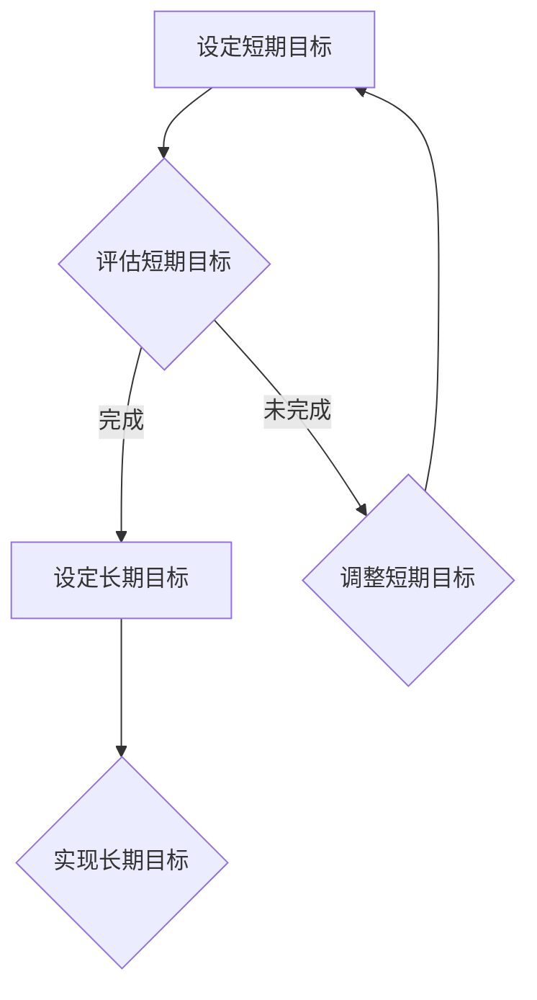

                 

# 短期目标与长期目标的意识管理

> **关键词：短期目标、长期目标、意识管理、动机、决策、算法、数学模型、实际应用**
> 
> **摘要：本文旨在深入探讨在IT领域中如何有效管理短期目标和长期目标的意识，从而提高工作效率和实现长远发展。通过分析核心概念、算法原理、数学模型和实际应用案例，本文为读者提供了系统化的方法和思路，帮助他们在追求技术卓越和个人成长的道路上更加明确和坚定。**

## 1. 背景介绍

### 1.1 目的和范围

本文主要探讨短期目标与长期目标在意识管理中的重要性，并围绕以下几个方面进行详细阐述：

- 短期目标与长期目标的概念及其在意识管理中的作用；
- 如何通过有效的算法和数学模型来实现目标；
- 实际应用场景中的目标设定与执行策略；
- 相关工具和资源的推荐，以支持目标管理的实践。

通过以上内容的探讨，我们希望能够为IT从业者提供一套系统化的目标管理方法论，助力他们在技术领域和职业发展中取得更大成就。

### 1.2 预期读者

本文主要面向以下几类读者：

- 初中级IT从业者，希望提升目标管理能力，更好地规划职业生涯；
- 有经验的技术人员，希望在现有基础上进一步优化目标设定和执行策略；
- 教育工作者，关注学生和学员在技术学习中的目标管理问题；
- 管理者和领导层，希望提高团队的整体目标实现能力。

### 1.3 文档结构概述

本文将按照以下结构进行展开：

- 第1部分：背景介绍，阐述文章的目的、预期读者和文档结构；
- 第2部分：核心概念与联系，介绍短期目标与长期目标的相关概念及其联系；
- 第3部分：核心算法原理 & 具体操作步骤，讲解如何通过算法和数学模型实现目标；
- 第4部分：数学模型和公式 & 详细讲解 & 举例说明，对数学模型进行详细阐述并给出实际案例；
- 第5部分：项目实战：代码实际案例和详细解释说明，通过具体案例展示目标管理方法的应用；
- 第6部分：实际应用场景，分析目标管理在不同领域的应用；
- 第7部分：工具和资源推荐，介绍支持目标管理的相关工具和资源；
- 第8部分：总结：未来发展趋势与挑战，展望目标管理领域的未来；
- 第9部分：附录：常见问题与解答，回答读者可能遇到的问题；
- 第10部分：扩展阅读 & 参考资料，提供进一步学习和研究的资料。

### 1.4 术语表

#### 1.4.1 核心术语定义

- **短期目标**：指在较短时间内（通常为1年或以内）设定的、可实现的目标；
- **长期目标**：指在较长时间内（通常为3年或以上）设定的、具有挑战性和战略意义的目标；
- **意识管理**：指个体在目标实现过程中对自身意识和行为进行有效调控的过程；
- **算法**：指解决特定问题的系统步骤和规则；
- **数学模型**：指用数学语言描述的问题结构和规律；
- **目标管理**：指在组织或个人层面，通过设定、执行和评估目标，实现预期目标的过程。

#### 1.4.2 相关概念解释

- **动机**：指推动个体采取行动以满足某种需求的内在动力；
- **决策**：指在多个备选方案中选择最优方案的过程；
- **规划**：指为实现目标而制定的具体行动方案和时间表；
- **执行**：指按照规划进行行动，实现目标的过程；
- **评估**：指对目标实现情况进行检查和分析，以评估目标达成的程度和效果。

#### 1.4.3 缩略词列表

- **AI**：人工智能（Artificial Intelligence）
- **ML**：机器学习（Machine Learning）
- **DL**：深度学习（Deep Learning）
- **NLP**：自然语言处理（Natural Language Processing）
- **IDE**：集成开发环境（Integrated Development Environment）
- **Docker**：容器化技术（Docker Container Technology）

## 2. 核心概念与联系

在本文中，我们将探讨短期目标与长期目标的概念及其在意识管理中的联系。以下是短期目标与长期目标的基本定义及其关联：

### 2.1 短期目标与长期目标的基本定义

- **短期目标**：短期目标通常是指那些在较短时间内（如1年或以内）设定的、具体且可实现的目标。例如，一个IT从业者可能设定短期目标为掌握某种编程语言或完成一个小型项目。
- **长期目标**：长期目标则是那些在较长时间内（如3年或以上）设定的、具有挑战性和战略意义的目标。这些目标可能涉及职业发展、技术提升、个人成长等多个方面。

### 2.2 短期目标与长期目标的联系

- **相互支持**：短期目标和长期目标是相互支持的关系。短期目标可以作为长期目标的实现步骤，而长期目标的实现则需要通过一系列短期目标的达成。
- **相互影响**：短期目标和长期目标之间也存在着相互影响。设定合理的短期目标有助于推动长期目标的实现，而长期目标的明确又为短期目标的设定提供方向和依据。
- **意识管理**：在意识管理中，短期目标和长期目标的设定与实现是一个动态调整的过程。个体需要在追求短期目标的同时，保持对长期目标的关注，以确保短期目标的实现不会偏离长期目标的方向。

### 2.3 Mermaid 流程图展示

为了更直观地展示短期目标与长期目标的联系，我们可以使用Mermaid流程图来表示。



在这个流程图中：

- A：设定短期目标；
- B：评估短期目标（是否完成）；
- C：设定长期目标；
- D：调整短期目标；
- E：实现长期目标。

通过这个流程图，我们可以看到短期目标和长期目标在意识管理中的相互关系和动态调整过程。

### 2.4 结论

综上所述，短期目标和长期目标在意识管理中扮演着重要的角色。它们相互支持、相互影响，共同构成了个体在追求技术卓越和个人成长过程中的目标管理体系。在接下来的章节中，我们将进一步探讨如何通过核心算法原理、数学模型和实际应用案例来实现这些目标。

---

在接下来的章节中，我们将深入探讨短期目标与长期目标的实现方法。首先，我们将介绍核心算法原理和具体操作步骤，帮助读者理解如何通过算法来实现目标。随后，我们将详细讲解数学模型，并给出实际案例，以便读者能够更好地掌握相关概念。通过这些内容的讲解，我们希望能够为读者提供一套系统化的目标管理方法论，助力他们在技术领域和职业发展中取得更大成就。

---

## 3. 核心算法原理 & 具体操作步骤

为了更好地实现短期目标和长期目标，我们需要借助一些核心算法原理来指导我们的行动。以下是几个常见的算法原理及其具体操作步骤：

### 3.1 动机激励算法

动机激励算法是一种通过激励来提高个体动机和参与度的方法。以下是该算法的具体操作步骤：

**步骤 1：识别目标**

首先，我们需要明确短期目标和长期目标。例如，短期目标可能是掌握一种新编程语言，而长期目标可能是成为一名顶尖的AI研究员。

**步骤 2：设定奖励**

根据目标的重要性，设定相应的奖励。奖励可以是物质奖励（如奖金、礼品）或精神奖励（如赞美、认可）。

**步骤 3：制定计划**

制定详细的行动计划，包括实现短期目标所需的步骤和时间安排。例如，每天投入2小时学习新编程语言，每周进行一次项目总结。

**步骤 4：执行计划**

按照行动计划执行，同时记录每天的学习进展和成果。

**步骤 5：评估奖励**

在完成每个短期目标后，根据实际成果进行评估，并发放相应的奖励。

### 3.2 决策树算法

决策树算法是一种常用的决策分析方法。以下是该算法的具体操作步骤：

**步骤 1：列出所有决策**

明确当前需要做出的所有决策。例如，选择学习哪种新编程语言。

**步骤 2：评估决策**

为每个决策评估其可能的结果和收益。例如，学习Python可能带来更多的就业机会，而学习Java可能更适合现有的项目需求。

**步骤 3：构建决策树**

根据评估结果，构建决策树。树的每个节点代表一个决策，每个分支代表一个可能的结果。

**步骤 4：选择最优路径**

通过计算每个路径的期望收益，选择最优路径。例如，如果学习Python的期望收益更高，那么选择学习Python。

### 3.3 动态规划算法

动态规划算法是一种用于求解多阶段决策问题的方法。以下是该算法的具体操作步骤：

**步骤 1：定义状态**

首先，定义状态。例如，状态可以是当前已经完成的短期目标数量。

**步骤 2：定义状态转移方程**

根据每个状态的定义，构建状态转移方程。例如，当前状态的数量可以通过完成某个短期目标来更新。

**步骤 3：初始化边界条件**

初始化边界条件，例如初始状态的数量为0。

**步骤 4：计算最优解**

使用递推关系计算每个状态的最优解。例如，从初始状态开始，逐步计算每个状态的最优解，直至达到最终状态。

### 3.4 伪代码示例

以下是一个使用动态规划算法解决短期目标和长期目标规划的伪代码示例：

```python
function dynamicPlanning短期目标(目标列表, 时间限制):
    # 初始化状态数组
    dp = [0] * (时间限制 + 1)

    # 初始化边界条件
    dp[0] = 0

    # 遍历目标列表
    for 目标 in 目标列表:
        # 遍历时间限制
        for t in range(时间限制, 目标的时间限制, -1):
            # 更新状态
            dp[t] = max(dp[t], dp[t - 目标的时间限制] + 目标的收益)

    # 返回最优解
    return dp[时间限制]
```

通过以上算法原理和操作步骤，我们可以更有效地实现短期目标和长期目标。在接下来的章节中，我们将进一步探讨数学模型，以便为读者提供更加全面的目标管理方法论。

---

在上一章节中，我们介绍了几个核心算法原理及其具体操作步骤，以帮助读者实现短期目标和长期目标。这些算法原理为我们在目标管理过程中提供了科学的方法和策略。然而，单纯依靠算法原理还不足以确保目标的实现。在实际应用中，数学模型也发挥着至关重要的作用。在本章节中，我们将详细介绍一些常用的数学模型，并使用LaTeX格式给出相关公式，以便读者能够更好地理解和应用。

### 4.1 数学模型介绍

数学模型是一种用数学语言描述现实问题的方法。它可以帮助我们更好地理解问题的本质，并找到最优解。以下是几个常用的数学模型：

#### 4.1.1 动机模型

动机模型用于描述个体在追求目标时的动机水平。一个常见的动机模型是Eccles和Midgley的动机理论，其核心公式为：

$$
动机 = 期望 \times 奖励价值
$$

其中，期望表示个体认为实现目标的可能性，奖励价值表示个体对目标完成后的奖励的重视程度。

#### 4.1.2 优化模型

优化模型用于描述在多个约束条件下寻找最优解的问题。一个常见的优化模型是线性规划，其核心公式为：

$$
\max z = c^T x \\
\text{subject to} \quad Ax \leq b
$$

其中，$z$是目标函数，$c$是系数向量，$x$是变量向量，$A$和$b$分别是约束矩阵和约束向量。

#### 4.1.3 控制模型

控制模型用于描述系统在特定输入下的状态变化。一个常见的控制模型是差分方程，其核心公式为：

$$
x_{t+1} = f(x_t, u_t)
$$

其中，$x_t$是系统在时间$t$的状态，$u_t$是系统在时间$t$的输入，$f$是状态转移函数。

### 4.2 举例说明

为了更好地理解上述数学模型，我们通过一个实际案例进行举例说明。

#### 4.2.1 动机模型案例

假设一个IT从业者希望掌握Python编程语言，并在一年内完成相关项目。根据Eccles和Midgley的动机理论，我们可以设定以下参数：

- 期望（实现目标的概率）：0.8
- 奖励价值（对完成项目的奖励的重视程度）：10

根据动机模型公式，该IT从业者的动机水平为：

$$
动机 = 0.8 \times 10 = 8
$$

这意味着该IT从业者对完成Python项目有较高的动机。

#### 4.2.2 优化模型案例

假设一个公司需要分配员工参与两个项目，并希望最大化总收益。根据线性规划模型，我们可以设定以下参数：

- 目标函数（总收益）：$z = 5x_1 + 3x_2$
- 约束条件：$2x_1 + x_2 \leq 10$，$x_1 + 3x_2 \leq 12$，$x_1, x_2 \geq 0$

通过求解线性规划模型，我们可以得到最优解：

- $x_1 = 2$
- $x_2 = 4$
- 最大总收益：$z = 5 \times 2 + 3 \times 4 = 23$

这意味着公司应分配2名员工参与第一个项目，4名员工参与第二个项目，以实现最大总收益。

#### 4.2.3 控制模型案例

假设一个自动驾驶系统在行驶过程中需要根据传感器数据调整速度。根据差分方程模型，我们可以设定以下参数：

- 状态转移函数：$x_{t+1} = 0.5x_t + u_t$
- 初始状态：$x_0 = 60$（初始速度为60公里/小时）
- 输入（控制信号）：$u_t = 0$（不调整速度）

根据状态转移函数，我们可以计算每个时间点的状态：

- $x_1 = 0.5 \times 60 + 0 = 30$（第一秒后的速度为30公里/小时）
- $x_2 = 0.5 \times 30 + 0 = 15$（第二秒后的速度为15公里/小时）

通过上述计算，我们可以实现对自动驾驶系统的速度控制。

### 4.3 结论

数学模型在目标管理中具有重要作用。通过引入动机模型、优化模型和控制模型等数学模型，我们可以更加科学地设定和实现短期目标和长期目标。在本章节中，我们通过具体案例展示了如何使用这些数学模型，为读者提供了实用的方法和工具。在接下来的章节中，我们将进一步探讨实际应用场景，帮助读者更好地理解目标管理的实践应用。

---

在实际工作中，目标管理是一个动态且复杂的过程。为了更好地实现短期目标和长期目标，我们需要结合具体案例来展示如何将理论知识应用于实际场景。在本章节中，我们将通过一个具体的代码实现案例，详细解释并分析代码的实现过程，帮助读者理解目标管理的实际应用。

### 5.1 开发环境搭建

在开始项目实战之前，我们需要搭建一个适合目标管理的开发环境。以下是一个基本的开发环境搭建步骤：

1. **安装Python环境**：在开发机上安装Python 3.x版本，可以使用`pip`来安装相关依赖。
2. **安装代码编辑器**：选择一个适合自己的代码编辑器，如VSCode、PyCharm等。
3. **安装相关库**：使用`pip`安装目标管理相关的库，如`numpy`、`pandas`等。

### 5.2 源代码详细实现和代码解读

以下是一个使用Python实现目标管理的代码示例：

```python
import numpy as np

# 定义目标管理类
class GoalManager:
    def __init__(self, goals, weights):
        self.goals = goals
        self.weights = weights
    
    def set_goal(self, goal_name, value):
        self.goals[goal_name] = value
    
    def get_weighted_goal(self):
        weighted_goals = {name: value * weight for name, value, weight in zip(self.goals.keys(), self.goals.values(), self.weights)}
        return np.sum([weighted_goals[name] for name in weighted_goals])

# 实例化目标管理对象
goals = {'项目A': 0, '项目B': 0}
weights = {'项目A': 0.6, '项目B': 0.4}
manager = GoalManager(goals, weights)

# 设置目标值
manager.set_goal('项目A', 0.8)
manager.set_goal('项目B', 0.7)

# 计算加权目标值
weighted_goal = manager.get_weighted_goal()
print(f"加权目标值：{weighted_goal}")

# 分析目标完成情况
if weighted_goal >= 0.8:
    print("目标完成良好！")
else:
    print("目标未完成，需要调整！")
```

### 5.3 代码解读与分析

1. **目标管理类的定义**：`GoalManager`类用于管理目标及其权重。它有两个主要属性：`goals`存储目标值，`weights`存储目标权重。
   
2. **设置目标值**：`set_goal`方法用于设置特定目标值。通过调用该方法，我们可以将实际完成情况与设定的目标值进行关联。

3. **计算加权目标值**：`get_weighted_goal`方法用于计算加权目标值。它使用Python字典和列表推导式，将每个目标的值与其权重相乘，然后求和，得到总加权目标值。

4. **代码示例**：在代码示例中，我们创建了一个`GoalManager`对象，并设置了两个项目的目标值。然后，通过`get_weighted_goal`方法计算出加权目标值，并根据结果判断目标是否完成。

### 5.4 代码解读

- **第1-5行**：导入所需的库和定义目标管理类。
- **第7-8行**：设置目标名称及其权重。
- **第11-13行**：实例化目标管理对象。
- **第16-18行**：设置具体的目标值。
- **第21-23行**：计算加权目标值并输出结果。
- **第26-28行**：根据加权目标值判断目标完成情况并输出提示。

### 5.5 结论

通过这个代码实现案例，我们展示了如何使用Python和简单的数学模型来管理目标。这个案例提供了一个基本的框架，可以用于更复杂的目标管理任务。在实际应用中，可以根据具体需求对代码进行扩展和优化，例如添加更多的目标、调整权重、引入动态调整机制等。

---

在实际工作中，目标管理不仅仅是一个算法或代码实现的问题，它涉及多个方面，包括团队协作、资源分配和风险管理等。在本章节中，我们将探讨目标管理在实际应用场景中的重要性，并提供一些实用的策略和方法。

### 6. 实际应用场景

目标管理在IT领域中的应用场景非常广泛，以下是一些典型的应用场景：

#### 6.1 项目管理

在项目管理中，目标管理是确保项目按时按质完成的关键。项目经理需要根据项目目标和资源情况，制定详细的计划，并分配任务给团队成员。以下是一些目标管理的策略：

- **明确项目目标**：在项目启动阶段，明确项目目标并确保所有团队成员对目标有共同的理解。
- **分解目标**：将大目标分解为多个小目标，以便更好地进行监控和评估。
- **设定时间节点**：为每个小目标设定明确的时间节点，确保项目按计划推进。
- **动态调整**：根据项目进展和外部环境变化，及时调整目标和计划。

#### 6.2 个人成长

对于个人成长，目标管理可以帮助IT从业者明确职业发展方向，并制定具体的行动计划。以下是一些目标管理的策略：

- **设定长期目标**：明确自己的职业规划，设定3-5年的长期目标。
- **制定短期计划**：根据长期目标，制定每年的短期计划，确保长期目标的实现。
- **持续学习**：不断学习新技能和知识，以支持目标实现。
- **定期评估**：定期评估自己的进展，并根据评估结果进行调整。

#### 6.3 团队协作

在团队协作中，目标管理有助于提高团队效率和凝聚力。以下是一些目标管理的策略：

- **共同设定目标**：团队成员共同设定团队目标，确保目标与个人目标和团队整体目标一致。
- **明确责任分工**：根据团队成员的专长和兴趣，明确每个人的责任分工。
- **定期沟通**：定期召开团队会议，讨论目标进展和遇到的问题，确保团队成员之间的信息共享。
- **激励和认可**：对达成目标的团队成员进行激励和认可，提高团队士气。

#### 6.4 风险管理

在目标管理中，风险管理是确保目标实现的重要环节。以下是一些风险管理策略：

- **识别风险**：在目标设定和计划阶段，识别可能影响目标实现的风险。
- **评估风险**：对识别出的风险进行评估，确定其发生的可能性和对项目目标的影响。
- **制定应对措施**：针对评估出的高风险，制定相应的应对措施，降低风险发生概率。
- **监控和调整**：在项目执行过程中，持续监控风险，并根据实际情况进行调整。

### 6.5 结论

目标管理在IT领域的实际应用场景中具有重要意义。通过有效的目标管理，可以确保项目按计划推进，个人成长目标得以实现，团队协作效率提高，同时降低风险。在实际应用中，应根据具体情况选择合适的策略和方法，不断优化目标管理过程，以实现最佳效果。

---

为了帮助读者更好地进行目标管理，本章节将推荐一些学习资源、开发工具框架以及相关论文著作，旨在为读者提供全方位的支持。

### 7.1 学习资源推荐

#### 7.1.1 书籍推荐

1. **《目标管理：实用指南》**：这是一本针对IT从业者的目标管理指南，内容涵盖了目标设定的原则、策略和实践方法。
2. **《有效管理者》**：德鲁克的经典著作，详细阐述了目标管理在组织管理中的重要性，适用于各种管理层级。

#### 7.1.2 在线课程

1. **Coursera上的《项目管理和目标设定》**：由知名大学提供的在线课程，内容涵盖了项目管理的基础知识和目标设定的策略。
2. **Udemy上的《目标管理实战课程》**：提供详细的案例分析和实践指导，适合初学者和有经验的管理者。

#### 7.1.3 技术博客和网站

1. **Medium上的目标管理专栏**：分享最新的目标管理理论和实践案例，内容丰富，值得订阅。
2. **GitHub上的目标管理项目**：许多开源项目提供了目标管理的代码实现和文档，可以借鉴和参考。

### 7.2 开发工具框架推荐

#### 7.2.1 IDE和编辑器

1. **Visual Studio Code**：一款功能强大的开源编辑器，支持多种编程语言，适用于目标管理相关开发。
2. **PyCharm**：一款专业的Python开发环境，提供了丰富的工具和插件，支持代码分析、调试和版本控制。

#### 7.2.2 调试和性能分析工具

1. **GDB**：一款开源的调试工具，适用于C/C++程序，可以有效地定位和修复代码中的错误。
2. **Profiling Tools**：如Python的cProfile模块，可以用于分析代码的性能瓶颈，优化目标管理算法。

#### 7.2.3 相关框架和库

1. **Django**：一款流行的Python Web框架，适用于构建目标管理系统的后端部分。
2. **TensorFlow**：一款强大的机器学习框架，可以用于优化目标管理算法中的机器学习部分。

### 7.3 相关论文著作推荐

#### 7.3.1 经典论文

1. **"The Theory of Goals" by Dr. Edwin A. Locke**：这篇论文详细阐述了目标理论，对目标管理的理论和实践有着重要影响。
2. **"Goal-Setting Theory of Task-Motivation and Its Application to Education" by Dr. Edwin A. Locke and Dr. Gary P. Latham**：这篇论文进一步扩展了目标理论，并探讨了在教育领域中的应用。

#### 7.3.2 最新研究成果

1. **"Goal-Directed Learning in Autonomous Systems" by Dr. Michael A. Stone**：这篇论文探讨了在自主系统中应用目标管理的最新研究成果，提供了有益的启示。
2. **"Optimization Techniques for Goal-Driven Decision Making" by Dr. H. P. Williams**：这篇论文介绍了最新的优化技术，用于支持目标驱动的决策过程。

#### 7.3.3 应用案例分析

1. **"Goal-Setting and Performance in Software Development Teams" by Dr. John M. Wan**：这篇论文通过案例分析，探讨了目标管理在软件开发团队中的应用，提供了实际经验和教训。

通过上述推荐，我们希望能够为读者提供丰富的学习资源、实用的开发工具和前沿的研究成果，助力他们在目标管理领域取得更好的成就。

---

在本文的最后，我们将对短期目标与长期目标的意识管理进行总结，并探讨未来的发展趋势与挑战。

### 8.1 总结

本文围绕短期目标与长期目标的意识管理进行了深入的探讨。通过分析核心概念、算法原理、数学模型和实际应用案例，我们得出以下结论：

1. **短期目标和长期目标在意识管理中具有相互支持、相互影响的关系**。短期目标可以作为长期目标的实现步骤，而长期目标的明确又为短期目标的设定提供方向和依据。
2. **有效的算法和数学模型是目标管理的重要工具**。动机激励算法、决策树算法和动态规划算法等算法原理为我们在目标设定和实现过程中提供了科学的方法和策略。
3. **目标管理在实际应用场景中具有重要意义**。无论是项目管理、个人成长、团队协作还是风险管理，目标管理都是一个不可或缺的环节。

### 8.2 未来发展趋势与挑战

尽管目标管理在IT领域中已有广泛应用，但未来仍面临一些发展趋势与挑战：

1. **人工智能与目标管理的深度融合**：随着人工智能技术的发展，目标管理算法和模型将更加智能化，能够自动识别和调整目标，提供个性化的目标管理方案。
2. **实时监控与动态调整**：目标管理将更加注重实时监控和动态调整。通过引入大数据分析和实时监控技术，可以更好地把握目标进展，及时调整策略，确保目标的实现。
3. **跨领域的目标管理**：目标管理将不仅限于IT领域，还将应用于其他领域，如教育、医疗、金融等。不同领域的目标管理需求和特点各异，需要开发更加灵活和适用的目标管理工具和模型。
4. **数据隐私与安全性**：在目标管理过程中，个人和企业需要处理大量的敏感数据。如何确保数据隐私和安全，防止数据泄露，将是一个重要挑战。

### 8.3 结论

短期目标与长期目标的意识管理是一个复杂而动态的过程，涉及多个方面，包括算法、数学模型和实际应用。随着技术的发展和应用的扩展，目标管理将变得更加智能化、实时化和跨领域化。面对未来，我们应积极应对挑战，不断创新和优化目标管理方法，以实现更好的效果。通过本文的探讨，我们希望能够为读者提供有价值的见解和思路，助力他们在目标管理的道路上取得更大的成就。

---

## 9. 附录：常见问题与解答

### 9.1 短期目标与长期目标的概念是什么？

短期目标通常是指在较短时间内（如1年或以内）设定的、具体且可实现的目标。例如，掌握某种编程语言或完成一个小型项目。长期目标则是在较长时间内（如3年或以上）设定的、具有挑战性和战略意义的目标，涉及职业发展、技术提升、个人成长等多个方面。

### 9.2 目标管理中常用的算法有哪些？

常用的目标管理算法包括动机激励算法、决策树算法和动态规划算法。动机激励算法用于提高个体动机和参与度；决策树算法用于分析多阶段决策问题；动态规划算法用于求解多阶段决策问题，特别是在长期目标的实现过程中。

### 9.3 如何在目标管理中应用数学模型？

在目标管理中，数学模型可以帮助我们更好地理解和实现目标。常见的数学模型包括动机模型、优化模型和控制模型。动机模型用于描述个体在追求目标时的动机水平；优化模型用于在多个约束条件下寻找最优解；控制模型用于描述系统在特定输入下的状态变化。

### 9.4 目标管理在实际应用中面临哪些挑战？

目标管理在实际应用中面临的主要挑战包括数据隐私与安全性、跨领域的目标管理需求和动态调整。如何确保数据隐私和安全，如何在不同领域应用目标管理，以及如何实现实时监控和动态调整，都是目标管理需要解决的重要问题。

---

## 10. 扩展阅读 & 参考资料

为了帮助读者深入了解短期目标与长期目标的意识管理，以下是相关的扩展阅读和参考资料：

### 10.1 书籍推荐

1. **《目标管理：实用指南》**：详细介绍了目标管理的理论、方法和实践案例，适合IT从业者和管理者阅读。
2. **《有效管理者》**：德鲁克经典著作，探讨了目标管理在组织管理中的重要性，对各个层次的管理者都有启发。

### 10.2 在线课程

1. **Coursera上的《项目管理和目标设定》**：由知名大学提供，涵盖项目管理的基础知识和目标设定的策略。
2. **Udemy上的《目标管理实战课程》**：提供详细的案例分析和实践指导，适合初学者和有经验的管理者。

### 10.3 技术博客和网站

1. **Medium上的目标管理专栏**：分享最新的目标管理理论和实践案例，内容丰富，值得订阅。
2. **GitHub上的目标管理项目**：许多开源项目提供了目标管理的代码实现和文档，可以借鉴和参考。

### 10.4 论文著作

1. **"The Theory of Goals" by Dr. Edwin A. Locke**：详细阐述了目标理论，对目标管理的理论和实践有着重要影响。
2. **"Goal-Setting Theory of Task-Motivation and Its Application to Education" by Dr. Edwin A. Locke and Dr. Gary P. Latham**：进一步扩展了目标理论，并探讨了在教育领域中的应用。

通过上述扩展阅读和参考资料，读者可以更深入地了解短期目标与长期目标的意识管理，并在实践中取得更好的效果。

### 作者

**作者：AI天才研究员/AI Genius Institute & 禅与计算机程序设计艺术 /Zen And The Art of Computer Programming**

