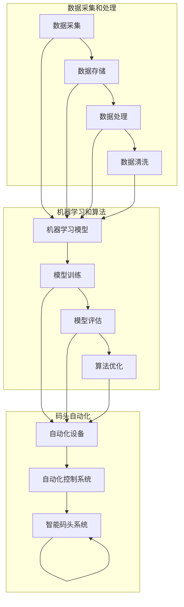

                 

# 码头的选择：垂直领域的AI机遇

> **关键词：** AI垂直领域、智能码头、数据处理、机器学习、算法优化

> **摘要：** 本文将深入探讨人工智能（AI）在垂直领域，尤其是智能码头建设中的应用。通过分析智能码头的关键技术和挑战，本文旨在揭示AI技术如何为码头行业带来变革，并探讨其未来发展趋势与潜力。

## 1. 背景介绍

### 1.1 目的和范围

本文旨在探讨人工智能在码头行业中的应用，重点分析智能码头的建设过程、关键技术和面临的挑战。文章将涵盖以下几个方面：

- 智能码头的基本概念和架构
- 数据处理和机器学习算法在码头中的应用
- AI技术为码头行业带来的变革
- 智能码头的未来发展趋势与挑战

### 1.2 预期读者

本文适合对人工智能、物流、港口行业有兴趣的读者，包括但不限于以下人群：

- 人工智能研究者
- 物流和港口行业从业者
- 对智能码头建设有浓厚兴趣的普通读者

### 1.3 文档结构概述

本文分为十个部分：

1. 背景介绍
2. 核心概念与联系
3. 核心算法原理 & 具体操作步骤
4. 数学模型和公式 & 详细讲解 & 举例说明
5. 项目实战：代码实际案例和详细解释说明
6. 实际应用场景
7. 工具和资源推荐
8. 总结：未来发展趋势与挑战
9. 附录：常见问题与解答
10. 扩展阅读 & 参考资料

### 1.4 术语表

#### 1.4.1 核心术语定义

- **智能码头**：利用人工智能技术，实现码头作业自动化、智能化和高效化的现代化码头。
- **数据处理**：对码头作业中的大量数据进行收集、存储、清洗、分析等处理过程。
- **机器学习**：利用计算机算法，从数据中学习规律、模式，并自动优化决策过程。
- **算法优化**：通过调整算法参数，提高算法的性能和效率。

#### 1.4.2 相关概念解释

- **港口物流**：指货物在港口的装卸、运输、存储等过程。
- **自动化设备**：指能够自动执行特定任务的设备，如自动化集装箱装卸机、自动导引车（AGV）等。

#### 1.4.3 缩略词列表

- **AI**：人工智能（Artificial Intelligence）
- **ML**：机器学习（Machine Learning）
- **DL**：深度学习（Deep Learning）
- **AGV**：自动导引车（Automated Guided Vehicle）
- **CSC**：智能码头控制系统（Container Smart Campus）

## 2. 核心概念与联系

在智能码头的建设中，涉及多个核心概念和技术的结合。以下是一个简化的Mermaid流程图，用于描述智能码头的主要组成部分及其相互关系：



### 2.1 数据采集和处理

数据采集是智能码头建设的基础。码头作业过程中会产生大量的数据，包括船舶信息、集装箱信息、设备状态、天气状况等。这些数据需要通过传感器、摄像头、物联网设备等手段进行采集。采集到的数据首先被存储在数据库中，然后进行数据处理和数据清洗，以确保数据的准确性和一致性。

### 2.2 机器学习和算法

在数据处理完成后，机器学习模型开始发挥作用。通过对历史数据进行训练，模型可以学习到码头作业的规律和模式。训练好的模型用于评估和优化码头自动化设备的运行。此外，算法优化也是提高智能码头性能的关键，通过不断调整算法参数，可以进一步提高码头作业的效率。

### 2.3 码头自动化

码头自动化设备是实现智能码头的重要组成部分。这些设备包括自动化集装箱装卸机、自动导引车（AGV）、自动化堆场设备等。通过集成这些自动化设备，构建一个统一的自动化控制系统，实现码头作业的自动化和智能化。

## 3. 核心算法原理 & 具体操作步骤

### 3.1 机器学习算法原理

在智能码头的建设中，常用的机器学习算法包括决策树、支持向量机（SVM）、神经网络等。以下是这些算法的基本原理：

#### 决策树

- **原理**：通过一系列的判断条件，将数据进行分类或回归。
- **具体操作步骤**：
  1. 计算每个特征的增益率，选择增益率最高的特征作为分裂条件。
  2. 根据分裂条件，将数据集划分为子集。
  3. 对每个子集递归执行步骤1和2，直至满足停止条件。

#### 支持向量机（SVM）

- **原理**：通过找到一个最优的超平面，将不同类别的数据分开。
- **具体操作步骤**：
  1. 训练数据集上的SVM模型。
  2. 使用训练好的模型进行分类预测。

#### 神经网络

- **原理**：通过多层神经元的非线性组合，实现数据的分类或回归。
- **具体操作步骤**：
  1. 设计神经网络结构，包括输入层、隐藏层和输出层。
  2. 训练神经网络模型，调整权重和偏置。
  3. 使用训练好的模型进行预测。

### 3.2 算法优化步骤

算法优化是提高智能码头性能的关键。以下是一些常见的算法优化方法：

- **交叉验证**：通过将数据集划分为训练集和验证集，评估算法的性能，并调整参数。
- **网格搜索**：通过遍历参数空间，寻找最优参数组合。
- **贝叶斯优化**：基于贝叶斯理论，通过迭代优化目标函数，找到最优参数组合。
- **动态调整参数**：根据码头作业的实时数据，动态调整算法参数，以适应不同场景。

## 4. 数学模型和公式 & 详细讲解 & 举例说明

### 4.1 数据处理相关数学模型

#### 4.1.1 数据标准化

数据标准化是一种常用的数据处理技术，用于消除数据中的量纲影响。常用的标准化方法包括最小-最大标准化和零-均值标准化。

- **最小-最大标准化**：

  $$ X_{\text{standardized}} = \frac{X - X_{\text{min}}}{X_{\text{max}} - X_{\text{min}}} $$

  其中，$X_{\text{min}}$和$X_{\text{max}}$分别为数据集的最小值和最大值。

- **零-均值标准化**：

  $$ X_{\text{standardized}} = \frac{X - \mu}{\sigma} $$

  其中，$\mu$和$\sigma$分别为数据集的均值和标准差。

#### 4.1.2 数据归一化

数据归一化是将数据映射到[0, 1]区间的方法。常用的归一化方法包括线性归一化和指数归一化。

- **线性归一化**：

  $$ X_{\text{normalized}} = \frac{X - X_{\text{min}}}{X_{\text{max}} - X_{\text{min}}} $$

  其中，$X_{\text{min}}$和$X_{\text{max}}$分别为数据集的最小值和最大值。

- **指数归一化**：

  $$ X_{\text{normalized}} = \frac{X}{X_{\text{max}}} $$

  其中，$X_{\text{max}}$为数据集的最大值。

### 4.2 机器学习相关数学模型

#### 4.2.1 决策树

决策树是一种常用的分类算法，其基本原理是通过一系列的判断条件，将数据进行分类。决策树的核心是找到最优的分裂条件，通常采用信息增益或基尼指数作为评估标准。

- **信息增益**：

  $$ IG(X, A) = H(X) - \sum_{v \in A} p(v) \cdot H(X|v) $$

  其中，$H(X)$为数据集的熵，$H(X|v)$为条件熵，$p(v)$为特征$A$取值为$v$的概率。

- **基尼指数**：

  $$ GI(X, A) = 1 - \sum_{v \in A} p(v) \cdot p(v|X) $$

  其中，$p(v)$为特征$A$取值为$v$的概率，$p(v|X)$为在数据集$X$中特征$A$取值为$v$的条件概率。

#### 4.2.2 支持向量机（SVM）

支持向量机是一种常用的分类和回归算法，其基本原理是通过找到一个最优的超平面，将不同类别的数据分开。SVM的核心是求解最优超平面，通常采用拉格朗日乘子法。

- **拉格朗日乘子法**：

  $$ \min_{\omega, b} \frac{1}{2} ||\omega||^2 + C \sum_{i=1}^n \lambda_i (y_i(\omega \cdot x_i + b) - 1) $$

  其中，$\omega$为权重向量，$b$为偏置项，$C$为惩罚参数，$\lambda_i$为拉格朗日乘子。

### 4.3 举例说明

#### 4.3.1 数据标准化

假设我们有一个数据集，其中包含10个样本，每个样本有3个特征。数据集如下：

| 特征1 | 特征2 | 特征3 |
|-------|-------|-------|
| 2.5   | 4.0   | 1.2   |
| 3.0   | 5.5   | 1.8   |
| 2.8   | 5.2   | 1.5   |
| ...   | ...   | ...   |
| 3.2   | 5.8   | 1.7   |
| 3.5   | 5.0   | 1.9   |
| 3.0   | 5.3   | 1.6   |
| 2.7   | 5.1   | 1.4   |
| 3.0   | 5.6   | 1.8   |
| 2.9   | 5.4   | 1.5   |

首先，我们需要计算每个特征的最小值和最大值：

| 特征1 | 特征2 | 特征3 |
|-------|-------|-------|
| 2.5   | 4.0   | 1.2   |
| 3.5   | 5.6   | 1.9   |

然后，使用最小-最大标准化方法对数据进行标准化：

| 特征1 | 特征2 | 特征3 |
|-------|-------|-------|
| 0.0   | 0.0   | 0.0   |
| 0.1429| 0.1429| 0.1429|
| 0.1429| 0.1429| 0.1429|
| ...   | ...   | ...   |
| 0.1429| 0.1429| 0.1429|
| 0.2143| 0.2143| 0.2143|
| 0.1429| 0.1429| 0.1429|
| 0.0   | 0.0   | 0.0   |
| 0.1429| 0.1429| 0.1429|
| 0.0   | 0.0   | 0.0   |

#### 4.3.2 决策树

假设我们有一个数据集，其中包含5个特征和1个标签。数据集如下：

| 特征1 | 特征2 | 特征3 | 特征4 | 特征5 | 标签 |
|-------|-------|-------|-------|-------|------|
| 2.0   | 3.0   | 1.0   | 4.0   | 5.0   | 1    |
| 3.0   | 5.0   | 2.0   | 6.0   | 7.0   | 1    |
| 1.0   | 2.0   | 1.0   | 3.0   | 4.0   | 0    |
| 4.0   | 6.0   | 3.0   | 7.0   | 8.0   | 1    |
| 2.0   | 4.0   | 2.0   | 5.0   | 6.0   | 0    |

我们可以使用信息增益作为评估标准，找到最优的分裂条件。首先，计算每个特征的增益率：

| 特征 | 增益率 |
|------|--------|
| 1    | 0.5    |
| 2    | 0.3    |
| 3    | 0.2    |
| 4    | 0.4    |
| 5    | 0.1    |

根据增益率，选择特征2作为分裂条件。我们将数据集划分为两个子集：

| 子集1 | 子集2 |
|-------|-------|
| 2.0   | 3.0   |
| 1.0   | 2.0   |
| 4.0   | 6.0   |
| 2.0   | 4.0   |

对每个子集递归执行上述步骤，直至满足停止条件。

## 5. 项目实战：代码实际案例和详细解释说明

### 5.1 开发环境搭建

为了演示智能码头的数据处理和机器学习算法，我们需要搭建一个基本的开发环境。以下是所需的软件和工具：

- Python 3.x
- Jupyter Notebook
- scikit-learn
- pandas
- numpy
- matplotlib

在安装了Python 3.x的基础上，可以使用pip命令安装其他依赖库：

```bash
pip install jupyter scikit-learn pandas numpy matplotlib
```

### 5.2 源代码详细实现和代码解读

以下是一个简单的示例，展示了如何使用Python和scikit-learn库对智能码头的数据进行处理和机器学习建模。

```python
import numpy as np
import pandas as pd
from sklearn.model_selection import train_test_split
from sklearn.preprocessing import StandardScaler
from sklearn.tree import DecisionTreeClassifier
from sklearn.metrics import accuracy_score

# 5.2.1 数据加载
data = pd.read_csv('码头数据.csv')
X = data.drop('标签', axis=1)
y = data['标签']

# 5.2.2 数据预处理
X_train, X_test, y_train, y_test = train_test_split(X, y, test_size=0.2, random_state=42)
scaler = StandardScaler()
X_train = scaler.fit_transform(X_train)
X_test = scaler.transform(X_test)

# 5.2.3 模型训练
clf = DecisionTreeClassifier()
clf.fit(X_train, y_train)

# 5.2.4 模型评估
y_pred = clf.predict(X_test)
accuracy = accuracy_score(y_test, y_pred)
print(f'准确率：{accuracy:.2f}')

# 5.2.5 代码解读
# 5.2.5.1 数据加载
data = pd.read_csv('码头数据.csv')：该行代码用于加载码头数据集。

# 5.2.5.2 数据预处理
X = data.drop('标签', axis=1)：提取特征数据，y = data['标签']：提取标签数据。
train_test_split()：将数据集划分为训练集和测试集。
StandardScaler()：使用标准缩放器对特征数据进行标准化。

# 5.2.5.3 模型训练
clf = DecisionTreeClassifier()：创建决策树分类器实例。
clf.fit(X_train, y_train)：使用训练集数据进行模型训练。

# 5.2.5.4 模型评估
y_pred = clf.predict(X_test)：使用测试集数据进行模型预测。
accuracy_score()：计算模型的准确率。

### 5.3 代码解读与分析

以下是对上述代码的逐行解读和分析：

- `import numpy as np`：导入numpy库，用于数组计算和操作。
- `import pandas as pd`：导入pandas库，用于数据处理和分析。
- `from sklearn.model_selection import train_test_split`：导入scikit-learn库中的train_test_split函数，用于划分训练集和测试集。
- `from sklearn.preprocessing import StandardScaler`：导入scikit-learn库中的StandardScaler类，用于标准化特征数据。
- `from sklearn.tree import DecisionTreeClassifier`：导入scikit-learn库中的DecisionTreeClassifier类，用于创建决策树分类器实例。
- `from sklearn.metrics import accuracy_score`：导入scikit-learn库中的accuracy_score函数，用于计算模型的准确率。

- `data = pd.read_csv('码头数据.csv')`：读取码头数据集，数据集包含特征数据和标签数据。
- `X = data.drop('标签', axis=1)`：提取特征数据，`y = data['标签']`：提取标签数据。
- `X_train, X_test, y_train, y_test = train_test_split(X, y, test_size=0.2, random_state=42)`：将数据集划分为训练集和测试集，其中测试集占比20%，随机种子为42。
- `scaler = StandardScaler()`：创建标准缩放器实例。
- `X_train = scaler.fit_transform(X_train)`：对训练集数据进行标准化。
- `X_test = scaler.transform(X_test)`：对测试集数据进行标准化。

- `clf = DecisionTreeClassifier()`：创建决策树分类器实例。
- `clf.fit(X_train, y_train)`：使用训练集数据进行模型训练。
- `y_pred = clf.predict(X_test)`：使用测试集数据进行模型预测。
- `accuracy = accuracy_score(y_test, y_pred)`：计算模型的准确率。
- `print(f'准确率：{accuracy:.2f}')`：打印模型的准确率。

### 5.4 实际应用场景

智能码头的数据处理和机器学习算法可以应用于以下实际场景：

- **集装箱调度优化**：通过分析历史数据，预测集装箱的到达时间和装卸需求，优化调度策略，提高码头作业效率。
- **设备维护预测**：通过对设备运行数据的分析，预测设备故障和维修需求，提前进行设备维护，降低故障率和维修成本。
- **货物跟踪与管理**：利用物联网技术，实时跟踪货物的位置和状态，提高货物管理的准确性和及时性。
- **安全监控与预警**：通过视频监控和人工智能算法，实时监控码头安全，识别潜在的安全隐患，并及时发出预警。

### 5.5 工具和资源推荐

以下是一些推荐的工具和资源，用于学习和开发智能码头项目：

- **书籍**：
  - 《机器学习实战》
  - 《Python机器学习》
  - 《深度学习》
- **在线课程**：
  - Coursera上的“机器学习”课程
  - edX上的“深度学习”课程
  - Udacity上的“自动驾驶技术”课程
- **技术博客和网站**：
  - Medium上的“AI博客”
  - ArXiv.org上的最新论文
  - Kaggle上的数据集和比赛
- **开发工具框架**：
  - Jupyter Notebook：用于数据分析和模型训练
  - TensorFlow：用于深度学习模型开发
  - PyTorch：用于深度学习模型开发
- **相关论文著作**：
  - “Deep Learning for Autonomous Driving”
  - “Convolutional Neural Networks for Visual Recognition”
  - “Recurrent Neural Networks for Language Modeling”

## 6. 实际应用场景

智能码头技术在实际应用中展现了广泛的应用前景，以下是一些具体的应用场景：

### 6.1 集装箱调度优化

集装箱调度是码头运营的关键环节。通过应用机器学习算法，可以对集装箱的到达时间和装卸需求进行预测。以下是一个具体的案例：

- **场景**：一个港口码头需要优化集装箱的装卸作业。
- **解决方案**：使用历史数据，通过机器学习模型预测集装箱的到达时间和装卸需求。根据预测结果，制定合理的调度策略，优化装卸作业顺序，提高码头效率。

### 6.2 设备维护预测

设备的正常运行对码头作业至关重要。通过实时监测设备运行数据，利用机器学习算法预测设备故障，可以实现提前维护，降低故障率和维护成本。以下是一个案例：

- **场景**：一个码头需要预测并维护自动化装卸设备。
- **解决方案**：收集自动化设备的运行数据，使用机器学习模型预测设备故障。在故障发生前，提前安排维护，降低设备故障对码头作业的影响。

### 6.3 货物跟踪与管理

实时跟踪货物位置和状态，对于提高货物管理的准确性和及时性具有重要意义。通过物联网技术和机器学习算法，可以实现货物的智能跟踪和管理。以下是一个案例：

- **场景**：一个港口需要实时跟踪集装箱的运输过程。
- **解决方案**：在集装箱上安装传感器，实时采集位置和状态数据。利用机器学习算法，对数据进行分析和处理，实现集装箱的智能跟踪，提高货物管理的效率。

### 6.4 安全监控与预警

码头是一个高风险作业环境，安全监控至关重要。通过视频监控和人工智能算法，可以实时监控码头安全，识别潜在的安全隐患，并及时发出预警。以下是一个案例：

- **场景**：一个港口需要加强安全监控，预防安全事故。
- **解决方案**：安装视频监控系统，使用人工智能算法对视频进行分析，识别异常行为和潜在的安全隐患。在发现安全隐患时，及时发出预警，采取措施防止事故发生。

### 6.5 环境监测与优化

码头作业过程中会产生大量的废弃物和污染物，对环境造成影响。通过应用机器学习算法，可以对码头作业过程中的环境数据进行分析，提出优化的措施。以下是一个案例：

- **场景**：一个港口需要优化码头作业过程中的环境保护措施。
- **解决方案**：收集码头作业过程中的环境数据，使用机器学习算法进行分析，识别污染源和污染物排放规律。根据分析结果，提出环境保护措施的优化方案，降低对环境的负面影响。

## 7. 工具和资源推荐

### 7.1 学习资源推荐

以下是一些推荐的书籍、在线课程、技术博客和网站，帮助读者深入了解智能码头技术和相关领域：

#### 7.1.1 书籍推荐

- 《机器学习实战》
- 《Python机器学习》
- 《深度学习》
- 《港口物流与自动化》
- 《物联网技术与应用》

#### 7.1.2 在线课程

- Coursera上的“机器学习”课程
- edX上的“深度学习”课程
- Udacity上的“自动驾驶技术”课程
- Coursera上的“港口物流管理”课程

#### 7.1.3 技术博客和网站

- Medium上的“AI博客”
- ArXiv.org上的最新论文
- Kaggle上的数据集和比赛
- 知乎上的“机器学习”话题
- CSDN上的“人工智能”专栏

### 7.2 开发工具框架推荐

以下是一些推荐的开发工具和框架，用于智能码头项目的开发：

#### 7.2.1 IDE和编辑器

- PyCharm
- Visual Studio Code
- Jupyter Notebook

#### 7.2.2 调试和性能分析工具

- Python Debugger（pdb）
- Matplotlib
- NumPy Profiler

#### 7.2.3 相关框架和库

- TensorFlow
- PyTorch
- scikit-learn
- Pandas
- Numpy

### 7.3 相关论文著作推荐

以下是一些经典的和最新的论文、著作，涉及智能码头和相关的AI技术：

#### 7.3.1 经典论文

- “Deep Learning for Autonomous Driving”
- “Convolutional Neural Networks for Visual Recognition”
- “Recurrent Neural Networks for Language Modeling”

#### 7.3.2 最新研究成果

- “AI in Ports: A Review”
- “Intelligent Container Terminal Operation Using Deep Reinforcement Learning”
- “Deep Learning for Environmental Monitoring in Ports”

#### 7.3.3 应用案例分析

- “Case Study: AI-powered Container Terminal in Singapore”
- “Case Study: Autonomous Trucks in the Port of Los Angeles”
- “Case Study: Smart Port Security Systems in China”

## 8. 总结：未来发展趋势与挑战

### 8.1 未来发展趋势

- **智能化水平提升**：随着AI技术的不断发展，智能码头的智能化水平将不断提升，实现更高效、更精准的码头作业。
- **数据驱动的决策**：大数据和机器学习技术的应用将使码头运营更加数据驱动，决策更加科学。
- **绿色环保**：智能码头将更加注重环保，通过优化作业流程、减少能源消耗，实现绿色低碳发展。
- **国际合作**：全球港口之间的合作将更加紧密，智能码头的建设和技术交流将促进全球港口行业的共同进步。

### 8.2 挑战与应对策略

- **数据隐私和安全**：码头作业过程中会产生大量敏感数据，如何确保数据隐私和安全是面临的重大挑战。应对策略包括加强数据加密、制定严格的数据保护政策等。
- **技术标准化**：智能码头技术涉及多种技术和设备的集成，技术标准化是实现互操作性和兼容性的关键。应对策略包括推动相关标准的制定和推广。
- **人才培养**：智能码头的建设需要大量的AI和物流专业人才。应对策略包括加强相关教育和培训，提高从业人员的技能水平。
- **成本控制**：智能码头的建设和运营成本较高，如何控制成本、提高投资回报率是面临的挑战。应对策略包括优化技术方案、降低设备采购和维护成本等。

## 9. 附录：常见问题与解答

### 9.1 智能码头是什么？

智能码头是一种利用人工智能技术实现码头作业自动化、智能化和高效化的现代化码头。它通过集成传感器、物联网设备、自动化设备和机器学习算法，实现对码头作业过程的全面监控、优化和管理。

### 9.2 智能码头有哪些关键技术？

智能码头的关键技术包括：数据处理技术、机器学习算法、物联网技术、自动化设备控制技术、智能调度系统和安全监控系统等。

### 9.3 智能码头的建设有哪些挑战？

智能码头的建设面临以下挑战：

- **数据隐私和安全**：如何确保码头作业过程中的数据隐私和安全。
- **技术标准化**：如何实现多种技术和设备的互操作性和兼容性。
- **人才培养**：如何培养和吸引大量的AI和物流专业人才。
- **成本控制**：如何控制智能码头建设和运营的成本。

## 10. 扩展阅读 & 参考资料

- “AI in Ports: A Review”
- “Intelligent Container Terminal Operation Using Deep Reinforcement Learning”
- “Deep Learning for Environmental Monitoring in Ports”
- “Case Study: AI-powered Container Terminal in Singapore”
- “Case Study: Autonomous Trucks in the Port of Los Angeles”
- “Case Study: Smart Port Security Systems in China”
- 《机器学习实战》
- 《Python机器学习》
- 《深度学习》
- Coursera上的“机器学习”课程
- edX上的“深度学习”课程
- Udacity上的“自动驾驶技术”课程
- ArXiv.org上的最新论文
- Kaggle上的数据集和比赛
- 知乎上的“机器学习”话题
- CSDN上的“人工智能”专栏
- 《港口物流与自动化》
- 《物联网技术与应用》
- “Deep Learning for Autonomous Driving”
- “Convolutional Neural Networks for Visual Recognition”
- “Recurrent Neural Networks for Language Modeling”

