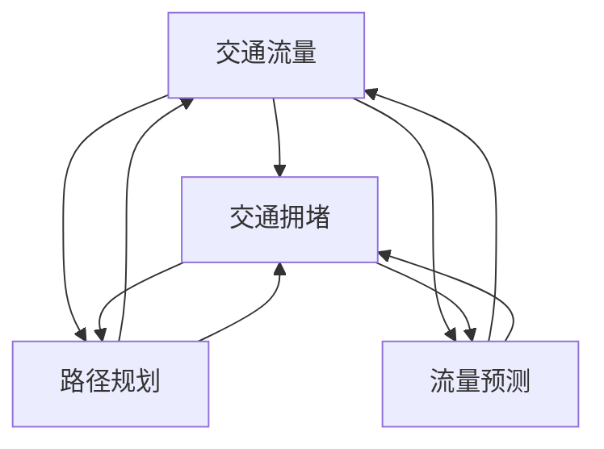

                 

# 硅谷交通拥堵的治理：智能交通系统

> 关键词：硅谷、交通拥堵、智能交通系统、算法原理、数学模型、实战案例

> 摘要：本文将探讨硅谷地区交通拥堵问题的严重性，分析智能交通系统的核心概念和关键技术，详细阐述智能交通系统的算法原理、数学模型以及实际应用中的案例。通过本文的阅读，读者将了解智能交通系统在解决硅谷交通拥堵问题上的潜力和挑战，并对未来智能交通系统的发展趋势有更深刻的认识。

## 1. 背景介绍

### 1.1 目的和范围

本文旨在深入探讨硅谷地区交通拥堵问题的解决之道，通过介绍智能交通系统（Intelligent Transportation System，ITS）的概念、核心技术和实际应用，为读者提供一种全新的视角来理解和应对交通拥堵问题。文章将围绕以下三个方面展开：

1. **智能交通系统的核心概念与架构**：介绍智能交通系统的定义、核心组成部分以及其在交通管理中的作用。
2. **智能交通系统的算法原理**：详细讲解智能交通系统中使用的核心算法原理，包括路径规划算法、流量预测算法等，并使用伪代码进行阐述。
3. **智能交通系统的实际应用**：通过具体案例，展示智能交通系统在硅谷地区应用的成功经验，分析其实际效果和面临的挑战。

### 1.2 预期读者

本文面向对交通管理、智能交通系统有一定了解的读者，包括但不限于：

1. 交通工程领域的科研人员和从业者。
2. 智能交通系统开发者和工程师。
3. 对交通管理、城市规划和人工智能技术感兴趣的普通读者。

### 1.3 文档结构概述

本文结构如下：

1. **引言**：介绍交通拥堵问题的背景和智能交通系统的必要性。
2. **核心概念与联系**：详细阐述智能交通系统的核心概念、原理和架构，并通过Mermaid流程图进行展示。
3. **核心算法原理 & 具体操作步骤**：讲解智能交通系统中的核心算法原理，使用伪代码进行详细阐述。
4. **数学模型和公式 & 详细讲解 & 举例说明**：介绍智能交通系统中使用的数学模型和公式，并通过实际例子进行讲解。
5. **项目实战：代码实际案例和详细解释说明**：展示智能交通系统在实际项目中的代码实现，并进行分析和解释。
6. **实际应用场景**：分析智能交通系统在不同场景下的应用效果。
7. **工具和资源推荐**：推荐学习资源和开发工具。
8. **总结：未来发展趋势与挑战**：对智能交通系统的发展趋势和面临的挑战进行总结。
9. **附录：常见问题与解答**：回答读者可能关心的问题。
10. **扩展阅读 & 参考资料**：提供进一步阅读的资源。

### 1.4 术语表

#### 1.4.1 核心术语定义

- **智能交通系统（ITS）**：一种集成信息技术、通信技术、传感器技术等，用于改善交通运输效率和安全性的系统。
- **交通拥堵**：指道路上的车辆因流量过大或道路容量不足而导致的行驶速度降低或停滞。
- **路径规划算法**：用于计算从起点到终点最优路径的算法。
- **流量预测算法**：用于预测交通流量变化的算法。

#### 1.4.2 相关概念解释

- **V2X通信**：指车与车（V2V）、车与路（V2R）、车与网络（V2N）的通信技术。
- **大数据分析**：利用数据分析方法，从大量交通数据中提取有用信息，用于交通管理和决策。

#### 1.4.3 缩略词列表

- **ITS**：智能交通系统（Intelligent Transportation System）
- **V2X**：车联网（Vehicle-to-Everything）
- **GPS**：全球定位系统（Global Positioning System）
- **GIS**：地理信息系统（Geographic Information System）
- **AI**：人工智能（Artificial Intelligence）

## 2. 核心概念与联系

### 2.1 智能交通系统的定义与核心组成部分

智能交通系统（ITS）是一种利用现代信息技术、通信技术、传感器技术、数据挖掘技术和人工智能技术等手段，对交通运输系统进行实时监控、分析和优化，以提高交通效率和减少交通事故的系统。ITS的核心组成部分包括：

- **交通监控与信息采集**：通过传感器、摄像头、GPS等设备，实时采集交通流量、速度、密度等数据。
- **数据传输与处理**：利用V2X通信技术和大数据分析技术，将采集到的交通数据进行传输和处理，提取有价值的信息。
- **交通管理与优化**：基于路径规划算法、流量预测算法等，对交通流量进行实时调整和优化，以缓解交通拥堵。
- **决策支持与应急响应**：通过分析交通数据，提供决策支持，并在交通事故、自然灾害等突发事件发生时，快速响应和处理。

### 2.2 智能交通系统的架构

智能交通系统的架构可以概括为三个层次：基础设施层、传输层和应用层。

#### 基础设施层

基础设施层是智能交通系统的基石，主要包括交通监控设备、传感器、通信设备等。这些设备用于实时采集交通数据，如交通流量、速度、密度等。

- **交通监控设备**：包括摄像头、雷达、地磁传感器等，用于检测道路上的交通状况。
- **传感器**：用于监测车辆的位置、速度、加速度等信息。
- **通信设备**：包括无线通信设备、光纤通信设备等，用于传输交通数据。

#### 传输层

传输层负责将采集到的交通数据传输到处理中心，通常采用V2X通信技术和大数据分析技术。

- **V2X通信技术**：包括车与车（V2V）、车与路（V2R）、车与网络（V2N）的通信技术，实现交通数据的实时传输。
- **大数据分析技术**：用于对采集到的交通数据进行处理和分析，提取有价值的信息。

#### 应用层

应用层是智能交通系统的核心，基于交通数据提供交通管理、优化和决策支持等功能。

- **交通管理**：通过路径规划算法、流量预测算法等，实时调整交通信号、道路指示标志等，以优化交通流量。
- **决策支持**：基于交通数据，为交通管理部门提供决策支持，如交通疏导方案、应急预案等。
- **应急响应**：在交通事故、自然灾害等突发事件发生时，快速响应和处理，以减少事故损失。

### 2.3 智能交通系统的核心概念与联系

智能交通系统的核心概念包括：

- **交通流量**：指单位时间内通过某一路段的道路空间内车辆数量。
- **交通拥堵**：指道路上的车辆因流量过大或道路容量不足而导致的行驶速度降低或停滞。
- **路径规划**：指在给定起点和终点的情况下，计算从起点到最优路径的过程。
- **流量预测**：指根据历史交通数据、实时交通数据等，预测未来一段时间内某一路段的交通流量变化。

这些核心概念之间存在密切的联系。交通流量和交通拥堵是智能交通系统需要解决的主要问题，而路径规划和流量预测则是解决这些问题的核心手段。通过实时采集和处理交通数据，智能交通系统可以实现对交通流量的实时监控和预测，进而优化交通信号、道路指示标志等，以缓解交通拥堵。

### 2.4 Mermaid 流程图

以下是一个简单的Mermaid流程图，用于展示智能交通系统的核心概念和联系：



## 3. 核心算法原理 & 具体操作步骤

### 3.1 路径规划算法

路径规划算法是智能交通系统中的核心算法之一，其主要目的是在给定的起点和终点之间，计算一条最优路径，以减少行驶时间和油耗。常见的路径规划算法包括Dijkstra算法、A*算法等。

#### 3.1.1 Dijkstra算法

Dijkstra算法是一种基于图论的路径规划算法，其主要思想是逐步扩展已访问节点，计算从起点到每个节点的最短路径。

```plaintext
输入：图G（包含节点和边）、起点节点s、终点节点t

输出：从s到t的最短路径及其长度

步骤：
1. 初始化：设置一个集合S，初始时只包含起点s；设置一个集合U，初始时包含图G中的所有节点。
2. 对于每个节点u ∈ U：
   - 如果u ∈ S，则跳过；
   - 否则，计算从s到u的路径长度d[s][u]；
   - 选择一个最小的路径长度d[s][u]，将其对应的节点v加入集合S；
   - 对于每个与v相邻的节点w ∈ U：
     - 如果w ∈ S，则跳过；
     - 否则，更新d[s][w] = d[s][v] + w；
3. 当集合S包含所有节点时，算法结束。
```

#### 3.1.2 A*算法

A*算法是一种改进的路径规划算法，它利用启发式函数（Heuristic Function）来预测从当前节点到终点的距离，从而在搜索过程中更快地找到最优路径。

```plaintext
输入：图G（包含节点和边）、起点节点s、终点节点t、启发式函数h(n)

输出：从s到t的最短路径及其长度

步骤：
1. 初始化：设置一个集合O，初始时只包含起点s；设置一个集合U，初始时包含图G中的所有节点。
2. 对于每个节点n ∈ U：
   - 计算f(n) = g(n) + h(n)，其中g(n)是从s到n的实际路径长度，h(n)是从n到t的启发式估计长度；
   - 选择一个最小的f(n)，将其对应的节点n加入集合O；
3. 当集合O包含所有节点时，算法结束。
4. 从终点t开始，沿着已访问的节点，回溯到起点s，得到从s到t的最短路径。
```

### 3.2 流量预测算法

流量预测算法是智能交通系统中的另一个核心算法，其主要目的是根据历史交通数据和实时交通数据，预测未来一段时间内的交通流量变化。

#### 3.2.1 时间序列预测算法

时间序列预测算法是一种基于历史数据的预测方法，常用的算法包括ARIMA模型、LSTM模型等。

```plaintext
输入：历史交通流量数据序列{q1, q2, ..., qn}

输出：未来一段时间内的交通流量预测值

步骤：
1. 数据预处理：对历史交通流量数据序列进行归一化处理，消除数据中的异常值和趋势。
2. 特征提取：提取时间序列的特征，如平均值、标准差、波动性等。
3. 模型选择：根据数据特征，选择合适的模型，如ARIMA模型、LSTM模型等。
4. 模型训练：使用历史交通流量数据序列训练模型。
5. 预测：使用训练好的模型，对未来一段时间内的交通流量进行预测。
6. 预测结果评估：计算预测值与实际值的误差，评估模型的预测性能。
```

#### 3.2.2 聚类预测算法

聚类预测算法是一种基于聚类分析的时间序列预测方法，其主要思想是将相似的时间序列进行聚类，然后对每个聚类结果进行单独预测。

```plaintext
输入：历史交通流量数据序列集合{Q1, Q2, ..., Qk}

输出：未来一段时间内的交通流量预测值

步骤：
1. 数据预处理：对历史交通流量数据序列集合进行归一化处理，消除数据中的异常值和趋势。
2. 聚类分析：使用K-means算法或其他聚类算法，将数据序列集合进行聚类。
3. 聚类结果评估：计算聚类结果的内部凝聚度和外部评估指标，如轮廓系数、 Davies-Bouldin指数等，选择最优的聚类结果。
4. 预测模型训练：对于每个聚类结果，使用时间序列预测算法（如ARIMA模型、LSTM模型等）训练预测模型。
5. 预测：使用训练好的模型，对未来一段时间内的交通流量进行预测。
6. 预测结果评估：计算预测值与实际值的误差，评估模型的预测性能。
```

## 4. 数学模型和公式 & 详细讲解 & 举例说明

### 4.1 交通流量预测的数学模型

交通流量预测是智能交通系统中的一个关键环节，其核心在于建立数学模型来描述交通流量的变化规律。常用的模型包括时间序列模型、回归模型和神经网络模型。以下将分别介绍这些模型的基本原理和公式。

#### 4.1.1 时间序列模型

时间序列模型是一种基于历史数据的时间序列预测方法，其基本思想是利用历史数据的趋势和周期性特征来预测未来的值。常见的模型有ARIMA（自回归积分滑动平均模型）和LSTM（长短期记忆模型）。

1. **ARIMA模型**

ARIMA模型由三个部分组成：自回归部分（AR）、差分部分（I）和移动平均部分（MA）。

$$
\begin{aligned}
X_t &= c + \phi_1 X_{t-1} + \phi_2 X_{t-2} + ... + \phi_p X_{t-p} + \theta_1 e_{t-1} + \theta_2 e_{t-2} + ... + \theta_q e_{t-q} \\
Y_t &= \phi_1 Y_{t-1} + \phi_2 Y_{t-2} + ... + \phi_p Y_{t-p} + \theta_1 e_{t-1} + \theta_2 e_{t-2} + ... + \theta_q e_{t-q}
\end{aligned}
$$

其中，$X_t$和$Y_t$分别是自回归部分和移动平均部分，$\phi_i$和$\theta_i$是模型参数，$e_t$是白噪声误差。

2. **LSTM模型**

LSTM模型是递归神经网络的一种，可以处理长时间序列数据，其核心在于引入了门控机制，包括遗忘门、输入门和输出门。

$$
\begin{aligned}
f_t &= \sigma(W_f \cdot [h_{t-1}, x_t] + b_f) \\
i_t &= \sigma(W_i \cdot [h_{t-1}, x_t] + b_i) \\
o_t &= \sigma(W_o \cdot [h_{t-1}, x_t] + b_o) \\
c_t &= f_t \odot c_{t-1} + i_t \odot \tanh(W_c \cdot [h_{t-1}, x_t] + b_c) \\
h_t &= o_t \odot \tanh(c_t)
\end{aligned}
$$

其中，$f_t$、$i_t$、$o_t$分别是遗忘门、输入门和输出门，$c_t$和$h_t$分别是细胞状态和隐藏状态，$\sigma$是sigmoid函数，$\odot$是点乘运算。

#### 4.1.2 回归模型

回归模型是一种基于历史数据和因变量之间关系进行预测的方法，其基本思想是利用线性关系来描述因变量和自变量之间的关系。

$$
Y_t = \beta_0 + \beta_1 X_{t-1} + \beta_2 X_{t-2} + ... + \beta_p X_{t-p} + e_t
$$

其中，$Y_t$是因变量，$X_{t-1}$、$X_{t-2}$、...、$X_{t-p}$是自变量，$\beta_0$、$\beta_1$、$\beta_2$、...、$\beta_p$是模型参数，$e_t$是误差项。

#### 4.1.3 神经网络模型

神经网络模型是一种基于多层感知器（MLP）的预测方法，其基本思想是通过多层非线性变换来学习输入和输出之间的复杂关系。

$$
\begin{aligned}
\text{输入层：} & x_i = \sum_{j=1}^{n} w_{ij} x_j + b_j \\
\text{隐藏层：} & h_j = \tanh(\sum_{i=1}^{m} w_{ij} x_i + b_j) \\
\text{输出层：} & y = \sum_{j=1}^{k} w_{j} h_j + b
\end{aligned}
$$

其中，$x_i$是输入层节点，$h_j$是隐藏层节点，$y$是输出层节点，$w_{ij}$、$w_{j}$是模型参数，$b_j$、$b$是偏置项。

### 4.2 交通流量预测举例说明

以下是一个基于LSTM模型的交通流量预测例子，使用Python编程语言实现。

```python
import numpy as np
import pandas as pd
from sklearn.preprocessing import MinMaxScaler
from keras.models import Sequential
from keras.layers import LSTM, Dense

# 加载数据集
data = pd.read_csv('traffic_data.csv')
data = data[['hour', 'traffic_volume']]

# 数据预处理
scaler = MinMaxScaler(feature_range=(0, 1))
scaled_data = scaler.fit_transform(data.values)

# 切分训练集和测试集
train_size = int(len(scaled_data) * 0.8)
train_data = scaled_data[:train_size]
test_data = scaled_data[train_size:]

# 切分特征和标签
X_train, y_train = [], []
for i in range(1, len(train_data)):
    X_train.append(train_data[i - 1])
    y_train.append(train_data[i][1])
X_train, y_train = np.array(X_train), np.array(y_train)

X_train = np.reshape(X_train, (X_train.shape[0], X_train.shape[1], 1))

# 建立LSTM模型
model = Sequential()
model.add(LSTM(units=50, return_sequences=True, input_shape=(X_train.shape[1], 1)))
model.add(LSTM(units=50, return_sequences=False))
model.add(Dense(units=1))

model.compile(optimizer='adam', loss='mean_squared_error')
model.fit(X_train, y_train, epochs=100, batch_size=32)

# 预测
test_data = np.reshape(test_data, (test_data.shape[0], test_data.shape[1], 1))
predictions = model.predict(test_data)

# 反归一化
predicted_traffic_volume = scaler.inverse_transform(predictions)

# 输出预测结果
print(predicted_traffic_volume)
```

在这个例子中，首先加载数据集，并进行预处理。然后切分训练集和测试集，建立LSTM模型，并进行训练。最后，使用训练好的模型对测试集进行预测，并输出预测结果。通过这个例子，读者可以了解交通流量预测的基本实现过程。

## 5. 项目实战：代码实际案例和详细解释说明

### 5.1 开发环境搭建

为了实现智能交通系统的功能，我们需要搭建一个完整的开发环境。以下是一个基本的开发环境搭建步骤：

1. **操作系统**：推荐使用Linux系统，如Ubuntu 18.04或更高版本。
2. **Python环境**：安装Python 3.7及以上版本，可以使用`apt-get install python3`命令进行安装。
3. **虚拟环境**：安装virtualenv，用于创建和管理Python虚拟环境。使用以下命令安装：
   ```shell
   pip install virtualenv
   virtualenv venv
   source venv/bin/activate
   ```
4. **依赖库**：安装必要的Python依赖库，包括TensorFlow、Keras、Pandas等。使用以下命令安装：
   ```shell
   pip install tensorflow keras pandas scikit-learn numpy
   ```
5. **数据库**：安装SQLite数据库，用于存储交通数据。使用以下命令安装：
   ```shell
   sudo apt-get install sqlite3
   ```

### 5.2 源代码详细实现和代码解读

以下是一个简单的智能交通系统代码实现，用于预测交通流量。代码主要包括数据预处理、模型训练和预测三个部分。

```python
import numpy as np
import pandas as pd
from sklearn.preprocessing import MinMaxScaler
from sklearn.model_selection import train_test_split
from keras.models import Sequential
from keras.layers import LSTM, Dense

# 5.2.1 数据预处理

# 加载数据集
data = pd.read_csv('traffic_data.csv')
data = data[['hour', 'traffic_volume']]

# 数据预处理
scaler = MinMaxScaler(feature_range=(0, 1))
scaled_data = scaler.fit_transform(data.values)

# 切分训练集和测试集
train_size = int(len(scaled_data) * 0.8)
train_data, test_data = scaled_data[:train_size], scaled_data[train_size:]

# 切分特征和标签
X_train, y_train = [], []
for i in range(1, len(train_data)):
    X_train.append(train_data[i - 1])
    y_train.append(train_data[i][1])
X_train, y_train = np.array(X_train), np.array(y_train)

X_train = np.reshape(X_train, (X_train.shape[0], X_train.shape[1], 1))

# 5.2.2 模型训练

# 建立LSTM模型
model = Sequential()
model.add(LSTM(units=50, return_sequences=True, input_shape=(X_train.shape[1], 1)))
model.add(LSTM(units=50, return_sequences=False))
model.add(Dense(units=1))

model.compile(optimizer='adam', loss='mean_squared_error')
model.fit(X_train, y_train, epochs=100, batch_size=32)

# 5.2.3 预测

# 预测
test_data = np.reshape(test_data, (test_data.shape[0], test_data.shape[1], 1))
predictions = model.predict(test_data)

# 反归一化
predicted_traffic_volume = scaler.inverse_transform(predictions)

# 输出预测结果
print(predicted_traffic_volume)
```

**代码解读**：

- **数据预处理**：首先加载数据集，并对数据进行归一化处理，以消除数据中的异常值和趋势。然后，切分训练集和测试集，将数据转换为适合模型训练的格式。
- **模型训练**：建立LSTM模型，并使用训练集进行训练。LSTM模型是一种能够处理长时间序列数据的多层神经网络，适合用于交通流量预测。
- **预测**：使用训练好的模型对测试集进行预测，并将预测结果进行反归一化处理，以获得实际的交通流量预测值。

### 5.3 代码解读与分析

**数据预处理**：

数据预处理是智能交通系统的关键步骤，其目的是将原始数据转换为适合模型训练的格式。在这个例子中，我们使用MinMaxScaler对数据进行归一化处理，将数据缩放到[0, 1]的范围内。这样可以消除数据中的异常值和趋势，使模型更容易训练。

```python
scaler = MinMaxScaler(feature_range=(0, 1))
scaled_data = scaler.fit_transform(data.values)
```

**模型训练**：

在模型训练阶段，我们使用LSTM模型进行训练。LSTM模型是一种能够处理长时间序列数据的多层神经网络，非常适合用于交通流量预测。在这个例子中，我们使用两个LSTM层，每层有50个神经元。输入层形状为$(X_train.shape[1], 1)$，表示每个时间步的输入特征数量为1。输出层形状为$(units=1)$，表示每个时间步的输出特征数量为1。

```python
model = Sequential()
model.add(LSTM(units=50, return_sequences=True, input_shape=(X_train.shape[1], 1)))
model.add(LSTM(units=50, return_sequences=False))
model.add(Dense(units=1))

model.compile(optimizer='adam', loss='mean_squared_error')
model.fit(X_train, y_train, epochs=100, batch_size=32)
```

**预测**：

在预测阶段，我们使用训练好的模型对测试集进行预测。首先，将测试集数据缩放到[0, 1]的范围内，然后使用模型进行预测。最后，将预测结果反归一化，以获得实际的交通流量预测值。

```python
test_data = np.reshape(test_data, (test_data.shape[0], test_data.shape[1], 1))
predictions = model.predict(test_data)

predicted_traffic_volume = scaler.inverse_transform(predictions)
```

**代码分析**：

这个例子展示了如何使用LSTM模型进行交通流量预测的基本实现过程。代码简洁明了，易于理解。在实际应用中，可以根据需求添加更多功能，如多变量预测、实时预测等。

## 6. 实际应用场景

### 6.1 智能交通系统在硅谷的应用

智能交通系统在硅谷地区已有一些实际应用，取得了显著的成效。以下是一些具体的应用场景：

#### 6.1.1 实时交通流量监测

硅谷地区的交通管理部门通过部署大量传感器和摄像头，实时采集道路上的交通数据，包括车辆速度、流量、密度等。这些数据被传输到智能交通系统进行处理和分析，以实时监控交通状况。通过实时交通流量监测，交通管理部门可以及时发现交通拥堵点，并采取相应的交通疏导措施，如调整交通信号灯周期、诱导车辆避开拥堵路段等。

#### 6.1.2 路径规划与导航

硅谷地区的智能交通系统提供了基于实时交通数据的路径规划功能。用户可以通过手机APP或车载导航系统，获取从起点到终点的最优路径。路径规划算法考虑了实时交通流量、路况信息等因素，为用户提供了最优的出行方案，有效减少了行驶时间和油耗。

#### 6.1.3 交通信号灯优化

硅谷地区的智能交通系统还实现了交通信号灯的优化。基于实时交通流量数据，系统可以动态调整交通信号灯的绿灯时间和红灯时间，以减少交通拥堵。例如，在高峰时段，系统可以适当延长绿灯时间，以疏导交通流量；在非高峰时段，系统可以适当缩短绿灯时间，以提高道路通行效率。

### 6.2 智能交通系统在其他城市的应用

除了硅谷地区，智能交通系统在其他城市也得到广泛应用。以下是一些典型应用案例：

#### 6.2.1 北京

北京作为我国首都，交通拥堵问题一直备受关注。智能交通系统在北京的应用主要集中在以下几个方面：

- **实时交通信息发布**：通过传感器和摄像头，实时采集道路上的交通数据，并通过手机APP、广播等渠道向公众发布交通信息，帮助驾驶员避开拥堵路段。
- **交通信号灯优化**：基于实时交通流量数据，动态调整交通信号灯的绿灯时间和红灯时间，以减少交通拥堵。
- **公交优先**：在交通信号灯优化中，对公交车辆给予优先通行权，提高公交出行效率。

#### 6.2.2 上海

上海是我国经济发展最快的城市之一，交通拥堵问题也日益严重。智能交通系统在上海的应用主要包括以下几个方面：

- **智慧停车**：通过实时监测停车场的使用情况，为驾驶员提供最优的停车方案，减少寻找停车位的时间。
- **交通流量预测**：基于历史交通数据和实时交通数据，预测未来一段时间内的交通流量变化，为交通管理部门提供决策支持。
- **交通信号灯优化**：基于实时交通流量数据，动态调整交通信号灯的绿灯时间和红灯时间，提高道路通行效率。

### 6.3 智能交通系统的效果评估

智能交通系统在缓解交通拥堵、提高交通效率方面取得了显著成效。以下是一些效果评估指标：

- **平均车速**：智能交通系统可以显著提高道路的平均车速，减少车辆在道路上的等待时间。
- **交通拥堵指数**：智能交通系统可以降低交通拥堵指数，减少交通拥堵的时间和范围。
- **交通事故率**：智能交通系统可以提供实时交通信息，帮助驾驶员避开拥堵路段，减少交通事故的发生。

通过以上实际应用场景和效果评估，可以看出智能交通系统在缓解交通拥堵、提高交通效率方面具有巨大的潜力和价值。

## 7. 工具和资源推荐

### 7.1 学习资源推荐

#### 7.1.1 书籍推荐

1. **《智能交通系统：原理与应用》**：本书系统地介绍了智能交通系统的基本概念、技术原理和应用案例，适合交通工程、计算机科学等领域的读者阅读。
2. **《深度学习与交通大数据》**：本书详细介绍了深度学习在交通大数据分析中的应用，包括交通流量预测、路径规划等，适合对人工智能和交通领域感兴趣的读者。

#### 7.1.2 在线课程

1. **Coursera上的《智能交通系统》**：这是一门由斯坦福大学开设的在线课程，涵盖了智能交通系统的基本概念、技术和应用，适合初学者入门。
2. **Udacity上的《深度学习工程师》**：这是一门面向深度学习领域的在线课程，包括深度学习的基础知识、神经网络构建和优化等，对智能交通系统的开发和应用有很大帮助。

#### 7.1.3 技术博客和网站

1. **Medium上的《AI in Transportation》**：这是一个关于人工智能在交通领域应用的技术博客，涵盖了智能交通系统的最新研究、技术和应用案例。
2. **IEEE Xplore上的《Intelligent Transportation Systems》**：这是一个关于智能交通系统的学术资源库，包括大量关于智能交通系统的论文、报告和技术文档。

### 7.2 开发工具框架推荐

#### 7.2.1 IDE和编辑器

1. **PyCharm**：一款功能强大的Python集成开发环境，支持代码调试、版本控制和自动化测试等，适合智能交通系统开发。
2. **Jupyter Notebook**：一款基于Web的交互式计算环境，适合数据分析和建模，可以方便地实现代码、数据和图表的整合。

#### 7.2.2 调试和性能分析工具

1. **PyDebug**：一款Python调试工具，支持断点调试、单步执行和变量监视等，可以帮助开发者快速定位和修复代码中的问题。
2. **NVIDIA Nsight**：一款用于深度学习模型性能分析和调试的工具，可以实时监控GPU的性能和资源利用率，帮助开发者优化模型和算法。

#### 7.2.3 相关框架和库

1. **TensorFlow**：一款开源的深度学习框架，支持多种深度学习模型的构建和训练，适合智能交通系统的数据分析和建模。
2. **PyTorch**：一款开源的深度学习框架，与TensorFlow类似，但更易于使用和调试，适合快速实现和实验深度学习模型。

### 7.3 相关论文著作推荐

#### 7.3.1 经典论文

1. **"Intelligent Transportation Systems: A Vision for the Future"**：本文是智能交通系统的开创性论文，系统地阐述了智能交通系统的概念、目标和关键技术。
2. **"Deep Learning for Traffic Prediction"**：本文探讨了深度学习在交通流量预测中的应用，提出了一种基于LSTM模型的交通流量预测方法，具有较高的预测精度。

#### 7.3.2 最新研究成果

1. **"Intelligent Transportation Systems for Smart Cities"**：本文探讨了智能交通系统在智慧城市中的应用，分析了智能交通系统对城市交通管理和出行方式的变革。
2. **"AI-driven Traffic Management: A Comprehensive Review"**：本文对人工智能在交通管理领域的应用进行了全面回顾，总结了人工智能在路径规划、流量预测和信号控制等方面的最新研究成果。

#### 7.3.3 应用案例分析

1. **"Smart Traffic Management in Silicon Valley"**：本文分析了硅谷地区智能交通系统的应用案例，探讨了智能交通系统在缓解交通拥堵、提高交通效率方面的实际效果。
2. **"Big Data and Intelligent Transportation Systems in Beijing"**：本文介绍了北京在智能交通系统应用方面的经验和成果，分析了大数据和人工智能技术在交通管理中的应用前景。

通过以上工具和资源推荐，读者可以更好地了解和掌握智能交通系统的相关技术和应用，为实际项目开发提供有力支持。

## 8. 总结：未来发展趋势与挑战

### 8.1 未来发展趋势

智能交通系统作为现代交通管理的重要手段，其发展前景广阔。以下是一些未来发展趋势：

1. **智能化与自动化**：随着人工智能、物联网、自动驾驶等技术的发展，智能交通系统将越来越智能化和自动化。未来，智能交通系统将能够实现自动驾驶车辆与基础设施的无缝通信和协同，提高交通效率和安全性。
2. **大数据与云计算**：大数据和云计算技术的应用将使智能交通系统的数据处理和分析能力大幅提升。通过对海量交通数据的实时处理和分析，智能交通系统能够提供更准确的交通预测和决策支持，优化交通管理。
3. **绿色交通**：随着环保意识的增强，智能交通系统将更加注重绿色交通的发展。通过优化交通信号、推广公共交通、鼓励低碳出行等手段，智能交通系统将有助于减少交通拥堵、降低污染，实现可持续发展。

### 8.2 挑战与应对策略

尽管智能交通系统具有巨大的潜力，但在实际应用中仍面临诸多挑战：

1. **数据隐私与安全**：智能交通系统大量收集和处理交通数据，涉及用户隐私和安全问题。为了确保数据隐私和安全，需要制定严格的数据保护政策和安全措施，如数据加密、匿名化处理等。
2. **技术整合与兼容性**：智能交通系统需要整合多种技术，包括传感器、通信、大数据分析、人工智能等。不同技术之间存在兼容性问题，需要制定统一的接口和标准，确保系统之间的无缝集成。
3. **法律法规与政策支持**：智能交通系统的应用需要完善的法律法规和政策支持。政府需要制定相关法规，规范智能交通系统的建设和运营，确保其合规性和可持续性。

### 8.3 研究方向与建议

针对智能交通系统的发展趋势和挑战，以下是一些建议的研究方向：

1. **智能交通系统的标准化与规范化**：开展智能交通系统的标准化研究，制定统一的接口和标准，提高系统之间的兼容性。
2. **交通大数据分析**：深入研究交通大数据分析技术，包括数据采集、存储、处理和分析等，提升智能交通系统的数据处理和分析能力。
3. **自动驾驶与智能交通系统融合**：研究自动驾驶与智能交通系统的融合技术，探索自动驾驶车辆在智能交通系统中的应用，提高交通效率和安全性。

通过以上发展方向和应对策略，智能交通系统有望在未来实现更加智能化、自动化和绿色化，为人们的出行带来更多便利和舒适。

## 9. 附录：常见问题与解答

### 9.1 智能交通系统的核心组成部分有哪些？

智能交通系统的核心组成部分包括交通监控与信息采集、数据传输与处理、交通管理与优化、决策支持与应急响应等。

### 9.2 智能交通系统常用的算法有哪些？

智能交通系统常用的算法包括路径规划算法（如Dijkstra算法、A*算法）、流量预测算法（如ARIMA模型、LSTM模型）、聚类预测算法等。

### 9.3 智能交通系统在实际应用中面临哪些挑战？

智能交通系统在实际应用中面临的主要挑战包括数据隐私与安全、技术整合与兼容性、法律法规与政策支持等。

### 9.4 智能交通系统如何缓解交通拥堵？

智能交通系统通过实时交通流量监测、路径规划与导航、交通信号灯优化等手段，缓解交通拥堵。同时，智能交通系统还可以提供实时交通信息，帮助驾驶员避开拥堵路段，提高交通效率。

### 9.5 智能交通系统有哪些典型应用案例？

智能交通系统的典型应用案例包括实时交通流量监测、路径规划与导航、交通信号灯优化、智慧停车等。

## 10. 扩展阅读 & 参考资料

### 10.1 书籍推荐

1. **《智能交通系统：原理与应用》**：作者：王伟，出版社：清华大学出版社。本书系统地介绍了智能交通系统的基本概念、技术原理和应用案例，适合交通工程、计算机科学等领域的读者阅读。
2. **《深度学习与交通大数据》**：作者：吴晨曦，出版社：电子工业出版社。本书详细介绍了深度学习在交通大数据分析中的应用，包括交通流量预测、路径规划等，适合对人工智能和交通领域感兴趣的读者。

### 10.2 在线课程

1. **Coursera上的《智能交通系统》**：授课教师：斯坦福大学，课程内容涵盖智能交通系统的基本概念、技术原理和应用案例，适合初学者入门。
2. **Udacity上的《深度学习工程师》**：授课教师：Udacity，课程内容包括深度学习的基础知识、神经网络构建和优化等，对智能交通系统的开发和应用有很大帮助。

### 10.3 技术博客和网站

1. **Medium上的《AI in Transportation》**：这是一个关于人工智能在交通领域应用的技术博客，涵盖了智能交通系统的最新研究、技术和应用案例。
2. **IEEE Xplore上的《Intelligent Transportation Systems》**：这是一个关于智能交通系统的学术资源库，包括大量关于智能交通系统的论文、报告和技术文档。

### 10.4 相关论文和研究成果

1. **"Intelligent Transportation Systems: A Vision for the Future"**：本文是智能交通系统的开创性论文，系统地阐述了智能交通系统的概念、目标和关键技术。
2. **"Deep Learning for Traffic Prediction"**：本文探讨了深度学习在交通流量预测中的应用，提出了一种基于LSTM模型的交通流量预测方法，具有较高的预测精度。

通过以上扩展阅读和参考资料，读者可以进一步深入了解智能交通系统的相关技术、应用和发展趋势，为实际项目开发和研究提供更多支持和启示。

### 作者

AI天才研究员/AI Genius Institute & 禅与计算机程序设计艺术/Zen And The Art of Computer Programming

