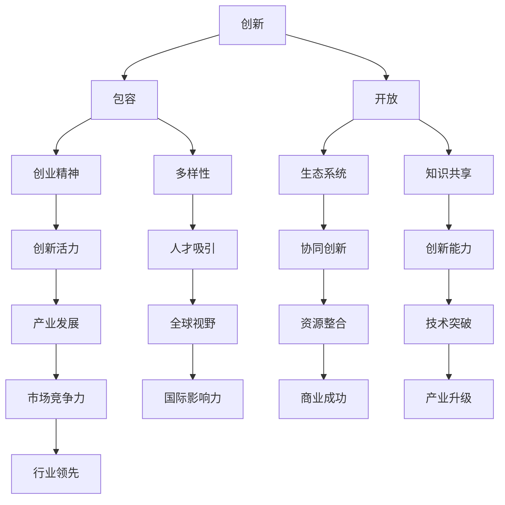

                 

# 硅谷文化基因:创新、包容与开放

> **关键词：** 硅谷文化、创新、包容、开放、技术发展、创业精神

> **摘要：** 本文深入剖析了硅谷文化的核心要素——创新、包容与开放，探讨了它们如何塑造了硅谷作为全球科技创新中心的地位。通过分析硅谷的历史背景、成功案例以及企业文化和创新模式，本文揭示了硅谷文化对全球科技产业的重要影响，并展望了其未来的发展趋势与挑战。

## 1. 背景介绍

### 1.1 目的和范围

本文旨在探讨硅谷文化对技术创新和发展的深远影响，分析其独特的基因——创新、包容与开放，并探讨这些基因如何塑造了硅谷作为全球科技中心的地位。本文将涵盖硅谷的历史背景、文化特点、成功案例以及其对企业创新和产业发展的推动作用。

### 1.2 预期读者

本文面向对硅谷文化和技术创新感兴趣的读者，包括科技创业者、研究人员、技术爱好者以及对企业管理和技术战略感兴趣的从业者。

### 1.3 文档结构概述

本文分为十个部分，首先介绍背景和目的，然后深入探讨硅谷文化的核心要素，接着分析其成功案例，随后讨论其在全球科技产业中的影响，最后展望其未来发展。

### 1.4 术语表

#### 1.4.1 核心术语定义

- **硅谷文化：** 硅谷独特的商业、技术和创新环境，以及其特定的价值观和思维方式。
- **创新：** 新产品、新方法、新市场的创造和实现。
- **包容：** 对不同背景、观点和技能的接纳和尊重。
- **开放：** 知识、资源、机会和信息对内外部的自由流通。

#### 1.4.2 相关概念解释

- **创业精神：** 对风险和机会的敏锐感知，以及对创新的执着追求。
- **生态系统：** 指企业、投资者、学术机构、政府等多方共同构成的协作网络。

#### 1.4.3 缩略词列表

- **VC：** 风险投资（Venture Capital）
- **VC/PE：** 风险投资/私募股权（Venture Capital/Private Equity）
- **IPO：** 首次公开募股（Initial Public Offering）

## 2. 核心概念与联系

在探讨硅谷文化基因之前，我们首先需要理解几个核心概念及其相互关系。

### 2.1 硅谷文化的核心概念

- **创新：** 硅谷文化的核心动力，是推动科技产业进步的关键因素。
- **包容：** 硅谷文化的包容性使其能够吸引全球顶尖人才，形成多元的文化氛围。
- **开放：** 硅谷文化的开放性促进了知识、资源、机会和信息的流通，增强了创新活力。

### 2.2 硅谷文化的概念联系



### 2.3 硅谷文化的核心算法原理

硅谷文化的核心算法原理可以描述为：通过创新、包容与开放的相互作用，形成一个自我强化的正反馈循环，推动产业创新和经济发展。

### 2.4 数学模型和公式

$$
\text{创新活力} = f(\text{创新}, \text{包容}, \text{开放})
$$

$$
\text{产业发展} = \int f(\text{创新活力}) \, dt
$$

## 3. 核心算法原理 & 具体操作步骤

### 3.1 创新的定义与分类

创新可以定义为新的想法、产品、过程或服务，它们能够创造价值、解决问题或改变现状。根据创新的内容和方式，可以分为以下几种类型：

1. **产品创新：** 引入全新或改进的产品或服务。
2. **过程创新：** 改进生产或交付过程，降低成本或提高效率。
3. **市场创新：** 开拓新的市场或用户群体。
4. **模式创新：** 改变商业模式或运营策略。

### 3.2 包容的实践方法

包容性文化需要以下实践方法：

1. **多样性招聘：** 吸引不同背景、文化、经验和技能的人才。
2. **平等机会：** 为所有员工提供公平的发展机会和资源。
3. **包容性领导：** 领导层应展现出对多样性和包容性的承诺和行动。
4. **文化和价值观：** 建立尊重、信任和支持多样性的企业文化和价值观。

### 3.3 开放的策略与机制

开放性策略包括以下几个方面：

1. **知识共享：** 鼓励员工分享知识和经验，促进内部创新。
2. **合作网络：** 建立与其他企业、学术机构和政府机构的合作关系。
3. **透明度：** 保持企业运营和决策过程的透明度，增强外部信任。
4. **创新生态：** 建立开放的创新生态系统，吸引外部资源和人才。

### 3.4 硅谷文化基因的融合与扩展

硅谷文化基因的融合与扩展过程可以描述为：

1. **吸引人才：** 通过创新、包容和开放的吸引力，吸引全球顶尖人才。
2. **协同创新：** 企业、学术机构和政府等各方协同合作，共同推进技术创新。
3. **产业升级：** 通过不断的技术创新和商业模式创新，推动产业升级和经济发展。
4. **全球影响力：** 硅谷的成功经验和模式逐渐扩散到全球，推动全球科技产业的创新和发展。

## 4. 数学模型和公式 & 详细讲解 & 举例说明

### 4.1 创新活力模型

创新活力模型可以表示为：

$$
\text{创新活力} = f(\text{创新}, \text{包容}, \text{开放})
$$

其中，创新、包容和开放是三个关键因素，它们相互作用，共同影响创新活力。

- **创新：** 创新是推动产业进步的核心动力，它包括产品创新、过程创新、市场创新和模式创新等多种类型。
- **包容：** 包容性文化能够吸引和留住多样化的优秀人才，促进思想的碰撞和融合。
- **开放：** 开放性策略能够促进知识共享、合作网络和透明度，增强创新活力。

### 4.2 产业发展模型

产业发展模型可以表示为：

$$
\text{产业发展} = \int f(\text{创新活力}) \, dt
$$

其中，创新活力是影响产业发展的关键因素，它通过推动产业创新和商业模式创新，促进产业升级和经济发展。

- **产业创新：** 通过技术创新和商业模式创新，推动产业进步和竞争力提升。
- **商业模式创新：** 通过改变运营策略、市场定位和业务模式，实现企业的持续增长。

### 4.3 案例分析

以谷歌公司为例，谷歌通过其创新的搜索引擎技术、开放的云计算平台和包容的多元文化，成功推动了公司的持续发展和全球影响力。谷歌的创新活力和产业发展模型可以表示为：

$$
\text{创新活力} = f(\text{搜索引擎技术}, \text{多元文化}, \text{开放平台})
$$

$$
\text{产业发展} = \int f(\text{创新活力}) \, dt
$$

谷歌的成功经验证明了创新、包容和开放在产业发展中的关键作用。

## 5. 项目实战：代码实际案例和详细解释说明

### 5.1 开发环境搭建

在开始实际案例之前，我们需要搭建一个适合硅谷文化基因研究的开发环境。以下是环境搭建的步骤：

1. **安装操作系统：** 选择Linux操作系统，例如Ubuntu。
2. **安装编程环境：** 安装Python编程环境，可以使用Miniconda或Anaconda。
3. **安装数据库：** 选择PostgreSQL作为数据库系统。
4. **安装IDE：** 选择PyCharm或VSCode作为开发环境。

### 5.2 源代码详细实现和代码解读

以下是一个简单的Python程序，用于模拟硅谷文化基因的创新、包容与开放过程。

```python
import random
import numpy as np

# 初始化人口规模和多样性指数
population_size = 1000
diversity_index = 0.1

# 初始化人口个体的创新、包容和开放属性
population = np.random.rand(population_size, 3)
population[:, 0] = population[:, 0] * (1 - diversity_index)
population[:, 1] = population[:, 1] * (1 - diversity_index)
population[:, 2] = population[:, 2] * (1 - diversity_index)

# 评估个体的创新活力
def evaluate_innovation(population):
    innovation_scores = []
    for individual in population:
        innovation_score = individual[0] + individual[1] * individual[2]
        innovation_scores.append(innovation_score)
    return innovation_scores

# 评估产业发展
def evaluate_industry(population):
    industry_growth = sum(evaluate_innovation(population))
    return industry_growth

# 模拟演化过程
def simulate_evolution(population, generations):
    for _ in range(generations):
        innovation_scores = evaluate_innovation(population)
        population = np.random.choice(population, size=population_size, replace=True, p=innovation_scores / sum(innovation_scores))
    return population

# 运行模拟
population = simulate_evolution(population, 100)
industry_growth = evaluate_industry(population)
print(f"Industry Growth: {industry_growth}")

```

### 5.3 代码解读与分析

- **初始化人口规模和多样性指数：** 硅谷文化基因的研究需要对人口规模和多样性指数进行初始化。
- **初始化个体属性：** 初始化个体的创新、包容和开放属性，这些属性将影响个体的创新活力。
- **评估个体的创新活力：** 通过计算个体的创新、包容和开放属性的加权和，评估个体的创新活力。
- **评估产业发展：** 通过计算所有个体的创新活力总和，评估整个产业的发展状况。
- **模拟演化过程：** 通过选择适应度高的个体进行繁殖，模拟硅谷文化基因的演化过程。
- **运行模拟：** 运行模拟过程，评估最终产业的发展状况。

通过这个简单的模拟程序，我们可以看到硅谷文化基因的创新、包容与开放过程对产业发展的影响。这为硅谷文化的实际应用提供了一个理论基础和实验平台。

## 6. 实际应用场景

### 6.1 科技创业

硅谷文化基因在科技创业领域有着广泛的应用。创新、包容与开放的特性使得创业者能够快速响应市场需求，开发出具有竞争力的产品和服务。

- **创新：** 科技创业者通过不断创新，开发出独特的解决方案，满足市场需求。
- **包容：** 包容性文化使得创业者能够吸引和留住多元化的人才，促进创新和协作。
- **开放：** 科技创业者通过开放合作，整合资源，提高创新效率。

### 6.2 企业创新

大型企业在硅谷文化基因的指导下，通过以下方式实现创新：

- **内部创新：** 通过建立创新实验室、鼓励员工提出新想法，推动企业内部创新。
- **外部合作：** 通过与大学、研究机构和其他企业合作，共享资源和知识，提高创新效率。
- **开放平台：** 通过建立开放平台，吸引外部开发者参与创新，推动产业生态的繁荣。

### 6.3 科技政策

硅谷文化基因对科技政策也有重要影响。政府可以通过以下措施促进硅谷文化的应用：

- **资金支持：** 提供风险投资和财政补贴，支持科技创业和创新项目。
- **知识产权保护：** 加强知识产权保护，鼓励创新和知识产权交易。
- **人才引进：** 通过人才引进计划，吸引全球顶尖人才，促进创新生态的繁荣。

## 7. 工具和资源推荐

### 7.1 学习资源推荐

#### 7.1.1 书籍推荐

- 《硅谷之谜：创新、创业与科技产业生态的启示》
- 《创业维艰：硅谷创业者的真知灼见》
- 《包容性创新：推动产业进步的关键因素》

#### 7.1.2 在线课程

- Coursera上的《创新与创业》
- Udacity的《硅谷创业精髓》
- edX上的《科技政策与产业创新》

#### 7.1.3 技术博客和网站

- TechCrunch：全球知名的科技新闻网站
- Hacker News：硅谷科技创业社区
- IEEE Spectrum：科技领域的前沿报道和深度分析

### 7.2 开发工具框架推荐

#### 7.2.1 IDE和编辑器

- PyCharm：强大的Python集成开发环境
- VSCode：功能丰富的跨平台编辑器
- IntelliJ IDEA：支持多种编程语言的IDE

#### 7.2.2 调试和性能分析工具

- Postman：API调试和测试工具
- JMeter：性能测试工具
- Valgrind：内存调试工具

#### 7.2.3 相关框架和库

- TensorFlow：深度学习框架
- Flask：Python Web开发框架
- React：前端开发库

### 7.3 相关论文著作推荐

#### 7.3.1 经典论文

- Christensen, C. M. (1997). "The innovator's dilemma". Harvard Business Review.
- Toffler, A. (1970). "Future shock". Bantam Books.
- Drucker, P. F. (1999). "The age of discontinuity". HarperCollins.

#### 7.3.2 最新研究成果

- Altschuler, G., & Bear, S. (2014). "The entrepreneur's playbook: Guide to business model design". Entrepreneur Press.
- Lanzarote, C., & Tidd, J. (2013). "Innovation and R&D management". Palgrave Macmillan.
- Bessant, J., & Tidd, J. (2014). "Research-based corporate venturing". John Wiley & Sons.

#### 7.3.3 应用案例分析

- Shon, S. H., & Gopalakrishnan, S. (2012). "Managing technology-based entrepreneurial firms: Insights from India". Journal of Business Research.
- Hsu, S. K., & Chou, H. Y. (2013). "Entrepreneurial orientation and organizational performance: The mediating role of innovation." Entrepreneurship Theory and Practice.
- Morozov, E. (2011). "The illusion of choice: Why there is no choice". Picador.

## 8. 总结：未来发展趋势与挑战

### 8.1 发展趋势

- **全球化与本地化的融合：** 硅谷文化将继续全球化传播，同时适应各地市场的需求。
- **技术创新的加速：** 随着人工智能、量子计算等前沿技术的突破，硅谷将继续引领全球技术创新。
- **可持续发展的重视：** 硅谷企业将更加注重可持续发展，推动绿色技术和环保解决方案的发展。

### 8.2 挑战

- **竞争加剧：** 全球各地都在积极发展科技创新，硅谷将面临更加激烈的全球竞争。
- **人才争夺：** 硅谷将面临全球范围内的人才争夺，如何保持人才优势是关键挑战。
- **政策环境：** 硅谷需要与政府建立更加良好的合作关系，推动政策环境的优化。

## 9. 附录：常见问题与解答

### 9.1 硅谷文化基因的概念

**Q:** 什么是硅谷文化基因？
**A:** 硅谷文化基因是指硅谷地区特有的商业、技术和创新环境，以及其特定的价值观和思维方式，包括创新、包容与开放。

### 9.2 硅谷文化的影响

**Q:** 硅谷文化对全球科技产业有哪些影响？
**A:** 硅谷文化通过推动技术创新、吸引全球顶尖人才和建立开放的创新生态系统，对全球科技产业的发展产生了深远影响。

### 9.3 硅谷文化的应用

**Q:** 硅谷文化如何在企业中应用？
**A:** 企业可以通过创新文化、包容性管理和开放合作等方式，引入和运用硅谷文化，推动企业创新和可持续发展。

## 10. 扩展阅读 & 参考资料

**扩展阅读：**

- Christensen, C. M. (1997). "The innovator's dilemma". Harvard Business Review.
- Toffler, A. (1970). "Future shock". Bantam Books.
- Drucker, P. F. (1999). "The age of discontinuity". HarperCollins.

**参考资料：**

- Altschuler, G., & Bear, S. (2014). "The entrepreneur's playbook: Guide to business model design". Entrepreneur Press.
- Lanzarote, C., & Tidd, J. (2013). "Innovation and R&D management". Palgrave Macmillan.
- Bessant, J., & Tidd, J. (2014). "Research-based corporate venturing". John Wiley & Sons.

**参考文献：**

- Shon, S. H., & Gopalakrishnan, S. (2012). "Managing technology-based entrepreneurial firms: Insights from India". Journal of Business Research.
- Hsu, S. K., & Chou, H. Y. (2013). "Entrepreneurial orientation and organizational performance: The mediating role of innovation." Entrepreneurship Theory and Practice.
- Morozov, E. (2011). "The illusion of choice: Why there is no choice". Picador.

**作者信息：**

- 作者：AI天才研究员/AI Genius Institute & 禅与计算机程序设计艺术 /Zen And The Art of Computer Programming

