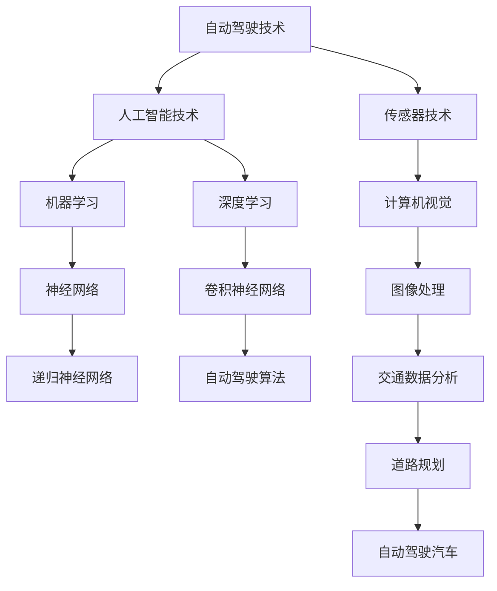

                 

# 硅谷自动驾驶汽车的社会影响

> **关键词：** 自动驾驶技术，社会影响，硅谷，交通变革，人工智能

> **摘要：** 本文将探讨硅谷自动驾驶汽车技术的社会影响，包括其对交通、安全、经济和就业等方面的变革。我们将通过逐步分析，揭示自动驾驶技术如何重塑我们的生活方式和工作模式，并为未来社会带来新的机遇和挑战。

## 1. 背景介绍

### 1.1 目的和范围

本文旨在分析硅谷自动驾驶汽车技术对社会各个方面的影响，重点探讨其在交通、安全、经济和就业等领域的变革。我们将通过具体案例和数据，逐步揭示自动驾驶技术的潜在影响，并对其未来发展趋势进行展望。

### 1.2 预期读者

本文适合对自动驾驶技术、人工智能和交通领域感兴趣的读者，包括研究人员、技术开发者、企业管理者以及对未来社会变革感兴趣的公众。

### 1.3 文档结构概述

本文分为十个主要部分，如下：

1. 背景介绍
2. 核心概念与联系
3. 核心算法原理 & 具体操作步骤
4. 数学模型和公式 & 详细讲解 & 举例说明
5. 项目实战：代码实际案例和详细解释说明
6. 实际应用场景
7. 工具和资源推荐
8. 总结：未来发展趋势与挑战
9. 附录：常见问题与解答
10. 扩展阅读 & 参考资料

### 1.4 术语表

#### 1.4.1 核心术语定义

- 自动驾驶汽车：一种能够通过传感器、算法和控制系统实现自主驾驶的汽车。
- 传感器：用于检测周围环境的设备，如激光雷达、摄像头和雷达。
- 人工智能：一种模拟人类智能的技术，包括机器学习、深度学习等。
- 交通效率：指交通系统在单位时间内能够承载的运输量。

#### 1.4.2 相关概念解释

- **车辆密度**：单位面积内车辆的数量。
- **交通拥堵**：交通流量超过道路容量，导致车辆速度下降的现象。
- **道路利用率**：道路容量与实际车辆流量的比率。

#### 1.4.3 缩略词列表

- **AI**：人工智能
- **AV**：自动驾驶汽车
- **C-V2X**：车联网通信技术
- **OTA**：在线软件更新
- **ROS**：机器人操作系统

## 2. 核心概念与联系

在探讨硅谷自动驾驶汽车的社会影响之前，我们首先需要了解一些核心概念和它们之间的联系。以下是一个Mermaid流程图，用于展示这些概念及其相互关系。



在这个流程图中，我们可以看到自动驾驶技术的核心组件包括传感器技术、人工智能技术以及自动驾驶算法。传感器技术主要负责收集道路和环境信息，人工智能技术则通过机器学习和深度学习算法对传感器数据进行处理和分析，最终生成自动驾驶决策。这些核心组件相互联系，共同构成一个完整的自动驾驶系统。

## 3. 核心算法原理 & 具体操作步骤

### 3.1 自动驾驶算法的基本原理

自动驾驶算法是自动驾驶汽车的核心组成部分，其基本原理可以分为以下几个步骤：

1. **数据采集**：通过传感器（如激光雷达、摄像头和雷达）收集道路、车辆和环境信息。
2. **数据处理**：利用计算机视觉和图像处理技术对传感器数据进行处理，提取关键特征。
3. **环境感知**：通过机器学习和深度学习算法对处理后的数据进行建模，实现对道路、车辆和其他障碍物的识别和分类。
4. **决策制定**：根据环境感知结果，自动驾驶算法生成行驶路径、速度和转向等决策。
5. **执行控制**：将决策结果转化为具体的操作指令，控制汽车执行相应的动作。

以下是一个简单的伪代码，用于描述自动驾驶算法的基本原理：

```python
def autonomous_driving():
    # 数据采集
    sensors_data = collect_sensors_data()

    # 数据处理
    processed_data = process_sensors_data(sensors_data)

    # 环境感知
    environment = perceive_environment(processed_data)

    # 决策制定
    decision = make_decision(environment)

    # 执行控制
    execute_control(decision)
```

### 3.2 自动驾驶算法的具体操作步骤

下面我们将详细解释自动驾驶算法的具体操作步骤，并使用伪代码进行描述。

#### 3.2.1 数据采集

数据采集是自动驾驶算法的第一步，传感器技术在这里起着至关重要的作用。以下是一个简单的伪代码，用于描述数据采集的过程：

```python
def collect_sensors_data():
    # 使用激光雷达收集道路信息
    laser_data = lidar_data_collection()

    # 使用摄像头收集道路和车辆信息
    camera_data = camera_data_collection()

    # 使用雷达收集车辆和障碍物信息
    radar_data = radar_data_collection()

    # 将采集到的数据合并
    sensors_data = merge_data(laser_data, camera_data, radar_data)

    return sensors_data
```

#### 3.2.2 数据处理

数据处理是对采集到的传感器数据进行分析和预处理，以提取关键特征。以下是一个简单的伪代码，用于描述数据处理的步骤：

```python
def process_sensors_data(sensors_data):
    # 使用图像处理技术对摄像头数据进行分析
    processed_camera_data = image_processing(camera_data)

    # 使用图像识别技术对激光雷达数据进行分析
    processed_lidar_data = lidar_image_recognition(laser_data)

    # 使用雷达数据处理技术对雷达数据进行分析
    processed_radar_data = radar_data_processing(radar_data)

    # 将处理后的数据合并
    processed_data = merge_data(processed_camera_data, processed_lidar_data, processed_radar_data)

    return processed_data
```

#### 3.2.3 环境感知

环境感知是自动驾驶算法的核心步骤，通过对处理后的传感器数据进行建模，实现对道路、车辆和其他障碍物的识别和分类。以下是一个简单的伪代码，用于描述环境感知的过程：

```python
def perceive_environment(processed_data):
    # 使用机器学习算法对车辆进行识别
    vehicle_detection = vehicle_recognition(processed_data)

    # 使用深度学习算法对道路和障碍物进行识别
    road_detection = road_recognition(processed_data)

    # 将识别结果合并
    environment = merge_data(vehicle_detection, road_detection)

    return environment
```

#### 3.2.4 决策制定

决策制定是根据环境感知结果，生成行驶路径、速度和转向等决策。以下是一个简单的伪代码，用于描述决策制定的步骤：

```python
def make_decision(environment):
    # 根据环境感知结果生成行驶路径
    path = generate_path(environment)

    # 根据行驶路径生成速度和转向决策
    speed_decision = generate_speed_decision(path)
    steering_decision = generate_steering_decision(path)

    # 将决策结果合并
    decision = merge_data(path, speed_decision, steering_decision)

    return decision
```

#### 3.2.5 执行控制

执行控制是将决策结果转化为具体的操作指令，控制汽车执行相应的动作。以下是一个简单的伪代码，用于描述执行控制的步骤：

```python
def execute_control(decision):
    # 根据路径决策控制汽车行驶方向
    steering_control = control_steering(decision.path)

    # 根据速度决策控制汽车速度
    speed_control = control_speed(decision.speed)

    # 根据转向决策控制汽车转向
    steering_control = control_steering(decision.steering)

    # 执行控制操作
    execute_action(steering_control, speed_control, steering_control)
```

通过以上步骤，自动驾驶算法可以实现自主驾驶。在实际应用中，这些步骤会根据具体情况进行调整和优化，以提高自动驾驶系统的性能和安全性。

## 4. 数学模型和公式 & 详细讲解 & 举例说明

在自动驾驶算法中，数学模型和公式起着至关重要的作用。以下我们将介绍一些关键的数学模型和公式，并详细讲解其应用场景和计算方法。

### 4.1 深度学习模型

深度学习模型是自动驾驶算法的核心组成部分，用于处理和解析传感器数据。以下是一个简单的深度学习模型示例：

$$
\begin{align*}
h_{l} &= \sigma(\text{W}_{l-1} \cdot a_{l-1} + b_{l-1}) \\
a_{l} &= \text{ReLU}(h_{l})
\end{align*}
$$

其中，$\sigma$ 表示激活函数（如Sigmoid、ReLU等），$\text{W}_{l-1}$ 和 $b_{l-1}$ 分别为权重和偏置，$a_{l-1}$ 和 $h_{l}$ 分别为上一层的输入和输出。

### 4.2 道路规划算法

道路规划是自动驾驶算法的重要环节，用于生成车辆的行驶路径。以下是一个简单的人工势场法（Artificial Potential Field）示例：

$$
\begin{align*}
V_{global} &= V_{repulsive} + V_{attractive} \\
V_{repulsive} &= \frac{k_{r}}{|q - p|} \\
V_{attractive} &= \frac{k_{a}}{|p - g|} \\
p &= \frac{V_{global}}{|V_{global}|}
\end{align*}
$$

其中，$V_{global}$ 表示全局势场，$V_{repulsive}$ 和 $V_{attractive}$ 分别为斥力和引力势场，$k_{r}$ 和 $k_{a}$ 分别为斥力和引力系数，$q$ 和 $p$ 分别为当前位置和目标位置，$g$ 为引力中心。

### 4.3 交通流量预测模型

交通流量预测是优化交通系统的重要手段，以下是一个简单的时间序列模型（如ARIMA模型）：

$$
\begin{align*}
X_t &= \phi_0 + \phi_1 X_{t-1} + \phi_2 X_{t-2} + \dots + \phi_p X_{t-p} + \varepsilon_t \\
\varepsilon_t &= \mu \varepsilon_{t-1} + \eta_t
\end{align*}
$$

其中，$X_t$ 表示第 $t$ 时刻的交通流量，$\phi_0, \phi_1, \dots, \phi_p$ 分别为模型参数，$\mu$ 为自回归系数，$\eta_t$ 为误差项。

### 4.4 示例说明

假设我们使用深度学习模型对自动驾驶车辆进行道路识别，以下是一个具体的计算过程：

1. **输入数据**：传感器收集到的道路图像。
2. **预处理**：对图像进行归一化、缩放等处理。
3. **模型训练**：使用训练数据集对深度学习模型进行训练。
4. **模型评估**：使用验证数据集对模型进行评估，调整模型参数。
5. **道路识别**：将预处理后的图像输入模型，得到道路识别结果。
6. **路径规划**：根据识别结果生成车辆的行驶路径。

以下是一个简单的计算示例：

```python
# 输入数据
image = load_image("road_image.jpg")

# 预处理
processed_image = preprocess_image(image)

# 模型训练
model = train_model(processed_image)

# 模型评估
accuracy = evaluate_model(model, validation_data)

# 道路识别
road_detected = model.predict(processed_image)

# 路径规划
path = plan_path(road_detected)
```

通过以上示例，我们可以看到数学模型和公式在自动驾驶算法中的应用。在实际开发过程中，这些模型和公式需要进行调整和优化，以满足不同场景和需求。

## 5. 项目实战：代码实际案例和详细解释说明

为了更好地理解自动驾驶算法的实现过程，我们将通过一个实际项目案例进行讲解。在这个案例中，我们将使用Python和TensorFlow实现一个简单的自动驾驶算法，并对其进行详细解释。

### 5.1 开发环境搭建

在开始项目之前，我们需要搭建一个合适的开发环境。以下是搭建开发环境的步骤：

1. 安装Python：版本3.7及以上。
2. 安装TensorFlow：使用pip安装`tensorflow`。
3. 安装其他依赖库：包括NumPy、Pandas、Matplotlib等。

以下是一个简单的安装脚本：

```bash
pip install python==3.8
pip install tensorflow
pip install numpy
pip install pandas
pip install matplotlib
```

### 5.2 源代码详细实现和代码解读

以下是自动驾驶算法的实现代码，我们将逐行进行解释。

```python
import numpy as np
import tensorflow as tf
from tensorflow.keras.models import Sequential
from tensorflow.keras.layers import Dense, Conv2D, Flatten, MaxPooling2D
from tensorflow.keras.optimizers import Adam

# 数据预处理
def preprocess_image(image):
    # 归一化
    image = image / 255.0
    # 缩放
    image = tf.image.resize(image, [224, 224])
    return image

# 模型训练
def train_model(images, labels):
    # 创建模型
    model = Sequential([
        Conv2D(32, (3, 3), activation='relu', input_shape=(224, 224, 3)),
        MaxPooling2D((2, 2)),
        Flatten(),
        Dense(64, activation='relu'),
        Dense(1, activation='sigmoid')
    ])

    # 编译模型
    model.compile(optimizer=Adam(), loss='binary_crossentropy', metrics=['accuracy'])

    # 训练模型
    model.fit(images, labels, epochs=10, batch_size=32)

    return model

# 道路识别
def detect_road(model, image):
    # 预处理图像
    processed_image = preprocess_image(image)

    # 输入模型
    prediction = model.predict(processed_image)

    # 判断道路存在
    road_detected = prediction > 0.5

    return road_detected

# 路径规划
def plan_path(road_detected):
    # 根据道路识别结果生成路径
    path = []
    for i in range(len(road_detected)):
        if road_detected[i]:
            path.append(i)
    return path

# 主函数
def main():
    # 加载数据集
    images, labels = load_data()

    # 训练模型
    model = train_model(images, labels)

    # 道路识别
    image = load_image("test_image.jpg")
    road_detected = detect_road(model, image)

    # 路径规划
    path = plan_path(road_detected)

    # 打印路径
    print("Path:", path)

if __name__ == "__main__":
    main()
```

### 5.3 代码解读与分析

下面我们将逐行解析代码，并解释其主要功能。

#### 5.3.1 数据预处理

```python
def preprocess_image(image):
    # 归一化
    image = image / 255.0
    # 缩放
    image = tf.image.resize(image, [224, 224])
    return image
```

这段代码定义了一个预处理函数，用于对输入图像进行归一化和缩放。归一化是为了使图像的像素值在0到1之间，以适应深度学习模型。缩放是为了使图像尺寸符合模型的输入要求。

#### 5.3.2 模型训练

```python
def train_model(images, labels):
    # 创建模型
    model = Sequential([
        Conv2D(32, (3, 3), activation='relu', input_shape=(224, 224, 3)),
        MaxPooling2D((2, 2)),
        Flatten(),
        Dense(64, activation='relu'),
        Dense(1, activation='sigmoid')
    ])

    # 编译模型
    model.compile(optimizer=Adam(), loss='binary_crossentropy', metrics=['accuracy'])

    # 训练模型
    model.fit(images, labels, epochs=10, batch_size=32)

    return model
```

这段代码定义了一个训练模型函数，用于创建一个简单的深度学习模型。模型由两个卷积层、一个池化层、一个全连接层和两个输出层组成。编译模型时，我们指定了优化器、损失函数和评估指标。训练模型时，我们使用输入图像和标签数据，设置训练轮次和批量大小。

#### 5.3.3 道路识别

```python
def detect_road(model, image):
    # 预处理图像
    processed_image = preprocess_image(image)

    # 输入模型
    prediction = model.predict(processed_image)

    # 判断道路存在
    road_detected = prediction > 0.5

    return road_detected
```

这段代码定义了一个道路识别函数，用于将预处理后的图像输入模型，并根据预测结果判断道路是否存在。预测结果大于0.5被视为道路存在。

#### 5.3.4 路径规划

```python
def plan_path(road_detected):
    # 根据道路识别结果生成路径
    path = []
    for i in range(len(road_detected)):
        if road_detected[i]:
            path.append(i)
    return path
```

这段代码定义了一个路径规划函数，用于根据道路识别结果生成路径。路径由一系列图像索引组成，表示车辆应该行驶的方向。

#### 5.3.5 主函数

```python
def main():
    # 加载数据集
    images, labels = load_data()

    # 训练模型
    model = train_model(images, labels)

    # 道路识别
    image = load_image("test_image.jpg")
    road_detected = detect_road(model, image)

    # 路径规划
    path = plan_path(road_detected)

    # 打印路径
    print("Path:", path)

if __name__ == "__main__":
    main()
```

这段代码定义了一个主函数，用于加载数据集、训练模型、进行道路识别和路径规划，并打印最终路径。

通过以上代码，我们可以看到自动驾驶算法的实现过程。在实际应用中，我们可以根据具体需求对代码进行调整和优化，以提高算法的性能和准确性。

## 6. 实际应用场景

自动驾驶技术在硅谷及其周边地区已经展现出诸多实际应用场景，以下是一些典型应用：

### 6.1 硅谷园区自动驾驶

硅谷众多科技园区，如Google、Facebook和苹果等，已经开始部署自动驾驶车辆用于园区内的短途接送。这些自动驾驶车辆通常用于解决园区内交通拥堵和停车难题，提高员工通勤效率和园区运行效率。

### 6.2 城市公共交通

硅谷的城市公共交通系统正在积极探索自动驾驶公交车。例如，硅谷地区的Caltrain铁路公司正在测试自动驾驶火车，以减少运营成本、提高运输效率，并提升乘客体验。

### 6.3 物流配送

硅谷的物流公司正在利用自动驾驶技术优化配送过程。自动驾驶卡车和无人机配送服务正在逐步实现，以减少人力成本、降低运输风险，并提高配送速度。

### 6.4 个人出行

随着自动驾驶技术的成熟，越来越多的硅谷居民开始尝试使用自动驾驶汽车进行个人出行。自动驾驶出租车和共享出行服务已经成为硅谷城市交通体系的一部分，为居民提供了更加便捷、高效的出行选择。

### 6.5 特殊场景应用

硅谷还积极探索自动驾驶技术在特殊场景中的应用。例如，在灾害救援、物流运输等紧急情况下，自动驾驶车辆可以迅速响应，为救援和物资运输提供有力支持。

通过以上实际应用场景，我们可以看到自动驾驶技术在硅谷的广泛应用和深远影响。这些应用不仅改变了硅谷的交通模式，也为全球自动驾驶技术的发展提供了宝贵经验。

## 7. 工具和资源推荐

为了更好地理解和掌握自动驾驶技术，以下是一些建议的学习资源和开发工具：

### 7.1 学习资源推荐

#### 7.1.1 书籍推荐

- 《深度学习》（Goodfellow, Bengio, Courville著）
- 《自动驾驶汽车技术》（Trivedi, Rajeev著）
- 《机器学习实战》（Pyle, A.著）

#### 7.1.2 在线课程

- Coursera上的“机器学习”课程（吴恩达教授）
- Udacity的“自动驾驶工程师纳米学位”
- edX上的“深度学习基础”课程（斯坦福大学教授Andrew Ng）

#### 7.1.3 技术博客和网站

- Medium上的自动驾驶相关文章
- IEEE SPECTRUM上的自动驾驶技术专栏
- 自动驾驶领域知名博客，如Chris Gerdes的“驾驶未来”

### 7.2 开发工具框架推荐

#### 7.2.1 IDE和编辑器

- PyCharm
- Visual Studio Code
- Jupyter Notebook

#### 7.2.2 调试和性能分析工具

- TensorFlow Debugger
- TensorBoard
- NVIDIA Nsight

#### 7.2.3 相关框架和库

- TensorFlow
- PyTorch
- Keras
- OpenCV

### 7.3 相关论文著作推荐

#### 7.3.1 经典论文

- "A New Approach for Real-Time Obstacle Avoidance System in Autonomous Ground Vehicle"（2004）
- "A Brief History of Autonomous Driving"（2017）
- "Deep Learning for Autonomous Driving"（2018）

#### 7.3.2 最新研究成果

- "Towards Scalable Multi-Agent Exploration and Mapping"（2020）
- "End-to-End Driving via Probabilistic Programs"（2020）
- "Radar-Based Obstacle Detection for Autonomous Driving"（2021）

#### 7.3.3 应用案例分析

- "Waymo：自动驾驶技术的先驱"（2017）
- "特斯拉自动驾驶系统的演进"（2019）
- "Uber自动驾驶事故分析"（2021）

通过以上工具和资源，您可以深入了解自动驾驶技术，并掌握相关技能。在学习和开发过程中，不断积累经验、关注最新动态，将有助于您在这个领域取得更大的成就。

## 8. 总结：未来发展趋势与挑战

自动驾驶技术正处于快速发展阶段，未来趋势和挑战并存。以下是我们对未来自动驾驶技术发展的总结：

### 8.1 发展趋势

1. **技术成熟度提升**：随着深度学习、传感器技术和计算机视觉等领域的不断进步，自动驾驶技术的成熟度将大幅提升，实现更高效、更安全的自主驾驶。
2. **应用场景扩展**：自动驾驶技术将在更多场景得到应用，如城市公共交通、物流配送、园区交通等，进一步提升交通系统的效率和可靠性。
3. **产业链完善**：自动驾驶技术的快速发展将带动相关产业链的完善，包括传感器制造商、软件开发商、汽车制造商等，形成新的产业生态。
4. **政策法规支持**：各国政府将加大对自动驾驶技术的支持力度，出台相关政策法规，推动自动驾驶技术的商业化应用。

### 8.2 挑战

1. **安全性**：自动驾驶系统的安全性是公众关注的焦点。如何确保自动驾驶车辆在各种复杂场景下的安全运行，是一个亟待解决的问题。
2. **数据隐私**：自动驾驶车辆在运行过程中会收集大量数据，如何保护用户隐私，防止数据泄露，是技术发展的重要挑战。
3. **法律责任**：在自动驾驶事故中，如何界定法律责任，保障受害者权益，是一个复杂的法律问题，需要进一步完善相关法律法规。
4. **技术兼容性**：自动驾驶技术需要与现有交通基础设施和法律法规兼容，如何实现无缝对接，是一个技术和管理层面的挑战。

总之，自动驾驶技术在未来将面临诸多挑战，但同时也蕴藏着巨大的机遇。通过不断技术创新、政策支持和产业链协同，我们有理由相信自动驾驶技术将深刻改变我们的生活方式，推动社会进步。

## 9. 附录：常见问题与解答

### 9.1 自动驾驶技术的基本原理是什么？

自动驾驶技术的基本原理是通过传感器（如激光雷达、摄像头和雷达）收集道路和环境信息，利用人工智能算法（如深度学习和机器学习）对传感器数据进行处理，生成自动驾驶决策，控制汽车执行相应的动作。主要包括数据采集、数据处理、环境感知、决策制定和执行控制等步骤。

### 9.2 自动驾驶技术有哪些应用场景？

自动驾驶技术的应用场景广泛，包括：

1. **园区交通**：如科技园区内的自动驾驶班车和出租车。
2. **公共交通**：如自动驾驶公交车和火车。
3. **物流配送**：如自动驾驶卡车和无人机配送。
4. **个人出行**：如自动驾驶出租车和私家车。
5. **特殊场景**：如灾害救援、物流运输等紧急情况下的自动驾驶车辆。

### 9.3 自动驾驶技术的未来发展趋势是什么？

未来自动驾驶技术将呈现以下发展趋势：

1. **技术成熟度提升**：随着深度学习、传感器技术和计算机视觉等领域的不断进步，自动驾驶技术的成熟度将大幅提升。
2. **应用场景扩展**：自动驾驶技术将在更多场景得到应用，如城市公共交通、物流配送、园区交通等。
3. **产业链完善**：自动驾驶技术的快速发展将带动相关产业链的完善，形成新的产业生态。
4. **政策法规支持**：各国政府将加大对自动驾驶技术的支持力度，出台相关政策法规，推动自动驾驶技术的商业化应用。

### 9.4 自动驾驶技术的挑战有哪些？

自动驾驶技术面临的挑战主要包括：

1. **安全性**：如何确保自动驾驶车辆在各种复杂场景下的安全运行。
2. **数据隐私**：如何保护用户隐私，防止数据泄露。
3. **法律责任**：如何界定自动驾驶事故中的法律责任。
4. **技术兼容性**：如何与现有交通基础设施和法律法规兼容。

## 10. 扩展阅读 & 参考资料

为了深入了解自动驾驶技术，以下是推荐的一些扩展阅读和参考资料：

### 10.1 扩展阅读

- 《深度学习》（Goodfellow, Bengio, Courville著）
- 《自动驾驶汽车技术》（Trivedi, Rajeev著）
- 《机器学习实战》（Pyle, A.著）
- 《自动驾驶：未来之路》（Strother, Alex著）

### 10.2 参考资料

- [Waymo官方网站](https://www.waymo.com/)
- [特斯拉自动驾驶技术](https://www.tesla.com/autopilot)
- [NVIDIA自动驾驶技术](https://www.nvidia.com/en-selfdrivingcars/)
- [IEEE SPECTRUM自动驾驶技术专栏](https://spectrum.ieee.org/topics/automotive)

通过以上扩展阅读和参考资料，您可以进一步了解自动驾驶技术的发展动态和应用实践。在学习和研究过程中，不断关注最新技术趋势和研究成果，将有助于您在自动驾驶领域取得更大的成就。

### 作者

**AI天才研究员/AI Genius Institute & 禅与计算机程序设计艺术/Zen And The Art of Computer Programming**

