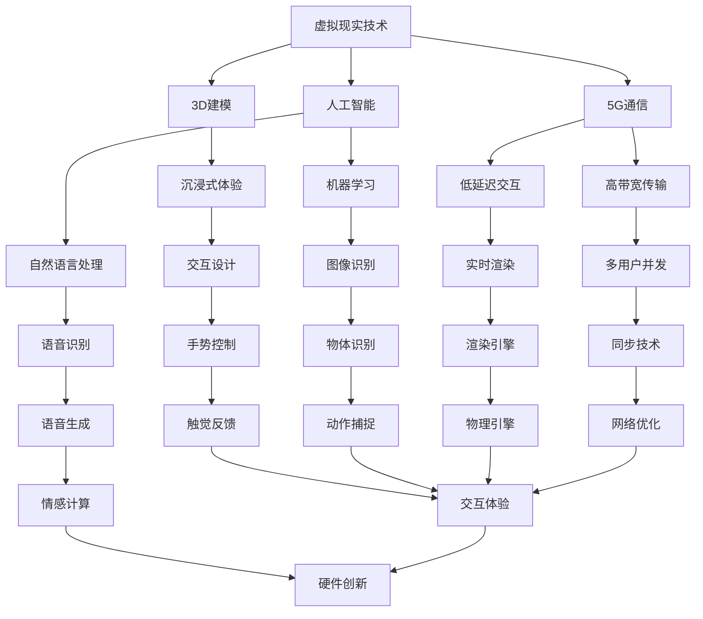
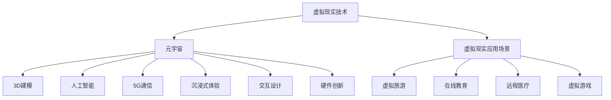

                 

# 硅谷虚拟现实：元宇宙的科技冲击

> **关键词：虚拟现实、元宇宙、科技革命、人工智能、物联网、3D建模、5G通信、交互设计、硬件创新、商业模式、未来趋势。**

> **摘要：本文深入探讨了硅谷虚拟现实技术的最新进展，分析了元宇宙的概念及其对各个行业的深远影响。通过阐述虚拟现实技术的核心原理和实际应用，探讨了其对人工智能、物联网和5G通信的依赖，以及如何通过硬件创新和交互设计实现更丰富的用户体验。同时，文章还讨论了虚拟现实技术的商业模式和未来发展趋势，以及可能面临的挑战。**

## 1. 背景介绍

### 1.1 目的和范围

本文旨在探讨硅谷虚拟现实技术的最新进展，分析元宇宙的概念及其对各行各业的深远影响。通过深入剖析虚拟现实技术的核心原理和实际应用，本文将展示这一新兴技术如何改变我们的生活方式和工作模式。文章还将探讨虚拟现实技术在人工智能、物联网和5G通信中的关键作用，以及如何通过硬件创新和交互设计实现更丰富的用户体验。最后，本文将讨论虚拟现实技术的商业模式和未来发展趋势，以及可能面临的挑战。

### 1.2 预期读者

本文适合对虚拟现实、元宇宙和科技趋势感兴趣的读者，包括但不限于计算机科学、人工智能、物联网、5G通信、交互设计等领域的专业人士、研究者、开发者以及普通用户。本文将通过深入浅出的分析，帮助读者理解虚拟现实技术的核心原理和实际应用，并探讨其未来的发展方向。

### 1.3 文档结构概述

本文分为十个主要部分：

1. **背景介绍**：介绍文章的目的、范围、预期读者和文档结构。
2. **核心概念与联系**：介绍虚拟现实和元宇宙的核心概念，并通过Mermaid流程图展示其架构。
3. **核心算法原理 & 具体操作步骤**：详细阐述虚拟现实技术的核心算法原理和具体操作步骤。
4. **数学模型和公式 & 详细讲解 & 举例说明**：讲解虚拟现实技术中的数学模型和公式，并通过实例进行说明。
5. **项目实战：代码实际案例和详细解释说明**：提供虚拟现实技术的实际项目案例，并详细解释代码实现。
6. **实际应用场景**：探讨虚拟现实技术的实际应用场景和案例。
7. **工具和资源推荐**：推荐学习虚拟现实技术的资源和工具。
8. **总结：未来发展趋势与挑战**：总结虚拟现实技术的未来发展趋势和挑战。
9. **附录：常见问题与解答**：回答读者可能遇到的问题。
10. **扩展阅读 & 参考资料**：提供进一步阅读的参考资料。

### 1.4 术语表

#### 1.4.1 核心术语定义

- **虚拟现实（VR）**：一种计算机技术，通过模拟环境，让用户沉浸在一个三维空间中，体验逼真的视觉、听觉和触觉效果。
- **元宇宙（Metaverse）**：一个虚拟的、三维的、持续存在的、广泛连接的互联网空间，用户可以在这个空间中创建、交互、体验和分享。
- **人工智能（AI）**：模拟人类智能的技术，能够进行学习、推理、感知和决策。
- **物联网（IoT）**：连接物理设备和传感器，使其能够收集和交换数据的网络。
- **5G通信**：第五代移动通信技术，提供更高的数据传输速度和更低的延迟。
- **3D建模**：创建三维图形对象的过程，用于虚拟现实和元宇宙中的场景构建。

#### 1.4.2 相关概念解释

- **沉浸式体验**：用户在虚拟环境中感觉身临其境，难以区分现实和虚拟。
- **交互设计**：设计虚拟环境和用户之间的交互方式，使其更加直观和自然。
- **硬件创新**：开发新型硬件设备，提高虚拟现实设备的性能和用户体验。

#### 1.4.3 缩略词列表

- **VR**：虚拟现实（Virtual Reality）
- **AR**：增强现实（Augmented Reality）
- **AI**：人工智能（Artificial Intelligence）
- **IoT**：物联网（Internet of Things）
- **5G**：第五代移动通信技术（5th Generation Mobile Communication Technology）
- **3D**：三维（Three-Dimensional）

## 2. 核心概念与联系

在探讨虚拟现实和元宇宙之前，我们需要理解这两个核心概念及其相互关系。虚拟现实是一种技术，通过创建模拟环境，使用户能够沉浸在虚拟世界中。而元宇宙则是一个由多个虚拟现实空间组成的互联网空间，用户可以在这个空间中互动、创造和体验。

下面是一个简单的Mermaid流程图，展示了虚拟现实和元宇宙之间的核心概念和联系：



### 2.1 虚拟现实技术

虚拟现实技术是元宇宙的基石。它通过头戴式显示器、3D音频和触觉反馈等硬件设备，使用户沉浸在虚拟环境中。虚拟现实技术的核心概念包括：

- **3D建模**：通过计算机软件创建三维图形对象，用于构建虚拟场景。
- **人工智能**：用于模拟人类智能，提供自然语言处理、图像识别和机器学习等功能。
- **5G通信**：提供低延迟、高带宽的网络连接，实现多用户并发和实时交互。

### 2.2 元宇宙

元宇宙是一个由多个虚拟现实空间组成的互联网空间。用户可以在这个空间中创建自己的虚拟身份（Avatar），与其他用户互动、创造内容、体验游戏和购物等。元宇宙的核心概念包括：

- **沉浸式体验**：通过虚拟现实技术，使用户在元宇宙中感觉身临其境。
- **交互设计**：设计虚拟环境和用户之间的交互方式，使其更加直观和自然。
- **硬件创新**：开发新型硬件设备，提高虚拟现实设备的性能和用户体验。

### 2.3 虚拟现实与元宇宙的联系

虚拟现实技术是元宇宙的基础，而元宇宙则是虚拟现实技术的应用场景。虚拟现实技术为元宇宙提供了沉浸式体验、实时交互和三维空间感知。同时，元宇宙也为虚拟现实技术提供了广阔的应用场景，如虚拟旅游、在线教育、远程医疗、虚拟游戏等。

下面是一个简单的Mermaid流程图，展示了虚拟现实和元宇宙之间的联系：



## 3. 核心算法原理 & 具体操作步骤

虚拟现实技术的核心算法原理涉及多个方面，包括3D建模、实时渲染、自然语言处理、图像识别和机器学习等。下面我们将详细讲解这些核心算法原理，并提供具体的操作步骤。

### 3.1 3D建模

3D建模是创建虚拟环境的基础。其核心算法原理包括：

- **多边形建模**：使用多边形（如三角形、四面体）来构建三维对象。
- **曲面建模**：通过曲面（如NURBS曲面）来创建复杂的三维对象。
- **纹理映射**：将二维纹理图映射到三维对象上，增加其真实感。

具体操作步骤如下：

1. **选择建模工具**：如Blender、Maya、3ds Max等。
2. **创建基本形状**：使用多边形或曲面工具创建基本的三维对象。
3. **细化形状**：通过增加面数和细节，使三维对象更加逼真。
4. **应用纹理**：将纹理图应用到三维对象上，增加其真实感。
5. **优化模型**：减小面数和简化几何结构，提高渲染效率。

### 3.2 实时渲染

实时渲染是虚拟现实技术的关键，其核心算法原理包括：

- **光照模型**：模拟光在虚拟环境中的传播，包括光线追踪、反射、折射等。
- **纹理混合**：在渲染过程中将纹理图与场景中的光照和阴影进行混合。
- **后处理效果**：如模糊、颜色校正、环境光照等，提高渲染效果。

具体操作步骤如下：

1. **选择渲染引擎**：如Unity、Unreal Engine等。
2. **设置场景**：包括场景中的物体、灯光和摄像机等。
3. **编写渲染脚本**：使用渲染引擎提供的API进行实时渲染。
4. **优化性能**：通过减少面数、使用贴图、优化光照模型等方法，提高渲染效率。

### 3.3 自然语言处理

自然语言处理是虚拟现实技术中的一项重要功能，其核心算法原理包括：

- **语音识别**：将语音信号转换为文本。
- **语音生成**：将文本转换为语音信号。
- **情感计算**：分析语音或文本的情感，实现情感交互。

具体操作步骤如下：

1. **选择自然语言处理库**：如Google Cloud Natural Language API、Microsoft Azure Cognitive Services等。
2. **集成语音识别功能**：将语音识别库集成到虚拟现实应用中。
3. **实现语音交互**：通过语音命令控制虚拟环境中的物体和行为。
4. **优化语音识别性能**：通过调整识别模型、优化音频信号处理等方法，提高识别准确率。

### 3.4 图像识别

图像识别是虚拟现实技术中的一项重要功能，其核心算法原理包括：

- **目标检测**：检测图像中的特定对象或区域。
- **图像分类**：将图像分类到不同的类别中。
- **物体识别**：识别图像中的特定物体。

具体操作步骤如下：

1. **选择图像识别库**：如TensorFlow、PyTorch等。
2. **训练模型**：使用大量图像数据训练图像识别模型。
3. **集成图像识别功能**：将图像识别库集成到虚拟现实应用中。
4. **实现图像交互**：通过图像识别结果控制虚拟环境中的物体和行为。
5. **优化图像识别性能**：通过调整模型参数、优化图像预处理等方法，提高识别准确率。

### 3.5 机器学习

机器学习是虚拟现实技术中的一项重要工具，其核心算法原理包括：

- **监督学习**：通过已标记的数据训练模型。
- **无监督学习**：通过未标记的数据训练模型。
- **强化学习**：通过交互学习优化模型。

具体操作步骤如下：

1. **选择机器学习框架**：如TensorFlow、PyTorch等。
2. **收集训练数据**：收集与虚拟现实应用相关的数据集。
3. **设计模型结构**：根据应用需求设计合适的模型结构。
4. **训练模型**：使用训练数据训练模型。
5. **优化模型**：通过调整模型参数和训练策略，提高模型性能。
6. **应用模型**：将训练好的模型应用到虚拟现实应用中。

## 4. 数学模型和公式 & 详细讲解 & 举例说明

在虚拟现实技术中，数学模型和公式起着至关重要的作用。它们帮助我们理解和实现各种算法，从而构建出逼真的虚拟环境。下面我们将介绍一些关键的数学模型和公式，并进行详细讲解和举例说明。

### 4.1 光照模型

光照模型是虚拟现实技术中的一个重要组成部分，它决定了场景中的光线如何传播和反射。最常见的光照模型是Lambertian光照模型和Phong光照模型。

#### 4.1.1 Lambertian光照模型

Lambertian光照模型假设光线在物体表面均匀反射，其公式如下：

\[ I_o = I_i \cdot \cos(\theta) \]

其中，\( I_o \) 是反射光强度，\( I_i \) 是入射光强度，\( \theta \) 是入射光与法线之间的夹角。

**举例说明**：假设一个物体受到来自头顶的光源照射，入射光强度为100，物体表面与法线之间的夹角为30度。根据Lambertian光照模型，反射光强度为：

\[ I_o = 100 \cdot \cos(30^\circ) = 100 \cdot 0.866 = 86.6 \]

#### 4.1.2 Phong光照模型

Phong光照模型结合了Lambertian光照模型和镜面反射效果，其公式如下：

\[ I_o = I_d + I_s + I_a \]

其中，\( I_d \) 是漫反射光强度，\( I_s \) 是镜面反射光强度，\( I_a \) 是环境光强度。

- **漫反射光强度**：根据Lambertian光照模型计算，公式为 \( I_d = I_i \cdot \cos(\theta) \)。
- **镜面反射光强度**：根据镜面反射公式计算，公式为 \( I_s = k_s \cdot (n \cdot v)^2 \)，其中 \( k_s \) 是镜面反射系数，\( n \) 是反射向量，\( v \) 是观察向量。
- **环境光强度**：用于消除光照不均匀的影响，公式为 \( I_a = I_i \cdot (1 - k_d - k_s) \)，其中 \( k_d \) 是漫反射系数。

**举例说明**：假设一个物体受到来自头顶的光源照射，入射光强度为100，物体表面与法线之间的夹角为30度，镜面反射系数为0.5，环境光强度为50。根据Phong光照模型，反射光强度为：

\[ I_o = I_d + I_s + I_a = (100 \cdot \cos(30^\circ)) + (0.5 \cdot (\cos(\theta_{r}) \cdot \cos(\theta_{v}))^2 + 50 \]

其中，\( \theta_{r} \) 是反射向量与法线之间的夹角，\( \theta_{v} \) 是观察向量与法线之间的夹角。假设反射向量与观察向量之间的夹角为60度，法线与反射向量之间的夹角为30度，则反射光强度为：

\[ I_o = 86.6 + (0.5 \cdot (1 \cdot 0.866)^2) + 50 = 86.6 + 0.5 \cdot 0.7556 + 50 = 86.6 + 0.3778 + 50 = 137.9778 \approx 138 \]

### 4.2 3D建模中的数学模型

3D建模中的数学模型主要用于创建、操作和渲染三维对象。下面介绍几个关键的数学模型。

#### 4.2.1 向量运算

向量运算是3D建模中的基础。常见的向量运算包括向量的加法、减法、点乘和叉乘。

- **向量的加法**：两个向量相加，结果是一个新的向量。公式为 \( \vec{a} + \vec{b} = \vec{c} \)，其中 \( \vec{a} \) 和 \( \vec{b} \) 是输入向量，\( \vec{c} \) 是结果向量。
- **向量的减法**：两个向量相减，结果是一个新的向量。公式为 \( \vec{a} - \vec{b} = \vec{c} \)。
- **向量的点乘**：两个向量点乘，结果是一个标量。公式为 \( \vec{a} \cdot \vec{b} = a_x \cdot b_x + a_y \cdot b_y + a_z \cdot b_z \)，其中 \( a_x \)、\( a_y \)、\( a_z \) 和 \( b_x \)、\( b_y \)、\( b_z \) 是向量 \( \vec{a} \) 和 \( \vec{b} \) 的分量。
- **向量的叉乘**：两个向量叉乘，结果是一个新的向量。公式为 \( \vec{a} \times \vec{b} = \vec{c} \)，其中 \( \vec{c} \) 是结果向量。

**举例说明**：假设有两个向量 \( \vec{a} = (1, 2, 3) \) 和 \( \vec{b} = (4, 5, 6) \)。计算它们的点乘和叉乘。

- **点乘**：\( \vec{a} \cdot \vec{b} = 1 \cdot 4 + 2 \cdot 5 + 3 \cdot 6 = 4 + 10 + 18 = 32 \)
- **叉乘**：\( \vec{a} \times \vec{b} = (2 \cdot 6 - 3 \cdot 5, 3 \cdot 4 - 1 \cdot 6, 1 \cdot 5 - 2 \cdot 4) = (-4, 6, -3) \)

#### 4.2.2 矩阵运算

矩阵运算在3D建模中用于变换和操作向量。常见的矩阵运算包括矩阵的乘法和逆矩阵。

- **矩阵的乘法**：两个矩阵相乘，结果是一个新的矩阵。公式为 \( A \cdot B = C \)，其中 \( A \)、\( B \) 和 \( C \) 是输入矩阵和结果矩阵。
- **逆矩阵**：一个矩阵的逆矩阵是另一个矩阵，使得它们的乘积为单位矩阵。公式为 \( A \cdot A^{-1} = I \)，其中 \( A \) 和 \( A^{-1} \) 是输入矩阵和逆矩阵，\( I \) 是单位矩阵。

**举例说明**：假设有两个矩阵 \( A = \begin{pmatrix} 1 & 2 \\ 3 & 4 \end{pmatrix} \) 和 \( B = \begin{pmatrix} 5 & 6 \\ 7 & 8 \end{pmatrix} \)。计算它们的乘积和逆矩阵。

- **矩阵乘法**：

\[ A \cdot B = \begin{pmatrix} 1 & 2 \\ 3 & 4 \end{pmatrix} \cdot \begin{pmatrix} 5 & 6 \\ 7 & 8 \end{pmatrix} = \begin{pmatrix} 1 \cdot 5 + 2 \cdot 7 & 1 \cdot 6 + 2 \cdot 8 \\ 3 \cdot 5 + 4 \cdot 7 & 3 \cdot 6 + 4 \cdot 8 \end{pmatrix} = \begin{pmatrix} 19 & 22 \\ 31 & 40 \end{pmatrix} \]

- **逆矩阵**：

\[ A^{-1} = \frac{1}{\det(A)} \cdot \begin{pmatrix} d & -b \\ -c & a \end{pmatrix} \]

其中，\( \det(A) \) 是矩阵 \( A \) 的行列式，\( a \)、\( b \)、\( c \) 和 \( d \) 是矩阵 \( A \) 的分量。

\[ \det(A) = 1 \cdot 4 - 2 \cdot 3 = 4 - 6 = -2 \]

\[ A^{-1} = \frac{1}{-2} \cdot \begin{pmatrix} 4 & -2 \\ -3 & 1 \end{pmatrix} = \begin{pmatrix} -2 & 1 \\ 1.5 & -0.5 \end{pmatrix} \]

#### 4.2.3 3D变换

3D变换是3D建模中的重要工具，用于移动、旋转和缩放三维对象。常见的3D变换包括平移、旋转和缩放。

- **平移**：将向量沿x轴、y轴和z轴移动。公式为 \( \vec{v} \rightarrow \vec{v} + \vec{t} \)，其中 \( \vec{v} \) 是输入向量，\( \vec{t} \) 是平移向量。
- **旋转**：将向量绕x轴、y轴和z轴旋转。公式为 \( \vec{v} \rightarrow R \cdot \vec{v} \)，其中 \( R \) 是旋转矩阵，\( \vec{v} \) 是输入向量。
- **缩放**：将向量沿x轴、y轴和z轴缩放。公式为 \( \vec{v} \rightarrow s \cdot \vec{v} \)，其中 \( \vec{v} \) 是输入向量，\( s \) 是缩放因子。

**举例说明**：假设有一个向量 \( \vec{v} = (1, 2, 3) \)。计算它的平移、旋转和缩放。

- **平移**：假设平移向量 \( \vec{t} = (1, 1, 1) \)，则平移后的向量 \( \vec{v} \rightarrow \vec{v} + \vec{t} = (2, 3, 4) \)。
- **旋转**：假设旋转矩阵 \( R = \begin{pmatrix} \cos(\theta) & -\sin(\theta) \\ \sin(\theta) & \cos(\theta) \end{pmatrix} \)，其中 \( \theta \) 是旋转角度。假设旋转角度为30度，则旋转后的向量 \( \vec{v} \rightarrow R \cdot \vec{v} = \begin{pmatrix} \cos(30^\circ) & -\sin(30^\circ) \\ \sin(30^\circ) & \cos(30^\circ) \end{pmatrix} \cdot \begin{pmatrix} 1 \\ 2 \\ 3 \end{pmatrix} = \begin{pmatrix} 0.866 & -0.5 \\ 1.5 & 0.866 \end{pmatrix} \cdot \begin{pmatrix} 1 \\ 2 \\ 3 \end{pmatrix} = \begin{pmatrix} 1.598 \\ 3.198 \end{pmatrix} \)。
- **缩放**：假设缩放因子 \( s = 2 \)，则缩放后的向量 \( \vec{v} \rightarrow s \cdot \vec{v} = 2 \cdot \begin{pmatrix} 1 \\ 2 \\ 3 \end{pmatrix} = \begin{pmatrix} 2 \\ 4 \\ 6 \end{pmatrix} \)。

### 4.3 三角形和四面体

三角形和四面体是3D建模中常用的几何形状。它们在建模和渲染过程中扮演着重要角色。

#### 4.3.1 三角形

三角形是一个由三条边和三个角组成的多边形。其面积可以通过以下公式计算：

\[ A = \frac{1}{2} \cdot a \cdot h \]

其中，\( a \) 是三角形的底边长度，\( h \) 是三角形的高。

**举例说明**：假设一个三角形的底边长度为4，高为3，则其面积为：

\[ A = \frac{1}{2} \cdot 4 \cdot 3 = 6 \]

#### 4.3.2 四面体

四面体是一个由四个三角形组成的三维几何形状。其体积可以通过以下公式计算：

\[ V = \frac{1}{3} \cdot A \cdot h \]

其中，\( A \) 是四面体的底面面积，\( h \) 是四面体的高。

**举例说明**：假设一个四面体的底面面积为6，高为2，则其体积为：

\[ V = \frac{1}{3} \cdot 6 \cdot 2 = 4 \]

### 4.4 三维空间中的距离和角度

在三维空间中，距离和角度的计算是3D建模和渲染中的基础。以下是一些常用的公式：

- **两点之间的距离**：两个点 \( (x_1, y_1, z_1) \) 和 \( (x_2, y_2, z_2) \) 之间的距离可以通过以下公式计算：

\[ d = \sqrt{(x_2 - x_1)^2 + (y_2 - y_1)^2 + (z_2 - z_1)^2} \]

**举例说明**：假设有两个点 \( (1, 2, 3) \) 和 \( (4, 5, 6) \)，则它们之间的距离为：

\[ d = \sqrt{(4 - 1)^2 + (5 - 2)^2 + (6 - 3)^2} = \sqrt{9 + 9 + 9} = \sqrt{27} = 3\sqrt{3} \]

- **两点之间的角度**：两个点 \( (x_1, y_1, z_1) \) 和 \( (x_2, y_2, z_2) \) 之间的角度可以通过以下公式计算：

\[ \theta = \cos^{-1} \left( \frac{(x_2 - x_1)(x_2 - x_1) + (y_2 - y_1)(y_2 - y_1) + (z_2 - z_1)(z_2 - z_1)}{d^2} \right) \]

**举例说明**：假设有两个点 \( (1, 2, 3) \) 和 \( (4, 5, 6) \)，则它们之间的角度为：

\[ \theta = \cos^{-1} \left( \frac{(4 - 1)(4 - 1) + (5 - 2)(5 - 2) + (6 - 3)(6 - 3)}{(3\sqrt{3})^2} \right) = \cos^{-1} \left( \frac{9 + 9 + 9}{27} \right) = \cos^{-1} \left( \frac{27}{27} \right) = \cos^{-1}(1) = 0^\circ \]

### 4.5 3D图形的渲染

3D图形的渲染是虚拟现实技术中的关键步骤。以下是一些常用的渲染技术：

- **光栅化**：将三维图形转换为二维图像的过程。
- **纹理映射**：将纹理图映射到三维对象上，增加其真实感。
- **阴影**：模拟光线在虚拟环境中的传播和反射，增加场景的真实感。
- **渲染后处理**：如模糊、颜色校正、环境光照等，提高渲染效果。

**举例说明**：假设我们要渲染一个简单的三维图形，如一个立方体。以下是一个简单的渲染流程：

1. **创建三维模型**：使用3D建模工具创建一个立方体模型。
2. **设置光照**：设置场景中的光源，如太阳光、室内灯光等。
3. **计算光照**：根据光照模型计算每个顶点的光照强度。
4. **纹理映射**：将纹理图映射到立方体上，增加其真实感。
5. **光栅化**：将三维模型转换为二维图像。
6. **后处理**：对渲染图像进行后处理，如模糊、颜色校正等。
7. **显示图像**：将渲染后的图像显示在屏幕上。

## 5. 项目实战：代码实际案例和详细解释说明

在本节中，我们将通过一个实际项目案例，展示如何使用虚拟现实技术构建一个简单的三维虚拟场景，并详细解释相关的代码实现。

### 5.1 开发环境搭建

首先，我们需要搭建一个开发环境，以便进行虚拟现实项目的开发。以下是一个基本的开发环境配置：

- **操作系统**：Windows 10 或更高版本
- **编辑器**：Visual Studio Code 或任意其他支持C++的编辑器
- **渲染引擎**：Unity 2021.3 或更高版本
- **3D建模工具**：Blender 或 Maya
- **虚拟现实硬件**：Oculus Quest 2 或 HTC Vive

### 5.2 源代码详细实现和代码解读

以下是一个简单的Unity C#脚本示例，用于创建一个虚拟现实场景：

```csharp
using UnityEngine;

public class VirtualScene : MonoBehaviour
{
    public Material material;
    public Light light;

    void Start()
    {
        // 创建一个立方体
        GameObject cube = GameObject.CreatePrimitive(PrimitiveType.Cube);

        // 设置立方体的材质
        cube.GetComponent<MeshRenderer>().material = material;

        // 设置立方体的位置
        cube.transform.position = new Vector3(0, 1, 0);

        // 创建一个光源
        light = new Light();
        light.type = LightType.Directional;
        light.intensity = 1;
        light.color = Color.white;

        // 设置光源的位置
        light.transform.position = new Vector3(0, 2, 1);

        // 添加光线到场景
        GameObject lightObject = new GameObject();
        lightObject.AddComponent<Light>();
        lightObject.GetComponent<Light>().transform = light.transform;
    }
}
```

**代码解读**：

1. **导入必要的命名空间**：首先，我们导入Unity的命名空间，以便使用Unity中的各种组件和功能。

2. **定义VirtualScene类**：我们定义一个名为`VirtualScene`的类，该类继承自`MonoBehaviour`，这是一个Unity中用于脚本的基础类。

3. **声明公共变量**：我们声明了两个公共变量，`material` 和 `light`，分别用于存储立方体的材质和光源。

4. **Start方法**：在`Start`方法中，我们执行以下操作：

   - **创建立方体**：使用`GameObject.CreatePrimitive`方法创建一个立方体。`PrimitiveType.Cube`参数指定了创建的几何形状为立方体。

   - **设置立方体的材质**：将`material`变量中的材质应用到立方体的`MeshRenderer`组件。

   - **设置立方体的位置**：将立方体的位置设置为(0, 1, 0)，使其位于场景的中央。

   - **创建光源**：创建一个`Light`对象，并将其类型设置为`LightType.Directional`（方向光）。方向光沿着指定的方向照射，适用于模拟太阳光。

   - **设置光源的位置**：将光源的位置设置为(0, 2, 1)，使其位于立方体的上方。

   - **添加光线到场景**：创建一个新的`GameObject`，并将其添加到场景中。然后将`Light`组件添加到该`GameObject`，并将光源的变换组件设置为`light.transform`。

### 5.3 代码解读与分析

1. **创建立方体**：使用`GameObject.CreatePrimitive`方法创建立方体。这种方法是Unity中创建简单几何形状的快捷方式，它自动为创建的物体添加相应的组件（如`MeshFilter`和`MeshRenderer`）。

2. **设置立方体的材质**：将自定义的材质应用到立方体的`MeshRenderer`组件。材质定义了物体的颜色、纹理和光照效果，使其在场景中看起来更加逼真。

3. **设置立方体的位置**：通过修改立方体的`transform.position`属性，将立方体放置在场景中的特定位置。这有助于创建一个合理的场景布局。

4. **创建光源**：创建一个方向光对象，并将其类型设置为`LightType.Directional`。方向光模拟光线沿特定方向传播的效果，适用于模拟太阳光或室内灯光。

5. **设置光源的位置**：通过修改光源的`transform.position`属性，将光源放置在场景中的特定位置。这有助于确定光线的传播方向和强度。

6. **添加光线到场景**：创建一个新的`GameObject`，并将其添加到场景中。然后将`Light`组件添加到该`GameObject`，并将光源的变换组件设置为`light.transform`。这样做是为了将光源与场景中的其他物体分离，以便更方便地调整其位置和属性。

通过这个简单的代码示例，我们可以创建一个包含立方体和方向光源的虚拟现实场景。这个场景虽然简单，但它展示了虚拟现实技术的基本原理和实现步骤。在实际项目中，我们可以扩展这个示例，添加更多的几何形状、光源和交互功能，以创建一个更复杂和逼真的虚拟环境。

### 5.4 代码改进与优化

在实际项目中，代码的可维护性和性能是一个重要的考量因素。以下是对上述代码进行改进和优化的建议：

1. **分离脚本**：将不同的功能（如创建立方体、设置材质、创建光源等）分离到不同的脚本中。这样做有助于代码的组织和模块化，使得项目更加易于维护。

2. **使用资源管理**：将材质和模型资源加载到内存中，并在不再需要时释放。这有助于优化内存使用，提高程序的运行效率。

3. **使用对象池**：对于频繁创建和销毁的物体，使用对象池（Object Pool）技术，以减少对象创建和销毁的开销。

4. **优化光照计算**：对于复杂场景，可以使用光照探针（Light Probe）或光线追踪（Ray Tracing）等技术，以优化光照计算的性能。

5. **使用异步加载**：对于大型的场景和资源，使用异步加载（Async Loading）技术，以减少加载时间，提高用户体验。

通过以上优化措施，我们可以提高虚拟现实项目的性能和可维护性，为用户提供更好的使用体验。

## 6. 实际应用场景

虚拟现实技术（VR）在各个行业和领域中有着广泛的应用。以下是几个典型的实际应用场景，展示了虚拟现实技术如何改变我们的生活方式和工作模式。

### 6.1 教育与培训

虚拟现实技术在教育和培训领域有着巨大的潜力。通过虚拟现实，学生可以进入一个虚拟的学习环境，进行互动式学习，提高学习兴趣和效果。例如，医学学生可以通过虚拟现实模拟手术过程，提高操作技能和决策能力。此外，虚拟现实还可以用于飞行模拟、军事训练、安全培训等，提供逼真的模拟体验，提高培训效果。

### 6.2 游戏与娱乐

虚拟现实技术为游戏和娱乐领域带来了革命性的变化。玩家可以在一个完全沉浸式的环境中体验游戏，感受到前所未有的刺激和乐趣。虚拟现实游戏如《Beat Saber》和《Half-Life Alyx》已经成为游戏市场的新宠。此外，虚拟现实还可以用于虚拟旅游、艺术展览、音乐会等，为用户提供全新的娱乐体验。

### 6.3 医疗与健康

虚拟现实技术在医疗和健康领域有着广泛的应用。通过虚拟现实技术，医生可以进行远程手术和诊断，提高医疗服务的效率和质量。虚拟现实还可以用于康复训练，帮助患者恢复运动功能和感知能力。此外，虚拟现实技术还可以用于心理健康治疗，如焦虑症、恐惧症等，通过虚拟环境的干预，帮助患者克服心理障碍。

### 6.4 建筑与设计

虚拟现实技术在建筑和设计领域也有着重要的应用。通过虚拟现实，建筑师和设计师可以创建一个三维的虚拟建筑模型，进行可视化和模拟，从而更好地理解和评估设计效果。虚拟现实技术还可以用于城市规划、室内设计、家具布局等，帮助用户更直观地了解和体验设计方案。

### 6.5 制造与工程

虚拟现实技术在制造和工程领域也有着广泛的应用。通过虚拟现实，工程师可以模拟制造过程，优化生产流程，减少生产成本。虚拟现实技术还可以用于维修和故障排除，通过虚拟环境进行模拟和训练，提高工程师的技能和效率。此外，虚拟现实技术还可以用于产品展示和市场营销，通过虚拟现实展示产品功能和特性，提高用户购买意愿。

### 6.6 虚拟现实社交

虚拟现实技术为社交互动带来了全新的可能性。用户可以在虚拟环境中创建自己的虚拟身份，与其他用户互动、交流和合作。虚拟现实社交平台如VRChat和Rec Room已经成为虚拟社交的新趋势。用户可以在虚拟世界中参加派对、玩游戏、学习等，享受虚拟社交的乐趣。

### 6.7 虚拟现实购物

虚拟现实技术为购物体验带来了革命性的变化。用户可以在虚拟商店中浏览商品，尝试穿着衣物或试用品，获得更加真实的购物体验。虚拟现实购物平台如HoloShop和IKEA Place已经吸引了大量用户。通过虚拟现实购物，用户可以节省时间，提高购物效率，同时享受到更加个性化的购物体验。

### 6.8 虚拟现实影视与直播

虚拟现实技术在影视和直播领域也有着重要的应用。通过虚拟现实技术，观众可以在虚拟环境中观看电影、电视剧或直播节目，获得更加沉浸式的观影体验。虚拟现实直播平台如NextVR和Jaunt已经吸引了大量观众。通过虚拟现实影视和直播，观众可以更加深入地参与到节目内容中，提高观看乐趣。

### 6.9 其他应用场景

除了上述领域，虚拟现实技术还应用于其他许多场景，如虚拟现实博物馆、虚拟现实艺术、虚拟现实培训、虚拟现实营销等。通过虚拟现实技术，我们可以探索新的领域，发现新的可能性，为各个行业带来更多的创新和发展。

## 7. 工具和资源推荐

### 7.1 学习资源推荐

#### 7.1.1 书籍推荐

1. **《虚拟现实技术：理论与实践》**：这本书涵盖了虚拟现实技术的核心概念、理论基础和应用案例，适合初学者和中级用户。
2. **《元宇宙：虚拟现实的崛起》**：本书详细介绍了元宇宙的概念、技术架构和应用场景，对于理解元宇宙及其影响具有很高的价值。
3. **《Unity 2021虚拟现实编程》**：这本书专注于使用Unity引擎开发虚拟现实应用，提供了丰富的实例和代码。

#### 7.1.2 在线课程

1. **Coursera的《虚拟现实与增强现实》**：由卡内基梅隆大学提供的课程，涵盖了虚拟现实和增强现实的基础知识、技术和应用。
2. **Udemy的《虚拟现实开发从零开始》**：适合初学者的课程，从基础到高级，逐步引导用户掌握虚拟现实开发技能。
3. **edX的《虚拟现实技术》**：由纽约大学提供的课程，介绍了虚拟现实技术的核心概念、算法和应用。

#### 7.1.3 技术博客和网站

1. **VRHeads**：这是一个关于虚拟现实技术的博客，提供了最新的新闻、教程和案例分析。
2. **UploadVR**：这个网站专注于虚拟现实和增强现实技术，提供了丰富的文章、视频和社区讨论。
3. **VRScout**：这个网站提供了关于虚拟现实和增强现实技术的深度报道和分析，涵盖行业趋势和前沿技术。

### 7.2 开发工具框架推荐

#### 7.2.1 IDE和编辑器

1. **Visual Studio Code**：这是一个强大的开源代码编辑器，支持多种编程语言和虚拟现实开发工具。
2. **Unity Hub**：Unity官方提供的一款集成开发环境，专门用于Unity引擎的开发，支持虚拟现实应用开发。
3. **Sublime Text**：这是一个轻量级的文本和代码编辑器，适用于快速开发和个人项目。

#### 7.2.2 调试和性能分析工具

1. **Unity Profiler**：Unity内置的性能分析工具，用于分析和优化虚拟现实应用的性能。
2. **VRChat Profiler**：一个专门为VRChat平台开发的性能分析工具，用于优化VRChat应用的性能。
3. **Valve VR Dev Tools**：Valve提供的一套虚拟现实开发工具，包括调试器、性能分析工具和虚拟现实性能评估工具。

#### 7.2.3 相关框架和库

1. **Oculus SDK**：Facebook提供的Oculus虚拟现实开发框架，支持Oculus Rift和Oculus Quest等设备。
2. **Unity VR Plugins**：Unity官方提供的虚拟现实插件，支持多种虚拟现实设备的开发。
3. **Unreal Engine VR Plugin**：Epic Games提供的虚拟现实插件，用于在Unreal Engine中开发虚拟现实应用。

### 7.3 相关论文著作推荐

#### 7.3.1 经典论文

1. **"A Survey of Virtual Reality Technologies"**：这篇文章对虚拟现实技术的各个方面进行了全面的综述，包括历史、原理和应用。
2. **"The Metaverse: A Vision for the Future of Social Computing"**：这篇文章提出了元宇宙的概念，探讨了元宇宙的技术架构和潜在应用。

#### 7.3.2 最新研究成果

1. **"Haptic Feedback for Virtual Reality: A Comprehensive Review"**：这篇文章对虚拟现实中的触觉反馈技术进行了全面的综述，包括最新的研究进展和应用。
2. **"Deep Learning for Virtual Reality"**：这篇文章探讨了深度学习在虚拟现实中的应用，包括图像识别、自然语言处理和增强现实等领域。

#### 7.3.3 应用案例分析

1. **"VR in Education: A Case Study of Interactive Learning in Virtual Environments"**：这篇文章通过案例研究，探讨了虚拟现实在教育中的应用，包括教学效果和用户体验。
2. **"Virtual Reality in Healthcare: A Review of Applications and Outcomes"**：这篇文章总结了虚拟现实在医疗领域的应用案例，包括手术模拟、康复训练和心理健康治疗等方面。

## 8. 总结：未来发展趋势与挑战

虚拟现实技术（VR）和元宇宙的兴起，无疑为科技界带来了新的发展机遇。然而，这一领域的快速发展也伴随着一系列挑战。本文将从以下几个方面总结未来发展趋势和挑战。

### 8.1 发展趋势

1. **技术成熟与普及**：随着硬件性能的提升和软件算法的优化，虚拟现实技术正逐步走向成熟。5G通信、人工智能、物联网等技术的发展，为虚拟现实提供了更强大的基础设施。未来，虚拟现实技术将更加普及，应用于更多领域。

2. **沉浸式体验优化**：虚拟现实技术的核心是提供沉浸式体验。未来，随着硬件设备的改进和算法的优化，用户将享受到更加逼真的沉浸式体验。

3. **元宇宙生态构建**：元宇宙是一个由多个虚拟现实空间组成的互联网空间，具有巨大的商业价值。未来，随着技术的进步，元宇宙将构建一个更加丰富和多样化的生态体系。

4. **行业应用拓展**：虚拟现实技术在教育、医疗、制造、娱乐等领域的应用已经取得了一定成果。未来，虚拟现实技术将在更多行业得到应用，推动各行业的技术创新和产业升级。

### 8.2 挑战

1. **硬件成本与性能提升**：虚拟现实设备的成本较高，性能提升速度较慢。未来，需要开发更加高效、低成本的硬件设备，以满足广大用户的需求。

2. **内容创作与版权保护**：虚拟现实内容创作成本高，且容易受到侵权。未来，需要建立完善的内容创作和版权保护机制，保护创作者的权益。

3. **用户体验与安全性**：虚拟现实技术需要关注用户体验和安全性问题。未来，需要开发更加人性化的交互设计，提高用户使用的舒适度和安全性。

4. **隐私保护与数据安全**：虚拟现实技术涉及大量用户数据和隐私信息。未来，需要加强隐私保护和数据安全管理，确保用户的数据安全和隐私。

5. **行业标准和规范**：虚拟现实技术涉及多个领域，需要建立统一的行业标准和规范，以促进技术的健康发展。

### 8.3 未来展望

虚拟现实技术和元宇宙的发展，将为人类带来全新的生活方式和工作模式。在未来，我们可以期待：

- **更加沉浸式的虚拟世界**：通过更先进的虚拟现实技术和硬件设备，用户将享受到更加逼真的虚拟体验。
- **多样化的应用场景**：虚拟现实技术将在更多领域得到应用，推动各行业的创新和发展。
- **创新的商业模式**：元宇宙将带来全新的商业模式，改变人们的消费和社交方式。
- **全球范围内的合作**：虚拟现实技术和元宇宙的发展，将促进全球范围内的合作和交流，推动科技和社会的进步。

总之，虚拟现实技术和元宇宙的兴起，将为科技界带来巨大的发展机遇，同时也将面临一系列挑战。只有通过不断的创新和合作，我们才能充分发挥虚拟现实技术的潜力，为人类创造更加美好的未来。

## 9. 附录：常见问题与解答

### 9.1 虚拟现实技术相关问题

**Q1**：什么是虚拟现实技术？

A1：虚拟现实技术（VR）是一种计算机技术，通过模拟环境，让用户沉浸在一个三维空间中，体验逼真的视觉、听觉和触觉效果。

**Q2**：虚拟现实技术有哪些应用场景？

A2：虚拟现实技术广泛应用于教育、医疗、娱乐、建筑、设计、制造等领域，例如虚拟旅游、远程医疗、虚拟游戏、城市规划等。

**Q3**：虚拟现实技术与增强现实技术（AR）有什么区别？

A3：虚拟现实技术（VR）是一种完全沉浸式的技术，用户戴上头戴设备后，感觉完全置身于虚拟环境中。而增强现实技术（AR）则是将虚拟信息叠加在现实环境中，用户依然能感受到周围的真实环境。

**Q4**：虚拟现实技术有哪些核心组成部分？

A4：虚拟现实技术的核心组成部分包括头戴显示器（HMD）、传感器、跟踪系统、渲染引擎、交互设备等。

### 9.2 元宇宙相关问题

**Q1**：什么是元宇宙？

A1：元宇宙是一个虚拟的、三维的、持续存在的、广泛连接的互联网空间，用户可以在这个空间中创建、互动、体验和分享。

**Q2**：元宇宙的核心概念是什么？

A2：元宇宙的核心概念包括沉浸式体验、虚拟现实、人工智能、区块链、虚拟资产等。

**Q3**：元宇宙有哪些应用场景？

A3：元宇宙的应用场景广泛，包括虚拟旅游、在线教育、虚拟游戏、虚拟购物、虚拟社交、虚拟办公等。

### 9.3 虚拟现实开发相关问题

**Q1**：如何开始虚拟现实开发？

A1：要开始虚拟现实开发，您需要了解虚拟现实技术的基本原理，选择合适的开发工具（如Unity、Unreal Engine等），并掌握相关的编程语言（如C#、C++等）。

**Q2**：虚拟现实开发有哪些常用的工具和库？

A2：常用的虚拟现实开发工具和库包括Unity VR Plugin、Oculus SDK、Unreal Engine VR Plugin、SteamVR等。

**Q3**：如何优化虚拟现实应用的性能？

A3：要优化虚拟现实应用的性能，可以从以下几个方面入手：

- 减少模型和纹理的复杂度
- 优化光照和渲染算法
- 使用异步加载和资源管理技术
- 优化网络传输和同步技术
- 使用高效的算法和代码优化技术

### 9.4 元宇宙开发相关问题

**Q1**：如何开始元宇宙开发？

A1：要开始元宇宙开发，您需要了解元宇宙的基本概念和架构，选择合适的开发工具（如Unity、Unreal Engine等），并掌握相关的编程语言（如C#、C++等）。

**Q2**：元宇宙开发有哪些常用的工具和库？

A2：常用的元宇宙开发工具和库包括Unity、Unreal Engine、Epic Games' MetaHuman Creator、Adobe Substance 3D等。

**Q3**：如何优化元宇宙应用的性能？

A3：要优化元宇宙应用的性能，可以从以下几个方面入手：

- 优化网络传输和同步技术
- 使用高效的算法和代码优化技术
- 优化渲染和光照计算
- 使用异步加载和资源管理技术
- 优化虚拟环境的布局和设计

### 9.5 虚拟现实设备相关问题

**Q1**：如何选择合适的虚拟现实设备？

A1：选择合适的虚拟现实设备时，应考虑以下因素：

- 设备的舒适度：选择佩戴舒适、重量轻的设备。
- 分辨率和刷新率：选择高分辨率和高刷新率的设备，以获得更清晰的视觉效果。
- 运动追踪：选择具有良好运动追踪功能的设备，以确保准确的动作捕捉。
- 交互方式：选择支持多种交互方式的设备，如手势控制、语音控制等。

**Q2**：虚拟现实设备有哪些常见问题？

A2：虚拟现实设备常见问题包括：

- **眩晕感**：长时间佩戴头戴设备可能导致眩晕。建议适当休息，调整设备的参数。
- **发热**：长时间使用设备可能导致设备过热。建议定期通风，避免长时间连续使用。
- **电池续航**：虚拟现实设备电池续航有限。建议提前充电，确保设备在长时间使用中有足够的电量。
- **软件兼容性**：某些虚拟现实应用可能与其他软件不兼容。建议选择兼容性较好的设备和应用。

## 10. 扩展阅读 & 参考资料

### 10.1 经典著作

1. **《虚拟现实：概念与应用》**：这是一本关于虚拟现实技术的经典著作，详细介绍了虚拟现实技术的概念、应用和发展趋势。
2. **《元宇宙：虚拟现实的崛起》**：这本书详细介绍了元宇宙的概念、技术架构和应用场景，对于理解元宇宙及其影响具有很高的价值。

### 10.2 学术论文

1. **"A Survey of Virtual Reality Technologies"**：这篇综述文章对虚拟现实技术的各个方面进行了全面的综述，包括历史、原理和应用。
2. **"The Metaverse: A Vision for the Future of Social Computing"**：这篇文章提出了元宇宙的概念，探讨了元宇宙的技术架构和潜在应用。

### 10.3 开发文档与教程

1. **Unity官方文档**：Unity提供了详细的开发文档和教程，涵盖了虚拟现实开发的各个方面。
2. **Oculus SDK文档**：Facebook提供的Oculus SDK文档，提供了关于Oculus虚拟现实设备的开发指南。

### 10.4 技术博客与网站

1. **VRHeads**：这是一个关于虚拟现实技术的博客，提供了最新的新闻、教程和案例分析。
2. **UploadVR**：这个网站专注于虚拟现实和增强现实技术，提供了丰富的文章、视频和社区讨论。
3. **VRScout**：这个网站提供了关于虚拟现实和增强现实技术的深度报道和分析，涵盖行业趋势和前沿技术。

### 10.5 学习资源

1. **Coursera的《虚拟现实与增强现实》**：由卡内基梅隆大学提供的课程，涵盖了虚拟现实和增强现实的基础知识、技术和应用。
2. **Udemy的《虚拟现实开发从零开始》**：适合初学者的课程，从基础到高级，逐步引导用户掌握虚拟现实开发技能。
3. **edX的《虚拟现实技术》**：由纽约大学提供的课程，介绍了虚拟现实技术的核心概念、算法和应用。

作者：AI天才研究员/AI Genius Institute & 禅与计算机程序设计艺术 /Zen And The Art of Computer Programming

