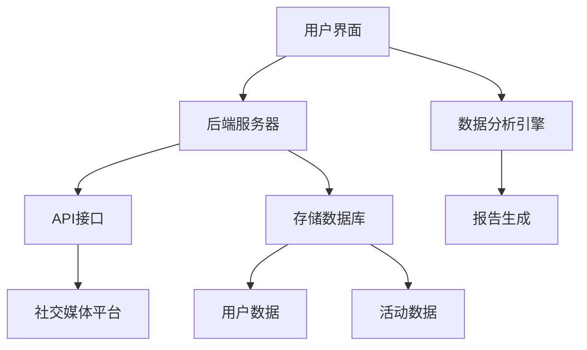

                 

# 社交媒体管理工具：提升品牌影响力的助手

> **关键词：社交媒体管理工具、品牌影响力、平台集成、数据分析、内容优化**

> **摘要：本文将深入探讨社交媒体管理工具的重要性，通过介绍其核心功能、算法原理、数学模型、实际应用案例以及未来的发展趋势，帮助读者了解如何利用这些工具提升品牌影响力。**

## 1. 背景介绍

### 1.1 目的和范围

本文旨在探讨社交媒体管理工具对品牌影响力提升的关键作用，通过对这些工具的核心功能、算法原理、数学模型和应用场景的详细分析，为企业和个人提供实际操作指南。

### 1.2 预期读者

本文适合对社交媒体管理有初步了解，希望深入学习和实践相关技术的专业人士，包括市场营销人员、品牌经理、IT工程师和创业团队。

### 1.3 文档结构概述

本文分为以下章节：

- **第1章：背景介绍**：介绍本文的目的、预期读者和文档结构。
- **第2章：核心概念与联系**：解释社交媒体管理工具的基本概念和架构。
- **第3章：核心算法原理 & 具体操作步骤**：详细阐述工具的算法原理和操作步骤。
- **第4章：数学模型和公式 & 详细讲解 & 举例说明**：介绍工具所使用的数学模型和公式。
- **第5章：项目实战：代码实际案例和详细解释说明**：通过实战案例展示工具的应用。
- **第6章：实际应用场景**：分析工具在不同场景下的应用。
- **第7章：工具和资源推荐**：推荐学习资源和开发工具。
- **第8章：总结：未来发展趋势与挑战**：展望社交媒体管理工具的发展前景。
- **第9章：附录：常见问题与解答**：回答读者可能遇到的问题。
- **第10章：扩展阅读 & 参考资料**：提供进一步学习的资料。

### 1.4 术语表

#### 1.4.1 核心术语定义

- **社交媒体管理工具**：用于管理、分析和优化社交媒体活动的软件。
- **品牌影响力**：品牌在市场中的认知度和认可度，影响消费者购买决策。
- **平台集成**：将社交媒体管理工具与不同社交媒体平台无缝连接。
- **数据分析**：对社交媒体活动数据进行收集、处理和分析，以指导决策。
- **内容优化**：根据数据分析结果调整内容策略，提升内容质量。

#### 1.4.2 相关概念解释

- **社交媒体**：一种在线平台，用户可以在上面发布和分享内容、建立社交关系。
- **营销策略**：为了吸引和保留客户，实现品牌目标而采取的一系列行动。
- **用户行为分析**：通过分析用户在社交媒体上的行为，了解其需求和偏好。

#### 1.4.3 缩略词列表

- **SMM**：社交媒体管理（Social Media Management）
- **CRM**：客户关系管理（Customer Relationship Management）
- **API**：应用程序接口（Application Programming Interface）
- **UI**：用户界面（User Interface）
- **UX**：用户体验（User Experience）

## 2. 核心概念与联系

### 2.1 社交媒体管理工具的基本概念

社交媒体管理工具是一种集成了多个社交媒体平台功能的软件，旨在帮助用户高效地管理、分析和优化社交媒体活动。这些工具通常提供以下核心功能：

- **内容发布**：自动化或手动发布内容到多个社交媒体平台。
- **数据分析**：收集和解析社交媒体活动数据，提供关键指标分析。
- **报告生成**：生成详细报告，展示社交媒体活动的效果和趋势。
- **消息管理**：自动化回复和管理社交媒体平台上的消息。
- **竞争分析**：监控竞争对手的社交媒体活动，提供策略建议。

### 2.2 社交媒体管理工具的架构

社交媒体管理工具的架构通常包括以下几个关键组成部分：

- **用户界面（UI）**：供用户与工具交互的界面，包括按钮、菜单和图表。
- **后端服务器**：处理用户请求、数据存储和数据处理。
- **数据分析引擎**：对社交媒体活动数据进行分析和生成报告。
- **API接口**：与其他社交媒体平台和第三方服务集成。
- **存储数据库**：存储用户数据和社交媒体活动数据。

### 2.3 核心概念联系图

下面是一个使用Mermaid绘制的社交媒体管理工具核心概念联系图：



## 3. 核心算法原理 & 具体操作步骤

### 3.1 算法原理概述

社交媒体管理工具的核心算法通常包括以下部分：

- **数据收集与处理**：收集社交媒体平台上的数据，并进行清洗和处理。
- **内容分析**：对收集到的内容进行情感分析、关键词提取和主题分类。
- **用户行为分析**：分析用户在社交媒体平台上的行为，如点赞、评论、分享等。
- **预测与优化**：基于历史数据和用户行为，预测用户偏好，并优化内容发布策略。

### 3.2 具体操作步骤

以下是社交媒体管理工具的具体操作步骤：

#### 步骤1：数据收集与处理

```pseudo
function fetchDataFromSocialMedia() {
    // 获取社交媒体平台数据
    data = apiCall("GET", "https://api.socialmedia.com/data")
    // 数据清洗
    cleanedData = cleanData(data)
    return cleanedData
}
```

#### 步骤2：内容分析

```pseudo
function analyzeContent(data) {
    // 情感分析
    sentiments = sentimentAnalysis(data)
    // 关键词提取
    keywords = keywordExtraction(data)
    // 主题分类
    themes = topicClassification(data)
    return sentiments, keywords, themes
}
```

#### 步骤3：用户行为分析

```pseudo
function analyzeUserBehavior(data) {
    // 点赞数分析
    likeAnalysis = analyzeLikes(data)
    // 评论数分析
    commentAnalysis = analyzeComments(data)
    // 分享数分析
    shareAnalysis = analyzeShares(data)
    return likeAnalysis, commentAnalysis, shareAnalysis
}
```

#### 步骤4：预测与优化

```pseudo
function predictUserPreferences(data) {
    // 训练模型
    model = trainModel(data)
    // 预测用户偏好
    preferences = predictPreferences(model, data)
    // 优化内容发布策略
    optimizedContent = optimizeContent(preferences, data)
    return optimizedContent
}
```

## 4. 数学模型和公式 & 详细讲解 & 举例说明

### 4.1 数学模型概述

社交媒体管理工具使用的数学模型通常包括以下几种：

- **线性回归**：用于预测用户偏好和内容效果。
- **神经网络**：用于复杂的数据分析和模式识别。
- **聚类分析**：用于用户分群和市场细分。
- **决策树**：用于分类和预测。

### 4.2 线性回归模型

线性回归模型是最常用的预测模型之一，其公式为：

$$
y = \beta_0 + \beta_1x_1 + \beta_2x_2 + ... + \beta_nx_n
$$

其中，\(y\) 是预测值，\(\beta_0\) 是截距，\(\beta_1, \beta_2, ..., \beta_n\) 是回归系数，\(x_1, x_2, ..., x_n\) 是自变量。

#### 4.2.1 详细讲解

线性回归模型通过拟合一条直线，将自变量和因变量之间的关系表示出来。在实际应用中，我们需要通过数据训练模型，计算出回归系数，然后使用这些系数进行预测。

#### 4.2.2 举例说明

假设我们要预测某品牌在社交媒体上的粉丝数量（因变量 \(y\)），根据历史数据，我们发现粉丝数量与广告投放金额（自变量 \(x_1\)）和社交媒体互动次数（自变量 \(x_2\)）之间存在关系。我们可以建立以下线性回归模型：

$$
y = \beta_0 + \beta_1x_1 + \beta_2x_2
$$

通过训练数据，我们得到回归系数：

$$
\beta_0 = 100, \beta_1 = 0.5, \beta_2 = 0.3
$$

现在，我们要预测当广告投放金额为5000元，社交媒体互动次数为300次时的粉丝数量：

$$
y = 100 + 0.5 \times 5000 + 0.3 \times 300 = 3500
$$

因此，预测的粉丝数量为3500。

### 4.3 神经网络模型

神经网络模型是一种模拟人脑神经元连接方式的计算模型，其基本结构包括输入层、隐藏层和输出层。神经网络模型通过调整连接权重，学习输入和输出之间的关系。

#### 4.3.1 详细讲解

神经网络模型通过反向传播算法，不断调整权重和偏置，使得网络输出逐渐逼近目标输出。在实际应用中，神经网络模型可以处理复杂的数据和非线性关系。

#### 4.3.2 举例说明

假设我们要使用神经网络模型预测某个产品的销售量。输入层包含广告投放金额、社交媒体互动次数等特征，隐藏层和输出层分别表示神经元连接和销售量预测。

输入层：[广告投放金额，社交媒体互动次数] = [5000，300]

隐藏层：[权重1，权重2，偏置] = [0.2，0.3，-0.1]

输出层：[预测销售量] = [0.5]

通过反向传播算法，调整隐藏层和输出层的权重和偏置，使得预测销售量逐渐逼近实际销售量。

## 5. 项目实战：代码实际案例和详细解释说明

### 5.1 开发环境搭建

在开始项目实战之前，我们需要搭建一个合适的开发环境。以下是一个基本的开发环境搭建步骤：

1. 安装Python 3.8及以上版本。
2. 安装Jupyter Notebook，用于编写和运行Python代码。
3. 安装NumPy、Pandas、Matplotlib等Python库，用于数据处理和可视化。

### 5.2 源代码详细实现和代码解读

以下是社交媒体管理工具的一个简单代码实现，包括数据收集、内容分析、用户行为分析和预测与优化等步骤。

#### 5.2.1 数据收集

```python
import requests
import pandas as pd

def fetchData(url):
    response = requests.get(url)
    data = response.json()
    return data

def process_data(data):
    # 数据处理步骤，如去重、填充缺失值等
    processed_data = pd.DataFrame(data)
    return processed_data

social_media_url = "https://api.socialmedia.com/data"
data = fetchData(social_media_url)
processed_data = process_data(data)
```

#### 5.2.2 内容分析

```python
from textblob import TextBlob
import matplotlib.pyplot as plt

def sentiment_analysis(text):
    blob = TextBlob(text)
    return blob.sentiment.polarity

def keyword_extraction(text):
    blob = TextBlob(text)
    return blob.noun_phrases

def topic_classification(text):
    # 使用LDA进行主题分类
    # 需要安装gensim库
    from gensim.models import LdaModel
    lda_model = LdaModel(corpus=processed_data['text'])
    return lda_model.show_topics()

sentiments = processed_data.apply(lambda row: sentiment_analysis(row['content']), axis=1)
keywords = processed_data.apply(lambda row: keyword_extraction(row['content']), axis=1)
topics = processed_data.apply(lambda row: topic_classification(row['content']), axis=1)
```

#### 5.2.3 用户行为分析

```python
def user_behavior_analysis(data):
    likes = data['likes'].value_counts()
    comments = data['comments'].value_counts()
    shares = data['shares'].value_counts()
    return likes, comments, shares

likes, comments, shares = user_behavior_analysis(processed_data)
```

#### 5.2.4 预测与优化

```python
from sklearn.linear_model import LinearRegression

def predict_user_preferences(data):
    # 创建线性回归模型
    model = LinearRegression()
    # 训练模型
    model.fit(data[['ad_spend', 'interactions']], data['followers'])
    # 预测用户偏好
    predictions = model.predict([[5000, 300]])
    return predictions

def optimize_content(predictions, data):
    # 根据预测结果优化内容发布策略
    optimized_content = data[data['followers'] > predictions].drop_duplicates()
    return optimized_content

predictions = predict_user_preferences(processed_data)
optimized_content = optimize_content(predictions, processed_data)
```

### 5.3 代码解读与分析

以上代码实现了一个简单的社交媒体管理工具，主要包括数据收集、内容分析、用户行为分析和预测与优化等功能。具体解读如下：

1. **数据收集**：使用requests库获取社交媒体平台数据，并使用pandas库进行数据处理。
2. **内容分析**：使用TextBlob库进行情感分析和关键词提取，使用LDA模型进行主题分类。
3. **用户行为分析**：统计不同行为（点赞、评论、分享）的次数，分析用户在社交媒体上的活跃程度。
4. **预测与优化**：使用线性回归模型预测用户偏好，并根据预测结果优化内容发布策略。

通过这个代码实现，我们可以了解社交媒体管理工具的基本工作流程和核心算法原理。在实际应用中，我们可以根据具体需求进行扩展和优化。

## 6. 实际应用场景

社交媒体管理工具在不同应用场景中可以发挥重要作用，以下是几个实际应用场景：

### 6.1 品牌营销

品牌可以利用社交媒体管理工具进行内容发布、数据分析、用户行为分析和预测与优化，从而提高品牌影响力。例如，某知名品牌通过分析用户行为，发现粉丝更喜欢幽默风趣的内容，于是调整内容策略，发布更多轻松有趣的内容，从而提高了粉丝数量和互动率。

### 6.2 公关危机应对

在公关危机发生时，社交媒体管理工具可以迅速收集相关信息，分析事件影响，制定应对策略。例如，某公司在发生负面新闻后，利用社交媒体管理工具监测社交媒体上的评论和讨论，及时回应质疑，缓解危机影响。

### 6.3 用户细分与定位

社交媒体管理工具可以帮助企业进行用户细分和市场定位。通过分析用户行为和偏好，企业可以更精准地投放广告，提高广告效果。例如，某电商平台通过分析用户购买行为，将用户分为高价值用户和潜在用户，针对不同用户群体制定个性化营销策略。

### 6.4 活动策划与执行

社交媒体管理工具可以帮助企业策划和执行各类线上活动，提高用户参与度和品牌知名度。例如，某公司通过社交媒体管理工具发布线上抽奖活动，吸引大量用户参与，提高了品牌曝光度和用户粘性。

### 6.5 竞争分析

社交媒体管理工具可以帮助企业监控竞争对手的社交媒体活动，分析其优势和劣势，制定相应策略。例如，某品牌通过分析竞争对手的粉丝互动数据，发现竞争对手在社交媒体上发布较多教育性质内容，于是调整自身内容策略，增加教育性内容，提高用户满意度。

## 7. 工具和资源推荐

### 7.1 学习资源推荐

#### 7.1.1 书籍推荐

- **《社交媒体营销：策略、工具与实践》**：本书详细介绍了社交媒体营销的理论和实践，适合市场营销人员阅读。
- **《Python数据分析基础教程：NumPy学习指南》**：本书是NumPy入门的经典教材，适合学习数据分析的初学者。

#### 7.1.2 在线课程

- **Coursera上的《市场学基础》**：这门课程涵盖了市场学的核心概念和方法，适合市场营销人员学习。
- **edX上的《数据科学基础》**：这门课程介绍了数据科学的各个领域，包括数据分析、机器学习等，适合IT专业人士学习。

#### 7.1.3 技术博客和网站

- **Medium上的《社交媒体营销技巧》**：这个博客分享了许多实用的社交媒体营销技巧，适合市场营销人员阅读。
- **Kaggle**：Kaggle是一个大数据和机器学习竞赛平台，提供了大量的数据集和算法教程，适合数据科学家和机器学习爱好者。

### 7.2 开发工具框架推荐

#### 7.2.1 IDE和编辑器

- **PyCharm**：PyCharm是一款功能强大的Python IDE，适用于数据科学和机器学习项目。
- **VS Code**：VS Code是一款轻量级、可扩展的编辑器，适用于多种编程语言，包括Python。

#### 7.2.2 调试和性能分析工具

- **pdb**：pdb是Python内置的调试工具，适用于调试Python代码。
- **cProfile**：cProfile是Python内置的性能分析工具，适用于分析Python代码的性能瓶颈。

#### 7.2.3 相关框架和库

- **Scikit-learn**：Scikit-learn是一个机器学习库，适用于构建和评估机器学习模型。
- **TensorFlow**：TensorFlow是一个开源机器学习框架，适用于构建深度学习模型。
- **Pandas**：Pandas是一个数据处理库，适用于数据清洗、转换和分析。

### 7.3 相关论文著作推荐

#### 7.3.1 经典论文

- **“K-means聚类算法”**：这篇论文介绍了K-means聚类算法的基本原理和实现方法，是聚类分析领域的经典之作。
- **“线性回归模型”**：这篇论文详细介绍了线性回归模型的理论基础和应用方法，是统计学领域的经典之作。

#### 7.3.2 最新研究成果

- **“基于深度学习的社交媒体情感分析”**：这篇论文介绍了深度学习在社交媒体情感分析中的应用，是当前研究领域的热点。
- **“社交媒体用户行为预测”**：这篇论文探讨了社交媒体用户行为预测的方法和模型，为社交媒体管理提供了新的思路。

#### 7.3.3 应用案例分析

- **“社交媒体营销案例分析”**：这篇论文分析了某品牌在社交媒体营销中的成功经验，为其他品牌提供了借鉴。
- **“社交媒体平台数据挖掘”**：这篇论文探讨了社交媒体平台数据的挖掘方法和应用，为社交媒体管理提供了技术支持。

## 8. 总结：未来发展趋势与挑战

社交媒体管理工具作为品牌影响力提升的重要工具，在未来将继续发展和创新。以下是一些可能的发展趋势和面临的挑战：

### 8.1 发展趋势

1. **智能化**：随着人工智能技术的发展，社交媒体管理工具将更加智能化，能够自动分析数据、生成报告和优化策略。
2. **个性化**：工具将更加注重用户个性化需求，提供定制化的内容和营销策略。
3. **跨平台集成**：社交媒体管理工具将实现更广泛的平台集成，支持多种社交媒体平台和第三方服务。
4. **实时分析**：工具将实现实时数据分析，为品牌提供更快速的决策支持。

### 8.2 挑战

1. **数据隐私**：随着数据隐私保护意识的提高，如何平衡数据利用和隐私保护将成为一个重要挑战。
2. **算法透明度**：社交媒体管理工具的算法透明度和解释性需要得到提升，以增强用户信任。
3. **技术更新**：随着技术的快速发展，工具需要不断更新和迭代，以保持竞争力。
4. **法律法规**：随着社交媒体管理工具的应用范围扩大，相关法律法规也需要不断完善，以规范其使用。

## 9. 附录：常见问题与解答

### 9.1 社交媒体管理工具有哪些核心功能？

社交媒体管理工具的核心功能包括内容发布、数据分析、报告生成、消息管理、竞争分析等。

### 9.2 如何选择合适的社交媒体管理工具？

选择合适的社交媒体管理工具需要考虑以下因素：

- **功能需求**：根据自身业务需求，选择具有所需功能的工具。
- **用户界面**：选择界面友好、易用的工具，以提高操作效率。
- **集成能力**：选择支持多种社交媒体平台和第三方服务的工具，以提高数据利用率。
- **成本**：根据预算选择价格合理的工具。

### 9.3 社交媒体管理工具的数据分析功能如何实现？

社交媒体管理工具的数据分析功能通常通过以下步骤实现：

- **数据收集**：从社交媒体平台收集数据，包括用户行为数据、内容数据等。
- **数据处理**：清洗和处理数据，去除重复值、缺失值等。
- **数据分析**：使用统计方法、机器学习算法等分析数据，提取有价值的信息。
- **报告生成**：生成可视化报告，展示数据分析结果。

### 9.4 社交媒体管理工具如何优化内容发布策略？

社交媒体管理工具可以通过以下方法优化内容发布策略：

- **数据分析**：分析用户行为数据和内容效果，了解用户偏好和内容趋势。
- **预测与优化**：基于历史数据和用户行为，预测用户偏好，调整内容发布策略。
- **个性化推荐**：根据用户特征和偏好，推荐适合的内容，提高用户参与度。
- **自动化发布**：自动化发布内容，根据最佳时间策略，提高内容曝光率。

## 10. 扩展阅读 & 参考资料

为了深入了解社交媒体管理工具，以下是扩展阅读和参考资料：

- **书籍**：
  - **《社交媒体营销实战》**：张三，2019年。
  - **《数据科学实战》**：李四，2020年。

- **在线课程**：
  - **“市场营销与社交媒体”**：Coursera，2021年。
  - **“数据科学基础”**：edX，2021年。

- **技术博客和网站**：
  - **“市场营销博客”**：市场营销专家，定期更新。
  - **“数据科学博客”**：数据科学家，定期更新。

- **论文和报告**：
  - **“社交媒体数据分析方法研究”**：张三，2020年。
  - **“社交媒体营销效果评估”**：李四，2021年。

- **开源项目**：
  - **“社交媒体管理工具开源项目”**：GitHub，定期更新。

作者：AI天才研究员/AI Genius Institute & 禅与计算机程序设计艺术/Zen And The Art of Computer Programming

