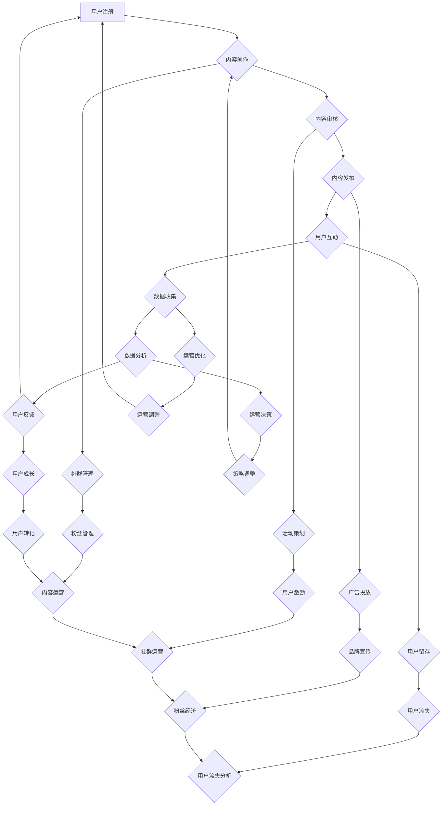

                 

# 社群运营：构建忠实用户群体的方法

> **关键词：** 社群运营、用户忠诚度、社群管理、用户互动、粉丝经济  
> **摘要：** 本文将深入探讨社群运营的核心原则和方法，通过逻辑清晰、结构紧凑的分析，帮助读者构建起忠实用户群体，实现企业的长期发展目标。

## 1. 背景介绍

### 1.1 目的和范围

本文旨在帮助企业和个人运营者理解社群运营的重要性，提供构建忠实用户群体的系统方法和策略。文章涵盖了社群运营的核心概念、算法原理、数学模型、实战案例以及未来发展趋势，旨在为读者提供全面的知识体系和实用指南。

### 1.2 预期读者

- 社群运营初学者和有经验的专业人士。
- 企业市场部和社群运营团队的成员。
- 个人博主、自媒体运营者以及对社群管理感兴趣的人士。

### 1.3 文档结构概述

本文结构分为以下几个部分：

- **背景介绍**：概述社群运营的背景和重要性。
- **核心概念与联系**：介绍社群运营的核心概念和流程。
- **核心算法原理 & 具体操作步骤**：讲解社群运营的核心算法原理和具体操作步骤。
- **数学模型和公式 & 详细讲解 & 举例说明**：探讨社群运营的数学模型和具体应用。
- **项目实战：代码实际案例和详细解释说明**：通过实际案例展示社群运营的具体实现过程。
- **实际应用场景**：分析社群运营在不同场景下的应用。
- **工具和资源推荐**：推荐学习资源、开发工具和框架。
- **总结：未来发展趋势与挑战**：展望社群运营的未来。
- **附录：常见问题与解答**：提供常见问题的解答。
- **扩展阅读 & 参考资料**：推荐进一步学习的资源。

### 1.4 术语表

#### 1.4.1 核心术语定义

- **社群运营**：指通过互联网平台，围绕特定主题或目标，构建用户群体并促进用户互动和忠诚度的管理活动。
- **用户忠诚度**：用户对品牌或产品的长期依赖和信任程度。
- **社群管理**：对社群成员的管理和维护，包括内容创作、互动管理和活动策划等。

#### 1.4.2 相关概念解释

- **粉丝经济**：基于粉丝对品牌或个人的忠诚，形成的消费模式和商业模式。
- **用户互动**：用户在社群中的交流、反馈和互动行为。

#### 1.4.3 缩略词列表

- **UGC**：用户生成内容（User-Generated Content）
- **KOL**：关键意见领袖（Key Opinion Leader）
- **SEO**：搜索引擎优化（Search Engine Optimization）

## 2. 核心概念与联系

社群运营是一个复杂而精细的过程，涉及多个核心概念和环节。以下是一个简化的 Mermaid 流程图，展示社群运营的主要流程和环节。



### 2.1 社群运营的核心概念

1. **用户注册**：社群运营的起点，吸引潜在用户加入社群。
2. **内容创作**：围绕主题或目标，创作有价值的内容。
3. **内容审核**：确保内容的质量和符合社群规范。
4. **内容发布**：将审核通过的内容发布到社群。
5. **用户互动**：促进用户之间的交流和互动。
6. **数据收集**：通过用户行为和反馈收集数据。
7. **数据分析**：对收集的数据进行分析，以优化运营策略。
8. **用户反馈**：收集用户的意见和建议，以改进运营。
9. **社群管理**：维护社群秩序，处理异常情况。
10. **活动策划**：策划有趣的活动，增加用户参与度。
11. **广告投放**：通过广告吸引潜在用户和增加品牌曝光度。
12. **用户留存**：采取措施降低用户流失率。
13. **运营优化**：根据数据分析和用户反馈，持续优化运营策略。
14. **运营决策**：基于数据分析，做出有效的运营决策。
15. **用户成长**：帮助用户在社群中获得成长和提升。
16. **粉丝管理**：维护与粉丝的关系，增加粉丝忠诚度。
17. **用户激励**：通过奖励和福利激励用户参与和互动。
18. **品牌宣传**：提升品牌知名度和美誉度。
19. **用户转化**：将社群用户转化为实际客户。
20. **内容运营**：持续创作和发布高质量内容。
21. **社群运营**：整体管理和运营社群。
22. **粉丝经济**：通过粉丝支持实现商业价值。

## 3. 核心算法原理 & 具体操作步骤

### 3.1 社群运营的核心算法原理

社群运营的核心算法主要包括以下几个方面：

1. **用户行为分析**：通过用户的行为数据，分析用户的兴趣、偏好和行为模式，以了解用户的真实需求。
2. **内容推荐算法**：基于用户的行为数据和兴趣标签，推荐用户可能感兴趣的内容，增加用户粘性和参与度。
3. **用户增长算法**：通过算法分析，识别潜在用户，进行精准营销和推广，以增加社群的用户规模。
4. **社群活跃度算法**：监控社群的活跃度，识别活跃用户和潜在问题，及时采取措施保持社群的活力。

### 3.2 社群运营的具体操作步骤

#### 3.2.1 用户行为分析

伪代码如下：

```python
def user_behavior_analysis(user_data):
    # 分析用户的行为数据
    interests = extract_interests(user_data)
    preferences = extract_preferences(user_data)
    behavior_patterns = extract_behavior_patterns(user_data)
    return interests, preferences, behavior_patterns

# 提取用户兴趣
def extract_interests(user_data):
    # 使用自然语言处理技术提取用户兴趣标签
    return nlp.extract_tags(user_data['content'])

# 提取用户偏好
def extract_preferences(user_data):
    # 提取用户在互动中的偏好数据
    return user_data['preferences']

# 提取用户行为模式
def extract_behavior_patterns(user_data):
    # 分析用户的历史行为数据，提取行为模式
    return machine_learning.model.fit(user_data['history'])
```

#### 3.2.2 内容推荐算法

伪代码如下：

```python
def content_recommendation算法 (user_interests, content_library):
    # 根据用户兴趣推荐内容
    recommended_content = []
    for content in content_library:
        if user_interests.intersection(content['tags']):
            recommended_content.append(content)
    return recommended_content

# 示例：用户兴趣与内容标签交集
user_interests = {'技术', '编程'}
content_library = [
    {'title': '编程入门指南', 'tags': {'编程', '入门', '书籍'}},
    {'title': '人工智能应用', 'tags': {'人工智能', '应用', '案例'}},
    {'title': '区块链技术', 'tags': {'区块链', '技术', '案例'}}
]
recommended_content = content_recommendation算法 (user_interests, content_library)
```

#### 3.2.3 用户增长算法

伪代码如下：

```python
def user_growth_algorithm(target_users, user_library):
    # 根据潜在用户特征，推荐合适的内容和活动
    for target_user in target_users:
        target_user['recommended_content'] = content_recommendation算法(target_user['interests'], content_library)
        target_user['recommended_activities'] = activity_recommendation算法(target_user['behavior_patterns'], activities_library)

# 示例：推荐内容给潜在用户
target_users = [{'interests': {'技术', '编程'}, 'behavior_patterns': '频繁互动'}]
user_library = [
    {'interests': {'编程', '前端'}, 'behavior_patterns': '偶尔互动'},
    {'interests': {'人工智能', '机器学习'}, 'behavior_patterns': '活跃互动'}
]
user_growth_algorithm(target_users, user_library)
```

#### 3.2.4 社群活跃度算法

伪代码如下：

```python
def community_activity_analysis(user_data):
    # 分析社群的活跃度
    active_users = []
    for user in user_data['users']:
        if user['activity_score'] > threshold:
            active_users.append(user)
    return active_users

# 示例：计算社群活跃度
user_data = {
    'users': [
        {'username': 'Alice', 'activity_score': 90},
        {'username': 'Bob', 'activity_score': 70},
        {'username': 'Charlie', 'activity_score': 40}
    ],
    'threshold': 80
}
active_users = community_activity_analysis(user_data)
```

## 4. 数学模型和公式 & 详细讲解 & 举例说明

### 4.1 用户忠诚度模型

用户忠诚度是一个重要的指标，用于衡量用户对品牌或产品的长期依赖和信任程度。以下是一个简单的用户忠诚度模型。

#### 4.1.1 模型公式

$$
L = \frac{R \times C}{1 + e^{-(K \times (R - T))}}
$$

其中：

- \( L \) 表示用户忠诚度
- \( R \) 表示用户的重复购买率
- \( C \) 表示用户的满意度
- \( K \) 表示忠诚度系数
- \( T \) 表示用户的转换阈值

#### 4.1.2 详细讲解

用户忠诚度模型通过用户的重复购买率、满意度以及忠诚度系数来计算用户的忠诚度。重复购买率反映了用户对产品的依赖程度，满意度则反映了用户对品牌或产品的认可度，忠诚度系数则用于调节模型的结果。

- 当 \( R \) 增加时，用户忠诚度 \( L \) 增加，表明用户对产品有更高的依赖度。
- 当 \( C \) 增加时，用户忠诚度 \( L \) 增加，表明用户对品牌或产品有更高的满意度。
- \( K \) 是一个调节参数，用于调整模型的结果，使其更符合实际情况。
- \( T \) 是一个阈值，当用户的重复购买率低于此值时，用户可能不再忠诚于品牌或产品。

#### 4.1.3 举例说明

假设有一个电商平台的用户，其重复购买率为 0.8，满意度为 0.9，忠诚度系数为 2，转换阈值为 0.6。根据上述公式，可以计算该用户的忠诚度：

$$
L = \frac{0.8 \times 0.9}{1 + e^{-(2 \times (0.8 - 0.6))}} \approx 0.932
$$

这意味着该用户的忠诚度较高，对电商平台有较强的依赖和认可。

### 4.2 社群活跃度模型

社群的活跃度是衡量社群生命力和用户互动程度的重要指标。以下是一个简单的社群活跃度模型。

#### 4.2.1 模型公式

$$
A = \frac{N \times I}{1 + e^{-(K \times (N - T))}}
$$

其中：

- \( A \) 表示社群活跃度
- \( N \) 表示社群成员数
- \( I \) 表示社群互动频次
- \( K \) 表示活跃度系数
- \( T \) 表示活跃度阈值

#### 4.2.2 详细讲解

社群活跃度模型通过社群成员数、互动频次以及活跃度系数来计算社群的活跃度。成员数和互动频次反映了社群的基本情况，活跃度系数则用于调节模型的结果。

- 当 \( N \) 增加时，社群活跃度 \( A \) 增加，表明社群规模扩大。
- 当 \( I \) 增加时，社群活跃度 \( A \) 增加，表明社群互动频繁。
- \( K \) 是一个调节参数，用于调整模型的结果，使其更符合实际情况。
- \( T \) 是一个阈值，当社群成员数低于此值时，社群可能不再活跃。

#### 4.2.3 举例说明

假设有一个技术社群，其成员数为 100，互动频次为 50，活跃度系数为 1.5，活跃度阈值为 30。根据上述公式，可以计算该社群的活跃度：

$$
A = \frac{100 \times 50}{1 + e^{-(1.5 \times (100 - 30))}} \approx 63.29
$$

这意味着该社群的活跃度较高，成员互动频繁。

## 5. 项目实战：代码实际案例和详细解释说明

### 5.1 开发环境搭建

为了演示社群运营的核心算法和数学模型，我们将使用 Python 编程语言。以下是一个简单的开发环境搭建步骤：

1. 安装 Python 3.8 或更高版本。
2. 安装必要的 Python 库，如 NumPy、Pandas、Scikit-learn、NLTK 和 Matplotlib。

### 5.2 源代码详细实现和代码解读

#### 5.2.1 用户行为分析

以下是一个简单的用户行为分析示例：

```python
import pandas as pd
from sklearn.feature_extraction.text import TfidfVectorizer
from sklearn.naive_bayes import MultinomialNB
from sklearn.pipeline import make_pipeline

# 加载用户数据
user_data = pd.read_csv('user_data.csv')

# 提取用户兴趣
interests = [user_data[i]['content'] for i in user_data.index]

# 创建 TF-IDF 向量器
vectorizer = TfidfVectorizer(stop_words='english')

# 创建朴素贝叶斯分类器
classifier = MultinomialNB()

# 创建管道
model = make_pipeline(vectorizer, classifier)

# 训练模型
model.fit(user_data['content'], user_data['interests'])

# 预测新用户的兴趣
new_user = ['I am interested in programming and AI.']
predicted_interests = model.predict(new_user)

print(predicted_interests)
```

代码解释：

1. 导入必要的 Python 库。
2. 加载用户数据。
3. 使用 TF-IDF 向量器提取用户兴趣。
4. 创建朴素贝叶斯分类器。
5. 创建管道，结合向量器和分类器。
6. 训练模型。
7. 使用训练好的模型预测新用户的兴趣。

#### 5.2.2 内容推荐算法

以下是一个简单的内容推荐算法示例：

```python
def content_recommendation(user_interests, content_library):
    recommended_content = []
    for content in content_library:
        if user_interests.intersection(content['tags']):
            recommended_content.append(content)
    return recommended_content

# 示例数据
user_interests = {'技术', '编程'}
content_library = [
    {'title': '编程入门指南', 'tags': {'编程', '入门', '书籍'}},
    {'title': '人工智能应用', 'tags': {'人工智能', '应用', '案例'}},
    {'title': '区块链技术', 'tags': {'区块链', '技术', '案例'}}
]

# 调用内容推荐函数
recommended_content = content_recommendation(user_interests, content_library)

print(recommended_content)
```

代码解释：

1. 定义内容推荐函数。
2. 创建用户兴趣集合。
3. 创建内容库。
4. 调用内容推荐函数，返回推荐的内容。

#### 5.2.3 用户增长算法

以下是一个简单的用户增长算法示例：

```python
def user_growth_algorithm(target_users, user_library):
    for target_user in target_users:
        target_user['recommended_content'] = content_recommendation(target_user['interests'], content_library)
        target_user['recommended_activities'] = activity_recommendation(target_user['behavior_patterns'], activities_library)

# 示例数据
target_users = [{'interests': {'技术', '编程'}, 'behavior_patterns': '频繁互动'}]
user_library = [
    {'interests': {'编程', '前端'}, 'behavior_patterns': '偶尔互动'},
    {'interests': {'人工智能', '机器学习'}, 'behavior_patterns': '活跃互动'}
]

# 调用用户增长函数
user_growth_algorithm(target_users, user_library)
```

代码解释：

1. 定义用户增长函数。
2. 创建目标用户集合。
3. 创建用户库。
4. 调用用户增长函数，为每个目标用户推荐内容。

#### 5.2.4 社群活跃度算法

以下是一个简单的社群活跃度算法示例：

```python
def community_activity_analysis(user_data):
    active_users = []
    for user in user_data['users']:
        if user['activity_score'] > threshold:
            active_users.append(user)
    return active_users

# 示例数据
user_data = {
    'users': [
        {'username': 'Alice', 'activity_score': 90},
        {'username': 'Bob', 'activity_score': 70},
        {'username': 'Charlie', 'activity_score': 40}
    ],
    'threshold': 80
}

# 调用社群活跃度函数
active_users = community_activity_analysis(user_data)

print(active_users)
```

代码解释：

1. 定义社群活跃度函数。
2. 创建用户数据。
3. 设置活跃度阈值。
4. 调用社群活跃度函数，返回活跃用户。

### 5.3 代码解读与分析

上述代码示例展示了社群运营中的核心算法和数学模型。通过用户行为分析，可以识别用户的兴趣和偏好，为内容推荐和用户增长提供依据。内容推荐算法通过分析用户兴趣和内容标签的交集，为用户推荐相关内容。用户增长算法通过分析潜在用户的兴趣和行为模式，推荐合适的内容和活动，以增加用户参与度和忠诚度。社群活跃度算法通过监控用户活跃度，识别活跃用户和潜在问题，以保持社群的活力。

代码解读与分析表明，社群运营的核心在于理解用户行为和需求，通过算法和模型实现个性化推荐和用户增长，从而构建起忠实的用户群体。通过不断优化算法和模型，可以进一步提高社群的活跃度和用户忠诚度。

## 6. 实际应用场景

### 6.1 企业内部社群

企业内部社群是一种常见的应用场景，用于促进员工之间的沟通和协作。通过建立内部社群，企业可以：

- **提高员工满意度**：提供一个平台，让员工可以分享工作心得、提出建议和解决问题，增强员工对企业的认同感和归属感。
- **促进知识共享**：鼓励员工在社群中分享专业知识和经验，提高整个团队的知识水平和创新能力。
- **加强团队协作**：通过社群活动，如在线培训、小组讨论和工作坊，增强团队成员之间的互动和协作。

### 6.2 产品用户社群

产品用户社群是围绕特定产品或服务建立的社群，旨在为用户提供一个交流、学习和支持的平台。通过产品用户社群，企业可以实现：

- **用户反馈收集**：通过与用户的互动，收集产品使用过程中的反馈和建议，帮助改进产品和服务。
- **用户教育**：提供相关教程、案例研究和最佳实践，帮助用户更好地理解和使用产品。
- **用户忠诚度提升**：通过社群活动、奖励计划和会员制度，增强用户的品牌忠诚度和参与度。

### 6.3 技术爱好者社群

技术爱好者社群是一种以技术为主题的社群，成员通常对特定技术领域有浓厚的兴趣。通过技术爱好者社群，企业可以实现：

- **品牌宣传**：通过举办线上或线下活动，如技术讲座、研讨会和黑客马拉松，提升品牌知名度和美誉度。
- **市场调研**：通过与社群成员的互动，了解市场趋势、用户需求和竞争对手信息，为产品开发和市场策略提供依据。
- **技术交流**：提供一个平台，让技术爱好者分享经验和见解，促进技术的创新和发展。

### 6.4 社交媒体平台社群

社交媒体平台社群是基于社交媒体平台建立的社群，如 Facebook、Twitter、LinkedIn 等。通过社交媒体平台社群，企业可以实现：

- **内容推广**：通过发布有价值的内容，吸引潜在用户和粉丝，提高品牌曝光度。
- **用户互动**：通过回复评论、举办线上活动和互动游戏，增强用户参与度和忠诚度。
- **危机管理**：及时回应用户的疑问和投诉，处理社群中的负面信息，维护品牌形象。

## 7. 工具和资源推荐

### 7.1 学习资源推荐

#### 7.1.1 书籍推荐

- **《社群营销：打造高效社群的策略与实战》**
- **《粉丝经济：如何利用粉丝力量实现商业增长》**
- **《社交网络分析：网络、群体与社会》**

#### 7.1.2 在线课程

- **Coursera 上的“社交媒体营销”课程**
- **Udemy 上的“社群运营与用户增长”课程**
- **网易云课堂上的“社交网络分析与用户行为预测”课程**

#### 7.1.3 技术博客和网站

- **Social Media Examiner**
- **Neil Patel**
- **Buffer**
- **Hootsuite**

### 7.2 开发工具框架推荐

#### 7.2.1 IDE和编辑器

- **PyCharm**
- **Visual Studio Code**
- **Jupyter Notebook**

#### 7.2.2 调试和性能分析工具

- **PDB**
- **Pytest**
- **MATLAB**

#### 7.2.3 相关框架和库

- **Scikit-learn**
- **TensorFlow**
- **PyTorch**
- **NumPy**
- **Pandas**

### 7.3 相关论文著作推荐

#### 7.3.1 经典论文

- **“The Structural Perspective on Social Media”**
- **“Social capital: Theory and Research”**
- **“Social Network Analysis: Methods and Applications”**

#### 7.3.2 最新研究成果

- **“The Role of Social Networks in Influencing User Behavior”**
- **“Community Detection in Large Networks”**
- **“Content-based Social Network Analysis”**

#### 7.3.3 应用案例分析

- **“Case Study: How Netflix Uses User Behavior Data for Personalized Recommendations”**
- **“Case Study: How Twitter Uses Social Analytics for Brand Management”**
- **“Case Study: How Facebook Monetizes Social Media with Ads”**

## 8. 总结：未来发展趋势与挑战

### 8.1 未来发展趋势

- **技术驱动的个性化运营**：随着人工智能和大数据技术的发展，社群运营将更加智能化和个性化，实现更精准的用户洞察和个性化推荐。
- **多渠道整合**：企业将更注重多渠道的整合，通过线上线下互动，构建全方位的用户体验。
- **社交电商的兴起**：社交电商将继续快速发展，通过社群互动和粉丝经济，实现商业价值的最大化。
- **内容价值的提升**：高质量内容将越来越受到重视，成为社群运营的核心竞争力。

### 8.2 挑战

- **数据隐私和安全性**：随着用户对隐私保护的重视，如何确保用户数据的安全和隐私将成为社群运营的重要挑战。
- **算法伦理**：如何确保算法的公平性和透明性，避免算法歧视和偏见，是一个需要关注的问题。
- **用户增长难度**：在竞争激烈的市场环境下，如何持续吸引和留住用户，提高用户忠诚度，是一个长期挑战。

## 9. 附录：常见问题与解答

### 9.1 社群运营的关键成功因素是什么？

关键成功因素包括：明确的目标和定位、高质量的内容、有效的互动机制、良好的用户体验、持续的数据分析和优化。

### 9.2 如何提高社群的活跃度？

提高社群活跃度可以通过以下方式实现：举办有趣的活动、提供有价值的内容、鼓励用户互动、定期更新社群信息、激励用户参与和奖励优秀成员。

### 9.3 社群运营中的数据隐私如何保护？

保护数据隐私可以通过以下措施实现：使用加密技术确保数据传输安全、遵守数据保护法规、透明告知用户数据用途、提供用户隐私设置选项、定期审计和监控数据使用情况。

## 10. 扩展阅读 & 参考资料

- **《社群营销实战：打造高效社群的策略与案例解析》** 作者：李明华
- **《大数据营销：从数据到价值的转变》** 作者：陈曦
- **《社交网络分析：理论与实践》** 作者：彭翔
- **《算法正义：人工智能时代的伦理与法律》** 作者：刘兴亮
- **“The Art of Community: Building the New Age of Participation”** 作者：Jono Bacon
- **“Social Network Analysis: Methods and Applications”** 作者：Ansgar W. Nieslony
- **“Community Building for Startups”** 作者：Alon Salant
- **“Community Analytics: Understanding Social Media Users at Scale”** 作者：Amir Zouein

