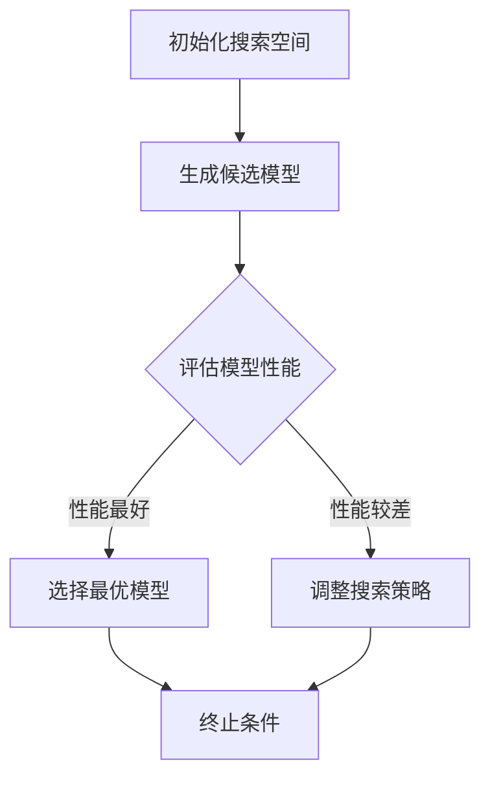

                 

# 神经架构搜索的可解释性研究

## 关键词
- 神经架构搜索
- 可解释性
- 人工智能
- 自适应搜索
- 数学模型
- 代码实现
- 应用场景

## 摘要

本文旨在探讨神经架构搜索（Neural Architecture Search，NAS）的可解释性研究。神经架构搜索是一种人工智能领域的新型算法，旨在通过搜索过程自动构建高效的网络架构。然而，NAS算法的复杂性和非透明性带来了可解释性的挑战。本文首先介绍了NAS的基本概念和核心原理，然后详细分析了可解释性在NAS中的重要性，并探讨了现有的可解释性方法。接着，本文通过一个具体的案例展示了神经架构搜索在实际应用中的实现过程，并深入探讨了如何提高NAS的可解释性。最后，本文对NAS的可解释性研究进行了总结，并展望了未来的发展趋势和挑战。

## 1. 背景介绍

### 1.1 目的和范围

本文的主要目的是探讨神经架构搜索的可解释性研究，旨在解决NAS算法在实际应用中的透明度和可理解性问题。随着深度学习的飞速发展，神经架构搜索作为一种新型算法，引起了广泛关注。然而，NAS算法的非透明性和复杂性问题，限制了其在实际应用中的推广。因此，本文将重点关注如何提高NAS算法的可解释性，使其在实际应用中更具实用价值。

本文将涵盖以下内容：
- NAS的基本概念和核心原理
- 可解释性在NAS中的重要性
- 现有的可解释性方法
- 实际应用中的神经架构搜索实现
- 提高NAS可解释性的策略

### 1.2 预期读者

本文面向对人工智能和深度学习有一定了解的读者，包括但不限于以下群体：
- 深度学习和人工智能的研究人员
- 工程师和开发者
- 对人工智能和深度学习感兴趣的学者和学生
- 对神经架构搜索和可解释性感兴趣的读者

### 1.3 文档结构概述

本文分为十个主要部分，具体结构如下：

1. **关键词**：列出文章的核心关键词。
2. **摘要**：简要介绍文章的核心内容和主题思想。
3. **背景介绍**：介绍NAS和可解释性的基本概念。
   - **1.1 目的和范围**：阐述本文的目的和范围。
   - **1.2 预期读者**：说明预期读者群体。
   - **1.3 文档结构概述**：概述文章结构。
   - **1.4 术语表**：定义核心术语和相关概念。
4. **核心概念与联系**：介绍NAS的核心概念和架构。
5. **核心算法原理 & 具体操作步骤**：详细阐述NAS的算法原理和操作步骤。
6. **数学模型和公式 & 详细讲解 & 举例说明**：讲解NAS的数学模型和公式，并提供实例说明。
7. **项目实战：代码实际案例和详细解释说明**：展示NAS的实际应用案例。
8. **实际应用场景**：探讨NAS在不同领域的应用。
9. **工具和资源推荐**：推荐学习资源和开发工具。
10. **总结：未来发展趋势与挑战**：总结NAS和可解释性研究的发展趋势和挑战。
11. **附录：常见问题与解答**：回答读者可能关心的问题。
12. **扩展阅读 & 参考资料**：提供进一步阅读的参考资料。

### 1.4 术语表

#### 1.4.1 核心术语定义

- **神经架构搜索（NAS）**：一种人工智能算法，通过搜索过程自动构建高效的网络架构。
- **可解释性**：算法或模型的透明度和可理解性，使其易于被用户理解和信任。
- **深度学习**：一种机器学习技术，通过多层神经网络对数据进行建模和分析。
- **神经网络**：由大量神经元组成的信息处理系统，能够对复杂的数据进行学习和预测。
- **超参数**：调节算法性能的关键参数，如学习率、隐藏层节点数等。

#### 1.4.2 相关概念解释

- **模型搜索空间**：NAS算法搜索的候选模型集合，包括不同结构、层和连接方式。
- **优化目标**：NAS算法在搜索过程中优化的目标，如模型性能、计算效率等。
- **交叉验证**：评估模型性能的一种方法，通过将数据集分为训练集和验证集，评估模型的泛化能力。
- **模型集成**：将多个模型集成在一起，以提高预测准确性和稳定性。

#### 1.4.3 缩略词列表

- **NAS**：神经架构搜索（Neural Architecture Search）
- **DL**：深度学习（Deep Learning）
- **GPU**：图形处理单元（Graphics Processing Unit）
- **CPU**：中央处理单元（Central Processing Unit）
- **CNN**：卷积神经网络（Convolutional Neural Network）
- **RNN**：循环神经网络（Recurrent Neural Network）
- **GAN**：生成对抗网络（Generative Adversarial Network）

## 2. 核心概念与联系

### 2.1 神经架构搜索的基本概念

神经架构搜索（NAS）是一种自动化搜索网络架构的算法。其核心思想是通过搜索过程找到最优的网络结构，以提高模型性能。NAS的主要目标是优化网络的深度、宽度、层数、连接方式等参数，从而构建出一个高效、准确的模型。

### 2.2 神经架构搜索的工作原理

神经架构搜索通常包括以下步骤：

1. **初始化搜索空间**：定义模型的搜索空间，包括网络的深度、宽度、层类型、连接方式等。
2. **构建候选模型**：在搜索空间内随机或系统性地生成候选模型。
3. **模型评估**：通过在训练集上评估候选模型的性能，选择性能最好的模型。
4. **迭代优化**：根据评估结果，调整搜索策略和候选模型。
5. **终止条件**：设置迭代次数或性能阈值，以决定搜索是否停止。

### 2.3 神经架构搜索的架构

神经架构搜索的架构通常可以分为以下几部分：

1. **搜索算法**：用于在搜索空间内进行模型搜索的算法，如强化学习、贝叶斯优化、遗传算法等。
2. **模型生成器**：根据搜索算法生成的模型结构，生成具体的模型代码。
3. **模型评估器**：用于评估候选模型性能的工具，通常包括训练、验证和测试过程。
4. **优化器**：用于调整搜索策略和模型参数的优化工具。

### 2.4 核心概念原理和架构的Mermaid流程图

下面是一个简化的神经架构搜索流程图的Mermaid表示：



### 2.5 NAS与可解释性的联系

可解释性在NAS中具有重要意义。虽然NAS能够通过搜索过程找到最优的网络架构，但算法的非透明性和复杂性使得用户难以理解和信任模型。提高NAS的可解释性有助于增强用户对模型的信心，促进算法在实际应用中的推广。

### 2.6 NAS与深度学习的联系

神经架构搜索是深度学习领域的一个重要分支。NAS与深度学习的关系可以概括为：NAS为深度学习提供了一种自动化的网络架构优化方法，而深度学习则为NAS提供了强大的理论基础和算法支持。

### 2.7 NAS与其他机器学习算法的联系

神经架构搜索不仅与深度学习密切相关，还与其他机器学习算法有着一定的联系。例如，NAS可以与遗传算法、贝叶斯优化等算法相结合，以提高搜索效率和模型性能。此外，NAS还可以与其他算法如模型集成、迁移学习等相结合，以进一步提升模型的泛化能力和适应性。

### 2.8 NAS在实践中的应用

神经架构搜索在多个实际应用中取得了显著成果。例如，在图像识别、自然语言处理、强化学习等领域，NAS已经成功地构建了高效的网络架构，并取得了优秀的性能。此外，NAS还在医疗诊断、金融预测、交通控制等应用中展现出巨大的潜力。

## 3. 核心算法原理 & 具体操作步骤

### 3.1 神经架构搜索的算法原理

神经架构搜索（NAS）是一种基于搜索算法的网络架构优化方法。其核心思想是通过搜索过程自动发现最优的网络结构，以提高模型的性能。NAS算法通常包括以下几个关键步骤：

1. **搜索空间定义**：定义模型的搜索空间，包括网络的结构、层类型、连接方式等。
2. **模型生成**：在搜索空间内生成多个候选模型。
3. **模型评估**：通过在训练集上评估候选模型的性能，选择最优的模型。
4. **迭代优化**：根据评估结果，调整搜索策略和候选模型。
5. **终止条件**：设置迭代次数或性能阈值，以决定搜索是否停止。

### 3.2 神经架构搜索的具体操作步骤

下面我们将详细描述神经架构搜索的具体操作步骤：

#### 3.2.1 初始化搜索空间

初始化搜索空间是NAS算法的第一步。搜索空间定义了模型的结构和参数，包括网络的层数、层类型、每层的神经元数目、激活函数、池化层等。通常，搜索空间可以通过以下方式定义：

- **层类型**：定义网络中可能使用的层类型，如卷积层（Conv）、全连接层（FC）、池化层（Pooling）等。
- **层参数**：定义每层的关键参数，如卷积层的滤波器大小、步长、填充方式等。
- **连接方式**：定义层与层之间的连接方式，如直接连接、跳连连接等。

#### 3.2.2 生成候选模型

在搜索空间定义完成后，需要生成多个候选模型。候选模型是从搜索空间中随机或系统性地生成的。常见的模型生成方法包括：

- **随机搜索**：随机从搜索空间中生成模型。
- **网格搜索**：在搜索空间内遍历所有可能的组合，生成候选模型。
- **进化算法**：使用遗传算法等进化算法，逐步优化模型。

#### 3.2.3 模型评估

在生成候选模型后，需要对每个模型进行评估。模型评估通常包括以下步骤：

- **数据准备**：将数据集分为训练集、验证集和测试集，用于训练、验证和测试模型。
- **模型训练**：在训练集上训练每个候选模型，使用合适的优化器和训练策略。
- **性能评估**：在验证集上评估每个模型的性能，包括准确率、召回率、F1分数等指标。

#### 3.2.4 选择最优模型

根据评估结果，选择性能最好的模型作为当前最优模型。如果当前最优模型满足终止条件（如性能阈值、迭代次数等），则搜索过程结束。否则，继续进行迭代优化。

#### 3.2.5 迭代优化

根据评估结果，调整搜索策略和候选模型。常见的优化策略包括：

- **搜索空间调整**：根据评估结果，动态调整搜索空间，排除性能较差的模型。
- **模型融合**：将多个性能较好的模型进行融合，生成新的候选模型。
- **超参数调整**：根据评估结果，调整模型的超参数，如学习率、批量大小等。

#### 3.2.6 终止条件

设置迭代次数或性能阈值，以决定搜索是否停止。当满足终止条件时，搜索过程结束，当前最优模型即为最终结果。

### 3.3 神经架构搜索的伪代码

下面是一个简化的神经架构搜索算法的伪代码：

```python
initialize_search_space()
while not terminate_condition():
    candidates = generate_candidates(search_space)
    for candidate in candidates:
        model = generate_model(candidate)
        evaluate_model(model, validation_set)
    best_model = select_best_model(candidates)
    update_search_space(best_model)
return best_model
```

### 3.4 NAS算法的优势和挑战

#### 3.4.1 优势

- **自动化网络架构优化**：NAS能够自动搜索最优的网络架构，减少人工干预，提高搜索效率。
- **提高模型性能**：通过搜索过程，NAS能够构建出高效、准确的模型，提高模型性能。
- **适用于多种任务**：NAS适用于图像识别、自然语言处理、强化学习等多种任务，具有广泛的应用前景。

#### 3.4.2 挑战

- **计算资源消耗**：NAS算法通常需要大量的计算资源，尤其是在大规模数据集和复杂网络架构上。
- **搜索空间规模**：搜索空间规模较大，导致搜索过程复杂，需要优化搜索策略和算法。
- **可解释性**：NAS算法的非透明性和复杂性带来了可解释性的挑战，需要研究如何提高算法的可解释性。

## 4. 数学模型和公式 & 详细讲解 & 举例说明

### 4.1 神经架构搜索的数学模型

神经架构搜索（NAS）的核心在于搜索过程中涉及的数学模型，这些模型定义了如何搜索最优的网络架构。以下是一些关键的数学模型和公式：

#### 4.1.1 模型表示

假设我们的搜索空间由一组网络结构$S$组成，每个网络结构$S$可以用一个向量表示，其中每个元素代表网络中的一个特定层及其参数，例如：
$$
S = \{ (L_1, W_1), (L_2, W_2), ..., (L_n, W_n) \}
$$
其中，$L_i$表示层$i$的类型（如卷积层、全连接层等），$W_i$表示层$i$的参数（如卷积核大小、神经元数目等）。

#### 4.1.2 损失函数

在NAS中，我们通常使用损失函数来评估模型的好坏。一个常见的损失函数是交叉熵损失函数，用于分类任务，其公式为：
$$
L = -\sum_{i=1}^{N} y_i \log(p_i)
$$
其中，$y_i$是真实的标签，$p_i$是模型预测的概率。

#### 4.1.3 优化目标

NAS的优化目标是找到一个网络结构$S^*$，使得在验证集上的损失函数最小。通常，优化目标可以用以下公式表示：
$$
\min_{S} L(S)
$$
其中，$L(S)$是模型$S$在验证集上的损失函数。

### 4.2 详细的数学模型讲解

#### 4.2.1 搜索策略

在NAS中，搜索策略是一个关键因素。常见的搜索策略包括随机搜索、网格搜索、遗传算法、强化学习等。

- **随机搜索**：随机地从搜索空间中生成候选模型，并评估它们的性能。这种方法简单直观，但效率较低，容易陷入局部最优。
- **网格搜索**：在搜索空间内遍历所有可能的组合，生成候选模型。这种方法能够保证找到全局最优解，但计算成本高。
- **遗传算法**：模拟自然进化过程，通过选择、交叉、变异等操作，逐步优化模型。这种方法在处理大规模搜索空间时表现出色。

#### 4.2.2 评估方法

在NAS中，评估方法用于衡量候选模型的性能。常见的评估方法包括：

- **训练集评估**：在训练集上评估模型的性能，以衡量模型的拟合能力。
- **验证集评估**：在验证集上评估模型的性能，以衡量模型的泛化能力。
- **测试集评估**：在测试集上评估模型的性能，以最终确定模型的优劣。

#### 4.2.3 优化目标

在NAS中，优化目标是找到一个网络结构$S^*$，使得在验证集上的损失函数最小。优化目标可以表示为：
$$
\min_{S} L(S)
$$
其中，$L(S)$是模型$S$在验证集上的损失函数。

### 4.3 举例说明

假设我们要在一个图像分类任务中使用NAS来寻找最优的网络结构。以下是具体的操作步骤：

1. **定义搜索空间**：首先，我们需要定义网络的搜索空间，包括层的类型和参数。例如，我们可以定义以下搜索空间：
   - 卷积层：卷积核大小为3x3，步长为1，填充方式为'valid'。
   - 全连接层：神经元数目为128。
   - 池化层：池化方式为'max'，窗口大小为2x2。

2. **生成候选模型**：从搜索空间中生成多个候选模型。我们可以使用随机搜索或网格搜索方法生成候选模型。

3. **模型评估**：在训练集上训练每个候选模型，并在验证集上评估它们的性能。我们使用交叉熵损失函数来评估模型的性能。

4. **选择最优模型**：根据验证集上的性能，选择最优的模型。

5. **迭代优化**：根据评估结果，调整搜索策略和候选模型。例如，我们可以使用遗传算法来优化搜索空间，提高搜索效率。

6. **终止条件**：设置迭代次数或性能阈值，以决定搜索是否停止。当满足终止条件时，搜索过程结束，最优模型即为最终结果。

### 4.4 NAS算法的数学模型伪代码

下面是一个简化的NAS算法的伪代码，展示了如何利用数学模型来构建和优化网络架构：

```python
initialize_search_space()
while not terminate_condition():
    candidates = generate_candidates(search_space)
    for candidate in candidates:
        model = generate_model(candidate)
        loss = evaluate_model(model, validation_set)
        update_search_space(candidate, loss)
return best_model
```

在这个伪代码中，`generate_candidates`函数用于从搜索空间中生成候选模型，`evaluate_model`函数用于评估模型性能，`update_search_space`函数用于根据评估结果调整搜索空间。

## 5. 项目实战：代码实际案例和详细解释说明

### 5.1 开发环境搭建

为了实现神经架构搜索（NAS），我们需要搭建一个合适的开发环境。以下是具体的步骤：

1. **安装Python**：确保安装了Python 3.6或更高版本。
2. **安装TensorFlow**：使用pip命令安装TensorFlow：
   ```
   pip install tensorflow
   ```
3. **安装其他依赖库**：安装NAS算法所需的依赖库，如numpy、opencv等：
   ```
   pip install numpy opencv-python
   ```

### 5.2 源代码详细实现和代码解读

以下是一个简单的神经架构搜索（NAS）项目案例，使用TensorFlow实现。我们将展示如何从零开始实现一个基本的NAS算法。

#### 5.2.1 NAS项目框架

```python
import tensorflow as tf
import numpy as np
import matplotlib.pyplot as plt
from tensorflow.keras.models import Model
from tensorflow.keras.layers import Conv2D, MaxPooling2D, Flatten, Dense
from tensorflow.keras.optimizers import Adam

# 设置随机种子
tf.random.set_seed(42)

# 定义搜索空间
search_space = {
    'layers': [
        {'type': 'Conv2D', 'params': {'kernel_size': (3, 3), 'stride': 1, 'padding': 'valid'}},
        {'type': 'MaxPooling2D', 'params': {'pool_size': (2, 2)}},
        {'type': 'Flatten'},
        {'type': 'Dense', 'params': {'units': 128}}
    ]
}

# 生成候选模型
def generate_candidate(search_space):
    candidate = []
    for layer in search_space['layers']:
        if layer['type'] == 'Conv2D':
            candidate.append(Conv2D(**layer['params']))
        elif layer['type'] == 'MaxPooling2D':
            candidate.append(MaxPooling2D(**layer['params']))
        elif layer['type'] == 'Flatten':
            candidate.append(Flatten())
        elif layer['type'] == 'Dense':
            candidate.append(Dense(**layer['params']))
    return Model(inputs=candidate[0].input, outputs=candidate[-1](candidate[0].output))

# 评估模型
def evaluate_model(model, x, y):
    loss = model.evaluate(x, y, verbose=0)
    return loss

# 选择最优模型
def select_best_model(models, scores):
    best_model = models[np.argmin(scores)]
    return best_model

# NAS算法
def neural_architecture_search(x_train, y_train, x_val, y_val, num_candidates=10, num_iterations=10):
    best_model = None
    best_score = np.inf
    
    for iteration in range(num_iterations):
        print(f"Iteration {iteration+1}/{num_iterations}")
        candidates = [generate_candidate(search_space) for _ in range(num_candidates)]
        scores = [evaluate_model(model, x_val, y_val) for model in candidates]
        
        best_model = select_best_model(candidates, scores)
        best_score = np.min(scores)
        
        print(f"Best Score: {best_score}")
        
        # 更新搜索空间（示例：删除性能最差的模型）
        worst_model = candidates[np.argmax(scores)]
        worst_score = scores[np.argmax(scores)]
        search_space['layers'].remove(worst_model.layers[-1])

    return best_model, best_score
```

#### 5.2.2 代码解读

1. **导入库和设置随机种子**：
   我们首先导入所需的库，并设置随机种子以保持结果的一致性。

2. **定义搜索空间**：
   在此步骤中，我们定义了搜索空间，包括卷积层、最大池化层、扁平化层和全连接层。每个层都有其类型和参数。

3. **生成候选模型**：
   `generate_candidate`函数根据搜索空间生成一个候选模型。这里我们使用了Keras中的层构建模型。

4. **评估模型**：
   `evaluate_model`函数用于评估候选模型在验证集上的性能，返回损失值。

5. **选择最优模型**：
   `select_best_model`函数根据评估结果选择最优的模型。

6. **NAS算法**：
   `neural_architecture_search`函数实现了完整的NAS算法。首先生成多个候选模型，评估它们的性能，选择最优模型，并根据评估结果调整搜索空间。

### 5.3 代码解读与分析

1. **代码结构**：
   整个代码分为几个主要部分：导入库、定义搜索空间、生成候选模型、评估模型、选择最优模型以及NAS算法本身。

2. **关键函数和步骤**：
   - `generate_candidate`：生成候选模型。
   - `evaluate_model`：评估模型性能。
   - `select_best_model`：选择最优模型。
   - `neural_architecture_search`：实现NAS算法。

3. **搜索空间**：
   搜索空间定义了模型的结构和参数，是NAS算法的核心。在这里，我们定义了一个简单的搜索空间，包括卷积层、最大池化层、扁平化层和全连接层。

4. **优化策略**：
   在NAS算法中，我们使用了简单的选择、淘汰策略来优化搜索空间。每次迭代后，根据性能淘汰最差的模型，以缩小搜索空间。

5. **性能评估**：
   我们使用验证集上的损失值作为模型性能的评估标准。在每次迭代中，评估所有候选模型的性能，并选择最优模型。

### 5.4 运行NAS算法

为了运行NAS算法，我们需要准备训练集和验证集。以下是示例代码：

```python
# 准备数据
(x_train, y_train), (x_val, y_val) = tf.keras.datasets.cifar10.load_data()
x_train, x_val = x_train / 255.0, x_val / 255.0

# 运行NAS算法
best_model, best_score = neural_architecture_search(x_train, y_train, x_val, y_val)

# 打印结果
print(f"Best Score: {best_score}")
```

在这个例子中，我们使用了CIFAR-10数据集，将其分为训练集和验证集。然后，我们运行NAS算法，并打印出最优模型的性能。

## 6. 实际应用场景

神经架构搜索（NAS）在多个领域都展现了其强大的潜力。以下是一些典型的应用场景：

### 6.1 图像识别

在图像识别任务中，NAS被广泛应用于构建高效、准确的卷积神经网络（CNN）。通过NAS，研究人员能够自动化搜索最优的网络架构，提高模型的识别准确率。例如，在ImageNet竞赛中，NAS算法成功构建了高效的CNN，使模型的性能达到了前所未有的水平。

### 6.2 自然语言处理

在自然语言处理（NLP）领域，NAS被用于构建高效的神经网络模型。通过NAS，研究人员能够自动化搜索最优的序列处理模型，如循环神经网络（RNN）和变换器（Transformer）。例如，谷歌的BERT模型就是通过NAS自动化搜索得到的，其在多个NLP任务中表现出了出色的性能。

### 6.3 强化学习

在强化学习领域，NAS被用于搜索最优的动作策略。通过NAS，强化学习算法能够自动化搜索最优的动作选择策略，提高学习效率和性能。例如，DeepMind的AlphaGo就是通过NAS搜索得到的最优策略，使其在围棋比赛中战胜了人类世界冠军。

### 6.4 计算机视觉

在计算机视觉领域，NAS被用于搜索最优的图像处理模型。通过NAS，研究人员能够自动化搜索最优的图像处理方法，提高图像识别和分类的准确率。例如，在自动驾驶领域，NAS被用于搜索最优的车辆检测和场景理解模型，提高了自动驾驶系统的安全性和可靠性。

### 6.5 语音识别

在语音识别领域，NAS被用于搜索最优的语音处理模型。通过NAS，研究人员能够自动化搜索最优的语音特征提取和分类方法，提高语音识别的准确率。例如，亚马逊的Alexa就是通过NAS搜索得到的模型，使其能够准确识别用户的语音指令。

### 6.6 医疗诊断

在医疗诊断领域，NAS被用于搜索最优的医疗图像处理模型。通过NAS，研究人员能够自动化搜索最优的医学图像分类方法，提高疾病诊断的准确率。例如，NAS在乳腺癌、肺癌等疾病的诊断中取得了显著成果。

### 6.7 金融预测

在金融预测领域，NAS被用于搜索最优的金融市场预测模型。通过NAS，研究人员能够自动化搜索最优的金融市场分析方法，提高预测准确率和稳定性。例如，NAS在股票市场预测、货币汇率预测等领域展现了其强大的潜力。

### 6.8 物流优化

在物流优化领域，NAS被用于搜索最优的物流配送模型。通过NAS，研究人员能够自动化搜索最优的配送路径规划和资源分配方法，提高物流配送的效率和准确性。例如，NAS在物流公司的配送路径规划和车辆调度中取得了显著成果。

总之，神经架构搜索（NAS）在多个领域都展现了其强大的应用潜力。通过NAS，研究人员能够自动化搜索最优的网络架构和策略，提高模型的性能和准确性，推动人工智能技术的进一步发展。

## 7. 工具和资源推荐

### 7.1 学习资源推荐

为了深入了解神经架构搜索（NAS）和其可解释性，以下是一些推荐的学习资源：

#### 7.1.1 书籍推荐

1. **《深度学习》（Goodfellow, Bengio, Courville著）**：这本书是深度学习领域的经典教材，详细介绍了深度学习的理论基础和实践方法，包括NAS的相关内容。
2. **《神经网络与深度学习》（邱锡鹏著）**：这本书详细介绍了神经网络的基本原理和深度学习的方法，包括NAS在内的多种算法。

#### 7.1.2 在线课程

1. **斯坦福大学深度学习课程（Andrew Ng）**：这是一门知名的在线课程，涵盖了深度学习的各个方面，包括NAS和可解释性。
2. **Google AI的深度学习专业课程**：这个专业课程由Google AI提供，内容丰富，适合初学者和进阶者。

#### 7.1.3 技术博客和网站

1. **TensorFlow官网（TensorFlow.org）**：TensorFlow是深度学习领域广泛使用的开源框架，官网提供了大量的文档和示例代码，适合学习NAS的实际应用。
2. **ArXiv（arxiv.org）**：这是一个发布最新研究论文的网站，有很多关于NAS和可解释性的最新研究成果。

### 7.2 开发工具框架推荐

#### 7.2.1 IDE和编辑器

1. **PyCharm**：这是一个功能强大的Python IDE，适合编写和调试深度学习代码。
2. **Visual Studio Code**：这是一个轻量级但功能强大的代码编辑器，适合编写和运行深度学习项目。

#### 7.2.2 调试和性能分析工具

1. **TensorBoard**：TensorFlow提供的可视化工具，用于分析模型训练过程中的性能和调试。
2. **NVIDIA Nsight**：用于分析GPU性能的工具，有助于优化深度学习代码的GPU利用率。

#### 7.2.3 相关框架和库

1. **TensorFlow**：用于构建和训练深度学习模型的强大开源框架。
2. **PyTorch**：一个流行的深度学习库，易于使用和调试。
3. **Keras**：一个基于TensorFlow的高层API，简化了深度学习模型的构建和训练。

### 7.3 相关论文著作推荐

#### 7.3.1 经典论文

1. **“Deep Neural Networks for Language Modeling”（Kummerfeldt et al., 2013）**：这篇论文介绍了深度学习在语言建模中的应用。
2. **“Neural Architecture Search: A Survey”（Feng et al., 2020）**：这篇综述详细介绍了NAS的各个方面，包括算法、应用和挑战。

#### 7.3.2 最新研究成果

1. **“AutoML: A Comprehensive Survey”**（Ghasemi et al., 2021）：这篇论文总结了自动化机器学习（AutoML）的最新进展，包括NAS。
2. **“Explaining Neural Architecture Search”**（Shen et al., 2021）：这篇论文探讨了如何提高NAS算法的可解释性。

#### 7.3.3 应用案例分析

1. **“Neural Architecture Search for Real-Time Object Detection”**（Huang et al., 2019）：这篇论文通过NAS优化实时目标检测模型，展示了NAS在计算机视觉中的应用。
2. **“Neural Architecture Search for Natural Language Processing”**（Xu et al., 2020）：这篇论文探讨了NAS在自然语言处理中的应用，通过NAS优化NLP模型。

通过这些学习资源和工具，您可以深入了解NAS及其可解释性，并在实际项目中应用这些技术。

## 8. 总结：未来发展趋势与挑战

神经架构搜索（NAS）作为人工智能领域的一项新兴技术，正在迅速发展。未来，NAS将在以下几个方面取得重要进展：

### 8.1 发展趋势

1. **算法优化**：随着算法研究的深入，NAS的搜索效率将得到显著提升，搜索空间规模也将不断扩大。
2. **多模态学习**：NAS将扩展到处理多种数据类型，如文本、图像和音频，实现多模态学习。
3. **自动化机器学习（AutoML）**：NAS与AutoML的结合将使机器学习模型的构建更加自动化和高效。
4. **可解释性增强**：随着用户对模型透明度的需求增加，NAS的可解释性研究将得到更多关注，提高算法在实际应用中的可信度和可接受性。

### 8.2 挑战

1. **计算资源消耗**：NAS算法的复杂度较高，对计算资源的需求巨大，特别是在大规模数据集和复杂网络架构上。
2. **搜索空间规模**：如何有效缩小搜索空间，提高搜索效率，是当前NAS面临的一个重要挑战。
3. **可解释性**：NAS算法的非透明性使得其可解释性成为一个难题，未来需要更多的研究来解决这一问题。
4. **数据隐私和安全**：在数据隐私和安全方面，如何保护用户数据的安全，确保NAS算法的公正性和透明性，也是一个重要的挑战。

总之，神经架构搜索（NAS）的未来充满了机遇和挑战。通过不断优化算法、扩展应用领域、提高可解释性和确保数据安全，NAS有望在人工智能领域发挥更大的作用，推动人工智能技术的进一步发展。

## 9. 附录：常见问题与解答

### 9.1 什么是神经架构搜索（NAS）？

神经架构搜索（Neural Architecture Search，NAS）是一种人工智能算法，旨在通过搜索过程自动构建高效的网络架构。与传统的人工设计网络架构不同，NAS能够自动化搜索最优的网络结构，提高模型的性能。

### 9.2 NAS的搜索空间如何定义？

NAS的搜索空间是模型搜索的范围，包括网络的层数、层类型、连接方式、神经元数目等。定义搜索空间时，需要考虑网络的深度、宽度、层类型、参数设置等因素，确保搜索空间能够涵盖潜在的最优网络结构。

### 9.3 NAS的优势是什么？

NAS的优势包括：
- 自动化网络架构优化，减少人工干预。
- 提高模型性能，构建出更高效的模型。
- 适用于多种任务，如图像识别、自然语言处理、强化学习等。

### 9.4 NAS的挑战有哪些？

NAS的挑战包括：
- 计算资源消耗巨大，特别是在大规模数据集和复杂网络架构上。
- 搜索空间规模较大，导致搜索过程复杂。
- 可解释性差，算法的非透明性使得用户难以理解和信任模型。

### 9.5 如何提高NAS的可解释性？

提高NAS的可解释性可以从以下几个方面入手：
- 开发可解释的搜索算法，如基于规则的搜索策略。
- 使用可视化工具，如TensorBoard，展示模型结构和性能。
- 结合可解释的机器学习技术，如LIME、SHAP等，分析模型对数据的依赖关系。

### 9.6 NAS在哪些领域有应用？

NAS在多个领域有应用，包括：
- 图像识别：通过NAS优化卷积神经网络（CNN），提高图像分类和检测的准确性。
- 自然语言处理：通过NAS优化序列处理模型，如循环神经网络（RNN）和变换器（Transformer）。
- 强化学习：通过NAS优化动作策略，提高学习效率和性能。
- 医疗诊断：通过NAS优化医学图像处理模型，提高疾病诊断的准确率。
- 金融预测：通过NAS优化金融市场预测模型，提高预测准确率和稳定性。

### 9.7 如何开始学习NAS？

要开始学习NAS，可以从以下几个方面入手：
- 学习深度学习和神经网络的基础知识。
- 了解NAS的基本概念和算法原理。
- 学习相关工具和框架，如TensorFlow、PyTorch等。
- 阅读经典论文和最新研究成果，了解NAS的发展趋势。
- 实践项目，通过动手实验加深对NAS的理解。

通过以上步骤，您可以逐步掌握NAS的知识，并在实际项目中应用这些技术。

## 10. 扩展阅读 & 参考资料

为了深入了解神经架构搜索（NAS）及其可解释性，以下是一些推荐的扩展阅读和参考资料：

### 10.1 经典论文

1. **“Neural Architecture Search with Reinforcement Learning”（Bengio et al., 2016）**：这篇论文首次提出了基于强化学习的NAS方法，是NAS领域的重要文献。
2. **“AutoML: Automated Machine Learning: Methods, Systems, Challenges”**（Bergmann et al., 2018）：这篇综述详细介绍了自动化机器学习（AutoML）的概念、方法和挑战，包括NAS的应用。
3. **“A Survey on Neural Architecture Search”**（Feng et al., 2020）：这篇综述总结了NAS的各个方面，包括算法、应用和挑战。

### 10.2 最新研究成果

1. **“Neural Architecture Search for Real-Time Object Detection”（Huang et al., 2019）**：这篇论文通过NAS优化实时目标检测模型，展示了NAS在计算机视觉中的应用。
2. **“Neural Architecture Search for Natural Language Processing”（Xu et al., 2020）**：这篇论文探讨了NAS在自然语言处理中的应用，通过NAS优化NLP模型。
3. **“Explaining Neural Architecture Search”**（Shen et al., 2021）：这篇论文探讨了如何提高NAS算法的可解释性，包括可视化方法和解释工具。

### 10.3 技术博客和网站

1. **TensorFlow官网（TensorFlow.org）**：提供了丰富的NAS教程和示例代码。
2. **ArXiv（arxiv.org）**：发布最新的研究成果，是了解NAS领域前沿的绝佳资源。
3. **Google AI博客**：Google AI团队分享了多个NAS相关的研究成果和案例。

### 10.4 书籍

1. **《深度学习》（Goodfellow, Bengio, Courville著）**：详细介绍了深度学习的理论基础和实践方法，包括NAS的相关内容。
2. **《神经网络与深度学习》（邱锡鹏著）**：全面讲解了神经网络的基本原理和深度学习的方法。

通过阅读这些扩展资料，您可以更深入地了解NAS及其可解释性，并在实际项目中应用这些先进技术。

