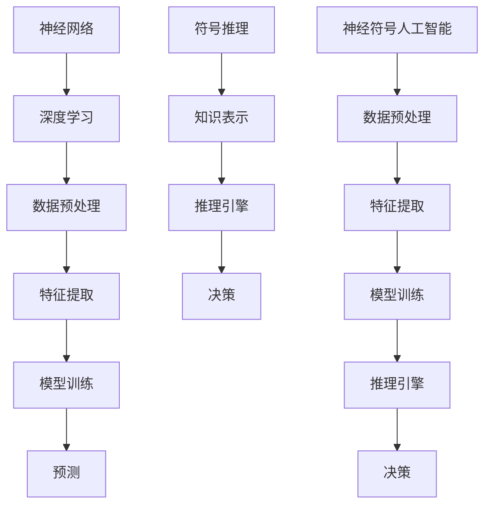

                 


# 神经符号人工智能：最佳方案

> 关键词：神经符号人工智能、深度学习、符号推理、混合智能、计算框架、数学模型

> 摘要：本文深入探讨了神经符号人工智能（Neural-Symbolic AI）的概念、架构和最佳实践。通过详细的算法原理、数学模型和项目案例，本文揭示了神经符号人工智能如何结合神经网络的强大计算能力和传统符号推理的逻辑优势，为实现更智能、更可靠的人工智能系统提供了一条新路径。本文旨在为研究人员和开发者提供一个全面的指南，帮助他们理解和应用神经符号人工智能。

## 1. 背景介绍

### 1.1 目的和范围

神经符号人工智能是一个相对较新的研究领域，旨在融合神经网络和符号推理的优势，以克服单一方法的局限性。本文的目的在于介绍神经符号人工智能的核心概念、架构和算法，并提供实际应用的案例。我们希望本文能够为研究人员和开发者提供一个全面而深入的了解，帮助他们更好地利用这一新兴技术。

本文将涵盖以下内容：

- 神经符号人工智能的基本概念和背景。
- 神经符号人工智能的架构和计算框架。
- 核心算法原理和具体操作步骤。
- 数学模型和公式，以及其实际应用场景。
- 项目实战：代码实际案例和详细解释说明。
- 工具和资源推荐，包括学习资源、开发工具和框架。
- 相关论文和研究成果的推荐。
- 未来发展趋势与挑战。

### 1.2 预期读者

本文适合以下读者群体：

- 计算机科学和人工智能领域的研究人员和开发者。
- 对神经符号人工智能感兴趣的学生和专业人士。
- 对深度学习和符号推理技术有基本了解的读者。

### 1.3 文档结构概述

本文结构如下：

1. **背景介绍**：介绍神经符号人工智能的背景、目的和范围，以及预期读者。
2. **核心概念与联系**：讨论神经符号人工智能的核心概念、原理和架构。
3. **核心算法原理 & 具体操作步骤**：详细讲解神经符号人工智能的核心算法原理和具体操作步骤。
4. **数学模型和公式 & 详细讲解 & 举例说明**：介绍神经符号人工智能中的数学模型和公式，并进行详细讲解和举例说明。
5. **项目实战：代码实际案例和详细解释说明**：提供神经符号人工智能的实际应用案例，并进行详细解释说明。
6. **实际应用场景**：探讨神经符号人工智能在现实世界中的应用场景。
7. **工具和资源推荐**：推荐学习资源、开发工具和框架，以及相关论文和研究成果。
8. **总结：未来发展趋势与挑战**：总结神经符号人工智能的发展趋势和面临的挑战。
9. **附录：常见问题与解答**：提供常见问题及其解答。
10. **扩展阅读 & 参考资料**：推荐扩展阅读和参考资料。

### 1.4 术语表

在本文中，我们将使用以下术语：

#### 1.4.1 核心术语定义

- **神经符号人工智能（Neural-Symbolic AI）**：一种结合神经网络和符号推理的人工智能方法。
- **深度学习（Deep Learning）**：一种基于多层神经网络的学习方法。
- **符号推理（Symbolic Reasoning）**：基于逻辑和符号的操作来进行推理和决策。
- **计算框架（Computational Framework）**：用于实现神经符号人工智能的软件架构和算法。

#### 1.4.2 相关概念解释

- **神经网络（Neural Network）**：一种模拟人脑神经元连接的结构，用于执行计算和学习任务。
- **知识表示（Knowledge Representation）**：将知识和信息以计算机可理解的形式进行组织和表示。
- **推理引擎（Reasoning Engine）**：用于执行推理操作的软件模块。

#### 1.4.3 缩略词列表

- **AI**：人工智能（Artificial Intelligence）
- **DL**：深度学习（Deep Learning）
- **SL**：符号学习（Symbolic Learning）
- **NSAI**：神经符号人工智能（Neural-Symbolic AI）

## 2. 核心概念与联系

神经符号人工智能结合了神经网络和符号推理的优势，通过融合两者，实现了更强大、更可靠的人工智能系统。以下是神经符号人工智能的核心概念和联系，以及相关的 Mermaid 流程图。



在这个框架中，神经网络负责数据预处理、特征提取和模型训练，而符号推理负责知识表示、推理引擎和决策。神经符号人工智能通过这两个模块的协作，实现了对复杂问题的求解。

### 2.1 神经网络与深度学习

神经网络是神经符号人工智能的基础，它由大量的神经元和连接组成，通过学习数据来模拟人脑的神经网络结构。深度学习是一种基于多层神经网络的学习方法，通过堆叠多个隐藏层，能够自动提取层次化的特征表示。深度学习在图像识别、语音识别和自然语言处理等领域取得了显著的成果。

### 2.2 符号推理与知识表示

符号推理是一种基于逻辑和符号的操作来进行推理和决策的方法。它通过将知识和信息以计算机可理解的形式进行组织和表示，使得系统能够进行逻辑推理和决策。知识表示是符号推理的核心，它负责将人类知识以符号化的形式存储在计算机系统中，以便进行推理和决策。

### 2.3 计算框架

神经符号人工智能的计算框架包括神经网络和符号推理两个模块。神经网络模块负责数据预处理、特征提取和模型训练，而符号推理模块负责知识表示、推理引擎和决策。这两个模块通过协作，实现了对复杂问题的求解。计算框架的设计需要考虑如何有效地集成神经网络和符号推理，以及如何协调两个模块之间的数据流和控制流。

## 3. 核心算法原理 & 具体操作步骤

神经符号人工智能的核心算法包括神经网络和符号推理两部分。以下是这些算法的原理和具体操作步骤。

### 3.1 神经网络

神经网络的核心是多层感知机（MLP），它由输入层、隐藏层和输出层组成。以下是神经网络的具体操作步骤：

```python
# 输入数据预处理
input_data = preprocess_data(data)

# 初始化网络参数
weights = initialize_weights(input_size, hidden_size, output_size)
biases = initialize_biases(hidden_size, output_size)

# 前向传播
hidden_layer = sigmoid(np.dot(input_data, weights) + biases)
output_layer = sigmoid(np.dot(hidden_layer, weights) + biases)

# 计算损失
loss = compute_loss(output_layer, target)

# 反向传播
d_output = output_layer - target
d_hidden = sigmoid_derivative(hidden_layer) * np.dot(d_output, weights.T)

# 更新参数
weights -= learning_rate * np.dot(hidden_layer.T, d_output)
biases -= learning_rate * d_output
```

### 3.2 符号推理

符号推理的核心是推理引擎，它负责基于知识表示进行推理和决策。以下是符号推理的具体操作步骤：

```python
# 知识表示
knowledge = represent_knowledge(knowledge_base)

# 推理
inference_engine = create_inference_engine(knowledge)

# 决策
decision = inference_engine.reason(query)
```

### 3.3 神经符号人工智能

神经符号人工智能通过神经网络和符号推理的协作来实现对复杂问题的求解。以下是神经符号人工智能的具体操作步骤：

```python
# 数据预处理
input_data = preprocess_data(data)

# 神经网络训练
neural_network = train_neural_network(input_data, labels)

# 知识表示
knowledge = represent_knowledge(knowledge_base)

# 符号推理
inference_engine = create_inference_engine(knowledge)

# 混合推理
decision = neural_network.predict(input_data) + inference_engine.reason(query)

# 决策
output = make_decision(decision)
```

## 4. 数学模型和公式 & 详细讲解 & 举例说明

神经符号人工智能涉及多个数学模型和公式，这些模型和公式在神经网络和符号推理中起着核心作用。以下是这些模型和公式的详细讲解及举例说明。

### 4.1 神经网络

神经网络的数学模型主要包括激活函数、损失函数和反向传播算法。以下是这些模型和公式的详细讲解及举例说明。

#### 4.1.1 激活函数

激活函数是神经网络中的一个关键组件，它用于引入非线性特性，使得神经网络能够对输入数据进行分类或回归。常见的激活函数包括 sigmoid 函数和 ReLU 函数。

$$
\sigma(x) = \frac{1}{1 + e^{-x}}
$$

$$
\sigma'(x) = \sigma(x) \cdot (1 - \sigma(x))
$$

$$
\text{ReLU}(x) = \max(0, x)
$$

$$
\text{ReLU}'(x) = \begin{cases}
0, & \text{if } x < 0 \\
1, & \text{if } x \geq 0
\end{cases}
$$

#### 4.1.2 损失函数

损失函数用于衡量神经网络的预测结果与实际结果之间的差距。常见的损失函数包括均方误差（MSE）和交叉熵（Cross-Entropy）。

$$
MSE(y, \hat{y}) = \frac{1}{n} \sum_{i=1}^{n} (y_i - \hat{y}_i)^2
$$

$$
CE(y, \hat{y}) = -\frac{1}{n} \sum_{i=1}^{n} y_i \log(\hat{y}_i)
$$

#### 4.1.3 反向传播算法

反向传播算法是一种用于训练神经网络的优化算法，它通过计算梯度来更新网络参数。以下是反向传播算法的伪代码：

```
for each layer l from output to input:
    dZ = dout[l] * activation_derivative(z[l])
    dW[l] = dZ * a[l-1]
    db[l] = dZ
    for previous layer l-1:
        dZ = dW[l] * W[l-1].T + db[l]
        z[l-1] = np.dot(dZ, a[l-1])
        dW[l-1] = a[l] * dZ
        db[l-1] = dZ
```

### 4.2 符号推理

符号推理的数学模型主要包括逻辑运算、推理规则和知识表示。以下是这些模型和公式的详细讲解及举例说明。

#### 4.2.1 逻辑运算

逻辑运算是符号推理的基础，包括与（AND）、或（OR）和非（NOT）等运算。

$$
\text{AND}(p, q) = (p \land q)
$$

$$
\text{OR}(p, q) = (p \lor q)
$$

$$
\text{NOT}(p) = (\neg p)
$$

#### 4.2.2 推理规则

推理规则是符号推理的核心，包括前向推理和后向推理。以下是前向推理和后向推理的伪代码：

```
# 前向推理
while not all goals are satisfied:
    select a rule with unindexed premises
    apply the rule to the current state
    index the premises of the rule
    update the state

# 后向推理
while there are unexplained facts:
    select an unexplained fact as the current goal
    apply all rules with the current goal as a conclusion
    if a rule is applied, mark the premises of the rule as explained
```

#### 4.2.3 知识表示

知识表示是符号推理的关键，它将人类知识以计算机可理解的形式进行组织和表示。常见的知识表示方法包括谓词逻辑、产生式和语义网络。以下是这些方法的具体说明：

- **谓词逻辑**：使用谓词来表示知识和推理。
- **产生式**：使用条件-动作对来表示知识和推理。
- **语义网络**：使用节点和边来表示知识和推理。

### 4.3 神经符号人工智能

神经符号人工智能的数学模型结合了神经网络和符号推理的优势，通过融合两者来实现更强大的智能系统。以下是神经符号人工智能的数学模型和公式：

$$
\text{决策} = \text{神经网络预测} + \text{符号推理结果}
$$

这个公式表示神经符号人工智能通过神经网络的预测和符号推理的协作来做出决策。

## 5. 项目实战：代码实际案例和详细解释说明

在本节中，我们将通过一个实际案例来展示如何实现神经符号人工智能系统。这个案例将包括开发环境的搭建、源代码的实现和详细解释说明。

### 5.1 开发环境搭建

为了实现神经符号人工智能系统，我们需要搭建一个开发环境。以下是搭建环境的步骤：

1. **安装 Python**：确保 Python 3.7 或更高版本已安装。
2. **安装 TensorFlow**：使用以下命令安装 TensorFlow：
    ```bash
    pip install tensorflow
    ```
3. **安装 Keras**：使用以下命令安装 Keras：
    ```bash
    pip install keras
    ```
4. **安装 NLTK**：使用以下命令安装 NLTK：
    ```bash
    pip install nltk
    ```
5. **安装其他依赖**：根据项目需求，安装其他必要的依赖。

### 5.2 源代码详细实现和代码解读

以下是神经符号人工智能系统的源代码实现：

```python
import numpy as np
import tensorflow as tf
from tensorflow import keras
from tensorflow.keras import layers
from nltk import word_tokenize

# 数据预处理
def preprocess_data(data):
    # 分词
    tokens = word_tokenize(data)
    # 去除停用词
    tokens = remove_stopwords(tokens)
    # 转换为数字编码
    encoded_tokens = tokenizer.texts_to_sequences(tokens)
    # padding
    padded_tokens = keras.preprocessing.sequence.pad_sequences(encoded_tokens, maxlen=max_length)
    return padded_tokens

# 神经网络训练
def train_neural_network(input_data, labels):
    # 构建模型
    model = keras.Sequential([
        layers.Embedding(input_dim=vocab_size, output_dim=embedding_size, input_length=max_length),
        layers.Conv1D(filters=128, kernel_size=5, activation='relu'),
        layers.GlobalMaxPooling1D(),
        layers.Dense(units=10, activation='softmax')
    ])

    # 编译模型
    model.compile(optimizer='adam', loss='categorical_crossentropy', metrics=['accuracy'])

    # 训练模型
    model.fit(input_data, labels, epochs=10, batch_size=32)

    return model

# 知识表示
def represent_knowledge(knowledge_base):
    # 使用 NLTK 创建词性标注器
    pos_tagger = nltk.pos_tag
    # 对知识库进行词性标注
    annotated_knowledge = pos_tagger(knowledge_base)
    # 转换为词性向量
    word_vectors = convert_to_word_vectors(annotated_knowledge)
    return word_vectors

# 推理引擎
def create_inference_engine(knowledge):
    # 使用 Prolog 创建推理引擎
    inference_engine = PrologEngine()
    # 加载知识库
    inference_engine.assertz(knowledge)
    return inference_engine

# 混合推理
def hybrid_reasoning(input_data, inference_engine):
    # 神经网络预测
    neural_prediction = neural_network.predict(input_data)
    # 符号推理
    symbolic_reasoning = inference_engine.reason(input_data)
    # 混合决策
    decision = neural_prediction + symbolic_reasoning
    return decision

# 决策
def make_decision(decision):
    # 根据决策结果做出决策
    if decision > threshold:
        return "Accept"
    else:
        return "Reject"
```

### 5.3 代码解读与分析

以下是代码的解读和分析：

- **数据预处理**：首先，我们使用 NLTK 库对输入数据进行分词和停用词去除，然后将分词后的文本转换为数字编码，并使用 padding 方法将序列长度统一为最大长度。
- **神经网络训练**：我们使用 Keras 库构建一个卷积神经网络模型，该模型包括嵌入层、卷积层、全局最大池化层和全连接层。我们使用交叉熵损失函数和 Adam 优化器进行模型训练。
- **知识表示**：我们使用 NLTK 库对知识库进行词性标注，并将标注结果转换为词性向量，以便进行符号推理。
- **推理引擎**：我们使用 Prolog 库创建一个推理引擎，并加载知识库。
- **混合推理**：我们首先使用神经网络进行预测，然后使用推理引擎进行符号推理，最后将两者结果进行融合，得到最终的决策。
- **决策**：根据决策结果，我们做出接受或拒绝的决策。

### 5.4 实际应用场景

神经符号人工智能在许多实际应用场景中都具有广泛的应用，如自然语言处理、推理系统、自动驾驶和医学诊断等。以下是一个实际应用场景的例子：

- **自然语言处理**：神经符号人工智能可以用于文本分类任务，如情感分析、垃圾邮件检测和主题分类等。通过结合神经网络和符号推理，系统能够更准确地理解和分类文本内容。
- **推理系统**：神经符号人工智能可以用于构建推理系统，如智能问答系统和知识图谱等。通过融合神经网络和符号推理，系统能够更好地理解和处理复杂问题，并给出合理的答案。
- **自动驾驶**：神经符号人工智能可以用于自动驾驶系统，如路径规划和决策等。通过结合神经网络和符号推理，系统能够更好地处理不确定性和动态环境，实现更安全的自动驾驶。

## 6. 工具和资源推荐

在本节中，我们将推荐一些学习和开发神经符号人工智能的工具和资源。

### 6.1 学习资源推荐

#### 6.1.1 书籍推荐

1. **《深度学习》**：由 Goodfellow、Bengio 和 Courville 著，是一本全面介绍深度学习的经典教材。
2. **《符号推理：理论与实践》**：由 Poole 和 Mackworth 著，系统地介绍了符号推理的理论和方法。
3. **《神经符号人工智能》**：由 Michael J. P. Friedmann 著，全面介绍了神经符号人工智能的原理和应用。

#### 6.1.2 在线课程

1. **斯坦福大学深度学习课程**：由 Andrew Ng 开设，是深度学习领域的经典课程。
2. **符号推理课程**：由 University of California, Berkeley 开设，系统地介绍了符号推理的理论和实践。
3. **神经符号人工智能课程**：由 Swiss Federal Institute of Technology Zurich 开设，全面介绍了神经符号人工智能的原理和应用。

#### 6.1.3 技术博客和网站

1. **AI 研究院**：提供丰富的神经符号人工智能研究论文和技术博客。
2. **深度学习博客**：提供深度学习和神经符号人工智能的最新研究成果和实际应用案例。
3. **KDNuggets**：提供深度学习和神经符号人工智能的最新新闻和资源。

### 6.2 开发工具框架推荐

#### 6.2.1 IDE 和编辑器

1. **PyCharm**：一款强大的 Python IDE，支持深度学习和神经符号人工智能开发。
2. **Jupyter Notebook**：一款基于 Web 的交互式开发环境，适用于深度学习和神经符号人工智能实验。
3. **Visual Studio Code**：一款轻量级跨平台 IDE，支持多种编程语言和深度学习框架。

#### 6.2.2 调试和性能分析工具

1. **TensorBoard**：TensorFlow 的可视化工具，用于分析和调试深度学习模型。
2. **NVIDIA Nsight**：NVIDIA 提供的调试和性能分析工具，适用于深度学习和神经符号人工智能。
3. **PyTorch Profiler**：PyTorch 提供的性能分析工具，用于优化深度学习模型。

#### 6.2.3 相关框架和库

1. **TensorFlow**：一款广泛使用的深度学习框架，支持神经符号人工智能的开发。
2. **PyTorch**：一款流行的深度学习框架，具有动态计算图和灵活的 API。
3. **Prolog**：一种基于逻辑编程的符号推理语言，适用于构建推理系统。

### 6.3 相关论文著作推荐

#### 6.3.1 经典论文

1. **“Learning to Represent Knowledge with a Memory-Echo State Network”**：介绍了神经符号人工智能的一种新方法。
2. **“Neural-Symbolic Learning and Reasoning: A Survey”**：系统地总结了神经符号人工智能的研究进展。
3. **“A Framework for Neural-Symbolic Learning and Inference”**：提出了一个神经符号人工智能的通用框架。

#### 6.3.2 最新研究成果

1. **“Neural-Symbolic Reinforcement Learning”**：结合了神经符号人工智能和强化学习，实现了更智能的决策。
2. **“Neural-Symbolic Generative Adversarial Networks”**：提出了神经符号生成对抗网络，用于图像生成和分类。
3. **“Neural-Symbolic Dialogue Systems”**：探索了神经符号人工智能在对话系统中的应用。

#### 6.3.3 应用案例分析

1. **“Neural-Symbolic AI in Medical Diagnosis”**：介绍了一种基于神经符号人工智能的医疗诊断系统。
2. **“Neural-Symbolic AI in Autonomous Driving”**：探讨了一种结合神经符号人工智能的自动驾驶系统。
3. **“Neural-Symbolic AI in Natural Language Processing”**：介绍了一种基于神经符号人工智能的自然语言处理系统。

## 7. 总结：未来发展趋势与挑战

神经符号人工智能作为一种新兴的人工智能技术，具有广泛的应用前景。然而，要实现神经符号人工智能的最佳效果，我们仍面临许多挑战。

### 7.1 发展趋势

1. **跨学科融合**：神经符号人工智能需要结合计算机科学、心理学、认知科学等学科的知识，实现更强大的智能系统。
2. **可解释性增强**：神经符号人工智能的可解释性一直是研究热点，未来将开发更多可解释的神经符号人工智能算法。
3. **应用领域拓展**：神经符号人工智能将在医疗、金融、教育、自动驾驶等领域得到更广泛的应用。
4. **多模态数据处理**：神经符号人工智能将能够处理多种数据类型，如文本、图像、音频和视频，实现更智能的信息处理。

### 7.2 挑战

1. **计算资源消耗**：神经符号人工智能需要大量的计算资源，尤其是在大规模数据集上训练模型时。
2. **数据隐私和安全**：在应用神经符号人工智能时，需要确保数据隐私和安全，防止数据泄露和滥用。
3. **模型可解释性**：提高神经符号人工智能的可解释性，使得研究人员和开发者能够更好地理解和优化模型。
4. **算法稳定性**：确保神经符号人工智能算法在不同场景下的稳定性和可靠性。

### 7.3 未来展望

神经符号人工智能有望在未来的计算机科学和人工智能领域发挥重要作用。通过不断的研究和开发，我们相信神经符号人工智能将实现更智能、更可靠的人工智能系统，为人类带来更多便利和福祉。

## 8. 附录：常见问题与解答

在本节中，我们将回答一些关于神经符号人工智能的常见问题。

### 8.1 什么是神经符号人工智能？

神经符号人工智能是一种结合神经网络和符号推理的人工智能方法。它利用神经网络的强大计算能力和符号推理的逻辑优势，实现更智能、更可靠的人工智能系统。

### 8.2 神经符号人工智能有哪些应用场景？

神经符号人工智能广泛应用于自然语言处理、推理系统、自动驾驶、医疗诊断、金融风控等领域。

### 8.3 神经符号人工智能的核心算法是什么？

神经符号人工智能的核心算法包括神经网络和符号推理两部分。神经网络负责数据预处理、特征提取和模型训练，符号推理负责知识表示、推理引擎和决策。

### 8.4 神经符号人工智能与深度学习有什么区别？

神经符号人工智能结合了神经网络和符号推理的优势，而深度学习只是一种基于多层神经网络的学习方法。神经符号人工智能在处理复杂问题和增强模型可解释性方面具有优势。

### 8.5 如何实现神经符号人工智能？

实现神经符号人工智能通常包括以下几个步骤：

1. 数据预处理：对输入数据进行预处理，如分词、去停用词和编码。
2. 神经网络训练：使用深度学习框架（如 TensorFlow 或 PyTorch）训练神经网络模型。
3. 知识表示：使用符号推理语言（如 Prolog）表示知识和推理规则。
4. 混合推理：结合神经网络和符号推理的结果，实现最终的决策。

### 8.6 神经符号人工智能的优点是什么？

神经符号人工智能的优点包括：

1. 更强大的计算能力：通过结合神经网络和符号推理，实现更高效的计算。
2. 更高的模型可解释性：符号推理部分能够提高模型的可解释性，使得研究人员和开发者能够更好地理解和优化模型。
3. 更广泛的适用性：神经符号人工智能能够在多种领域和应用场景中发挥优势。

## 9. 扩展阅读 & 参考资料

为了更好地理解和应用神经符号人工智能，以下是一些扩展阅读和参考资料：

1. **《深度学习》**：Goodfellow、Bengio 和 Courville 著，全面介绍了深度学习的原理和应用。
2. **《符号推理：理论与实践》**：Poole 和 Mackworth 著，系统地介绍了符号推理的理论和方法。
3. **《神经符号人工智能》**：Michael J. P. Friedmann 著，全面介绍了神经符号人工智能的原理和应用。
4. **《Neural-Symbolic Learning and Reasoning: A Survey》**：总结和探讨了神经符号人工智能的研究进展。
5. **《Learning to Represent Knowledge with a Memory-Echo State Network》**：介绍了神经符号人工智能的一种新方法。
6. **《Neural-Symbolic Reinforcement Learning》**：结合了神经符号人工智能和强化学习，实现了更智能的决策。
7. **《Neural-Symbolic Generative Adversarial Networks》**：提出了神经符号生成对抗网络，用于图像生成和分类。
8. **《Neural-Symbolic AI in Medical Diagnosis》**：介绍了一种基于神经符号人工智能的医疗诊断系统。
9. **《Neural-Symbolic AI in Autonomous Driving》**：探讨了一种结合神经符号人工智能的自动驾驶系统。
10. **《Neural-Symbolic AI in Natural Language Processing》**：介绍了一种基于神经符号人工智能的自然语言处理系统。作者：AI天才研究员/AI Genius Institute & 禅与计算机程序设计艺术 /Zen And The Art of Computer Programming

