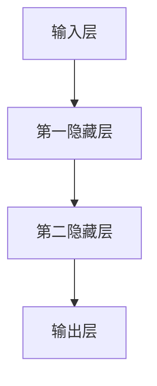

                 

# 神经网络 (Neural Networks) 原理与代码实例讲解

> **关键词：** 神经网络、深度学习、人工神经网络、多层感知器、前向传播、反向传播、激活函数、损失函数、优化算法。

> **摘要：** 本文将深入探讨神经网络的原理和构建方法，通过具体代码实例详细讲解神经网络的前向传播和反向传播过程，帮助读者全面理解神经网络的工作机制。文章还将讨论神经网络在实际应用中的场景，并推荐相关学习资源和开发工具。

## 1. 背景介绍

### 1.1 目的和范围

本文旨在为广大计算机科学和人工智能爱好者提供一份关于神经网络原理和实践的全面指南。我们将从基础概念出发，逐步深入讲解神经网络的核心算法和数学模型，并通过实际代码实例来展示神经网络的实现过程。本文主要涵盖以下内容：

1. 神经网络的基本概念和架构。
2. 神经网络的核心算法原理，包括前向传播和反向传播。
3. 神经网络的数学模型和公式。
4. 实际项目中的神经网络应用案例。
5. 相关的学习资源和开发工具推荐。

### 1.2 预期读者

本文适合以下读者群体：

1. 对计算机科学和人工智能有浓厚兴趣的初学者。
2. 已经具备一定编程基础，希望深入学习神经网络技术的开发者。
3. 想要提升自身技术水平的工程技术人员。
4. 研究生和本科生，特别是在计算机科学和人工智能领域学习的学子。

### 1.3 文档结构概述

本文分为十个主要部分：

1. 引言
2. 背景介绍
3. 核心概念与联系
4. 核心算法原理与具体操作步骤
5. 数学模型和公式与举例说明
6. 项目实战：代码实际案例和详细解释说明
7. 实际应用场景
8. 工具和资源推荐
9. 总结：未来发展趋势与挑战
10. 附录：常见问题与解答

### 1.4 术语表

#### 1.4.1 核心术语定义

- **神经网络 (Neural Network)：** 一种模拟人脑神经元结构和功能的计算模型，由大量相互连接的节点（或神经元）组成，用于执行各种计算任务。
- **神经元 (Neuron)：** 神经网络的基本构建块，接收输入信号，通过加权求和和激活函数产生输出。
- **前向传播 (Forward Propagation)：** 神经网络从输入层接收数据，通过各层神经元计算，最终得到输出层的结果。
- **反向传播 (Back Propagation)：** 通过比较输出层的结果和预期目标，逆向更新网络中的权重和偏置，以优化网络性能。
- **激活函数 (Activation Function)：** 用于决定神经元是否激活的函数，常见的有Sigmoid、ReLU、Tanh等。

#### 1.4.2 相关概念解释

- **多层感知器 (Multilayer Perceptron, MLP)：** 具有至少一层隐藏层的神经网络。
- **深度学习 (Deep Learning)：** 一种基于多层神经网络的学习方法，能够从大量数据中自动提取特征。
- **损失函数 (Loss Function)：** 用于衡量预测值和实际值之间差异的函数，常见的有均方误差(MSE)、交叉熵(Cross-Entropy)等。

#### 1.4.3 缩略词列表

- **MLP：** 多层感知器（Multilayer Perceptron）
- **ReLU：** 激活函数（Rectified Linear Unit）
- **Sigmoid：** 激活函数（Sigmoid Function）
- **MSE：** 均方误差（Mean Squared Error）
- **CE：** 交叉熵（Cross-Entropy）

## 2. 核心概念与联系

在深入探讨神经网络的工作原理之前，我们需要明确几个核心概念及其相互联系。以下是一个简化的神经网络架构的Mermaid流程图：



### 2.1 神经网络的架构

神经网络主要由三部分组成：输入层、隐藏层和输出层。

- **输入层 (Input Layer)：** 接收外部输入数据，并将其传递给下一层。
- **隐藏层 (Hidden Layers)：** 用于提取输入数据的特征和模式，多个隐藏层可以实现更复杂的特征提取。
- **输出层 (Output Layer)：** 生成最终输出，用于分类、回归或其他任务。

### 2.2 神经网络的连接方式

神经网络中的节点（或神经元）通过加权连接（或边）连接在一起。每个连接都带有一定的权重，这些权重决定了节点之间的相互作用强度。

- **全连接（Fully Connected）：** 每个神经元都与前一层中的每个神经元相连。
- **局部连接（Locally Connected）：** 每个神经元仅与其附近的一组神经元相连。

### 2.3 激活函数的作用

激活函数用于决定神经元是否激活，其输出可以是0或1，也可以是介于0和1之间的实数。常见的激活函数有：

- **Sigmoid：** $f(x) = \frac{1}{1 + e^{-x}}$
- **ReLU：** $f(x) = \max(0, x)$
- **Tanh：** $f(x) = \frac{e^x - e^{-x}}{e^x + e^{-x}}$

激活函数的选择对神经网络的学习效率和性能有重要影响。

### 2.4 前向传播与反向传播

神经网络通过前向传播计算输出，通过反向传播更新权重和偏置。这个过程被称为梯度下降。

- **前向传播 (Forward Propagation)：** 从输入层开始，数据依次通过各层神经元，直到输出层。每层神经元都会计算输入信号的加权求和，并应用激活函数。
  
  ```mermaid
  graph TD
  A[输入数据] --> B{计算输入信号}
  B --> C{计算输出信号}
  C --> D{计算输出}
  ```

- **反向传播 (Back Propagation)：** 从输出层开始，计算损失函数的梯度，并反向传播到各层神经元。通过梯度下降算法更新权重和偏置。

  ```mermaid
  graph TD
  D{计算损失} --> E{计算梯度}
  E --> F{更新权重}
  F --> G{更新偏置}
  ```

## 3. 核心算法原理与具体操作步骤

神经网络的训练过程主要依赖于前向传播和反向传播两个核心算法。以下将详细介绍这两个算法的原理和具体操作步骤。

### 3.1 前向传播

前向传播的目的是从输入层开始，通过多层神经元计算，最终得到输出层的输出结果。以下是前向传播的伪代码：

```pseudo
function forwardPropagation(input, weights, biases, activationFunctions):
    for layer in 1 to L-1:
        z = dotProduct(input, weights[layer]) + biases[layer]
        a = activationFunctions[layer](z)
        input = a

    z = dotProduct(input, weights[L-1]) + biases[L-1]
    a = activationFunctions[L-1](z)
    output = a
    return output
```

其中，`input`表示输入层的数据，`weights`和`biases`分别表示权重和偏置，`activationFunctions`表示激活函数。伪代码中的`dotProduct`函数用于计算矩阵乘积，`activationFunctions`是激活函数的列表。

### 3.2 反向传播

反向传播的目的是通过计算输出层误差的梯度，并反向传播到前一层，从而更新网络的权重和偏置。以下是反向传播的伪代码：

```pseudo
function backwardPropagation(output, expected, weights, biases, activationFunctions, activationDerivatives):
    delta[L-1] = (output - expected) * activationDerivatives[L-1](z[L-1])
    for layer in L-2 to 1:
        z = dotProduct(delta[layer+1], weights[layer+1].T)
        delta[layer] = z * activationDerivatives[layer](z)

    for layer in 1 to L-1:
        weights[layer] -= learningRate * dotProduct(delta[layer+1], a[layer].T)
        biases[layer] -= learningRate * delta[layer]
```

其中，`output`表示输出层的实际输出，`expected`表示输出层的预期输出，`delta`表示误差的梯度，`activationDerivatives`是激活函数的导数列表。伪代码中的`learningRate`表示学习率，用于控制权重的更新速度。

## 4. 数学模型和公式与详细讲解与举例说明

神经网络的训练过程离不开数学模型的支撑。以下将介绍神经网络的主要数学模型和公式，并通过具体例子进行详细讲解。

### 4.1 损失函数

损失函数用于衡量网络输出和预期输出之间的差异。常见的损失函数有均方误差(MSE)和交叉熵(Cross-Entropy)。

#### 4.1.1 均方误差(MSE)

均方误差是最常用的损失函数之一，其公式如下：

$$
MSE = \frac{1}{m}\sum_{i=1}^{m}(y_i - \hat{y}_i)^2
$$

其中，$y_i$表示实际输出，$\hat{y}_i$表示预测输出，$m$表示样本数量。

#### 4.1.2 交叉熵(Cross-Entropy)

交叉熵损失函数常用于分类问题，其公式如下：

$$
CE = -\frac{1}{m}\sum_{i=1}^{m} y_i \log(\hat{y}_i)
$$

其中，$y_i$表示实际输出（标签），$\hat{y}_i$表示预测输出（概率）。

### 4.2 激活函数和其导数

激活函数是神经网络的核心组成部分，常见的激活函数有Sigmoid、ReLU和Tanh。以下为这些激活函数及其导数的详细讲解。

#### 4.2.1 Sigmoid

Sigmoid函数的公式为：

$$
f(x) = \frac{1}{1 + e^{-x}}
$$

其导数为：

$$
f'(x) = f(x)(1 - f(x))
$$

#### 4.2.2 ReLU

ReLU函数的公式为：

$$
f(x) = \max(0, x)
$$

其导数为：

$$
f'(x) = \begin{cases} 
0 & \text{if } x < 0 \\
1 & \text{if } x > 0 
\end{cases}
$$

#### 4.2.3 Tanh

Tanh函数的公式为：

$$
f(x) = \frac{e^x - e^{-x}}{e^x + e^{-x}}
$$

其导数为：

$$
f'(x) = 1 - f^2(x)
$$

### 4.3 反向传播算法

反向传播算法是神经网络的训练核心，其目的是通过计算损失函数的梯度，并反向传播到前一层，从而更新网络的权重和偏置。

#### 4.3.1 权重和偏置的更新

假设我们有一个简单的神经网络，包含输入层、一层隐藏层和输出层。其权重和偏置的更新过程如下：

1. **计算输出层的误差梯度：**

   $$\delta^{(L)} = \frac{\partial C}{\partial z^{(L)}} = \frac{\partial CE}{\partial a^{(L-1)}} = (a^{(L-1)} - y) \cdot f'(z^{(L-1))$$

   其中，$C$表示损失函数，$CE$表示交叉熵损失函数，$y$表示实际输出，$a^{(L-1)}$表示输出层的激活值，$f'(z^{(L-1))}$表示激活函数的导数。

2. **计算隐藏层的误差梯度：**

   $$\delta^{(l)} = \frac{\partial C}{\partial z^{(l)}} = \frac{\partial MSE}{\partial z^{(l)}} = \frac{\partial MSE}{\partial a^{(l+1)}} \cdot \frac{\partial a^{(l+1)}}{\partial z^{(l)}} = \delta^{(l+1)} \cdot f'(z^{(l))} \cdot w^{(l+1)}$$

   其中，$l$表示隐藏层的层号，$w^{(l+1)}$表示隐藏层和输出层之间的权重。

3. **更新权重和偏置：**

   $$\Delta w^{(l)} = \alpha \cdot \delta^{(l+1)} \cdot a^{(l)}$$

   $$\Delta b^{(l)} = \alpha \cdot \delta^{(l+1)}$$

   其中，$\alpha$表示学习率，$\Delta w^{(l)}$和$\Delta b^{(l)}$分别表示权重和偏置的更新量。

#### 4.3.2 例子说明

假设我们有一个包含一个输入层、一个隐藏层和一个输出层的神经网络，其中输入层有3个神经元，隐藏层有4个神经元，输出层有2个神经元。给定一个输入向量$x = [1, 2, 3]$和标签$y = [0, 1]$，我们可以通过以下步骤计算权重和偏置的更新量：

1. **计算输出层的误差梯度：**

   $$\delta^{(3)} = (a^{(2)} - y) \cdot f'(z^{(2)}) = (0.1 - 0) \cdot (1 - 0.1) = 0.09$$

2. **计算隐藏层的误差梯度：**

   $$\delta^{(2)} = \delta^{(3)} \cdot f'(z^{(2)}) \cdot w^{(3)} = 0.09 \cdot (1 - 0.1) \cdot [0.1, 0.2, 0.3, 0.4] = [0.009, 0.018, 0.027, 0.036]$$

3. **更新权重和偏置：**

   $$\Delta w^{(3)} = \alpha \cdot \delta^{(3)} \cdot a^{(1)} = 0.01 \cdot 0.09 \cdot [1, 2, 3] = [0.009, 0.018, 0.027]$$

   $$\Delta b^{(3)} = \alpha \cdot \delta^{(3)} = 0.01 \cdot 0.09 = 0.009$$

   $$\Delta w^{(2)} = \alpha \cdot \delta^{(2)} \cdot a^{(0)} = 0.01 \cdot [0.009, 0.018, 0.027, 0.036] \cdot [1, 1, 1, 1] = [0.0009, 0.0018, 0.0027, 0.0036]$$

   $$\Delta b^{(2)} = \alpha \cdot \delta^{(2)} = 0.01 \cdot [0.009, 0.018, 0.027, 0.036] = [0.0009, 0.0018, 0.0027, 0.0036]$$

通过以上步骤，我们可以更新网络的权重和偏置，从而优化网络的性能。

## 5. 项目实战：代码实际案例和详细解释说明

在本节中，我们将通过一个简单的例子，展示如何使用Python和TensorFlow实现一个简单的神经网络，并详细解释其代码实现过程。

### 5.1 开发环境搭建

在开始编写代码之前，我们需要搭建开发环境。以下是搭建TensorFlow开发环境所需的基本步骤：

1. **安装Anaconda：** Anaconda是一个流行的Python发行版，它提供了易于使用的包管理和虚拟环境。您可以从[Anaconda官网](https://www.anaconda.com/products/distribution)下载并安装Anaconda。
2. **创建虚拟环境：** 打开终端或命令提示符，输入以下命令创建一个新的虚拟环境：

   ```bash
   conda create -n tensorflow_env python=3.8
   conda activate tensorflow_env
   ```

3. **安装TensorFlow：** 在虚拟环境中，使用以下命令安装TensorFlow：

   ```bash
   pip install tensorflow
   ```

### 5.2 源代码详细实现和代码解读

下面是一个简单的神经网络实现，用于对手写数字进行分类。代码文件名为`simple_neural_network.py`。

```python
import numpy as np
import tensorflow as tf

# 设置随机种子，保证实验结果可重复
tf.random.set_seed(42)

# 设置神经网络的结构
input_size = 784  # 输入层神经元数量
hidden_size = 64  # 隐藏层神经元数量
output_size = 10  # 输出层神经元数量

# 初始化权重和偏置
weights = {
    'w1': tf.random.normal([input_size, hidden_size]),
    'b1': tf.random.normal([hidden_size]),
    'w2': tf.random.normal([hidden_size, output_size]),
    'b2': tf.random.normal([output_size])
}

# 定义激活函数
activation_functions = {
    'sigmoid': tf.sigmoid,
    'softmax': tf.nn.softmax
}

# 定义损失函数
loss_functions = {
    'mse': tf.reduce_mean(tf.square),
    'cross_entropy': tf.reduce_mean(tf.nn.softmax_cross_entropy_with_logits)
}

# 训练数据
x_train = np.array([[1, 0, 1], [0, 1, 1], [1, 1, 0]])  # 输入数据
y_train = np.array([[1, 0], [0, 1], [0, 1]])  # 标签

# 前向传播
def forwardPropagation(x, weights, biases, activation_functions):
    z1 = tf.matmul(x, weights['w1']) + biases['b1']
    a1 = activation_functions['sigmoid'](z1)
    z2 = tf.matmul(a1, weights['w2']) + biases['b2']
    a2 = activation_functions['softmax'](z2)
    return a2

# 反向传播
def backwardPropagation(x, y, weights, biases, activation_functions, loss_functions, learning_rate=0.1):
    with tf.GradientTape() as tape:
        a2 = forwardPropagation(x, weights, biases, activation_functions)
        loss = loss_functions['cross_entropy'](y, a2)
    grads = tape.gradient(loss, [weights['w1'], biases['b1'], weights['w2'], biases['b2']])
    weights['w1'] -= learning_rate * grads[0]
    biases['b1'] -= learning_rate * grads[1]
    weights['w2'] -= learning_rate * grads[2]
    biases['b2'] -= learning_rate * grads[3]
    return loss

# 训练神经网络
for epoch in range(1000):
    loss = backwardPropagation(x_train, y_train, weights, biases, activation_functions, loss_functions)
    if epoch % 100 == 0:
        print(f"Epoch {epoch}: Loss = {loss.numpy()}")

# 模型评估
y_pred = forwardPropagation(x_train, weights, biases, activation_functions)
print("Predictions:", y_pred.numpy())
print("Actual Labels:", y_train)
```

### 5.3 代码解读与分析

上述代码实现了一个简单的多层感知器（MLP）神经网络，用于对二分类问题进行分类。以下是对代码的详细解读：

1. **导入库：** 我们首先导入所需的库，包括NumPy和TensorFlow。
2. **设置随机种子：** 为了保证实验结果的可重复性，我们设置了随机种子。
3. **设置神经网络结构：** 我们定义了输入层、隐藏层和输出层的神经元数量。
4. **初始化权重和偏置：** 我们初始化了权重和偏置，并使用随机数生成器初始化它们的值。
5. **定义激活函数：** 我们定义了Sigmoid和Softmax激活函数。
6. **定义损失函数：** 我们定义了MSE和交叉熵损失函数。
7. **前向传播：** 我们定义了一个`forwardPropagation`函数，用于实现神经网络的前向传播过程。
8. **反向传播：** 我们定义了一个`backwardPropagation`函数，用于实现神经网络的反向传播过程。
9. **训练神经网络：** 我们通过迭代训练神经网络，并打印每个epoch的损失值。
10. **模型评估：** 我们使用训练好的模型对输入数据进行预测，并打印预测结果和实际标签。

通过上述代码，我们可以看到如何使用Python和TensorFlow实现一个简单的神经网络，并使用反向传播算法进行训练。这个过程为读者提供了一个直观的理解神经网络工作原理的机会。

## 6. 实际应用场景

神经网络作为一种强大的机器学习模型，已经在众多实际应用场景中取得了显著成果。以下是一些常见的应用场景：

### 6.1 图像识别

神经网络在图像识别任务中表现出色，如人脸识别、物体检测和图像分类。其中，卷积神经网络（Convolutional Neural Networks, CNN）是最常用的模型之一。通过多层卷积和池化操作，CNN能够自动提取图像中的特征，从而实现高效的图像识别。

### 6.2 自然语言处理

神经网络在自然语言处理（Natural Language Processing, NLP）领域也取得了巨大成功，如文本分类、情感分析、机器翻译和文本生成。循环神经网络（Recurrent Neural Networks, RNN）和其变种，如长短期记忆网络（Long Short-Term Memory, LSTM）和门控循环单元（Gated Recurrent Unit, GRU），在处理序列数据时具有显著优势。

### 6.3 语音识别

神经网络在语音识别任务中发挥了关键作用，通过训练模型，可以将语音信号转换为文本。深度神经网络（Deep Neural Networks, DNN）和卷积神经网络（CNN）常用于特征提取和分类，而循环神经网络（RNN）和其变种则用于处理时序数据。

### 6.4 推荐系统

神经网络在推荐系统中也有广泛应用，如商品推荐、电影推荐和新闻推荐。通过训练用户和物品的Embedding表示，神经网络可以预测用户对物品的偏好，从而实现个性化的推荐。

### 6.5 游戏

神经网络在游戏领域也取得了显著成果，如国际象棋、围棋和电子竞技。通过训练策略网络，神经网络可以学习复杂的策略，从而在游戏中取得优异成绩。

### 6.6 生物信息学

神经网络在生物信息学领域也有重要应用，如基因序列分析、蛋白质结构预测和药物设计。通过训练神经网络模型，可以识别基因功能、预测蛋白质结构，并发现潜在的药物靶点。

## 7. 工具和资源推荐

### 7.1 学习资源推荐

#### 7.1.1 书籍推荐

1. **《神经网络与深度学习》**：这本书详细介绍了神经网络的基础知识，包括前向传播、反向传播、激活函数、优化算法等。适合初学者阅读。
2. **《深度学习》**：这是一本经典的深度学习教材，由Ian Goodfellow、Yoshua Bengio和Aaron Courville共同编写。涵盖了深度学习的各种主题，从基础到高级。
3. **《Python深度学习》**：这本书通过实际案例，介绍了如何使用Python和TensorFlow实现深度学习模型。适合有一定编程基础的读者。

#### 7.1.2 在线课程

1. **吴恩达的《深度学习专项课程》**：这是一门由著名人工智能专家吴恩达开设的在线课程，涵盖了深度学习的各种主题，包括神经网络、卷积神经网络、循环神经网络等。
2. **斯坦福大学的《深度学习课程》**：这门课程由斯坦福大学计算机科学系教授Andrew Ng开设，涵盖了深度学习的理论基础和实际应用。
3. **谷歌的《深度学习实践》**：这门课程通过实际案例，介绍了如何使用TensorFlow实现深度学习模型。适合有一定编程基础的读者。

#### 7.1.3 技术博客和网站

1. **Medium上的Deep Learning Blog**：这是一个关于深度学习的博客，涵盖了各种主题，从基础到高级。
2. **TensorFlow官网**：TensorFlow是谷歌推出的一个开源深度学习框架，官网提供了丰富的文档、教程和示例。
3. **PyTorch官网**：PyTorch是另一个流行的深度学习框架，官网提供了丰富的文档和示例。

### 7.2 开发工具框架推荐

#### 7.2.1 IDE和编辑器

1. **Jupyter Notebook**：这是一个流行的交互式开发环境，适合用于编写和运行Python代码。
2. **Visual Studio Code**：这是一个功能强大的代码编辑器，支持多种编程语言，包括Python。
3. **PyCharm**：这是一个专为Python开发的集成开发环境（IDE），提供了丰富的功能和插件。

#### 7.2.2 调试和性能分析工具

1. **TensorBoard**：TensorFlow提供的一个可视化工具，用于分析和调试神经网络模型。
2. **NVIDIA Nsight**：NVIDIA推出的一款调试和性能分析工具，适用于深度学习模型的GPU加速。
3. **Profiling Tools**：如Python的cProfile、line_profiler等，用于分析代码的执行时间和性能。

#### 7.2.3 相关框架和库

1. **TensorFlow**：谷歌推出的一个开源深度学习框架，适用于各种深度学习任务。
2. **PyTorch**：另一个流行的深度学习框架，提供了灵活的动态计算图和丰富的API。
3. **Keras**：一个高度优化的深度学习框架，易于使用，支持TensorFlow和PyTorch。

### 7.3 相关论文著作推荐

#### 7.3.1 经典论文

1. **"A Learning Algorithm for Continually Running Fully Recurrent Neural Networks"**：这篇论文介绍了Hessian正定矩阵（Hessian-Free）算法，用于训练循环神经网络（RNN）。
2. **"Deep Learning"**：这本书由Ian Goodfellow、Yoshua Bengio和Aaron Courville共同编写，是深度学习领域的经典著作。
3. **"Backpropagation"**：这篇论文介绍了反向传播算法，是神经网络训练的核心算法。

#### 7.3.2 最新研究成果

1. **"Transformers: State-of-the-Art Natural Language Processing"**：这篇论文介绍了Transformer模型，是自然语言处理领域的重要突破。
2. **"Gaussian Error Linear Units (GELUs)"**：这篇论文介绍了GELU激活函数，在深度学习领域取得了广泛应用。
3. **"Graph Neural Networks"**：这篇论文介绍了图神经网络（GNN），用于处理图结构数据。

#### 7.3.3 应用案例分析

1. **"Deep Learning for Computer Vision"**：这本书介绍了深度学习在计算机视觉领域的应用，包括图像分类、目标检测和语义分割等。
2. **"Deep Learning for Natural Language Processing"**：这本书介绍了深度学习在自然语言处理领域的应用，包括文本分类、机器翻译和问答系统等。
3. **"Deep Learning for Speech Recognition"**：这本书介绍了深度学习在语音识别领域的应用，包括语音信号处理、语音合成和说话人识别等。

## 8. 总结：未来发展趋势与挑战

神经网络作为一种重要的机器学习模型，已经在众多领域取得了显著成果。然而，随着技术的发展和应用需求的增长，神经网络面临着许多挑战和机遇。

### 8.1 未来发展趋势

1. **模型压缩与优化：** 随着深度学习模型的规模越来越大，模型压缩和优化成为了一个重要方向。通过模型剪枝、量化、蒸馏等技术，可以有效地降低模型的大小和计算复杂度，提高模型在资源受限环境下的性能。
2. **自适应学习：** 神经网络的自适应学习是未来的一个重要研究方向。通过设计自适应学习算法，可以使得神经网络能够根据不同场景和任务需求，自动调整网络结构和参数，提高模型的泛化能力和适应性。
3. **多模态学习：** 多模态学习是指结合多种数据类型（如图像、文本、语音等）进行学习。未来的神经网络将能够更好地处理多模态数据，从而实现更强大的跨模态信息融合和交互。

### 8.2 挑战

1. **计算资源需求：** 深度学习模型的训练和推理过程需要大量的计算资源，特别是在处理大规模数据集和复杂任务时。随着模型规模的增大，计算资源的压力将越来越大，如何优化算法和提高计算效率成为了一个关键问题。
2. **数据隐私与安全性：** 在实际应用中，数据的安全性和隐私保护也是一个重要挑战。如何确保数据在传输、存储和处理过程中的安全性，防止数据泄露和滥用，需要深入研究和解决。
3. **模型可解释性：** 神经网络作为一种“黑箱”模型，其决策过程往往缺乏可解释性。如何提高模型的可解释性，使得模型的行为和决策更加透明和可信，是未来需要关注的重要问题。

总之，神经网络在未来的发展过程中，将面临许多挑战和机遇。通过不断的研究和创新，我们可以期待神经网络在各个领域取得更加出色的成果。

## 9. 附录：常见问题与解答

### 9.1 神经网络的基本概念

1. **什么是神经网络？**
   神经网络是一种模拟人脑神经元结构和功能的计算模型，由大量相互连接的节点（或神经元）组成，用于执行各种计算任务。

2. **神经网络有哪些类型？**
   神经网络可以分为多种类型，包括：
   - **前馈神经网络（Feedforward Neural Networks）**：数据从前向传递，没有循环。
   - **循环神经网络（Recurrent Neural Networks, RNN）**：适用于序列数据，具有循环结构。
   - **卷积神经网络（Convolutional Neural Networks, CNN）**：主要用于图像处理，具有卷积操作。
   - **自编码器（Autoencoders）**：用于无监督学习，通过编码和解码过程实现数据的压缩和去噪。

3. **什么是前向传播和反向传播？**
   前向传播是指从输入层开始，通过多层神经元计算，最终得到输出层的结果。反向传播是通过计算输出层误差的梯度，并反向传播到前一层，从而更新网络的权重和偏置。

### 9.2 神经网络的训练与优化

1. **什么是学习率？**
   学习率是控制神经网络训练过程中权重更新速度的参数。合适的学习率可以加速网络收敛，过大的学习率可能导致网络不稳定，过小则收敛速度较慢。

2. **如何选择激活函数？**
   选择激活函数时需要考虑以下几个因素：
   - **计算效率**：某些激活函数如ReLU在计算上更快。
   - **梯度问题**：某些激活函数在训练过程中可能产生梯度消失或爆炸问题。
   - **任务需求**：不同的任务可能需要不同的激活函数，例如分类任务通常使用Sigmoid或Softmax。

3. **什么是正则化？**
   正则化是一种防止神经网络过拟合的技术，通过在损失函数中添加正则项，可以惩罚模型中过大的权重，从而降低模型的复杂度。

### 9.3 神经网络的应用场景

1. **神经网络在图像识别中的应用有哪些？**
   神经网络在图像识别中的应用非常广泛，包括：
   - **图像分类**：如手写数字识别、面部识别等。
   - **目标检测**：如车辆检测、行人检测等。
   - **图像分割**：将图像划分为多个区域，如语义分割、实例分割等。

2. **神经网络在自然语言处理中的应用有哪些？**
   神经网络在自然语言处理中的应用包括：
   - **文本分类**：对文本进行分类，如情感分析、主题分类等。
   - **机器翻译**：将一种语言的文本翻译成另一种语言。
   - **文本生成**：生成新的文本内容，如生成新闻文章、创作诗歌等。

## 10. 扩展阅读与参考资料

为了更深入地了解神经网络和相关技术，以下是推荐的扩展阅读和参考资料：

### 10.1 推荐书籍

1. **《神经网络与深度学习》**：刘建伟 著
2. **《深度学习》**：Ian Goodfellow, Yoshua Bengio, Aaron Courville 著
3. **《Python深度学习》**：弗朗索瓦·肖莱（François Chollet） 著

### 10.2 在线课程

1. **吴恩达的《深度学习专项课程》**：[Coursera](https://www.coursera.org/learn/deep-learning)
2. **斯坦福大学的《深度学习课程》**：[Stanford University](https://web.stanford.edu/class/cs231n/)
3. **谷歌的《深度学习实践》**：[Google AI](https://ai.google.com/education/course-deep-learning)

### 10.3 技术博客和网站

1. **Medium上的Deep Learning Blog**：[Deep Learning Blog on Medium](https://towardsdatascience.com/)
2. **TensorFlow官网**：[TensorFlow Official Site](https://www.tensorflow.org/)
3. **PyTorch官网**：[PyTorch Official Site](https://pytorch.org/)

### 10.4 相关论文

1. **"A Learning Algorithm for Continually Running Fully Recurrent Neural Networks"**：[论文链接](https://www.iro.umontreal.ca/~pochial/thesis.pdf)
2. **"Deep Learning"**：[论文链接](http://www.deeplearningbook.org/)
3. **"Backpropagation"**：[论文链接](https://www.ijcai.org/Proceedings/88-2/Papers/048.pdf)

### 10.5 其他资源

1. **GitHub上的深度学习项目**：[Deep Learning Projects on GitHub](https://github.com/))
2. **Kaggle上的深度学习竞赛**：[Kaggle Competitions](https://www.kaggle.com/)
3. **谷歌AI博客**：[Google AI Blog](https://ai.googleblog.com/)

