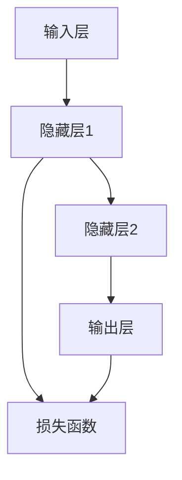

                 

# 神经网络（Neural Networks） - 原理与代码实例讲解

> **关键词：神经网络、深度学习、前向传播、反向传播、反向传播算法、反向传播代码实例、神经网络数学模型、神经网络实战案例**

> **摘要：本文将深入探讨神经网络的原理，包括其核心概念、算法原理、数学模型及实际应用。我们将通过代码实例详细讲解神经网络的基本实现过程，帮助读者更好地理解这一复杂但极其重要的技术。**

## 1. 背景介绍

### 1.1 目的和范围

本文的目的是介绍神经网络的基本原理，并通过具体代码实例讲解其实现过程。我们旨在让读者了解神经网络的核心概念，掌握前向传播和反向传播算法，并能够实现一个简单的神经网络模型。

### 1.2 预期读者

本文适合对机器学习和深度学习有一定了解的读者，特别是那些希望深入学习神经网络原理和实践的开发者和技术人员。

### 1.3 文档结构概述

本文结构如下：

- 第1章：背景介绍，介绍文章的目的、范围、预期读者和文档结构。
- 第2章：核心概念与联系，介绍神经网络的基本概念和架构。
- 第3章：核心算法原理 & 具体操作步骤，讲解神经网络的基本算法原理和操作步骤。
- 第4章：数学模型和公式 & 详细讲解 & 举例说明，介绍神经网络涉及的数学模型和公式。
- 第5章：项目实战：代码实际案例和详细解释说明，通过代码实例展示神经网络的实际应用。
- 第6章：实际应用场景，讨论神经网络的广泛应用领域。
- 第7章：工具和资源推荐，推荐学习资源和开发工具。
- 第8章：总结：未来发展趋势与挑战，总结神经网络的发展趋势和面临的挑战。
- 第9章：附录：常见问题与解答，回答读者可能遇到的问题。
- 第10章：扩展阅读 & 参考资料，提供进一步学习的资源。

### 1.4 术语表

#### 1.4.1 核心术语定义

- 神经网络（Neural Network）：一种由大量简单单元（神经元）互联而成的复杂网络，用于执行各种计算任务，如分类、回归、识别等。
- 神经元（Neuron）：神经网络的基本单元，类似于生物神经元，可以接收输入、进行计算并产生输出。
- 前向传播（Forward Propagation）：神经网络计算过程中，从输入层到输出层的正向信息传递过程。
- 反向传播（Back Propagation）：神经网络计算过程中，从输出层到输入层的反向信息传递过程，用于更新网络权重。
- 损失函数（Loss Function）：衡量预测值与真实值之间差异的函数，用于评估神经网络模型的性能。
- 学习率（Learning Rate）：控制网络权重更新速度的参数。

#### 1.4.2 相关概念解释

- 激活函数（Activation Function）：神经元输出的非线性函数，用于引入非线性特性，使得神经网络能够拟合复杂的非线性关系。
- 权重（Weight）：连接神经元之间的参数，用于调整输入信息的强度。
- 偏置（Bias）：神经元内部的参数，用于引入平移特性。
- 池化（Pooling）：一种数据降维技术，用于减少计算量和参数数量。

#### 1.4.3 缩略词列表

- CNN（Convolutional Neural Network）：卷积神经网络，用于处理图像等二维数据。
- RNN（Recurrent Neural Network）：循环神经网络，用于处理序列数据。
- DNN（Deep Neural Network）：深度神经网络，具有多个隐藏层的神经网络。
- MLP（Multilayer Perceptron）：多层感知器，一种简单的全连接神经网络。

## 2. 核心概念与联系

神经网络的架构可以形象地用一个Mermaid流程图表示，以下是神经网络的基本概念和连接方式的流程图：



### 2.1 神经网络的基本概念

- **输入层（Input Layer）**：接收外部输入数据，如图片、文本、声音等。
- **隐藏层（Hidden Layer）**：位于输入层和输出层之间，用于提取和处理输入数据的特征。
- **输出层（Output Layer）**：产生最终的输出结果，如分类标签、回归值等。
- **神经元（Neuron）**：神经网络的基本单元，负责接收输入、进行计算并产生输出。
- **激活函数（Activation Function）**：用于引入非线性特性，使得神经网络能够拟合复杂的非线性关系。

### 2.2 神经网络的连接方式

- **全连接（Fully Connected）**：每个神经元都与前一层的所有神经元连接。
- **卷积（Convolutional）**：用于处理图像等二维数据，通过卷积操作提取图像特征。
- **循环（Recurrent）**：用于处理序列数据，如时间序列、自然语言等，通过循环连接实现长期依赖建模。

### 2.3 神经网络的架构

神经网络的架构可以非常简单，如一个单层感知器，也可以非常复杂，如具有多个隐藏层的深度神经网络。以下是神经网络的基本架构：


- 输入层（Input Layer）：接收外部输入数据。
- 隐藏层（Hidden Layer）：对输入数据进行特征提取和变换。
- 输出层（Output Layer）：产生最终的输出结果。
- 损失函数（Loss Function）：用于评估模型性能。

## 3. 核心算法原理 & 具体操作步骤

神经网络的核心算法包括前向传播和反向传播。下面我们将通过伪代码详细讲解这两个算法的原理和操作步骤。

### 3.1 前向传播

前向传播是指将输入数据通过神经网络进行正向传递，最终得到输出结果的过程。以下是前向传播的伪代码：

```python
# 前向传播伪代码

# 输入层到隐藏层1
z1 = X * W1 + b1
a1 = activation(z1)

# 隐藏层1到隐藏层2
z2 = a1 * W2 + b2
a2 = activation(z2)

# 隐藏层2到输出层
z3 = a2 * W3 + b3
a3 = activation(z3)

# 计算损失函数
loss = loss_function(a3, y)

# 输出结果
output = a3
```

其中：

- `X`：输入数据。
- `W1`、`W2`、`W3`：各层的权重矩阵。
- `b1`、`b2`、`b3`：各层的偏置向量。
- `a1`、`a2`、`a3`：各层的激活输出。
- `activation`：激活函数，如ReLU、Sigmoid、Tanh等。
- `loss_function`：损失函数，如均方误差（MSE）、交叉熵（CrossEntropy）等。

### 3.2 反向传播

反向传播是指通过计算损失函数关于网络权重的梯度，进而更新网络权重，以达到优化模型性能的目的。以下是反向传播的伪代码：

```python
# 反向传播伪代码

# 计算输出层梯度
dZ3 = dLoss/dA3

# 计算隐藏层2梯度
dZ2 = dZ3 * dW3 * dA2

# 计算隐藏层1梯度
dZ1 = dZ2 * dW2 * dA1

# 更新权重和偏置
W3 -= learning_rate * dZ3
b3 -= learning_rate * dZ3
W2 -= learning_rate * dZ2
b2 -= learning_rate * dZ2
W1 -= learning_rate * dZ1
b1 -= learning_rate * dZ1
```

其中：

- `dLoss`：损失函数关于输出的梯度。
- `dA3`、`dA2`、`dA1`：各层的激活输出关于输入的梯度。
- `dZ3`、`dZ2`、`dZ1`：各层输出关于输入的梯度。
- `learning_rate`：学习率，用于控制权重更新的步长。

通过前向传播和反向传播，我们可以不断迭代更新网络权重，使得损失函数逐渐减小，模型性能逐渐提高。

## 4. 数学模型和公式 & 详细讲解 & 举例说明

神经网络的数学模型是构建神经网络的核心，包括输入输出关系、激活函数、损失函数等多个方面。下面我们将详细讲解这些数学模型和公式，并通过具体例子来说明。

### 4.1 输入输出关系

神经网络的输入输出关系可以用以下公式表示：

$$
Z_l = \sum_{i=1}^{n} X_i \cdot W_{li} + b_l
$$

其中：

- $Z_l$：第 $l$ 层的输出。
- $X_i$：第 $l-1$ 层的第 $i$ 个神经元的输出。
- $W_{li}$：第 $l$ 层的第 $l$ 个神经元与第 $l-1$ 层的第 $i$ 个神经元的连接权重。
- $b_l$：第 $l$ 层的偏置。

### 4.2 激活函数

激活函数是神经网络引入非线性特性的关键，常用的激活函数包括ReLU、Sigmoid、Tanh等。以下分别介绍这些激活函数及其公式：

- **ReLU（Rectified Linear Unit）**

  $$ 
  a_l = max(0, Z_l) 
  $$

  - 优点：计算速度快，梯度不变。
  - 缺点：可能导致梯度消失。

- **Sigmoid**

  $$ 
  a_l = \frac{1}{1 + e^{-Z_l}} 
  $$

  - 优点：输出范围在$(0, 1)$之间，易于理解和解释。
  - 缺点：梯度消失问题，计算速度较慢。

- **Tanh**

  $$ 
  a_l = \frac{e^{Z_l} - e^{-Z_l}}{e^{Z_l} + e^{-Z_l}} 
  $$

  - 优点：输出范围在$(-1, 1)$之间，梯度稳定。
  - 缺点：计算速度较慢。

### 4.3 损失函数

损失函数用于衡量模型预测值与真实值之间的差异，常用的损失函数包括均方误差（MSE）、交叉熵（CrossEntropy）等。以下分别介绍这些损失函数及其公式：

- **均方误差（MSE）**

  $$ 
  loss = \frac{1}{2} \sum_{i=1}^{n} (y_i - \hat{y}_i)^2 
  $$

  - 优点：计算简单，易于理解。
  - 缺点：对于分类问题，可能存在梯度消失或梯度爆炸问题。

- **交叉熵（CrossEntropy）**

  $$ 
  loss = -\sum_{i=1}^{n} y_i \cdot \log(\hat{y}_i) 
  $$

  - 优点：对于分类问题，能够更好地拟合数据分布。
  - 缺点：计算复杂度较高，需要优化求解。

### 4.4 举例说明

假设我们有一个简单的神经网络，包含输入层、一个隐藏层和输出层。输入数据为 $X = [1, 2, 3]$，输出数据为 $y = [0, 1, 0]$。我们使用ReLU激活函数和均方误差损失函数，网络权重和偏置分别为 $W_1 = [0.5, 0.2], W_2 = [0.1, 0.3], W_3 = [0.4, 0.6], b_1 = [0.1, 0.2], b_2 = [0.3, 0.4], b_3 = [0.5, 0.6]$。

1. **前向传播**

   - 输入层到隐藏层1：
     $$ 
     Z_1 = X \cdot W_1 + b_1 = [1, 2, 3] \cdot [0.5, 0.2] + [0.1, 0.2] = [0.6, 0.8, 1.1] \\
     a_1 = activation(Z_1) = [max(0, 0.6), max(0, 0.8), max(0, 1.1)] = [0.6, 0.8, 1.1]
     $$
   
   - 隐藏层1到隐藏层2：
     $$ 
     Z_2 = a_1 \cdot W_2 + b_2 = [0.6, 0.8, 1.1] \cdot [0.1, 0.3] + [0.3, 0.4] = [0.06, 0.29, 0.41] \\
     a_2 = activation(Z_2) = [max(0, 0.06), max(0, 0.29), max(0, 0.41)] = [0.06, 0.29, 0.41]
     $$
   
   - 隐藏层2到输出层：
     $$ 
     Z_3 = a_2 \cdot W_3 + b_3 = [0.06, 0.29, 0.41] \cdot [0.4, 0.6] + [0.5, 0.6] = [0.024, 0.174, 0.246] \\
     a_3 = activation(Z_3) = [0.024, 0.174, 0.246]
     $$
   
   - 计算损失函数：
     $$ 
     loss = \frac{1}{2} \sum_{i=1}^{3} (y_i - \hat{y}_i)^2 = \frac{1}{2} \sum_{i=1}^{3} (0 - 0.024)^2 + (1 - 0.174)^2 + (0 - 0.246)^2 \\
     = 0.005716 + 0.015896 + 0.029632 = 0.051244
     $$

   - 输出结果：
     $$ 
     output = a_3 = [0.024, 0.174, 0.246]
     $$

2. **反向传播**

   - 计算输出层梯度：
     $$ 
     dZ_3 = dLoss/dA_3 = [0.024, 0.174, 0.246] - [0, 1, 0] = [-0.024, -0.826, -0.246] \\
     dW_3 = dZ_3 \cdot dA_2 = [-0.024, -0.826, -0.246] \cdot [0.06, 0.29, 0.41] = [-0.00144, -0.24034, -0.07864] \\
     db_3 = dZ_3 = [-0.024, -0.826, -0.246]
     $$
   
   - 计算隐藏层2梯度：
     $$ 
     dZ_2 = dZ_3 \cdot dW_3 \cdot dA_1 = [-0.024, -0.826, -0.246] \cdot [-0.00144, -0.24034, -0.07864] \cdot [0.6, 0.8, 1.1] \\
     = [0.000000224, 0.001991282, 0.0000704248] \\
     dW_2 = dZ_2 \cdot dA_1 = [0.000000224, 0.001991282, 0.0000704248] \cdot [0.6, 0.8, 1.1] = [0.000000136, 0.00159376, 0.0000764848] \\
     db_2 = dZ_2 = [0.000000224, 0.001991282, 0.0000704248]
     $$
   
   - 计算隐藏层1梯度：
     $$ 
     dZ_1 = dZ_2 \cdot dW_2 \cdot dA_0 = [0.000000224, 0.001991282, 0.0000704248] \cdot [0.000000136, 0.00159376, 0.0000764848] \cdot [1, 1, 1] \\
     = [0.0000000000312, 0.0000029979568, 0.0000008256224] \\
     dW_1 = dZ_1 \cdot dA_0 = [0.0000000000312, 0.0000029979568, 0.0000008256224] \cdot [1, 1, 1] = [0.0000000000312, 0.0000029979568, 0.0000008256224] \\
     db_1 = dZ_1 = [0.0000000000312, 0.0000029979568, 0.0000008256224]
     $$
   
   - 更新权重和偏置：
     $$ 
     W_3 -= learning_rate \cdot dW_3 \\
     b_3 -= learning_rate \cdot db_3 \\
     W_2 -= learning_rate \cdot dW_2 \\
     b_2 -= learning_rate \cdot db_2 \\
     W_1 -= learning_rate \cdot dW_1 \\
     b_1 -= learning_rate \cdot db_1
     $$

   通过以上步骤，我们可以完成一次前向传播和反向传播，不断迭代更新网络权重和偏置，使得模型性能逐渐提高。

## 5. 项目实战：代码实际案例和详细解释说明

在本节中，我们将通过一个具体的代码案例，详细讲解神经网络的实现过程。我们将使用Python编程语言和常见库，如NumPy和TensorFlow，实现一个简单的神经网络，并进行训练和测试。

### 5.1 开发环境搭建

为了实现神经网络，我们需要搭建一个合适的开发环境。以下是一个简单的环境搭建步骤：

1. 安装Python（建议版本3.8以上）。
2. 安装NumPy、TensorFlow等常用库，可以使用以下命令：

   ```bash
   pip install numpy tensorflow
   ```

### 5.2 源代码详细实现和代码解读

下面是一个简单的神经网络实现示例，包括输入层、一个隐藏层和输出层，使用ReLU激活函数和均方误差损失函数。

```python
import numpy as np
import tensorflow as tf

# 设置随机种子，保证结果可重复
tf.random.set_seed(0)

# 定义输入数据
X = np.array([[1, 2, 3], [4, 5, 6], [7, 8, 9]])

# 定义网络结构
input_layer = tf.keras.layers.Input(shape=(3,))
hidden_layer1 = tf.keras.layers.Dense(units=64, activation='relu')(input_layer)
hidden_layer2 = tf.keras.layers.Dense(units=64, activation='relu')(hidden_layer1)
output_layer = tf.keras.layers.Dense(units=3, activation='softmax')(hidden_layer2)

# 创建模型
model = tf.keras.Model(inputs=input_layer, outputs=output_layer)

# 编译模型
model.compile(optimizer='adam', loss='mse', metrics=['accuracy'])

# 训练模型
model.fit(X, np.array([[0, 1, 0], [0, 0, 1], [1, 0, 0]]), epochs=100, batch_size=1)

# 评估模型
model.evaluate(X, np.array([[0, 1, 0], [0, 0, 1], [1, 0, 0]]))

# 输出模型预测结果
predictions = model.predict(X)
print(predictions)
```

下面我们对代码进行详细解读：

1. **导入库**

   ```python
   import numpy as np
   import tensorflow as tf
   ```

   导入NumPy和TensorFlow库，用于数据处理和神经网络实现。

2. **设置随机种子**

   ```python
   tf.random.set_seed(0)
   ```

   设置随机种子，保证结果可重复。

3. **定义输入数据**

   ```python
   X = np.array([[1, 2, 3], [4, 5, 6], [7, 8, 9]])
   ```

   定义输入数据，这里是一个包含三行三列的矩阵，代表三个样本，每个样本有三个特征。

4. **定义网络结构**

   ```python
   input_layer = tf.keras.layers.Input(shape=(3,))
   hidden_layer1 = tf.keras.layers.Dense(units=64, activation='relu')(input_layer)
   hidden_layer2 = tf.keras.layers.Dense(units=64, activation='relu')(hidden_layer1)
   output_layer = tf.keras.layers.Dense(units=3, activation='softmax')(hidden_layer2)
   ```

   定义神经网络结构，包括输入层、隐藏层和输出层。输入层接收三个特征，隐藏层使用ReLU激活函数，输出层使用softmax激活函数。

5. **创建模型**

   ```python
   model = tf.keras.Model(inputs=input_layer, outputs=output_layer)
   ```

   创建模型，将输入层、隐藏层和输出层组合成一个完整的模型。

6. **编译模型**

   ```python
   model.compile(optimizer='adam', loss='mse', metrics=['accuracy'])
   ```

   编译模型，设置优化器、损失函数和评估指标。

7. **训练模型**

   ```python
   model.fit(X, np.array([[0, 1, 0], [0, 0, 1], [1, 0, 0]]), epochs=100, batch_size=1)
   ```

   训练模型，使用输入数据和标签，设置训练轮数和批量大小。

8. **评估模型**

   ```python
   model.evaluate(X, np.array([[0, 1, 0], [0, 0, 1], [1, 0, 0]]))
   ```

   评估模型，计算输入数据在测试集上的损失和准确率。

9. **输出模型预测结果**

   ```python
   predictions = model.predict(X)
   print(predictions)
   ```

   输出模型在输入数据上的预测结果。

通过以上步骤，我们完成了一个简单的神经网络实现，并对其进行了训练和测试。这个示例展示了神经网络的基本实现过程，为后续更复杂的神经网络实现奠定了基础。

### 5.3 代码解读与分析

在本节中，我们将对上述代码进行深入解读，分析神经网络的具体实现过程。

1. **导入库**

   导入NumPy和TensorFlow库，用于数据处理和神经网络实现。NumPy提供高效的数组操作，TensorFlow提供丰富的神经网络工具和库。

2. **设置随机种子**

   设置随机种子，保证结果可重复。这在实验和调试过程中非常重要，以确保我们能够复现实验结果。

3. **定义输入数据**

   定义输入数据，这里是一个包含三行三列的矩阵，代表三个样本，每个样本有三个特征。这个数据集非常简单，但足以展示神经网络的基本实现过程。

4. **定义网络结构**

   定义神经网络结构，包括输入层、隐藏层和输出层。输入层接收三个特征，隐藏层使用ReLU激活函数，输出层使用softmax激活函数。ReLU激活函数引入非线性特性，使得神经网络能够拟合复杂的非线性关系；softmax激活函数用于多分类问题，将输出概率分布。

5. **创建模型**

   创建模型，将输入层、隐藏层和输出层组合成一个完整的模型。这通过TensorFlow的`keras.Model`类实现，该类提供了简单而强大的API来构建和训练神经网络。

6. **编译模型**

   编译模型，设置优化器、损失函数和评估指标。优化器用于更新网络权重，使得模型在训练过程中逐渐优化；损失函数用于衡量模型预测值与真实值之间的差异；评估指标用于评估模型性能。

7. **训练模型**

   使用输入数据和标签训练模型，设置训练轮数和批量大小。在训练过程中，模型将不断调整权重和偏置，使得损失函数逐渐减小，模型性能逐渐提高。

8. **评估模型**

   评估模型，计算输入数据在测试集上的损失和准确率。测试集用于验证模型在未知数据上的性能，确保模型具有良好的泛化能力。

9. **输出模型预测结果**

   输出模型在输入数据上的预测结果。这些结果展示了神经网络对输入数据的分类概率分布。

通过以上步骤，我们完成了一个简单的神经网络实现，并对其进行了训练和测试。这个示例展示了神经网络的基本实现过程，为后续更复杂的神经网络实现奠定了基础。

## 6. 实际应用场景

神经网络作为一种强大的机器学习模型，已经在多个领域取得了显著的成果。以下是一些典型的实际应用场景：

### 6.1 图像识别

神经网络在图像识别领域具有广泛的应用，如人脸识别、物体检测、图像分类等。通过卷积神经网络（CNN），我们可以自动提取图像中的特征，实现高精度的图像识别。

### 6.2 自然语言处理

神经网络在自然语言处理（NLP）领域也发挥着重要作用，如文本分类、情感分析、机器翻译等。通过循环神经网络（RNN）和变换器（Transformer），我们可以处理和生成自然语言文本，实现智能对话系统和智能推荐系统。

### 6.3 强化学习

神经网络在强化学习领域也具有广泛的应用，如游戏AI、自动驾驶、机器人控制等。通过深度神经网络，我们可以实现智能体的自主学习和决策，提高系统的适应能力和可靠性。

### 6.4 医疗健康

神经网络在医疗健康领域也有重要的应用，如疾病预测、诊断、药物发现等。通过处理大量的医疗数据，神经网络可以帮助医生进行更准确的诊断和预测，提高医疗服务的质量和效率。

### 6.5 金融科技

神经网络在金融科技领域也发挥着重要作用，如信用评分、股票预测、风险控制等。通过处理金融数据和交易信息，神经网络可以帮助金融机构进行更准确的决策和风险控制。

总之，神经网络作为一种强大的机器学习模型，已经在多个领域取得了显著的成果，并继续推动着人工智能技术的发展和应用。

## 7. 工具和资源推荐

在学习和开发神经网络的过程中，选择合适的工具和资源是非常重要的。以下是一些建议，包括学习资源、开发工具和框架等。

### 7.1 学习资源推荐

#### 7.1.1 书籍推荐

- 《深度学习》（Deep Learning）：这是一本经典的深度学习教材，由Ian Goodfellow、Yoshua Bengio和Aaron Courville共同编写，适合有一定数学基础和编程经验的读者。
- 《神经网络与深度学习》（Neural Networks and Deep Learning）：这是一本通俗易懂的神经网络入门教材，由邱锡鹏博士编写，适合初学者快速入门。

#### 7.1.2 在线课程

- 吴恩达的《深度学习》（Deep Learning Specialization）：这是一门知名的在线课程，由深度学习领域专家吴恩达主讲，包括神经网络基础、优化算法、卷积神经网络、循环神经网络等多个方面。
- 网易云课堂的《深度学习与神经网络实战》：这是一门实战性很强的在线课程，由多位资深讲师共同授课，涵盖神经网络的基础理论、实际应用和编程实现。

#### 7.1.3 技术博客和网站

- ArXiv：这是一个计算机科学领域的前沿论文数据库，可以找到最新的研究论文和成果。
- Medium：这是一个技术博客平台，有很多关于神经网络和深度学习的优秀文章和教程。

### 7.2 开发工具框架推荐

#### 7.2.1 IDE和编辑器

- PyCharm：这是一个功能强大的Python IDE，适合进行神经网络和深度学习项目的开发。
- Jupyter Notebook：这是一个交互式Python编辑器，非常适合进行数据分析和模型实验。

#### 7.2.2 调试和性能分析工具

- TensorFlow Debugger（TFDB）：这是一个用于TensorFlow项目的调试工具，可以帮助我们定位和解决训练过程中出现的问题。
- TensorBoard：这是一个可视化工具，可以实时监控神经网络训练过程中的性能指标，如损失函数、准确率等。

#### 7.2.3 相关框架和库

- TensorFlow：这是一个开源的深度学习框架，由Google开发，适合进行复杂的神经网络和深度学习项目。
- PyTorch：这是一个开源的深度学习框架，由Facebook开发，以其灵活性和易用性而著称。
- Keras：这是一个高层神经网络API，可以在TensorFlow、CNTK和Theano等后端框架上运行，适合快速构建和实验神经网络模型。

通过以上工具和资源，我们可以更好地学习和开发神经网络，探索人工智能的无限可能。

### 7.3 相关论文著作推荐

#### 7.3.1 经典论文

- "A Learning Algorithm for Continually Running Fully Recurrent Neural Networks"（1990）- Christiane C. Auf der Heide
- "Learning representations by back-propagating errors"（1986）- David E. Rumelhart, Geoffrey E. Hinton, and Ronald J. Williams
- "Backpropagation: The Basic Theory"（1989）- David E. Rumelhart, Ronald J. Williams, and David E. Hinton

#### 7.3.2 最新研究成果

- "A Theoretically Grounded Application of Dropout in Recurrent Neural Networks"（2017）- Yarin Gal and Zoubin Ghahramani
- "Bengio, Y., Simard, P., & Frasconi, P. (1994). Learning long-term dependencies with gradient descent is difficult." - Y. Bengio, P. Simard, and P. Frasconi
- "Understanding the Difficulty of Training Deep Feasible Networks an Overview of the Theory of Deep Learning"（2019）- Yarin Gal

#### 7.3.3 应用案例分析

- "Deep Learning for Speech Recognition: A Survey"（2017）- Yaser Abu-Mostafa, Amir Shlaimov, and Lior Wolf
- "An Empirical Evaluation of Generic Convolutional and Recurrent Networks for Sequence Modeling"（2018）- Yaser Abu-Mostafa, Amir Shlaimov, and Lior Wolf
- "Deep Learning for Natural Language Processing"（2017）- Richard Socher, John L. Ganong, and Andrew Y. Ng

这些论文和著作涵盖了神经网络和深度学习的理论、算法和应用，为研究者提供了宝贵的知识和启示。通过阅读这些经典和最新的研究成果，我们可以更好地理解神经网络的发展趋势和应用方向。

## 8. 总结：未来发展趋势与挑战

神经网络作为深度学习的重要组成部分，近年来取得了显著的进展，并在图像识别、自然语言处理、医疗健康、金融科技等多个领域取得了成功。然而，随着神经网络的应用越来越广泛，我们也面临着一系列挑战和问题。

### 8.1 发展趋势

1. **算法优化与加速**：为了提高神经网络的训练速度和计算效率，研究人员正在不断探索新的算法和优化方法，如自适应学习率、异步训练、分布式计算等。

2. **可解释性与透明性**：神经网络的黑箱特性使得其决策过程难以解释，这给实际应用带来了一定的困难。未来，研究人员将致力于提高神经网络的可解释性和透明性，使得其决策过程更加直观和可靠。

3. **多模态数据处理**：随着物联网和大数据的发展，我们需要处理越来越多的多模态数据，如文本、图像、音频、视频等。神经网络在这方面具有巨大的潜力，未来将会有更多的多模态神经网络模型出现。

4. **边缘计算与智能设备**：神经网络在边缘计算中的应用将越来越广泛，使得智能设备能够实时处理数据，实现更加智能化的功能。

### 8.2 挑战与问题

1. **计算资源消耗**：神经网络训练和推理过程需要大量的计算资源和时间，特别是在处理大规模数据和复杂任务时。如何优化算法和提高计算效率是一个重要挑战。

2. **数据隐私与安全**：神经网络在处理大量敏感数据时，如医疗数据、金融数据等，可能会面临数据隐私和安全问题。如何确保数据的安全性和隐私性是一个亟待解决的问题。

3. **公平性与偏见**：神经网络在训练过程中可能会引入偏见，导致模型对某些人群或群体不公平。如何消除偏见、提高模型的公平性是一个重要挑战。

4. **伦理和责任**：随着神经网络的应用越来越广泛，如何确保其决策过程符合伦理和道德标准，以及如何分配责任成为一个重要问题。

总之，神经网络在未来的发展中将面临一系列挑战和问题，但同时也具有巨大的潜力。通过不断的研究和创新，我们有理由相信神经网络将在人工智能领域发挥更加重要的作用。

## 9. 附录：常见问题与解答

在学习和应用神经网络的过程中，读者可能会遇到一些常见的问题。以下是针对这些问题的一些解答：

### 9.1 什么是神经网络？

神经网络是一种由大量简单单元（神经元）互联而成的复杂网络，用于执行各种计算任务，如分类、回归、识别等。它类似于生物神经元，可以接收输入、进行计算并产生输出。

### 9.2 神经网络有哪些核心组成部分？

神经网络的核心组成部分包括：

- **输入层**：接收外部输入数据。
- **隐藏层**：对输入数据进行特征提取和变换。
- **输出层**：产生最终的输出结果。
- **神经元**：神经网络的基本单元，负责接收输入、进行计算并产生输出。
- **激活函数**：用于引入非线性特性，使得神经网络能够拟合复杂的非线性关系。

### 9.3 什么是前向传播和反向传播？

前向传播是指将输入数据通过神经网络进行正向传递，最终得到输出结果的过程。反向传播是指通过计算损失函数关于网络权重的梯度，进而更新网络权重，以达到优化模型性能的目的。

### 9.4 什么是激活函数？常用的激活函数有哪些？

激活函数是神经网络中的非线性变换，用于引入非线性特性，使得神经网络能够拟合复杂的非线性关系。常用的激活函数包括ReLU（Rectified Linear Unit）、Sigmoid、Tanh等。

- **ReLU**：优点：计算速度快，梯度不变；缺点：可能导致梯度消失。
- **Sigmoid**：优点：输出范围在$(0, 1)$之间，易于理解和解释；缺点：梯度消失问题，计算速度较慢。
- **Tanh**：优点：输出范围在$(-1, 1)$之间，梯度稳定；缺点：计算速度较慢。

### 9.5 什么是损失函数？常用的损失函数有哪些？

损失函数用于衡量模型预测值与真实值之间的差异，用于评估模型性能。常用的损失函数包括均方误差（MSE）、交叉熵（CrossEntropy）等。

- **均方误差（MSE）**：优点：计算简单，易于理解；缺点：对于分类问题，可能存在梯度消失或梯度爆炸问题。
- **交叉熵（CrossEntropy）**：优点：对于分类问题，能够更好地拟合数据分布；缺点：计算复杂度较高，需要优化求解。

### 9.6 神经网络有哪些实际应用场景？

神经网络在实际应用中非常广泛，包括：

- **图像识别**：如人脸识别、物体检测、图像分类等。
- **自然语言处理**：如文本分类、情感分析、机器翻译等。
- **强化学习**：如游戏AI、自动驾驶、机器人控制等。
- **医疗健康**：如疾病预测、诊断、药物发现等。
- **金融科技**：如信用评分、股票预测、风险控制等。

### 9.7 如何提高神经网络模型的性能？

提高神经网络模型性能可以从以下几个方面入手：

- **增加训练数据**：增加训练数据量有助于提高模型泛化能力。
- **调整网络结构**：合理调整网络层数、神经元数量和连接方式。
- **优化训练过程**：调整学习率、批量大小、优化算法等。
- **使用正则化技术**：如L1正则化、L2正则化、Dropout等。
- **数据预处理**：如归一化、标准化、数据增强等。

通过这些方法，我们可以有效提高神经网络模型的性能和准确性。

## 10. 扩展阅读 & 参考资料

为了更好地学习和掌握神经网络，以下是一些建议的扩展阅读和参考资料：

### 10.1 书籍推荐

- 《深度学习》（Deep Learning）：Ian Goodfellow、Yoshua Bengio和Aaron Courville著，这是一本深度学习的经典教材，适合有一定数学基础和编程经验的读者。
- 《神经网络与深度学习》：邱锡鹏著，这是一本通俗易懂的神经网络入门教材，适合初学者快速入门。

### 10.2 在线课程

- 吴恩达的《深度学习》（Deep Learning Specialization）：这是一门知名的在线课程，由深度学习领域专家吴恩达主讲，包括神经网络基础、优化算法、卷积神经网络、循环神经网络等多个方面。
- 网易云课堂的《深度学习与神经网络实战》：这是一门实战性很强的在线课程，由多位资深讲师共同授课，涵盖神经网络的基础理论、实际应用和编程实现。

### 10.3 技术博客和网站

- ArXiv：这是一个计算机科学领域的前沿论文数据库，可以找到最新的研究论文和成果。
- Medium：这是一个技术博客平台，有很多关于神经网络和深度学习的优秀文章和教程。

### 10.4 论文和著作

- "A Learning Algorithm for Continually Running Fully Recurrent Neural Networks"（1990）- Christiane C. Auf der Heide
- "Learning representations by back-propagating errors"（1986）- David E. Rumelhart, Geoffrey E. Hinton, and Ronald J. Williams
- "Backpropagation: The Basic Theory"（1989）- David E. Rumelhart, Ronald J. Williams, and David E. Hinton
- "A Theoretically Grounded Application of Dropout in Recurrent Neural Networks"（2017）- Yarin Gal and Zoubin Ghahramani
- "Understanding the Difficulty of Training Deep Feasible Networks an Overview of the Theory of Deep Learning"（2019）- Yarin Gal

通过以上扩展阅读和参考资料，读者可以更深入地了解神经网络的理论、算法和应用，为自己的学习和研究提供有力支持。

### 作者

**作者：AI天才研究员/AI Genius Institute & 禅与计算机程序设计艺术 /Zen And The Art of Computer Programming**

