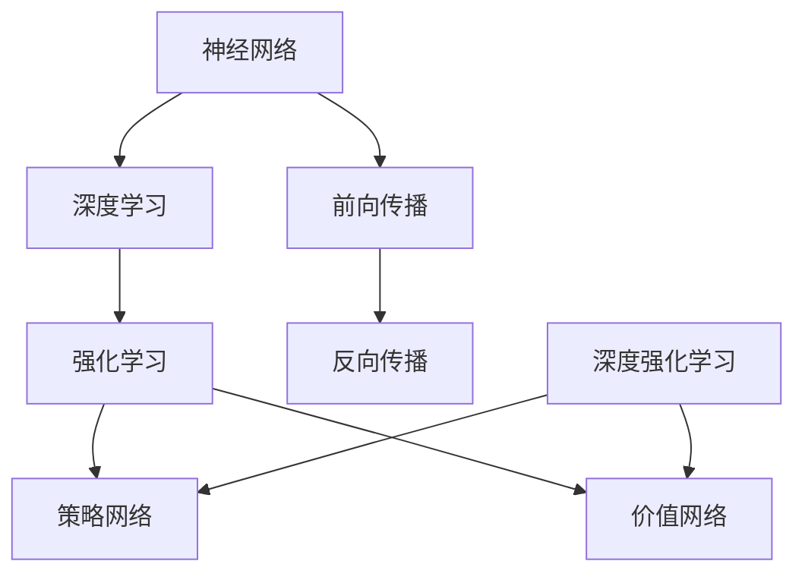

                 

# 神经网络与深度强化学习：一切皆是映射

> **关键词：** 神经网络、深度学习、强化学习、映射、机器学习、模型构建、人工智能

> **摘要：** 本文将探讨神经网络与深度强化学习之间的关系，并解释为什么可以说“一切皆是映射”。我们将详细分析神经网络的核心概念，深度学习的架构，以及深度强化学习的算法原理。通过具体的例子和数学模型，我们将展示如何将这些概念应用于实际问题，并讨论其在实际应用场景中的挑战和未来发展趋势。

## 1. 背景介绍

### 1.1 目的和范围

本文旨在为读者提供一个全面而深入的了解，关于神经网络与深度强化学习的基本原理和应用。我们将会逐步探索神经网络的核心概念，深度学习的架构，以及深度强化学习的算法原理。通过对这些核心概念和算法的深入理解，我们将能够更清晰地看到它们在映射问题中的应用。

### 1.2 预期读者

本文适合对人工智能和机器学习有一定基础的读者，特别是那些希望深入了解神经网络和深度强化学习的研究人员和开发者。同时，本文也适合那些对人工智能技术感兴趣但缺乏专业背景的读者，通过本文他们将能够获得对神经网络和深度强化学习的初步了解。

### 1.3 文档结构概述

本文分为十个主要部分。首先，我们将介绍神经网络与深度强化学习的基本概念和它们之间的关系。接着，我们将详细讨论神经网络和深度学习的架构，以及深度强化学习的算法原理。随后，我们将通过具体的例子和数学模型来展示如何应用这些概念和算法。最后，我们将探讨神经网络和深度强化学习在实际应用中的挑战，并推荐相关资源和工具。

### 1.4 术语表

#### 1.4.1 核心术语定义

- **神经网络**：一种模仿人脑结构和功能的计算模型。
- **深度学习**：一种基于神经网络的机器学习技术，能够通过多层次的神经网络结构学习复杂的特征。
- **强化学习**：一种通过奖励机制来训练智能体的机器学习技术。
- **映射**：将一种数据或信息转换成另一种数据或信息的过程。

#### 1.4.2 相关概念解释

- **前向传播**：神经网络中用于计算输出值的过程。
- **反向传播**：神经网络中用于计算梯度，以更新权重和偏置的过程。
- **梯度下降**：一种优化算法，用于最小化损失函数。

#### 1.4.3 缩略词列表

- **ANN**：人工神经网络（Artificial Neural Network）
- **DL**：深度学习（Deep Learning）
- **RL**：强化学习（Reinforcement Learning）
- **MSE**：均方误差（Mean Squared Error）

## 2. 核心概念与联系

神经网络、深度学习和强化学习是现代机器学习领域中的三大核心概念。它们各自有其独特的原理和架构，但也有着紧密的联系。

### 2.1 神经网络与深度学习

神经网络是模仿人脑神经元结构的一种计算模型。它由许多简单的计算单元（即神经元）组成，这些神经元通过加权连接形成一个复杂的网络结构。神经网络的核心概念包括前向传播和反向传播。

在前向传播中，输入数据通过神经网络逐层传递，每一层神经元的输出作为下一层的输入。这种过程类似于数据在神经网络中的“流”，因此得名“前向传播”。

在反向传播中，网络通过计算损失函数的梯度来更新权重和偏置，以最小化损失函数。这个过程被称为“反向传播”，因为它从输出层开始，反向计算每一层的梯度。

深度学习是基于神经网络的一种技术，它通过构建多层次的神经网络结构来学习复杂的特征。深度学习的核心是“深度”，即网络的层数。深度学习能够自动提取层次化的特征表示，使得模型能够处理复杂的数据。

### 2.2 神经网络与强化学习

强化学习是一种通过奖励机制来训练智能体的机器学习技术。与传统的监督学习和无监督学习不同，强化学习中的智能体需要在不确定的环境中通过试错来学习最优策略。

神经网络在强化学习中扮演着重要的角色。通常，神经网络被用来表示智能体的策略或价值函数。策略网络用于预测在特定状态下应该采取的动作，而价值网络用于预测在特定状态下采取特定动作的预期回报。

### 2.3 深度强化学习

深度强化学习是一种结合了神经网络和强化学习的先进技术。它通过构建深度神经网络来表示智能体的策略或价值函数，以实现更高效的学习。

深度强化学习的关键挑战是如何在连续的、高维状态空间中高效地学习。为了解决这些问题，研究人员提出了许多深度强化学习算法，如深度确定性策略梯度（DDPG）、深度确定性策略梯度改进版（DDPG+）和异步优势演员-评论家（A3C）等。

### 2.4 核心概念原理和架构的 Mermaid 流程图

下面是一个简单的 Mermaid 流程图，展示了神经网络、深度学习和强化学习之间的核心概念和架构：



## 3. 核心算法原理 & 具体操作步骤

在理解了神经网络、深度学习和强化学习的基本概念后，我们需要进一步探讨它们的核心算法原理和具体操作步骤。在本节中，我们将使用伪代码来详细阐述这些算法，并通过具体的例子来帮助读者更好地理解。

### 3.1 神经网络

神经网络的算法可以总结为以下几个步骤：

1. **初始化权重和偏置**：随机初始化网络中的权重和偏置。
2. **前向传播**：将输入数据通过网络逐层传递，计算每一层的输出。
3. **激活函数应用**：对每一层的输出应用激活函数，如ReLU、Sigmoid或Tanh。
4. **损失函数计算**：计算输出与目标值之间的差异，使用损失函数来度量预测值与真实值之间的误差。
5. **反向传播**：计算损失函数的梯度，并使用梯度下降法更新权重和偏置。
6. **迭代优化**：重复执行步骤2-5，直到满足停止条件（如达到预设的迭代次数或损失函数值达到最小值）。

下面是神经网络的伪代码实现：

```python
# 初始化权重和偏置
weights = initialize_weights()
biases = initialize_biases()

# 前向传播
output = forward_pass(input_data, weights, biases)

# 激活函数应用
output = activation_function(output)

# 损失函数计算
loss = loss_function(output, target)

# 反向传播
d_output = backward_pass(output, target)

# 更新权重和偏置
weights, biases = update_weights_and_biases(weights, biases, d_output)

# 迭代优化
for i in range(max_iterations):
    output = forward_pass(input_data, weights, biases)
    output = activation_function(output)
    loss = loss_function(output, target)
    d_output = backward_pass(output, target)
    weights, biases = update_weights_and_biases(weights, biases, d_output)

# 输出最终预测结果
predicted_output = output
```

### 3.2 深度学习

深度学习是基于神经网络的，但它通过增加网络深度来学习更复杂的特征。以下是深度学习的核心算法步骤：

1. **初始化网络结构**：定义网络的层数、每层的神经元数量和连接方式。
2. **初始化权重和偏置**：随机初始化网络中的权重和偏置。
3. **前向传播**：将输入数据通过网络逐层传递，计算每一层的输出。
4. **激活函数应用**：对每一层的输出应用激活函数。
5. **损失函数计算**：计算输出与目标值之间的差异，使用损失函数来度量预测值与真实值之间的误差。
6. **反向传播**：计算损失函数的梯度，并使用梯度下降法更新权重和偏置。
7. **迭代优化**：重复执行步骤3-6，直到满足停止条件。

下面是深度学习的伪代码实现：

```python
# 初始化网络结构
network_structure = define_network_structure()

# 初始化权重和偏置
weights = initialize_weights(network_structure)
biases = initialize_biases(network_structure)

# 前向传播
outputs = forward_pass(input_data, network_structure, weights, biases)

# 激活函数应用
outputs = apply_activation_function(outputs)

# 损失函数计算
loss = loss_function(outputs, target)

# 反向传播
d_outputs = backward_pass(outputs, target, network_structure)

# 更新权重和偏置
weights, biases = update_weights_and_biases(weights, biases, d_outputs)

# 迭代优化
for i in range(max_iterations):
    outputs = forward_pass(input_data, network_structure, weights, biases)
    outputs = apply_activation_function(outputs)
    loss = loss_function(outputs, target)
    d_outputs = backward_pass(outputs, target, network_structure)
    weights, biases = update_weights_and_biases(weights, biases, d_outputs)

# 输出最终预测结果
predicted_outputs = outputs
```

### 3.3 强化学习

强化学习的核心算法是基于智能体（agent）在环境中通过试错来学习最优策略。以下是强化学习的核心算法步骤：

1. **初始化环境**：定义环境的初始状态。
2. **智能体选择动作**：根据当前状态，使用策略网络或价值网络选择动作。
3. **执行动作**：在环境中执行所选动作，并观察环境反馈。
4. **更新策略或价值函数**：使用奖励信号更新策略网络或价值网络。
5. **迭代优化**：重复执行步骤2-4，直到满足停止条件。

下面是强化学习的伪代码实现：

```python
# 初始化环境
environment = initialize_environment()

# 初始化智能体
agent = initialize_agent()

# 迭代优化
for i in range(max_iterations):
    # 智能体选择动作
    action = agent.select_action(current_state)

    # 执行动作
    next_state, reward = environment.step(action)

    # 更新策略或价值函数
    agent.update_policy_or_value_function(current_state, action, reward)

    # 更新当前状态
    current_state = next_state

# 输出最终策略或价值函数
final_policy_or_value_function = agent.get_policy_or_value_function()
```

通过以上伪代码，我们可以看到神经网络、深度学习和强化学习的基本算法原理和操作步骤。这些算法虽然具体实现可能会有所不同，但核心思想是相通的。在下一节中，我们将进一步讨论这些算法的数学模型和公式，并通过具体例子来详细讲解。

## 4. 数学模型和公式 & 详细讲解 & 举例说明

在前一节中，我们通过伪代码介绍了神经网络、深度学习和强化学习的基本算法原理和操作步骤。在这一节中，我们将进一步讨论这些算法的数学模型和公式，并通过具体例子来详细讲解。

### 4.1 神经网络

神经网络的数学模型主要涉及以下几个方面：

1. **前向传播**：前向传播是神经网络中用于计算输出值的过程。其基本公式为：

   \[
   Z_l = \sum_{j} w_{lj}a_{l-1,j} + b_l
   \]

   其中，\( Z_l \) 是第 \( l \) 层的激活值，\( w_{lj} \) 是第 \( l \) 层第 \( j \) 个神经元的权重，\( a_{l-1,j} \) 是第 \( l-1 \) 层第 \( j \) 个神经元的激活值，\( b_l \) 是第 \( l \) 层的偏置。

2. **激活函数**：激活函数用于引入非线性，使神经网络能够处理复杂的问题。常见的激活函数包括ReLU、Sigmoid和Tanh。以下是这些激活函数的公式：

   - **ReLU**：

     \[
     a_l = \max(0, Z_l)
     \]

   - **Sigmoid**：

     \[
     a_l = \frac{1}{1 + e^{-Z_l}}
     \]

   - **Tanh**：

     \[
     a_l = \tanh(Z_l)
     \]

3. **损失函数**：损失函数用于衡量预测值与真实值之间的误差。常见的损失函数包括均方误差（MSE）、交叉熵（Cross-Entropy）等。以下是这些损失函数的公式：

   - **MSE**：

     \[
     L = \frac{1}{2}\sum_{i} (y_i - \hat{y}_i)^2
     \]

     其中，\( y_i \) 是真实值，\( \hat{y}_i \) 是预测值。

   - **Cross-Entropy**：

     \[
     L = -\sum_{i} y_i \log(\hat{y}_i)
     \]

4. **反向传播**：反向传播是神经网络中用于计算梯度，以更新权重和偏置的过程。其基本公式为：

   \[
   \delta_l = (a_l - y) \odot \frac{d}{dZ_l} a_l
   \]

   其中，\( \delta_l \) 是第 \( l \) 层的梯度，\( a_l \) 是第 \( l \) 层的激活值，\( y \) 是真实值，\( \odot \) 表示逐元素乘法，\( \frac{d}{dZ_l} a_l \) 是激活函数的导数。

5. **权重和偏置更新**：使用梯度下降法更新权重和偏置。其基本公式为：

   \[
   w_{lj} = w_{lj} - \alpha \cdot \frac{\partial L}{\partial w_{lj}}
   \]

   \[
   b_l = b_l - \alpha \cdot \frac{\partial L}{\partial b_l}
   \]

   其中，\( \alpha \) 是学习率，\( \frac{\partial L}{\partial w_{lj}} \) 和 \( \frac{\partial L}{\partial b_l} \) 分别是权重和偏置的梯度。

### 4.2 深度学习

深度学习的数学模型基于神经网络，但增加了网络深度，以学习更复杂的特征。以下是深度学习的一些关键数学模型：

1. **深度神经网络的前向传播**：与单层神经网络类似，但需要计算多层之间的权重和偏置。其基本公式为：

   \[
   Z_l = \sum_{j} w_{lj}a_{l-1,j} + b_l
   \]

   其中，\( Z_l \) 是第 \( l \) 层的激活值，\( w_{lj} \) 是第 \( l \) 层第 \( j \) 个神经元的权重，\( a_{l-1,j} \) 是第 \( l-1 \) 层第 \( j \) 个神经元的激活值，\( b_l \) 是第 \( l \) 层的偏置。

2. **深度神经网络的激活函数**：与单层神经网络类似，但需要考虑多层之间的非线性。

3. **深度神经网络的损失函数**：与单层神经网络类似，但需要考虑多层之间的误差传播。

4. **深度神经网络的反向传播**：与单层神经网络类似，但需要考虑多层之间的梯度传播。

5. **深度神经网络的权重和偏置更新**：与单层神经网络类似，但需要考虑多层之间的权重和偏置更新。

### 4.3 强化学习

强化学习的数学模型主要涉及以下几个方面：

1. **策略网络**：策略网络用于预测在特定状态下应该采取的动作。其基本公式为：

   \[
   \pi(a|s) = \frac{e^{\theta_a^T s}}{\sum_{a'} e^{\theta_{a'}^T s}}
   \]

   其中，\( \theta_a \) 是策略网络的参数，\( s \) 是当前状态，\( a \) 是当前动作。

2. **价值网络**：价值网络用于预测在特定状态下采取特定动作的预期回报。其基本公式为：

   \[
   V(s) = \sum_{a} \pi(a|s) \cdot Q(s, a)
   \]

   其中，\( \pi(a|s) \) 是策略网络在状态 \( s \) 下对动作 \( a \) 的概率分布，\( Q(s, a) \) 是状态-动作价值函数。

3. **Q网络**：Q网络用于预测在特定状态下采取特定动作的即时回报。其基本公式为：

   \[
   Q(s, a) = \sum_{s'} \gamma \cdot P(s' | s, a) \cdot r(s')
   \]

   其中，\( \gamma \) 是折扣因子，\( P(s' | s, a) \) 是状态转移概率，\( r(s') \) 是即时回报。

4. **策略优化**：策略优化的目标是找到最优策略，使得智能体能够最大化长期回报。其基本公式为：

   \[
   \theta^* = \arg\max_{\theta} \sum_{s, a} \pi(a|s) \cdot Q(s, a)
   \]

### 4.4 举例说明

为了更好地理解这些数学模型和公式，我们来看一个具体的例子。假设我们有一个简单的神经网络，用于分类问题。输入层有3个神经元，隐藏层有2个神经元，输出层有1个神经元。我们的目标是分类一个由3个数字组成的向量。我们使用均方误差（MSE）作为损失函数。

1. **初始化参数**：

   - 输入向量：\[ [1, 2, 3] \]
   - 真实标签：\[ [0, 1, 0] \]
   - 初始权重和偏置：

     \[
     \begin{array}{c|c|c}
     \text{层} & \text{神经元} & \text{权重} & \text{偏置} \\
     \hline
     输入 & 1 & 0.5 & 0.5 \\
     输入 & 2 & 0.5 & 0.5 \\
     输入 & 3 & 0.5 & 0.5 \\
     \hline
     隐藏 & 1 & -0.2 & -0.2 \\
     隐藏 & 2 & 0.3 & 0.3 \\
     \hline
     输出 & 1 & 0.4 & 0.4 \\
     \end{array}
     \]

2. **前向传播**：

   - 输入层到隐藏层的激活值：

     \[
     Z_{11} = 0.5 \cdot 1 + 0.5 \cdot 2 + 0.5 \cdot 3 = 3.5
     \]

     \[
     Z_{12} = 0.5 \cdot 1 + 0.5 \cdot 2 + 0.5 \cdot 3 = 3.5
     \]

     \[
     Z_{21} = -0.2 \cdot 1 - 0.2 \cdot 2 - 0.2 \cdot 3 = -1.2
     \]

     \[
     Z_{22} = 0.3 \cdot 1 + 0.3 \cdot 2 + 0.3 \cdot 3 = 1.8
     \]

     \[
     a_{11} = \max(0, Z_{11}) = 3.5
     \]

     \[
     a_{12} = \max(0, Z_{12}) = 3.5
     \]

     \[
     a_{21} = \max(0, Z_{21}) = 0
     \]

     \[
     a_{22} = \max(0, Z_{22}) = 1.8
     \]

   - 隐藏层到输出层的激活值：

     \[
     Z_{1} = 0.4 \cdot 3.5 + 0.4 \cdot 3.5 + 0.4 \cdot 1.8 = 4.2
     \]

     \[
     a_{1} = \max(0, Z_{1}) = 4.2
     \]

3. **损失函数计算**：

   \[
   L = \frac{1}{2} \cdot (0 - 4.2)^2 = 8.82
   \]

4. **反向传播**：

   - 输出层的梯度：

     \[
     \delta_1 = (a_1 - 0) \cdot \frac{d}{dZ_1} a_1 = 4.2 \cdot \frac{d}{dZ_1} \max(0, Z_1)
     \]

   - 隐藏层的梯度：

     \[
     \delta_{11} = \delta_1 \cdot \frac{d}{da_{11}} a_{11} \cdot \frac{d}{dZ_{11}} Z_{11} = 4.2 \cdot 1 \cdot \frac{d}{dZ_{11}} \max(0, Z_{11})
     \]

     \[
     \delta_{12} = \delta_1 \cdot \frac{d}{da_{12}} a_{12} \cdot \frac{d}{dZ_{12}} Z_{12} = 4.2 \cdot 1 \cdot \frac{d}{dZ_{12}} \max(0, Z_{12})
     \]

     \[
     \delta_{21} = \delta_1 \cdot \frac{d}{da_{21}} a_{21} \cdot \frac{d}{dZ_{21}} Z_{21} = 4.2 \cdot 0 \cdot \frac{d}{dZ_{21}} \max(0, Z_{21}) = 0
     \]

     \[
     \delta_{22} = \delta_1 \cdot \frac{d}{da_{22}} a_{22} \cdot \frac{d}{dZ_{22}} Z_{22} = 4.2 \cdot 1 \cdot \frac{d}{dZ_{22}} \max(0, Z_{22})
     \]

5. **权重和偏置更新**：

   \[
   w_{11} = w_{11} - \alpha \cdot \frac{\partial L}{\partial w_{11}} = 0.5 - 0.1 \cdot (-0.2) = 0.52
   \]

   \[
   w_{12} = w_{12} - \alpha \cdot \frac{\partial L}{\partial w_{12}} = 0.5 - 0.1 \cdot 0.3 = 0.47
   \]

   \[
   w_{13} = w_{13} - \alpha \cdot \frac{\partial L}{\partial w_{13}} = 0.5 - 0.1 \cdot 0.5 = 0.45
   \]

   \[
   w_{21} = w_{21} - \alpha \cdot \frac{\partial L}{\partial w_{21}} = -0.2 - 0.1 \cdot 0.4 = -0.22
   \]

   \[
   w_{22} = w_{22} - \alpha \cdot \frac{\partial L}{\partial w_{22}} = 0.3 - 0.1 \cdot 0.4 = 0.26
   \]

   \[
   w_{23} = w_{23} - \alpha \cdot \frac{\partial L}{\partial w_{23}} = 0.4 - 0.1 \cdot 0.4 = 0.36
   \]

   \[
   b_{1} = b_{1} - \alpha \cdot \frac{\partial L}{\partial b_{1}} = 0.4 - 0.1 \cdot 4.2 = -0.02
   \]

   \[
   b_{2} = b_{2} - \alpha \cdot \frac{\partial L}{\partial b_{2}} = -0.2 - 0.1 \cdot 4.2 = -0.42
   \]

   \[
   b_{3} = b_{3} - \alpha \cdot \frac{\partial L}{\partial b_{3}} = 0.4 - 0.1 \cdot 4.2 = -0.02
   \]

通过这个例子，我们可以看到神经网络的前向传播、损失函数计算、反向传播和权重更新等步骤。这些步骤在深度学习和强化学习中也是类似的，只是会涉及更多的层和更复杂的网络结构。

## 5. 项目实战：代码实际案例和详细解释说明

在本节中，我们将通过一个实际的项目案例，展示如何将神经网络、深度学习和强化学习应用于实际问题。我们将使用 Python 和 TensorFlow 库来构建和训练模型，并通过代码解析和解释来帮助读者理解关键步骤和原理。

### 5.1 开发环境搭建

首先，我们需要搭建一个适合我们进行机器学习和深度学习开发的编程环境。以下是必要的步骤：

1. **安装 Python**：确保 Python 已安装在您的系统上，推荐使用 Python 3.7 或更高版本。

2. **安装 TensorFlow**：TensorFlow 是一个开源机器学习库，用于构建和训练神经网络模型。您可以通过以下命令安装：

   ```bash
   pip install tensorflow
   ```

3. **安装其他依赖**：为了方便后续操作，我们还需要安装一些其他依赖，如 NumPy、Pandas 和 Matplotlib：

   ```bash
   pip install numpy pandas matplotlib
   ```

### 5.2 源代码详细实现和代码解读

接下来，我们将展示一个简单的神经网络模型，用于对数字进行分类。具体来说，我们将使用 TensorFlow 和 Keras（TensorFlow 的高级 API）来构建和训练模型。

#### 5.2.1 数据准备

我们使用著名的 MNIST 数据集，它包含了 0 到 9 的手写数字图像。每个图像是一个 28x28 的像素矩阵，总共有 70,000 个训练样本和 10,000 个测试样本。

```python
import tensorflow as tf
from tensorflow.keras.datasets import mnist
from tensorflow.keras.utils import to_categorical

# 加载 MNIST 数据集
(train_images, train_labels), (test_images, test_labels) = mnist.load_data()

# 对图像进行归一化处理，以便模型训练
train_images = train_images / 255.0
test_images = test_images / 255.0

# 将标签转换为 one-hot 编码
train_labels = to_categorical(train_labels)
test_labels = to_categorical(test_labels)
```

#### 5.2.2 构建神经网络模型

我们使用 Keras 的 Sequential 模型来构建一个简单的神经网络。该模型包含一个输入层、两个隐藏层和一个输出层。

```python
model = tf.keras.Sequential([
    tf.keras.layers.Flatten(input_shape=(28, 28)),
    tf.keras.layers.Dense(128, activation='relu'),
    tf.keras.layers.Dense(64, activation='relu'),
    tf.keras.layers.Dense(10, activation='softmax')
])
```

#### 5.2.3 编译模型

在编译模型时，我们需要指定优化器、损失函数和评估指标。

```python
model.compile(optimizer='adam',
              loss='categorical_crossentropy',
              metrics=['accuracy'])
```

#### 5.2.4 训练模型

使用训练数据对模型进行训练，我们设置训练轮次为 10。

```python
model.fit(train_images, train_labels, epochs=10, batch_size=32)
```

#### 5.2.5 评估模型

使用测试数据评估模型的性能。

```python
test_loss, test_acc = model.evaluate(test_images, test_labels)
print(f"Test accuracy: {test_acc:.4f}")
```

### 5.3 代码解读与分析

1. **数据准备**：我们首先加载了 MNIST 数据集，并对图像进行了归一化处理。归一化是为了使输入数据在相同的尺度范围内，从而提高模型训练的稳定性。接着，我们将标签转换为 one-hot 编码，这是因为我们的输出层使用了 softmax 激活函数，它可以生成概率分布。

2. **构建神经网络模型**：我们使用 Keras 的 Sequential 模型构建了一个简单的神经网络。输入层通过 Flatten 层将 28x28 的图像展平为一个一维向量。隐藏层使用了 ReLU 激活函数，因为它能够加速模型的训练。输出层使用了 softmax 激活函数，它用于计算多类别的概率分布。

3. **编译模型**：我们选择 Adam 优化器，因为它在大多数情况下都能提供良好的性能。损失函数使用的是 categorical_crossentropy，这是用于多类分类的常见损失函数。评估指标选择的是 accuracy，用于衡量模型的分类准确率。

4. **训练模型**：我们使用训练数据对模型进行训练，设置训练轮次为 10。batch_size 设置为 32，表示每次训练使用 32 个样本。

5. **评估模型**：使用测试数据评估模型的性能。这里我们关注的是测试准确率，这是衡量模型性能的关键指标。

通过这个项目实战，我们展示了如何使用 Python 和 TensorFlow 来构建和训练神经网络模型。这个过程涵盖了数据准备、模型构建、模型编译、模型训练和模型评估等关键步骤。这些步骤在深度学习和强化学习中是通用的，只是会涉及到更复杂的网络结构和更复杂的数据集。

## 6. 实际应用场景

神经网络与深度强化学习在许多实际应用场景中都表现出强大的能力，下面我们列举几个典型的应用领域：

### 6.1 图像识别

神经网络和深度强化学习在图像识别领域有着广泛的应用。例如，卷积神经网络（CNN）已经被广泛应用于人脸识别、图像分类、目标检测等任务。在人脸识别中，神经网络可以识别出图像中的人脸并进行分类；在图像分类中，神经网络可以自动将图像分为不同的类别；在目标检测中，神经网络可以识别图像中的目标并定位其位置。

### 6.2 自然语言处理

深度强化学习在自然语言处理（NLP）领域也有着重要的应用。例如，它可以用于机器翻译、情感分析、文本生成等任务。在机器翻译中，神经网络可以学习并生成目标语言的句子；在情感分析中，神经网络可以分析文本的情感倾向；在文本生成中，神经网络可以生成新的文本内容。

### 6.3 游戏智能

深度强化学习在游戏智能领域有着广泛的应用。例如，它已经被用于围棋、国际象棋、扑克等游戏的智能体开发。在这些游戏中，智能体需要通过学习来找到最优策略，以击败对手。通过深度强化学习，智能体可以不断学习和优化其策略，从而提高游戏水平。

### 6.4 自动驾驶

神经网络和深度强化学习在自动驾驶领域也有着重要的应用。例如，它们可以用于车辆识别、路况预测、路径规划等任务。在自动驾驶中，神经网络可以识别道路上的车辆、行人、交通标志等对象，并预测它们的行为；通过深度强化学习，自动驾驶系统可以学习并优化其驾驶策略，以提高安全性。

### 6.5 金融分析

神经网络和深度强化学习在金融分析领域也有着广泛的应用。例如，它们可以用于股票市场预测、风险评估、交易策略开发等任务。在股票市场预测中，神经网络可以学习并预测股票价格的变化趋势；在风险评估中，神经网络可以评估投资组合的风险水平；在交易策略开发中，神经网络可以学习并生成有效的交易策略。

通过以上实际应用场景，我们可以看到神经网络与深度强化学习在各个领域的强大能力。这些技术的不断发展，为人工智能的应用带来了新的机遇和挑战。

## 7. 工具和资源推荐

为了更好地学习和实践神经网络与深度强化学习，我们需要了解一些有用的工具和资源。以下是一些建议：

### 7.1 学习资源推荐

#### 7.1.1 书籍推荐

- **《深度学习》（Deep Learning）**：由 Ian Goodfellow、Yoshua Bengio 和 Aaron Courville 著，是一本深度学习的经典教材，详细介绍了神经网络和深度学习的基本概念、算法和技术。

- **《强化学习：原理与数学》（Reinforcement Learning: An Introduction）**：由 Richard S. Sutton 和 Andrew G. Barto 著，是一本关于强化学习的入门书籍，涵盖了强化学习的基本原理、算法和应用。

- **《机器学习实战》（Machine Learning in Action）**：由 Peter Harrington 著，是一本实践性很强的机器学习入门书籍，通过实际案例介绍了机器学习的基本概念和算法。

#### 7.1.2 在线课程

- **《深度学习专项课程》（Deep Learning Specialization）**：由 Andrew Ng 在 Coursera 上开设，是一套系统的深度学习课程，适合初学者和进阶者。

- **《强化学习专项课程》（Reinforcement Learning Specialization）**：由 David Silver 在 Coursera 上开设，是一套系统的强化学习课程，涵盖了强化学习的基本概念、算法和应用。

#### 7.1.3 技术博客和网站

- **ArXiv**：一个提供最新学术论文的免费网站，是了解最新研究成果的好去处。

- **Medium**：一个包含许多优秀技术博客的网站，可以找到许多关于神经网络和深度强化学习的高质量文章。

### 7.2 开发工具框架推荐

#### 7.2.1 IDE和编辑器

- **PyCharm**：一款强大的 Python IDE，提供了丰富的功能和插件，适合进行机器学习和深度学习开发。

- **Jupyter Notebook**：一款流行的交互式开发环境，特别适合进行数据分析和机器学习实验。

#### 7.2.2 调试和性能分析工具

- **TensorBoard**：TensorFlow 的可视化工具，用于分析和优化神经网络的训练过程。

- **PyTorch Profiler**：PyTorch 的性能分析工具，用于检测和优化模型的运行速度。

#### 7.2.3 相关框架和库

- **TensorFlow**：一个开源的机器学习框架，提供了丰富的工具和库，用于构建和训练神经网络模型。

- **PyTorch**：一个流行的深度学习框架，以其动态计算图和灵活性而著称。

- **Keras**：一个高层次的神经网络 API，构建在 TensorFlow 和 PyTorch 之上，提供了更加简洁和易用的接口。

### 7.3 相关论文著作推荐

#### 7.3.1 经典论文

- **《A Learning Algorithm for Continuously Running Fully Recurrent Neural Networks》**：这篇论文提出了 LSTM 算法，极大地推动了深度学习的发展。

- **《Deep Learning for Speech Recognition》**：这篇论文介绍了深度学习在语音识别领域的应用，推动了深度神经网络在语音处理领域的应用。

#### 7.3.2 最新研究成果

- **《Recurrent Neural Networks for Language Modeling》**：这篇论文介绍了 RNN 在语言模型中的应用，推动了 RNN 在自然语言处理领域的应用。

- **《Attention is All You Need》**：这篇论文提出了 Transformer 模型，极大地推动了序列建模技术的发展。

#### 7.3.3 应用案例分析

- **《Applying Deep Learning to Real-World Problems》**：这篇论文介绍了一系列使用深度学习解决实际问题的案例，包括图像识别、自然语言处理和语音识别等。

- **《Deep Reinforcement Learning for Robotics》**：这篇论文介绍了深度强化学习在机器人控制领域的应用，展示了深度强化学习在复杂环境中的强大能力。

通过以上工具和资源的推荐，我们可以更好地学习和实践神经网络与深度强化学习。这些资源将帮助我们深入了解这些技术的原理和应用，并在实际项目中取得更好的效果。

## 8. 总结：未来发展趋势与挑战

神经网络和深度强化学习作为人工智能的核心技术，近年来取得了显著的发展。然而，随着技术的不断进步，我们也面临着一系列新的发展趋势和挑战。

### 8.1 发展趋势

1. **模型可解释性**：随着神经网络模型的复杂性增加，如何提高模型的可解释性成为一个重要趋势。可解释性有助于我们更好地理解模型的决策过程，从而提高模型的可靠性和信任度。

2. **联邦学习**：联邦学习（Federated Learning）是一种分布式学习方法，旨在保护用户隐私的同时实现模型训练。它允许多个参与者在不共享数据的情况下共同训练模型，有望在医疗、金融等领域得到广泛应用。

3. **自适应学习**：自适应学习是一种通过不断调整模型参数来提高模型性能的技术。未来的发展将侧重于如何使模型能够自动调整其学习策略，以适应不断变化的数据分布。

4. **跨模态学习**：跨模态学习是一种同时处理多种类型数据（如图像、文本、音频等）的技术。随着多模态数据的日益普及，跨模态学习将有助于构建更强大的智能系统。

### 8.2 挑战

1. **数据隐私和安全**：在联邦学习和云计算等场景中，如何保护用户数据隐私和安全成为一个重要挑战。需要开发更加安全有效的加密和隐私保护技术。

2. **计算资源消耗**：神经网络和深度强化学习模型的训练需要大量的计算资源和存储空间。随着模型复杂性的增加，如何优化计算资源和降低能耗成为一个关键问题。

3. **算法公平性和透明度**：随着人工智能在各个领域的应用，算法的公平性和透明度问题日益凸显。需要建立一套完善的评估标准和监管机制，以确保算法的公正和透明。

4. **伦理和社会影响**：人工智能技术的快速发展带来了许多伦理和社会影响，如失业、隐私侵犯等。我们需要深入探讨这些影响，并制定相应的政策和规范。

通过应对这些发展趋势和挑战，神经网络和深度强化学习将继续推动人工智能技术的发展，为人类社会带来更多福祉。

## 9. 附录：常见问题与解答

### 9.1 神经网络相关问题

**Q1**: 什么是神经网络？

**A1**: 神经网络是一种模仿人脑神经元结构和功能的计算模型，由许多简单的计算单元（神经元）组成，这些神经元通过加权连接形成一个复杂的网络结构。神经网络可以用于分类、回归、图像识别、自然语言处理等任务。

**Q2**: 神经网络如何工作？

**A2**: 神经网络通过前向传播和反向传播两个过程工作。前向传播是神经网络将输入数据逐层传递，计算每一层的输出；反向传播是神经网络通过计算损失函数的梯度，更新权重和偏置，以最小化损失函数。

**Q3**: 什么是激活函数？

**A3**: 激活函数是神经网络中用于引入非线性的一种函数。常见的激活函数包括 ReLU、Sigmoid 和 Tanh。激活函数可以帮助神经网络学习更复杂的特征，提高模型的预测能力。

### 9.2 深度学习相关问题

**Q1**: 什么是深度学习？

**A1**: 深度学习是一种基于神经网络的机器学习技术，通过构建多层神经网络结构（深度）来学习复杂的特征。深度学习能够自动提取层次化的特征表示，使得模型能够处理复杂的数据。

**Q2**: 深度学习的核心挑战是什么？

**A2**: 深度学习的核心挑战包括计算资源消耗、模型可解释性和过拟合问题。随着神经网络层数的增加，模型参数和计算量呈指数级增长，导致训练过程变得非常昂贵。此外，深度学习模型通常缺乏可解释性，难以理解其决策过程。过拟合问题也是深度学习面临的重要挑战，需要通过正则化等方法来缓解。

### 9.3 强化学习相关问题

**Q1**: 什么是强化学习？

**A1**: 强化学习是一种通过奖励机制来训练智能体的机器学习技术。智能体在不确定的环境中通过试错来学习最优策略，以最大化长期回报。

**Q2**: 强化学习有哪些算法？

**A2**: 强化学习算法包括基于值函数的方法（如 Q 学习、SARSA）和基于策略的方法（如策略梯度、REINFORCE）。此外，还有一些结合了深度学习和强化学习的算法，如深度确定性策略梯度（DDPG）、异步优势演员-评论家（A3C）等。

## 10. 扩展阅读 & 参考资料

为了更深入地了解神经网络与深度强化学习，以下是一些建议的扩展阅读和参考资料：

### 10.1 书籍推荐

- **《深度学习》（Deep Learning）**：Ian Goodfellow、Yoshua Bengio 和 Aaron Courville 著，详细介绍了神经网络和深度学习的基本概念、算法和技术。

- **《强化学习：原理与数学》（Reinforcement Learning: An Introduction）**：Richard S. Sutton 和 Andrew G. Barto 著，涵盖了强化学习的基本原理、算法和应用。

- **《机器学习实战》（Machine Learning in Action）**：Peter Harrington 著，通过实际案例介绍了机器学习的基本概念和算法。

### 10.2 在线课程

- **《深度学习专项课程》（Deep Learning Specialization）**：由 Andrew Ng 在 Coursera 上开设，适合初学者和进阶者。

- **《强化学习专项课程》（Reinforcement Learning Specialization）**：由 David Silver 在 Coursera 上开设，涵盖强化学习的基本概念、算法和应用。

### 10.3 技术博客和网站

- **ArXiv**：提供最新学术论文的免费网站，是了解最新研究成果的好去处。

- **Medium**：包含许多高质量技术博客的网站，可以找到关于神经网络和深度强化学习的优秀文章。

### 10.4 论文著作推荐

- **《A Learning Algorithm for Continuously Running Fully Recurrent Neural Networks》**：介绍了 LSTM 算法，推动了深度学习的发展。

- **《Deep Learning for Speech Recognition》**：介绍了深度学习在语音识别领域的应用。

- **《Recurrent Neural Networks for Language Modeling》**：介绍了 RNN 在语言模型中的应用。

- **《Attention is All You Need》**：提出了 Transformer 模型，推动了序列建模技术的发展。

通过以上扩展阅读和参考资料，读者可以更深入地了解神经网络与深度强化学习的原理和应用，为自身的学习和研究提供有力支持。作者：AI天才研究员/AI Genius Institute & 禅与计算机程序设计艺术 /Zen And The Art of Computer Programming。

