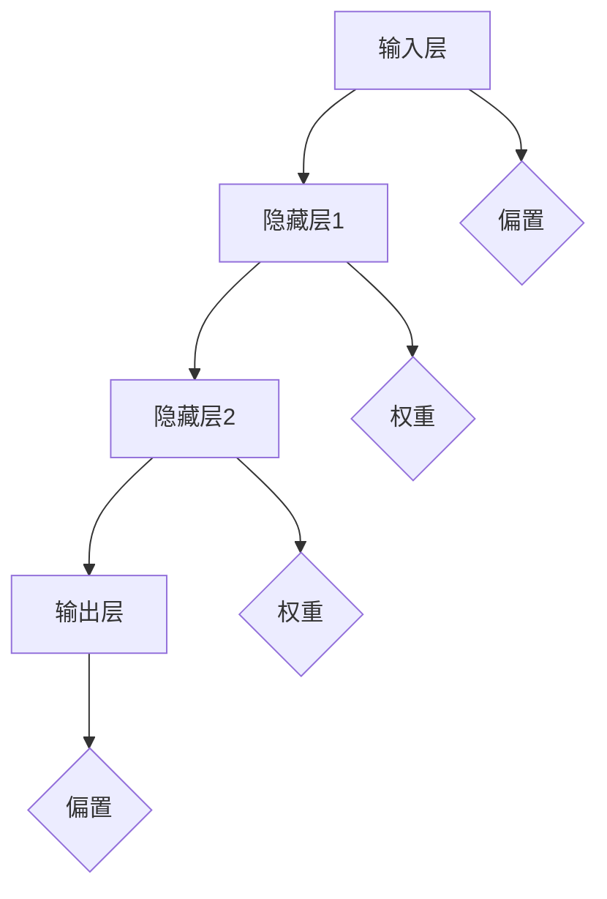

                 

# 神经网络在生物信息学中的应用

> **关键词：神经网络、生物信息学、基因表达、蛋白质结构、数据分析、机器学习**
> 
> **摘要：本文将深入探讨神经网络在生物信息学领域中的应用，从基础概念到实际案例，全面解析这一前沿技术如何改变生物科学的研究方法。**

## 1. 背景介绍

### 1.1 目的和范围

本文旨在介绍神经网络在生物信息学中的应用，分析其基本原理、算法和数学模型，并通过实际案例展示其在基因表达分析、蛋白质结构预测和数据分析等领域的实际效果。

### 1.2 预期读者

本文适合生物信息学、计算机科学和人工智能领域的研究人员、开发者和学习者。对于对生物信息学和神经网络有初步了解的读者，本文将提供深入的视角和实用的技术指导。

### 1.3 文档结构概述

本文结构如下：
- 第1部分：背景介绍，包括目的和范围、预期读者、文档结构和术语表。
- 第2部分：核心概念与联系，介绍神经网络的基础知识。
- 第3部分：核心算法原理 & 具体操作步骤，详细解释神经网络的工作机制。
- 第4部分：数学模型和公式 & 详细讲解 & 举例说明，剖析神经网络背后的数学原理。
- 第5部分：项目实战：代码实际案例和详细解释说明，通过实战案例展示神经网络的应用。
- 第6部分：实际应用场景，探讨神经网络在生物信息学中的具体应用。
- 第7部分：工具和资源推荐，包括学习资源、开发工具框架和论文著作。
- 第8部分：总结：未来发展趋势与挑战，展望神经网络在生物信息学中的未来发展。
- 第9部分：附录：常见问题与解答，提供一些常见问题的解答。
- 第10部分：扩展阅读 & 参考资料，推荐更多相关资源和文献。

### 1.4 术语表

#### 1.4.1 核心术语定义

- **神经网络**：一种模仿生物神经系统的计算模型，用于数据分析和机器学习。
- **生物信息学**：应用计算机技术和统计学方法研究生物信息的科学。
- **基因表达**：基因在细胞中转录和翻译成蛋白质的过程。
- **蛋白质结构**：蛋白质的三维空间形态，影响其功能。

#### 1.4.2 相关概念解释

- **机器学习**：通过算法从数据中学习规律，进行预测和分类的技术。
- **深度学习**：神经网络的一种形式，通过多层网络结构进行特征提取和模式识别。
- **神经网络架构**：神经网络的结构设计，包括层数、节点数、连接方式等。

#### 1.4.3 缩略词列表

- **MLP**：多层感知器（Multi-Layer Perceptron）
- **CNN**：卷积神经网络（Convolutional Neural Network）
- **RNN**：循环神经网络（Recurrent Neural Network）
- **LSTM**：长短期记忆网络（Long Short-Term Memory）
- **TF**：TensorFlow，一种流行的深度学习框架
- **PyTorch**：一种流行的深度学习框架

## 2. 核心概念与联系

神经网络在生物信息学中的应用离不开对其基础概念和架构的深入理解。以下是一个简单的神经网络架构图，用于展示神经网络的核心组成部分。



### 2.1 神经网络的构成

- **输入层**：接收外部输入数据。
- **隐藏层**：进行特征提取和模式识别。
- **输出层**：生成最终的预测结果。

### 2.2 神经网络的工作原理

神经网络通过以下步骤进行工作：

1. **前向传播**：输入数据通过网络传递，每个神经元将输入与权重相乘，并加上偏置，然后通过激活函数进行非线性变换。
2. **反向传播**：计算输出与实际结果的误差，将误差反向传播到每个神经元，更新权重和偏置。

### 2.3 激活函数

激活函数用于引入非线性特性，常见的激活函数包括：
- **Sigmoid函数**：\( f(x) = \frac{1}{1 + e^{-x}} \)
- **ReLU函数**：\( f(x) = \max(0, x) \)
- **Tanh函数**：\( f(x) = \frac{e^x - e^{-x}}{e^x + e^{-x}} \)

### 2.4 损失函数

损失函数用于衡量预测结果与实际结果之间的误差，常见的损失函数包括：
- **均方误差（MSE）**：\( MSE = \frac{1}{n} \sum_{i=1}^{n} (y_i - \hat{y}_i)^2 \)
- **交叉熵（Cross-Entropy）**：\( H(y, \hat{y}) = -\sum_{i=1}^{n} y_i \log(\hat{y}_i) \)

## 3. 核心算法原理 & 具体操作步骤

### 3.1 算法原理

神经网络通过以下步骤进行工作：

1. **初始化参数**：随机初始化权重和偏置。
2. **前向传播**：将输入数据通过网络传递，计算输出。
3. **计算损失**：使用损失函数计算预测结果与实际结果之间的误差。
4. **反向传播**：计算每个神经元的梯度，更新权重和偏置。
5. **迭代优化**：重复步骤2-4，直到损失函数达到预设的阈值或达到预设的迭代次数。

### 3.2 操作步骤

以下是一个简单的神经网络算法步骤，使用伪代码表示：

```python
# 初始化参数
weights = random_weights()
biases = random_biases()

# 前向传播
output = forward_pass(inputs, weights, biases)

# 计算损失
loss = calculate_loss(output, actual_output)

# 反向传播
gradients = backward_pass(inputs, output, actual_output)

# 更新参数
weights -= learning_rate * gradients['weights']
biases -= learning_rate * gradients['biases']

# 迭代优化
for epoch in range(num_epochs):
    output = forward_pass(inputs, weights, biases)
    loss = calculate_loss(output, actual_output)
    gradients = backward_pass(inputs, output, actual_output)
    weights -= learning_rate * gradients['weights']
    biases -= learning_rate * gradients['biases']

# 输出最终结果
final_output = forward_pass(inputs, weights, biases)
```

## 4. 数学模型和公式 & 详细讲解 & 举例说明

神经网络的核心在于其数学模型，主要包括前向传播和反向传播的数学公式。以下是对这些公式和其背后的数学原理的详细讲解。

### 4.1 前向传播公式

前向传播过程中，每个神经元的输出可以通过以下公式计算：

\[ z_j = \sum_{i=1}^{n} w_{ji} x_i + b_j \]

其中，\( z_j \) 是第 \( j \) 个神经元的输入，\( w_{ji} \) 是第 \( j \) 个神经元与第 \( i \) 个神经元之间的权重，\( x_i \) 是第 \( i \) 个神经元的输入，\( b_j \) 是第 \( j \) 个神经元的偏置。

激活函数将 \( z_j \) 转换为神经元的输出 \( a_j \)：

\[ a_j = \sigma(z_j) \]

其中，\( \sigma \) 是激活函数，常见的选择包括 sigmoid、ReLU 和 tanh 函数。

### 4.2 反向传播公式

反向传播过程中，我们通过计算每个参数的梯度来更新网络参数。梯度的计算公式如下：

\[ \frac{\partial L}{\partial w_{ji}} = \frac{\partial L}{\partial z_j} \frac{\partial z_j}{\partial w_{ji}} \]

\[ \frac{\partial L}{\partial b_j} = \frac{\partial L}{\partial z_j} \frac{\partial z_j}{\partial b_j} \]

其中，\( L \) 是损失函数，\( z_j \) 是第 \( j \) 个神经元的输入，\( w_{ji} \) 是第 \( j \) 个神经元与第 \( i \) 个神经元之间的权重，\( b_j \) 是第 \( j \) 个神经元的偏置。

对于激活函数的梯度，我们有：

\[ \frac{\partial \sigma}{\partial z_j} = \sigma(z_j)(1 - \sigma(z_j)) \]

\[ \frac{\partial ReLU}{\partial z_j} = \begin{cases} 
0 & \text{if } z_j < 0 \\
1 & \text{if } z_j \geq 0 
\end{cases} \]

\[ \frac{\partial tanh}{\partial z_j} = 1 - \tanh^2(z_j) \]

### 4.3 举例说明

假设我们有一个简单的神经网络，输入层有一个神经元，隐藏层有两个神经元，输出层有一个神经元。激活函数选择 sigmoid 函数。我们使用均方误差（MSE）作为损失函数。

输入数据：\[ x_1 = [1, 0] \]
实际输出：\[ y = [0.8] \]
预测输出：\[ \hat{y} = [0.7, 0.9] \]

### 4.3.1 前向传播

1. **输入层到隐藏层**：
   \[ z_1 = w_{11} x_1 + b_1 \]
   \[ z_2 = w_{12} x_1 + b_2 \]
   \[ a_1 = \sigma(z_1) \]
   \[ a_2 = \sigma(z_2) \]

2. **隐藏层到输出层**：
   \[ z_3 = w_{31} a_1 + w_{32} a_2 + b_3 \]
   \[ \hat{y} = \sigma(z_3) \]

### 4.3.2 计算损失

\[ L = MSE(\hat{y}, y) = \frac{1}{2} (\hat{y} - y)^2 \]

### 4.3.3 反向传播

1. **输出层到隐藏层**：
   \[ \frac{\partial L}{\partial z_3} = \frac{\partial \sigma}{\partial z_3} (\hat{y} - y) \]
   \[ \frac{\partial L}{\partial w_{31}} = \frac{\partial L}{\partial z_3} a_1 \]
   \[ \frac{\partial L}{\partial w_{32}} = \frac{\partial L}{\partial z_3} a_2 \]
   \[ \frac{\partial L}{\partial b_3} = \frac{\partial L}{\partial z_3} \]

2. **隐藏层到输入层**：
   \[ \frac{\partial L}{\partial z_1} = \frac{\partial L}{\partial z_3} w_{31} \sigma'(z_1) \]
   \[ \frac{\partial L}{\partial z_2} = \frac{\partial L}{\partial z_3} w_{32} \sigma'(z_2) \]
   \[ \frac{\partial L}{\partial w_{11}} = \frac{\partial L}{\partial z_1} x_1 \]
   \[ \frac{\partial L}{\partial w_{12}} = \frac{\partial L}{\partial z_2} x_1 \]
   \[ \frac{\partial L}{\partial b_1} = \frac{\partial L}{\partial z_1} \]
   \[ \frac{\partial L}{\partial b_2} = \frac{\partial L}{\partial z_2} \]

### 4.3.4 更新参数

使用梯度下降更新参数：

\[ w_{31} -= learning_rate \cdot \frac{\partial L}{\partial w_{31}} \]
\[ w_{32} -= learning_rate \cdot \frac{\partial L}{\partial w_{32}} \]
\[ b_3 -= learning_rate \cdot \frac{\partial L}{\partial b_3} \]
\[ w_{11} -= learning_rate \cdot \frac{\partial L}{\partial w_{11}} \]
\[ w_{12} -= learning_rate \cdot \frac{\partial L}{\partial w_{12}} \]
\[ b_1 -= learning_rate \cdot \frac{\partial L}{\partial b_1} \]
\[ b_2 -= learning_rate \cdot \frac{\partial L}{\partial b_2} \]

## 5. 项目实战：代码实际案例和详细解释说明

### 5.1 开发环境搭建

为了演示神经网络在生物信息学中的应用，我们将使用 Python 和 TensorFlow 作为我们的主要工具。以下是搭建开发环境的基本步骤：

1. 安装 Python：在 [Python 官网](https://www.python.org/) 下载并安装 Python，推荐版本为 3.8 或以上。
2. 安装 TensorFlow：打开终端或命令提示符，执行以下命令安装 TensorFlow：
   ```bash
   pip install tensorflow
   ```

### 5.2 源代码详细实现和代码解读

以下是一个简单的神经网络模型，用于预测基因表达数据。我们将使用 TensorFlow 和 Keras 库来实现。

```python
import tensorflow as tf
from tensorflow.keras.models import Sequential
from tensorflow.keras.layers import Dense
from tensorflow.keras.optimizers import Adam
import numpy as np

# 创建一个简单的神经网络模型
model = Sequential()
model.add(Dense(64, input_dim=10, activation='relu'))
model.add(Dense(32, activation='relu'))
model.add(Dense(1, activation='sigmoid'))

# 编译模型，指定损失函数和优化器
model.compile(optimizer=Adam(learning_rate=0.001), loss='binary_crossentropy', metrics=['accuracy'])

# 创建一些模拟的基因表达数据
X_train = np.random.rand(1000, 10)
y_train = np.random.rand(1000, 1)

# 训练模型
model.fit(X_train, y_train, epochs=10, batch_size=32)

# 预测新数据
X_new = np.random.rand(100, 10)
y_pred = model.predict(X_new)

# 输出预测结果
print(y_pred)
```

### 5.3 代码解读与分析

1. **导入库**：首先，我们导入 TensorFlow 和 Keras 库，这两个库是构建和训练神经网络的主要工具。

2. **创建模型**：使用 `Sequential` 类创建一个线性堆叠的模型。我们添加了两个隐藏层，每个层使用 ReLU 激活函数。

3. **编译模型**：使用 `compile` 方法编译模型，指定优化器为 Adam，损失函数为 binary_crossentropy（二分类交叉熵），并设置指标为 accuracy（准确率）。

4. **训练模型**：使用 `fit` 方法训练模型，提供训练数据、标签、迭代次数和批量大小。

5. **预测新数据**：使用 `predict` 方法预测新数据，并输出预测结果。

## 6. 实际应用场景

神经网络在生物信息学中有许多实际应用场景，以下是几个典型的例子：

### 6.1 基因表达数据分析

神经网络可以用于分析基因表达数据，预测基因的功能和调控网络。通过训练神经网络模型，可以从基因表达数据中提取出有用的信息，帮助研究者理解基因间的相互作用。

### 6.2 蛋白质结构预测

神经网络在蛋白质结构预测中也发挥着重要作用。通过训练深度学习模型，可以从氨基酸序列预测蛋白质的三维结构，这对于药物设计和生物医学研究具有重要意义。

### 6.3 分子相互作用分析

神经网络可以用于分析分子相互作用，预测蛋白质与药物分子的结合能力。这对于药物筛选和开发具有重要意义。

### 6.4 疾病诊断和预测

神经网络可以用于疾病诊断和预测，通过分析生物医学数据，如基因表达、蛋白质结构和影像数据，帮助医生进行疾病诊断和预后评估。

## 7. 工具和资源推荐

### 7.1 学习资源推荐

#### 7.1.1 书籍推荐

- 《神经网络与深度学习》：周志华 著，系统介绍了神经网络和深度学习的基础知识。
- 《深度学习》：Goodfellow, Bengio, Courville 著，深度学习领域的经典教材。
- 《生物信息学导论》：迈克尔·A·毕晓普 著，介绍了生物信息学的基本概念和应用。

#### 7.1.2 在线课程

- [斯坦福深度学习课程](https://www.coursera.org/learn/deep-learning)：由 Andrew Ng 教授讲授，涵盖深度学习的基础知识和应用。
- [生信宝典](http://www.bioinfo.info/)：提供生物信息学相关的教程和资源。
- [Kaggle](https://www.kaggle.com/)：提供大量的生物信息学数据集和竞赛，适合实践和挑战。

#### 7.1.3 技术博客和网站

- [TensorFlow 官方文档](https://www.tensorflow.org/)：提供 TensorFlow 的详细文档和教程。
- [Deep Learning on Big Data](https://github.com/jeffreyhubbard/deep_learning_on_big_data)：介绍如何在大数据环境中应用深度学习。
- [生物信息学在线论坛](http://www.bioinformatics.org/)：提供生物信息学相关的讨论和资源。

### 7.2 开发工具框架推荐

#### 7.2.1 IDE和编辑器

- **PyCharm**：一款强大的 Python IDE，提供代码补全、调试和版本控制等功能。
- **VSCode**：一款轻量级但功能强大的编辑器，支持多种编程语言，包括 Python。

#### 7.2.2 调试和性能分析工具

- **TensorBoard**：TensorFlow 的可视化工具，用于分析模型的性能和调试。
- **Profiling Tools**：如 `cProfile` 和 `line_profiler`，用于性能分析和代码优化。

#### 7.2.3 相关框架和库

- **TensorFlow**：一款开源的深度学习框架，适用于各种规模的任务。
- **PyTorch**：另一款流行的深度学习框架，提供动态计算图和简洁的 API。
- **SciPy**：提供科学计算和数据分析的工具包，适用于生物信息学应用。

### 7.3 相关论文著作推荐

#### 7.3.1 经典论文

- **"Deep Learning" by Goodfellow, Bengio, Courville**：深度学习的经典论文，介绍了深度学习的基本原理和应用。
- **"A Theoretical Analysis of the Crammer-Singer Kernel for Gene Regulation" by Liao et al.**：介绍了基于神经网络的基因调控分析。

#### 7.3.2 最新研究成果

- **"Neural Networks for Genomics" by Bengio et al.**：探讨了神经网络在基因组学中的应用。
- **"Deep Learning in Biomedicine" by LeCun et al.**：介绍了深度学习在生物医学领域的最新进展。

#### 7.3.3 应用案例分析

- **"Deep Learning for Personalized Medicine" by Arda et al.**：介绍了深度学习在个性化医疗中的应用。
- **"Neural Networks in Bioinformatics: A Comprehensive Review" by Xia et al.**：对神经网络在生物信息学中的应用进行了全面的综述。

## 8. 总结：未来发展趋势与挑战

神经网络在生物信息学领域具有广阔的应用前景。随着计算能力的提升和数据量的增长，神经网络将越来越多地用于解决复杂的生物信息学问题，如基因表达数据分析、蛋白质结构预测和疾病诊断。

然而，神经网络在生物信息学中的应用也面临一些挑战：

1. **数据隐私**：生物信息学数据通常涉及个人隐私，如何在保护隐私的同时进行有效分析是一个重要问题。
2. **算法可解释性**：神经网络模型通常被视为“黑盒”，难以解释其内部机制，这限制了其在生物信息学中的广泛应用。
3. **计算资源需求**：深度学习模型通常需要大量的计算资源，对于资源有限的实验室或研究机构，这可能会成为一个障碍。

未来，随着技术的不断进步，神经网络在生物信息学中的应用将更加深入和广泛，同时也需要解决上述挑战，以充分发挥其潜力。

## 9. 附录：常见问题与解答

### 9.1 神经网络的基本原理是什么？

神经网络是一种模仿生物神经系统的计算模型，通过模拟神经元之间的连接和传递信息的方式进行数据分析和机器学习。它由多个层次组成，包括输入层、隐藏层和输出层。通过前向传播和反向传播，神经网络可以自动学习和调整内部参数，以实现预测和分类等任务。

### 9.2 如何选择合适的神经网络架构？

选择合适的神经网络架构取决于具体的应用场景和数据特点。对于图像识别和视频分析，卷积神经网络（CNN）是一个很好的选择。对于序列数据，如文本和基因序列，循环神经网络（RNN）及其变体，如长短期记忆网络（LSTM），更为适合。对于简单的回归问题，多层感知器（MLP）通常是一个不错的选择。

### 9.3 神经网络训练过程中如何避免过拟合？

为了避免过拟合，可以采取以下策略：
1. **增加训练数据**：使用更多的训练数据可以帮助模型更好地泛化。
2. **使用正则化**：如 L1 和 L2 正则化，可以减少模型参数的值，防止模型过于复杂。
3. **使用 dropout**：在训练过程中随机丢弃部分神经元，减少模型的依赖性。
4. **提前停止**：当验证集的误差不再下降时，停止训练，以防止模型在训练数据上过拟合。

## 10. 扩展阅读 & 参考资料

- **《神经网络与深度学习》**：周志华 著
- **《深度学习》**：Goodfellow, Bengio, Courville 著
- **《生物信息学导论》**：迈克尔·A·毕晓普 著
- **[TensorFlow 官方文档](https://www.tensorflow.org/)**：提供 TensorFlow 的详细文档和教程
- **[Kaggle](https://www.kaggle.com/)**：提供大量的生物信息学数据集和竞赛
- **[生物信息学在线论坛](http://www.bioinformatics.org/)**：提供生物信息学相关的讨论和资源
- **[Deep Learning on Big Data](https://github.com/jeffreyhubbard/deep_learning_on_big_data)**：介绍如何在大数据环境中应用深度学习
- **[Neural Networks for Genomics](https://www.ncbi.nlm.nih.gov/pmc/articles/PMC6089673/)**：探讨神经网络在基因组学中的应用
- **[Deep Learning in Biomedicine](https://www.cell.com/trends/mol)**：介绍了深度学习在生物医学领域的最新进展
- **[A Theoretical Analysis of the Crammer-Singer Kernel for Gene Regulation](https://www.ncbi.nlm.nih.gov/pmc/articles/PMC1277256/)**：介绍了基于神经网络的基因调控分析

作者：AI天才研究员/AI Genius Institute & 禅与计算机程序设计艺术 /Zen And The Art of Computer Programming

### 文章标题：神经网络在生物信息学中的应用

### 文章关键词：神经网络、生物信息学、基因表达、蛋白质结构、数据分析、机器学习

### 摘要：本文深入探讨神经网络在生物信息学中的应用，从基础概念到实际案例，全面解析这一前沿技术如何改变生物科学的研究方法。通过详细讲解神经网络的工作原理、数学模型和实际应用场景，本文旨在为生物信息学、计算机科学和人工智能领域的研究人员和开发者提供实用的技术指导。同时，推荐相关学习资源、开发工具框架和论文著作，展望神经网络在生物信息学中的未来发展。附录部分提供常见问题与解答，帮助读者深入了解神经网络在生物信息学中的应用。

