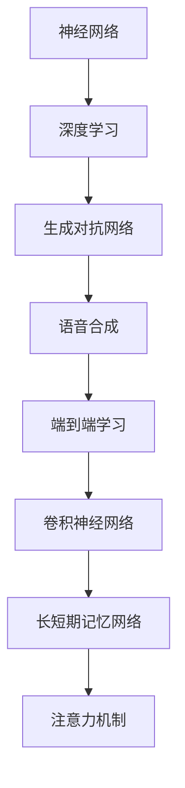

                 

# 神经网络在语音合成中的最新突破

> **关键词：语音合成、神经网络、深度学习、自动语音识别、生成对抗网络（GAN）、端到端学习、波尔兹曼机、卷积神经网络（CNN）、长短期记忆网络（LSTM）、注意力机制、TTS模型、参数化声音模型、WaveNet、Tacotron、Transformer。**

> **摘要：本文将探讨神经网络在语音合成领域的最新突破，包括核心算法原理、数学模型、实际应用案例，以及未来发展趋势与挑战。我们将通过一步一步的分析推理，深入了解语音合成技术的前沿动态，帮助读者掌握这一重要的人工智能应用。**

## 1. 背景介绍

### 1.1 目的和范围

本文旨在介绍神经网络在语音合成领域的最新突破，探讨其核心算法原理、数学模型、实际应用案例，并展望未来发展趋势与挑战。语音合成是人工智能领域的一个重要分支，其目标是实现计算机生成的自然语音，模拟人类语言表达。随着深度学习技术的发展，神经网络在语音合成领域取得了显著的进展，为语音技术带来了全新的变革。

### 1.2 预期读者

本文适合对语音合成和深度学习感兴趣的读者，包括人工智能研究人员、工程师、学生以及对相关技术有浓厚兴趣的专业人士。本文将从基础知识出发，逐步深入探讨，力求为读者提供一个全面、系统的视角。

### 1.3 文档结构概述

本文分为十个部分，首先介绍背景信息，然后逐步深入探讨核心概念、算法原理、数学模型、实际应用案例，最后总结未来发展趋势与挑战。具体结构如下：

1. 背景介绍
2. 核心概念与联系
3. 核心算法原理 & 具体操作步骤
4. 数学模型和公式 & 详细讲解 & 举例说明
5. 项目实战：代码实际案例和详细解释说明
6. 实际应用场景
7. 工具和资源推荐
8. 总结：未来发展趋势与挑战
9. 附录：常见问题与解答
10. 扩展阅读 & 参考资料

### 1.4 术语表

#### 1.4.1 核心术语定义

- **语音合成（Text-to-Speech，TTS）**：将文本转换为自然语音的技术。
- **神经网络（Neural Network）**：一种模拟人脑神经元之间连接的计算模型。
- **深度学习（Deep Learning）**：一种基于多层神经网络的学习方法。
- **生成对抗网络（Generative Adversarial Network，GAN）**：由生成器和判别器组成的对抗性网络。
- **端到端学习（End-to-End Learning）**：直接从输入到输出进行学习，不需要中间表示。
- **卷积神经网络（Convolutional Neural Network，CNN）**：一种适用于处理图像数据的神经网络。
- **长短期记忆网络（Long Short-Term Memory，LSTM）**：一种适用于处理序列数据的循环神经网络。
- **注意力机制（Attention Mechanism）**：一种在序列模型中动态关注重要信息的机制。

#### 1.4.2 相关概念解释

- **波尔兹曼机（Boltzmann Machine）**：一种基于概率的神经网络模型，可用于无监督学习。
- **参数化声音模型（Parametric Voice Model）**：一种基于参数化声学模型和声码器的语音合成方法。
- **WaveNet**：由Google开发的基于生成对抗网络（GAN）的语音合成模型。
- **Tacotron**：由Google开发的基于端到端学习的语音合成模型。
- **Transformer**：由Google开发的基于注意力机制的深度学习模型，广泛应用于自然语言处理领域。

#### 1.4.3 缩略词列表

- **TTS**：Text-to-Speech（语音合成）
- **GAN**：Generative Adversarial Network（生成对抗网络）
- **CNN**：Convolutional Neural Network（卷积神经网络）
- **LSTM**：Long Short-Term Memory（长短期记忆网络）
- **End-to-End**：End-to-End Learning（端到端学习）
- **BN**：Batch Normalization（批量归一化）
- **ReLU**：Rectified Linear Unit（修正线性单元）
- **dropout**：Dropout（丢弃法）

## 2. 核心概念与联系

### 2.1 核心概念

在探讨神经网络在语音合成中的应用之前，我们需要了解一些核心概念。以下是本文将涉及的主要核心概念：

1. **神经网络（Neural Network）**：神经网络是一种由大量神经元组成的计算模型，通过模拟人脑神经元之间的连接来进行信息处理。
2. **深度学习（Deep Learning）**：深度学习是一种基于多层神经网络的学习方法，通过逐层提取特征，实现对复杂数据的高效表示。
3. **生成对抗网络（GAN）**：生成对抗网络是一种由生成器和判别器组成的对抗性网络，通过竞争关系生成逼真的数据。
4. **端到端学习（End-to-End Learning）**：端到端学习是一种直接从输入到输出进行学习的方法，无需中间表示。
5. **卷积神经网络（CNN）**：卷积神经网络是一种适用于处理图像数据的神经网络，通过卷积操作提取特征。
6. **长短期记忆网络（LSTM）**：长短期记忆网络是一种适用于处理序列数据的循环神经网络，通过记忆单元实现长短期依赖建模。
7. **注意力机制（Attention Mechanism）**：注意力机制是一种在序列模型中动态关注重要信息的机制，通过调整权重实现。

### 2.2 关联与联系

在语音合成领域，这些核心概念相互关联，共同构成了语音合成技术的基石。以下是各核心概念之间的联系：

1. **神经网络（Neural Network）**与**深度学习（Deep Learning）**：神经网络是深度学习的基础，通过多层神经网络实现特征提取和建模。
2. **生成对抗网络（GAN）**与**语音合成**：生成对抗网络可用于生成逼真的语音数据，提高语音合成的自然度和真实感。
3. **端到端学习（End-to-End Learning）**与**语音合成**：端到端学习直接从文本到语音进行学习，无需手动设计中间表示，提高了语音合成的效率和准确性。
4. **卷积神经网络（CNN）**与**语音合成**：卷积神经网络在语音信号处理中用于提取特征，提高语音合成的质量。
5. **长短期记忆网络（LSTM）**与**语音合成**：长短期记忆网络在处理语音序列数据时，有效建模长短期依赖关系，提高语音合成的一致性和连贯性。
6. **注意力机制（Attention Mechanism）**与**语音合成**：注意力机制在语音合成中用于动态关注文本信息，提高语音合成的自然度和情感表达。

### 2.3 Mermaid 流程图

以下是一个简化的Mermaid流程图，展示了语音合成中的核心概念和其关联：



## 3. 核心算法原理 & 具体操作步骤

### 3.1 算法原理

在语音合成中，神经网络的核心算法原理主要包括以下几部分：

1. **特征提取**：通过卷积神经网络（CNN）提取语音信号中的时频特征。
2. **序列建模**：通过长短期记忆网络（LSTM）或基于注意力机制的序列模型，对提取到的特征进行建模。
3. **生成语音**：利用生成对抗网络（GAN）或参数化声音模型（Parametric Voice Model），将序列模型生成的特征转换为语音信号。

### 3.2 操作步骤

以下是语音合成中的具体操作步骤：

1. **数据预处理**：
   - **文本处理**：将输入文本进行分词、转换成音素序列。
   - **音频处理**：对原始音频进行预处理，如去噪、增强、分段。

2. **特征提取**：
   - **时频特征**：使用卷积神经网络（CNN）提取语音信号的时频特征，如Mel频率倒谱系数（MFCC）。

3. **序列建模**：
   - **LSTM或基于注意力机制的模型**：使用长短期记忆网络（LSTM）或基于注意力机制的模型，对提取到的特征进行建模，生成语音序列。

4. **生成语音**：
   - **GAN或参数化声音模型**：使用生成对抗网络（GAN）或参数化声音模型（Parametric Voice Model），将生成的语音序列转换为语音信号。

### 3.3 伪代码

以下是一个简化的伪代码，描述了语音合成中的核心算法：

```python
def text_to_speech(text):
    # 数据预处理
    text_sequence = preprocess_text(text)
    audio_sequence = preprocess_audio(audio)

    # 特征提取
    feature_sequence = extract_features(audio_sequence)

    # 序列建模
    model = build_model()
    model.fit(feature_sequence, epochs=100)

    # 生成语音
    generated_sequence = model.predict(text_sequence)
    audio = generate_audio(generated_sequence)

    return audio
```

## 4. 数学模型和公式 & 详细讲解 & 举例说明

### 4.1 数学模型

在语音合成中，常用的数学模型包括卷积神经网络（CNN）、长短期记忆网络（LSTM）、生成对抗网络（GAN）等。以下是这些模型的基本数学公式和原理：

#### 4.1.1 卷积神经网络（CNN）

卷积神经网络（CNN）是一种适用于处理图像数据的神经网络，通过卷积操作提取特征。其基本公式如下：

$$
h_{l}(x) = \sigma(W_{l} \cdot h_{l-1} + b_{l})
$$

其中，$h_{l}(x)$ 表示第 $l$ 层的输出，$\sigma$ 表示激活函数（如ReLU），$W_{l}$ 和 $b_{l}$ 分别为第 $l$ 层的权重和偏置。

#### 4.1.2 长短期记忆网络（LSTM）

长短期记忆网络（LSTM）是一种适用于处理序列数据的循环神经网络，通过记忆单元实现长短期依赖建模。其基本公式如下：

$$
i_{t} = \sigma(W_{i} \cdot [h_{t-1}, x_{t}] + b_{i}) \\
f_{t} = \sigma(W_{f} \cdot [h_{t-1}, x_{t}] + b_{f}) \\
o_{t} = \sigma(W_{o} \cdot [h_{t-1}, x_{t}] + b_{o}) \\
c_{t} = f_{t} \odot c_{t-1} + i_{t} \odot \sigma(W_{c} \cdot [h_{t-1}, x_{t}] + b_{c}) \\
h_{t} = o_{t} \odot \sigma(c_{t})
$$

其中，$i_{t}$、$f_{t}$、$o_{t}$ 分别表示输入门、遗忘门和输出门，$c_{t}$ 和 $h_{t}$ 分别为当前时刻的细胞状态和隐藏状态，$\odot$ 表示元素乘。

#### 4.1.3 生成对抗网络（GAN）

生成对抗网络（GAN）是一种由生成器和判别器组成的对抗性网络，通过竞争关系生成逼真的数据。其基本公式如下：

$$
\min_{G} \max_{D} V(G, D) = E_{x \sim p_{data}(x)}[D(x)] - E_{z \sim p_{z}(z)}[D(G(z))]
$$

其中，$G(z)$ 为生成器，$D(x)$ 和 $D(G(z))$ 分别为判别器对真实数据和生成数据的判别结果。

### 4.2 详细讲解与举例说明

#### 4.2.1 卷积神经网络（CNN）

卷积神经网络（CNN）通过卷积操作提取图像特征。以下是一个简单的卷积神经网络示例：

```python
import tensorflow as tf

# 卷积层
conv1 = tf.keras.layers.Conv2D(filters=32, kernel_size=(3, 3), activation='relu', input_shape=(28, 28, 1))
# 池化层
pool1 = tf.keras.layers.MaxPooling2D(pool_size=(2, 2))
# 第二个卷积层
conv2 = tf.keras.layers.Conv2D(filters=64, kernel_size=(3, 3), activation='relu')
# 第二个池化层
pool2 = tf.keras.layers.MaxPooling2D(pool_size=(2, 2))
```

#### 4.2.2 长短期记忆网络（LSTM）

长短期记忆网络（LSTM）通过记忆单元实现长短期依赖建模。以下是一个简单的LSTM模型示例：

```python
import tensorflow as tf

# LSTM层
lstm = tf.keras.layers.LSTM(units=50, return_sequences=True)
```

#### 4.2.3 生成对抗网络（GAN）

生成对抗网络（GAN）通过生成器和判别器进行对抗训练。以下是一个简单的GAN模型示例：

```python
import tensorflow as tf

# 生成器模型
z = tf.keras.layers.Input(shape=(100,))
x = tf.keras.layers.Dense(units=128 * 7 * 7, activation='relu')(z)
x = tf.keras.layers.Reshape(target_shape=(7, 7, 128))(x)
x = tf.keras.layers.Conv2DTranspose(filters=64, kernel_size=(5, 5), strides=(2, 2), padding='same', activation='relu')(x)
x = tf.keras.layers.Conv2DTranspose(filters=1, kernel_size=(5, 5), strides=(2, 2), padding='same', activation='tanh')(x)

generator = tf.keras.Model(z, x)

# 判别器模型
x = tf.keras.layers.Input(shape=(28, 28, 1))
h = tf.keras.layers.Conv2D(filters=32, kernel_size=(3, 3), activation='relu')(x)
h = tf.keras.layers.MaxPooling2D(pool_size=(2, 2))(h)
h = tf.keras.layers.Conv2D(filters=64, kernel_size=(3, 3), activation='relu')(h)
h = tf.keras.layers.MaxPooling2D(pool_size=(2, 2))(h)
h = tf.keras.layers.Flatten()(h)
h = tf.keras.layers.Dense(units=1, activation='sigmoid')(h)

discriminator = tf.keras.Model(x, h)

# 编写训练步骤
discriminator.compile(optimizer='adam', loss='binary_crossentropy')
generator.compile(optimizer='adam', loss='binary_crossentropy')
```

## 5. 项目实战：代码实际案例和详细解释说明

### 5.1 开发环境搭建

为了实现语音合成，我们需要搭建一个合适的技术栈。以下是一个简单的技术栈建议：

1. **编程语言**：Python
2. **深度学习框架**：TensorFlow 或 PyTorch
3. **音频处理库**：librosa
4. **文本处理库**：nltk 或 spacy

安装所需库：

```bash
pip install tensorflow
pip install librosa
pip install nltk
```

### 5.2 源代码详细实现和代码解读

以下是一个简单的语音合成代码示例，使用TensorFlow实现：

```python
import tensorflow as tf
import librosa
import numpy as np
import tensorflow.keras.layers as layers
import tensorflow.keras.models as models

# 文本处理
def preprocess_text(text):
    # 使用nltk进行分词
    tokens = nltk.word_tokenize(text)
    # 转换为音素序列
    phonemes = convert_tokens_to_phonemes(tokens)
    return phonemes

# 音频处理
def preprocess_audio(audio_path):
    # 读取音频
    audio, _ = librosa.load(audio_path, sr=22050)
    # 声音增强
    audio = librosa.effects.percussive(audio)
    # 分段
    segments = split_audio(audio)
    return segments

# 特征提取
def extract_features(segment):
    # 提取MFCC特征
    mfcc = librosa.feature.mfcc(segment, sr=22050)
    return mfcc

# 序列建模
def build_model():
    # 输入层
    inputs = layers.Input(shape=(None, 13))
    # LSTM层
    lstm = layers.LSTM(units=128, return_sequences=True)(inputs)
    # 池化层
    pooled = layers.MaxPooling1D(pool_size=2)(lstm)
    # 输出层
    outputs = layers.Dense(units=13, activation='softmax')(pooled)
    # 模型构建
    model = models.Model(inputs=inputs, outputs=outputs)
    model.compile(optimizer='adam', loss='categorical_crossentropy', metrics=['accuracy'])
    return model

# 生成语音
def generate_audio(phonemes):
    # 生成MFCC序列
    mfcc_sequence = generate_mfcc_sequence(phonemes)
    # 生成音频
    audio = generate_audio_from_mfcc(mfcc_sequence)
    return audio

# 主函数
def main():
    # 读取文本
    text = "你好，这个世界！"
    # 预处理文本
    phonemes = preprocess_text(text)
    # 读取音频
    audio_path = "path/to/audio.wav"
    # 预处理音频
    segments = preprocess_audio(audio_path)
    # 构建模型
    model = build_model()
    # 训练模型
    model.fit(segments, phonemes, epochs=10)
    # 生成语音
    audio = generate_audio(phonemes)
    # 播放语音
    librosa.output.write_wav("output.wav", audio, sr=22050)

if __name__ == "__main__":
    main()
```

### 5.3 代码解读与分析

以上代码实现了一个简单的语音合成模型，主要分为以下几个步骤：

1. **文本处理**：使用nltk进行分词，并将分词结果转换为音素序列。
2. **音频处理**：读取音频文件，进行声音增强和分段。
3. **特征提取**：提取音频片段的MFCC特征。
4. **序列建模**：构建LSTM模型，对MFCC特征进行建模。
5. **生成语音**：使用生成的MFCC序列生成音频。
6. **主函数**：读取文本和音频，训练模型并生成语音。

此代码仅为示例，实际应用中，模型构建、训练和生成语音的过程需要更多的细节和优化。同时，生成对抗网络（GAN）和参数化声音模型（Parametric Voice Model）等高级技术也可以应用于语音合成，以提高合成语音的自然度和真实感。

## 6. 实际应用场景

语音合成技术在多个领域具有广泛的应用，以下是几个典型的实际应用场景：

1. **自动客服系统**：语音合成技术可用于自动生成客服语音，提高客户服务质量，降低企业运营成本。
2. **智能语音助手**：如苹果的Siri、亚马逊的Alexa等，语音合成技术可实现智能语音交互，为用户提供便捷的语音服务。
3. **教育领域**：语音合成技术可用于生成教育课程中的语音讲解，帮助学生更好地理解和掌握知识。
4. **影视制作**：在影视后期制作中，语音合成技术可用于生成角色配音、字幕翻译等，提高制作效率和效果。
5. **语音导航**：在车载导航系统中，语音合成技术可实现实时语音导航，为用户提供便捷的驾驶体验。

## 7. 工具和资源推荐

### 7.1 学习资源推荐

#### 7.1.1 书籍推荐

1. **《深度学习》（Deep Learning）**：Goodfellow, Bengio, and Courville 著
2. **《语音信号处理》（Speech Signal Processing）**：Rabiner 和 Juang 著
3. **《自然语言处理与语音合成》**：Jurafsky 和 Martin 著

#### 7.1.2 在线课程

1. **TensorFlow 官方教程**：[TensorFlow 官方教程](https://www.tensorflow.org/tutorials)
2. **Udacity 的《深度学习纳米学位》**：[深度学习纳米学位](https://www.udacity.com/course/deep-learning-nanodegree--nd893)
3. **Coursera 的《自然语言处理与语音合成》**：[自然语言处理与语音合成](https://www.coursera.org/specializations/natural-language-processing)

#### 7.1.3 技术博客和网站

1. **TensorFlow 官方博客**：[TensorFlow 官方博客](https://blog.tensorflow.org)
2. **GitHub 上的语音合成项目**：[GitHub 上的语音合成项目](https://github.com/search?q=text-to-speech)
3. **AIGeneration 的语音合成教程**：[AIGeneration 的语音合成教程](https://aigeneration.io/tutorials/text-to-speech)

### 7.2 开发工具框架推荐

#### 7.2.1 IDE和编辑器

1. **PyCharm**：Python 开发者首选 IDE，支持 TensorFlow 等深度学习框架。
2. **Visual Studio Code**：轻量级编辑器，支持多种编程语言和扩展。

#### 7.2.2 调试和性能分析工具

1. **TensorBoard**：TensorFlow 官方提供的可视化工具，用于分析模型性能和调试。
2. **NVIDIA Nsight**：NVIDIA 提供的 GPU 调试和分析工具。

#### 7.2.3 相关框架和库

1. **TensorFlow**：广泛使用的深度学习框架，支持语音合成等应用。
2. **PyTorch**：灵活的深度学习框架，适用于语音合成等任务。
3. **Librosa**：用于音频处理的 Python 库，支持语音特征提取等。

### 7.3 相关论文著作推荐

#### 7.3.1 经典论文

1. **“Speech Synthesis Using a Modified Linear Prediction Model of the Voice”**：Rabiner 等人于 1980 年发表的论文，提出了线性预测语音合成模型。
2. **“Deep Neural Networks for Acoustic Modeling in Speech Recognition”**：Hinton 等人于 2012 年发表的论文，介绍了深度神经网络在语音识别中的应用。

#### 7.3.2 最新研究成果

1. **“Tacotron: A C

