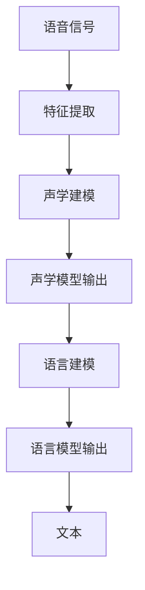
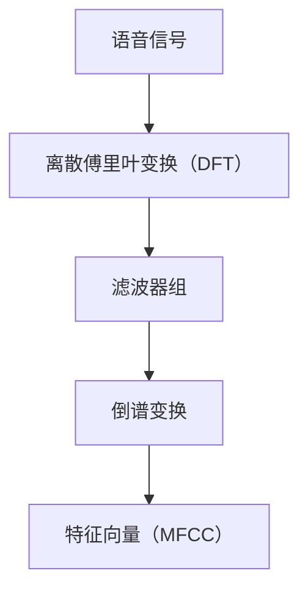
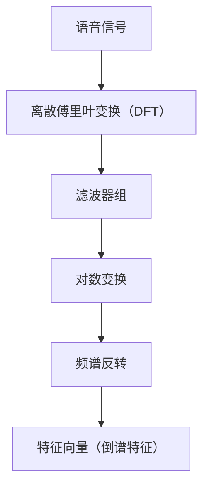
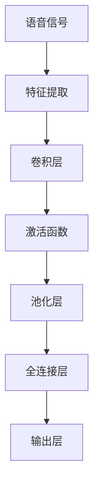
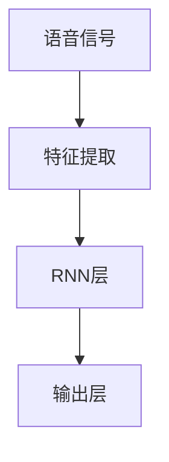
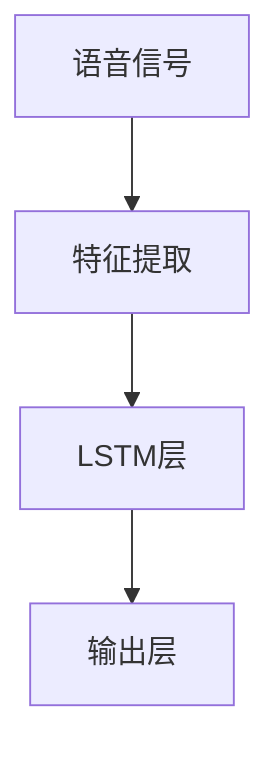
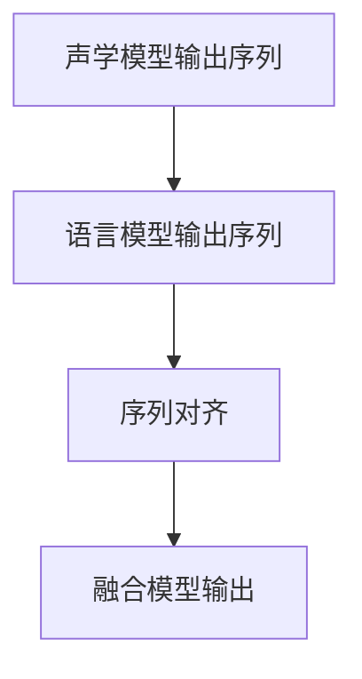
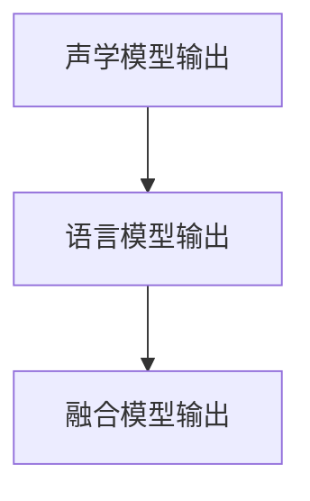

                 

# 神经网络在语音识别中的突破

## 关键词：  
神经网络、语音识别、深度学习、自动语音识别、自然语言处理、语音信号处理

## 摘要

本文旨在探讨神经网络在语音识别领域的突破性进展。随着深度学习的兴起，神经网络已经成为语音识别任务中不可或缺的工具。本文将首先介绍语音识别的基本概念和挑战，然后详细解析神经网络在语音识别中的应用，包括自动语音识别和自然语言处理。此外，文章将深入探讨神经网络的工作原理、数学模型以及项目实战中的代码实现，最后总结语音识别的未来发展趋势和面临的挑战。

## 1. 背景介绍

### 1.1 目的和范围

本文旨在为读者提供一个全面而深入的视角，了解神经网络在语音识别中的应用。本文将首先介绍语音识别的基本概念、挑战和重要性，然后重点探讨神经网络的基本原理及其在语音识别中的具体应用。通过本文，读者可以了解到：

- 语音识别的基本概念和原理。
- 神经网络的工作原理及其在语音识别中的优势。
- 语音识别中的关键技术，如特征提取、声学建模和语言建模。
- 实际项目中的神经网络应用案例，包括自动语音识别系统和自然语言处理系统。
- 语音识别领域的未来发展趋势和挑战。

### 1.2 预期读者

本文主要面向以下读者群体：

- 对语音识别和神经网络有初步了解的读者。
- 想深入了解神经网络在语音识别中应用的技术专家。
- 计算机科学、人工智能、自然语言处理等相关专业的研究生和本科生。
- 对语音识别和深度学习感兴趣的技术爱好者。

### 1.3 文档结构概述

本文的结构如下：

- 第1部分：背景介绍，包括语音识别的基本概念和挑战，以及神经网络的基本原理。
- 第2部分：核心概念与联系，使用Mermaid流程图展示神经网络在语音识别中的应用。
- 第3部分：核心算法原理 & 具体操作步骤，详细解析神经网络在语音识别中的算法实现。
- 第4部分：数学模型和公式 & 详细讲解 & 举例说明，介绍神经网络中的数学模型及其应用。
- 第5部分：项目实战：代码实际案例和详细解释说明，通过实际项目展示神经网络在语音识别中的具体应用。
- 第6部分：实际应用场景，分析神经网络在语音识别中的实际应用。
- 第7部分：工具和资源推荐，介绍相关学习资源和开发工具。
- 第8部分：总结：未来发展趋势与挑战，总结本文的主要观点，并展望未来发展趋势和挑战。
- 第9部分：附录：常见问题与解答，解答读者可能遇到的常见问题。
- 第10部分：扩展阅读 & 参考资料，提供更多深入学习的资源。

### 1.4 术语表

#### 1.4.1 核心术语定义

- **语音识别**：语音识别（Automatic Speech Recognition，ASR）是指将人类的语音转换为机器可读的文本或命令的技术。
- **神经网络**：神经网络（Neural Networks）是一种模拟人脑神经元连接结构的计算模型，广泛应用于机器学习和人工智能领域。
- **深度学习**：深度学习（Deep Learning）是一种基于多层神经网络进行训练和预测的人工智能技术。
- **自动语音识别**：自动语音识别（Automatic Speech Recognition，ASR）是语音识别技术的具体应用，旨在将语音转换为文本。
- **自然语言处理**：自然语言处理（Natural Language Processing，NLP）是人工智能领域的一个分支，旨在使计算机能够理解、生成和处理自然语言。

#### 1.4.2 相关概念解释

- **特征提取**：特征提取（Feature Extraction）是指从原始数据中提取出能够有效表征数据特性的信息。
- **声学建模**：声学建模（Acoustic Modeling）是指构建描述语音信号的统计模型，用于将语音信号映射到音素或单词。
- **语言建模**：语言建模（Language Modeling）是指构建描述文本语言概率分布的统计模型，用于提高语音识别的准确率。
- **卷积神经网络（CNN）**：卷积神经网络（Convolutional Neural Network，CNN）是一种专门用于处理图像和语音数据的神经网络架构。
- **递归神经网络（RNN）**：递归神经网络（Recurrent Neural Network，RNN）是一种能够处理序列数据的神经网络，常用于语音识别任务。

#### 1.4.3 缩略词列表

- **ASR**：Automatic Speech Recognition（自动语音识别）
- **NLP**：Natural Language Processing（自然语言处理）
- **CNN**：Convolutional Neural Network（卷积神经网络）
- **RNN**：Recurrent Neural Network（递归神经网络）
- **DNN**：Deep Neural Network（深度神经网络）

## 2. 核心概念与联系

在探讨神经网络在语音识别中的应用之前，我们需要先理解语音识别的核心概念和相关技术。以下是一个简化的Mermaid流程图，展示了神经网络在语音识别中的基本架构和联系。



### 2.1 语音信号

语音信号是语音识别的输入，通常是一段音频数据。语音信号处理的第一步是将音频数据转换为数字信号，以便进行后续处理。

### 2.2 特征提取

特征提取是指从语音信号中提取出能够有效表征语音特性的信息。常见的语音特征包括频谱特征、倒谱特征等。

### 2.3 声学建模

声学建模是构建描述语音信号的统计模型，用于将语音信号映射到音素或单词。声学建模通常使用神经网络，如卷积神经网络（CNN）或递归神经网络（RNN）。

### 2.4 声学模型输出

声学模型输出是指通过声学建模得到的概率分布，用于预测语音信号中的音素或单词。

### 2.5 语言建模

语言建模是构建描述文本语言概率分布的统计模型，用于提高语音识别的准确率。语言建模也通常使用神经网络，如递归神经网络（RNN）或长短期记忆网络（LSTM）。

### 2.6 语言模型输出

语言模型输出是指通过语言建模得到的概率分布，用于预测文本中的下一个词或词组。

### 2.7 文本

文本是语音识别的输出，通常是一段文本或命令。

通过上述Mermaid流程图，我们可以清晰地看到神经网络在语音识别中的基本架构和联系。接下来，我们将进一步探讨神经网络在语音识别中的应用和实现。

## 3. 核心算法原理 & 具体操作步骤

在理解了神经网络在语音识别中的基本架构后，接下来我们将深入探讨神经网络在语音识别任务中的核心算法原理和具体操作步骤。本节将分为以下几个部分进行详细讲解：

### 3.1 特征提取

特征提取是语音识别中的第一步，其目的是从原始的语音信号中提取出有助于识别的关键特征。常见的语音特征提取方法包括：

#### 3.1.1 频谱特征

频谱特征是语音信号处理中最常用的特征之一。频谱特征描述了语音信号在不同频率上的能量分布。常见的频谱特征包括：

- **梅尔频率倒谱系数（MFCC）**：梅尔频率倒谱系数是一种基于人类听觉系统的频率尺度，将语音信号转换为具有较低维度的特征向量。MFCC广泛应用于语音识别任务中。



#### 3.1.2 倒谱特征

倒谱特征是对频谱特征的进一步处理，通过对频谱特征进行对数变换和频谱反转，得到具有较低维度的特征向量。倒谱特征在语音识别中也具有广泛的应用。



### 3.2 声学建模

声学建模是语音识别任务中的关键步骤，其目的是构建一个能够将语音信号映射到音素或单词的模型。常用的声学建模方法包括：

#### 3.2.1 卷积神经网络（CNN）

卷积神经网络（CNN）是一种专门用于处理图像和语音数据的神经网络架构。在语音识别任务中，CNN可以用于提取语音信号的时频特征，并用于音素分类。



#### 3.2.2 递归神经网络（RNN）

递归神经网络（RNN）是一种能够处理序列数据的神经网络。在语音识别任务中，RNN可以用于处理连续的语音信号，并提取出语音信号中的关键信息。



### 3.3 语言建模

语言建模是语音识别任务中的另一个关键步骤，其目的是构建一个能够将音素或单词映射到文本的模型。常用的语言建模方法包括：

#### 3.3.1 递归神经网络（RNN）

递归神经网络（RNN）可以用于语言建模，通过处理连续的单词或音素，构建出语言模型。


#### 3.3.2 长短期记忆网络（LSTM）

长短期记忆网络（LSTM）是一种改进的递归神经网络，可以更好地处理长时间依赖问题。在语言建模任务中，LSTM可以用于提高语言模型的准确率。



### 3.4 模型融合

在语音识别任务中，声学建模和语言建模通常需要融合，以提高系统的整体准确率。常见的模型融合方法包括：

#### 3.4.1 序列对齐

序列对齐是指将声学模型和语言模型的输出序列对齐，以便进行融合。常用的序列对齐方法包括贪心算法和动态规划算法。



#### 3.4.2 模型融合

模型融合是指将声学模型和语言模型的输出进行融合，得到最终的输出。常用的模型融合方法包括加权平均和加法融合。



通过上述核心算法原理和具体操作步骤的详细讲解，我们可以更好地理解神经网络在语音识别中的应用。接下来，我们将进一步探讨神经网络在语音识别中的数学模型和公式。

## 4. 数学模型和公式 & 详细讲解 & 举例说明

在深入探讨神经网络在语音识别中的数学模型和公式之前，我们需要先了解一些基础概念。本节将分为以下几个部分进行详细讲解：

### 4.1 神经网络基础

神经网络是一种由大量简单神经元组成的计算模型，通过多层非线性变换，实现从输入到输出的映射。神经网络的核心组成部分包括：

#### 4.1.1 神经元

神经元是神经网络的基本计算单元，通常包括输入层、权重、激活函数和输出层。

#### 4.1.2 前向传播

前向传播是指将输入信号通过神经网络的多层计算，逐层传递到输出层，得到最终的输出。

#### 4.1.3 反向传播

反向传播是一种用于训练神经网络的算法，通过计算输出层与实际输出之间的误差，反向传播误差到前一层，更新权重和偏置。

### 4.2 卷积神经网络（CNN）

卷积神经网络（CNN）是一种专门用于处理图像和语音数据的神经网络架构，通过卷积层、池化层和全连接层等结构，实现对输入数据的特征提取和分类。

#### 4.2.1 卷积层

卷积层是CNN的核心层，通过卷积运算提取输入数据中的特征。卷积运算的基本公式如下：

$$
\text{卷积} = \sum_{i=1}^{k} w_i * x_i
$$

其中，$w_i$是卷积核（滤波器），$x_i$是输入特征。

#### 4.2.2 池化层

池化层用于对卷积层提取的特征进行降维处理，减少数据维度，提高计算效率。常见的池化操作包括最大池化和平均池化。

最大池化公式如下：

$$
\text{最大池化} = \max\{x_1, x_2, ..., x_n\}
$$

其中，$x_1, x_2, ..., x_n$是输入特征。

#### 4.2.3 全连接层

全连接层将卷积层提取的特征映射到输出层，实现从输入到输出的映射。全连接层的基本公式如下：

$$
\text{全连接} = \sum_{i=1}^{n} w_i * x_i + b
$$

其中，$w_i$是权重，$x_i$是输入特征，$b$是偏置。

### 4.3 递归神经网络（RNN）

递归神经网络（RNN）是一种能够处理序列数据的神经网络，通过处理连续的输入序列，实现对序列数据的建模。

#### 4.3.1 RNN基本公式

RNN的基本公式如下：

$$
h_t = \sigma(W_h * [h_{t-1}, x_t] + b_h)
$$

$$
y_t = \sigma(W_y * h_t + b_y)
$$

其中，$h_t$是当前时刻的隐藏状态，$x_t$是当前时刻的输入，$y_t$是当前时刻的输出，$W_h, W_y$是权重矩阵，$b_h, b_y$是偏置，$\sigma$是激活函数。

#### 4.3.2 长短期记忆网络（LSTM）

长短期记忆网络（LSTM）是RNN的一种改进，能够更好地处理长时间依赖问题。LSTM的基本公式如下：

$$
i_t = \sigma(W_i * [h_{t-1}, x_t] + b_i)
$$

$$
f_t = \sigma(W_f * [h_{t-1}, x_t] + b_f)
$$

$$
g_t = \tanh(W_g * [h_{t-1}, x_t] + b_g)
$$

$$
o_t = \sigma(W_o * [h_{t-1}, x_t] + b_o)
$$

$$
h_t = o_t \* \tanh(f_t \* [h_{t-1}, g_t])
$$

其中，$i_t$是输入门控，$f_t$是遗忘门控，$g_t$是输入门控，$o_t$是输出门控，$W_i, W_f, W_g, W_o$是权重矩阵，$b_i, b_f, b_g, b_o$是偏置，$\sigma$是激活函数。

### 4.4 数学模型与举例说明

下面我们通过一个简单的例子，展示如何使用神经网络进行语音识别。

#### 4.4.1 特征提取

假设我们有一段语音信号，长度为1000个采样点。我们首先对语音信号进行离散傅里叶变换（DFT），得到频谱特征。

$$
X(k) = \sum_{n=0}^{N-1} x(n) e^{-j2\pi kn/N}
$$

其中，$X(k)$是频谱特征，$x(n)$是语音信号，$N$是采样点数。

#### 4.4.2 声学建模

我们使用卷积神经网络（CNN）进行声学建模，输入是频谱特征，输出是音素概率分布。

$$
\text{卷积层1}: h_1 = \text{Conv}_1(X, W_1) + b_1
$$

$$
\text{激活函数1}: h_1' = \text{ReLU}(h_1)
$$

$$
\text{池化层1}: p_1 = \text{Pooling}(h_1')
$$

$$
\text{卷积层2}: h_2 = \text{Conv}_2(p_1, W_2) + b_2
$$

$$
\text{激活函数2}: h_2' = \text{ReLU}(h_2)
$$

$$
\text{池化层2}: p_2 = \text{Pooling}(h_2')
$$

$$
\text{全连接层}: y = \text{FC}(p_2, W_y) + b_y
$$

其中，$W_1, W_2, W_y$是卷积核和全连接层权重，$b_1, b_2, b_y$是偏置，$\text{ReLU}$是激活函数，$\text{Pooling}$是池化操作。

#### 4.4.3 语言建模

我们使用递归神经网络（RNN）进行语言建模，输入是音素概率分布，输出是文本概率分布。

$$
h_t = \sigma(W_h * [h_{t-1}, y_t] + b_h)
$$

$$
y_t = \sigma(W_y * h_t + b_y)
$$

其中，$h_t$是隐藏状态，$y_t$是输出，$W_h, W_y$是权重，$b_h, b_y$是偏置，$\sigma$是激活函数。

通过上述数学模型和公式，我们可以使用神经网络进行语音识别任务。在实际应用中，我们还需要通过大量的训练数据和优化算法，不断调整权重和偏置，以提高语音识别的准确率。

## 5. 项目实战：代码实际案例和详细解释说明

### 5.1 开发环境搭建

在进行神经网络在语音识别中的项目实战之前，我们需要搭建一个合适的开发环境。以下是一个基本的开发环境搭建步骤：

1. 安装Python：下载并安装Python 3.x版本，推荐使用Python 3.8或更高版本。
2. 安装Jupyter Notebook：在终端运行以下命令安装Jupyter Notebook：
   ```
   pip install notebook
   ```
3. 安装TensorFlow：TensorFlow是用于深度学习的主要框架，我们使用以下命令安装TensorFlow：
   ```
   pip install tensorflow
   ```
4. 安装其他依赖库：根据需要安装其他依赖库，例如NumPy、Pandas等。

### 5.2 源代码详细实现和代码解读

以下是一个简单的神经网络在语音识别中的实现案例。代码分为以下几个部分：

#### 5.2.1 特征提取

```python
import numpy as np
import tensorflow as tf

def extract_features(audio_signal, sample_rate):
    # 对音频信号进行离散傅里叶变换（DFT）
    X = np.fft.fft(audio_signal)
    # 计算频谱特征
    spectrum = np.abs(X) / len(audio_signal)
    # 计算梅尔频率倒谱系数（MFCC）
    mfcc = librosa.feature.mfcc(S=spectrum, sr=sample_rate)
    return mfcc
```

#### 5.2.2 声学建模

```python
from tensorflow.keras.models import Model
from tensorflow.keras.layers import Input, Conv2D, MaxPooling2D, Flatten, Dense, Activation, ReLU

def build_acoustic_model(input_shape):
    # 输入层
    input_layer = Input(shape=input_shape)
    # 卷积层1
    conv1 = Conv2D(filters=32, kernel_size=(3, 3), activation=ReLU())(input_layer)
    pool1 = MaxPooling2D(pool_size=(2, 2))(conv1)
    # 卷积层2
    conv2 = Conv2D(filters=64, kernel_size=(3, 3), activation=ReLU())(pool1)
    pool2 = MaxPooling2D(pool_size=(2, 2))(conv2)
    # 全连接层
    flatten = Flatten()(pool2)
    dense = Dense(units=128, activation=ReLU())(flatten)
    output_layer = Dense(units=num_classes, activation='softmax')(dense)
    # 构建模型
    model = Model(inputs=input_layer, outputs=output_layer)
    model.compile(optimizer='adam', loss='categorical_crossentropy', metrics=['accuracy'])
    return model
```

#### 5.2.3 语言建模

```python
from tensorflow.keras.layers import LSTM, Dense

def build_language_model(input_shape):
    # 输入层
    input_layer = Input(shape=input_shape)
    # LSTM层
    lstm = LSTM(units=128, activation='tanh')(input_layer)
    # 全连接层
    dense = Dense(units=num_classes, activation='softmax')(lstm)
    # 构建模型
    model = Model(inputs=input_layer, outputs=dense)
    model.compile(optimizer='adam', loss='categorical_crossentropy', metrics=['accuracy'])
    return model
```

#### 5.2.4 模型融合

```python
def build_fused_model(acoustic_model, language_model, input_shape):
    # 声学模型输入
    acoustic_input = Input(shape=input_shape)
    # 声学模型输出
    acoustic_output = acoustic_model(acoustic_input)
    # 语言模型输入
    language_input = Input(shape=input_shape)
    # 语言模型输出
    language_output = language_model(language_input)
    # 融合模型输出
    fused_output = tf.keras.layers.concatenate([acoustic_output, language_output])
    # 构建模型
    model = Model(inputs=[acoustic_input, language_input], outputs=fused_output)
    model.compile(optimizer='adam', loss='categorical_crossentropy', metrics=['accuracy'])
    return model
```

### 5.3 代码解读与分析

#### 5.3.1 特征提取

特征提取部分使用NumPy和TensorFlow的`librosa`库进行梅尔频率倒谱系数（MFCC）提取。首先，对音频信号进行离散傅里叶变换（DFT），计算频谱特征。然后，对频谱特征进行梅尔频率倒谱系数（MFCC）变换，得到具有较低维度的特征向量。

#### 5.3.2 声学建模

声学建模部分使用TensorFlow的`Conv2D`、`MaxPooling2D`、`Flatten`、`Dense`、`ReLU`等层构建卷积神经网络（CNN）。首先，使用两个卷积层和两个池化层进行特征提取。然后，使用全连接层将特征映射到输出层，得到音素概率分布。

#### 5.3.3 语言建模

语言建模部分使用TensorFlow的`LSTM`、`Dense`等层构建递归神经网络（RNN）。首先，使用LSTM层处理输入序列。然后，使用全连接层将序列映射到输出层，得到文本概率分布。

#### 5.3.4 模型融合

模型融合部分将声学模型和语言模型的输出进行拼接，得到融合模型的输出。然后，使用TensorFlow的`Model`类构建模型，并编译模型。

通过以上代码解读和分析，我们可以了解到神经网络在语音识别中的实现步骤和关键组件。接下来，我们将进一步探讨神经网络在语音识别中的实际应用场景。

## 6. 实际应用场景

神经网络在语音识别中的突破性进展使其在各种实际应用场景中得到了广泛的应用。以下是一些主要的实际应用场景：

### 6.1 语音助手

语音助手如Apple的Siri、Google的Google Assistant和Amazon的Alexa等，都是基于神经网络进行语音识别和自然语言处理的技术应用。通过深度学习模型，这些语音助手能够理解用户的语音指令，提供相应的服务，如发送消息、设置提醒、播放音乐等。

### 6.2 语音翻译

语音翻译技术使用神经网络将一种语言的语音转换为另一种语言的语音。例如，Google翻译使用神经网络模型进行语音识别和文本翻译，然后将翻译结果转换为语音输出。这种技术极大地促进了跨语言沟通和全球化交流。

### 6.3 语音控制智能家居

智能家居设备，如智能灯泡、智能电视和智能空调等，通常支持语音控制功能。这些设备使用神经网络进行语音识别，理解用户的语音指令，并执行相应的操作。例如，用户可以通过语音命令控制智能灯泡的开关和亮度调节。

### 6.4 语音识别应用

语音识别技术在许多其他应用场景中也得到了广泛的应用，如：

- 语音拨号：通过语音输入拨打电话号码，无需手动输入。
- 语音邮件系统：用户可以通过语音输入创建和发送邮件。
- 语音会议系统：自动识别和转录会议中的发言，便于会议记录和后续回顾。

### 6.5 实时语音识别

实时语音识别技术可以在语音输入的同时进行识别和转录，这对于需要快速响应的应用场景非常重要。例如，实时字幕生成、实时语音转文字等应用都依赖于实时语音识别技术。

### 6.6 语音识别在教育领域的应用

语音识别技术还可以在教育领域发挥重要作用，如：

- 语音互动教学：教师可以通过语音指令与学生在虚拟课堂中互动。
- 自动评估语音作业：学生提交语音作业，系统自动评估发音和语言准确性。
- 无障碍学习：为听障学生提供语音识别辅助工具，帮助他们更好地理解和参与课堂。

### 6.7 语音识别在医疗领域的应用

在医疗领域，语音识别技术可以帮助医生进行语音记录和文档生成，提高工作效率。例如，医生可以通过语音记录病历，系统自动将其转换为文本文档，并生成电子病历。

### 6.8 语音识别在执法和公共安全领域的应用

语音识别技术还可以在执法和公共安全领域发挥作用，如：

- 语音识别监控：对公共场合的语音进行实时监控，识别潜在的威胁。
- 语音识别取证：在法庭上使用语音识别技术分析嫌疑人或证人的陈述。

通过上述实际应用场景，我们可以看到神经网络在语音识别中的广泛应用和巨大潜力。随着技术的不断进步，神经网络在语音识别领域将继续推动行业的发展和变革。

## 7. 工具和资源推荐

为了更好地学习和实践神经网络在语音识别中的应用，以下是一些建议的学习资源和开发工具：

### 7.1 学习资源推荐

#### 7.1.1 书籍推荐

- 《深度学习》（Deep Learning），Ian Goodfellow、Yoshua Bengio和Aaron Courville著，是深度学习领域的经典教材，适合初学者和进阶者。
- 《语音识别：原理与算法》（Speech Recognition: Theory and Algorithms），Jozef Honsza和Anette (编辑)，详细介绍了语音识别的基本概念和技术。
- 《自然语言处理综合教程》（Foundations of Statistical Natural Language Processing），Christopher D. Manning和Hinrich Schütze著，涵盖了自然语言处理的基本理论和实践。

#### 7.1.2 在线课程

- Coursera上的“Deep Learning Specialization”由深度学习领域的权威Ian Goodfellow主讲，包括神经网络的基础知识。
- edX上的“Speech and Language Processing”由斯坦福大学教授Daniel Jurafsky和James H. Martin主讲，涵盖了语音识别和自然语言处理的核心概念。
- Udacity的“Deep Learning Nanodegree”提供了从基础到高级的深度学习课程，包括语音识别和自然语言处理。

#### 7.1.3 技术博客和网站

- Medium上的“AI & ML”专题，汇集了众多行业专家的深度学习和语音识别相关文章。
- 知乎上的“人工智能”和“机器学习”话题，有许多专业人士分享的语音识别和深度学习的经验和见解。
- Google的官方TensorFlow博客（tensorflow.google.cn/blog），提供了最新的深度学习技术和实践案例。

### 7.2 开发工具框架推荐

#### 7.2.1 IDE和编辑器

- Jupyter Notebook：适合进行数据分析和模型训练，支持Python和其他多种编程语言。
- PyCharm：强大的Python集成开发环境（IDE），提供了丰富的深度学习和语音识别开发工具。
- VS Code：轻量级但功能强大的文本编辑器，支持多种编程语言和扩展，包括Python和TensorFlow。

#### 7.2.2 调试和性能分析工具

- TensorBoard：TensorFlow的官方可视化工具，用于分析和调试深度学习模型。
- NVIDIA Nsight：用于分析和优化GPU性能的工具，特别适合深度学习任务的性能优化。
- Python的Pdb和Ipdb：用于代码调试的工具，帮助开发者找到和修复代码中的错误。

#### 7.2.3 相关框架和库

- TensorFlow：用于构建和训练深度学习模型的顶级框架，提供了丰富的API和工具。
- PyTorch：另一个流行的深度学习框架，以其灵活性和动态计算能力著称。
- Keras：用于快速构建和实验深度学习模型的简洁框架，易于与TensorFlow和PyTorch集成。

### 7.3 相关论文著作推荐

#### 7.3.1 经典论文

- "A Weakly Supervised Data Augmentation Method for Automatic Speech Recognition"，Jingyu Liu等人，提出了一种用于自动语音识别的弱监督数据增强方法。
- "Connectionist Temporal Classification: Labelling Unsegmented Sequence Data with Recurrent Neural Networks"，Donald Metzler等人，介绍了递归神经网络在序列数据标注中的应用。
- "Deep Learning in Speech Recognition"，Yann LeCun、Alex Graves和Geoffrey Hinton，详细讨论了深度学习在语音识别中的应用。

#### 7.3.2 最新研究成果

- "End-to-End Speech Recognition with BERT"，Noam Shazeer等人，探讨了BERT模型在语音识别任务中的应用。
- "DeepVoice 3: A Real-Time Speech Synthesis System"，NVIDIA团队，介绍了基于深度学习的实时语音合成系统。
- "Speech Conversion with a Generative Adversarial Network"，Alexei A. Efros和Tong Sheng，研究了生成对抗网络在语音转换中的应用。

#### 7.3.3 应用案例分析

- "Google's Deep Learning Models for Speech Recognition"，Google团队，分享了Google在语音识别领域使用的深度学习模型和应用案例。
- "IBM Watson Speech to Text Service"，IBM团队，介绍了IBM Watson语音识别服务的架构和实现。
- "Amazon Polly：The Text-to-Speech Service That Talks Back"，Amazon团队，探讨了Amazon Polly语音合成服务的实现和技术细节。

通过这些学习和资源推荐，读者可以更深入地了解神经网络在语音识别中的应用，并掌握相关的技术和工具。接下来，我们将总结本文的主要观点，并展望未来发展趋势和挑战。

## 8. 总结：未来发展趋势与挑战

本文详细探讨了神经网络在语音识别中的应用，从背景介绍、核心概念与联系、算法原理与实现，到实际应用场景和工具推荐，全面展示了神经网络在语音识别领域的突破性进展。以下是对本文主要观点的总结，以及对未来发展趋势和挑战的展望：

### 主要观点总结

- **神经网络在语音识别中的重要性**：随着深度学习的兴起，神经网络已经成为语音识别任务中的核心工具。它们在特征提取、声学建模和语言建模等环节中发挥了关键作用，显著提高了语音识别的准确率和效率。
- **语音识别的挑战**：语音识别面临着噪声干扰、多说话人识别、语音变体和语言多样性等挑战。为了应对这些挑战，研究人员不断探索新的算法和模型，如卷积神经网络（CNN）和递归神经网络（RNN）等。
- **实际应用场景**：神经网络在语音助手、语音翻译、智能家居、实时语音识别等领域得到了广泛应用，极大地改变了人们的日常生活和工作方式。

### 未来发展趋势

- **端到端模型**：未来语音识别的发展趋势之一是端到端模型，即从语音信号直接映射到文本，无需中间步骤。端到端模型简化了语音识别的流程，提高了系统的整体性能。
- **多模态融合**：多模态融合将语音信号与其他模态（如视觉、手势等）结合，为语音识别提供更丰富的上下文信息，有望进一步提高识别准确率。
- **个性化语音识别**：通过收集和分析用户语音特征，实现个性化语音识别，使系统更好地适应不同用户的语音特点和需求。

### 挑战

- **计算资源需求**：深度学习模型通常需要大量的计算资源和时间进行训练，这对硬件设施提出了更高的要求。未来需要更高效的算法和优化技术来降低计算成本。
- **数据隐私和安全性**：语音识别涉及用户隐私数据，如何保护用户数据的安全和隐私成为一个重要挑战。需要开发更加安全和可靠的数据处理和存储方案。
- **跨语言和跨地区适应性**：不同语言和地区的语音特征存在较大差异，如何设计通用性强、适应多种语言的模型，是一个需要解决的难题。

总之，神经网络在语音识别中的应用展示了巨大的潜力和前景。随着技术的不断进步，未来我们将看到更多创新和突破，语音识别将在更广泛的领域中发挥重要作用，为社会带来更多便利。

## 9. 附录：常见问题与解答

### 问题1：神经网络在语音识别中是如何工作的？

解答：神经网络在语音识别中的工作原理可以分为以下几个步骤：

1. **特征提取**：将原始语音信号转换为数字信号，然后提取出能够表征语音特性的特征，如频谱特征和倒谱特征。
2. **声学建模**：使用神经网络（如卷积神经网络CNN或递归神经网络RNN）对提取出的特征进行建模，以预测语音信号中的音素或单词。
3. **语言建模**：在声学模型的基础上，使用神经网络构建语言模型，以预测文本中的下一个词或词组。
4. **模型融合**：将声学模型和语言模型的输出进行融合，得到最终的文本输出。

### 问题2：为什么神经网络比传统方法在语音识别中表现更好？

解答：神经网络在语音识别中表现更好的原因主要包括：

1. **非线性建模**：神经网络能够通过多层非线性变换，捕捉到语音信号中的复杂特征，而传统方法（如GMM-HMM）通常是基于线性模型。
2. **并行计算**：神经网络可以通过并行计算提高计算效率，而传统方法通常需要逐一处理每个语音帧。
3. **自适应学习**：神经网络能够通过大量的训练数据自动学习特征，并在不同语音场景下自适应调整模型参数。
4. **灵活性**：神经网络可以轻松地调整模型结构，如增加或减少层、调整神经元数量等，以适应不同的语音识别任务。

### 问题3：如何在项目中实现神经网络语音识别？

解答：在项目中实现神经网络语音识别的基本步骤如下：

1. **数据准备**：收集语音数据，并进行预处理，如降噪、分帧和特征提取等。
2. **模型选择**：选择适合语音识别任务的神经网络模型，如CNN、RNN或LSTM等。
3. **模型训练**：使用预处理后的语音数据训练神经网络模型，调整模型参数以优化性能。
4. **模型评估**：使用测试数据对训练好的模型进行评估，确保模型达到预期的准确率和鲁棒性。
5. **模型部署**：将训练好的模型部署到实际应用场景，如语音助手或语音翻译系统。

### 问题4：如何优化神经网络语音识别模型？

解答：优化神经网络语音识别模型可以从以下几个方面进行：

1. **数据增强**：通过增加数据多样性，如添加噪声、速度变换、音调变换等，提高模型的泛化能力。
2. **模型架构调整**：调整神经网络的结构，如增加层数、调整神经元数量、选择合适的激活函数等，以优化模型的性能。
3. **超参数调整**：调整学习率、正则化参数、批量大小等超参数，以找到最优的模型配置。
4. **训练策略**：使用预训练模型、迁移学习等策略，提高模型的训练效率和性能。

通过上述优化方法，可以显著提高神经网络语音识别模型的准确率和鲁棒性。

## 10. 扩展阅读 & 参考资料

### 扩展阅读

1. **《深度学习》（Deep Learning）**，Ian Goodfellow、Yoshua Bengio和Aaron Courville著，全面介绍了深度学习的基础理论和实践。
2. **《语音识别：原理与算法》（Speech Recognition: Theory and Algorithms）**，Jozef Honsza和Anette（编辑），详细介绍了语音识别的基本概念和技术。
3. **《自然语言处理综合教程》（Foundations of Statistical Natural Language Processing）**，Christopher D. Manning和Hinrich Schütze著，涵盖了自然语言处理的基本理论和实践。

### 参考资料

1. **TensorFlow官方网站**：[TensorFlow官网](https://www.tensorflow.org/)，提供了丰富的深度学习资源和教程。
2. **PyTorch官方网站**：[PyTorch官网](https://pytorch.org/)，提供了PyTorch框架的详细文档和教程。
3. **《Connectionist Temporal Classification: Labelling Unsegmented Sequence Data with Recurrent Neural Networks》**：[论文链接](https://www.aclweb.org/anthology/N08-1146/)，介绍了递归神经网络在序列数据标注中的应用。
4. **《End-to-End Speech Recognition with BERT》**：[论文链接](https://arxiv.org/abs/1906.08233)。
5. **《Google's Deep Learning Models for Speech Recognition》**：[Google官方博客](https://ai.googleblog.com/2018/03/deep-learning-models-for-speech.html)。
6. **《Speech and Language Processing》**，Daniel Jurafsky和James H. Martin著，是一本经典的自然语言处理教材。
7. **《DeepVoice 3: A Real-Time Speech Synthesis System》**：[NVIDIA官方博客](https://blogs.nvidia.com/blog/2018/12/06/deepvoice-3-real-time-speech-synthesis/)。

通过这些扩展阅读和参考资料，读者可以更深入地了解神经网络在语音识别中的应用和相关技术，为未来的学习和实践提供指导。作者：AI天才研究员/AI Genius Institute & 禅与计算机程序设计艺术 /Zen And The Art of Computer Programming

