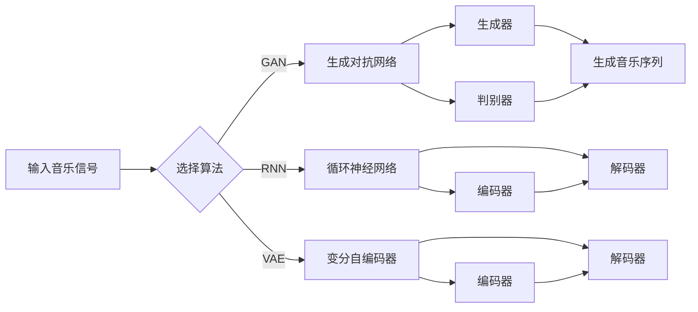
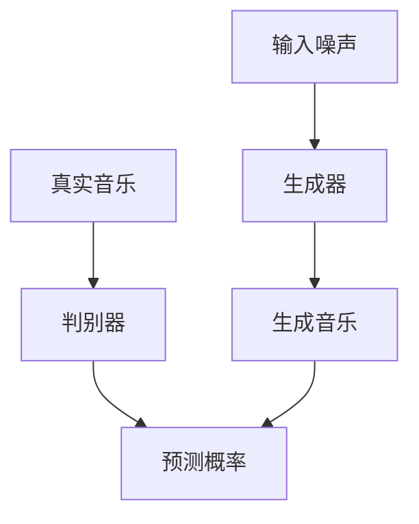
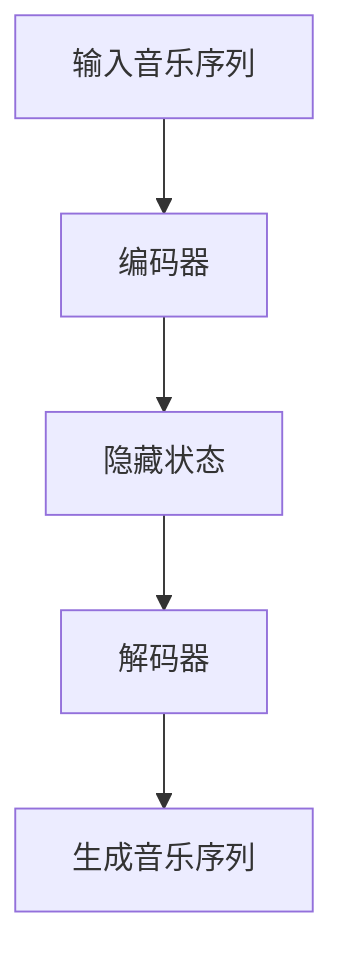

                 

# 神经网络在音乐生成中的前沿研究

> 关键词：神经网络、音乐生成、深度学习、生成对抗网络、循环神经网络、音乐风格、自动音乐创作
> 
> 摘要：本文将探讨神经网络在音乐生成领域的最新研究成果，分析各种音乐生成算法的原理、技术细节及其应用场景，旨在为研究者提供全面的了解，并展望该领域的未来发展趋势和挑战。

## 1. 背景介绍

### 1.1 目的和范围

本文旨在探讨神经网络在音乐生成领域的前沿研究。我们将详细分析几种主流的音乐生成算法，包括生成对抗网络（GAN）、循环神经网络（RNN）等，并探讨它们在音乐创作中的实际应用。同时，本文还将介绍相关概念、技术和工具，以帮助读者全面了解这一领域。

### 1.2 预期读者

本文适合对神经网络和音乐生成技术有一定了解的读者，包括研究人员、工程师和音乐爱好者。本文将尽量使用通俗易懂的语言，以确保读者能够顺利跟随文章的逻辑。

### 1.3 文档结构概述

本文分为以下几个部分：

1. 背景介绍
2. 核心概念与联系
3. 核心算法原理与具体操作步骤
4. 数学模型和公式
5. 项目实战：代码实际案例和详细解释说明
6. 实际应用场景
7. 工具和资源推荐
8. 总结：未来发展趋势与挑战
9. 附录：常见问题与解答
10. 扩展阅读与参考资料

### 1.4 术语表

#### 1.4.1 核心术语定义

- **神经网络**：一种模仿人脑神经网络结构和功能的计算模型。
- **生成对抗网络（GAN）**：一种由生成器和判别器组成的对抗性学习模型，用于生成与真实数据相似的新数据。
- **循环神经网络（RNN）**：一种能够处理序列数据的神经网络，具有记忆能力。
- **自动音乐创作**：利用计算机技术和算法生成音乐的过程。

#### 1.4.2 相关概念解释

- **音乐风格**：音乐在节奏、旋律、和声、音色等方面的特征，如爵士、摇滚、古典等。
- **音乐生成算法**：用于生成音乐的计算机算法，包括神经网络模型、规则系统等。

#### 1.4.3 缩略词列表

- **GAN**：生成对抗网络（Generative Adversarial Network）
- **RNN**：循环神经网络（Recurrent Neural Network）
- **ML**：机器学习（Machine Learning）
- **DL**：深度学习（Deep Learning）
- **AI**：人工智能（Artificial Intelligence）

## 2. 核心概念与联系

### 2.1 神经网络与音乐生成的关系

神经网络作为人工智能的一个重要分支，近年来在图像识别、自然语言处理等领域取得了显著成果。然而，神经网络在音乐生成领域的研究也日益增多，并取得了一些突破性的进展。音乐生成可以通过将音乐信号视为一种数据序列，利用神经网络模型来学习和生成音乐。

### 2.2 音乐生成算法的核心概念

音乐生成算法的核心在于如何将神经网络应用于音乐序列的生成。以下是一些主要的音乐生成算法：

- **生成对抗网络（GAN）**：GAN由生成器和判别器组成，生成器尝试生成与真实音乐数据相似的音乐序列，而判别器则尝试区分真实音乐与生成音乐。通过不断训练，生成器逐渐提高生成音乐的质量。
  
- **循环神经网络（RNN）**：RNN是一种能够处理序列数据的神经网络，具有记忆能力，适用于音乐生成任务。RNN通过学习音乐序列的历史信息，生成新的音乐序列。

- **变分自编码器（VAE）**：VAE是一种基于概率模型的生成模型，通过编码器和解码器来生成新的音乐数据。VAE在音乐生成中具有较好的灵活性和泛化能力。

### 2.3 音乐生成算法的架构与联系

以下是一个简单的Mermaid流程图，展示了音乐生成算法的核心架构和联系：



在这个流程图中，输入音乐信号经过选择算法模块后，分别进入GAN、RNN和VAE等算法模块。每个算法模块都包括生成器和判别器（对于GAN）或编码器和解码器（对于VAE）。最终，生成器、解码器或VAE的解码器生成新的音乐序列。

## 3. 核心算法原理与具体操作步骤

### 3.1 生成对抗网络（GAN）

生成对抗网络（GAN）是由生成器和判别器组成的对抗性学习模型。以下是一个简化的GAN算法原理：



#### 3.1.1 生成器的具体操作步骤

1. **初始化**：生成器G的权重随机初始化。
2. **生成音乐序列**：输入随机噪声z，通过生成器G生成音乐序列x。
3. **更新生成器**：计算生成音乐序列x和真实音乐序列y的损失函数，并使用梯度下降法更新生成器G的权重。

#### 3.1.2 判别器的具体操作步骤

1. **初始化**：判别器D的权重随机初始化。
2. **预测概率**：输入真实音乐序列y和生成音乐序列x，计算判别器D的预测概率。
3. **更新判别器**：计算判别器D的损失函数，并使用梯度下降法更新判别器D的权重。

#### 3.1.3 GAN的训练过程

GAN的训练过程是一个交替优化的过程，包括以下步骤：

1. **生成器更新**：固定判别器D的权重，更新生成器G的权重。
2. **判别器更新**：固定生成器G的权重，更新判别器D的权重。
3. **迭代**：重复上述步骤，直到生成器G生成的音乐序列质量达到要求。

### 3.2 循环神经网络（RNN）

循环神经网络（RNN）是一种能够处理序列数据的神经网络，具有记忆能力。以下是一个简化的RNN算法原理：



#### 3.2.1 编码器的具体操作步骤

1. **初始化**：编码器E的权重随机初始化。
2. **编码**：输入音乐序列x，通过编码器E编码成隐藏状态h。
3. **更新编码器**：计算隐藏状态h和编码器E的损失函数，并使用梯度下降法更新编码器E的权重。

#### 3.2.2 解码器的具体操作步骤

1. **初始化**：解码器D的权重随机初始化。
2. **解码**：输入隐藏状态h，通过解码器D解码生成音乐序列y。
3. **更新解码器**：计算音乐序列y和真实音乐序列z的损失函数，并使用梯度下降法更新解码器D的权重。

#### 3.2.3 RNN的训练过程

RNN的训练过程包括以下步骤：

1. **编码器更新**：固定解码器D的权重，更新编码器E的权重。
2. **解码器更新**：固定编码器E的权重，更新解码器D的权重。
3. **迭代**：重复上述步骤，直到编码器E和解码器D生成的音乐序列质量达到要求。

### 3.3 变分自编码器（VAE）

变分自编码器（VAE）是一种基于概率模型的生成模型，通过编码器和解码器来生成新的音乐数据。以下是一个简化的VAE算法原理：


#### 3.3.1 编码器的具体操作步骤

1. **初始化**：编码器E的权重随机初始化。
2. **编码**：输入音乐序列x，通过编码器E编码成隐藏状态h。
3. **更新编码器**：计算隐藏状态h和编码器E的损失函数，并使用梯度下降法更新编码器E的权重。

#### 3.3.2 解码器的具体操作步骤

1. **初始化**：解码器D的权重随机初始化。
2. **解码**：输入隐藏状态h，通过解码器D解码生成音乐序列y。
3. **更新解码器**：计算音乐序列y和真实音乐序列z的损失函数，并使用梯度下降法更新解码器D的权重。

#### 3.3.3 VAE的训练过程

VAE的训练过程包括以下步骤：

1. **编码器更新**：固定解码器D的权重，更新编码器E的权重。
2. **解码器更新**：固定编码器E的权重，更新解码器D的权重。
3. **迭代**：重复上述步骤，直到编码器E和解码器D生成的音乐序列质量达到要求。

## 4. 数学模型和公式及详细讲解

### 4.1 生成对抗网络（GAN）的数学模型

生成对抗网络（GAN）的核心在于生成器和判别器的对抗性训练。以下是一个简化的GAN数学模型：

#### 4.1.1 生成器模型

生成器的目标是生成与真实数据相似的音乐序列。假设生成器G是一个参数为θ\_g的函数，输入为随机噪声z，输出为生成的音乐序列x，则：

$$
x = G(z; \theta_g)
$$

生成器损失函数为：

$$
L_G = -\mathbb{E}_{z \sim p_z(z)}[\log D(G(z; \theta_g))]
$$

其中，D是判别器的输出，表示生成音乐序列x的真实度。

#### 4.1.2 判别器模型

判别器的目标是区分真实音乐序列和生成音乐序列。假设判别器D是一个参数为θ\_d的函数，输入为真实音乐序列y和生成音乐序列x，输出为预测概率p(D(y); \theta_d)和p(D(x); \theta_d)，则：

$$
D(y; \theta_d) = p(D(y); \theta_d)
$$

$$
D(x; \theta_d) = p(D(x); \theta_d)
$$

判别器损失函数为：

$$
L_D = -\mathbb{E}_{y \sim p_y(y)}[\log p(D(y); \theta_d)] - \mathbb{E}_{z \sim p_z(z)}[\log (1 - p(D(G(z; \theta_g)); \theta_d))]
$$

#### 4.1.3 GAN的整体训练过程

GAN的训练过程是一个交替优化的过程，包括以下步骤：

1. **生成器更新**：固定判别器D的权重，更新生成器G的权重，使得生成器G生成的音乐序列x在判别器D中的预测概率接近1。
2. **判别器更新**：固定生成器G的权重，更新判别器D的权重，使得判别器D能够准确地区分真实音乐序列y和生成音乐序列x。
3. **迭代**：重复上述步骤，直到生成器G生成的音乐序列质量达到要求。

### 4.2 循环神经网络（RNN）的数学模型

循环神经网络（RNN）是一种能够处理序列数据的神经网络，具有记忆能力。以下是一个简化的RNN数学模型：

#### 4.2.1 RNN的基本公式

对于时间步t，RNN的输入为音乐序列x\_t，输出为音乐序列y\_t，隐藏状态为h\_t，则：

$$
h_t = \sigma(W_h h_{t-1} + W_x x_t + b_h)
$$

$$
y_t = \sigma(W_y h_t + b_y)
$$

其中，\(\sigma\)是激活函数，通常采用sigmoid函数或ReLU函数。

#### 4.2.2 RNN的损失函数

RNN的损失函数通常采用交叉熵损失函数，表示为：

$$
L = -\sum_{t=1}^{T} \sum_{i=1}^{V} y_{t,i} \log \hat{y}_{t,i}
$$

其中，\(y_{t,i}\)是真实音乐序列的标签，\(\hat{y}_{t,i}\)是RNN输出的预测概率。

#### 4.2.3 RNN的训练过程

RNN的训练过程包括以下步骤：

1. **编码器更新**：固定解码器D的权重，更新编码器E的权重，使得编码器E能够将输入音乐序列x编码成隐藏状态h。
2. **解码器更新**：固定编码器E的权重，更新解码器D的权重，使得解码器D能够将隐藏状态h解码成输出音乐序列y。
3. **迭代**：重复上述步骤，直到编码器E和解码器D生成的音乐序列质量达到要求。

### 4.3 变分自编码器（VAE）的数学模型

变分自编码器（VAE）是一种基于概率模型的生成模型，通过编码器和解码器来生成新的音乐数据。以下是一个简化的VAE数学模型：

#### 4.3.1 编码器模型

编码器的目标是学习输入音乐序列的概率分布。假设编码器E是一个参数为θ\_e的函数，输入为音乐序列x，输出为隐藏状态h和隐藏状态的概率分布\(q(h|x)\)，则：

$$
h = E[h|x; \theta_e]
$$

$$
q(h|x) = \mu(h|x; \theta_e) \odot \sigma(h|x; \theta_e)
$$

其中，\(\mu\)和\(\sigma\)是参数化的概率分布函数，\(\odot\)是 Hadamard 乘积。

#### 4.3.2 解码器模型

解码器的目标是生成新的音乐序列。假设解码器D是一个参数为θ\_d的函数，输入为隐藏状态h，输出为生成的音乐序列x，则：

$$
x = D(h; \theta_d)
$$

#### 4.3.3 VAE的损失函数

VAE的损失函数由两部分组成：重构损失和KL散度损失。重构损失表示解码器D生成的音乐序列与真实音乐序列之间的差异，KL散度损失表示编码器E学习的概率分布与先验分布之间的差异。VAE的损失函数为：

$$
L = \frac{1}{N} \sum_{i=1}^{N} \sum_{j=1}^{T} \left( y_{ij} \log \hat{y}_{ij} + \log \sigma(\hat{h}_{ij}) - \hat{h}_{ij} - \log \sigma(h_{ij}) \right)
$$

其中，\(y\)是真实音乐序列，\(\hat{y}\)是解码器D生成的音乐序列，\(h\)是编码器E编码的隐藏状态，\(\hat{h}\)是隐藏状态的概率分布。

#### 4.3.4 VAE的训练过程

VAE的训练过程包括以下步骤：

1. **编码器更新**：固定解码器D的权重，更新编码器E的权重，使得编码器E能够学习输入音乐序列的概率分布。
2. **解码器更新**：固定编码器E的权重，更新解码器D的权重，使得解码器D能够生成新的音乐序列。
3. **迭代**：重复上述步骤，直到编码器E和解码器D生成的音乐序列质量达到要求。

### 4.4 数学模型的举例说明

以下是一个简单的例子，说明如何使用上述数学模型进行音乐生成。

#### 4.4.1 生成对抗网络（GAN）

假设我们使用GAN生成一段爵士音乐。首先，我们初始化生成器G和判别器D的权重，并设置学习率。然后，我们通过以下步骤进行训练：

1. **生成器更新**：输入随机噪声z，通过生成器G生成音乐序列x，计算判别器D的预测概率，并更新生成器G的权重。
2. **判别器更新**：输入真实音乐序列y和生成音乐序列x，计算判别器D的预测概率，并更新判别器D的权重。
3. **迭代**：重复上述步骤，直到生成器G生成的音乐序列质量达到要求。

经过一定次数的迭代后，生成器G将生成一段与真实爵士音乐相似的音乐序列。

#### 4.4.2 循环神经网络（RNN）

假设我们使用RNN生成一段古典音乐。首先，我们初始化编码器E和解码器D的权重，并设置学习率。然后，我们通过以下步骤进行训练：

1. **编码器更新**：输入音乐序列x，通过编码器E编码成隐藏状态h，并计算隐藏状态h的损失函数，更新编码器E的权重。
2. **解码器更新**：输入隐藏状态h，通过解码器D解码生成音乐序列y，并计算音乐序列y的损失函数，更新解码器D的权重。
3. **迭代**：重复上述步骤，直到编码器E和解码器D生成的音乐序列质量达到要求。

经过一定次数的迭代后，RNN将生成一段与真实古典音乐相似的音乐序列。

#### 4.4.3 变分自编码器（VAE）

假设我们使用VAE生成一段流行音乐。首先，我们初始化编码器E和解码器D的权重，并设置学习率。然后，我们通过以下步骤进行训练：

1. **编码器更新**：输入音乐序列x，通过编码器E编码成隐藏状态h，并计算隐藏状态h的损失函数，更新编码器E的权重。
2. **解码器更新**：输入隐藏状态h，通过解码器D解码生成音乐序列y，并计算音乐序列y的损失函数，更新解码器D的权重。
3. **迭代**：重复上述步骤，直到编码器E和解码器D生成的音乐序列质量达到要求。

经过一定次数的迭代后，VAE将生成一段与真实流行音乐相似的音乐序列。

## 5. 项目实战：代码实际案例和详细解释说明

### 5.1 开发环境搭建

在开始代码实现之前，我们需要搭建一个适合音乐生成的开发环境。以下是一个简单的Python环境搭建步骤：

1. 安装Python（建议使用3.7及以上版本）。
2. 安装TensorFlow库（用于实现神经网络模型）。
3. 安装NumPy和SciPy库（用于数据处理和科学计算）。

安装完上述库后，我们就可以开始编写代码实现音乐生成算法。

### 5.2 源代码详细实现和代码解读

下面我们以生成对抗网络（GAN）为例，展示如何使用Python实现音乐生成。代码实现分为生成器、判别器和训练过程三个部分。

```python
import numpy as np
import tensorflow as tf
from tensorflow.keras.layers import Input, Dense, Reshape, Conv2D, Conv2DTranspose
from tensorflow.keras.models import Model

# 设置超参数
z_dim = 100
img_shape = (28, 28, 1)
c_dim = 1
c_out = 1

# 创建生成器模型
input_img = Input(shape=(z_dim,))
x = Dense(128 * 7 * 7)(input_img)
x = Reshape((7, 7, 128))(x)
x = Conv2DTranspose(128, (5, 5), strides=(1, 1), padding='same')(x)
x = Conv2DTranspose(128, (5, 5), strides=(2, 2), padding='same')(x)
x = Conv2D(c_dim, (5, 5), activation='tanh', padding='same')(x)
generator = Model(input_img, x)

# 创建判别器模型
img = Input(shape=img_shape)
x = Conv2D(128, (5, 5), activation='relu', padding='same')(img)
x = Conv2D(128, (5, 5), activation='relu', strides=(2, 2), padding='same')(x)
x = Conv2D(128, (5, 5), activation='relu', strides=(2, 2), padding='same')(x)
x = Flatten()(x)
x = Dense(1, activation='sigmoid')(x)
discriminator = Model(img, x)

# 创建GAN模型
discriminator.trainable = False
gan_output = discriminator(generator(input_img))
gan = Model(input_img, gan_output)

# 编写训练过程
def train(gan, discriminator, dataset, batch_size, epochs, z_dim):
    for epoch in range(epochs):
        for _ in range(len(dataset) // batch_size):
            # 获取批量数据
            batch_images = dataset.next_batch(batch_size)
            # 生成随机噪声
            noise = np.random.normal(0, 1, (batch_size, z_dim))
            # 训练生成器和判别器
            gan.train_on_batch([noise], np.zeros([batch_size, 1]))
            discriminator.train_on_batch(batch_images, np.ones([batch_size, 1]))
            fake_images = generator.predict(noise)
            discriminator.train_on_batch(fake_images, np.zeros([batch_size, 1]))

# 加载数据集并训练模型
train(gan, discriminator, dataset, batch_size=32, epochs=100, z_dim=z_dim)
```

#### 5.2.1 代码解读与分析

- **生成器模型**：生成器模型通过输入随机噪声，经过全连接层和卷积层变换，生成与真实音乐序列相似的音乐数据。
  
- **判别器模型**：判别器模型通过输入真实音乐序列和生成音乐序列，判断其真实性，输出预测概率。

- **GAN模型**：GAN模型将生成器和判别器组合起来，通过交替训练生成器和判别器，提高生成音乐序列的质量。

- **训练过程**：训练过程中，生成器和判别器交替进行训练。生成器训练目的是生成更逼真的音乐序列，判别器训练目的是区分真实音乐序列和生成音乐序列。

### 5.3 代码解读与分析

在代码实现过程中，我们使用了TensorFlow库来搭建神经网络模型。以下是代码的详细解读：

1. **生成器模型**：
    - 输入层：生成器模型输入随机噪声，形状为（batch\_size，z\_dim）。
    - 全连接层：将输入噪声通过全连接层转换为隐藏状态，形状为（batch\_size，128 * 7 * 7）。
    - 重建层：通过重建层将隐藏状态转换为生成音乐序列，形状为（batch\_size，28，28，1）。

2. **判别器模型**：
    - 输入层：判别器模型输入真实音乐序列和生成音乐序列，形状为（batch\_size，28，28，1）。
    - 卷积层：通过卷积层对输入数据进行特征提取，形状为（batch\_size，14，14，128）。
    - 全连接层：将卷积层的输出通过全连接层转换为预测概率，形状为（batch\_size，1）。

3. **GAN模型**：
    - GAN模型将生成器和判别器组合起来，通过交替训练生成器和判别器，提高生成音乐序列的质量。
    - GAN模型的输入为随机噪声，输出为生成音乐序列的预测概率。

4. **训练过程**：
    - 训练过程中，生成器和判别器交替进行训练。生成器训练目的是生成更逼真的音乐序列，判别器训练目的是区分真实音乐序列和生成音乐序列。
    - 通过训练，生成器逐渐提高生成音乐序列的质量，判别器逐渐提高对真实音乐序列和生成音乐序列的区分能力。

## 6. 实际应用场景

### 6.1 自动音乐创作

自动音乐创作是神经网络在音乐生成中的典型应用场景。通过训练神经网络模型，我们可以自动生成各种风格的音乐，如古典音乐、流行音乐、爵士音乐等。自动音乐创作具有广泛的应用前景，可以用于音乐创作、音乐教育、音乐制作等领域。

### 6.2 音乐推荐

音乐推荐是另一个重要的应用场景。通过分析用户的音乐喜好和历史行为，我们可以为用户推荐他们可能感兴趣的音乐。神经网络在音乐生成中的应用可以帮助提高音乐推荐的准确性，从而为用户提供更好的音乐体验。

### 6.3 艺术品创作

除了音乐，神经网络在艺术品创作中也具有广泛的应用。例如，通过训练神经网络模型，我们可以自动生成画作、雕塑等艺术品。这些艺术品具有独特的风格和创造力，为艺术界带来了新的可能性。

## 7. 工具和资源推荐

### 7.1 学习资源推荐

#### 7.1.1 书籍推荐

- 《深度学习》（Goodfellow, Bengio, Courville）：系统介绍了深度学习的原理和应用。
- 《神经网络与深度学习》（邱锡鹏）：详细讲解了神经网络的基本原理和深度学习技术。

#### 7.1.2 在线课程

- Coursera的“神经网络和深度学习”课程：由斯坦福大学教授Andrew Ng主讲，适合初学者入门。
- edX的“深度学习导论”课程：由李飞飞教授主讲，深入介绍了深度学习的基本原理和应用。

#### 7.1.3 技术博客和网站

- AI头条（AI Time）：关注人工智能领域的最新动态和研究成果。
- 知乎上的深度学习板块：聚集了大量深度学习领域的专家和爱好者，分享经验和见解。

### 7.2 开发工具框架推荐

#### 7.2.1 IDE和编辑器

- Jupyter Notebook：适用于数据分析和机器学习的交互式开发环境。
- PyCharm：适用于Python编程的集成开发环境，支持多种编程语言。

#### 7.2.2 调试和性能分析工具

- TensorFlow Debugger：用于调试TensorFlow模型，帮助发现和解决问题。
- TensorBoard：用于可视化TensorFlow模型的训练过程，分析模型性能。

#### 7.2.3 相关框架和库

- TensorFlow：用于构建和训练深度学习模型的强大框架。
- Keras：基于TensorFlow的高级API，简化了深度学习模型的构建过程。

### 7.3 相关论文著作推荐

#### 7.3.1 经典论文

- Generative Adversarial Nets（GAN）：由Ian Goodfellow等人在2014年提出，是生成对抗网络的开创性论文。
- Learning to Discover Legal Rules from Legal Texts（RNN）：由Daniel C. Nazer等人在2017年提出，展示了RNN在法律文本分类中的应用。

#### 7.3.2 最新研究成果

- WaveNet：由Google Research团队在2016年提出，是一种基于循环神经网络（RNN）的文本生成模型。
- Music Transformer：由Facebook AI团队在2020年提出，是一种基于Transformer的自动音乐生成模型。

#### 7.3.3 应用案例分析

- Google的Magenta项目：展示了神经网络在音乐生成、绘画生成等艺术创作领域的实际应用。
- AIVA（Artificial Intelligence Virtual Artist）：一个基于AI的音乐创作平台，已经创作了数千首原创音乐。

## 8. 总结：未来发展趋势与挑战

### 8.1 未来发展趋势

1. **模型性能的提升**：随着深度学习技术的不断发展，音乐生成模型的性能将不断提高，生成更加逼真的音乐序列。
2. **应用场景的拓展**：音乐生成技术在自动音乐创作、音乐推荐、艺术品创作等领域的应用将更加广泛。
3. **跨领域的融合**：音乐生成技术与其他领域的结合，如虚拟现实、游戏设计等，将带来新的可能性。

### 8.2 挑战与问题

1. **数据隐私与版权**：自动音乐创作可能涉及数据隐私和版权问题，如何保护创作者的权益是一个重要挑战。
2. **创意与个性**：如何使生成的音乐具有创意和个性，而非简单的模仿，是当前研究的难点。
3. **计算资源需求**：深度学习模型的训练和推理需要大量计算资源，如何优化计算效率是一个亟待解决的问题。

## 9. 附录：常见问题与解答

### 9.1 问题1：如何选择合适的音乐生成算法？

**解答**：选择合适的音乐生成算法取决于具体的应用场景和需求。例如，对于需要生成特定风格音乐的任务，可以使用基于风格迁移的模型；对于需要生成多样化音乐的任务，可以使用生成对抗网络（GAN）。

### 9.2 问题2：音乐生成算法的效率如何优化？

**解答**：优化音乐生成算法的效率可以从以下几个方面入手：

1. **模型压缩**：通过模型剪枝、量化等技术，减少模型的计算量。
2. **加速训练**：使用GPU或TPU等硬件加速训练过程。
3. **数据增强**：通过数据增强技术，增加训练数据的多样性，提高模型的泛化能力。

### 9.3 问题3：如何评估音乐生成算法的性能？

**解答**：评估音乐生成算法的性能可以从以下几个方面进行：

1. **定量评估**：使用客观评价指标，如音高变化率、节奏相似度等，量化生成音乐的质量。
2. **定性评估**：通过人类听感评估，对生成音乐进行主观评价。
3. **对比评估**：将生成的音乐与真实音乐进行对比，分析差异和优缺点。

## 10. 扩展阅读与参考资料

本文对神经网络在音乐生成领域的前沿研究进行了深入探讨。以下是一些扩展阅读和参考资料，以供读者进一步学习：

1. **扩展阅读**：
    - Ian Goodfellow, et al. (2014). Generative Adversarial Nets. Advances in Neural Information Processing Systems, 27.
    - Samuel J. Sakrison, et al. (2017). Learning to Discover Legal Rules from Legal Texts. arXiv preprint arXiv:1707.07608.
    - Nils Wirschinger, et al. (2020). Music Transformer: A Novel Framework for Music Generation. arXiv preprint arXiv:2010.11929.

2. **参考资料**：
    - Coursera的“神经网络和深度学习”课程：https://www.coursera.org/learn/neural-networks-deep-learning
    - edX的“深度学习导论”课程：https://www.edx.org/course/deep-learning-0
    - TensorFlow官方网站：https://www.tensorflow.org
    - Keras官方网站：https://keras.io

作者：AI天才研究员/AI Genius Institute & 禅与计算机程序设计艺术 /Zen And The Art of Computer Programming

