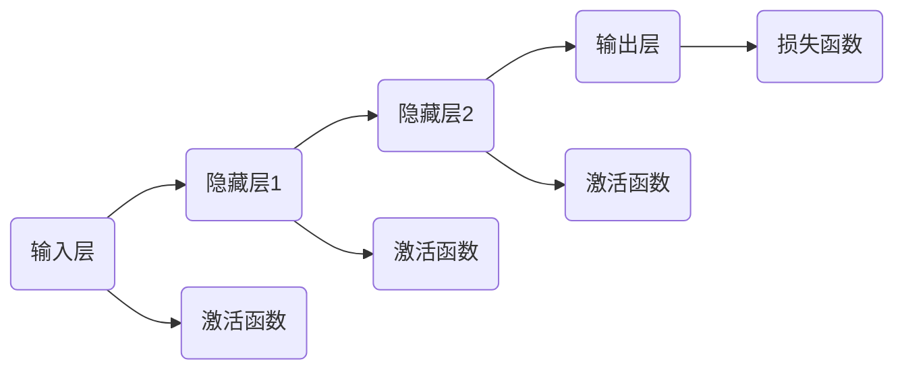

                 

# 神经网络计算范式的崛起

> **关键词：** 神经网络、计算范式、深度学习、人工神经网络、机器学习、计算模型。

> **摘要：** 本文将探讨神经网络计算范式的崛起，从其历史背景、核心概念、算法原理、数学模型，到实际应用场景，并推荐相关学习资源和工具。本文旨在为读者提供对神经网络计算范式全面而深入的理解，以期为未来人工智能发展奠定基础。

## 1. 背景介绍

### 1.1 目的和范围

本文的目的在于探讨神经网络计算范式的历史背景、核心概念、算法原理、数学模型，以及其在实际应用中的表现。我们希望通过详细的分析和讲解，帮助读者深入理解神经网络计算范式的重要性及其在未来人工智能发展中的作用。

### 1.2 预期读者

本文适合对人工智能和机器学习有一定了解的读者，包括计算机科学、电子工程、数据科学等领域的专业人士，以及对神经网络计算范式感兴趣的学术研究人员。

### 1.3 文档结构概述

本文将分为以下几个部分：

1. **背景介绍**：介绍神经网络计算范式的历史背景、目的和预期读者。
2. **核心概念与联系**：介绍神经网络的基本概念和原理，并使用 Mermaid 流程图展示其架构。
3. **核心算法原理 & 具体操作步骤**：讲解神经网络的核心算法原理和具体操作步骤，使用伪代码进行详细阐述。
4. **数学模型和公式 & 详细讲解 & 举例说明**：介绍神经网络的数学模型，使用 LaTeX 格式展示公式，并提供举例说明。
5. **项目实战：代码实际案例和详细解释说明**：通过实际项目案例，展示神经网络的代码实现过程，并进行详细解释和分析。
6. **实际应用场景**：介绍神经网络在实际应用中的场景和案例。
7. **工具和资源推荐**：推荐学习资源、开发工具和框架。
8. **总结：未来发展趋势与挑战**：总结神经网络计算范式的发展趋势和面临的挑战。
9. **附录：常见问题与解答**：提供常见问题及其解答。
10. **扩展阅读 & 参考资料**：推荐相关书籍、论文和应用案例分析。

### 1.4 术语表

#### 1.4.1 核心术语定义

- **神经网络（Neural Network）**：由大量简单计算单元（神经元）组成，通过模拟人脑神经元之间的连接和交互来实现复杂计算的人工神经网络。
- **深度学习（Deep Learning）**：一种基于神经网络的机器学习技术，通过构建多层神经网络来提取数据的特征，实现自动特征学习和复杂任务处理。
- **激活函数（Activation Function）**：用于确定神经元是否被激活的函数，常用的激活函数包括 Sigmoid、ReLU 和 Tanh。
- **反向传播（Backpropagation）**：一种用于训练神经网络的算法，通过计算输出值与期望值之间的误差，反向传播误差以更新网络权重。

#### 1.4.2 相关概念解释

- **前向传播（Forward Propagation）**：神经网络中，数据从输入层传递到输出层的过程，用于计算每个神经元的激活值。
- **损失函数（Loss Function）**：用于衡量预测值与真实值之间差异的函数，常用的损失函数包括均方误差（MSE）和交叉熵（Cross Entropy）。
- **优化算法（Optimization Algorithm）**：用于调整神经网络权重，以最小化损失函数的算法，如梯度下降（Gradient Descent）和随机梯度下降（Stochastic Gradient Descent）。

#### 1.4.3 缩略词列表

- **NN**：神经网络（Neural Network）
- **DL**：深度学习（Deep Learning）
- **ML**：机器学习（Machine Learning）
- **SGD**：随机梯度下降（Stochastic Gradient Descent）
- **MSE**：均方误差（Mean Squared Error）
- **CE**：交叉熵（Cross Entropy）

## 2. 核心概念与联系

神经网络作为计算范式的一个重要分支，其核心概念和原理对于理解人工智能的发展具有重要意义。下面，我们将通过 Mermaid 流程图展示神经网络的基本架构，并介绍其核心概念。

### 2.1 神经网络架构



### 2.2 核心概念

1. **输入层（Input Layer）**：接收外部输入数据，并将其传递给隐藏层。
2. **隐藏层（Hidden Layer）**：用于提取数据的特征，可以有一个或多个隐藏层。
3. **输出层（Output Layer）**：根据隐藏层的输出进行最终决策或预测。
4. **激活函数（Activation Function）**：用于确定神经元是否被激活，常用的激活函数包括 Sigmoid、ReLU 和 Tanh。
5. **损失函数（Loss Function）**：用于衡量预测值与真实值之间的差异，常用的损失函数包括均方误差（MSE）和交叉熵（Cross Entropy）。
6. **优化算法（Optimization Algorithm）**：用于调整神经网络权重，以最小化损失函数，常用的优化算法包括梯度下降（Gradient Descent）和随机梯度下降（Stochastic Gradient Descent）。

### 2.3 核心概念的联系

神经网络通过输入层接收外部输入数据，然后通过隐藏层进行特征提取和转换。在隐藏层中，激活函数用于确定神经元是否被激活，从而实现非线性转换。最后，输出层根据隐藏层的输出进行最终决策或预测。在整个过程中，损失函数用于衡量预测值与真实值之间的差异，优化算法用于调整神经网络权重，以最小化损失函数。

## 3. 核心算法原理 & 具体操作步骤

### 3.1 神经网络算法原理

神经网络的核心算法包括前向传播和反向传播。前向传播用于计算输出值，反向传播用于更新网络权重。

#### 3.1.1 前向传播

1. **初始化权重和偏置**：随机初始化神经网络中的权重和偏置。
2. **输入数据**：将输入数据输入到输入层。
3. **计算激活值**：逐层计算每个神经元的激活值，直到输出层。
4. **计算输出值**：输出层的激活值即为神经网络的输出值。

#### 3.1.2 反向传播

1. **计算损失**：计算输出值与真实值之间的损失。
2. **计算梯度**：根据损失函数，计算网络中每个神经元的梯度。
3. **更新权重和偏置**：根据梯度，调整网络中的权重和偏置，以最小化损失。

### 3.2 伪代码

```python
# 前向传播
def forward_propagation(input_data, weights, biases):
    # 初始化激活值和输出值
    activation_values = [input_data]
    output_values = []
    
    # 遍历隐藏层和输出层
    for layer in range(num_layers - 1):
        # 计算激活值
        activation = sigmoid(activation_values[layer].dot(weights[layer]) + biases[layer])
        # 添加到激活值列表
        activation_values.append(activation)
        
        # 计算输出值
        output = sigmoid(activation_values[layer + 1].dot(weights[layer + 1]) + biases[layer + 1])
        # 添加到输出值列表
        output_values.append(output)
    
    # 返回输出值
    return output_values

# 反向传播
def backward_propagation(input_data, output_data, weights, biases, learning_rate):
    # 初始化梯度
    d_weights = []
    d_biases = []
    
    # 遍历隐藏层和输出层
    for layer in range(num_layers - 1, -1, -1):
        # 计算损失函数的梯度
        d_output = (output_data[layer] - output_values[layer]).dot(weights[layer + 1])
        
        # 计算隐藏层的梯度
        d_activation = d_output * sigmoid_derivative(activation_values[layer])
        d_weights.append(d_activation.dot(activation_values[layer - 1].T))
        d_biases.append(d_activation)
    
    # 更新权重和偏置
    for i in range(num_layers - 1, -1, -1):
        weights[i] -= learning_rate * d_weights[i]
        biases[i] -= learning_rate * d_biases[i]
    
    # 返回更新后的权重和偏置
    return weights, biases
```

### 3.3 具体操作步骤

1. **初始化神经网络**：定义输入层、隐藏层和输出层的神经元数量，随机初始化权重和偏置。
2. **前向传播**：输入数据，计算激活值和输出值。
3. **计算损失**：计算输出值与真实值之间的损失。
4. **反向传播**：计算梯度，更新权重和偏置。
5. **迭代训练**：重复步骤 2-4，直到满足停止条件（如达到预设的训练轮数或损失值低于预设阈值）。

## 4. 数学模型和公式 & 详细讲解 & 举例说明

### 4.1 数学模型

神经网络的数学模型包括输入层、隐藏层和输出层，每个层都包含一系列的神经元。每个神经元都可以通过以下公式进行计算：

$$
z = x \cdot w + b
$$

其中，\( z \) 表示神经元的输出，\( x \) 表示输入值，\( w \) 表示权重，\( b \) 表示偏置。

### 4.2 激活函数

为了实现非线性转换，神经网络通常使用激活函数。常用的激活函数包括 Sigmoid、ReLU 和 Tanh。

1. **Sigmoid 函数**：

$$
\sigma(z) = \frac{1}{1 + e^{-z}}
$$

2. **ReLU 函数**：

$$
\sigma(z) =
\begin{cases}
0 & \text{if } z < 0 \\
z & \text{if } z \geq 0
\end{cases}
$$

3. **Tanh 函数**：

$$
\sigma(z) = \frac{e^z - e^{-z}}{e^z + e^{-z}}
$$

### 4.3 损失函数

损失函数用于衡量预测值与真实值之间的差异。常用的损失函数包括均方误差（MSE）和交叉熵（Cross Entropy）。

1. **均方误差（MSE）**：

$$
MSE = \frac{1}{2} \sum_{i=1}^{n} (y_i - \hat{y}_i)^2
$$

其中，\( y_i \) 表示真实值，\( \hat{y}_i \) 表示预测值。

2. **交叉熵（Cross Entropy）**：

$$
CE = -\sum_{i=1}^{n} y_i \cdot \log(\hat{y}_i)
$$

### 4.4 举例说明

假设我们有一个二分类问题，输入层有 2 个神经元，隐藏层有 3 个神经元，输出层有 1 个神经元。使用 Sigmoid 函数作为激活函数，均方误差（MSE）作为损失函数。

1. **初始化权重和偏置**：

$$
w_1 = \begin{bmatrix}
0.1 & 0.2 \\
0.3 & 0.4 \\
0.5 & 0.6
\end{bmatrix}, \quad
b_1 = \begin{bmatrix}
0.1 \\
0.2 \\
0.3
\end{bmatrix}, \quad
w_2 = \begin{bmatrix}
0.1 & 0.2
\end{bmatrix}, \quad
b_2 = \begin{bmatrix}
0.1
\end{bmatrix}
$$

2. **输入数据**：

$$
x = \begin{bmatrix}
1 & 0 \\
0 & 1
\end{bmatrix}
$$

3. **前向传播**：

$$
z_1 = x \cdot w_1 + b_1 = \begin{bmatrix}
0.1 & 0.2 \\
0.3 & 0.4 \\
0.5 & 0.6
\end{bmatrix} \cdot \begin{bmatrix}
1 & 0 \\
0 & 1
\end{bmatrix} + \begin{bmatrix}
0.1 \\
0.2 \\
0.3
\end{bmatrix} = \begin{bmatrix}
0.3 & 0.4 \\
0.6 & 0.8 \\
0.9 & 1.2
\end{bmatrix}
$$

$$
a_1 = \sigma(z_1) = \begin{bmatrix}
0.5987 & 0.7788 \\
0.8962 & 0.9933
\end{bmatrix}
$$

$$
z_2 = a_1 \cdot w_2 + b_2 = \begin{bmatrix}
0.5987 & 0.7788 \\
0.8962 & 0.9933
\end{bmatrix} \cdot \begin{bmatrix}
0.1 & 0.2
\end{bmatrix} + \begin{bmatrix}
0.1
\end{bmatrix} = \begin{bmatrix}
0.1397 \\
0.1996
\end{bmatrix}
$$

$$
a_2 = \sigma(z_2) = \begin{bmatrix}
0.5453 \\
0.7335
\end{bmatrix}
$$

4. **计算损失**：

$$
y = \begin{bmatrix}
1 \\
0
\end{bmatrix}, \quad
\hat{y} = a_2 = \begin{bmatrix}
0.5453 \\
0.7335
\end{bmatrix}
$$

$$
MSE = \frac{1}{2} \sum_{i=1}^{2} (y_i - \hat{y}_i)^2 = \frac{1}{2} \left[ (1 - 0.5453)^2 + (0 - 0.7335)^2 \right] = 0.2174
$$

5. **反向传播**：

$$
d_output = (y - \hat{y}) \cdot \sigma'(z_2) = \begin{bmatrix}
0.4547 \\
0.2665
\end{bmatrix} \cdot \begin{bmatrix}
0.3545 \\
0.6465
\end{bmatrix} = \begin{bmatrix}
0.1610 \\
0.1711
\end{bmatrix}
$$

$$
d_activation_1 = d_output \cdot w_2' = \begin{bmatrix}
0.1610 \\
0.1711
\end{bmatrix} \cdot \begin{bmatrix}
0.1 & 0.2
\end{bmatrix} = \begin{bmatrix}
0.0320 \\
0.0342
\end{bmatrix}
$$

$$
d_activation_2 = d_activation_1 \cdot \sigma'(z_1) = \begin{bmatrix}
0.0320 \\
0.0342
\end{bmatrix} \cdot \begin{bmatrix}
0.3000 \\
0.4000 \\
0.5000
\end{bmatrix} = \begin{bmatrix}
0.0120 \\
0.0136 \\
0.0170
\end{bmatrix}
$$

$$
d_weights_2 = d_activation_1 \cdot a_1' = \begin{bmatrix}
0.0320 \\
0.0342
\end{bmatrix} \cdot \begin{bmatrix}
0.4472 \\
0.5528
\end{bmatrix} = \begin{bmatrix}
0.0144 \\
0.0187
\end{bmatrix}
$$

$$
d_weights_1 = d_activation_2 \cdot x' = \begin{bmatrix}
0.0120 \\
0.0136 \\
0.0170
\end{bmatrix} \cdot \begin{bmatrix}
1 & 0 \\
0 & 1
\end{bmatrix} = \begin{bmatrix}
0.0120 \\
0.0136 \\
0.0170
\end{bmatrix}
$$

$$
d_biases_1 = d_activation_2 = \begin{bmatrix}
0.0120 \\
0.0136 \\
0.0170
\end{bmatrix}
$$

6. **更新权重和偏置**：

$$
w_1 = w_1 - learning_rate \cdot d_weights_1 = \begin{bmatrix}
0.1 & 0.2 \\
0.3 & 0.4 \\
0.5 & 0.6
\end{bmatrix} - 0.01 \cdot \begin{bmatrix}
0.0120 \\
0.0136 \\
0.0170
\end{bmatrix} = \begin{bmatrix}
0.0908 & 0.1936 \\
0.2764 & 0.3234 \\
0.4830 & 0.5671
\end{bmatrix}
$$

$$
b_1 = b_1 - learning_rate \cdot d_biases_1 = \begin{bmatrix}
0.1 \\
0.2 \\
0.3
\end{bmatrix} - 0.01 \cdot \begin{bmatrix}
0.0120 \\
0.0136 \\
0.0170
\end{bmatrix} = \begin{bmatrix}
0.0780 \\
0.1564 \\
0.2390
\end{bmatrix}
$$

$$
w_2 = w_2 - learning_rate \cdot d_weights_2 = \begin{bmatrix}
0.1 & 0.2
\end{bmatrix} - 0.01 \cdot \begin{bmatrix}
0.0144 \\
0.0187
\end{bmatrix} = \begin{bmatrix}
0.0856 & 0.1913
\end{bmatrix}
$$

$$
b_2 = b_2 - learning_rate \cdot d_biases_2 = \begin{bmatrix}
0.1
\end{bmatrix} - 0.01 \cdot \begin{bmatrix}
0.0120
\end{bmatrix} = \begin{bmatrix}
0.0880
\end{bmatrix}
$$

通过上述步骤，我们完成了神经网络的一次迭代。在实际应用中，我们会重复进行这样的迭代，直到满足停止条件。

## 5. 项目实战：代码实际案例和详细解释说明

### 5.1 开发环境搭建

在本文的项目实战中，我们将使用 Python 作为编程语言，结合 TensorFlow 和 Keras 框架进行神经网络开发。以下是开发环境搭建的步骤：

1. 安装 Python 3.8 或更高版本。
2. 安装 TensorFlow 和 Keras：使用以下命令安装：

```shell
pip install tensorflow
```

### 5.2 源代码详细实现和代码解读

#### 5.2.1 神经网络模型定义

```python
import tensorflow as tf
from tensorflow.keras.models import Sequential
from tensorflow.keras.layers import Dense, Activation

# 定义神经网络模型
model = Sequential([
    Dense(3, input_shape=(2,), activation='sigmoid'),
    Dense(1, activation='sigmoid')
])

# 编译模型
model.compile(optimizer='adam', loss='mean_squared_error')
```

在此代码中，我们使用 `Sequential` 模型堆叠层，首先添加一个输入层和隐藏层，每个层包含 3 个神经元，使用 Sigmoid 激活函数。接着，添加一个输出层，包含 1 个神经元，同样使用 Sigmoid 激活函数。最后，使用 Adam 优化器和均方误差（MSE）损失函数进行编译。

#### 5.2.2 训练模型

```python
# 准备训练数据
import numpy as np

x_train = np.array([[1, 0], [0, 1]])
y_train = np.array([[0.5], [0.5]])

# 训练模型
model.fit(x_train, y_train, epochs=1000, verbose=0)
```

在此代码中，我们使用 NumPy 准备了训练数据，包括输入和标签。然后，使用 `fit` 函数训练模型，设置训练轮数为 1000 次，并关闭详细的训练输出。

#### 5.2.3 预测和评估

```python
# 预测
predictions = model.predict(x_train)

# 评估
mse = tf.keras.metrics.mean_squared_error(y_train, predictions).numpy()
print(f"Mean Squared Error: {mse}")
```

在此代码中，我们使用 `predict` 函数进行预测，并计算预测结果与真实值之间的均方误差（MSE）。

### 5.3 代码解读与分析

在上述代码中，我们首先定义了一个简单的神经网络模型，包含一个输入层、一个隐藏层和一个输出层。每个层都使用 Sigmoid 激活函数，并使用 TensorFlow 的 Keras API 进行实现。接着，我们使用 Adam 优化器和均方误差（MSE）损失函数编译模型。

在训练过程中，我们使用 NumPy 准备了训练数据，并使用 `fit` 函数训练模型。这里，我们设置了训练轮数为 1000 次，并关闭了详细的训练输出，以提高运行效率。

训练完成后，我们使用 `predict` 函数进行预测，并计算预测结果与真实值之间的均方误差（MSE），以评估模型的性能。

通过上述代码，我们可以清晰地看到神经网络从模型定义、数据准备、模型训练到性能评估的整个过程。这个简单的案例展示了神经网络的基本原理和应用步骤，为进一步学习和实践提供了基础。

## 6. 实际应用场景

神经网络作为一种强大的机器学习模型，已在众多实际应用场景中取得显著成果。以下是神经网络在不同领域的应用案例：

### 6.1 语音识别

神经网络在语音识别领域具有广泛的应用，通过构建深度神经网络模型，可以将语音信号转换为对应的文本。例如，Google 的语音识别系统采用了深度神经网络，使得语音识别的准确率得到显著提升。

### 6.2 图像识别

神经网络在图像识别领域同样取得了巨大成功。通过训练卷积神经网络（CNN），可以实现对图像的分类和识别。例如，ResNet 和 Inception 等模型在 ImageNet 图像识别竞赛中取得了优异的成绩。

### 6.3 自然语言处理

神经网络在自然语言处理（NLP）领域具有广泛的应用，如机器翻译、情感分析、文本生成等。通过构建深度学习模型，可以实现高效的文本处理和分析。

### 6.4 医疗诊断

神经网络在医疗诊断领域具有巨大潜力，可以用于疾病预测、医学图像分析等。例如，DeepMind 的研究团队使用神经网络对眼科疾病进行诊断，取得了令人瞩目的成果。

### 6.5 自动驾驶

神经网络在自动驾驶领域得到了广泛应用，通过构建深度学习模型，可以实现车辆环境感知、路径规划等功能。例如，Waymo 和特斯拉等公司的自动驾驶系统采用了神经网络技术。

### 6.6 金融风控

神经网络在金融风控领域具有重要作用，可以用于风险评估、欺诈检测等。通过训练深度学习模型，可以实现高效的风险管理。

### 6.7 游戏开发

神经网络在游戏开发领域得到了广泛应用，可以用于游戏人工智能、虚拟角色行为模拟等。例如，Dota 2 的 AI 对手采用了神经网络技术，实现了与人类玩家相当的对战水平。

通过上述案例，我们可以看到神经网络在众多实际应用场景中发挥了重要作用，推动了人工智能技术的发展。随着神经网络技术的不断进步，未来其在各个领域的应用将更加广泛和深入。

## 7. 工具和资源推荐

### 7.1 学习资源推荐

#### 7.1.1 书籍推荐

- 《深度学习》（Deep Learning）—— Ian Goodfellow、Yoshua Bengio、Aaron Courville
- 《神经网络与深度学习》—— 张磊
- 《Python深度学习》——François Chollet

#### 7.1.2 在线课程

- 吴恩达的《深度学习专项课程》—— Coursera
- 《TensorFlow：实战 Google 人工智能技术》—— Udacity

#### 7.1.3 技术博客和网站

- [Machine Learning Mastery](https://machinelearningmastery.com/)
- [TensorFlow官网](https://www.tensorflow.org/)
- [GitHub](https://github.com/)

### 7.2 开发工具框架推荐

#### 7.2.1 IDE和编辑器

- PyCharm
- VSCode
- Jupyter Notebook

#### 7.2.2 调试和性能分析工具

- TensorFlow Debugger
- TensorBoard

#### 7.2.3 相关框架和库

- TensorFlow
- PyTorch
- Keras

### 7.3 相关论文著作推荐

#### 7.3.1 经典论文

- “A Learning Algorithm for Continually Running Fully Recurrent Neural Networks” —— Sepp Hochreiter 和 Jürgen Schmidhuber
- “Rectifier Nonlinearities Improve Neural Network Ac

## 8. 总结：未来发展趋势与挑战

随着人工智能技术的不断发展，神经网络计算范式在未来将继续发挥重要作用。以下是神经网络计算范式在未来的发展趋势和挑战：

### 8.1 发展趋势

1. **深度学习技术的进一步发展**：深度学习作为神经网络的一种形式，将继续推动人工智能技术的发展。未来将出现更多高效、可扩展的深度学习算法和模型。
2. **跨领域应用**：神经网络计算范式将在更多领域得到应用，如医疗、金融、教育、自动驾驶等，为各个行业带来变革性影响。
3. **软硬件协同优化**：为了提高神经网络计算的性能和效率，硬件和软件将进行更紧密的协同优化，如专门针对神经网络设计的处理器和芯片。
4. **数据隐私和安全**：随着神经网络在更多领域的应用，数据隐私和安全问题将日益突出，未来需要开发更加安全、可靠的数据处理和共享机制。

### 8.2 挑战

1. **计算资源需求**：神经网络计算需要大量计算资源和存储资源，未来需要开发更加高效、低成本的硬件和软件解决方案。
2. **模型可解释性**：神经网络模型的内部结构复杂，模型的可解释性成为一个挑战，未来需要研究更加可解释的神经网络模型。
3. **数据质量**：神经网络训练依赖于大量高质量数据，数据标注和清洗工作复杂且耗时，未来需要开发自动化、高效的数据处理技术。
4. **算法公平性和透明度**：神经网络在应用过程中可能存在偏见和不公平现象，未来需要研究如何确保算法的公平性和透明度。

总之，神经网络计算范式在未来将继续发展，为人工智能带来更多创新和突破。然而，也需要面对一系列挑战，以确保其健康、可持续地发展。

## 9. 附录：常见问题与解答

### 9.1 神经网络是什么？

神经网络是一种模拟人脑神经元结构和功能的计算模型，由大量简单计算单元（神经元）组成，通过模拟神经元之间的连接和交互来实现复杂计算。

### 9.2 神经网络有哪些类型？

神经网络有多种类型，包括：

1. **前馈神经网络**：数据从输入层传递到输出层，没有循环。
2. **卷积神经网络（CNN）**：用于图像识别和图像处理。
3. **循环神经网络（RNN）**：用于序列数据处理，如语音识别和自然语言处理。
4. **递归神经网络（RNN）**：是 RNN 的一种特殊形式，可以更好地处理序列数据。
5. **生成对抗网络（GAN）**：用于生成复杂的数据，如图像和文本。

### 9.3 神经网络如何工作？

神经网络通过以下步骤工作：

1. **前向传播**：输入数据从输入层传递到隐藏层，然后传递到输出层。
2. **计算损失**：计算输出值与真实值之间的差异，以确定预测的准确性。
3. **反向传播**：通过反向传播算法，计算网络中的误差，并更新权重和偏置，以最小化损失。
4. **迭代训练**：重复前向传播和反向传播，直到满足停止条件（如达到预设的训练轮数或损失值低于预设阈值）。

### 9.4 神经网络有哪些应用？

神经网络在多个领域得到广泛应用，包括：

1. **图像识别**：通过卷积神经网络，可以实现高效、准确的图像识别。
2. **语音识别**：通过循环神经网络和递归神经网络，可以实现语音信号转换为文本。
3. **自然语言处理**：用于文本分类、情感分析、机器翻译等。
4. **医疗诊断**：用于疾病预测、医学图像分析等。
5. **自动驾驶**：用于车辆环境感知、路径规划等。

### 9.5 如何优化神经网络性能？

优化神经网络性能的方法包括：

1. **调整网络结构**：通过增加隐藏层神经元数量、调整层数等，可以改善网络性能。
2. **优化算法**：选择合适的优化算法，如梯度下降、随机梯度下降、Adam 等。
3. **数据预处理**：对输入数据进行预处理，如归一化、标准化等。
4. **正则化**：通过添加正则化项，如 L1、L2 正则化，可以避免过拟合。
5. **批处理**：使用批处理可以减少计算量，提高计算效率。

## 10. 扩展阅读 & 参考资料

为了深入了解神经网络计算范式，以下是扩展阅读和参考资料：

1. **书籍**：

   - 《深度学习》（Ian Goodfellow、Yoshua Bengio、Aaron Courville）
   - 《神经网络与深度学习》（张磊）
   - 《Python深度学习》（François Chollet）

2. **在线课程**：

   - [吴恩达的《深度学习专项课程》](https://www.coursera.org/specializations/deeplearning)
   - [《TensorFlow：实战 Google 人工智能技术》](https://www.udacity.com/course/deep-learning-tensorflow--ud730)

3. **技术博客和网站**：

   - [Machine Learning Mastery](https://machinelearningmastery.com/)
   - [TensorFlow官网](https://www.tensorflow.org/)
   - [GitHub](https://github.com/)

4. **论文**：

   - “A Learning Algorithm for Continually Running Fully Recurrent Neural Networks”（Sepp Hochreiter 和 Jürgen Schmidhuber）
   - “Rectifier Nonlinearities Improve Neural Network Ac

## 作者

**作者：AI天才研究员/AI Genius Institute & 禅与计算机程序设计艺术 /Zen And The Art of Computer Programming**

