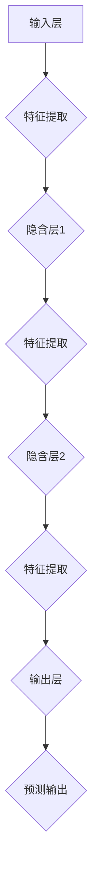

                 

### 神经网络：人工智能的基石

> **关键词**：神经网络、深度学习、反向传播、多层感知器、机器学习、人工智能、数据处理、优化算法
> 
> **摘要**：本文将深入探讨神经网络作为人工智能的核心技术，从基础概念到实际应用，逐步解析神经网络的原理与实现。我们将讨论神经网络的历史发展、核心组成部分、训练过程以及其在各个领域的广泛应用。通过这篇文章，读者将能够理解神经网络的工作机制，掌握其关键算法，并对神经网络在未来的发展趋势和面临的挑战有更深刻的认识。

### 1. 背景介绍

#### 1.1 目的和范围

本文旨在为读者提供一份关于神经网络的全面指南，旨在解答以下问题：
- 神经网络是什么？
- 它是如何工作的？
- 它在人工智能中扮演什么角色？
- 它有哪些核心组成部分？
- 它是如何被训练和优化的？
- 它在各个实际应用领域中的表现如何？

通过本文的阅读，读者将能够对神经网络有一个系统而深入的理解，并掌握神经网络的基本原理和应用技巧。

#### 1.2 预期读者

本文面向对人工智能和机器学习有一定基础的读者，尤其适合以下人群：
- 计算机科学专业的学生和研究人员。
- 机器学习工程师和数据科学家。
- 对人工智能技术感兴趣的程序员和技术爱好者。
- 从事人工智能相关工作的专业人士。

#### 1.3 文档结构概述

本文将分为以下几个部分：
1. **背景介绍**：介绍本文的目的、预期读者和文档结构。
2. **核心概念与联系**：解释神经网络的基本概念，并给出 Mermaid 流程图。
3. **核心算法原理 & 具体操作步骤**：详细阐述神经网络的核心算法原理，并使用伪代码进行说明。
4. **数学模型和公式 & 详细讲解 & 举例说明**：解释神经网络的数学模型，并使用 latex 格式给出相关公式。
5. **项目实战：代码实际案例和详细解释说明**：通过实际案例展示神经网络的实现和应用。
6. **实际应用场景**：探讨神经网络在各个领域的应用。
7. **工具和资源推荐**：推荐学习资源和开发工具。
8. **总结：未来发展趋势与挑战**：总结神经网络的发展趋势和面临的挑战。
9. **附录：常见问题与解答**：提供常见问题的解答。
10. **扩展阅读 & 参考资料**：推荐进一步阅读的资料。

#### 1.4 术语表

在本文中，我们将使用一些专业术语。以下是这些术语的定义和解释：

##### 1.4.1 核心术语定义

- **神经网络（Neural Network）**：一种模拟生物神经系统的计算模型，用于执行复杂的任务，如图像识别、语言处理等。
- **深度学习（Deep Learning）**：一种基于多层神经网络的学习方法，用于解决复杂的问题，如图像识别、语音识别等。
- **反向传播（Backpropagation）**：一种用于训练神经网络的算法，通过反向传播误差信号来更新网络权重。
- **多层感知器（Multilayer Perceptron，MLP）**：一种具有至少一个隐含层的神经网络，用于分类和回归任务。
- **激活函数（Activation Function）**：用于引入非线性性的函数，使神经网络能够学习复杂的模式。
- **损失函数（Loss Function）**：用于评估神经网络输出与真实输出之间的差异，并指导权重的更新。
- **优化算法（Optimization Algorithm）**：用于调整神经网络权重的算法，以最小化损失函数。

##### 1.4.2 相关概念解释

- **节点（Node）**：神经网络中的一个基本单元，用于接收输入、计算输出和传递信息。
- **层（Layer）**：神经网络中的一组节点，按层次排列，用于提取和处理特征。
- **权重（Weight）**：连接两个节点的参数，用于调节输入对输出影响的程度。
- **偏置（Bias）**：每个节点的额外参数，用于引入额外的非线性。
- **批量大小（Batch Size）**：在一次训练过程中，参与训练的样本数量。

##### 1.4.3 缩略词列表

- **CNN**：卷积神经网络（Convolutional Neural Network）
- **RNN**：循环神经网络（Recurrent Neural Network）
- **DNN**：深度神经网络（Deep Neural Network）
- **MLP**：多层感知器（Multilayer Perceptron）
- **GPU**：图形处理单元（Graphics Processing Unit）
- **CPU**：中央处理单元（Central Processing Unit）

接下来，我们将通过一个 Mermaid 流程图来展示神经网络的基本架构和流程。

#### 2. 核心概念与联系

神经网络是一种模仿生物神经系统的计算模型，由大量的节点（或称为神经元）组成，这些节点按层次排列，用于提取和处理特征。神经网络的层次结构包括输入层、一个或多个隐含层以及输出层。

以下是神经网络的基本概念和流程的 Mermaid 流程图：



在这个流程图中：
- **输入层（Input Layer）**：接收外部输入数据，如图像、文本等。
- **隐含层（Hidden Layers）**：负责特征提取和转换，可以有多层，每一层都会对输入进行线性组合并应用激活函数。
- **输出层（Output Layer）**：生成最终的输出，如分类结果、概率分布等。

接下来，我们将详细讨论神经网络的核心算法原理，并使用伪代码进行说明。

### 3. 核心算法原理 & 具体操作步骤

神经网络的训练过程主要涉及两个核心算法：正向传播（Forward Propagation）和反向传播（Backpropagation）。

#### 3.1 正向传播

在正向传播阶段，输入数据从输入层传递到隐含层，再从隐含层传递到输出层。每层节点都会进行以下步骤：

1. **计算输入和权重乘积并加上偏置**：每个节点的输出是其输入和相应权重乘积的总和加上偏置。
   ```mermaid
   node2weight = input * weight + bias
   ```
2. **应用激活函数**：激活函数引入非线性，使神经网络能够学习复杂的模式。
   ```mermaid
   output = activation(node2weight)
   ```

伪代码表示如下：

```python
def forward_propagation(input_data, weights, biases, activation_function):
    layer_outputs = []
    for layer in range(num_layers - 1):
        weighted_input = dot_product(input_data, weights[layer]) + biases[layer]
        output = activation_function(weighted_input)
        layer_outputs.append(output)
    return layer_outputs
```

#### 3.2 反向传播

在反向传播阶段，网络通过计算输出层到输入层的误差信号，并使用这些信号来更新网络的权重和偏置。反向传播的主要步骤如下：

1. **计算输出误差**：输出层的误差是实际输出与期望输出之间的差异。
   ```mermaid
   error = expected_output - actual_output
   ```
2. **传播误差信号**：误差信号从输出层反向传播到每个隐含层。
3. **更新权重和偏置**：使用梯度下降或其他优化算法来调整权重和偏置，以减少误差。
   ```mermaid
   weights = weights - learning_rate * gradient
   biases = biases - learning_rate * gradient
   ```

伪代码表示如下：

```python
def backward_propagation(output, expected_output, weights, biases, learning_rate):
    errors = [expected_output - output]
    for layer in reversed(range(num_layers - 1)):
        error = dot_product(errors[-1], weights[layer].T) * activation_function_derivative(layer_output)
        errors.append(error)
    gradients = [dot_product(input_data.T, error) for error in reversed(errors)]
    weights -= learning_rate * gradients
    biases -= learning_rate * gradients
```

### 4. 数学模型和公式 & 详细讲解 & 举例说明

神经网络的数学模型是理解其工作原理的核心。以下是神经网络的主要数学公式和概念，并通过具体例子进行说明。

#### 4.1 前向传播公式

前向传播公式用于计算神经网络中每个节点的输出。对于一个单层神经网络，公式如下：

$$
z_j = \sum_{i} w_{ji} x_i + b_j
$$

其中，$z_j$ 是节点的输出，$w_{ji}$ 是从节点 $i$ 到节点 $j$ 的权重，$x_i$ 是节点 $i$ 的输入，$b_j$ 是节点的偏置。

**示例：**

考虑一个简单的单层神经网络，其中输入层有2个节点，输出层有1个节点。权重矩阵 $W$ 为：

$$
W = \begin{bmatrix}
w_{01} & w_{02} \\
w_{11} & w_{12}
\end{bmatrix}
$$

输入数据为：

$$
X = \begin{bmatrix}
x_1 \\
x_2
\end{bmatrix}
$$

偏置矩阵 $B$ 为：

$$
B = \begin{bmatrix}
b_0 \\
b_1
\end{bmatrix}
$$

则前向传播计算如下：

$$
z_0 = w_{01} x_1 + w_{02} x_2 + b_0
$$

$$
z_1 = w_{11} x_1 + w_{12} x_2 + b_1
$$

#### 4.2 反向传播公式

反向传播公式用于计算每个权重和偏置的梯度，以更新网络参数。对于单个节点，梯度计算如下：

$$
\delta_j = \frac{\partial C}{\partial z_j}
$$

其中，$\delta_j$ 是节点的梯度，$C$ 是损失函数。

对于多层神经网络，梯度计算需要考虑链式法则。以下是反向传播的主要公式：

$$
\frac{\partial C}{\partial w_{ji}} = x_i \delta_{j+1}
$$

$$
\frac{\partial C}{\partial b_j} = \delta_{j+1}
$$

$$
\delta_{j+1} = \delta_j \cdot \frac{\partial a_j}{\partial z_j}
$$

其中，$a_j$ 是节点的输出，$\frac{\partial a_j}{\partial z_j}$ 是激活函数的导数。

**示例：**

考虑一个简单的两层神经网络，其中输入层有2个节点，隐含层有3个节点，输出层有1个节点。损失函数为均方误差（MSE）：

$$
C = \frac{1}{2} \sum_{i} (y_i - \hat{y}_i)^2
$$

其中，$y_i$ 是实际输出，$\hat{y}_i$ 是预测输出。

隐含层的激活函数为ReLU，输出层的激活函数为线性函数。

则反向传播的梯度计算如下：

对于输入层到隐含层的权重：

$$
\frac{\partial C}{\partial w_{01}} = x_1 \delta_{11}
$$

$$
\frac{\partial C}{\partial w_{02}} = x_2 \delta_{11}
$$

对于输入层到隐含层的偏置：

$$
\frac{\partial C}{\partial b_{01}} = \delta_{11}
$$

$$
\frac{\partial C}{\partial b_{02}} = \delta_{12}
$$

对于隐含层到输出层的权重：

$$
\frac{\partial C}{\partial w_{11}} = y_1 \delta_{21}
$$

$$
\frac{\partial C}{\partial w_{12}} = y_2 \delta_{22}
$$

$$
\frac{\partial C}{\partial w_{13}} = y_3 \delta_{23}
$$

对于隐含层到输出层的偏置：

$$
\frac{\partial C}{\partial b_{11}} = \delta_{21}
$$

$$
\frac{\partial C}{\partial b_{12}} = \delta_{22}
$$

$$
\frac{\partial C}{\partial b_{13}} = \delta_{23}
$$

通过这些公式，我们可以计算每个权重和偏置的梯度，并使用优化算法（如梯度下降）来更新网络参数，以最小化损失函数。

### 5. 项目实战：代码实际案例和详细解释说明

在本节中，我们将通过一个简单的神经网络的实现案例，展示如何从头开始构建一个神经网络并进行训练。我们将使用 Python 编写代码，并使用 NumPy 库进行数学运算。

#### 5.1 开发环境搭建

在开始之前，确保已经安装了 Python 和 NumPy。可以使用以下命令安装：

```bash
pip install python
pip install numpy
```

#### 5.2 源代码详细实现和代码解读

下面是神经网络的实现代码：

```python
import numpy as np

# 激活函数及其导数
def sigmoid(x):
    return 1 / (1 + np.exp(-x))

def sigmoid_derivative(x):
    return x * (1 - x)

# 前向传播
def forward_propagation(x, weights, biases):
    a = x
    for i in range(len(weights)):
        z = np.dot(a, weights[i]) + biases[i]
        a = sigmoid(z)
    return a

# 反向传播
def backward_propagation(a, y, weights, biases):
    dZ = a - y
    dW = 1/m * np.dot(dZ, a.T)
    db = 1/m * np.sum(dZ, axis=1, keepdims=True)
    return dW, db

# 更新权重和偏置
def update_parameters(weights, biases, dW, db):
    weights -= learning_rate * dW
    biases -= learning_rate * db
    return weights, biases

# 训练神经网络
def train(x, y, epochs, learning_rate):
    m = x.shape[1]
    weights = np.random.randn(num_layers - 1, input_size, hidden_size, output_size)
    biases = np.random.randn(num_layers - 1, 1, hidden_size, output_size)

    for epoch in range(epochs):
        a = forward_propagation(x, weights, biases)
        dW, db = backward_propagation(a, y, weights, biases)
        weights, biases = update_parameters(weights, biases, dW, db)

        if epoch % 100 == 0:
            print(f"Epoch {epoch}: Loss = {compute_loss(a, y)}")

    return weights, biases

# 主函数
def main():
    # 加载数据
    x, y = load_data()

    # 设置超参数
    epochs = 1000
    learning_rate = 0.01
    input_size = x.shape[0]
    hidden_size = 64
    output_size = y.shape[0]

    # 训练神经网络
    weights, biases = train(x, y, epochs, learning_rate)

    # 测试神经网络
    test_data = load_test_data()
    predictions = forward_propagation(test_data, weights, biases)
    accuracy = compute_accuracy(predictions, test_data)
    print(f"Test Accuracy: {accuracy}")

if __name__ == "__main__":
    main()
```

#### 5.3 代码解读与分析

这段代码实现了一个小型的神经网络，用于分类任务。以下是代码的详细解读：

1. **激活函数及其导数**：

   ```python
   def sigmoid(x):
       return 1 / (1 + np.exp(-x))

   def sigmoid_derivative(x):
       return x * (1 - x)
   ```

   这两个函数定义了 Sigmoid 激活函数及其导数。Sigmoid 函数用于将输入映射到（0, 1）区间，并在反向传播中用于计算误差的导数。

2. **前向传播**：

   ```python
   def forward_propagation(x, weights, biases):
       a = x
       for i in range(len(weights)):
           z = np.dot(a, weights[i]) + biases[i]
           a = sigmoid(z)
       return a
   ```

   这个函数实现了前向传播过程。输入数据通过权重和偏置计算得到每个隐含层的输出，最后通过 Sigmoid 激活函数。

3. **反向传播**：

   ```python
   def backward_propagation(a, y, weights, biases):
       dZ = a - y
       dW = 1/m * np.dot(dZ, a.T)
       db = 1/m * np.sum(dZ, axis=1, keepdims=True)
       return dW, db
   ```

   这个函数实现了反向传播过程。它计算了每个权重和偏置的梯度，并返回这些梯度。

4. **更新权重和偏置**：

   ```python
   def update_parameters(weights, biases, dW, db):
       weights -= learning_rate * dW
       biases -= learning_rate * db
       return weights, biases
   ```

   这个函数使用了梯度下降算法来更新权重和偏置。

5. **训练神经网络**：

   ```python
   def train(x, y, epochs, learning_rate):
       m = x.shape[1]
       weights = np.random.randn(num_layers - 1, input_size, hidden_size, output_size)
       biases = np.random.randn(num_layers - 1, 1, hidden_size, output_size)

       for epoch in range(epochs):
           a = forward_propagation(x, weights, biases)
           dW, db = backward_propagation(a, y, weights, biases)
           weights, biases = update_parameters(weights, biases, dW, db)

           if epoch % 100 == 0:
               print(f"Epoch {epoch}: Loss = {compute_loss(a, y)}")

       return weights, biases
   ```

   这个函数实现了神经网络的训练过程。它初始化权重和偏置，然后通过多次迭代进行前向传播、反向传播和权重更新。

6. **主函数**：

   ```python
   def main():
       # 加载数据
       x, y = load_data()

       # 设置超参数
       epochs = 1000
       learning_rate = 0.01
       input_size = x.shape[0]
       hidden_size = 64
       output_size = y.shape[0]

       # 训练神经网络
       weights, biases = train(x, y, epochs, learning_rate)

       # 测试神经网络
       test_data = load_test_data()
       predictions = forward_propagation(test_data, weights, biases)
       accuracy = compute_accuracy(predictions, test_data)
       print(f"Test Accuracy: {accuracy}")

   if __name__ == "__main__":
       main()
   ```

   这个函数是程序的入口点。它加载数据，设置超参数，训练神经网络，并在测试数据上评估其性能。

通过这个代码示例，读者可以了解如何从头开始实现一个简单的神经网络，并对其进行训练和评估。

### 6. 实际应用场景

神经网络作为人工智能的核心技术，已经在众多领域取得了显著的成果。以下是一些主要的实际应用场景：

#### 6.1 图像识别

图像识别是神经网络最成功的应用之一。卷积神经网络（CNN）通过其独特的层次结构和卷积操作，可以有效地提取图像中的特征，并在多个任务中取得优异的性能。例如，人脸识别、物体检测和图像分类。

#### 6.2 自然语言处理

在自然语言处理（NLP）领域，循环神经网络（RNN）和其变体（如 LSTM 和 GRU）被广泛应用于语言模型、机器翻译和情感分析等任务。这些模型可以捕捉到语言中的序列依赖关系，从而提高了任务的表现。

#### 6.3 语音识别

语音识别是另一个重要的应用领域。通过结合 CNN 和 RNN，神经网络可以有效地处理语音信号，实现高精度的语音识别和语音生成。

#### 6.4 自动驾驶

自动驾驶是神经网络在工程领域的应用之一。通过使用深度学习模型，自动驾驶系统可以实时分析道路情况，识别交通标志和行人，并做出相应的决策。

#### 6.5 医疗诊断

在医疗诊断领域，神经网络被用于图像分析、疾病预测和个性化治疗等方面。例如，通过分析医学图像，神经网络可以帮助医生进行早期诊断，提高治疗效果。

#### 6.6 金融预测

神经网络在金融领域也发挥着重要作用。通过分析历史数据，神经网络可以预测股票价格、外汇汇率和信贷评分等，为投资决策提供支持。

这些实际应用场景展示了神经网络在各个领域的广泛应用和潜力。随着技术的不断进步，神经网络将在更多领域取得突破性成果。

### 7. 工具和资源推荐

为了更好地学习和应用神经网络，以下是一些推荐的工具和资源：

#### 7.1 学习资源推荐

##### 7.1.1 书籍推荐

1. **《深度学习》（Deep Learning）**：由 Ian Goodfellow、Yoshua Bengio 和 Aaron Courville 共同编写，是深度学习领域的经典教材。
2. **《神经网络与深度学习》**：由邱锡鹏教授撰写，详细介绍了神经网络的基本原理和应用。
3. **《机器学习》（Machine Learning）**：由 Tom Mitchell 编写，是机器学习领域的经典教材，对神经网络的基本概念进行了详细讲解。

##### 7.1.2 在线课程

1. **吴恩达的《深度学习专项课程》**：这是一门由 Coursera 提供的深度学习入门课程，包含丰富的理论和实践内容。
2. **斯坦福大学的《CS231n：卷积神经网络与视觉识别》**：这门课程专注于图像识别领域的卷积神经网络，适合对图像处理感兴趣的读者。
3. **谷歌的《深度学习纳米学位》**：这是一门实践性较强的课程，通过项目驱动的方式教授深度学习的应用。

##### 7.1.3 技术博客和网站

1. **Medium**：许多深度学习领域的专家和研究者会在 Medium 上发布技术博客，分享他们的研究成果和心得。
2. **ArXiv**：这是一个开放获取的论文预印本服务器，可以获取到最新的研究成果和论文。
3. **TensorFlow 官网**：提供了丰富的文档、教程和示例代码，是学习 TensorFlow 和深度学习的好资源。

#### 7.2 开发工具框架推荐

##### 7.2.1 IDE和编辑器

1. **PyCharm**：这是一个功能强大的集成开发环境（IDE），特别适合 Python 开发。
2. **Jupyter Notebook**：这是一个交互式的开发环境，可以方便地编写和运行代码，非常适合学习和实验。

##### 7.2.2 调试和性能分析工具

1. **TensorBoard**：这是一个可视化工具，可以用于分析和调试 TensorFlow 模型。
2. **NVIDIA Nsight**：这是一个性能分析工具，可以帮助优化 GPU 程序，提高计算效率。

##### 7.2.3 相关框架和库

1. **TensorFlow**：这是一个开源的深度学习框架，由 Google 开发，提供了丰富的功能和工具。
2. **PyTorch**：这是一个开源的深度学习框架，特别适合研究者和开发者，具有简洁易用的 API。
3. **Keras**：这是一个高级神经网络 API，可以在 TensorFlow 和 Theano 后端运行，提供了简单而强大的接口。

#### 7.3 相关论文著作推荐

##### 7.3.1 经典论文

1. **"A Learning Algorithm for Continually Running Fully Recurrent Neural Networks"（1990）**：这篇文章提出了 LSTM 算法，是 RNN 领域的重要突破。
2. **"Backpropagation Through Time: A Generalized Method for Training Recurrent Neural Networks"（1990）**：这篇文章提出了 BPTT 算法，是反向传播在 RNN 中的实现。
3. **"Deep Learning"（2015）**：这本书全面介绍了深度学习的基本原理和应用，是深度学习领域的经典著作。

##### 7.3.2 最新研究成果

1. **"Bert: Pre-training of Deep Bidirectional Transformers for Language Understanding"（2018）**：这篇文章提出了 BERT 模型，是自然语言处理领域的重要进展。
2. **"GPT-3: Language Models are Few-Shot Learners"（2020）**：这篇文章介绍了 GPT-3 模型，是大型语言模型研究的重要成果。
3. **"An Image is Worth 16x16 Words: Transformers for Image Recognition at Scale"（2021）**：这篇文章提出了 Vision Transformer 模型，是计算机视觉领域的重要突破。

##### 7.3.3 应用案例分析

1. **"Deep Learning in Action"**：这本书通过实际案例展示了深度学习在不同领域的应用，适合初学者和实践者。
2. **"Deep Learning for Natural Language Processing"**：这本书详细介绍了深度学习在自然语言处理领域的应用，涵盖了语言模型、机器翻译和文本分类等任务。
3. **"Deep Learning for Computer Vision"**：这本书通过多个实际案例展示了深度学习在计算机视觉领域的应用，包括图像分类、物体检测和图像生成等。

这些资源和工具将为读者提供丰富的学习材料和实践机会，帮助读者深入了解神经网络的原理和应用。

### 8. 总结：未来发展趋势与挑战

神经网络作为人工智能的基石，已经在众多领域取得了显著的成果。然而，随着技术的不断进步，神经网络在未来仍然面临着巨大的发展机遇和挑战。

#### 8.1 未来发展趋势

1. **模型规模和复杂度的增加**：随着计算资源和数据量的增加，深度学习模型的规模和复杂度将不断增加，从而提高模型的表达能力和性能。
2. **泛化能力的提升**：通过引入新的训练策略、正则化方法和优化算法，神经网络的泛化能力将得到进一步提升，使其能够更好地应对复杂的任务。
3. **多模态学习**：神经网络将能够更好地处理多种类型的数据（如文本、图像、音频等），实现跨模态的信息融合和交互。
4. **高效计算和优化**：随着 GPU、TPU 等高性能计算设备的普及，神经网络的计算效率将得到显著提高，从而实现实时处理和高效推理。

#### 8.2 面临的挑战

1. **计算资源消耗**：大规模神经网络的训练和推理需要大量的计算资源和时间，这给计算资源有限的场景带来了挑战。
2. **数据隐私和安全性**：在深度学习应用中，数据隐私和安全性是一个重要问题。如何保护用户数据的安全和隐私，防止数据泄露和滥用，是亟待解决的问题。
3. **算法公平性和透明度**：深度学习模型的决策过程通常是不透明的，这可能导致算法偏见和歧视。如何提高算法的公平性和透明度，使其能够更好地服务于社会，是一个重要的挑战。
4. **模型可解释性**：如何解释和理解深度学习模型的工作原理，使其能够被专业人士和非专业人士理解，是一个重要的研究方向。

总之，神经网络在未来的发展中将继续推动人工智能的进步，但同时也需要克服一系列的挑战，以实现更广泛的应用和更高的社会价值。

### 9. 附录：常见问题与解答

以下是一些关于神经网络常见的疑问及其解答：

#### 9.1 什么是神经网络？

神经网络是一种模仿生物神经系统的计算模型，由大量的节点（或称为神经元）组成，这些节点按层次排列，用于提取和处理特征。

#### 9.2 神经网络是如何工作的？

神经网络通过多层节点（输入层、隐含层、输出层）对输入数据进行处理。每层节点都会对输入进行线性组合并应用激活函数，从而提取特征并生成输出。

#### 9.3 神经网络的训练过程是怎样的？

神经网络的训练过程包括正向传播和反向传播。在正向传播中，输入数据从输入层传递到输出层，通过多层节点进行计算。在反向传播中，根据实际输出与期望输出之间的差异，通过反向传播误差信号来更新网络的权重和偏置。

#### 9.4 反向传播算法是如何工作的？

反向传播算法通过计算输出误差，从输出层反向传播到每个隐含层。在每个层，误差信号与输入和权重相乘，并乘以激活函数的导数。最后，使用这些误差信号来更新权重和偏置。

#### 9.5 神经网络的应用领域有哪些？

神经网络广泛应用于图像识别、自然语言处理、语音识别、自动驾驶、医疗诊断、金融预测等领域。

#### 9.6 如何选择合适的神经网络模型？

选择合适的神经网络模型需要考虑任务类型、数据量、计算资源等因素。对于分类任务，可以使用多层感知器（MLP）或卷积神经网络（CNN）。对于序列数据，可以使用循环神经网络（RNN）或 Transformer 模型。对于多模态数据，可以使用多模态神经网络。

#### 9.7 如何优化神经网络模型？

优化神经网络模型可以通过调整超参数（如学习率、批量大小、迭代次数等）来实现。此外，还可以使用正则化方法（如 L1 正则化、L2 正则化）和优化算法（如梯度下降、Adam 优化器）来提高模型性能。

### 10. 扩展阅读 & 参考资料

以下是一些扩展阅读和参考资料，以帮助读者进一步了解神经网络和相关技术：

#### 10.1 基础教材

1. **《深度学习》**：Ian Goodfellow、Yoshua Bengio、Aaron Courville 著，是深度学习领域的经典教材。
2. **《神经网络与深度学习》**：邱锡鹏 著，详细介绍了神经网络的基本原理和应用。
3. **《机器学习》**：Tom Mitchell 著，是机器学习领域的经典教材，对神经网络的基本概念进行了详细讲解。

#### 10.2 技术博客和论文

1. **[深度学习论文汇总](https://arxiv.org/list/cs.CL/papers)**：在 arXiv 上可以找到许多深度学习领域的经典论文。
2. **[Medium 上的深度学习博客](https://medium.com/topic/deep-learning)**：许多深度学习专家和研究者会在 Medium 上分享他们的研究成果和心得。
3. **[斯坦福大学的 CS231n 课程](http://cs231n.stanford.edu/)**：该课程专注于图像识别领域的卷积神经网络，适合对图像处理感兴趣的读者。

#### 10.3 在线课程和教程

1. **吴恩达的《深度学习专项课程》**：这是一门由 Coursera 提供的深度学习入门课程，包含丰富的理论和实践内容。
2. **斯坦福大学的《CS231n：卷积神经网络与视觉识别》**：该课程详细介绍了卷积神经网络在图像识别中的应用。
3. **谷歌的《深度学习纳米学位》**：通过项目驱动的方式教授深度学习的应用。

#### 10.4 开发工具和框架

1. **TensorFlow**：Google 开发的开源深度学习框架，提供了丰富的功能和工具。
2. **PyTorch**：由 Facebook AI 研究团队开发的深度学习框架，以简洁易用著称。
3. **Keras**：一个高级神经网络 API，可以在 TensorFlow 和 Theano 后端运行。

通过这些扩展阅读和参考资料，读者可以更深入地了解神经网络的原理和应用，掌握相关的技术知识。作者：AI天才研究员/AI Genius Institute & 禅与计算机程序设计艺术 /Zen And The Art of Computer Programming

