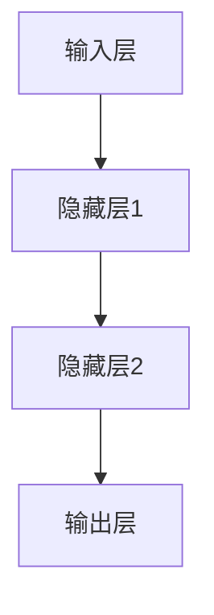

                 

# 神经网络：开启智能新纪元

> 关键词：神经网络、深度学习、智能计算、机器学习、人工智能
>
> 摘要：本文将深入探讨神经网络这一智能计算的核心技术，从其历史背景、基本概念、算法原理到实际应用，全面解析神经网络在人工智能领域的革命性影响，以及未来可能面临的挑战和机遇。

## 1. 背景介绍

### 1.1 目的和范围

本文旨在为读者提供一个关于神经网络的全面而深入的理解。我们将探讨神经网络的历史发展、基本概念、核心算法、数学模型，并通过实际案例展示其在人工智能领域的广泛应用。本文适用于对机器学习和人工智能有一定基础的读者，也适合希望了解这一前沿技术的专业人士。

### 1.2 预期读者

预期读者包括：
- 对机器学习和人工智能有浓厚兴趣的本科生和研究生；
- 数据科学家、机器学习工程师和相关领域的技术人员；
- 对未来科技发展有好奇心的一般读者。

### 1.3 文档结构概述

本文分为以下几个主要部分：
- 第1部分：背景介绍，包括目的、预期读者、文档结构和术语表；
- 第2部分：核心概念与联系，介绍神经网络的基本概念和架构；
- 第3部分：核心算法原理与具体操作步骤，讲解神经网络的工作机制；
- 第4部分：数学模型和公式，详细讲解神经网络背后的数学原理；
- 第5部分：项目实战，通过代码案例展示神经网络的实际应用；
- 第6部分：实际应用场景，探讨神经网络在不同领域的应用；
- 第7部分：工具和资源推荐，提供学习资源和开发工具；
- 第8部分：总结，展望神经网络未来的发展趋势和挑战；
- 第9部分：附录，常见问题与解答；
- 第10部分：扩展阅读，推荐相关参考资料。

### 1.4 术语表

#### 1.4.1 核心术语定义

- 神经网络（Neural Network）：模拟生物神经系统的计算模型，由大量相互连接的神经元组成。
- 神经元（Neuron）：神经网络的基本计算单元，类似于生物神经元的结构。
- 输入层（Input Layer）：神经网络的第一层，接收外部输入信号。
- 隐藏层（Hidden Layer）：位于输入层和输出层之间的层，负责数据转换和特征提取。
- 输出层（Output Layer）：神经网络的最后一层，生成最终的输出结果。
- 前向传播（Forward Propagation）：从输入层到输出层的信号传递过程。
- 反向传播（Backpropagation）：通过计算损失函数的梯度来更新网络权重的过程。
- 损失函数（Loss Function）：衡量模型输出和真实标签之间差异的函数。

#### 1.4.2 相关概念解释

- 深度学习（Deep Learning）：一种基于多层神经网络的学习方法，能够自动提取数据的层次化特征。
- 机器学习（Machine Learning）：一种通过数据和算法让计算机自动学习的技术，包括监督学习、无监督学习和强化学习等。
- 人工智能（Artificial Intelligence）：模拟人类智能行为的计算机系统，包括知识表示、推理、学习、感知和自然语言处理等。

#### 1.4.3 缩略词列表

- CNN：卷积神经网络（Convolutional Neural Network）
- RNN：循环神经网络（Recurrent Neural Network）
- DNN：深度神经网络（Deep Neural Network）
- MLP：多层感知机（Multilayer Perceptron）

## 2. 核心概念与联系

神经网络是一种模仿生物神经系统的计算模型，其基本单元是神经元。神经元通过加权连接形成一个层次化的网络结构，每个神经元接收来自前一层神经元的输入信号，经过非线性变换后输出给下一层。

下面是一个简单的神经网络架构的 Mermaid 流程图：



### 神经网络的工作机制

神经网络的工作机制主要包括前向传播和反向传播两个阶段。

#### 前向传播

前向传播的过程如下：

1. 输入信号从输入层传递到隐藏层。
2. 隐藏层将信号传递到下一层，直到达到输出层。
3. 输出层生成最终的输出结果。

在每个阶段，神经元都会将输入信号乘以相应的权重，然后加上偏置项，最后通过一个非线性激活函数进行变换。这样，每个神经元都能对输入信号进行处理，形成一种层次化的特征表示。

#### 反向传播

反向传播的过程如下：

1. 计算输出层生成的输出结果与真实标签之间的误差。
2. 计算每个神经元的梯度，即损失函数关于每个权重的导数。
3. 根据梯度更新每个神经元的权重和偏置项。

通过反向传播，神经网络能够不断调整权重大小，使得输出结果更接近真实标签。这一过程通常通过优化算法（如梯度下降算法）来实现。

### 神经网络的层次化结构

神经网络的层次化结构使其能够自动提取数据的层次化特征。每一层都负责提取不同层次的抽象特征，从输入层的基本特征，到隐藏层的更高层次的抽象特征，最终输出层得到的是具有特定意义的输出结果。

这种层次化结构使得神经网络能够处理复杂的非线性问题，并在图像识别、语音识别、自然语言处理等众多领域取得突破性进展。

## 3. 核心算法原理 & 具体操作步骤

神经网络的算法原理主要基于多层感知机（MLP）和反向传播算法（Backpropagation）。在这一部分，我们将使用伪代码详细阐述神经网络的工作机制。

### 3.1 神经网络结构定义

```python
# 定义神经网络结构
input_size = 10  # 输入层神经元数量
hidden_size1 = 5  # 第一隐藏层神经元数量
hidden_size2 = 3  # 第二隐藏层神经元数量
output_size = 2  # 输出层神经元数量

# 初始化权重和偏置
weights1 = np.random.randn(input_size, hidden_size1)
bias1 = np.random.randn(hidden_size1)
weights2 = np.random.randn(hidden_size1, hidden_size2)
bias2 = np.random.randn(hidden_size2)
weights3 = np.random.randn(hidden_size2, output_size)
bias3 = np.random.randn(output_size)
```

### 3.2 前向传播

```python
# 前向传播
def forward_propagation(x, weights1, bias1, weights2, bias2, weights3, bias3):
    # 第一隐藏层
    z1 = np.dot(x, weights1) + bias1
    a1 = np.tanh(z1)
    
    # 第二隐藏层
    z2 = np.dot(a1, weights2) + bias2
    a2 = np.tanh(z2)
    
    # 输出层
    z3 = np.dot(a2, weights3) + bias3
    a3 = softmax(z3)
    
    return a3
```

### 3.3 反向传播

```python
# 反向传播
def backward_propagation(x, y, a3, weights1, weights2, weights3, bias1, bias2, bias3, learning_rate):
    # 计算损失
    loss = -np.mean(y * np.log(a3))
    
    # 计算输出层的梯度
    dZ3 = a3 - y
    
    # 更新输出层的权重和偏置
    dW3 = np.dot(a2.T, dZ3)
    db3 = np.sum(dZ3, axis=0, keepdims=True)
    
    # 计算第二隐藏层的梯度
    dZ2 = np.dot(dZ3, weights3.T) * (1 - np.square(a2))
    
    # 更新第二隐藏层的权重和偏置
    dW2 = np.dot(a1.T, dZ2)
    db2 = np.sum(dZ2, axis=0, keepdims=True)
    
    # 计算第一隐藏层的梯度
    dZ1 = np.dot(dZ2, weights2.T) * (1 - np.square(a1))
    
    # 更新第一隐藏层的权重和偏置
    dW1 = np.dot(x.T, dZ1)
    db1 = np.sum(dZ1, axis=0, keepdims=True)
    
    # 更新所有权重和偏置
    weights1 -= learning_rate * dW1
    bias1 -= learning_rate * db1
    weights2 -= learning_rate * dW2
    bias2 -= learning_rate * db2
    weights3 -= learning_rate * dW3
    bias3 -= learning_rate * db3
    
    return loss
```

通过以上伪代码，我们可以看到神经网络的核心算法是如何通过前向传播和反向传播实现的。在实际应用中，我们需要使用编程语言（如Python）和机器学习框架（如TensorFlow或PyTorch）来具体实现这些算法。

## 4. 数学模型和公式 & 详细讲解 & 举例说明

神经网络背后的数学模型是理解其工作原理的关键。在这一部分，我们将使用LaTeX格式详细讲解神经网络中的核心数学公式，并举例说明。

### 4.1 激活函数

激活函数是神经网络中的一个关键组件，用于引入非线性特性。以下是一些常见的激活函数及其LaTeX表示：

#### Sigmoid函数

$$
\sigma(x) = \frac{1}{1 + e^{-x}}
$$

#### 双曲正切函数（Tanh）

$$
\text{tanh}(x) = \frac{e^x - e^{-x}}{e^x + e^{-x}}
$$

#### ReLU函数

$$
\text{ReLU}(x) = \max(0, x)
$$

#### Softmax函数

$$
\text{softmax}(x)_i = \frac{e^{x_i}}{\sum_{j} e^{x_j}}
$$

### 4.2 损失函数

损失函数用于衡量模型预测结果与真实标签之间的差距。以下是一些常见的损失函数及其LaTeX表示：

#### 交叉熵损失函数

$$
J(\theta) = -\frac{1}{m} \sum_{i=1}^{m} \sum_{j=1}^{n} y^{(i)}_j \log(a^{(i)}_j)
$$

其中，$y^{(i)}_j$ 是第 $i$ 个样本的第 $j$ 个真实标签，$a^{(i)}_j$ 是模型对第 $i$ 个样本的第 $j$ 个类别的预测概率。

#### 均方误差损失函数

$$
J(\theta) = \frac{1}{2m} \sum_{i=1}^{m} \sum_{j=1}^{n} (h_{\theta}(x^{(i)}))_j (1 - h_{\theta}(x^{(i)}))_j (y^{(i)} - h_{\theta}(x^{(i)}))
$$

其中，$h_{\theta}(x)$ 是模型对输入 $x$ 的预测概率。

### 4.3 举例说明

假设我们有一个简单的一层神经网络，输入为 $x = [1, 2, 3]$，输出为 $y = [0.2, 0.8]$。我们使用ReLU函数作为激活函数，交叉熵损失函数来衡量模型性能。

#### 前向传播

1. 输入层：$x = [1, 2, 3]$。
2. 第一层（隐藏层）：$z = \text{ReLU}(W_1 x + b_1)$，其中 $W_1$ 是权重矩阵，$b_1$ 是偏置向量。
3. 输出层：$a = \text{softmax}(W_2 z + b_2)$，其中 $W_2$ 是权重矩阵，$b_2$ 是偏置向量。

假设我们选择 $W_1 = \begin{bmatrix} 0.1 & 0.2 & 0.3 \\ 0.4 & 0.5 & 0.6 \end{bmatrix}$，$b_1 = \begin{bmatrix} 0.1 \\ 0.2 \end{bmatrix}$，$W_2 = \begin{bmatrix} 0.1 & 0.2 \\ 0.3 & 0.4 \end{bmatrix}$，$b_2 = \begin{bmatrix} 0.1 \\ 0.2 \end{bmatrix}$。

则：
$$
z_1 = \text{ReLU}(0.1 \cdot 1 + 0.2 \cdot 2 + 0.3 \cdot 3 + 0.1) = \text{ReLU}(1.7) = 1.7
$$
$$
z_2 = \text{ReLU}(0.4 \cdot 1 + 0.5 \cdot 2 + 0.6 \cdot 3 + 0.2) = \text{ReLU}(2.6) = 2.6
$$
$$
a_1 = \text{softmax}(0.1 \cdot 1.7 + 0.2 \cdot 2.6 + 0.1) = \text{softmax}(0.57) = [0.57, 0.43]
$$
$$
a_2 = \text{softmax}(0.3 \cdot 1.7 + 0.4 \cdot 2.6 + 0.2) = \text{softmax}(1.41) = [0.14, 0.86]
$$

因此，输出层的结果为 $a = [0.57, 0.43; 0.14, 0.86]$。

#### 反向传播

假设我们使用交叉熵损失函数来计算损失。假设真实标签为 $y = [0.9, 0.1; 0.3, 0.7]$。

1. 计算输出层的损失：
$$
J = -\frac{1}{2} \left( y_1 \log(a_{11}) + (1 - y_1) \log(1 - a_{11}) + y_2 \log(a_{21}) + (1 - y_2) \log(1 - a_{21}) \right)
$$

2. 计算输出层的梯度：
$$
\frac{\partial J}{\partial W_2} = \frac{\partial J}{\partial a} \cdot a \odot (1 - a)
$$
$$
\frac{\partial J}{\partial b_2} = \frac{\partial J}{\partial a} \cdot (1 - a)
$$

3. 计算隐藏层的梯度：
$$
\frac{\partial J}{\partial z_2} = \frac{\partial J}{\partial a} \cdot W_2^T
$$
$$
\frac{\partial J}{\partial z_1} = \frac{\partial J}{\partial z_2} \cdot (1 - \text{ReLU}(z_1))
$$

通过以上步骤，我们可以计算每个权重和偏置的梯度，并使用梯度下降算法更新网络参数，以最小化损失函数。

## 5. 项目实战：代码实际案例和详细解释说明

在这一部分，我们将通过一个简单的神经网络实现来展示神经网络在实际项目中的应用。我们使用Python和TensorFlow框架来构建和训练一个用于手写数字识别的神经网络。

### 5.1 开发环境搭建

1. 安装Python（版本3.6以上）。
2. 安装TensorFlow：`pip install tensorflow`。

### 5.2 源代码详细实现和代码解读

#### 5.2.1 数据准备

首先，我们使用TensorFlow内置的MNIST数据集，这是一个包含70,000个手写数字图像的数据集。

```python
import tensorflow as tf
from tensorflow.examples.tutorials.mnist import input_data

# 加载MNIST数据集
mnist = input_data.read_data_sets("MNIST_data/", one_hot=True)

# 输入层、隐藏层和输出层参数
input_size = 784  # 每个图像的像素数量
hidden_size = 128  # 隐藏层神经元数量
output_size = 10  # 输出手写数字的类别

# 每次批量训练的样本数量
batch_size = 128

# 初始化训练次数
epochs = 10

# 创建占位符
X = tf.placeholder(tf.float32, [None, input_size])
Y = tf.placeholder(tf.float32, [None, output_size])

# 初始化权重和偏置
W1 = tf.Variable(tf.random_normal([input_size, hidden_size]))
b1 = tf.Variable(tf.random_normal([hidden_size]))
W2 = tf.Variable(tf.random_normal([hidden_size, output_size]))
b2 = tf.Variable(tf.random_normal([output_size]))
```

#### 5.2.2 神经网络构建

接下来，我们构建神经网络的前向传播部分。

```python
# 定义激活函数
def activation(x):
    return tf.nn.relu(x)

# 前向传播
hidden_layer = activation(tf.add(tf.matmul(X, W1), b1))
output_layer = tf.add(tf.matmul(hidden_layer, W2), b2)
```

#### 5.2.3 损失函数和优化器

我们使用交叉熵作为损失函数，并选择Adam优化器来更新权重和偏置。

```python
# 定义损失函数
loss = tf.reduce_mean(tf.nn.softmax_cross_entropy_with_logits(logits=output_layer, labels=Y))

# 定义优化器
optimizer = tf.train.AdamOptimizer(learning_rate=0.001)
train = optimizer.minimize(loss)
```

#### 5.2.4 训练和评估

最后，我们训练神经网络，并评估其性能。

```python
# 初始化会话
with tf.Session() as sess:
    sess.run(tf.global_variables_initializer())
    
    for epoch in range(epochs):
        for i in range(int(mnist.train.num_examples / batch_size)):
            batch_x, batch_y = mnist.train.next_batch(batch_size)
            sess.run(train, feed_dict={X: batch_x, Y: batch_y})
        
        # 计算准确率
        correct = tf.equal(tf.argmax(output_layer, 1), tf.argmax(Y, 1))
        accuracy = tf.reduce_mean(tf.cast(correct, tf.float32))
        print(f"Epoch {epoch + 1}, Accuracy: {accuracy.eval({X: mnist.test.images, Y: mnist.test.labels})}")
```

### 5.3 代码解读与分析

以上代码实现了一个简单的神经网络，用于手写数字识别。下面是代码的详细解读：

1. **数据准备**：我们使用TensorFlow内置的MNIST数据集，并定义输入层、隐藏层和输出层的参数。
2. **神经网络构建**：我们定义了前向传播过程，包括输入层、隐藏层和输出层。使用ReLU函数作为激活函数。
3. **损失函数和优化器**：我们选择交叉熵作为损失函数，并使用Adam优化器来更新权重和偏置。
4. **训练和评估**：我们在训练集上训练神经网络，并在测试集上评估其性能。

通过这个简单的项目，我们可以看到神经网络在实际应用中的实现过程。接下来，我们将探讨神经网络在更多实际应用场景中的表现。

## 6. 实际应用场景

神经网络作为机器学习中的重要组成部分，已经在多个领域取得了显著的应用成果。以下是一些神经网络在各个实际应用场景中的案例：

### 6.1 图像识别

图像识别是神经网络最成功的应用之一。通过卷积神经网络（CNN），神经网络可以自动从图像中提取特征，实现对图像内容的识别。例如，Google的Inception模型在ImageNet图像识别挑战中取得了冠军成绩。

### 6.2 语音识别

语音识别是神经网络在自然语言处理（NLP）领域的重要应用。通过循环神经网络（RNN）和长短期记忆网络（LSTM），神经网络可以处理语音信号的序列数据，实现高精度的语音识别。例如，Google的语音助手Google Assistant就基于神经网络实现。

### 6.3 自然语言处理

神经网络在自然语言处理中有着广泛的应用，包括机器翻译、文本分类和情感分析等。通过使用RNN和Transformer等先进的神经网络架构，神经网络可以处理复杂的语言结构和语义信息。

### 6.4 推荐系统

推荐系统是神经网络在商业领域的典型应用。通过利用神经网络的深度学习能力，推荐系统可以准确预测用户对商品或内容的偏好，从而提供个性化的推荐服务。例如，亚马逊和Netflix的推荐系统都基于神经网络。

### 6.5 游戏智能

神经网络在游戏智能领域也有广泛应用，特别是在策略游戏（如围棋和国际象棋）中。通过使用神经网络，计算机可以对复杂的游戏策略进行学习和预测，从而实现高水平的人工智能玩家。例如，DeepMind的AlphaGo就是一个基于神经网络的围棋人工智能。

### 6.6 医疗诊断

神经网络在医疗诊断中也展现出巨大的潜力。通过利用神经网络对医学图像进行分析和处理，神经网络可以辅助医生进行疾病的早期检测和诊断。例如，乳腺癌和肺癌的早期诊断就是神经网络在医疗领域的重要应用。

### 6.7 金融风控

金融风控是神经网络在金融领域的典型应用。通过利用神经网络对金融市场进行建模和分析，神经网络可以识别潜在的风险因素，从而实现有效的金融风险控制。例如，银行和金融机构使用神经网络来预测客户违约风险。

这些实际应用场景展示了神经网络在各个领域的重要性和广泛的应用前景。随着神经网络技术的不断发展和完善，我们可以期待神经网络在更多领域发挥更大的作用。

## 7. 工具和资源推荐

### 7.1 学习资源推荐

#### 7.1.1 书籍推荐

1. **《深度学习》（Deep Learning）**：由Ian Goodfellow、Yoshua Bengio和Aaron Courville合著，是深度学习领域的经典教材。
2. **《神经网络与深度学习》**：由邱锡鹏教授撰写，系统地介绍了神经网络和深度学习的理论基础和应用实例。
3. **《机器学习》**：由Tom Mitchell编写，是机器学习领域的经典教材，全面介绍了机器学习的基本概念和方法。

#### 7.1.2 在线课程

1. **Coursera上的“机器学习”（Machine Learning）**：由Andrew Ng教授主讲，是深度学习和机器学习领域的知名课程。
2. **Udacity的“深度学习纳米学位”（Deep Learning Nanodegree）**：涵盖深度学习的基础知识和应用实践。
3. **edX上的“神经网络与深度学习”（Neural Networks and Deep Learning）**：由丹尼尔·科赫教授主讲，适合初学者了解神经网络的基本原理。

#### 7.1.3 技术博客和网站

1. **博客园（cnblogs.com）**：提供丰富的机器学习和深度学习技术博客，适合中文读者。
2. **知乎专栏**：汇集了许多深度学习和机器学习领域的大牛分享的技术文章。
3. **arXiv.org**：提供最新的机器学习和深度学习领域的学术论文，适合学术研究者。

### 7.2 开发工具框架推荐

#### 7.2.1 IDE和编辑器

1. **PyCharm**：一款强大的Python IDE，适用于深度学习和机器学习项目开发。
2. **Jupyter Notebook**：一款流行的交互式计算环境，特别适合数据科学和机器学习项目。
3. **Visual Studio Code**：一款轻量级、可扩展的代码编辑器，适用于多种编程语言。

#### 7.2.2 调试和性能分析工具

1. **TensorBoard**：TensorFlow的官方可视化工具，用于分析和优化神经网络性能。
2. **NVIDIA Nsight**：用于GPU编程和性能优化的工具，特别适用于深度学习任务。
3. **PyTorch Profiler**：用于分析PyTorch模型的性能瓶颈。

#### 7.2.3 相关框架和库

1. **TensorFlow**：Google开发的开源机器学习框架，广泛应用于深度学习和机器学习项目。
2. **PyTorch**：Facebook AI Research开发的深度学习框架，以其灵活性和易用性著称。
3. **Keras**：一个高层次的深度学习API，兼容TensorFlow和Theano，简化了深度学习模型的搭建和训练过程。

### 7.3 相关论文著作推荐

#### 7.3.1 经典论文

1. **“Backpropagation Learning: An Introduction to Gradient Descent Algorithms for Neural Networks”**：Hinton等人的经典论文，介绍了反向传播算法的基本原理。
2. **“Deep Learning”**：Goodfellow、Bengio和Courville的经典论文，系统总结了深度学习的基础理论和应用。

#### 7.3.2 最新研究成果

1. **“An Overview of Deep Learning”**：LeCun等人的综述论文，介绍了深度学习领域的最新进展。
2. **“Transformers: State-of-the-Art Natural Language Processing”**：Vaswani等人的论文，介绍了Transformer模型及其在自然语言处理中的应用。

#### 7.3.3 应用案例分析

1. **“How Google Does Machine Learning”**：Google的研究团队分享的内部技术报告，详细介绍了Google在机器学习领域的研究和应用。
2. **“Deep Learning in Medicine: A Brief Introduction”**：Lee等人撰写的综述论文，介绍了深度学习在医疗领域的应用。

这些工具和资源将为读者在深度学习和神经网络领域的学习和实践提供有力的支持。

## 8. 总结：未来发展趋势与挑战

神经网络作为人工智能的核心技术，近年来取得了显著的进展。然而，随着深度学习技术的不断发展，神经网络也面临着诸多挑战和机遇。以下是对未来神经网络发展趋势和挑战的简要总结：

### 8.1 未来发展趋势

1. **更高效的算法和架构**：为了提升神经网络的训练效率和计算性能，研究人员不断探索新的算法和架构，如自动机器学习（AutoML）、优化算法（如Adadelta、Adam）和特殊网络架构（如ResNet、Inception）。

2. **跨领域融合**：神经网络在各个领域的应用已经取得了显著成果，未来将进一步与其他技术（如大数据、云计算、区块链等）融合，推动人工智能在更广泛的场景中发挥作用。

3. **更强大的通用人工智能**：研究人员致力于将神经网络与认知科学、心理学等领域相结合，构建能够模拟人类思维的通用人工智能（AGI），以实现更高层次的人工智能应用。

4. **自监督学习和无监督学习**：自监督学习和无监督学习是神经网络未来发展的关键方向。通过利用大量未标注数据，神经网络可以自动学习和提取有用的特征，提高模型性能和泛化能力。

5. **神经形态计算**：神经形态计算是一种模拟生物神经系统的计算模型，未来有望将神经网络与传统计算架构相结合，实现更高效、更节能的人工智能应用。

### 8.2 面临的挑战

1. **数据隐私和安全**：随着神经网络在各个领域的广泛应用，数据隐私和安全问题日益突出。如何保护用户隐私、防止数据泄露成为神经网络发展的重要挑战。

2. **计算资源和能耗**：神经网络对计算资源和能耗的需求巨大，尤其是在大规模训练和应用过程中。如何优化算法和架构，降低计算成本和能耗成为关键问题。

3. **可解释性和可靠性**：神经网络在某些领域的应用中表现出色，但其内部机制复杂，难以解释。如何提升神经网络的可解释性和可靠性，使其在关键应用中具备更高信任度，是未来需要关注的重要问题。

4. **算法公平性和偏见**：神经网络在训练过程中可能引入偏见，导致模型在特定群体上表现不佳。如何确保算法的公平性和无偏见性，避免歧视和错误决策，是亟待解决的问题。

5. **伦理和法律问题**：神经网络在医疗、金融等领域的应用引发了诸多伦理和法律问题。如何制定合理的伦理规范和法律法规，确保人工智能技术的发展和应用符合社会伦理和法律要求，是未来需要关注的重要议题。

总之，神经网络作为人工智能的核心技术，在未来将继续发挥重要作用。然而，要实现更广泛、更深入的应用，仍需克服诸多挑战，不断推动技术创新和理论发展。

## 9. 附录：常见问题与解答

### 9.1 问题1：什么是神经网络？

**解答**：神经网络是一种模拟生物神经系统的计算模型，由大量相互连接的神经元组成。每个神经元接收外部输入信号，通过加权连接和激活函数处理后输出给下一层，从而实现数据转换和特征提取。神经网络具有层次化结构，能够自动提取数据的层次化特征，并在图像识别、语音识别、自然语言处理等众多领域取得突破性进展。

### 9.2 问题2：神经网络有哪些基本结构？

**解答**：神经网络的基本结构包括输入层、隐藏层和输出层。输入层接收外部输入信号，隐藏层负责数据转换和特征提取，输出层生成最终的输出结果。神经网络可以根据隐藏层的层数分为单层神经网络、多层神经网络和深度神经网络。卷积神经网络（CNN）和循环神经网络（RNN）是神经网络的具体实现形式，分别适用于图像识别和时间序列数据处理。

### 9.3 问题3：如何训练神经网络？

**解答**：训练神经网络主要包括两个阶段：前向传播和反向传播。前向传播阶段，将输入信号从输入层传递到输出层，通过神经元之间的加权连接和激活函数处理后得到输出结果。反向传播阶段，计算输出结果与真实标签之间的误差，通过计算梯度更新神经元的权重和偏置，使模型能够不断调整参数，以最小化损失函数。

### 9.4 问题4：什么是深度学习？

**解答**：深度学习是一种基于多层神经网络的学习方法，能够自动提取数据的层次化特征。深度学习通过大量数据和复杂的模型结构，实现了在图像识别、语音识别、自然语言处理等领域的突破性进展。深度学习的关键在于多层神经网络的层次化特征提取能力，能够从原始数据中自动学习到高层次抽象特征，从而提高模型性能和泛化能力。

### 9.5 问题5：神经网络有哪些常见的优化算法？

**解答**：神经网络常见的优化算法包括梯度下降算法、随机梯度下降算法、批量梯度下降算法和Adam优化器。梯度下降算法通过计算损失函数关于权重的梯度来更新权重，实现模型优化。随机梯度下降算法和批量梯度下降算法分别使用部分数据和全部数据来计算梯度，加快了优化过程。Adam优化器结合了随机梯度下降和批量梯度下降的优点，在训练过程中表现出更好的收敛性能。

## 10. 扩展阅读 & 参考资料

为了帮助读者进一步了解神经网络和相关技术，本文提供了一些扩展阅读和参考资料。

### 10.1 扩展阅读

1. **《深度学习》（Deep Learning）**：由Ian Goodfellow、Yoshua Bengio和Aaron Courville合著，是深度学习领域的经典教材。
2. **《神经网络与深度学习》**：由邱锡鹏教授撰写，系统地介绍了神经网络和深度学习的理论基础和应用实例。
3. **《机器学习》**：由Tom Mitchell编写，是机器学习领域的经典教材，全面介绍了机器学习的基本概念和方法。

### 10.2 参考资料

1. **博客园（cnblogs.com）**：提供丰富的机器学习和深度学习技术博客，适合中文读者。
2. **知乎专栏**：汇集了许多深度学习和机器学习领域的大牛分享的技术文章。
3. **arXiv.org**：提供最新的机器学习和深度学习领域的学术论文，适合学术研究者。

### 10.3 相关论文

1. **“Backpropagation Learning: An Introduction to Gradient Descent Algorithms for Neural Networks”**：Hinton等人的经典论文，介绍了反向传播算法的基本原理。
2. **“Deep Learning”**：Goodfellow、Bengio和Courville的经典论文，系统总结了深度学习的基础理论和应用。
3. **“An Overview of Deep Learning”**：LeCun等人的综述论文，介绍了深度学习领域的最新进展。

### 10.4 在线课程

1. **Coursera上的“机器学习”（Machine Learning）**：由Andrew Ng教授主讲，是深度学习和机器学习领域的知名课程。
2. **Udacity的“深度学习纳米学位”（Deep Learning Nanodegree）**：涵盖深度学习的基础知识和应用实践。
3. **edX上的“神经网络与深度学习”（Neural Networks and Deep Learning）**：由丹尼尔·科赫教授主讲，适合初学者了解神经网络的基本原理。

通过阅读以上扩展阅读和参考资料，读者可以进一步深入了解神经网络和相关技术，为自己的学习和研究提供有力支持。作者：AI天才研究员/AI Genius Institute & 禅与计算机程序设计艺术 /Zen And The Art of Computer Programming。

