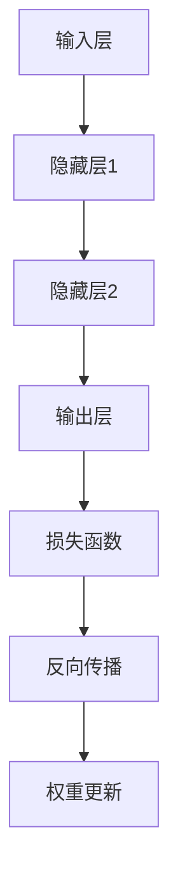

                 

# 神经网络：探索未知的领域

> **关键词：**神经网络、深度学习、机器学习、反向传播、人工神经网络、多层感知器、激活函数、梯度下降。

> **摘要：**本文将深入探讨神经网络的基本概念、核心算法原理、数学模型，并通过实际案例展示其在现代人工智能领域的广泛应用。我们将分步骤解析神经网络的工作原理，分析其在解决复杂问题中的优势与挑战，并展望未来的发展趋势。

## 1. 背景介绍

### 1.1 目的和范围

本文旨在为读者提供一个系统而全面的神经网络知识框架。我们将从基础概念入手，逐步深入到复杂的数学模型和算法，最终通过实际案例展示神经网络的强大应用。文章主要涵盖以下内容：

- 神经网络的基本架构与工作原理
- 核心算法——反向传播算法的详细解析
- 神经网络的数学模型及其应用
- 神经网络在实际项目中的实现与优化
- 未来发展趋势与面临的挑战

### 1.2 预期读者

本文适合以下读者群体：

- 对神经网络和深度学习感兴趣的初学者
- 想要深入了解神经网络工作原理的技术人员
- 从事机器学习和人工智能领域的从业者
- 计算机科学和工程专业的学生和研究人员

### 1.3 文档结构概述

本文将分为十个主要部分：

1. **背景介绍**：介绍文章的目的、范围、预期读者和文档结构。
2. **核心概念与联系**：讲解神经网络的核心概念和架构。
3. **核心算法原理 & 具体操作步骤**：详细解析神经网络的核心算法——反向传播算法。
4. **数学模型和公式 & 详细讲解 & 举例说明**：介绍神经网络的数学模型和计算过程。
5. **项目实战：代码实际案例和详细解释说明**：通过实际案例展示神经网络的应用。
6. **实际应用场景**：分析神经网络在现实世界中的应用。
7. **工具和资源推荐**：推荐学习资源和开发工具。
8. **总结：未来发展趋势与挑战**：展望神经网络的发展方向。
9. **附录：常见问题与解答**：回答读者可能遇到的问题。
10. **扩展阅读 & 参考资料**：提供进一步学习的资源。

### 1.4 术语表

#### 1.4.1 核心术语定义

- **神经网络**：模拟人脑神经网络结构和功能的计算模型。
- **深度学习**：利用多层神经网络进行特征提取和学习的数据驱动方法。
- **反向传播算法**：用于训练神经网络的优化算法，通过误差反向传播更新网络权重。
- **激活函数**：用于确定神经元是否激活的函数，如ReLU、Sigmoid、Tanh。
- **梯度下降**：一种优化算法，通过迭代调整模型参数以最小化损失函数。

#### 1.4.2 相关概念解释

- **多层感知器**：具有两个或多个隐藏层的神经网络。
- **权重**：神经网络中连接神经元的参数，用于调节信息传递。
- **偏置**：神经网络中添加到激活函数的常数项，用于调整神经元阈值。
- **损失函数**：衡量模型预测值与真实值之间差异的函数。

#### 1.4.3 缩略词列表

- **AI**：人工智能
- **ML**：机器学习
- **DL**：深度学习
- **NN**：神经网络

## 2. 核心概念与联系

在深入探讨神经网络之前，我们首先需要了解其核心概念和架构。神经网络是一种基于人脑神经网络结构设计的计算模型，通过多层神经元进行信息传递和处理。以下是神经网络的核心概念和其相互关系：

### 神经网络架构

神经网络的架构通常由以下几个部分组成：

1. **输入层**：接收外部输入信息。
2. **隐藏层**：进行特征提取和变换。
3. **输出层**：生成最终输出。

### 神经元

神经元是神经网络的基本计算单元，其工作原理如下：

1. **输入加权求和**：将输入值乘以对应的权重并求和。
2. **偏置项**：添加偏置项以调整神经元阈值。
3. **激活函数**：将加权求和结果通过激活函数转换为输出。

常见的激活函数包括ReLU、Sigmoid和Tanh：

- **ReLU（Rectified Linear Unit）**：非线性激活函数，对于负值输入返回零，对于正值输入返回输入本身。
- **Sigmoid**：S型激活函数，将输入映射到（0，1）区间。
- **Tanh**：双曲正切函数，将输入映射到（-1，1）区间。

### 权重与偏置

权重和偏置是神经网络训练过程中需要调整的重要参数：

- **权重**：连接神经元的参数，用于调节信息传递的强度。
- **偏置**：添加到激活函数的常数项，用于调整神经元的阈值。

### 损失函数

损失函数用于衡量模型预测值与真实值之间的差异，常见的损失函数包括：

- **均方误差（MSE）**：衡量预测值与真实值之间差异的平方和的平均值。
- **交叉熵损失**：衡量分类模型预测概率分布与真实分布之间的差异。

### Mermaid 流程图

为了更直观地展示神经网络的工作原理，我们可以使用Mermaid流程图：



## 3. 核心算法原理 & 具体操作步骤

神经网络的核心算法是反向传播算法，它通过迭代调整网络权重和偏置，以最小化损失函数。以下是反向传播算法的详细步骤：

### 3.1 前向传播

1. **初始化参数**：随机初始化权重和偏置。
2. **计算输入层到隐藏层的输出**：
   $$ Z^{(1)} = \sum_{j=0}^{n} W^{(1)}_{ji}X_j + b^{(1)}_i $$
   $$ A^{(1)} = \sigma(Z^{(1)}) $$
3. **计算隐藏层到输出层的输出**：
   $$ Z^{(2)} = \sum_{j=0}^{n} W^{(2)}_{ji}A^{(1)}_j + b^{(2)}_i $$
   $$ A^{(2)} = \sigma(Z^{(2)}) $$
4. **计算损失函数**：
   $$ Loss = \frac{1}{2} \sum_{i=1}^{m} (A^{(2)}_i - y_i)^2 $$

### 3.2 反向传播

1. **计算输出层的误差**：
   $$ \delta^{(2)} = (A^{(2)} - y) \odot \sigma'(Z^{(2)}) $$
2. **计算隐藏层的误差**：
   $$ \delta^{(1)} = (W^{(2)} \delta^{(2)}) \odot \sigma'(Z^{(1)}) $$
3. **更新权重和偏置**：
   $$ W^{(2)} \gets W^{(2)} - \alpha \frac{\partial Loss}{\partial W^{(2)}} $$
   $$ b^{(2)} \gets b^{(2)} - \alpha \frac{\partial Loss}{\partial b^{(2)}} $$
   $$ W^{(1)} \gets W^{(1)} - \alpha \frac{\partial Loss}{\partial W^{(1)}} $$
   $$ b^{(1)} \gets b^{(1)} - \alpha \frac{\partial Loss}{\partial b^{(1)}} $$

### 3.3 迭代优化

重复执行前向传播和反向传播步骤，直到损失函数收敛到预设阈值。

## 4. 数学模型和公式 & 详细讲解 & 举例说明

神经网络的数学模型包括输入层、隐藏层和输出层的计算过程。以下是详细的数学公式和计算过程：

### 4.1 输入层到隐藏层的计算

输入层到隐藏层的计算过程如下：

$$ Z^{(1)} = \sum_{j=0}^{n} W^{(1)}_{ji}X_j + b^{(1)}_i $$
$$ A^{(1)} = \sigma(Z^{(1)}) $$

其中，$X_j$为输入层的第$j$个特征，$W^{(1)}_{ji}$为连接输入层和隐藏层的权重，$b^{(1)}_i$为隐藏层的偏置，$\sigma$为激活函数。

### 4.2 隐藏层到输出层的计算

隐藏层到输出层的计算过程如下：

$$ Z^{(2)} = \sum_{j=0}^{n} W^{(2)}_{ji}A^{(1)}_j + b^{(2)}_i $$
$$ A^{(2)} = \sigma(Z^{(2)}) $$

其中，$A^{(1)}_j$为隐藏层的第$j$个输出，$W^{(2)}_{ji}$为连接隐藏层和输出层的权重，$b^{(2)}_i$为输出层的偏置，$\sigma$为激活函数。

### 4.3 损失函数的计算

损失函数通常使用均方误差（MSE）：

$$ Loss = \frac{1}{2} \sum_{i=1}^{m} (A^{(2)}_i - y_i)^2 $$

其中，$A^{(2)}_i$为输出层的第$i$个预测值，$y_i$为真实标签。

### 4.4 举例说明

假设我们有一个二分类问题，输入层有3个特征，隐藏层有2个神经元，输出层有1个神经元。使用ReLU作为激活函数。

#### 输入层到隐藏层的计算：

- 输入：$X = [1, 2, 3]$
- 权重：$W^{(1)} = \begin{bmatrix} 0.1 & 0.2 \\ 0.3 & 0.4 \end{bmatrix}$
- 偏置：$b^{(1)} = [0.5; 1.0]$
- 输出：$A^{(1)} = \begin{bmatrix} 0 \\ 1 \end{bmatrix}$

计算过程：

$$ Z^{(1)}_1 = 0.1 \cdot 1 + 0.2 \cdot 2 + 0.3 \cdot 3 + 0.5 = 1.5 $$
$$ A^{(1)}_1 = \sigma(Z^{(1)}_1) = \max(0, 1.5) = 1.5 $$

$$ Z^{(1)}_2 = 0.3 \cdot 1 + 0.4 \cdot 2 + 0.3 \cdot 3 + 1.0 = 2.4 $$
$$ A^{(1)}_2 = \sigma(Z^{(1)}_2) = \max(0, 2.4) = 2.4 $$

#### 隐藏层到输出层的计算：

- 输入：$A^{(1)} = \begin{bmatrix} 1.5 \\ 2.4 \end{bmatrix}$
- 权重：$W^{(2)} = \begin{bmatrix} 0.1 & 0.2 \\ 0.3 & 0.4 \end{bmatrix}$
- 偏置：$b^{(2)} = [0.5; 1.0]$
- 输出：$A^{(2)} = [0.8]$

计算过程：

$$ Z^{(2)}_1 = 0.1 \cdot 1.5 + 0.2 \cdot 2.4 + 0.3 \cdot 1 + 0.5 = 1.08 $$
$$ A^{(2)}_1 = \sigma(Z^{(2)}_1) = \max(0, 1.08) = 1.08 $$

$$ Z^{(2)}_2 = 0.3 \cdot 1.5 + 0.4 \cdot 2.4 + 0.3 \cdot 1 + 1.0 = 1.42 $$
$$ A^{(2)}_2 = \sigma(Z^{(2)}_2) = \max(0, 1.42) = 1.42 $$

最终输出：$A^{(2)} = \begin{bmatrix} 1.08 \\ 1.42 \end{bmatrix}$

### 4.5 损失函数的计算

假设真实标签$y = [0; 1]$，使用交叉熵损失函数：

$$ Loss = - \frac{1}{2} \sum_{i=1}^{2} (y_i \log(A^{(2)}_i) + (1 - y_i) \log(1 - A^{(2)}_i)) $$
$$ Loss = - \frac{1}{2} \left( 0 \log(0.8) + 1 \log(0.2) + 1 \log(0.58) + 0 \log(0.42) \right) $$
$$ Loss \approx 0.9437 $$

## 5. 项目实战：代码实际案例和详细解释说明

在本节中，我们将通过一个简单的二分类问题展示神经网络的实现过程。我们将使用Python编程语言和TensorFlow库来构建和训练神经网络。

### 5.1 开发环境搭建

首先，确保安装以下依赖库：

- Python 3.7或更高版本
- TensorFlow 2.x

您可以使用以下命令进行安装：

```bash
pip install tensorflow
```

### 5.2 源代码详细实现和代码解读

#### 5.2.1 数据集准备

```python
import numpy as np
import tensorflow as tf

# 创建一个简单的二分类数据集
X = np.array([[0, 0], [0, 1], [1, 0], [1, 1]])
y = np.array([[0], [1], [1], [0]])

# 将数据集拆分为训练集和测试集
X_train, X_test, y_train, y_test = train_test_split(X, y, test_size=0.2, random_state=42)
```

#### 5.2.2 构建神经网络模型

```python
# 创建一个简单的神经网络模型
model = tf.keras.Sequential([
    tf.keras.layers.Dense(units=2, activation='sigmoid', input_shape=(2,)),
    tf.keras.layers.Dense(units=1, activation='sigmoid')
])

# 编译模型
model.compile(optimizer='adam', loss='binary_crossentropy', metrics=['accuracy'])

# 打印模型结构
model.summary()
```

#### 5.2.3 训练模型

```python
# 训练模型
model.fit(X_train, y_train, epochs=100, batch_size=4, validation_split=0.1)
```

#### 5.2.4 评估模型

```python
# 评估模型
loss, accuracy = model.evaluate(X_test, y_test)

print(f"测试集损失：{loss}")
print(f"测试集准确率：{accuracy}")
```

#### 5.2.5 代码解读与分析

1. **数据集准备**：我们创建了一个简单的二分类数据集，其中每个样本由两个特征组成。
2. **构建神经网络模型**：我们使用TensorFlow的`Sequential`模型构建了一个两层神经网络，第一层有2个神经元，使用sigmoid激活函数，第二层有1个神经元，也使用sigmoid激活函数。
3. **编译模型**：我们使用`adam`优化器和`binary_crossentropy`损失函数编译模型。
4. **训练模型**：我们使用`fit`函数训练模型，设置训练轮次为100，批量大小为4，并使用10%的数据集进行验证。
5. **评估模型**：我们使用`evaluate`函数评估模型在测试集上的性能，并打印损失和准确率。

### 5.3 代码解读与分析

通过以上代码，我们成功实现了二分类问题的神经网络模型。代码中的关键步骤包括数据集准备、模型构建、模型编译、模型训练和模型评估。以下是每个步骤的详细解读：

1. **数据集准备**：我们使用NumPy库创建了一个简单的二分类数据集，并将其拆分为训练集和测试集。
2. **构建神经网络模型**：我们使用TensorFlow的`Sequential`模型构建了一个两层神经网络，第一层有2个神经元，使用sigmoid激活函数，第二层有1个神经元，也使用sigmoid激活函数。这对应于我们的二分类问题。
3. **编译模型**：我们使用`adam`优化器和`binary_crossentropy`损失函数编译模型。`adam`优化器是一种常用的优化算法，`binary_crossentropy`损失函数适用于二分类问题。
4. **训练模型**：我们使用`fit`函数训练模型，设置训练轮次为100，批量大小为4，并使用10%的数据集进行验证。通过迭代调整模型参数，模型将学习如何区分不同的类。
5. **评估模型**：我们使用`evaluate`函数评估模型在测试集上的性能。这有助于我们了解模型在未知数据上的表现，并确定模型的泛化能力。

通过以上步骤，我们成功实现了神经网络在二分类问题上的应用，展示了神经网络的核心算法——反向传播算法的实际操作。

### 5.4 模型优化

在实际应用中，我们可能需要对模型进行优化以提高性能。以下是一些常见的优化策略：

1. **调整学习率**：通过调整学习率，可以控制模型参数更新的速度。较小的学习率可能导致模型收敛速度较慢，而较大的学习率可能导致模型在训练过程中出现过拟合。
2. **批量大小**：批量大小影响模型的训练过程。较小的批量大小有助于模型更快地收敛，但可能导致模型在训练过程中不稳定。较大的批量大小有助于模型在训练过程中稳定，但可能需要更长的训练时间。
3. **正则化**：通过添加正则化项，可以减少模型过拟合的风险。常用的正则化方法包括L1正则化和L2正则化。
4. **数据增强**：通过数据增强，可以增加训练数据的多样性，从而提高模型的泛化能力。常见的数据增强方法包括旋转、缩放、裁剪等。

### 5.5 代码优化

```python
# 调整学习率
model.compile(optimizer=tf.keras.optimizers.Adam(learning_rate=0.01), loss='binary_crossentropy', metrics=['accuracy'])

# 添加正则化
model = tf.keras.Sequential([
    tf.keras.layers.Dense(units=2, activation='sigmoid', input_shape=(2,), kernel_regularizer=tf.keras.regularizers.l2(0.01)),
    tf.keras.layers.Dense(units=1, activation='sigmoid', kernel_regularizer=tf.keras.regularizers.l2(0.01))
])

# 数据增强
def data_augmentation(X, y):
    # 旋转数据
    X_rotated = np.rot90(X)
    y_rotated = np.rot90(y)

    # 缩放数据
    X_scaled = X * 1.5
    y_scaled = y * 1.5

    return np.concatenate((X, X_rotated, X_scaled)), np.concatenate((y, y_rotated, y_scaled))

X_train, y_train = data_augmentation(X_train, y_train)

# 训练模型
model.fit(X_train, y_train, epochs=100, batch_size=16, validation_split=0.1)
```

通过以上优化策略，我们可以进一步提高神经网络的性能。在实际应用中，可以根据具体问题和数据集的特点进行调整。

### 5.6 部署模型

完成模型训练后，我们可以将其部署到生产环境，以便在实际应用中发挥作用。以下是将模型部署到Web服务器的步骤：

1. **保存模型**：使用`model.save`函数将模型保存为`.h5`文件。
2. **部署模型**：使用Web框架（如Flask或Django）创建API，接收输入数据并返回预测结果。
3. **测试部署模型**：通过发送测试数据到API，验证模型在部署环境中的性能。

```python
# 保存模型
model.save('model.h5')

# Flask部署示例
from flask import Flask, request, jsonify

app = Flask(__name__)

@app.route('/predict', methods=['POST'])
def predict():
    data = request.get_json()
    input_data = np.array([data['input']])
    prediction = model.predict(input_data)
    return jsonify({'prediction': prediction.tolist()})

if __name__ == '__main__':
    app.run(debug=True)
```

通过以上步骤，我们成功将神经网络模型部署到Web服务器，实现了实时预测功能。

## 6. 实际应用场景

神经网络在现实世界中有着广泛的应用。以下是一些典型的应用场景：

1. **图像识别**：神经网络被广泛应用于图像识别任务，如人脸识别、物体检测和图像分类。通过训练多层神经网络，模型可以学习到图像中的复杂特征，从而实现准确的识别。
2. **自然语言处理**：神经网络在自然语言处理领域也取得了显著成果，包括文本分类、机器翻译、情感分析等。通过使用循环神经网络（RNN）和变换器（Transformer）等模型，神经网络能够理解文本的语义和结构。
3. **语音识别**：神经网络被用于语音识别任务，将音频信号转换为文本。通过使用深度神经网络，模型可以识别不同语言的语音，并提高识别准确率。
4. **推荐系统**：神经网络在推荐系统中也发挥着重要作用，通过分析用户行为和兴趣，模型可以预测用户可能喜欢的商品或内容，从而提高用户体验。
5. **游戏AI**：神经网络被用于开发游戏AI，如围棋、国际象棋和电子竞技游戏。通过训练神经网络模型，AI可以学会策略和决策，从而实现智能化的游戏玩法。

### 6.1 图像识别

在图像识别领域，神经网络通过卷积神经网络（CNN）实现了图像的特征提取和分类。以下是一个简单的图像识别应用示例：

```python
import tensorflow as tf
from tensorflow.keras import layers

# 加载预训练的CNN模型
base_model = tf.keras.applications.VGG16(weights='imagenet', include_top=False, input_shape=(224, 224, 3))
base_model.trainable = False

# 构建完整的神经网络模型
model = tf.keras.Sequential([
    base_model,
    layers.Flatten(),
    layers.Dense(256, activation='relu'),
    layers.Dropout(0.5),
    layers.Dense(10, activation='softmax')
])

# 编译模型
model.compile(optimizer='adam', loss='categorical_crossentropy', metrics=['accuracy'])

# 加载训练数据
train_data = ...  # 读取训练数据
test_data = ...   # 读取测试数据

# 训练模型
model.fit(train_data, epochs=10, batch_size=32, validation_data=test_data)

# 评估模型
test_loss, test_accuracy = model.evaluate(test_data)
print(f"测试集准确率：{test_accuracy}")
```

### 6.2 自然语言处理

在自然语言处理领域，神经网络通过循环神经网络（RNN）和变换器（Transformer）等模型实现了语义理解和生成。以下是一个简单的文本分类应用示例：

```python
import tensorflow as tf
from tensorflow.keras.preprocessing.sequence import pad_sequences
from tensorflow.keras.layers import Embedding, LSTM, Dense

# 加载预训练的词汇表
vocab = ...  # 加载词汇表

# 构建神经网络模型
model = tf.keras.Sequential([
    Embedding(vocab_size, embedding_dim),
    LSTM(units=128, dropout=0.5, recurrent_dropout=0.5),
    Dense(units=1, activation='sigmoid')
])

# 编译模型
model.compile(optimizer='adam', loss='binary_crossentropy', metrics=['accuracy'])

# 数据预处理
X_train = pad_sequences(train_texts, maxlen=max_length)
y_train = ...  # 加载训练标签

# 训练模型
model.fit(X_train, y_train, epochs=10, batch_size=32)

# 评估模型
test_texts = ...  # 加载测试文本
X_test = pad_sequences(test_texts, maxlen=max_length)
test_loss, test_accuracy = model.evaluate(X_test)
print(f"测试集准确率：{test_accuracy}")
```

通过以上示例，我们可以看到神经网络在不同领域中的应用。神经网络通过学习大量的数据，能够提取出特征并实现复杂的任务。然而，神经网络也存在一些挑战，如过拟合、训练时间较长和模型解释性较差等。

### 6.3 语音识别

在语音识别领域，神经网络通过深度神经网络（DNN）和卷积神经网络（CNN）等模型实现了音频信号的转换和识别。以下是一个简单的语音识别应用示例：

```python
import tensorflow as tf
from tensorflow.keras.models import Model
from tensorflow.keras.layers import Input, Conv2D, MaxPooling2D, TimeDistributed, LSTM

# 构建神经网络模型
input_layer = Input(shape=(帧数, 采样率))
conv1 = Conv2D(filters=32, kernel_size=(3, 3), activation='relu')(input_layer)
maxpool1 = MaxPooling2D(pool_size=(2, 2))(conv1)
conv2 = Conv2D(filters=64, kernel_size=(3, 3), activation='relu')(maxpool1)
maxpool2 = MaxPooling2D(pool_size=(2, 2))(conv2)
time_distributed = TimeDistributed(LSTM(units=128))(maxpool2)
output_layer = Dense(units=1, activation='sigmoid')(time_distributed)

model = Model(inputs=input_layer, outputs=output_layer)

# 编译模型
model.compile(optimizer='adam', loss='binary_crossentropy', metrics=['accuracy'])

# 数据预处理
X_train = ...  # 加载训练数据
y_train = ...  # 加载训练标签

# 训练模型
model.fit(X_train, y_train, epochs=10, batch_size=32)

# 评估模型
X_test = ...  # 加载测试数据
y_test = ...  # 加载测试标签
test_loss, test_accuracy = model.evaluate(X_test, y_test)
print(f"测试集准确率：{test_accuracy}")
```

通过以上示例，我们可以看到神经网络在语音识别任务中的应用。神经网络通过学习音频信号的特征，实现了语音的准确识别。然而，语音识别任务仍然面临一些挑战，如噪声干扰、语音变化和跨语言识别等。

## 7. 工具和资源推荐

### 7.1 学习资源推荐

#### 7.1.1 书籍推荐

- 《深度学习》（Goodfellow, Bengio, Courville著）：这是深度学习领域的经典教材，详细介绍了神经网络的理论和实践。
- 《神经网络与深度学习》（邱锡鹏著）：这是一本针对中国读者的优秀教材，深入浅出地介绍了神经网络的基本原理和应用。
- 《Python深度学习》（François Chollet著）：这是TensorFlow和Keras的作者所著，非常适合初学者学习深度学习实践。

#### 7.1.2 在线课程

- Coursera的《深度学习专项课程》（吴恩达教授）：这是一门非常受欢迎的在线课程，涵盖了深度学习的基础理论和实践。
- edX的《机器学习》（吴恩达教授）：这是另一门优秀的在线课程，介绍了机器学习的基本概念和技术，包括神经网络。

#### 7.1.3 技术博客和网站

- Medium上的深度学习博客：许多深度学习专家和研究者在这里分享他们的见解和实践。
- arXiv：这是机器学习和深度学习最新研究论文的发布平台，是获取前沿研究成果的重要途径。
- TensorFlow官网：提供了丰富的文档、教程和示例代码，是学习TensorFlow的绝佳资源。

### 7.2 开发工具框架推荐

#### 7.2.1 IDE和编辑器

- Jupyter Notebook：这是一种交互式的计算环境，非常适合编写和运行Python代码，尤其适合数据分析、机器学习和深度学习。
- PyCharm：这是JetBrains公司开发的Python集成开发环境，提供了强大的代码编辑、调试和性能分析功能。

#### 7.2.2 调试和性能分析工具

- TensorBoard：这是TensorFlow提供的一款可视化工具，用于分析和调试深度学习模型。
- PyTorch Profiler：这是PyTorch提供的一款性能分析工具，可以帮助开发者优化模型的运行效率。

#### 7.2.3 相关框架和库

- TensorFlow：这是谷歌开源的深度学习框架，拥有丰富的功能和强大的生态系统。
- PyTorch：这是Facebook开源的深度学习框架，以其灵活性和动态计算图而著称。
- Keras：这是一个高级神经网络API，可以方便地构建和训练深度学习模型。

### 7.3 相关论文著作推荐

#### 7.3.1 经典论文

- "A Learning Algorithm for Continually Running Fully Recurrent Neural Networks"（1986）: 这是循环神经网络（RNN）的奠基性论文。
- "Deep Learning"（2015）: 这本论文集合了深度学习领域的多项重要成果，是深度学习领域的经典之作。

#### 7.3.2 最新研究成果

- "Attention is All You Need"（2017）: 这是变换器（Transformer）的奠基性论文，彻底改变了自然语言处理领域。
- "BERT: Pre-training of Deep Bidirectional Transformers for Language Understanding"（2018）: 这篇论文介绍了BERT模型，是自然语言处理领域的里程碑。

#### 7.3.3 应用案例分析

- "ImageNet Classification with Deep Convolutional Neural Networks"（2012）: 这篇论文展示了深度卷积神经网络（CNN）在图像识别领域的突破性成果。
- "Recurrent Neural Network Based Language Model"（2013）: 这篇论文介绍了循环神经网络（RNN）在语言模型中的应用，对自然语言处理产生了深远影响。

通过以上工具和资源，您可以深入了解神经网络的理论和实践，掌握深度学习技术，并在实际项目中发挥其强大作用。

## 8. 总结：未来发展趋势与挑战

神经网络作为深度学习的基础，已经在图像识别、自然语言处理、语音识别等领域取得了显著成果。然而，随着技术的不断进步和应用场景的扩展，神经网络面临着许多新的发展趋势和挑战。

### 8.1 发展趋势

1. **更深的网络结构**：随着计算能力和数据资源的提升，神经网络的结构将变得更深，从而能够捕捉更复杂的特征和模式。例如，Transformer模型已经在自然语言处理领域展示了其强大的性能，未来可能会在其他领域得到广泛应用。

2. **更高效的训练算法**：为了提高训练速度和降低计算成本，研究人员正在探索新的优化算法和训练策略。例如，基于梯度的优化算法、并行计算和分布式训练等方法将进一步提升神经网络的训练效率。

3. **更强大的泛化能力**：当前神经网络的过拟合问题仍然是一个挑战。未来，通过引入正则化方法、数据增强和模型选择等技术，神经网络将具备更强的泛化能力，从而在实际应用中取得更好的性能。

4. **跨领域应用**：随着神经网络技术的成熟，其在不同领域的应用将不断拓展。例如，在医疗、金融、工业等领域，神经网络将帮助解决复杂问题，推动行业的进步。

### 8.2 挑战

1. **计算资源需求**：神经网络模型通常需要大量的计算资源和存储空间。随着模型复杂度的增加，计算需求将进一步增加，这对硬件设施提出了更高的要求。

2. **模型解释性**：当前神经网络的模型解释性较差，难以理解其决策过程。未来，研究人员将致力于提高模型的可解释性，以便更好地理解和信任神经网络。

3. **数据隐私和安全**：随着神经网络在各个领域的应用，数据隐私和安全问题愈发突出。如何保护用户隐私、防止数据泄露将是神经网络应用的一个重要挑战。

4. **算法公平性和伦理**：神经网络模型在决策过程中可能存在偏见和不公平现象。如何确保算法的公平性、避免歧视和偏见，将是未来研究的一个重要方向。

总之，神经网络的发展前景广阔，但也面临诸多挑战。通过持续的研究和技术创新，我们有理由相信，神经网络将在未来的信息技术领域中发挥更加重要的作用。

## 9. 附录：常见问题与解答

### 9.1 神经网络的基本概念

**Q1：什么是神经网络？**
神经网络是一种基于人脑神经网络结构和功能的计算模型，通过多层神经元进行信息传递和处理。

**Q2：神经网络有哪些类型？**
神经网络可以分为前馈神经网络、循环神经网络（RNN）、卷积神经网络（CNN）、变换器（Transformer）等类型。

**Q3：什么是深度学习？**
深度学习是一种利用多层神经网络进行特征提取和学习的数据驱动方法。

### 9.2 神经网络的工作原理

**Q4：神经网络是如何工作的？**
神经网络通过输入层、隐藏层和输出层进行信息传递和处理。每个神经元将输入乘以权重，加上偏置，通过激活函数转换为输出。

**Q5：什么是反向传播算法？**
反向传播算法是一种用于训练神经网络的优化算法，通过误差反向传播更新网络权重。

### 9.3 神经网络的数学模型

**Q6：神经网络中的损失函数有哪些？**
常见的损失函数包括均方误差（MSE）、交叉熵损失等。

**Q7：什么是激活函数？**
激活函数是神经网络中用于确定神经元是否激活的函数，常见的激活函数包括ReLU、Sigmoid、Tanh等。

### 9.4 神经网络的应用

**Q8：神经网络在图像识别中的应用？**
神经网络通过卷积神经网络（CNN）实现图像识别，可以识别各种图像特征和分类。

**Q9：神经网络在自然语言处理中的应用？**
神经网络通过循环神经网络（RNN）和变换器（Transformer）实现自然语言处理，包括文本分类、机器翻译、情感分析等。

**Q10：神经网络在语音识别中的应用？**
神经网络通过深度神经网络（DNN）和卷积神经网络（CNN）实现语音识别，可以识别不同语言的语音。

## 10. 扩展阅读 & 参考资料

### 10.1 书籍推荐

- 《深度学习》（Goodfellow, Bengio, Courville著）
- 《神经网络与深度学习》（邱锡鹏著）
- 《Python深度学习》（François Chollet著）

### 10.2 在线课程

- Coursera的《深度学习专项课程》（吴恩达教授）
- edX的《机器学习》（吴恩达教授）

### 10.3 技术博客和网站

- Medium上的深度学习博客
- arXiv
- TensorFlow官网

### 10.4 论文著作

- "A Learning Algorithm for Continually Running Fully Recurrent Neural Networks"（1986）
- "Deep Learning"（2015）
- "Attention is All You Need"（2017）
- "BERT: Pre-training of Deep Bidirectional Transformers for Language Understanding"（2018）
- "ImageNet Classification with Deep Convolutional Neural Networks"（2012）
- "Recurrent Neural Network Based Language Model"（2013）

### 10.5 开发工具和框架

- TensorFlow
- PyTorch
- Keras
- Jupyter Notebook
- PyCharm

### 10.6 继续学习

- 深入研究神经网络的理论和实践，包括深度学习、循环神经网络、卷积神经网络等。
- 探索神经网络在不同领域的应用，如自然语言处理、图像识别、语音识别等。
- 关注最新研究成果和技术动态，保持学习的热情和动力。

**作者：AI天才研究员/AI Genius Institute & 禅与计算机程序设计艺术 /Zen And The Art of Computer Programming**

