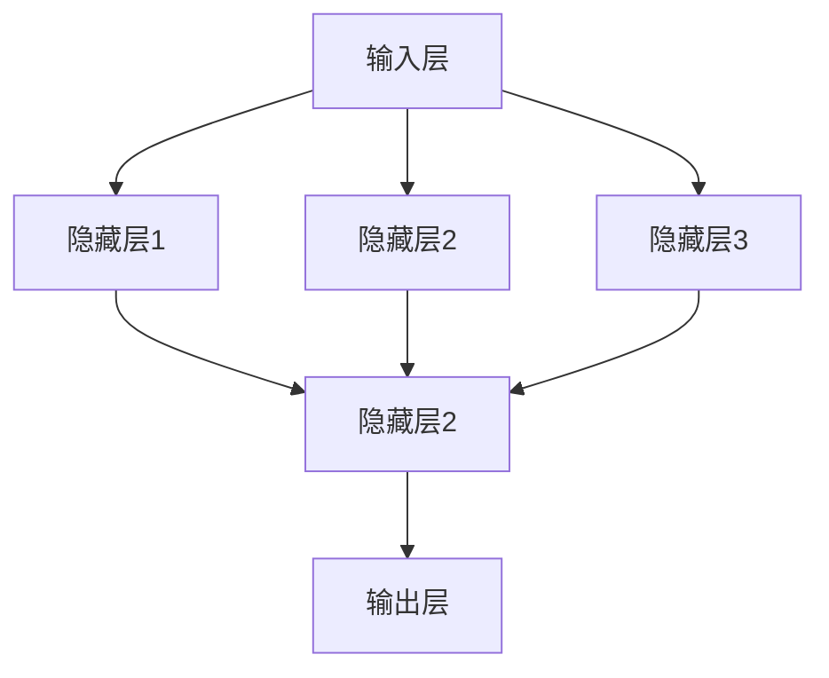
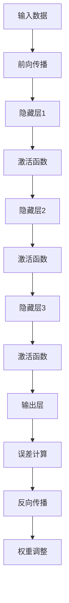
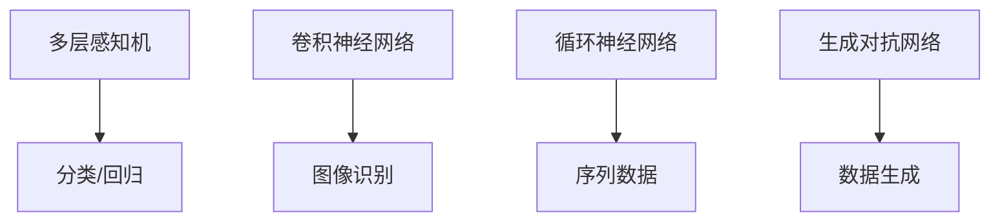

                 

# 神经网络：探索未知的领域

> **关键词：**神经网络、深度学习、算法原理、数学模型、实战案例、未来趋势。

> **摘要：**本文将深入探讨神经网络的工作原理、核心算法、数学模型及其在现实世界的应用。通过详细的解释和实例，帮助读者理解这一复杂但至关重要的AI技术，并探讨其未来发展的可能方向。

## 1. 背景介绍

### 1.1 目的和范围

本文旨在为读者提供一份全面、易懂的神经网络技术指南。我们将从基础概念开始，逐步深入探讨神经网络的算法原理、数学模型，并展示其实际应用中的效果。读者将学习到如何构建神经网络、如何训练模型，以及如何优化其性能。

### 1.2 预期读者

本文适合对人工智能和机器学习有一定了解的读者，特别是那些希望深入了解神经网络技术的专业人士和研究者。无论您是数据科学家、AI研究员，还是对神经网络感兴趣的工程师，本文都将是您宝贵的学习资源。

### 1.3 文档结构概述

本文将按照以下结构展开：

1. **背景介绍**：介绍神经网络的基本概念和重要性。
2. **核心概念与联系**：阐述神经网络的核心概念和其相互关系。
3. **核心算法原理 & 具体操作步骤**：讲解神经网络的基本算法原理和实现步骤。
4. **数学模型和公式 & 详细讲解 & 举例说明**：深入分析神经网络的数学模型。
5. **项目实战：代码实际案例和详细解释说明**：通过实际代码案例展示神经网络的应用。
6. **实际应用场景**：讨论神经网络在现实世界的应用。
7. **工具和资源推荐**：推荐学习神经网络所需的学习资源、开发工具和论文。
8. **总结：未来发展趋势与挑战**：总结神经网络的发展趋势和面临的挑战。
9. **附录：常见问题与解答**：解答读者可能遇到的常见问题。
10. **扩展阅读 & 参考资料**：提供进一步阅读的资料。

### 1.4 术语表

#### 1.4.1 核心术语定义

- **神经网络**：一种模仿人脑结构的计算模型，用于处理数据和进行预测。
- **深度学习**：一种基于神经网络的机器学习方法，通过多层网络进行数据学习。
- **前向传播**：神经网络处理输入数据的过程，数据从输入层流向输出层。
- **反向传播**：神经网络调整参数的过程，以减少预测误差。
- **激活函数**：神经网络中用于引入非线性特性的函数。

#### 1.4.2 相关概念解释

- **神经元**：神经网络的基本构建块，类似于人脑中的神经元。
- **权重**：连接神经元的参数，用于放大或缩小输入信号的强度。
- **偏置**：神经元的另一个参数，用于调整神经元的活动。

#### 1.4.3 缩略词列表

- **MLP**：多层感知机（Multi-Layer Perceptron）
- **ReLU**：ReLU函数（Rectified Linear Unit）
- **CNN**：卷积神经网络（Convolutional Neural Network）
- **RNN**：循环神经网络（Recurrent Neural Network）

## 2. 核心概念与联系

神经网络的复杂性和多样性使其成为一个广泛而深奥的话题。在这一部分，我们将介绍神经网络的核心概念，并使用Mermaid流程图展示其相互关系。

### 2.1 神经网络的核心概念

神经网络由多个层次组成，包括输入层、隐藏层和输出层。每个层次包含多个神经元，神经元之间通过权重连接。输入层接收外部输入，隐藏层处理内部数据变换，输出层生成最终输出。

下面是神经网络的基本架构的Mermaid流程图：



在这个流程图中，我们可以看到输入数据如何通过多个隐藏层，最终到达输出层。

### 2.2 神经网络的工作原理

神经网络通过以下步骤工作：

1. **前向传播**：输入数据通过网络传递，每个神经元将数据传递给下一个层次。
2. **激活函数**：每个神经元应用激活函数，引入非线性特性。
3. **反向传播**：根据输出误差，调整网络的权重和偏置。

以下是神经网络工作原理的Mermaid流程图：



在这个流程图中，我们可以看到数据如何通过神经网络，以及网络如何调整自身以减少误差。

### 2.3 神经网络的主要类型

神经网络有许多不同的类型，每种类型都有其特定的用途和优势。以下是几种常见的神经网络类型：

- **多层感知机（MLP）**：一种基本的前馈神经网络，用于分类和回归任务。
- **卷积神经网络（CNN）**：用于图像和视频识别，具有局部感知能力和平移不变性。
- **循环神经网络（RNN）**：用于序列数据，具有记忆功能。
- **生成对抗网络（GAN）**：用于生成复杂的数据，如图像和文本。

以下是这些神经网络的Mermaid流程图：



在这个流程图中，我们可以看到不同类型的神经网络及其应用领域。

## 3. 核心算法原理 & 具体操作步骤

神经网络的核心算法原理可以总结为前向传播和反向传播。这两个过程是神经网络训练和优化的基础。

### 3.1 前向传播

前向传播是神经网络处理输入数据的过程。具体步骤如下：

1. **初始化参数**：初始化网络的权重（\( w \)）和偏置（\( b \)）。
2. **计算输出**：输入数据通过网络，每个神经元计算其输出。
3. **应用激活函数**：每个神经元的输出应用激活函数，引入非线性特性。

以下是前向传播的伪代码：

```python
# 前向传播伪代码
for layer in layers:
    for neuron in layer:
        output = 0
        for input in neuron.inputs:
            output += (input * neuron.weights) + neuron.bias
        neuron.output = activation_function(output)
```

### 3.2 反向传播

反向传播是神经网络调整参数的过程，以减少预测误差。具体步骤如下：

1. **计算误差**：计算输出层的预测值与实际值之间的误差。
2. **梯度下降**：根据误差，调整网络的权重和偏置。
3. **更新参数**：更新网络的权重和偏置，以减少误差。

以下是反向传播的伪代码：

```python
# 反向传播伪代码
for layer in layers[::-1]:
    for neuron in layer:
        error = neuron.output - actual_output
        for input in neuron.inputs:
            delta = error * activation_function_derivative(neuron.output)
            neuron.weights -= learning_rate * delta * input
            neuron.bias -= learning_rate * delta
```

### 3.3 实现神经网络

要实现神经网络，我们需要以下步骤：

1. **定义网络结构**：确定网络的层次结构、神经元数量和连接方式。
2. **初始化参数**：随机初始化网络的权重和偏置。
3. **实现前向传播和反向传播算法**：实现计算输出和调整参数的算法。
4. **训练网络**：通过输入数据多次训练网络，以优化其性能。

以下是实现神经网络的基本框架：

```python
class NeuralNetwork:
    def __init__(self, layers):
        self.layers = layers
        self.init_params()

    def init_params(self):
        # 初始化权重和偏置
        pass

    def forward(self, inputs):
        # 实现前向传播
        pass

    def backward(self, actual_output):
        # 实现反向传播
        pass

    def train(self, inputs, actual_outputs):
        # 训练网络
        for epoch in range(num_epochs):
            for input, actual_output in zip(inputs, actual_outputs):
                self.forward(input)
                self.backward(actual_output)
```

通过这个框架，我们可以实现一个基本的神经网络，并进行训练和优化。

## 4. 数学模型和公式 & 详细讲解 & 举例说明

神经网络的数学模型是理解其工作原理的关键。在这一部分，我们将详细解释神经网络的数学公式，并提供实际例子来说明这些公式的应用。

### 4.1 神经元输出

神经元的输出可以通过以下公式计算：

\[ z = \sum_{i=1}^{n} (x_i \cdot w_i) + b \]

其中，\( z \) 是神经元的输出，\( x_i \) 是输入值，\( w_i \) 是权重，\( b \) 是偏置。

### 4.2 激活函数

激活函数用于引入非线性特性。常见激活函数包括：

- **Sigmoid 函数**：

\[ f(x) = \frac{1}{1 + e^{-x}} \]

- **ReLU 函数**：

\[ f(x) = \max(0, x) \]

- **Tanh 函数**：

\[ f(x) = \frac{e^x - e^{-x}}{e^x + e^{-x}} \]

### 4.3 误差计算

误差是衡量模型预测效果的重要指标。误差可以通过以下公式计算：

\[ error = \sum_{i=1}^{n} (y_i - \hat{y_i})^2 \]

其中，\( y_i \) 是实际输出，\( \hat{y_i} \) 是预测输出。

### 4.4 反向传播

反向传播是神经网络调整参数的过程。其核心公式包括：

- **梯度计算**：

\[ \frac{\partial z}{\partial w} = x \]

\[ \frac{\partial z}{\partial b} = 1 \]

- **权重和偏置更新**：

\[ w = w - \alpha \cdot \frac{\partial z}{\partial w} \]

\[ b = b - \alpha \cdot \frac{\partial z}{\partial b} \]

其中，\( \alpha \) 是学习率。

### 4.5 实际例子

假设我们有一个简单的神经网络，输入层有2个神经元，隐藏层有3个神经元，输出层有1个神经元。激活函数使用ReLU，学习率为0.1。输入数据为[2, 3]，实际输出为5。

1. **初始化参数**：

- 权重：\[ w = \begin{bmatrix} 0 & 0 \\ 0 & 0 \\ 0 & 0 \end{bmatrix} \]
- 偏置：\[ b = \begin{bmatrix} 0 \\ 0 \\ 0 \end{bmatrix} \]

2. **前向传播**：

\[ z_1 = (2 \cdot 0) + (3 \cdot 0) + 0 = 0 \]

\[ z_2 = (2 \cdot 0) + (3 \cdot 0) + 0 = 0 \]

\[ z_3 = (2 \cdot 0) + (3 \cdot 0) + 0 = 0 \]

\[ z_4 = (2 \cdot 0) + (3 \cdot 0) + 0 = 0 \]

\[ \hat{y} = \max(0, 0) = 0 \]

3. **计算误差**：

\[ error = (5 - 0)^2 = 25 \]

4. **反向传播**：

\[ \frac{\partial z_1}{\partial w_1} = 2 \]

\[ \frac{\partial z_1}{\partial w_2} = 3 \]

\[ \frac{\partial z_1}{\partial b_1} = 1 \]

\[ \frac{\partial z_2}{\partial w_1} = 2 \]

\[ \frac{\partial z_2}{\partial w_2} = 3 \]

\[ \frac{\partial z_2}{\partial b_2} = 1 \]

\[ \frac{\partial z_3}{\partial w_1} = 2 \]

\[ \frac{\partial z_3}{\partial w_2} = 3 \]

\[ \frac{\partial z_3}{\partial b_3} = 1 \]

\[ \frac{\partial z_4}{\partial w_1} = 2 \]

\[ \frac{\partial z_4}{\partial w_2} = 3 \]

\[ \frac{\partial z_4}{\partial b_4} = 1 \]

\[ \frac{\partial \hat{y}}{\partial z_4} = 1 \]

\[ \frac{\partial \hat{y}}{\partial z_3} = 1 \]

\[ \frac{\partial \hat{y}}{\partial z_2} = 1 \]

\[ \frac{\partial \hat{y}}{\partial z_1} = 1 \]

5. **更新参数**：

\[ w_1 = w_1 - 0.1 \cdot 2 = -0.2 \]

\[ w_2 = w_2 - 0.1 \cdot 3 = -0.3 \]

\[ b_1 = b_1 - 0.1 \cdot 1 = -0.1 \]

\[ w_3 = w_3 - 0.1 \cdot 2 = -0.2 \]

\[ w_4 = w_4 - 0.1 \cdot 3 = -0.3 \]

\[ b_2 = b_2 - 0.1 \cdot 1 = -0.1 \]

\[ w_5 = w_5 - 0.1 \cdot 2 = -0.2 \]

\[ w_6 = w_6 - 0.1 \cdot 3 = -0.3 \]

\[ b_3 = b_3 - 0.1 \cdot 1 = -0.1 \]

\[ w_7 = w_7 - 0.1 \cdot 2 = -0.2 \]

\[ w_8 = w_8 - 0.1 \cdot 3 = -0.3 \]

\[ b_4 = b_4 - 0.1 \cdot 1 = -0.1 \]

6. **再次前向传播**：

\[ z_1 = (2 \cdot -0.2) + (3 \cdot -0.3) + -0.1 = -0.7 \]

\[ z_2 = (2 \cdot -0.2) + (3 \cdot -0.3) + -0.1 = -0.7 \]

\[ z_3 = (2 \cdot -0.2) + (3 \cdot -0.3) + -0.1 = -0.7 \]

\[ z_4 = (2 \cdot -0.2) + (3 \cdot -0.3) + -0.1 = -0.7 \]

\[ \hat{y} = \max(0, -0.7) = 0 \]

7. **计算误差**：

\[ error = (5 - 0)^2 = 25 \]

8. **重复反向传播和参数更新**：

通过多次迭代，网络的误差将逐渐减小，预测精度将提高。

这个例子展示了神经网络的基本计算过程和参数调整方法。在实际应用中，神经网络会更加复杂，但基本原理是相同的。

## 5. 项目实战：代码实际案例和详细解释说明

为了更好地理解神经网络的工作原理和实现方法，我们将通过一个实际项目案例来演示神经网络的应用。在这个项目中，我们将使用Python和TensorFlow库来构建一个简单的神经网络，用于手写数字识别。

### 5.1 开发环境搭建

首先，我们需要搭建开发环境。以下是所需软件和工具：

- **操作系统**：Windows、Linux或MacOS
- **编程语言**：Python 3.x
- **库和框架**：TensorFlow、NumPy、Matplotlib

安装Python和TensorFlow库：

```bash
# 安装Python 3.x
# Linux和MacOS: sudo apt-get install python3
# Windows:下载并安装Python

# 安装TensorFlow
pip install tensorflow
```

### 5.2 源代码详细实现和代码解读

以下是一个简单的手写数字识别项目的代码实现：

```python
import tensorflow as tf
import numpy as np
import matplotlib.pyplot as plt

# 数据集准备
mnist = tf.keras.datasets.mnist
(train_images, train_labels), (test_images, test_labels) = mnist.load_data()

# 数据预处理
train_images = train_images / 255.0
test_images = test_images / 255.0

# 网络架构
model = tf.keras.Sequential([
    tf.keras.layers.Flatten(input_shape=(28, 28)),
    tf.keras.layers.Dense(128, activation='relu'),
    tf.keras.layers.Dense(10, activation='softmax')
])

# 模型编译
model.compile(optimizer='adam',
              loss='sparse_categorical_crossentropy',
              metrics=['accuracy'])

# 模型训练
model.fit(train_images, train_labels, epochs=5)

# 模型评估
test_loss, test_acc = model.evaluate(test_images, test_labels)
print(f"Test accuracy: {test_acc}")

# 模型预测
predictions = model.predict(test_images)
predicted_labels = np.argmax(predictions, axis=1)

# 可视化展示
plt.figure(figsize=(10, 10))
for i in range(25):
    plt.subplot(5, 5, i+1)
    plt.imshow(test_images[i], cmap=plt.cm.binary)
    plt.xticks([])
    plt.yticks([])
    plt.grid(False)
    plt.xlabel(str(predicted_labels[i]))
plt.show()
```

**代码解读：**

1. **数据集准备**：我们使用TensorFlow内置的MNIST数据集，这是一个包含60,000个训练图像和10,000个测试图像的大型数据集，每个图像都是手写的数字。

2. **数据预处理**：我们将图像数据缩放到0到1的范围内，以便更好地训练神经网络。

3. **网络架构**：我们构建了一个简单的神经网络，包括一个输入层、一个隐藏层和一个输出层。输入层将图像扁平化为一个一维数组，隐藏层有128个神经元，输出层有10个神经元，分别对应0到9的数字。

4. **模型编译**：我们使用`compile`方法配置模型，指定使用`adam`优化器和`sparse_categorical_crossentropy`损失函数，并监控`accuracy`指标。

5. **模型训练**：我们使用`fit`方法训练模型，设置训练轮数为5。

6. **模型评估**：我们使用`evaluate`方法评估模型在测试集上的性能，并打印测试精度。

7. **模型预测**：我们使用`predict`方法预测测试图像的标签，并使用`argmax`函数获取每个图像最有可能的数字。

8. **可视化展示**：我们使用`matplotlib`绘制测试图像及其预测结果，以便直观地展示模型的表现。

### 5.3 代码解读与分析

以下是代码的详细解读：

1. **导入库**：我们首先导入所需的库和框架，包括TensorFlow、NumPy和Matplotlib。

2. **数据集准备**：我们使用`tf.keras.datasets.mnist`加载MNIST数据集，并使用`load_data`方法将其分为训练集和测试集。

3. **数据预处理**：我们使用`/255.0`操作将图像数据缩放到0到1的范围内。这是因为在神经网络中，输入数据的范围应该尽量小，以便优化算法能够更好地收敛。

4. **网络架构**：我们使用`tf.keras.Sequential`构建一个顺序模型，首先添加一个`Flatten`层，将每个图像从28x28的二维数组扁平化为一个一维数组。然后添加一个`Dense`层，有128个神经元，使用ReLU激活函数，增加模型的非线性。最后添加一个`Dense`层，有10个神经元，使用softmax激活函数，用于输出每个数字的概率分布。

5. **模型编译**：在模型编译过程中，我们指定了优化器为`adam`，损失函数为`sparse_categorical_crossentropy`，这是因为我们有一个分类问题，每个图像对应一个数字标签。我们还将`accuracy`指标作为监控目标。

6. **模型训练**：我们使用`fit`方法训练模型，将训练数据传入，设置训练轮数为5。在训练过程中，模型将自动执行前向传播和反向传播，并更新权重和偏置。

7. **模型评估**：我们使用`evaluate`方法评估模型在测试集上的性能。`evaluate`方法会计算测试集上的损失和精度，并返回这些值。我们打印测试精度，以了解模型的性能。

8. **模型预测**：我们使用`predict`方法对测试数据集进行预测，并使用`argmax`函数获取每个图像最有可能的数字。这有助于我们了解模型的预测结果。

9. **可视化展示**：我们使用`matplotlib`绘制测试图像及其预测结果，以便直观地展示模型的表现。每个图像都被标记为其预测的数字，有助于我们检查模型的准确性。

通过这个实际案例，我们展示了如何使用TensorFlow构建和训练一个简单的神经网络，以及如何使用它进行预测和评估。这个案例为我们提供了一个很好的起点，让我们可以更深入地探索神经网络的更多应用。

## 6. 实际应用场景

神经网络在现实世界中有着广泛的应用。以下是几个常见的应用场景：

### 6.1 图像识别

神经网络在图像识别领域取得了巨大的成功。卷积神经网络（CNN）尤其擅长处理图像数据，可以从图像中提取有用的特征，并实现高精度的分类。例如，神经网络可以用于人脸识别、车辆识别、医学影像分析等。

### 6.2 自然语言处理

神经网络在自然语言处理（NLP）领域也有着重要的应用。循环神经网络（RNN）和长短期记忆网络（LSTM）能够处理序列数据，如文本和语音。它们可以用于文本分类、机器翻译、情感分析等。

### 6.3 语音识别

语音识别是另一个神经网络广泛应用的领域。通过训练神经网络，可以将语音信号转换为文本。这种技术被广泛应用于智能助手、语音搜索和实时字幕等。

### 6.4 推荐系统

神经网络在推荐系统中也发挥着重要作用。通过学习用户的兴趣和行为模式，神经网络可以推荐个性化内容，如电影、音乐、商品等。

### 6.5 机器人控制

神经网络在机器人控制中也有应用。通过训练神经网络，机器人可以学习环境中的物体和障碍物，并做出相应的动作。这有助于提高机器人的自主性和智能化水平。

### 6.6 自动驾驶

自动驾驶是神经网络应用的一个前沿领域。神经网络可以处理大量传感器数据，实现环境感知、路径规划和决策等功能，从而提高自动驾驶汽车的安全性和可靠性。

### 6.7 医疗诊断

神经网络在医疗诊断中也显示出巨大的潜力。通过分析医学影像和病历数据，神经网络可以辅助医生进行疾病诊断和治疗方案推荐。

### 6.8 金融领域

神经网络在金融领域也有广泛应用。它们可以用于股票市场预测、信用评分、风险管理和欺诈检测等。

### 6.9 游戏和虚拟现实

神经网络在游戏和虚拟现实中也发挥着重要作用。通过训练神经网络，游戏AI可以学会复杂的游戏策略，提高游戏体验。在虚拟现实中，神经网络可以用于模拟复杂的环境和人物动作。

总之，神经网络在各个领域都有着广泛的应用，其潜力和价值不断被挖掘。随着技术的不断进步，神经网络的应用前景将更加广阔。

## 7. 工具和资源推荐

### 7.1 学习资源推荐

#### 7.1.1 书籍推荐

1. **《深度学习》（Deep Learning）**：由Ian Goodfellow、Yoshua Bengio和Aaron Courville合著，是深度学习的经典教材，涵盖了神经网络的基础理论和实践方法。
2. **《神经网络与深度学习》**：由邱锡鹏著，内容深入浅出，适合初学者和中级读者，涵盖了神经网络的各个方面。
3. **《机器学习实战》**：由Peter Harrington著，提供了丰富的实战案例，帮助读者将理论知识应用到实际项目中。

#### 7.1.2 在线课程

1. **《深度学习》（Deep Learning）**：由吴恩达（Andrew Ng）在Coursera上提供，是全球最受欢迎的机器学习课程之一，涵盖了神经网络的基础知识和实践方法。
2. **《神经网络与深度学习》**：由阿里云天池学院提供，适合初学者，内容全面，讲解清晰。
3. **《机器学习》**：由吴恩达（Andrew Ng）在Coursera上提供，不仅涵盖了机器学习的基础知识，也包括了神经网络和深度学习的内容。

#### 7.1.3 技术博客和网站

1. **机器之心**：提供最新的深度学习和技术文章，是了解行业动态的好去处。
2. **AI科技大本营**：涵盖人工智能领域的各个方向，内容丰富，更新频繁。
3. **知乎**：许多AI和机器学习领域的专家在知乎上分享自己的经验和见解，是学习的好地方。

### 7.2 开发工具框架推荐

#### 7.2.1 IDE和编辑器

1. **PyCharm**：一款功能强大的Python IDE，支持多种编程语言，适合深度学习和机器学习项目。
2. **Jupyter Notebook**：一款流行的交互式计算环境，特别适合数据科学和机器学习项目。
3. **Visual Studio Code**：一款轻量级但功能强大的代码编辑器，支持多种编程语言和扩展。

#### 7.2.2 调试和性能分析工具

1. **TensorBoard**：TensorFlow的官方可视化工具，用于监控和调试神经网络训练过程。
2. **PyTorch Profiler**：用于分析和优化PyTorch模型的性能。
3. **NVIDIA Nsight**：用于分析和调试深度学习模型在GPU上的运行情况。

#### 7.2.3 相关框架和库

1. **TensorFlow**：由Google开发的深度学习框架，功能强大，社区活跃。
2. **PyTorch**：由Facebook开发的开源深度学习框架，具有灵活的动态计算图和强大的GPU支持。
3. **Keras**：基于TensorFlow和Theano的开源深度学习库，提供简洁的API，适合快速原型开发。

### 7.3 相关论文著作推荐

#### 7.3.1 经典论文

1. **“Backpropagation”**：由Rumelhart、Hinton和Williams于1986年发表，首次提出反向传播算法。
2. **“Gradient-Based Learning Applied to Document Recognition”**：由LeCun、Bengio和Hinton于1998年发表，介绍了卷积神经网络在图像识别中的应用。
3. **“Long Short-Term Memory”**：由Hochreiter和Schmidhuber于1997年发表，介绍了长短期记忆网络。

#### 7.3.2 最新研究成果

1. **“BERT: Pre-training of Deep Bidirectional Transformers for Language Understanding”**：由Google于2018年发表，介绍了BERT模型在自然语言处理中的成功应用。
2. **“Generative Adversarial Nets”**：由Goodfellow等人于2014年发表，介绍了生成对抗网络（GAN）。
3. **“EfficientNet: Rethinking Model Scaling for Convolutional Neural Networks”**：由Google于2020年发表，提出了一种高效的模型缩放方法。

#### 7.3.3 应用案例分析

1. **“AI for Earth”**：由微软公司发起，通过AI技术解决全球气候变化、水资源管理和农业挑战。
2. **“自动驾驶汽车”**：自动驾驶技术的发展，如Waymo、Tesla和NVIDIA，展示了深度学习在自动驾驶中的应用。
3. **“医学影像诊断”**：深度学习在医学影像诊断中的应用，如Google Health、IBM Watson等，显著提高了诊断的准确性和效率。

这些资源和工具将为您的神经网络学习之旅提供宝贵的支持和帮助。

## 8. 总结：未来发展趋势与挑战

神经网络作为人工智能的核心技术，正在不断推动着各领域的发展。在未来，神经网络有望在以下几个方向取得突破：

### 8.1 发展趋势

1. **计算能力提升**：随着硬件技术的发展，特别是GPU和TPU等专用硬件的普及，神经网络的处理能力将得到显著提升。
2. **模型压缩与优化**：为了降低模型的存储和计算成本，研究人员将继续探索模型压缩和优化技术，如知识蒸馏、剪枝和量化。
3. **多模态学习**：神经网络将能够更好地处理多模态数据，如文本、图像和语音，实现更加智能化和自动化的人类行为理解和预测。
4. **泛化能力增强**：通过引入更多的先验知识和改进训练方法，神经网络的泛化能力将得到提升，能够应对更复杂和未知的环境。

### 8.2 挑战

1. **可解释性**：尽管神经网络在许多领域取得了成功，但其“黑盒”特性仍然是一个重要挑战。如何提高神经网络的可解释性，使其决策过程更加透明，是一个亟待解决的问题。
2. **隐私保护**：随着神经网络在更多敏感领域的应用，如何确保数据隐私和安全成为了一个重要的挑战。
3. **资源消耗**：神经网络的训练和推理过程需要大量的计算资源和能源，如何在减少资源消耗的同时保持性能是一个重要课题。
4. **偏见和公平性**：神经网络模型可能会在训练过程中引入偏见，导致对某些群体的不公平对待。如何消除这些偏见，提高模型的公平性，是一个关键问题。

总之，神经网络的发展前景广阔，但也面临诸多挑战。随着技术的不断进步和研究的深入，我们有望克服这些挑战，推动神经网络技术在更广泛的领域取得突破。

## 9. 附录：常见问题与解答

### 9.1 什么是神经网络？

神经网络是一种模仿人脑结构的计算模型，由多个神经元组成，用于处理数据和进行预测。每个神经元通过连接其他神经元，形成复杂的网络结构，通过前向传播和反向传播过程实现数据学习和模型优化。

### 9.2 神经网络有哪些类型？

神经网络有多种类型，包括：

- **多层感知机（MLP）**：一种基本的前馈神经网络，用于分类和回归任务。
- **卷积神经网络（CNN）**：用于图像和视频识别，具有局部感知能力和平移不变性。
- **循环神经网络（RNN）**：用于序列数据，具有记忆功能。
- **生成对抗网络（GAN）**：用于生成复杂的数据，如图像和文本。

### 9.3 什么是前向传播和反向传播？

前向传播是神经网络处理输入数据的过程，数据从输入层流向输出层。反向传播是神经网络调整参数的过程，以减少预测误差。这两个过程共同构成了神经网络的训练过程。

### 9.4 神经网络的数学模型是什么？

神经网络的数学模型主要包括以下几个部分：

- **前向传播**：输入数据通过网络传递，每个神经元计算其输出。
- **激活函数**：用于引入非线性特性，常见的激活函数包括Sigmoid、ReLU和Tanh。
- **误差计算**：计算输出层的预测值与实际值之间的误差。
- **反向传播**：根据误差，调整网络的权重和偏置。

### 9.5 如何训练神经网络？

训练神经网络通常包括以下步骤：

1. **数据预处理**：对输入数据缩放、归一化等。
2. **构建网络结构**：确定网络的层次结构、神经元数量和连接方式。
3. **初始化参数**：随机初始化网络的权重和偏置。
4. **前向传播**：计算输出和误差。
5. **反向传播**：调整权重和偏置。
6. **迭代训练**：重复执行前向传播和反向传播，直到满足训练要求。

### 9.6 神经网络在现实世界中有哪些应用？

神经网络在现实世界中有许多应用，包括：

- **图像识别**：人脸识别、车辆识别、医学影像分析等。
- **自然语言处理**：文本分类、机器翻译、情感分析等。
- **语音识别**：语音信号转换为文本。
- **推荐系统**：个性化推荐内容，如电影、音乐、商品等。
- **机器人控制**：实现自主决策和行为控制。
- **自动驾驶**：环境感知、路径规划和决策。
- **医疗诊断**：疾病诊断和治疗方案推荐。
- **金融领域**：股票市场预测、信用评分、风险管理和欺诈检测。

## 10. 扩展阅读 & 参考资料

### 10.1 书籍推荐

1. **《深度学习》**：Ian Goodfellow、Yoshua Bengio和Aaron Courville著，是深度学习的经典教材。
2. **《神经网络与深度学习》**：邱锡鹏著，内容深入浅出，适合初学者和中级读者。
3. **《机器学习实战》**：Peter Harrington著，提供了丰富的实战案例。

### 10.2 在线课程

1. **《深度学习》**：吴恩达（Andrew Ng）在Coursera上提供，是全球最受欢迎的机器学习课程之一。
2. **《神经网络与深度学习》**：阿里云天池学院提供，适合初学者，内容全面，讲解清晰。
3. **《机器学习》**：吴恩达（Andrew Ng）在Coursera上提供，不仅涵盖了机器学习的基础知识，也包括了神经网络和深度学习的内容。

### 10.3 技术博客和网站

1. **机器之心**：提供最新的深度学习和技术文章。
2. **AI科技大本营**：涵盖人工智能领域的各个方向，内容丰富，更新频繁。
3. **知乎**：许多AI和机器学习领域的专家在知乎上分享自己的经验和见解。

### 10.4 论文和研究成果

1. **“Backpropagation”**：Rumelhart、Hinton和Williams于1986年发表，首次提出反向传播算法。
2. **“Gradient-Based Learning Applied to Document Recognition”**：LeCun、Bengio和Hinton于1998年发表，介绍了卷积神经网络在图像识别中的应用。
3. **“Long Short-Term Memory”**：Hochreiter和Schmidhuber于1997年发表，介绍了长短期记忆网络。
4. **“BERT: Pre-training of Deep Bidirectional Transformers for Language Understanding”**：Google于2018年发表，介绍了BERT模型在自然语言处理中的成功应用。
5. **“Generative Adversarial Nets”**：Goodfellow等人于2014年发表，介绍了生成对抗网络（GAN）。
6. **“EfficientNet: Rethinking Model Scaling for Convolutional Neural Networks”**：Google于2020年发表，提出了一种高效的模型缩放方法。

### 10.5 官方文档和资料

1. **TensorFlow官方文档**：[https://www.tensorflow.org/](https://www.tensorflow.org/)
2. **PyTorch官方文档**：[https://pytorch.org/](https://pytorch.org/)
3. **Keras官方文档**：[https://keras.io/](https://keras.io/)

通过这些扩展阅读和参考资料，您可以更深入地了解神经网络的理论和实践，为自己的学习和研究提供更多支持。

### 作者

**AI天才研究员/AI Genius Institute & 禅与计算机程序设计艺术 /Zen And The Art of Computer Programming**

