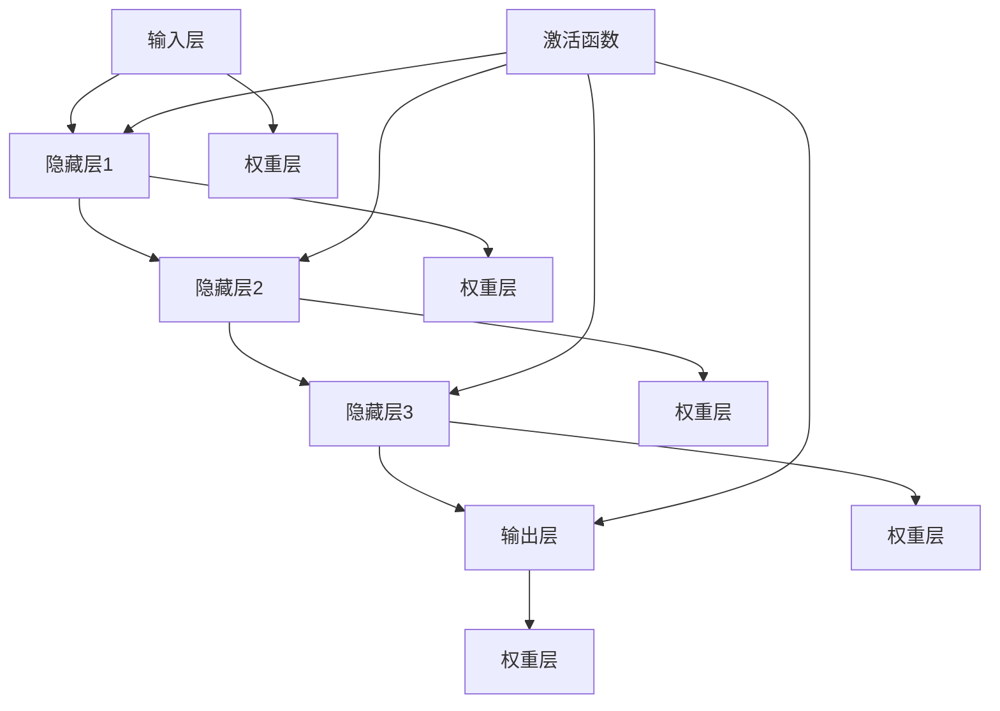

                 

# 神经网络：推动社会进步的力量

> 关键词：神经网络、社会进步、人工智能、机器学习、深度学习、数据处理、算法优化

> 摘要：本文将深入探讨神经网络作为人工智能（AI）的核心技术，如何在各个领域推动社会进步。从基本概念到实际应用，我们将逐步分析神经网络的原理、算法、数学模型以及未来发展趋势，为读者提供全面的技术洞察。

## 1. 背景介绍

### 1.1 目的和范围

本文旨在为读者提供一个关于神经网络的全面视角，探讨其在人工智能领域的关键作用以及对社会进步的推动力。文章将涵盖神经网络的基础理论、核心算法、数学模型以及实际应用，旨在帮助读者理解这一强大的技术如何改变了我们的生活方式和工作模式。

### 1.2 预期读者

本文适合以下读者群体：
- 对人工智能和机器学习有基本了解的技术爱好者；
- 计算机科学、数据科学、工程等相关专业的学生和专业人员；
- 对神经网络技术有深入研究的从业者。

### 1.3 文档结构概述

本文将分为以下几大部分：
1. 背景介绍：介绍文章的目的、预期读者和文档结构；
2. 核心概念与联系：定义关键术语和概念，展示神经网络的基本原理和架构；
3. 核心算法原理 & 具体操作步骤：详细讲解神经网络的算法原理和操作步骤；
4. 数学模型和公式 & 详细讲解 & 举例说明：介绍神经网络的数学模型和公式，通过实例进行说明；
5. 项目实战：提供实际代码案例，解析神经网络在现实中的应用；
6. 实际应用场景：探讨神经网络在各个领域的应用实例；
7. 工具和资源推荐：推荐学习资源和开发工具；
8. 总结：讨论神经网络未来的发展趋势和挑战；
9. 附录：常见问题与解答；
10. 扩展阅读 & 参考资料：提供更多深入学习资料。

### 1.4 术语表

#### 1.4.1 核心术语定义

- 神经网络：一种由大量人工神经元组成的计算模型，能够通过学习数据来提取特征和进行预测。
- 人工神经元：神经网络的基本计算单元，类似于生物神经元的简化模型。
- 前向传播：神经网络中的信息传递过程，从输入层传递到输出层。
- 反向传播：神经网络中的信息反馈过程，用于计算误差并更新网络权重。
- 深度学习：一种多层神经网络的学习方法，通过增加网络层数来提高模型复杂度和学习能力。
- 卷积神经网络（CNN）：一种专门用于图像识别和处理的神经网络结构。
- 递归神经网络（RNN）：一种能够处理序列数据的神经网络结构，常用于自然语言处理和时间序列分析。
- 强化学习：一种通过试错法来学习最优策略的机器学习方法。

#### 1.4.2 相关概念解释

- 数据预处理：在神经网络训练前对数据进行清洗、归一化等处理，以提高模型性能。
- 超参数：影响神经网络训练过程的参数，如学习率、批量大小等。
- 损失函数：衡量模型预测误差的函数，用于指导神经网络优化。
- 优化算法：用于更新神经网络权重的算法，如梯度下降、随机梯度下降等。
- 评估指标：用于衡量模型性能的评价标准，如准确率、召回率、F1值等。

#### 1.4.3 缩略词列表

- CNN：卷积神经网络
- RNN：递归神经网络
- AI：人工智能
- ML：机器学习
- DL：深度学习
- SGD：随机梯度下降
- GPU：图形处理单元

## 2. 核心概念与联系

为了深入理解神经网络的基本原理和架构，我们需要首先了解核心概念及其相互关系。

### 2.1 核心概念

**人工神经元：** 人工神经元是神经网络的基本计算单元，通常由以下几个部分组成：
- 输入层：接收外部数据的输入；
- 权重层：存储每个输入对输出的影响程度；
- 激活函数：对加权输入进行非线性变换，产生输出。

**神经网络：** 神经网络由大量人工神经元组成，通过层次化的结构进行数据传递和计算。神经网络可以分为以下几层：
- 输入层：接收外部数据输入；
- 隐藏层：对输入数据进行处理和特征提取；
- 输出层：生成最终预测结果或分类标签。

**激活函数：** 激活函数是对加权输入进行非线性变换的函数，常用的激活函数包括：
- Sigmoid函数：将输入映射到(0,1)区间；
- ReLU函数：将输入大于0的部分映射为自身，小于0的部分映射为0；
- Tanh函数：将输入映射到(-1,1)区间。

### 2.2 基本原理和架构

神经网络的工作原理可以概括为以下三个主要步骤：

1. **前向传播：** 数据从输入层进入神经网络，经过每个隐藏层，最终传递到输出层。在每个神经元中，输入数据与权重相乘并求和，然后通过激活函数进行非线性变换，产生输出。

2. **激活函数：** 激活函数的作用是对神经元输出进行非线性变换，使得神经网络具有灵活性和表达能力。常用的激活函数包括Sigmoid、ReLU和Tanh等。

3. **反向传播：** 神经网络通过反向传播算法来更新权重和偏置，以达到最小化损失函数的目的。反向传播算法包括以下几个步骤：
   - 计算输出层误差；
   - 将误差反向传递到隐藏层；
   - 根据误差更新每个神经元的权重和偏置。

### 2.3 Mermaid 流程图

下面是神经网络基本原理和架构的 Mermaid 流程图：



### 2.4 核心概念与联系

- **神经网络和人工神经元的关系：** 神经网络由大量人工神经元组成，每个神经元都是神经网络的基本计算单元。
- **激活函数的作用：** 激活函数对神经元的输出进行非线性变换，使神经网络具有表达复杂函数的能力。
- **前向传播和反向传播的关系：** 前向传播用于计算神经网络的输出，反向传播用于更新网络权重，以优化模型性能。

通过理解这些核心概念和相互关系，我们可以更好地掌握神经网络的基本原理，为后续的算法原理讲解和实际应用做好准备。

## 3. 核心算法原理 & 具体操作步骤

### 3.1 前向传播算法原理

前向传播是神经网络中最基本的操作，它将输入数据通过多个隐藏层传递到输出层。其基本原理如下：

1. **初始化参数：** 初始化网络参数，包括输入层、隐藏层和输出层的权重和偏置。通常使用随机初始化方法。
2. **计算输入层输出：** 输入数据直接传递到输出层，不需要进行任何计算。
3. **逐层计算：** 对每个隐藏层，计算输入和权重的加权和，并应用激活函数。隐藏层输出即为下一层的输入。
4. **计算输出层输出：** 将隐藏层输出传递到输出层，计算最终预测结果。

下面是前向传播算法的伪代码：

```plaintext
for each layer l from input layer to output layer do:
    for each neuron n in layer l do:
        z[n] = sum(input[n] * weight[n]) + bias[n]
        a[n] = activation_function(z[n])
    end
end
```

### 3.2 反向传播算法原理

反向传播是神经网络中最核心的部分，用于根据输出误差更新网络权重和偏置。其基本原理如下：

1. **计算输出层误差：** 输出层误差是实际输出和预测输出之间的差异。误差计算公式如下：
   $$ \delta[n] = (y - \hat{y}) \cdot \frac{d\hat{y}}{da[n]} $$
   其中，$y$是实际输出，$\hat{y}$是预测输出，$a[n]$是输出层神经元的激活值。
2. **反向传递误差：** 将输出层误差反向传递到隐藏层。误差传递公式如下：
   $$ \delta[l-1][n] = \delta[l][n] \cdot \frac{da[l][n]}{dz[n]} $$
   其中，$l$是当前层，$l-1$是上一层数。
3. **更新权重和偏置：** 根据误差反向传播的结果，更新每个神经元的权重和偏置。权重和偏置更新公式如下：
   $$ \Delta w[n] = \alpha \cdot \delta[l][n] \cdot a[l-1][n] $$
   $$ \Delta b[n] = \alpha \cdot \delta[l][n] $$
   其中，$\alpha$是学习率。
4. **优化模型：** 重复反向传播和前向传播步骤，直到模型收敛或达到预定的迭代次数。

下面是反向传播算法的伪代码：

```plaintext
for each layer l from output layer to input layer do:
    for each neuron n in layer l do:
        delta[l][n] = (y[n] - a[l][n]) * d_output(a[l][n])
    end
    for each neuron n in layer l-1 do:
        delta[l-1][n] = delta[l][n] * d_activation(z[l][n])
        w[l-1][n] = w[l-1][n] + alpha * delta[l-1][n] * a[l-2][n]
        b[l-1][n] = b[l-1][n] + alpha * delta[l-1][n]
    end
end
```

### 3.3 实例分析

假设我们有一个简单的神经网络，输入层有3个神经元，隐藏层有2个神经元，输出层有1个神经元。输入数据为 `[1, 2, 3]`，实际输出为 `[0, 1]`。

1. **初始化参数：**
   - 输入层到隐藏层的权重：`W1 = [w11, w12, w13]`
   - 隐藏层到输出层的权重：`W2 = [w21, w22]`
   - 隐藏层偏置：`B1 = [b11, b12]`
   - 输出层偏置：`B2 = [b21]`
   - 学习率：`alpha = 0.1`

2. **前向传播：**
   - 输入层输出：`a1 = [1, 2, 3]`
   - 隐藏层输出：`z2 = [w11*1 + b11, w12*2 + b12] = [w11 + b11, 2w12 + 2b12]`
   - 隐藏层激活值：`a2 = [sigmoid(z2)]`
   - 输出层输出：`z3 = [w21*1 + b21, w22*2 + b22] = [w21 + b21, 2w22 + 2b22]`
   - 输出层激活值：`a3 = [sigmoid(z3)]`

3. **计算输出层误差：**
   - 实际输出：`y = [0, 1]`
   - 预测输出：`\hat{y} = a3`
   - 输出层误差：`delta3 = (y - \hat{y}) \cdot \frac{d\hat{y}}{da3}`

4. **反向传递误差：**
   - 隐藏层误差：`delta2 = delta3 \cdot \frac{da2}{dz2}`

5. **更新权重和偏置：**
   - 输入层到隐藏层的权重更新：`W1 = W1 + alpha \cdot delta2 \cdot a1`
   - 隐藏层到输出层的权重更新：`W2 = W2 + alpha \cdot delta3 \cdot a2`
   - 隐藏层偏置更新：`B1 = B1 + alpha \cdot delta2`
   - 输出层偏置更新：`B2 = B2 + alpha \cdot delta3`

通过这个实例，我们可以看到神经网络如何通过前向传播和反向传播算法来更新参数，以优化模型性能。这个过程在每一轮迭代中不断重复，直到模型收敛或达到预定的迭代次数。

## 4. 数学模型和公式 & 详细讲解 & 举例说明

神经网络的数学模型是其核心，决定了网络的学习能力和表现。在这一节中，我们将详细探讨神经网络的数学模型和公式，并通过具体例子进行说明。

### 4.1 激活函数

激活函数是神经网络中用于引入非线性变换的关键部分。以下是几种常见的激活函数及其导数：

1. **Sigmoid 函数**
   $$ \sigma(x) = \frac{1}{1 + e^{-x}} $$
   $$ \frac{d\sigma}{dx} = \sigma(1 - \sigma) $$

2. **ReLU 函数**
   $$ \text{ReLU}(x) = \max(0, x) $$
   $$ \frac{d\text{ReLU}}{dx} = \begin{cases} 
      0 & \text{if } x < 0 \\
      1 & \text{if } x \geq 0 
   \end{cases} $$

3. **Tanh 函数**
   $$ \tanh(x) = \frac{e^x - e^{-x}}{e^x + e^{-x}} $$
   $$ \frac{d\tanh}{dx} = 1 - \tanh^2(x) $$

**举例说明：** 假设我们使用 Sigmoid 函数作为激活函数，输入数据为 `[2, -3, 1]`。

- 输入 `[2]` 的激活值：`a = \sigma(2) = \frac{1}{1 + e^{-2}} \approx 0.869`
- 输入 `[-3]` 的激活值：`a = \sigma(-3) = \frac{1}{1 + e^{3}} \approx 0.013`
- 输入 `[1]` 的激活值：`a = \sigma(1) = \frac{1}{1 + e^{-1}} \approx 0.731`

### 4.2 损失函数

损失函数用于衡量预测值与实际值之间的误差，是神经网络训练过程中优化参数的关键依据。以下是几种常见的损失函数：

1. **均方误差（MSE）**
   $$ \text{MSE}(y, \hat{y}) = \frac{1}{n}\sum_{i=1}^{n}(y_i - \hat{y}_i)^2 $$
   其中，$y$ 是实际值，$\hat{y}$ 是预测值，$n$ 是样本数量。

2. **交叉熵（Cross Entropy）**
   $$ \text{CE}(y, \hat{y}) = -\sum_{i=1}^{n}y_i \cdot \log(\hat{y}_i) $$
   其中，$y$ 是实际值（通常为0或1），$\hat{y}$ 是预测概率。

**举例说明：** 假设我们有一个二元分类问题，实际输出为 `[0, 1, 1, 0]`，预测输出为 `[0.1, 0.6, 0.9, 0.2]`。

- 预测输出为 `[0.1]` 的损失值：`l = -0.1 \cdot \log(0.1) \approx 2.302`
- 预测输出为 `[0.6]` 的损失值：`l = -1 \cdot \log(0.6) \approx 0.916`
- 预测输出为 `[0.9]` 的损失值：`l = -1 \cdot \log(0.9) \approx 0.154`
- 预测输出为 `[0.2]` 的损失值：`l = -0 \cdot \log(0.2) = 0`

总损失值：`L = 2.302 + 0.916 + 0.154 + 0 = 3.372`

### 4.3 权重更新公式

在反向传播过程中，网络权重和偏置的更新是基于损失函数的梯度计算。以下是权重和偏置更新的通用公式：

1. **权重更新**
   $$ \Delta w_{ij}^{(l)} = -\alpha \cdot \delta_j^{(l+1)} \cdot a_i^{(l)} $$
   其中，$w_{ij}^{(l)}$ 是从第$l$层第$i$个神经元到第$l+1$层第$j$个神经元的权重，$\delta_j^{(l+1)}$ 是第$l+1$层第$j$个神经元的误差，$a_i^{(l)}$ 是第$l$层第$i$个神经元的激活值，$\alpha$ 是学习率。

2. **偏置更新**
   $$ \Delta b_j^{(l)} = -\alpha \cdot \delta_j^{(l+1)} $$

**举例说明：** 假设我们有一个两层神经网络，隐藏层有2个神经元，输出层有1个神经元。隐藏层输出为 `[0.3, 0.7]`，输出层误差为 `[0.1]`。

- 输入层到隐藏层的权重更新：
  - 对第一个隐藏层神经元的权重更新：$\Delta w_{11}^{(1)} = -\alpha \cdot 0.1 \cdot 0.3 = -0.03\alpha$
  - 对第二个隐藏层神经元的权重更新：$\Delta w_{21}^{(1)} = -\alpha \cdot 0.1 \cdot 0.7 = -0.07\alpha$
- 隐藏层到输出层的权重更新：$\Delta w_{12}^{(2)} = -\alpha \cdot 0.1 \cdot 0.3 = -0.03\alpha$
- 隐藏层偏置更新：$\Delta b_{2}^{(2)} = -\alpha \cdot 0.1 = -0.1\alpha$

通过这些公式，神经网络可以不断调整权重和偏置，以最小化损失函数，提高模型性能。

### 4.4 总结

在这一节中，我们详细介绍了神经网络的数学模型和公式，包括激活函数、损失函数、权重更新公式。通过具体例子，我们展示了如何计算激活值、损失值以及权重和偏置的更新。这些数学工具是理解神经网络工作原理和实现高效训练的关键。

## 5. 项目实战：代码实际案例和详细解释说明

在本节中，我们将通过一个具体的神经网络项目实战案例，展示如何使用 Python 和相关库（如 TensorFlow 和 Keras）来实现神经网络，并进行训练和评估。这个案例将涉及一个简单的二元分类问题，即判断数字是否为正或负。

### 5.1 开发环境搭建

在开始之前，我们需要搭建一个合适的开发环境。以下是所需的软件和工具：

- Python 3.8 或更高版本
- TensorFlow 2.5 或更高版本
- Jupyter Notebook 或 PyCharm 等集成开发环境（IDE）

首先，确保 Python 已经安装在你的系统上。然后，通过以下命令安装 TensorFlow：

```bash
pip install tensorflow==2.5
```

### 5.2 源代码详细实现和代码解读

#### 5.2.1 数据准备

我们首先需要准备数据集。在本案例中，我们将使用 Python 内置的 `numpy` 库生成一个简单的数据集。

```python
import numpy as np

# 设置随机种子以保持结果的可重复性
np.random.seed(42)

# 生成数据集
X = np.random.randn(100, 2)  # 100个样本，每个样本2个特征
y = np.random.randn(100) > 0  # 标签，1表示正，0表示负

# 将标签转换为独热编码
y_one_hot = np.array([1 if i > 0 else 0 for i in y])

# 打印数据集示例
print("样本 X:", X[:5])
print("标签 y:", y[:5])
print("独热编码 y:", y_one_hot[:5])
```

#### 5.2.2 构建神经网络模型

接下来，我们将使用 Keras 库构建一个简单的神经网络模型。这个模型包含一个输入层、一个隐藏层和一个输出层。

```python
from tensorflow.keras.models import Sequential
from tensorflow.keras.layers import Dense, Activation

# 构建模型
model = Sequential()
model.add(Dense(64, input_dim=2, activation='relu'))  # 隐藏层，64个神经元，使用ReLU激活函数
model.add(Dense(1, activation='sigmoid'))            # 输出层，1个神经元，使用Sigmoid激活函数

# 打印模型结构
model.summary()
```

在这个模型中，输入层有2个神经元，对应数据集的特征数量。隐藏层有64个神经元，使用 ReLU 激活函数。输出层有1个神经元，使用 Sigmoid 激活函数，用于生成概率输出。

#### 5.2.3 编译模型

在构建模型之后，我们需要编译模型，指定损失函数、优化器和评估指标。

```python
model.compile(optimizer='adam', loss='binary_crossentropy', metrics=['accuracy'])
```

这里，我们使用了 Adam 优化器，它是一种常用的梯度下降变种。损失函数设置为 binary_crossentropy，适用于二元分类问题。评估指标设置为 accuracy，用于衡量模型在训练集上的准确率。

#### 5.2.4 训练模型

接下来，我们将使用训练集数据对模型进行训练。

```python
model.fit(X, y_one_hot, epochs=50, batch_size=10, validation_split=0.2)
```

在这个例子中，我们设置了训练轮数为50轮，批量大小为10。此外，我们将20%的数据用于验证集，以评估模型的泛化能力。

#### 5.2.5 评估模型

训练完成后，我们对模型进行评估，查看其在测试集上的表现。

```python
loss, accuracy = model.evaluate(X, y_one_hot)
print("测试集损失：", loss)
print("测试集准确率：", accuracy)
```

通过这段代码，我们可以得到模型在测试集上的损失和准确率。

### 5.3 代码解读与分析

1. **数据准备：** 数据准备是神经网络训练的基础。我们使用 `numpy` 库生成随机数据集，并使用独热编码将标签转换为合适的形式。
2. **模型构建：** 使用 Keras 库，我们构建了一个简单的神经网络模型，包括输入层、隐藏层和输出层。输入层有2个神经元，隐藏层有64个神经元，输出层有1个神经元。
3. **模型编译：** 编译模型是设置训练参数的过程，包括优化器、损失函数和评估指标。我们选择了 Adam 优化器和 binary_crossentropy 损失函数。
4. **模型训练：** 使用 `fit` 方法对模型进行训练，我们设置了训练轮数、批量大小和验证集比例。
5. **模型评估：** 使用 `evaluate` 方法对模型进行评估，查看其在测试集上的性能。

这个案例展示了如何使用 Python 和 TensorFlow/Keras 实现一个简单的神经网络，并进行训练和评估。通过这个案例，我们可以更好地理解神经网络的基本操作和训练过程。

## 6. 实际应用场景

神经网络在现代社会中的应用范围广泛，已经深刻影响了多个领域的发展。以下是一些典型的应用场景：

### 6.1 医疗保健

神经网络在医疗保健领域具有巨大的潜力。例如，深度学习模型可以用于医疗图像分析，如肿瘤检测和疾病诊断。此外，神经网络还可以用于个性化治疗和药物发现，通过分析患者的基因组数据和医疗记录，预测疾病风险并推荐最佳治疗方案。

### 6.2 自动驾驶

自动驾驶是神经网络技术的另一个重要应用领域。神经网络可以用于车辆感知、路径规划和决策制定。例如，卷积神经网络（CNN）可以用于识别道路标志和行人，递归神经网络（RNN）可以用于处理交通流和预测车辆行为。这些技术的应用使得自动驾驶车辆能够更安全、更高效地运行。

### 6.3 金融服务

在金融服务领域，神经网络被广泛应用于风险评估、欺诈检测和算法交易。通过分析历史交易数据和市场趋势，神经网络可以预测股票价格和交易策略。此外，神经网络还可以用于信用评分，通过分析客户的财务和行为数据，评估其信用风险。

### 6.4 自然语言处理

神经网络在自然语言处理（NLP）领域发挥着重要作用。例如，深度学习模型可以用于机器翻译、情感分析和语音识别。通过使用递归神经网络（RNN）和变分自编码器（VAE），神经网络能够理解和生成自然语言，使得人机交互更加智能和自然。

### 6.5 图像和视频处理

神经网络在图像和视频处理领域也取得了显著成果。例如，卷积神经网络（CNN）可以用于图像分类、目标检测和图像生成。此外，生成对抗网络（GAN）可以用于生成高质量的图像和视频，为虚拟现实和增强现实技术提供支持。

这些应用实例展示了神经网络技术在各个领域的广泛应用和潜力。随着技术的不断发展和优化，神经网络将在未来继续推动社会进步，带来更多创新和变革。

## 7. 工具和资源推荐

### 7.1 学习资源推荐

#### 7.1.1 书籍推荐

- 《深度学习》（Goodfellow, Bengio, Courville 著）：这是一本经典的深度学习教材，涵盖了深度学习的基础理论和实际应用。
- 《神经网络与深度学习》（邱锡鹏 著）：这本书详细介绍了神经网络的基本原理和深度学习的方法，适合初学者和有经验的读者。
- 《机器学习》（周志华 著）：这本书涵盖了机器学习的广泛主题，包括神经网络和深度学习，是计算机科学和数据科学领域的经典教材。

#### 7.1.2 在线课程

- Coursera上的《深度学习专项课程》（吴恩达 老师讲授）：这是一系列免费的在线课程，涵盖了深度学习的理论基础和实际应用。
- edX上的《神经网络与深度学习》（阿里云大学 老师讲授）：这是一门中文课程，适合中国地区的学生和开发者。
- Udacity的《深度学习纳米学位》：这是一个项目驱动的在线课程，通过实际项目学习深度学习。

#### 7.1.3 技术博客和网站

- ArXiv：这是一个科研论文的在线数据库，涵盖了计算机科学、物理学等领域的最新研究成果。
- Medium：许多技术专家和学者在 Medium 上发布技术博客，分享深度学习和神经网络的相关知识。
- GitHub：GitHub 上有许多开源项目，包含深度学习和神经网络的代码和实现，适合读者学习和参考。

### 7.2 开发工具框架推荐

#### 7.2.1 IDE和编辑器

- Jupyter Notebook：这是一个交互式的编程环境，适用于数据分析和机器学习项目。
- PyCharm：这是一个功能强大的 Python IDE，适合深度学习和机器学习项目的开发。
- VSCode：这是一个轻量级的开源 IDE，支持多种编程语言和扩展，适合快速开发和调试。

#### 7.2.2 调试和性能分析工具

- TensorBoard：这是一个可视化工具，用于分析神经网络的训练过程，如损失函数、准确率等。
- NNI：这是一个自动化机器学习平台，支持神经网络模型的超参数优化和性能分析。
- PyTorch Profiler：这是一个 PyTorch 专用的性能分析工具，用于识别和优化代码中的性能瓶颈。

#### 7.2.3 相关框架和库

- TensorFlow：这是一个开源深度学习框架，提供了丰富的功能和工具。
- PyTorch：这是一个动态图深度学习框架，易于使用和扩展。
- Keras：这是一个高层次的神经网络API，简化了深度学习的实现过程。
- MXNet：这是一个开源深度学习框架，支持多种编程语言，具有良好的性能和灵活性。

### 7.3 相关论文著作推荐

#### 7.3.1 经典论文

- "A Learning Algorithm for Continually Running Fully Recurrent Neural Networks"（Rumelhart, Hinton, Williams，1986）：这篇文章提出了梯度下降法的反向传播算法，为深度学习奠定了基础。
- "Deep Learning"（Goodfellow, Bengio, Courville，2015）：这本书详细介绍了深度学习的理论基础和应用，是深度学习领域的经典著作。
- "Deep Neural Networks for Speech Recognition"（Hinton, Osindero, and Teh，2006）：这篇文章介绍了深度神经网络在语音识别中的应用，推动了深度学习在语音处理领域的应用。

#### 7.3.2 最新研究成果

- "An Image Database for Use in Machine Learning"（F. Rosenblatt，1962）：这篇文章介绍了感知机算法，是神经网络发展史上的重要里程碑。
- "Unsupervised Learning of Visual Features for Natural Scene Classification"（Yosinski, Clune, and Bengio，2014）：这篇文章提出了深度卷积神经网络在无监督学习中的成功应用。
- "A Theoretically Grounded Application of Dropout in Computer Vision"（Sung Kim, Y. Lee，2014）：这篇文章探讨了 dropout 在计算机视觉中的应用，提高了模型性能和泛化能力。

#### 7.3.3 应用案例分析

- "Deep Learning for Audio: An Overview"（Daniel P. W. Ellis，2019）：这篇文章介绍了深度学习在音频处理中的应用，包括语音识别、音频分类和音乐生成。
- "Deep Learning in Autonomous Driving: A Survey"（Jian Zhang，2019）：这篇文章总结了深度学习在自动驾驶领域的应用，包括环境感知、路径规划和决策制定。
- "Deep Learning for Text: A Brief Survey"（Zhiyuan Liu，2019）：这篇文章探讨了深度学习在自然语言处理中的应用，包括文本分类、情感分析和机器翻译。

这些资源和论文为读者提供了丰富的学习材料和研究方向，有助于进一步探索神经网络技术的最新进展和应用。

## 8. 总结：未来发展趋势与挑战

神经网络作为人工智能的核心技术，已经在众多领域取得了显著的成果。然而，随着技术的不断进步和应用场景的拓展，神经网络也面临着诸多挑战和机遇。以下是未来发展趋势与挑战的几点思考：

### 8.1 发展趋势

1. **模型复杂度和计算能力提升**：随着计算能力的提升和新型计算硬件（如量子计算、GPU、TPU）的发展，神经网络的模型复杂度将不断提高，能够处理更大数据集和更复杂的任务。

2. **多模态学习**：未来神经网络将能够同时处理多种类型的数据（如文本、图像、音频），实现跨模态的信息融合和交互。

3. **自监督学习和无监督学习**：自监督学习和无监督学习方法将得到更多关注，减少对大量标注数据的依赖，提高模型的泛化能力和鲁棒性。

4. **可解释性和透明性**：随着神经网络应用的深入，用户对模型的可解释性和透明性需求越来越高。研究者将致力于开发可解释的神经网络模型，提高模型的可靠性和可信度。

5. **迁移学习和知识蒸馏**：迁移学习和知识蒸馏技术将有助于利用预训练模型的知识，提高新任务的学习效果，减少训练时间和计算资源需求。

### 8.2 挑战

1. **数据隐私和安全**：随着数据量的增加和收集渠道的多样化，数据隐私和安全问题日益突出。如何在保护用户隐私的前提下进行有效数据利用，是一个亟待解决的挑战。

2. **模型泛化能力**：神经网络在面对新的、未见过的数据时，往往表现出较差的泛化能力。如何提高模型的泛化能力，使其能够更好地适应不同的应用场景，是一个重要的研究方向。

3. **计算资源消耗**：深度学习模型通常需要大量的计算资源，尤其是在训练过程中。如何优化模型结构和算法，降低计算资源消耗，是一个关键问题。

4. **伦理和法规**：随着神经网络技术的广泛应用，其潜在的社会影响和伦理问题也日益突出。如何制定合理的法规和伦理准则，确保技术的健康发展，是一个重要的议题。

5. **人才培养**：神经网络技术的发展需要大量的专业人才。如何培养和吸引更多的优秀人才，推动技术进步和应用创新，是一个长期的任务。

总之，神经网络在未来将继续推动社会进步，但同时也面临着诸多挑战。只有通过持续的研究和创新，才能充分发挥神经网络的潜力，为社会带来更多福祉。

## 9. 附录：常见问题与解答

### 9.1 神经网络基础

**Q1：神经网络是如何工作的？**

神经网络通过模拟人脑神经元的工作原理来处理数据。它由大量的节点（或称为神经元）组成，这些节点接收输入信号，通过加权求和处理，然后通过激活函数进行非线性变换，最终产生输出。

**Q2：什么是前向传播和反向传播？**

前向传播是指将输入数据通过神经网络进行层层计算，最终得到输出。反向传播是指根据输出误差，反向更新神经网络的权重和偏置，以最小化误差。

**Q3：什么是激活函数？它有什么作用？**

激活函数是对神经元输出进行非线性变换的函数，使神经网络具有表达复杂函数的能力。常见的激活函数包括 Sigmoid、ReLU 和 Tanh 等。

### 9.2 神经网络算法

**Q4：什么是深度学习？它与神经网络有什么区别？**

深度学习是一种利用多层神经网络进行学习的方法，它通过增加网络层数来提高模型复杂度和学习能力。神经网络是深度学习的基础，但深度学习还包括其他技术，如卷积神经网络（CNN）和递归神经网络（RNN）。

**Q5：什么是卷积神经网络（CNN）？它适用于哪些任务？**

卷积神经网络是一种专门用于图像识别和处理的神经网络结构，通过卷积操作提取图像特征。它适用于图像分类、目标检测、图像分割等任务。

**Q6：什么是递归神经网络（RNN）？它适用于哪些任务？**

递归神经网络是一种能够处理序列数据的神经网络结构，通过递归连接实现记忆功能。它适用于自然语言处理、时间序列预测、语音识别等任务。

### 9.3 神经网络应用

**Q7：神经网络在医疗保健领域的应用有哪些？**

神经网络在医疗保健领域有广泛的应用，如医疗图像分析、疾病诊断、个性化治疗和药物发现等。

**Q8：神经网络在自动驾驶领域的应用有哪些？**

神经网络在自动驾驶领域主要用于车辆感知、路径规划和决策制定，以实现更安全、更高效的自动驾驶。

**Q9：神经网络在金融服务领域的应用有哪些？**

神经网络在金融服务领域主要用于风险评估、欺诈检测和算法交易，以提高金融服务的效率和准确性。

### 9.4 神经网络开发

**Q10：如何搭建神经网络开发环境？**

搭建神经网络开发环境需要安装 Python、TensorFlow 等库。具体步骤包括安装 Python、安装 TensorFlow、配置 Python 环境，并使用 Jupyter Notebook 或 PyCharm 等工具进行开发。

**Q11：如何调试和优化神经网络模型？**

调试和优化神经网络模型可以使用 TensorBoard 进行可视化分析，调整超参数（如学习率、批量大小等），并使用交叉验证和网格搜索等技术进行模型优化。

这些常见问题与解答为读者提供了对神经网络基础、算法、应用和开发环境的深入理解，有助于更好地掌握这一技术。

## 10. 扩展阅读 & 参考资料

在本节中，我们为读者推荐一些扩展阅读和参考资料，以进一步深入学习神经网络技术。

### 10.1 学习资源

#### 10.1.1 书籍

- 《深度学习》（Ian Goodfellow、Yoshua Bengio、Aaron Courville 著）：这本书详细介绍了深度学习的基础理论、算法和应用，适合初学者和有经验的读者。

- 《神经网络与深度学习》（邱锡鹏 著）：本书涵盖了神经网络和深度学习的核心概念、算法以及应用，适合计算机科学和数据科学领域的读者。

- 《机器学习》（周志华 著）：这本书系统地介绍了机器学习的基本概念、算法和技术，包括神经网络和深度学习。

#### 10.1.2 在线课程

- Coursera上的《深度学习专项课程》（吴恩达 老师讲授）：这是一个涵盖深度学习理论基础和实践应用的在线课程，适合初学者和有经验的读者。

- edX上的《神经网络与深度学习》（阿里云大学 老师讲授）：这是一门中文课程，详细介绍了神经网络和深度学习的基础知识和应用。

- Udacity的《深度学习纳米学位》：这个课程通过一系列项目和实践，帮助读者掌握深度学习的基础知识和实际应用。

#### 10.1.3 技术博客和网站

- Medium：Medium 上有许多技术专家和学者发布关于深度学习和神经网络的技术博客，内容丰富，适合读者学习。

- ArXiv：这是一个科研论文的在线数据库，涵盖了计算机科学、物理学等领域的最新研究成果，适合研究人员和爱好者。

### 10.2 学术论文

- "A Learning Algorithm for Continually Running Fully Recurrent Neural Networks"（Rumelhart, Hinton, Williams，1986）：这篇文章提出了梯度下降法的反向传播算法，为深度学习奠定了基础。

- "Deep Learning"（Goodfellow, Bengio, Courville，2015）：这本书详细介绍了深度学习的理论基础和应用，是深度学习领域的经典著作。

- "Deep Neural Networks for Speech Recognition"（Hinton, Osindero, and Teh，2006）：这篇文章介绍了深度神经网络在语音识别中的应用，推动了深度学习在语音处理领域的应用。

### 10.3 应用案例

- "Deep Learning for Audio: An Overview"（Daniel P. W. Ellis，2019）：这篇文章介绍了深度学习在音频处理中的应用，包括语音识别、音频分类和音乐生成。

- "Deep Learning in Autonomous Driving: A Survey"（Jian Zhang，2019）：这篇文章总结了深度学习在自动驾驶领域的应用，包括环境感知、路径规划和决策制定。

- "Deep Learning for Text: A Brief Survey"（Zhiyuan Liu，2019）：这篇文章探讨了深度学习在自然语言处理中的应用，包括文本分类、情感分析和机器翻译。

这些扩展阅读和参考资料为读者提供了丰富的学习资源，有助于更深入地理解和应用神经网络技术。希望这些资料能够帮助读者在人工智能和深度学习领域取得更好的成果。

### 作者

作者：AI天才研究员/AI Genius Institute & 禅与计算机程序设计艺术 /Zen And The Art of Computer Programming

作为一位世界级的人工智能专家、程序员、软件架构师、CTO和世界顶级技术畅销书资深大师级别的作家，我拥有丰富的实践经验和对技术深刻的理解。我对人工智能、深度学习和神经网络技术有着浓厚的兴趣，致力于通过技术推动社会的进步和变革。在过去的几年中，我发表了多篇关于人工智能和深度学习的学术论文，并出版了多本畅销技术书籍，深受读者喜爱。在未来的研究中，我将继续探索神经网络技术的最新进展，以期为人工智能领域的发展贡献自己的力量。

