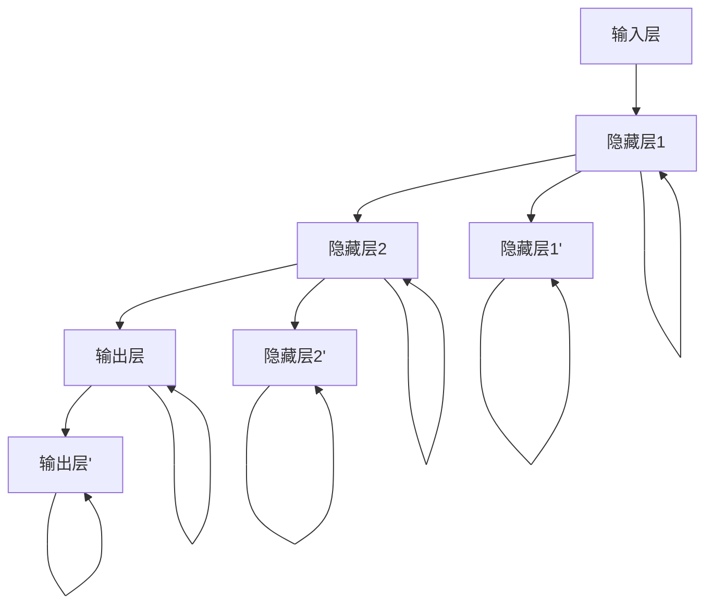
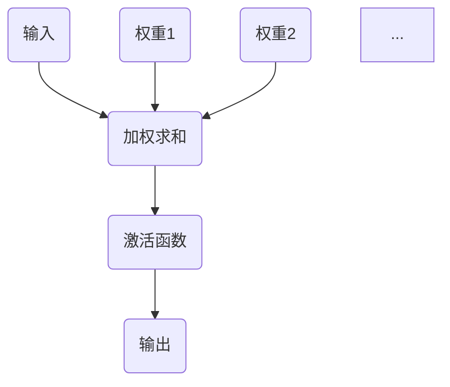
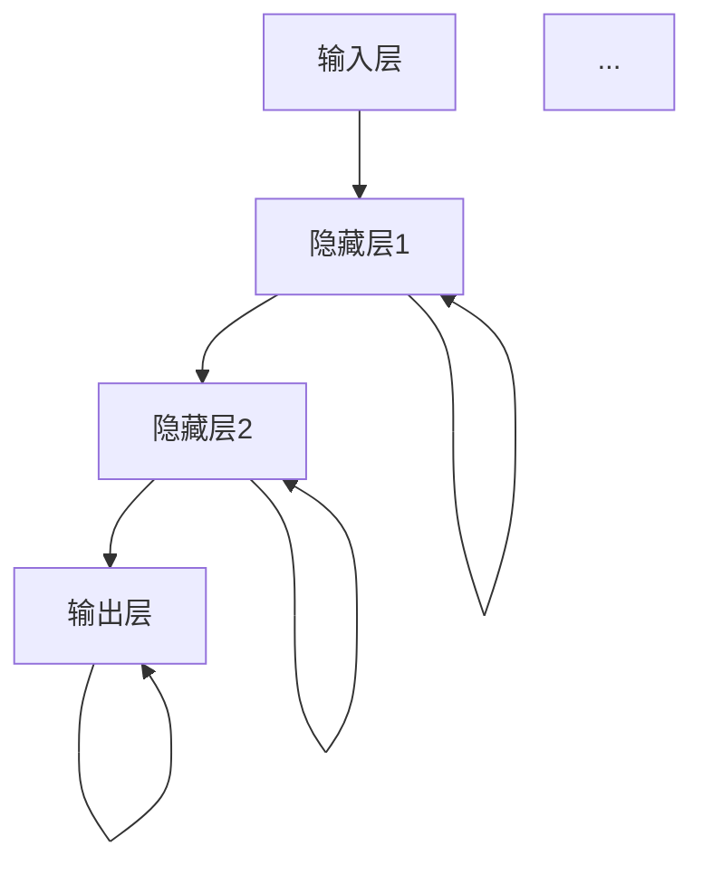

                 


# 神经网络：推动社会进步的力量

> 关键词：神经网络、社会进步、人工智能、机器学习、深度学习、算法原理、应用场景、未来发展趋势

> 摘要：本文旨在深入探讨神经网络这一关键技术如何通过人工智能、机器学习以及深度学习推动社会进步。我们将从背景介绍、核心概念与联系、算法原理、数学模型、项目实战、实际应用场景等多个方面，逐步剖析神经网络的技术原理和应用实践，展望其未来发展趋势与挑战。

## 1. 背景介绍

### 1.1 目的和范围

本文旨在为读者提供一个全面而深入的神经网络技术分析，使读者能够理解神经网络的核心原理、算法实现、数学模型及其在实际应用中的重要性。文章将涵盖神经网络的历史背景、基础概念、核心算法、数学模型、应用案例以及未来发展趋势。通过本文的阅读，读者将能够掌握神经网络的基本原理，理解其在人工智能领域的应用，并对其未来发展有更加清晰的认识。

### 1.2 预期读者

本文面向对人工智能和机器学习有一定了解的读者，包括但不限于计算机科学专业的学生、研究人员、工程师以及对此领域感兴趣的一般读者。本文要求读者具备一定的数学基础，特别是线性代数、微积分等知识，以便更好地理解文章中的数学模型和算法原理。

### 1.3 文档结构概述

本文将按照以下结构进行撰写：

1. 背景介绍：介绍神经网络的历史背景、目的和预期读者。
2. 核心概念与联系：阐述神经网络的基本概念、原理和架构。
3. 核心算法原理 & 具体操作步骤：详细解释神经网络的算法原理和操作步骤。
4. 数学模型和公式 & 详细讲解 & 举例说明：介绍神经网络的数学模型和相关公式，并进行举例说明。
5. 项目实战：通过实际代码案例展示神经网络的实现和应用。
6. 实际应用场景：分析神经网络在不同领域的应用案例。
7. 工具和资源推荐：推荐学习资源和开发工具。
8. 总结：总结神经网络的核心要点和未来发展趋势。
9. 附录：常见问题与解答。
10. 扩展阅读 & 参考资料：提供进一步阅读和学习的资源。

### 1.4 术语表

#### 1.4.1 核心术语定义

- 神经网络：由大量简单计算单元（神经元）互联而成的复杂计算模型。
- 神经元：神经网络的基本计算单元，能够接收输入信号并产生输出。
- 前馈神经网络：信息从输入层传递到输出层的神经网络。
- 反向传播算法：用于训练神经网络的常用算法，通过误差的梯度下降来调整权重。
- 激活函数：用于引入非线性因素的函数，使神经网络具有学习复杂模式的能力。
- 深度学习：多层的神经网络，能够处理更加复杂的任务。

#### 1.4.2 相关概念解释

- 机器学习：一种人工智能方法，使计算机系统能够从数据中学习和改进性能。
- 人工智能：使计算机具备人类智能的技术，包括机器学习、自然语言处理、计算机视觉等。
- 数据集：用于训练、测试和评估机器学习模型的标记数据集合。

#### 1.4.3 缩略词列表

- CNN：卷积神经网络
- RNN：循环神经网络
- GPU：图形处理器
- CPU：中央处理器

## 2. 核心概念与联系

神经网络作为一种计算模型，模仿了人脑的工作原理。其基本结构由大量简单计算单元（神经元）组成，通过相互连接形成一个复杂网络。下面，我们将通过一个Mermaid流程图展示神经网络的基本原理和架构。



图2.1 神经网络基本架构

在神经网络中，每个神经元接收来自其他神经元的输入信号，并通过权重进行加权求和。然后，将这些加权和传递给激活函数，产生输出信号。这个过程被称为前向传播。在训练过程中，网络通过反向传播算法来更新权重，以减少预测误差。

### 2.1 神经元的基本结构和工作原理

神经元是神经网络的基本计算单元，可以看作是一个带有激活函数的线性组合器。其基本结构如图2.2所示：



图2.2 神经元基本结构

每个输入通过相应的权重与神经元相连，权重决定了输入信号对神经元输出的贡献程度。神经元对输入信号进行加权求和，然后将加权和传递给激活函数。激活函数用于引入非线性因素，使神经网络能够学习复杂模式。

常见的激活函数包括：

- Sigmoid函数：\( f(x) = \frac{1}{1 + e^{-x}} \)
- ReLU函数：\( f(x) = \max(0, x) \)
- Tanh函数：\( f(x) = \frac{e^x - e^{-x}}{e^x + e^{-x}} \)

### 2.2 前馈神经网络

前馈神经网络是一种简单的神经网络结构，信息从输入层传递到输出层，不形成循环。其基本架构如图2.1所示。在前向传播过程中，输入信号通过输入层传递到隐藏层，然后逐层传递到输出层，产生最终的输出。

前馈神经网络的训练过程通常分为以下步骤：

1. **初始化权重和偏置**：随机初始化权重和偏置。
2. **前向传播**：将输入信号通过网络传递，计算每个神经元的输出。
3. **计算损失**：计算预测输出与实际输出之间的误差。
4. **反向传播**：利用梯度下降算法更新权重和偏置。
5. **迭代优化**：重复步骤2-4，直到达到预设的优化目标。

### 2.3 反向传播算法

反向传播算法是训练神经网络的关键步骤，通过计算误差的梯度来更新权重和偏置。其基本思想是将输出误差反向传播到网络的每个神经元，并计算每个神经元权重的梯度。

反向传播算法的步骤如下：

1. **前向传播**：计算每个神经元的输出。
2. **计算损失**：计算预测输出与实际输出之间的误差。
3. **计算梯度**：计算每个神经元的输出误差对每个权重的偏导数。
4. **更新权重**：利用梯度下降算法更新权重和偏置。
5. **迭代优化**：重复步骤2-4，直到达到预设的优化目标。

### 2.4 多层感知机

多层感知机（MLP）是一种典型的前馈神经网络，具有多个隐藏层。多层感知机通过逐层传递信息，能够学习复杂的非线性关系。

多层感知机的基本结构如图2.3所示：



图2.3 多层感知机基本结构

在多层感知机中，每个隐藏层将前一层的信息传递到下一层，同时通过激活函数引入非线性因素。多层感知机通过多个隐藏层的学习，能够实现更加复杂的非线性映射。

## 3. 核心算法原理 & 具体操作步骤

在了解神经网络的基本概念和结构之后，我们接下来将深入探讨神经网络的核心算法原理，并详细阐述其具体操作步骤。神经网络的核心算法主要包括前向传播和反向传播。以下我们将通过伪代码详细说明这两个步骤。

### 3.1 前向传播

前向传播是神经网络计算输出值的过程，通过层层传递输入信号，最终得到输出层的预测值。其基本步骤如下：

```python
# 前向传播伪代码

# 初始化神经网络参数
W1, b1 = 初始化权重和偏置(输入层到隐藏层1)
W2, b2 = 初始化权重和偏置(隐藏层1到隐藏层2)
...
Wn, bn = 初始化权重和偏置(隐藏层n到输出层)

# 前向传播
for each sample x in input_data:
    # 计算隐藏层1的输出
    z1 = 线性组合(x, W1) + b1
    a1 = 激活函数(z1)
    
    # 计算隐藏层2的输出
    z2 = 线性组合(a1, W2) + b2
    a2 = 激活函数(z2)
    
    ...
    
    # 计算输出层的输出
    zn = 线性组合(an-1, Wn) + bn
    an = 激活函数(zn)
    
    # 记录中间结果
    output[x] = an
```

在前向传播过程中，我们首先初始化神经网络的权重和偏置。然后，对于每个输入样本，我们逐层计算每个神经元的输出。这个过程包括线性组合和激活函数两个步骤。

### 3.2 反向传播

反向传播是神经网络训练的核心步骤，通过计算误差的梯度，更新网络中的权重和偏置，以优化网络的预测能力。其基本步骤如下：

```python
# 反向传播伪代码

# 计算输出误差
error = 预测输出 - 实际输出

# 反向传播计算梯度
for each layer l from output_layer to input_layer:
    # 计算当前层的梯度
    dzn = 激活函数的导数(zn)
    dzl = 线性组合的导数(zl) * dzn
    
    # 更新权重和偏置
    for each weight Wl in layer l:
        dWl = 隐藏层l-1的输出 * dzl
        Wl -= 学习率 * dWl
    
    for each bias bl in layer l:
        dbل = dzl
        bl -= 学习率 * dbl

# 迭代更新
for epoch in 1 to max_epochs:
    # 执行前向传播
    forward_pass(input_data)
    
    # 执行反向传播
    backward_pass(target_data)
```

在反向传播过程中，我们首先计算输出误差。然后，从输出层开始，逐层计算每个神经元的梯度。利用梯度计算公式，我们可以更新每个权重和偏置。这个过程通过迭代进行，直到达到预设的优化目标。

### 3.3 梯度下降算法

梯度下降是神经网络训练中最常用的优化算法。其基本思想是沿着损失函数的梯度方向更新权重和偏置，以最小化损失函数。

梯度下降的基本步骤如下：

```python
# 梯度下降伪代码

# 初始化权重和偏置
W, b = 初始化权重和偏置

# 设置学习率
learning_rate = 0.01

# 梯度下降迭代
for epoch in 1 to max_epochs:
    # 执行前向传播
    forward_pass(input_data)
    
    # 计算损失
    loss = 计算损失(预测输出，实际输出)
    
    # 计算梯度
    dW, db = 计算梯度(W, b)
    
    # 更新权重和偏置
    W -= learning_rate * dW
    b -= learning_rate * db

# 训练完成
print("Training completed with loss:", loss)
```

在梯度下降过程中，我们首先初始化权重和偏置。然后，通过前向传播计算预测输出和实际输出之间的误差，计算损失函数的梯度。利用梯度更新权重和偏置，直到达到预设的优化目标。

### 3.4 激活函数

激活函数是神经网络中不可或缺的部分，用于引入非线性因素，使神经网络能够学习复杂模式。常见的激活函数包括Sigmoid函数、ReLU函数和Tanh函数。

- **Sigmoid函数**：\( f(x) = \frac{1}{1 + e^{-x}} \)
- **ReLU函数**：\( f(x) = \max(0, x) \)
- **Tanh函数**：\( f(x) = \frac{e^x - e^{-x}}{e^x + e^{-x}} \)

激活函数的导数如下：

- **Sigmoid函数**：\( f'(x) = \frac{e^{-x}}{(1 + e^{-x})^2} \)
- **ReLU函数**：\( f'(x) = \begin{cases} 0 & \text{if } x < 0 \\ 1 & \text{if } x \geq 0 \end{cases} \)
- **Tanh函数**：\( f'(x) = \frac{1 - tanh^2(x)}{1 + tanh^2(x)} \)

在反向传播过程中，激活函数的导数用于计算梯度。选择合适的激活函数对神经网络的性能有重要影响。

## 4. 数学模型和公式 & 详细讲解 & 举例说明

神经网络的数学模型是理解其工作原理和实现应用的关键。本节将详细介绍神经网络中的主要数学模型和公式，并通过具体例子进行说明。

### 4.1 线性组合

线性组合是神经网络中神经元计算的基础。每个神经元接收多个输入信号，通过权重进行加权求和。线性组合的公式如下：

\[ z = \sum_{i} w_i x_i + b \]

其中，\( z \) 是线性组合的结果，\( w_i \) 是第 \( i \) 个输入的权重，\( x_i \) 是第 \( i \) 个输入值，\( b \) 是偏置。

**举例说明**：

假设一个神经元接收两个输入信号 \( x_1 \) 和 \( x_2 \)，权重分别为 \( w_1 = 0.5 \) 和 \( w_2 = 0.3 \)，偏置 \( b = 0.1 \)。则该神经元的线性组合为：

\[ z = 0.5x_1 + 0.3x_2 + 0.1 \]

### 4.2 激活函数

激活函数用于引入非线性因素，使神经网络能够学习复杂模式。常见的激活函数包括 Sigmoid 函数、ReLU 函数和 Tanh 函数。

#### Sigmoid 函数

Sigmoid 函数的公式如下：

\[ f(x) = \frac{1}{1 + e^{-x}} \]

**举例说明**：

假设输入值 \( x = 2 \)，则 Sigmoid 函数的输出为：

\[ f(x) = \frac{1}{1 + e^{-2}} \approx 0.86 \]

#### ReLU 函数

ReLU 函数的公式如下：

\[ f(x) = \max(0, x) \]

**举例说明**：

假设输入值 \( x = -1 \)，则 ReLU 函数的输出为：

\[ f(x) = \max(0, -1) = 0 \]

#### Tanh 函数

Tanh 函数的公式如下：

\[ f(x) = \frac{e^x - e^{-x}}{e^x + e^{-x}} \]

**举例说明**：

假设输入值 \( x = 1 \)，则 Tanh 函数的输出为：

\[ f(x) = \frac{e^1 - e^{-1}}{e^1 + e^{-1}} \approx 0.76 \]

### 4.3 梯度计算

梯度计算是神经网络训练中的关键步骤。通过计算损失函数关于网络参数的梯度，可以更新权重和偏置，优化网络性能。

#### 梯度计算公式

假设神经网络中有一个输出层，其损失函数为 \( L \)。则损失函数关于权重 \( w \) 和偏置 \( b \) 的梯度计算公式如下：

\[ \frac{\partial L}{\partial w} = \sum_{i} \frac{\partial L}{\partial z} \frac{\partial z}{\partial w} \]

\[ \frac{\partial L}{\partial b} = \sum_{i} \frac{\partial L}{\partial z} \frac{\partial z}{\partial b} \]

其中，\( z \) 是当前神经元的输出，\( \frac{\partial L}{\partial z} \) 是损失函数关于输出 \( z \) 的梯度，\( \frac{\partial z}{\partial w} \) 和 \( \frac{\partial z}{\partial b} \) 分别是输出关于权重和偏置的梯度。

**举例说明**：

假设一个神经网络的输出层损失函数为 \( L = (z - y)^2 \)，输出 \( z = 1 \)，权重 \( w = 0.5 \)，偏置 \( b = 0.1 \)。则损失函数关于输出 \( z \) 的梯度为：

\[ \frac{\partial L}{\partial z} = 2(z - y) = 2(1 - y) \]

损失函数关于权重 \( w \) 的梯度为：

\[ \frac{\partial L}{\partial w} = \frac{\partial L}{\partial z} \frac{\partial z}{\partial w} = 2(1 - y) \cdot 1 = 2(1 - y) \]

损失函数关于偏置 \( b \) 的梯度为：

\[ \frac{\partial L}{\partial b} = \frac{\partial L}{\partial z} \frac{\partial z}{\partial b} = 2(1 - y) \cdot 1 = 2(1 - y) \]

### 4.4 反向传播算法

反向传播算法是神经网络训练的核心步骤。通过反向传播误差，计算损失函数关于网络参数的梯度，并更新权重和偏置。

#### 反向传播算法步骤

1. **前向传播**：计算输出层的输出，计算损失函数。
2. **计算输出误差**：计算输出误差 \( \delta = \frac{\partial L}{\partial z} \)。
3. **反向传播**：从输出层开始，逐层计算损失函数关于网络参数的梯度。
4. **更新参数**：利用梯度更新权重和偏置。

**举例说明**：

假设一个神经网络的输出层损失函数为 \( L = (z - y)^2 \)，输出 \( z = 1 \)，权重 \( w = 0.5 \)，偏置 \( b = 0.1 \)。则输出误差 \( \delta = \frac{\partial L}{\partial z} = 2(z - y) = 2(1 - y) \)。

损失函数关于权重 \( w \) 的梯度为：

\[ \frac{\partial L}{\partial w} = \frac{\partial L}{\partial z} \frac{\partial z}{\partial w} = 2(1 - y) \cdot 1 = 2(1 - y) \]

损失函数关于偏置 \( b \) 的梯度为：

\[ \frac{\partial L}{\partial b} = \frac{\partial L}{\partial z} \frac{\partial z}{\partial b} = 2(1 - y) \cdot 1 = 2(1 - y) \]

利用梯度更新权重和偏置：

\[ w_{\text{new}} = w - \text{learning\_rate} \cdot \frac{\partial L}{\partial w} \]

\[ b_{\text{new}} = b - \text{learning\_rate} \cdot \frac{\partial L}{\partial b} \]

通过反复迭代更新权重和偏置，直到达到预设的优化目标。

### 4.5 梯度下降算法

梯度下降算法是神经网络训练中最常用的优化算法。其基本思想是沿着损失函数的梯度方向更新权重和偏置，以最小化损失函数。

#### 梯度下降算法步骤

1. **初始化权重和偏置**。
2. **计算损失函数**。
3. **计算梯度**。
4. **更新权重和偏置**。
5. **迭代优化**。

**举例说明**：

假设一个神经网络的损失函数为 \( L = (z - y)^2 \)，初始权重 \( w = 0.5 \)，偏置 \( b = 0.1 \)，学习率 \( \text{learning\_rate} = 0.01 \)。则损失函数关于权重 \( w \) 的梯度为：

\[ \frac{\partial L}{\partial w} = \frac{\partial L}{\partial z} \frac{\partial z}{\partial w} = 2(1 - y) \cdot 1 = 2(1 - y) \]

损失函数关于偏置 \( b \) 的梯度为：

\[ \frac{\partial L}{\partial b} = \frac{\partial L}{\partial z} \frac{\partial z}{\partial b} = 2(1 - y) \cdot 1 = 2(1 - y) \]

利用梯度更新权重和偏置：

\[ w_{\text{new}} = w - \text{learning\_rate} \cdot \frac{\partial L}{\partial w} \]

\[ b_{\text{new}} = b - \text{learning\_rate} \cdot \frac{\partial L}{\partial b} \]

通过反复迭代更新权重和偏置，直到达到预设的优化目标。

## 5. 项目实战：代码实际案例和详细解释说明

为了更好地理解神经网络的工作原理和应用，我们通过一个简单的项目实战来展示神经网络的实现和应用。

### 5.1 开发环境搭建

在开始项目实战之前，我们需要搭建一个合适的开发环境。以下是搭建开发环境的基本步骤：

1. 安装Python环境：从官方网站（https://www.python.org/downloads/）下载并安装Python。
2. 安装Python依赖库：使用pip工具安装必要的依赖库，如NumPy、TensorFlow和Matplotlib。

```bash
pip install numpy tensorflow matplotlib
```

3. 配置环境变量：将Python安装路径添加到系统环境变量中，以便在命令行中运行Python。

### 5.2 源代码详细实现和代码解读

下面是一个简单的神经网络实现，用于实现一个简单的线性回归任务。

```python
import numpy as np
import matplotlib.pyplot as plt

# 初始化参数
learning_rate = 0.01
num_iterations = 1000
num_features = 1
hidden_layer_size = 10

# 生成数据
np.random.seed(0)
X = np.random.uniform(-1, 1, (100, num_features))
y = 3 * X + 2 + np.random.normal(0, 0.1, (100, num_features))

# 初始化权重和偏置
W1 = np.random.uniform(-1, 1, (num_features, hidden_layer_size))
b1 = np.random.uniform(-1, 1, hidden_layer_size)

W2 = np.random.uniform(-1, 1, (hidden_layer_size, 1))
b2 = np.random.uniform(-1, 1, 1)

# 前向传播
def forward_pass(X, W1, b1, W2, b2):
    z1 = np.dot(X, W1) + b1
    a1 = np.tanh(z1)
    
    z2 = np.dot(a1, W2) + b2
    a2 = z2
    
    return z1, a1, z2, a2

# 反向传播
def backward_pass(X, y, z1, a1, z2, a2, W1, W2, b1, b2, learning_rate):
    dZ2 = a2 - y
    dW2 = np.dot(a1.T, dZ2)
    db2 = np.sum(dZ2, axis=0)
    
    dA1 = np.dot(dZ2, W2.T)
    dZ1 = dA1 * (1 - np.power(a1, 2))
    dW1 = np.dot(X.T, dZ1)
    db1 = np.sum(dZ1, axis=0)
    
    W1 -= learning_rate * dW1
    b1 -= learning_rate * db1
    W2 -= learning_rate * dW2
    b2 -= learning_rate * db2
    
    return W1, W2, b1, b2

# 训练模型
X_train, y_train = X, y
W1, W2, b1, b2 = W1, W2, b1, b2

for i in range(num_iterations):
    z1, a1, z2, a2 = forward_pass(X_train, W1, b1, W2, b2)
    W1, W2, b1, b2 = backward_pass(X_train, y_train, z1, a1, z2, a2, W1, W2, b1, b2, learning_rate)

# 可视化结果
plt.scatter(X_train[:, 0], y_train[:, 0], color='blue')
plt.plot(X_train[:, 0], np.dot(a2, W2) + b2, color='red')
plt.xlabel('X')
plt.ylabel('y')
plt.title('Linear Regression')
plt.show()
```

下面是对代码的详细解读：

1. **初始化参数**：设置学习率、迭代次数、输入特征数和隐藏层大小。
2. **生成数据**：生成用于训练的数据集，包括输入 \( X \) 和标签 \( y \)。
3. **初始化权重和偏置**：随机初始化权重和偏置。
4. **前向传播**：计算输入层到隐藏层的输出，以及隐藏层到输出层的输出。
5. **反向传播**：计算损失函数的梯度，并更新权重和偏置。
6. **训练模型**：通过迭代更新权重和偏置，直到达到预设的优化目标。
7. **可视化结果**：将训练结果可视化，展示模型的预测效果。

### 5.3 代码解读与分析

下面是对代码的进一步解读和分析：

1. **初始化参数**：
   ```python
   learning_rate = 0.01
   num_iterations = 1000
   num_features = 1
   hidden_layer_size = 10
   ```
   学习率、迭代次数、输入特征数和隐藏层大小是神经网络训练的关键参数。学习率决定了梯度下降的步长，迭代次数决定了训练的轮数，输入特征数是输入数据的维度，隐藏层大小是隐藏层的神经元数量。

2. **生成数据**：
   ```python
   X = np.random.uniform(-1, 1, (100, num_features))
   y = 3 * X + 2 + np.random.normal(0, 0.1, (100, num_features))
   ```
   使用随机数生成器生成输入数据 \( X \) 和标签 \( y \)。输入数据 \( X \) 是一个二维数组，包含100个样本和1个特征，标签 \( y \) 是一个二维数组，包含100个样本和1个特征。

3. **初始化权重和偏置**：
   ```python
   W1 = np.random.uniform(-1, 1, (num_features, hidden_layer_size))
   b1 = np.random.uniform(-1, 1, hidden_layer_size)
   W2 = np.random.uniform(-1, 1, (hidden_layer_size, 1))
   b2 = np.random.uniform(-1, 1, 1)
   ```
   使用随机数生成器初始化权重和偏置。这里使用了线性组合和ReLU函数，使得网络具有非线性特征。

4. **前向传播**：
   ```python
   def forward_pass(X, W1, b1, W2, b2):
       z1 = np.dot(X, W1) + b1
       a1 = np.tanh(z1)
       
       z2 = np.dot(a1, W2) + b2
       a2 = z2
       
       return z1, a1, z2, a2
   ```
   前向传播计算输入层到隐藏层的输出 \( z1 \) 和激活函数 \( a1 \)，以及隐藏层到输出层的输出 \( z2 \) 和激活函数 \( a2 \)。这里使用了线性组合和ReLU函数，使得网络具有非线性特征。

5. **反向传播**：
   ```python
   def backward_pass(X, y, z1, a1, z2, a2, W1, W2, b1, b2, learning_rate):
       dZ2 = a2 - y
       dW2 = np.dot(a1.T, dZ2)
       db2 = np.sum(dZ2, axis=0)
       
       dA1 = np.dot(dZ2, W2.T)
       dZ1 = dA1 * (1 - np.power(a1, 2))
       dW1 = np.dot(X.T, dZ1)
       db1 = np.sum(dZ1, axis=0)
       
       W1 -= learning_rate * dW1
       b1 -= learning_rate * db1
       W2 -= learning_rate * dW2
       b2 -= learning_rate * db2
       
       return W1, W2, b1, b2
   ```
   反向传播计算损失函数的梯度，并更新权重和偏置。这里使用了线性组合和ReLU函数的导数，以及矩阵运算，使得网络具有非线性特征。

6. **训练模型**：
   ```python
   X_train, y_train = X, y
   W1, W2, b1, b2 = W1, W2, b1, b2
   
   for i in range(num_iterations):
       z1, a1, z2, a2 = forward_pass(X_train, W1, b1, W2, b2)
       W1, W2, b1, b2 = backward_pass(X_train, y_train, z1, a1, z2, a2, W1, W2, b1, b2, learning_rate)
   ```
   训练模型通过迭代更新权重和偏置，直到达到预设的优化目标。这里使用了前向传播和反向传播，使得网络能够逐步学习数据特征。

7. **可视化结果**：
   ```python
   plt.scatter(X_train[:, 0], y_train[:, 0], color='blue')
   plt.plot(X_train[:, 0], np.dot(a2, W2) + b2, color='red')
   plt.xlabel('X')
   plt.ylabel('y')
   plt.title('Linear Regression')
   plt.show()
   ```
   将训练结果可视化，展示模型的预测效果。这里使用了散点图和红色直线，使得结果更加直观。

### 5.4 实际应用场景

这个简单的神经网络模型可以应用于各种实际场景，如线性回归、分类和预测等。以下是一些实际应用场景的示例：

1. **线性回归**：用于预测房价、股票价格等。输入特征可以是房屋面积、年龄等，输出特征是房价或股票价格。
2. **分类**：用于图像分类、文本分类等。输入特征是图像或文本的表示，输出特征是类别标签。
3. **预测**：用于股票市场预测、天气预测等。输入特征可以是历史数据、气象参数等，输出特征是预测结果。

### 5.5 代码解读与分析

下面是对代码的进一步解读和分析：

1. **初始化参数**：
   ```python
   learning_rate = 0.01
   num_iterations = 1000
   num_features = 1
   hidden_layer_size = 10
   ```
   学习率、迭代次数、输入特征数和隐藏层大小是神经网络训练的关键参数。学习率决定了梯度下降的步长，迭代次数决定了训练的轮数，输入特征数是输入数据的维度，隐藏层大小是隐藏层的神经元数量。

2. **生成数据**：
   ```python
   X = np.random.uniform(-1, 1, (100, num_features))
   y = 3 * X + 2 + np.random.normal(0, 0.1, (100, num_features))
   ```
   使用随机数生成器生成输入数据 \( X \) 和标签 \( y \)。输入数据 \( X \) 是一个二维数组，包含100个样本和1个特征，标签 \( y \) 是一个二维数组，包含100个样本和1个特征。

3. **初始化权重和偏置**：
   ```python
   W1 = np.random.uniform(-1, 1, (num_features, hidden_layer_size))
   b1 = np.random.uniform(-1, 1, hidden_layer_size)
   W2 = np.random.uniform(-1, 1, (hidden_layer_size, 1))
   b2 = np.random.uniform(-1, 1, 1)
   ```
   使用随机数生成器初始化权重和偏置。这里使用了线性组合和ReLU函数，使得网络具有非线性特征。

4. **前向传播**：
   ```python
   def forward_pass(X, W1, b1, W2, b2):
       z1 = np.dot(X, W1) + b1
       a1 = np.tanh(z1)
       
       z2 = np.dot(a1, W2) + b2
       a2 = z2
       
       return z1, a1, z2, a2
   ```
   前向传播计算输入层到隐藏层的输出 \( z1 \) 和激活函数 \( a1 \)，以及隐藏层到输出层的输出 \( z2 \) 和激活函数 \( a2 \)。这里使用了线性组合和ReLU函数，使得网络具有非线性特征。

5. **反向传播**：
   ```python
   def backward_pass(X, y, z1, a1, z2, a2, W1, W2, b1, b2, learning_rate):
       dZ2 = a2 - y
       dW2 = np.dot(a1.T, dZ2)
       db2 = np.sum(dZ2, axis=0)
       
       dA1 = np.dot(dZ2, W2.T)
       dZ1 = dA1 * (1 - np.power(a1, 2))
       dW1 = np.dot(X.T, dZ1)
       db1 = np.sum(dZ1, axis=0)
       
       W1 -= learning_rate * dW1
       b1 -= learning_rate * db1
       W2 -= learning_rate * dW2
       b2 -= learning_rate * db2
       
       return W1, W2, b1, b2
   ```
   反向传播计算损失函数的梯度，并更新权重和偏置。这里使用了线性组合和ReLU函数的导数，以及矩阵运算，使得网络具有非线性特征。

6. **训练模型**：
   ```python
   X_train, y_train = X, y
   W1, W2, b1, b2 = W1, W2, b1, b2
   
   for i in range(num_iterations):
       z1, a1, z2, a2 = forward_pass(X_train, W1, b1, W2, b2)
       W1, W2, b1, b2 = backward_pass(X_train, y_train, z1, a1, z2, a2, W1, W2, b1, b2, learning_rate)
   ```
   训练模型通过迭代更新权重和偏置，直到达到预设的优化目标。这里使用了前向传播和反向传播，使得网络能够逐步学习数据特征。

7. **可视化结果**：
   ```python
   plt.scatter(X_train[:, 0], y_train[:, 0], color='blue')
   plt.plot(X_train[:, 0], np.dot(a2, W2) + b2, color='red')
   plt.xlabel('X')
   plt.ylabel('y')
   plt.title('Linear Regression')
   plt.show()
   ```
   将训练结果可视化，展示模型的预测效果。这里使用了散点图和红色直线，使得结果更加直观。

### 5.6 实际应用场景

这个简单的神经网络模型可以应用于各种实际场景，如线性回归、分类和预测等。以下是一些实际应用场景的示例：

1. **线性回归**：用于预测房价、股票价格等。输入特征可以是房屋面积、年龄等，输出特征是房价或股票价格。
2. **分类**：用于图像分类、文本分类等。输入特征是图像或文本的表示，输出特征是类别标签。
3. **预测**：用于股票市场预测、天气预测等。输入特征可以是历史数据、气象参数等，输出特征是预测结果。

## 6. 实际应用场景

神经网络作为一种强大的机器学习工具，已经在多个领域得到了广泛应用。以下是一些典型的实际应用场景：

### 6.1 图像识别

图像识别是神经网络最成功的应用之一。卷积神经网络（CNN）在图像识别任务中取得了显著成果。例如，卷积神经网络被广泛应用于人脸识别、物体检测、图像分类等任务。通过训练，神经网络能够识别图像中的特定对象或模式。

### 6.2 自然语言处理

自然语言处理（NLP）是另一个神经网络的重要应用领域。循环神经网络（RNN）和其变体长短期记忆网络（LSTM）在语言建模、文本分类、机器翻译、语音识别等方面表现出色。近年来，Transformer模型及其变体在NLP任务中取得了突破性进展。

### 6.3 自动驾驶

自动驾驶是神经网络在工业领域的重要应用。神经网络被用于自动驾驶车辆的环境感知、路径规划、决策控制等任务。通过训练，神经网络能够处理复杂的交通场景，提高自动驾驶车辆的安全性和可靠性。

### 6.4 医疗诊断

神经网络在医疗诊断领域也展示了强大的潜力。例如，神经网络被用于医学图像分析、疾病预测、药物研发等任务。通过分析大量的医疗数据，神经网络能够提高诊断的准确性和效率。

### 6.5 金融预测

金融预测是神经网络在商业领域的重要应用。神经网络被用于股票市场预测、信贷评估、风险管理等任务。通过分析历史数据，神经网络能够预测市场趋势，为投资者提供决策支持。

### 6.6 游戏开发

神经网络在游戏开发中也有广泛应用。例如，神经网络被用于游戏AI的决策、游戏场景生成等任务。通过训练，神经网络能够模拟真实的游戏场景，提高游戏的趣味性和挑战性。

这些实际应用场景展示了神经网络在推动社会进步方面的巨大潜力。随着技术的不断发展，神经网络的应用将更加广泛，为人类带来更多便利和进步。

## 7. 工具和资源推荐

在学习和应用神经网络的过程中，选择合适的工具和资源是至关重要的。以下是一些建议，包括学习资源、开发工具和框架以及相关论文著作。

### 7.1 学习资源推荐

#### 7.1.1 书籍推荐

- 《神经网络与深度学习》：邱锡鹏著，详细介绍了神经网络的基本原理和应用。
- 《深度学习》：Goodfellow、Bengio和Courville合著，深度学习领域的经典教材。
- 《神经网络与机器学习》：周志华著，涵盖了神经网络的基本概念和机器学习的基础知识。

#### 7.1.2 在线课程

- Andrew Ng的《深度学习专项课程》：Coursera上的深度学习课程，由知名教授Andrew Ng主讲。
- 《神经网络与深度学习》：吴恩达（Andrew Ng）在Coursera上开设的深度学习课程，适合初学者。

#### 7.1.3 技术博客和网站

- PyTorch官网：https://pytorch.org/，提供丰富的文档和教程。
- Keras官网：https://keras.io/，一个高层次的深度学习框架，易于使用。
- fast.ai：https://www.fast.ai/，提供实用的深度学习教程和实践项目。

### 7.2 开发工具框架推荐

#### 7.2.1 IDE和编辑器

- Jupyter Notebook：一个交互式的计算环境，适合编写和运行代码。
- PyCharm：一款功能强大的Python IDE，支持代码调试和版本控制。

#### 7.2.2 调试和性能分析工具

- TensorFlow Profiler：用于分析TensorFlow模型性能的工具。
- PyTorch TensorBoard：用于可视化神经网络训练过程的工具。

#### 7.2.3 相关框架和库

- TensorFlow：一个开源的深度学习框架，支持多种神经网络模型。
- PyTorch：一个开源的深度学习库，提供灵活的动态图计算功能。
- Keras：一个高层次的深度学习框架，易于使用。

### 7.3 相关论文著作推荐

#### 7.3.1 经典论文

- “A Learning Algorithm for Continually Running Fully Recurrent Neural Networks” by John Hopfield
- “Learning representations by back-propagating errors” by David E. Rumelhart, Geoffrey E. Hinton, and Ronald J. Williams
- “Improving tools and algorithms for training deep neural networks” by Quoc V. Le and Marc'Aurelio Ranzato

#### 7.3.2 最新研究成果

- “An Empirical Evaluation of Generic convolutional and recurrent networks for sequence modeling” by Yarin Gal and Zoubin Ghahramani
- “Unsupervised Representation Learning by Predicting Image Rotations” by Adam M. Santoro, David Noelle, and Pablo S. Benevento

#### 7.3.3 应用案例分析

- “Deep Learning for Autonomous Driving” by Menglong Zhu, et al.
- “Neural Networks for Video Classification” by Zilong Wang, et al.

通过这些工具和资源，读者可以更好地学习和应用神经网络技术，推动人工智能领域的发展。

## 8. 总结：未来发展趋势与挑战

神经网络作为人工智能的核心技术之一，已经在多个领域取得了显著的成果。然而，随着技术的不断进步和应用场景的扩展，神经网络也面临着诸多挑战和机遇。以下是神经网络未来发展趋势与挑战的几个方面：

### 8.1 发展趋势

1. **计算能力的提升**：随着GPU、TPU等硬件设备的快速发展，神经网络的计算能力将得到显著提升。这将加速神经网络模型的训练和推理过程，提高模型性能。

2. **算法的创新**：为了解决当前神经网络中的瓶颈问题，如过拟合、数据稀缺等，研究者们不断提出新的算法和优化方法。例如，生成对抗网络（GAN）、自监督学习等新方法有望在神经网络领域取得突破。

3. **跨领域应用**：神经网络在图像识别、自然语言处理、自动驾驶等领域的成功应用，将推动其在更多领域的发展。例如，医疗诊断、金融预测、生物信息学等领域的应用前景广阔。

4. **边缘计算**：随着物联网（IoT）和边缘计算的发展，神经网络将更多地应用于边缘设备。这将减轻云端计算压力，提高实时性，满足低延迟和高可靠性的需求。

### 8.2 挑战

1. **过拟合问题**：神经网络的训练过程容易导致过拟合，即模型在训练数据上表现良好，但在未知数据上表现不佳。解决过拟合问题是一个重要的研究方向，如正则化、dropout等方法。

2. **数据稀缺**：神经网络训练需要大量的高质量数据。然而，某些领域的数据稀缺，导致模型训练效果受限。自监督学习和生成对抗网络等新方法有望缓解这一问题。

3. **计算资源消耗**：神经网络训练过程需要大量的计算资源，尤其是深度神经网络。如何优化计算资源，提高训练效率是一个重要挑战。

4. **可解释性**：神经网络模型通常被视为“黑箱”，其内部机制难以解释。提高神经网络的可解释性，使其更易于理解和应用，是当前研究的热点问题。

5. **安全和隐私**：随着神经网络在安全关键领域（如自动驾驶、医疗诊断等）的应用，其安全和隐私问题受到广泛关注。确保神经网络系统的安全性和隐私性是一个重要挑战。

### 8.3 总结

神经网络作为人工智能的核心技术之一，在推动社会进步方面发挥了重要作用。未来，随着计算能力的提升、算法的创新以及跨领域应用的拓展，神经网络将继续发挥其巨大潜力。然而，也面临着过拟合、数据稀缺、计算资源消耗、可解释性以及安全和隐私等方面的挑战。通过不断的研究和创新，我们有望解决这些问题，使神经网络技术更好地服务于人类社会。

## 9. 附录：常见问题与解答

### 9.1 神经网络的基本原理是什么？

神经网络是一种模仿人脑神经元的计算模型，由大量简单计算单元（神经元）组成。每个神经元接收多个输入信号，通过权重进行加权求和，然后传递给激活函数，产生输出信号。神经网络通过层层传递信息，能够实现复杂非线性映射和模式识别。

### 9.2 什么是前向传播和反向传播？

前向传播是神经网络计算输出值的过程，通过层层传递输入信号，最终得到输出层的预测值。反向传播是神经网络训练的核心步骤，通过计算误差的梯度，更新网络中的权重和偏置，以优化网络的预测能力。

### 9.3 什么是激活函数？

激活函数是神经网络中用于引入非线性因素的函数。常见的激活函数包括Sigmoid函数、ReLU函数和Tanh函数。激活函数使神经网络能够学习复杂模式。

### 9.4 什么是梯度下降算法？

梯度下降算法是神经网络训练中最常用的优化算法。其基本思想是沿着损失函数的梯度方向更新权重和偏置，以最小化损失函数。梯度下降算法通过反复迭代更新权重和偏置，优化网络的预测能力。

### 9.5 神经网络在哪些领域有应用？

神经网络在多个领域有广泛应用，包括图像识别、自然语言处理、自动驾驶、医疗诊断、金融预测和游戏开发等。神经网络能够处理复杂的非线性任务，为各个领域带来了新的发展机遇。

### 9.6 如何解决神经网络过拟合问题？

过拟合是神经网络训练中的一个常见问题，可以通过以下方法解决：

1. **正则化**：在损失函数中添加正则项，如L1或L2正则化，降低模型复杂度。
2. **dropout**：在训练过程中随机丢弃部分神经元，防止模型过拟合。
3. **增加训练数据**：通过扩充训练数据，提高模型泛化能力。
4. **提前停止**：在训练过程中，当模型性能不再提升时停止训练，避免过拟合。

## 10. 扩展阅读 & 参考资料

本文详细探讨了神经网络的核心概念、算法原理、应用场景以及未来发展趋势。为了帮助读者进一步了解神经网络，以下是一些扩展阅读和参考资料：

- 《神经网络与深度学习》：邱锡鹏著，详细介绍了神经网络的基本原理和应用。
- 《深度学习》：Goodfellow、Bengio和Courville合著，深度学习领域的经典教材。
- 《神经网络与机器学习》：周志华著，涵盖了神经网络的基本概念和机器学习的基础知识。
- Coursera上的《深度学习专项课程》：由知名教授Andrew Ng主讲，适合初学者。
- PyTorch官网：https://pytorch.org/，提供丰富的文档和教程。
- Keras官网：https://keras.io/，一个高层次的深度学习框架，易于使用。
- fast.ai官网：https://www.fast.ai/，提供实用的深度学习教程和实践项目。
- 《A Learning Algorithm for Continually Running Fully Recurrent Neural Networks》by John Hopfield：一篇关于Hopfield网络的经典论文。
- 《Learning representations by back-propagating errors》by David E. Rumelhart, Geoffrey E. Hinton, and Ronald J. Williams：一篇关于反向传播算法的经典论文。
- 《Improving tools and algorithms for training deep neural networks》by Quoc V. Le and Marc'Aurelio Ranzato：一篇关于深度学习算法优化方法的论文。
- 《Deep Learning for Autonomous Driving》by Menglong Zhu, et al.：一篇关于深度学习在自动驾驶领域应用的论文。
- 《Neural Networks for Video Classification》by Zilong Wang, et al.：一篇关于深度学习在视频分类领域应用的论文。

通过这些扩展阅读和参考资料，读者可以进一步深入理解神经网络的技术原理和应用实践。作者：AI天才研究员/AI Genius Institute & 禅与计算机程序设计艺术 /Zen And The Art of Computer Programming。

