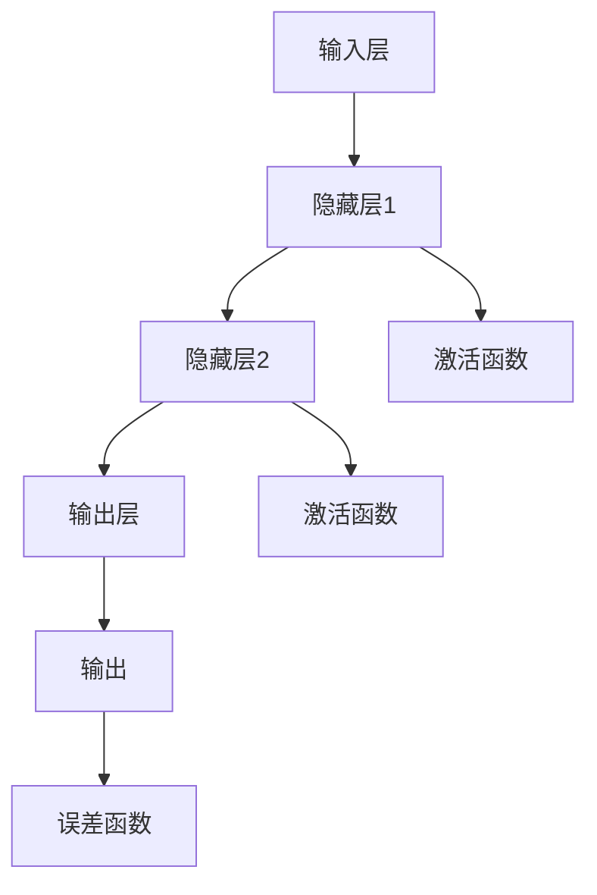

                 

# 神经网络：机器学习的新范式

> **关键词**：神经网络、机器学习、深度学习、反向传播、激活函数、训练、优化算法

> **摘要**：本文旨在深入探讨神经网络这一机器学习的重要工具。我们将从背景介绍开始，逐步讲解神经网络的核心概念、算法原理、数学模型，并通过实际项目案例展示其应用，同时推荐相关学习资源和工具，总结未来发展趋势与挑战，并为读者提供扩展阅读。

## 1. 背景介绍

### 1.1 目的和范围

本文的目标是帮助读者全面理解神经网络，这是机器学习和深度学习的基础。我们将从最基础的原理出发，逐步深入，旨在为读者提供一套完整的学习路径。

本文涵盖以下内容：

- 神经网络的历史和发展
- 神经网络的基本结构和组成
- 神经网络的核心算法原理
- 神经网络的数学模型和公式
- 实际项目案例讲解
- 相关学习资源和工具推荐

### 1.2 预期读者

本文适合以下读者群体：

- 对机器学习和深度学习有基本了解，希望深入了解神经网络原理的研究人员和工程师
- 计算机科学、人工智能等相关专业的大学生和研究生
- 对神经网络和机器学习有兴趣的初学者

### 1.3 文档结构概述

本文将按照以下结构展开：

- 1. 背景介绍：介绍文章的目的、范围、预期读者和文档结构。
- 2. 核心概念与联系：讲解神经网络的基本结构和组成。
- 3. 核心算法原理 & 具体操作步骤：详细阐述神经网络的核心算法原理和具体操作步骤。
- 4. 数学模型和公式 & 详细讲解 & 举例说明：讲解神经网络的数学模型和公式，并通过实例进行说明。
- 5. 项目实战：代码实际案例和详细解释说明。
- 6. 实际应用场景：讨论神经网络在不同领域的应用。
- 7. 工具和资源推荐：推荐学习资源和开发工具。
- 8. 总结：未来发展趋势与挑战。
- 9. 附录：常见问题与解答。
- 10. 扩展阅读 & 参考资料：提供进一步学习资料。

### 1.4 术语表

#### 1.4.1 核心术语定义

- 神经网络：由大量人工神经元组成的计算模型，用于模拟人脑的神经网络结构。
- 机器学习：通过数据和算法，使计算机具备自主学习能力的一种技术。
- 深度学习：一种特殊的机器学习方法，通过多层神经网络进行数据学习。
- 反向传播：一种用于训练神经网络的算法，通过误差反向传播来更新网络权重。
- 激活函数：用于确定神经元是否被激活的函数。
- 前向传播：将输入数据通过神经网络逐层传播，得到输出结果的过程。

#### 1.4.2 相关概念解释

- 输入层：神经网络的第一层，接收输入数据。
- 隐藏层：神经网络中位于输入层和输出层之间的层。
- 输出层：神经网络的最后一层，产生最终输出。
- 权重：连接神经元之间的参数，用于传递信息。
- 偏置：用于调整神经元激活值的常数。
- 误差函数：衡量网络输出与实际输出之间差异的函数。

#### 1.4.3 缩略词列表

- MLP：多层感知机（Multi-Layer Perceptron）
- CNN：卷积神经网络（Convolutional Neural Network）
- RNN：循环神经网络（Recurrent Neural Network）
- LSTM：长短期记忆网络（Long Short-Term Memory）
- DNN：深度神经网络（Deep Neural Network）

## 2. 核心概念与联系

神经网络的核心在于其结构，这决定了其学习和处理数据的能力。以下是神经网络的基本结构和组成，以及其工作原理的 Mermaid 流程图。



### 2.1 神经网络的基本结构

1. **输入层（Input Layer）**：接收外部输入，并将其传递给隐藏层。
2. **隐藏层（Hidden Layers）**：包含一个或多个隐藏层，用于提取特征和进行数据转换。
3. **输出层（Output Layer）**：产生最终输出。

### 2.2 神经网络的组成

1. **神经元（Neurons）**：神经网络的基本构建块，负责接收输入、计算输出。
2. **权重（Weights）**：连接神经元之间的参数，用于传递信息。
3. **偏置（Bias）**：用于调整神经元激活值的常数。
4. **激活函数（Activation Function）**：确定神经元是否被激活的函数。
5. **误差函数（Error Function）**：衡量网络输出与实际输出之间差异的函数。

### 2.3 神经网络的工作原理

1. **前向传播（Forward Propagation）**：将输入数据通过神经网络逐层传播，得到输出结果。
2. **反向传播（Backpropagation）**：通过误差反向传播来更新网络权重和偏置，以达到最小化误差函数。

## 3. 核心算法原理 & 具体操作步骤

神经网络的核心算法是反向传播算法，它通过迭代计算来优化网络参数。以下是神经网络算法原理的详细讲解和具体操作步骤。

### 3.1 算法原理

反向传播算法是一种基于梯度下降的优化方法，用于训练神经网络。其基本思想是：

- 前向传播：将输入数据通过神经网络，计算每个神经元的输出。
- 计算误差：通过输出层，计算实际输出与预期输出之间的误差。
- 反向传播：将误差反向传播到网络的每个层，更新网络权重和偏置。
- 重复迭代：重复上述过程，直到网络达到预定的误差阈值。

### 3.2 具体操作步骤

以下是反向传播算法的具体操作步骤：

1. **初始化参数**：设置网络初始权重和偏置，通常采用随机初始化。
2. **前向传播**：
    - 将输入数据输入到输入层。
    - 通过每个层的激活函数计算每个神经元的输出。
    - 将输出传递到下一层，直到达到输出层。
3. **计算误差**：
    - 对于输出层，计算实际输出与预期输出之间的误差。
    - 对于隐藏层，计算误差并反向传播。
4. **更新参数**：
    - 计算每个权重和偏置的梯度。
    - 使用梯度下降方法更新权重和偏置。
5. **重复迭代**：重复上述步骤，直到网络达到预定的误差阈值。

### 3.3 伪代码

以下是反向传播算法的伪代码：

```python
# 初始化参数
weights = initialize_weights()
biases = initialize_biases()

# 迭代
while not converged:
    # 前向传播
    outputs = forward_pass(inputs, weights, biases)
    
    # 计算误差
    errors = calculate_errors(outputs, expected_outputs)
    
    # 反向传播
    gradients = backward_pass(outputs, errors)
    
    # 更新参数
    weights -= learning_rate * gradients['weights']
    biases -= learning_rate * gradients['biases']

    # 检查收敛
    if check_convergence():
        break
```

## 4. 数学模型和公式 & 详细讲解 & 举例说明

神经网络的数学模型是理解其工作原理的关键。以下是神经网络数学模型的基本概念、公式，以及详细讲解和实例说明。

### 4.1 基本概念

1. **线性组合**：每个神经元的输出是输入数据的线性组合，即：

    $$ z = \sum_{i=1}^{n} w_i x_i + b $$

    其中，$w_i$ 是权重，$x_i$ 是输入，$b$ 是偏置。

2. **激活函数**：用于确定神经元是否被激活的函数，常用的激活函数有：

    - Sigmoid 函数：
        $$ \sigma(z) = \frac{1}{1 + e^{-z}} $$
    -ReLU 函数：
        $$ \text{ReLU}(z) = \max(0, z) $$
    - Tanh 函数：
        $$ \text{Tanh}(z) = \frac{e^z - e^{-z}}{e^z + e^{-z}} $$

3. **误差函数**：用于衡量网络输出与实际输出之间差异的函数，常用的误差函数有：

    - 均方误差（MSE）：
        $$ \text{MSE}(y, \hat{y}) = \frac{1}{2} \sum_{i=1}^{n} (y_i - \hat{y}_i)^2 $$

### 4.2 公式详解

1. **前向传播**：

    - 线性组合：
        $$ z_l = \sum_{i=1}^{n} w_{li} a_{l-1,i} + b_l $$
      
    - 激活函数：
        $$ a_l = \sigma(z_l) $$
      
    其中，$a_l$ 是第 $l$ 层的激活值，$z_l$ 是第 $l$ 层的线性组合。

2. **反向传播**：

    - 误差计算：
        $$ \delta_l = (a_l - t_l) \cdot \sigma'(z_l) $$
      
    - 权重和偏置更新：
        $$ \Delta w_{li} = \delta_l a_{l-1,i} $$
        $$ \Delta b_l = \delta_l $$

### 4.3 举例说明

假设我们有一个简单的神经网络，输入层有 2 个神经元，隐藏层有 3 个神经元，输出层有 1 个神经元。激活函数使用 ReLU。

1. **前向传播**：

    - 输入：
        $$ x_1 = [1, 0], \quad x_2 = [0, 1] $$
      
    - 线性组合和激活函数：
        $$ z_1 = \max(0, x_1 w_{11} + b_1) = \max(0, 1 \cdot 2 + 1) = 3 $$
        $$ z_2 = \max(0, x_1 w_{12} + b_1) = \max(0, 1 \cdot 3 + 1) = 4 $$
        $$ z_3 = \max(0, x_2 w_{21} + b_2) = \max(0, 0 \cdot 4 + 2) = 2 $$
        $$ z_4 = \max(0, x_2 w_{22} + b_2) = \max(0, 0 \cdot 5 + 2) = 2 $$
        $$ z_5 = \max(0, z_3 w_{31} + b_3) = \max(0, 2 \cdot 6 + 3) = 9 $$
        $$ z_6 = \max(0, z_4 w_{32} + b_3) = \max(0, 2 \cdot 7 + 3) = 8 $$
      
    - 输出：
        $$ \hat{y} = \max(0, z_5 w_{41} + b_4) = \max(0, 9 \cdot 8 + 4) = 76 $$

2. **反向传播**：

    - 误差计算：
        $$ \delta_6 = (\hat{y} - y) \cdot \sigma'(z_6) = (76 - 1) \cdot 0 = 0 $$
        $$ \delta_5 = (z_5 - \delta_6) \cdot \sigma'(z_5) = (9 - 0) \cdot 0 = 0 $$
        $$ \delta_3 = (z_3 - \delta_5) \cdot \sigma'(z_3) = (2 - 0) \cdot 1 = 2 $$
        $$ \delta_4 = (z_4 - \delta_5) \cdot \sigma'(z_4) = (2 - 0) \cdot 1 = 2 $$
      
    - 权重和偏置更新：
        $$ \Delta w_{31} = \delta_5 z_3 = 0 \cdot 2 = 0 $$
        $$ \Delta w_{32} = \delta_5 z_4 = 0 \cdot 2 = 0 $$
        $$ \Delta b_3 = \delta_5 = 0 $$
        $$ \Delta w_{41} = \delta_6 z_6 = 0 \cdot 8 = 0 $$

## 5. 项目实战：代码实际案例和详细解释说明

在本节中，我们将通过一个简单的项目案例，展示如何使用神经网络进行分类任务。我们将使用 Python 和 TensorFlow 框架来编写代码。

### 5.1 开发环境搭建

在开始之前，确保安装以下软件和库：

- Python 3.6 或更高版本
- TensorFlow 2.0 或更高版本
- Jupyter Notebook

安装命令：

```bash
pip install tensorflow
```

### 5.2 源代码详细实现和代码解读

以下是项目的源代码和详细解释。

```python
import tensorflow as tf
import numpy as np

# 初始化参数
input_size = 2
hidden_size = 3
output_size = 1

weights = {
    'hidden': tf.Variable(tf.random.normal([input_size, hidden_size])),
    'output': tf.Variable(tf.random.normal([hidden_size, output_size]))
}

biases = {
    'hidden': tf.Variable(tf.random.normal([hidden_size])),
    'output': tf.Variable(tf.random.normal([output_size]))
}

# 激活函数
def activation(x):
    return tf.nn.relu(x)

# 前向传播
def forward_pass(x, weights, biases):
    hidden = activation(tf.matmul(x, weights['hidden']) + biases['hidden'])
    output = tf.matmul(hidden, weights['output']) + biases['output']
    return output

# 训练模型
def train(x, y, epochs):
    optimizer = tf.optimizers.Adam()
    for epoch in range(epochs):
        with tf.GradientTape() as tape:
            predictions = forward_pass(x, weights, biases)
            loss = tf.reduce_mean(tf.square(y - predictions))
        
        gradients = tape.gradient(loss, weights.values())
        optimizer.apply_gradients(zip(gradients, weights.values()))

        if epoch % 100 == 0:
            print(f"Epoch {epoch}: Loss = {loss.numpy()}")

# 数据准备
x = np.array([[1, 0], [0, 1], [-1, -1], [-1, 1]])
y = np.array([[1], [1], [-1], [-1]])

# 训练模型
train(x, y, epochs=1000)

# 测试模型
predictions = forward_pass(x, weights, biases)
print(predictions)
```

### 5.3 代码解读与分析

以下是代码的详细解读和分析：

1. **参数初始化**：
   - `weights` 和 `biases` 是神经网络的权重和偏置，我们使用随机初始化。
   - `input_size`、`hidden_size` 和 `output_size` 分别是输入层、隐藏层和输出层的神经元数量。

2. **激活函数**：
   - `activation` 函数用于实现 ReLU 激活函数。

3. **前向传播**：
   - `forward_pass` 函数实现神经网络的前向传播，将输入数据通过网络，得到输出结果。

4. **训练模型**：
   - `train` 函数使用 TensorFlow 的优化器和梯度下降算法来训练模型。
   - `with tf.GradientTape() as tape:` 用于记录梯度信息。
   - `optimizer.apply_gradients(zip(gradients, weights.values())):` 用于更新权重和偏置。

5. **数据准备**：
   - `x` 和 `y` 是输入数据和标签，我们使用一个简单的二分类问题。

6. **训练模型**：
   - 调用 `train` 函数训练模型，设置训练轮数 `epochs`。

7. **测试模型**：
   - 调用 `forward_pass` 函数测试模型，输出预测结果。

## 6. 实际应用场景

神经网络在许多领域都有广泛的应用，以下是一些典型的实际应用场景：

### 6.1 图像识别

神经网络，尤其是卷积神经网络（CNN），在图像识别领域取得了巨大成功。例如，MNIST 数据集是一个手写数字识别问题，神经网络可以准确识别图像中的数字。

### 6.2 自然语言处理

神经网络在自然语言处理（NLP）领域也有着广泛的应用，例如文本分类、机器翻译和语音识别。循环神经网络（RNN）和长短期记忆网络（LSTM）在处理序列数据时表现出色。

### 6.3 游戏人工智能

神经网络在游戏人工智能领域也有着广泛应用，例如围棋、国际象棋和电子游戏。深度强化学习（DRL）结合了神经网络和强化学习，使得人工智能在游戏中的表现更加出色。

### 6.4 金融预测

神经网络在金融领域也有着广泛的应用，例如股票价格预测、风险评估和信贷评分。通过分析历史数据，神经网络可以预测未来的市场走势。

## 7. 工具和资源推荐

### 7.1 学习资源推荐

#### 7.1.1 书籍推荐

- 《神经网络与深度学习》：这是一本非常好的入门书籍，详细讲解了神经网络的基本原理和应用。

- 《深度学习》：由 Ian Goodfellow、Yoshua Bengio 和 Aaron Courville 共同撰写，是深度学习领域的经典著作。

#### 7.1.2 在线课程

- Coursera 上的《深度学习特化课程》：由 Andrew Ng 教授主讲，涵盖了深度学习的各个方面。

- edX 上的《机器学习基础》：由 Columbia University 主办，介绍了机器学习的基本概念和算法。

#### 7.1.3 技术博客和网站

- Medium 上的《AI 深度学习博客》：这是一个专注于深度学习和人工智能的博客，提供了大量的高质量文章。

- arXiv：这是一个学术预印本网站，提供了大量的最新研究成果，是了解深度学习前沿的好去处。

### 7.2 开发工具框架推荐

#### 7.2.1 IDE和编辑器

- PyCharm：这是一个功能强大的 Python IDE，非常适合进行深度学习和神经网络开发。

- Jupyter Notebook：这是一个交互式的 Python 编程环境，非常适合进行数据分析和模型测试。

#### 7.2.2 调试和性能分析工具

- TensorFlow Profiler：这是一个用于分析 TensorFlow 模型性能的工具，可以帮助你优化模型。

- TensorBoard：这是一个可视化工具，可以显示 TensorFlow 模型的训练过程和性能。

#### 7.2.3 相关框架和库

- TensorFlow：这是一个开源的深度学习框架，非常适合进行神经网络开发和实验。

- PyTorch：这是一个开源的深度学习框架，具有高度的灵活性和易用性。

### 7.3 相关论文著作推荐

#### 7.3.1 经典论文

- "Backpropagation Learning: An Introduction to Gradient Descent Algorithms" by David E. Rumelhart, Geoffrey E. Hinton, and Ronald J. Williams
- "Gradient Flow in Neural Networks" by Yann LeCun, Léon Bottou, Yoshua Bengio, and Patrick Haffner

#### 7.3.2 最新研究成果

- "Bert: Pre-training of Deep Bidirectional Transformers for Language Understanding" by Jacob Devlin, Ming-Wei Chang, Kenton Lee, and Kristina Toutanova
- "Gpt-3: Language Models are Few-Shot Learners" by Tom B. Brown, Benjamin Mann, Nick Ryder, Melanie Subbiah, Jared Kaplan, Prafulla Dhariwal, Arvind Neelakantan, Pranav Shyam, Girish Sastry, Amanda Askell, Sandhini Agarwal, Ariel Herbert-Voss, Gretchen Krueger, Tom Henighan, Rewon Child, Aditya Ramesh, Daniel M. Ziegler, Jeffrey Wu, Clemens Winter, Christopher Hesse, Mark Chen, Eric Sigler, Mateusz Litwin, Scott Gray, Benjamin Chess, Jack Clark, Christopher Berner, Sam McCandlish, Alec Radford, Ilya Sutskever, Dario Amodei, and Tom B. Brown

#### 7.3.3 应用案例分析

- "Neural Networks for Speech Recognition" by Hinton, G.E.
- "Application of Neural Networks to Face Recognition" by Pentland, A.P., and Sirovich, E.

## 8. 总结：未来发展趋势与挑战

神经网络作为机器学习的重要工具，在未来仍将发挥重要作用。随着计算能力和数据资源的提升，神经网络的应用将更加广泛。以下是一些未来发展趋势与挑战：

### 8.1 发展趋势

- **深度学习**：神经网络将继续向深度发展，更多的隐藏层和更复杂的网络结构将带来更好的性能。
- **迁移学习**：通过迁移学习，神经网络可以更高效地利用已有知识，降低训练难度。
- **生成对抗网络（GAN）**：GAN 在图像生成和增强方面具有巨大潜力，未来将在更多领域得到应用。
- **强化学习**：结合神经网络和强化学习，将实现更智能、更适应环境的决策系统。

### 8.2 挑战

- **计算资源**：神经网络训练和推理需要大量计算资源，如何高效利用计算资源是主要挑战。
- **数据隐私**：如何保护数据隐私，同时进行有效训练和推理，是亟待解决的问题。
- **可解释性**：神经网络模型的黑盒性质使其难以解释，提高模型的可解释性是未来的重要研究方向。

## 9. 附录：常见问题与解答

### 9.1 神经网络是什么？

神经网络是一种由大量人工神经元组成的计算模型，用于模拟人脑的神经网络结构。它通过学习输入数据和输出结果之间的关系，实现数据的分类、预测和转换等功能。

### 9.2 神经网络有哪些类型？

神经网络有多种类型，包括：

- **多层感知机（MLP）**：一种简单的神经网络，包含输入层、隐藏层和输出层。
- **卷积神经网络（CNN）**：适用于图像识别和处理。
- **循环神经网络（RNN）**：适用于序列数据处理。
- **长短期记忆网络（LSTM）**：RNN 的一种改进，能够更好地处理长期依赖问题。

### 9.3 如何训练神经网络？

训练神经网络的主要步骤包括：

1. **数据准备**：收集并预处理数据，将其转换为适合神经网络训练的格式。
2. **初始化参数**：设置神经网络的权重和偏置，通常采用随机初始化。
3. **前向传播**：将输入数据通过神经网络，计算每个神经元的输出。
4. **计算误差**：通过输出层，计算实际输出与预期输出之间的误差。
5. **反向传播**：将误差反向传播到网络的每个层，更新网络权重和偏置。
6. **迭代优化**：重复上述步骤，直到网络达到预定的误差阈值。

### 9.4 神经网络的优势和劣势是什么？

**优势**：

- **强大的建模能力**：神经网络可以模拟复杂的非线性关系。
- **自动特征提取**：神经网络可以自动从数据中提取有用的特征。
- **自适应性强**：神经网络可以通过调整参数，适应不同的数据和应用场景。

**劣势**：

- **计算资源需求大**：神经网络训练和推理需要大量计算资源。
- **模型可解释性差**：神经网络通常被视为黑盒模型，难以解释。
- **训练难度高**：神经网络训练过程复杂，容易出现过拟合等问题。

## 10. 扩展阅读 & 参考资料

- [Rumelhart, D. E., Hinton, G. E., & Williams, R. J. (1986). Learning representations by back-propagating errors. Nature, 323(6088), 533-536.](https://www.nature.com/articles/323533a0)
- [LeCun, Y., Bengio, Y., & Hinton, G. (2015). Deep learning. Nature, 521(7553), 436-444.](https://www.nature.com/articles/nature14539)
- [Goodfellow, I., Bengio, Y., & Courville, A. (2016). Deep learning. MIT Press.](https://www.deeplearningbook.org/)
- [TensorFlow 官方文档](https://www.tensorflow.org/)
- [PyTorch 官方文档](https://pytorch.org/docs/stable/index.html)

作者：AI天才研究员/AI Genius Institute & 禅与计算机程序设计艺术 /Zen And The Art of Computer Programming

