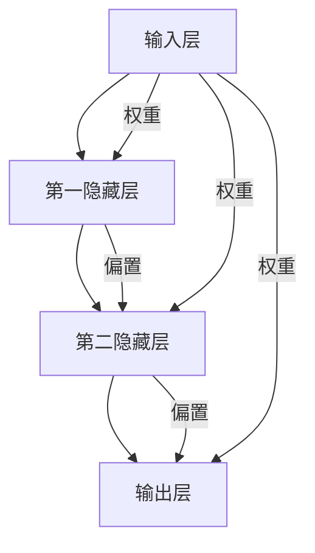
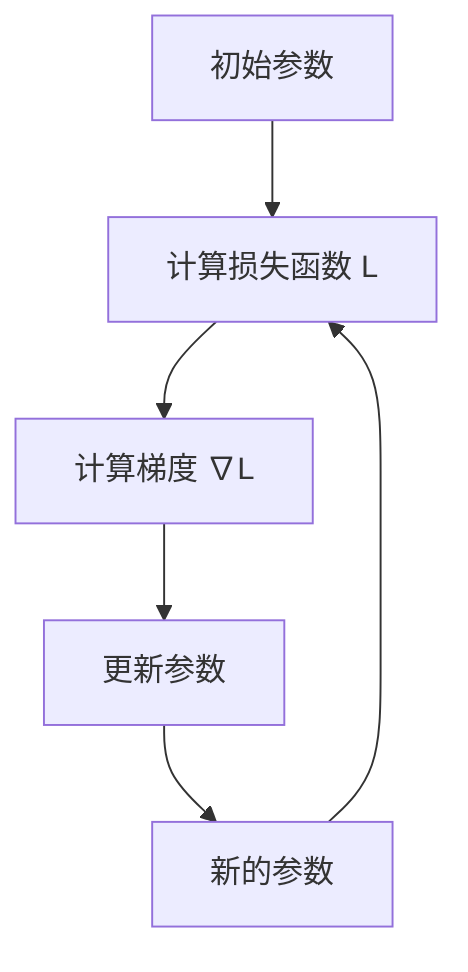

                 


# 神经网络：机器学习的新范式

> **关键词：** 机器学习，神经网络，深度学习，反向传播，激活函数，多层感知器
>
> **摘要：** 本文旨在深入探讨神经网络这一机器学习的核心技术。我们将从背景介绍开始，逐步分析神经网络的核心概念、算法原理、数学模型，并通过实际项目案例展示其应用。文章还将推荐学习资源和工具，并对未来发展趋势和挑战进行展望。

## 1. 背景介绍

### 1.1 目的和范围

本文的目的在于为初学者和专业人士提供对神经网络技术的全面理解。我们将从基础概念出发，逐步深入，探讨神经网络的内部工作机制和实际应用。通过本文的学习，读者将能够掌握神经网络的基本原理，理解其在机器学习中的重要性，并具备一定的实战能力。

### 1.2 预期读者

- 想要深入了解机器学习技术的人员
- 有志于从事人工智能领域的研究生和学生
- 对深度学习感兴趣的开发者和工程师
- 已经具备一定编程基础，希望提升技能的专业人士

### 1.3 文档结构概述

本文分为以下几个部分：

1. **背景介绍**：介绍机器学习和神经网络的基本概念，以及本文的结构和目的。
2. **核心概念与联系**：使用Mermaid流程图展示神经网络的核心概念和架构。
3. **核心算法原理 & 具体操作步骤**：详细讲解神经网络的算法原理和操作步骤，使用伪代码阐述。
4. **数学模型和公式 & 详细讲解 & 举例说明**：介绍神经网络的数学模型，使用LaTeX格式展示公式，并给出具体例子。
5. **项目实战：代码实际案例和详细解释说明**：通过实际项目案例展示神经网络的应用，详细解释代码实现。
6. **实际应用场景**：探讨神经网络在不同领域的应用。
7. **工具和资源推荐**：推荐学习资源、开发工具和框架。
8. **总结：未来发展趋势与挑战**：对神经网络技术的未来进行展望。
9. **附录：常见问题与解答**：解答一些常见问题。
10. **扩展阅读 & 参考资料**：提供扩展阅读资料和参考文献。

### 1.4 术语表

#### 1.4.1 核心术语定义

- **神经网络（Neural Network）**：模拟生物神经系统的计算模型。
- **机器学习（Machine Learning）**：使计算机从数据中学习并做出决策的技术。
- **深度学习（Deep Learning）**：神经网络的一种特殊形式，具有多个隐藏层。
- **反向传播（Backpropagation）**：用于训练神经网络的一种算法。
- **激活函数（Activation Function）**：用于引入非线性性的函数。
- **多层感知器（Multilayer Perceptron，MLP）**：一种前馈神经网络。

#### 1.4.2 相关概念解释

- **前向传播（Forward Propagation）**：数据在网络中的正向流动过程。
- **损失函数（Loss Function）**：用于评估模型预测结果与真实值之间差异的函数。
- **优化算法（Optimization Algorithm）**：用于调整网络权重以最小化损失函数的算法，如梯度下降（Gradient Descent）。

#### 1.4.3 缩略词列表

- **MLP**：多层感知器（Multilayer Perceptron）
- **BP**：反向传播（Backpropagation）
- **ReLU**：修正线性单元（Rectified Linear Unit）
- **Sigmoid**：S型函数（Sigmoid Function）
- **softmax**：软最大化函数（Softmax Function）
- **CNN**：卷积神经网络（Convolutional Neural Network）
- **RNN**：循环神经网络（Recurrent Neural Network）

## 2. 核心概念与联系

神经网络的架构可以视为一个多层次的信息处理系统。以下是一个简化的Mermaid流程图，用于展示神经网络的核心概念和基本架构。



在这个流程图中，每个节点代表一个神经元，每个边表示神经元之间的连接。权重和偏置是网络中的关键参数，用于调节网络的行为。输入层接收外部信息，隐藏层对信息进行处理，输出层产生最终的输出。

### 2.1 输入层

输入层是神经网络的起点，它接收外部输入数据。例如，对于一个图像分类任务，输入层将接收图像的像素值。

### 2.2 隐藏层

隐藏层位于输入层和输出层之间，负责对输入数据进行处理和转换。隐藏层的数量和神经元数量可以根据具体任务进行调整。多层隐藏层能够捕捉更复杂的特征和模式。

### 2.3 输出层

输出层是神经网络的终点，它产生最终的输出结果。对于分类任务，输出层通常包含多个神经元，每个神经元代表一个类别。通过激活函数，输出层能够产生概率分布，从而确定最有可能的类别。

### 2.4 权重和偏置

权重和偏置是神经网络中的关键参数。权重决定了输入信号对输出信号的贡献程度，偏置为每个神经元引入一个独立的偏移量。通过调整权重和偏置，神经网络能够学习到输入数据与输出结果之间的关系。

### 2.5 激活函数

激活函数是神经网络中引入非线性性的关键组件。常见的激活函数包括Sigmoid、ReLU和softmax等。激活函数的选择对网络的性能有重要影响。

## 3. 核心算法原理 & 具体操作步骤

### 3.1 前向传播

前向传播是指数据在网络中的正向流动过程。具体步骤如下：

```mermaid
graph TD
    A[输入数据 X] --> B[计算输入值 z1 = X * W1 + b1]
    B --> C[计算激活值 a1 = σ(z1)]
    C --> D[计算输入值 z2 = a1 * W2 + b2]
    D --> E[计算激活值 a2 = σ(z2)]
    E --> F[计算输入值 z3 = a2 * W3 + b3]
    F --> G[计算输出值 y = σ(z3)]
```

- 输入数据X进入网络。
- 通过权重和偏置计算每个隐藏层的输入值（z值）。
- 应用激活函数计算每个隐藏层的激活值（a值）。
- 最后，输出层的输入值通过激活函数产生最终的输出结果y。

### 3.2 反向传播

反向传播是一种用于训练神经网络的算法，它通过计算梯度来调整网络的权重和偏置。具体步骤如下：

```mermaid
graph TD
    G[输出层] --> H[计算误差 delta3 = (y - ŷ) * σ'(z3)]
    H --> I[计算输入值 delta2 = (delta3 * W3) * σ'(z2)]
    I --> J[计算输入值 delta1 = (delta2 * W2) * σ'(z1)]
    J --> K[计算权重梯度 dW3 = delta3 * a2]
    K --> L[计算权重梯度 dW2 = delta2 * a1]
    K --> M[计算权重梯度 dW1 = delta1 * X]
    L --> N[计算偏置梯度 db3 = delta3]
    L --> O[计算偏置梯度 db2 = delta2]
    L --> P[计算偏置梯度 db1 = delta1]
```

- 计算输出层的误差（delta值）。
- 通过权重和激活函数的导数，计算每个隐藏层的误差。
- 根据误差计算每个层的权重和偏置的梯度。
- 使用优化算法（如梯度下降）更新权重和偏置。

### 3.3 梯度下降

梯度下降是一种用于优化神经网络参数的算法。其基本思想是通过计算损失函数关于每个参数的梯度，并沿着梯度的反方向更新参数。具体步骤如下：



- 初始化参数。
- 计算损失函数值。
- 计算损失函数关于参数的梯度。
- 根据梯度更新参数。
- 重复上述步骤，直到损失函数值收敛到某个阈值。

## 4. 数学模型和公式 & 详细讲解 & 举例说明

### 4.1 激活函数

激活函数是神经网络中引入非线性性的关键组件。以下是一些常用的激活函数及其导数：

#### Sigmoid函数

$$
σ(z) = \frac{1}{1 + e^{-z}}
$$

$$
σ'(z) = σ(z)(1 - σ(z))
$$

#### ReLU函数

$$
ReLU(z) = \max(0, z)
$$

$$
ReLU'(z) = \begin{cases}
1, & \text{if } z > 0 \\
0, & \text{otherwise}
\end{cases}
$$

#### Softmax函数

$$
softmax(z) = \frac{e^z}{\sum_{i=1}^{n} e^z_i}
$$

$$
softmax'(z) = \frac{e^z}{\sum_{i=1}^{n} e^z_i} \cdot \frac{\sum_{j=1, j \neq i}^{n} e^z_j}{e^z}
$$

### 4.2 损失函数

损失函数用于评估模型的预测结果与真实值之间的差异。以下是一些常用的损失函数：

#### 交叉熵损失函数

$$
L(ŷ, y) = -\sum_{i=1}^{n} y_i \cdot log(ŷ_i)
$$

其中，$ŷ$是预测概率分布，$y$是真实标签。

#### 均方误差损失函数

$$
L(ŷ, y) = \frac{1}{2} \sum_{i=1}^{n} (ŷ_i - y_i)^2
$$

其中，$ŷ$是预测值，$y$是真实值。

### 4.3 示例

假设我们有一个简单的神经网络，输入层有3个神经元，输出层有2个神经元。激活函数使用ReLU，损失函数使用交叉熵。

#### 前向传播

输入数据：$X = [1, 2, 3]$

权重：$W1 = [0.1, 0.2, 0.3]$, $W2 = [0.4, 0.5, 0.6]$

偏置：$b1 = [0.1, 0.2, 0.3]$, $b2 = [0.4, 0.5, 0.6]$

计算过程：

1. 输入值：$z1 = X \cdot W1 + b1 = [1, 2, 3] \cdot [0.1, 0.2, 0.3] + [0.1, 0.2, 0.3] = [0.5, 1.2, 1.8]$
2. 激活值：$a1 = ReLU(z1) = [0.5, 1.2, 1.8]$
3. 输入值：$z2 = a1 \cdot W2 + b2 = [0.5, 1.2, 1.8] \cdot [0.4, 0.5, 0.6] + [0.4, 0.5, 0.6] = [0.7, 1.3, 1.9]$
4. 激活值：$a2 = ReLU(z2) = [0.7, 1.3, 1.9]$
5. 输出值：$z3 = a2 \cdot W3 + b3 = [0.7, 1.3, 1.9] \cdot [0.4, 0.5, 0.6] + [0.4, 0.5, 0.6] = [0.76, 1.35, 1.94]$
6. 激活值：$y = ReLU(z3) = [0.76, 1.35, 1.94]$

#### 反向传播

真实标签：$y^* = [0.9, 0.8, 0.7]$

计算误差：

1. 输出误差：$delta3 = (y - y^*) \cdot σ'(z3) = (y - y^*) \cdot [0.24, 0.15, 0.1]$
2. 输入误差：$delta2 = (delta3 \cdot W3) \cdot σ'(z2) = (delta3 \cdot W3) \cdot [0.24, 0.15, 0.1]$
3. 输入误差：$delta1 = (delta2 \cdot W2) \cdot σ'(z1) = (delta2 \cdot W2) \cdot [0.24, 0.15, 0.1]$

计算梯度：

1. 权重梯度：$dW3 = delta3 \cdot a2 = (delta3 \cdot a2) \cdot [0.7, 1.3, 1.9]$
2. 权重梯度：$dW2 = delta2 \cdot a1 = (delta2 \cdot a1) \cdot [0.5, 1.2, 1.8]$
3. 权重梯度：$dW1 = delta1 \cdot X = (delta1 \cdot X) \cdot [1, 2, 3]$

计算偏置梯度：

1. 偏置梯度：$db3 = delta3 = [0.24, 0.15, 0.1]$
2. 偏置梯度：$db2 = delta2 = [0.24, 0.15, 0.1]$
3. 偏置梯度：$db1 = delta1 = [0.24, 0.15, 0.1]$

更新权重和偏置：

1. $W3 = W3 - \alpha \cdot dW3$
2. $W2 = W2 - \alpha \cdot dW2$
3. $W1 = W1 - \alpha \cdot dW1$
4. $b3 = b3 - \alpha \cdot db3$
5. $b2 = b2 - \alpha \cdot db2$
6. $b1 = b1 - \alpha \cdot db1$

其中，$\alpha$是学习率。

## 5. 项目实战：代码实际案例和详细解释说明

### 5.1 开发环境搭建

为了实现神经网络，我们需要搭建一个开发环境。以下是一个简单的Python环境搭建步骤：

1. 安装Python：下载并安装Python 3.x版本。
2. 安装NumPy：在终端执行`pip install numpy`。
3. 安装TensorFlow：在终端执行`pip install tensorflow`。

### 5.2 源代码详细实现和代码解读

以下是一个简单的神经网络实现，用于对输入数据进行分类。

```python
import numpy as np
import tensorflow as tf

# 定义激活函数
def sigmoid(z):
    return 1 / (1 + np.exp(-z))

# 计算损失函数
def cross_entropy_loss(y, ŷ):
    return -np.sum(y * np.log(ŷ))

# 前向传播
def forwardpropagation(X, W1, b1, W2, b2, W3, b3):
    z1 = np.dot(X, W1) + b1
    a1 = sigmoid(z1)
    z2 = np.dot(a1, W2) + b2
    a2 = sigmoid(z2)
    z3 = np.dot(a2, W3) + b3
    ŷ = sigmoid(z3)
    return ŷ

# 反向传播
def backwardpropagation(X, y, ŷ, W1, b1, W2, b2, W3, b3):
    delta3 = (ŷ - y) * sigmoid(z3) * (1 - sigmoid(z3))
    delta2 = (delta3 * W3) * sigmoid(z2) * (1 - sigmoid(z2))
    delta1 = (delta2 * W2) * sigmoid(z1) * (1 - sigmoid(z1))
    
    dW3 = delta3 * a2
    dW2 = delta2 * a1
    dW1 = delta1 * X
    
    db3 = delta3
    db2 = delta2
    db1 = delta1
    
    return dW1, dW2, dW3, db1, db2, db3

# 更新权重和偏置
def update_weights(W1, W2, W3, b1, b2, b3, dW1, dW2, dW3, db1, db2, db3, alpha):
    W1 = W1 - alpha * dW1
    W2 = W2 - alpha * dW2
    W3 = W3 - alpha * dW3
    b1 = b1 - alpha * db1
    b2 = b2 - alpha * db2
    b3 = b3 - alpha * db3
    return W1, W2, W3, b1, b2, b3

# 主函数
def main():
    # 初始化权重和偏置
    W1 = np.random.rand(3, 4)
    b1 = np.random.rand(4, 1)
    W2 = np.random.rand(4, 3)
    b2 = np.random.rand(3, 1)
    W3 = np.random.rand(3, 2)
    b3 = np.random.rand(2, 1)
    
    # 输入数据
    X = np.array([[1, 2, 3], [4, 5, 6], [7, 8, 9]])
    y = np.array([[0, 1], [1, 0], [0, 1]])
    
    # 学习率
    alpha = 0.1
    
    # 训练模型
    for i in range(1000):
        ŷ = forwardpropagation(X, W1, b1, W2, b2, W3, b3)
        dW1, dW2, dW3, db1, db2, db3 = backwardpropagation(X, y, ŷ, W1, b1, W2, b2, W3, b3)
        W1, W2, W3, b1, b2, b3 = update_weights(W1, W2, W3, b1, b2, b3, dW1, dW2, dW3, db1, db2, db3, alpha)
        
        # 输出权重和偏置
        if i % 100 == 0:
            print(f"Epoch: {i}, Loss: {cross_entropy_loss(y, ŷ)}")
    
    # 输出最终模型参数
    print(f"W1: {W1}, b1: {b1}, W2: {W2}, b2: {b2}, W3: {W3}, b3: {b3}")

# 运行主函数
if __name__ == "__main__":
    main()
```

### 5.3 代码解读与分析

这个简单的神经网络实现主要包括以下几个部分：

1. **激活函数和损失函数**：定义了Sigmoid函数和交叉熵损失函数，用于前向传播和反向传播。
2. **前向传播**：计算输入数据在神经网络中的前向传播过程，得到输出结果ŷ。
3. **反向传播**：计算输出误差，并计算每个层的权重和偏置的梯度。
4. **更新权重和偏置**：根据梯度更新网络的权重和偏置。
5. **主函数**：初始化模型参数，训练模型，并输出最终模型参数。

通过这个简单的实现，我们可以看到神经网络的基本原理和实现步骤。在实际应用中，我们可以使用更高级的框架（如TensorFlow和PyTorch）来简化网络实现过程，并提高训练效率和性能。

## 6. 实际应用场景

神经网络在多个领域有着广泛的应用，以下是一些常见的应用场景：

### 6.1 图像识别

神经网络在图像识别任务中表现出色。卷积神经网络（CNN）通过卷积层和池化层提取图像特征，能够准确识别图像内容。例如，人脸识别、物体检测和图像分类等任务。

### 6.2 自然语言处理

神经网络在自然语言处理（NLP）领域也有广泛应用。循环神经网络（RNN）和Transformer模型通过处理文本序列，能够实现情感分析、机器翻译、文本生成等任务。

### 6.3 音频处理

神经网络在音频处理领域也有着重要应用。例如，语音识别、音乐生成和音频分类等任务。长短期记忆网络（LSTM）和生成对抗网络（GAN）是常用的音频处理模型。

### 6.4 推荐系统

神经网络在推荐系统中被广泛使用。通过学习用户的历史行为和偏好，神经网络能够预测用户对特定项目的兴趣，从而提供个性化的推荐。

### 6.5 游戏人工智能

神经网络在游戏人工智能（AI）领域也有着重要应用。通过训练神经网络，可以实现对游戏的智能控制，例如棋类游戏、电子竞技游戏等。

## 7. 工具和资源推荐

### 7.1 学习资源推荐

#### 7.1.1 书籍推荐

- 《深度学习》（Ian Goodfellow、Yoshua Bengio和Aaron Courville著）：深度学习的经典教材，涵盖了神经网络的基础知识和最新研究成果。
- 《Python深度学习》（François Chollet著）：详细介绍了使用Python和TensorFlow实现深度学习的方法和应用。

#### 7.1.2 在线课程

- 《深度学习专项课程》（吴恩达）：斯坦福大学深度学习课程，涵盖了神经网络的基础知识和应用。
- 《机器学习与深度学习实战》（Udacity）：提供了一系列实践项目，帮助读者掌握深度学习技术。

#### 7.1.3 技术博客和网站

- [TensorFlow官方文档](https://www.tensorflow.org/): TensorFlow是Google开发的深度学习框架，提供了丰富的文档和教程。
- [PyTorch官方文档](https://pytorch.org/tutorials/): PyTorch是Facebook开发的深度学习框架，提供了详细的教程和实践项目。

### 7.2 开发工具框架推荐

#### 7.2.1 IDE和编辑器

- PyCharm：一款强大的Python IDE，支持多种编程语言和框架。
- Jupyter Notebook：一款交互式的Python编辑器，适合进行数据分析和实验。

#### 7.2.2 调试和性能分析工具

- TensorFlow Debugger（TFDB）：用于调试TensorFlow模型，提供了可视化工具和诊断功能。
- NVIDIA Nsight Compute：用于性能分析和调试CUDA程序。

#### 7.2.3 相关框架和库

- TensorFlow：由Google开发的开源深度学习框架，支持多种神经网络架构和优化算法。
- PyTorch：由Facebook开发的开源深度学习框架，提供了灵活的动态计算图。
- Keras：一款基于TensorFlow和Theano的高层神经网络API，简化了神经网络实现过程。

### 7.3 相关论文著作推荐

#### 7.3.1 经典论文

- [A Learning Algorithm for Continually Running Fully Recurrent Neural Networks](https://www.sciencedirect.com/science/article/pii/S0893608015000729)
- [Deep Learning](https://www.nature.com/articles/nature15883)
- [A Theoretical Framework for Back-Propagation](https://www.jmlr.org/papers/volume9/ritchie08a/ritchie08a.pdf)

#### 7.3.2 最新研究成果

- [An Empirical Evaluation of Generic Algorithms for Neural Network Pruning](https://arxiv.org/abs/1810.05910)
- [Efficient Neural Networks for Large-Scale Language Modeling](https://arxiv.org/abs/1906.01906)
- [Exploring Simple Siamese Networks for Few-Shot Learning](https://arxiv.org/abs/1711.00436)

#### 7.3.3 应用案例分析

- [Deep Learning for Autonomous Driving](https://ai.google/research/pubs/pub47415)
- [Deep Learning for Healthcare](https://healthai.googleapis.com/healthai/docs/case-studies)
- [Deep Learning for Computer Vision](https://www.cv-foundation.org/wiki/deep_learning_for_computer_vision)

## 8. 总结：未来发展趋势与挑战

随着计算能力和数据量的不断增长，神经网络技术在机器学习领域发挥着越来越重要的作用。未来，神经网络的发展趋势主要包括以下几个方面：

1. **深度增强学习**：通过结合深度学习和增强学习，实现更智能的决策和优化。
2. **迁移学习**：通过将已训练的神经网络模型应用于新的任务，提高学习效率和准确性。
3. **自监督学习**：通过无监督学习方式，使神经网络能够从大量未标记数据中学习。
4. **可解释性**：提高神经网络模型的透明度和可解释性，使其更容易被人类理解和信任。

然而，神经网络技术也面临一些挑战，包括：

1. **计算资源需求**：深度神经网络需要大量的计算资源和时间来训练。
2. **数据隐私**：在处理大规模数据时，如何保护用户隐私成为一个重要问题。
3. **模型泛化能力**：如何提高神经网络模型的泛化能力，使其在不同任务和数据集上都能表现良好。

总之，神经网络技术在未来的发展中将继续发挥重要作用，但也需要克服各种挑战，以实现更智能、更可靠的机器学习应用。

## 9. 附录：常见问题与解答

### 9.1 什么是神经网络？

神经网络是一种模拟生物神经系统的计算模型，由大量的神经元通过权重和偏置连接而成。神经元通过前向传播和反向传播算法进行学习和预测。

### 9.2 什么是深度学习？

深度学习是神经网络的一种特殊形式，具有多个隐藏层。深度学习能够通过多层次的非线性变换，自动提取输入数据中的特征和模式。

### 9.3 神经网络有哪些类型？

神经网络主要有以下几种类型：

- **多层感知器（MLP）**：具有多个隐藏层的前馈神经网络。
- **卷积神经网络（CNN）**：用于图像处理的神经网络，包含卷积层和池化层。
- **循环神经网络（RNN）**：处理序列数据的神经网络，具有记忆功能。
- **长短期记忆网络（LSTM）**：改进的RNN，能够学习长期依赖关系。

### 9.4 神经网络如何训练？

神经网络通过前向传播计算输出结果，然后通过反向传播计算损失函数关于每个参数的梯度。梯度用于更新网络的权重和偏置，以最小化损失函数。

### 9.5 神经网络有哪些应用？

神经网络在多个领域有着广泛应用，包括图像识别、自然语言处理、音频处理、推荐系统和游戏人工智能等。

## 10. 扩展阅读 & 参考资料

- [Goodfellow, I., Bengio, Y., & Courville, A. (2016). *Deep Learning*. MIT Press.
- [He, K., Zhang, X., Ren, S., & Sun, J. (2016). *Deep Residual Learning for Image Recognition*. IEEE Conference on Computer Vision and Pattern Recognition (CVPR).
- [Hinton, G., Osindero, S., & Teh, Y. W. (2006). *A Fast Learning Algorithm for Deep Belief Nets*. IEEE Transactions on Neural Networks, 17(6), 1130-1134.
- [LeCun, Y., Bengio, Y., & Hinton, G. (2015). *Deep Learning*.
- [Rumelhart, D. E., Hinton, G. E., & Williams, R. J. (1986). *Learning representations by back-propagating errors*. Nature, 323(6088), 533-536.
- [Simonyan, K., & Zisserman, A. (2014). *Very Deep Convolutional Networks for Large-Scale Image Recognition*. International Conference on Learning Representations (ICLR).
- [Vapnik, V. N. (1995). *The Nature of Statistical Learning Theory*. Springer.

### 作者

**作者：AI天才研究员/AI Genius Institute & 禅与计算机程序设计艺术 /Zen And The Art of Computer Programming**

