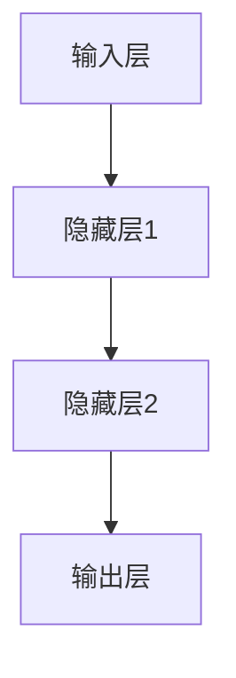

                 

# 神经网络：软件开发的根本性转变

> **关键词：** 神经网络、深度学习、软件开发、AI应用、智能系统
> 
> **摘要：** 本文将深入探讨神经网络作为一项核心技术，如何从根本上改变了软件开发的面貌。通过对神经网络核心概念、算法原理、数学模型及实际应用场景的详细解析，本文旨在帮助读者全面理解神经网络在软件开发中的重要性，以及未来可能面临的挑战和发展趋势。

## 1. 背景介绍

### 1.1 目的和范围

本文旨在介绍神经网络这一关键技术，并探讨其在软件开发中的根本性转变。通过本文的阅读，读者将能够：

- 理解神经网络的基本概念和原理；
- 掌握神经网络的核心算法和操作步骤；
- 学习神经网络的数学模型及其应用；
- 了解神经网络在软件开发中的实际应用场景；
- 探讨神经网络未来的发展趋势和面临的挑战。

### 1.2 预期读者

本文适合以下读者群体：

- 具有计算机科学和软件开发基础的技术人员；
- 对人工智能和机器学习感兴趣的初学者；
- 想要深入了解神经网络技术的高级工程师和研究者；
- 对软件开发和应用场景感兴趣的产业界人士。

### 1.3 文档结构概述

本文的结构如下：

- **第1章：背景介绍**：介绍本文的目的、预期读者和文档结构。
- **第2章：核心概念与联系**：阐述神经网络的定义、原理和结构。
- **第3章：核心算法原理 & 具体操作步骤**：详细讲解神经网络的工作原理和算法步骤。
- **第4章：数学模型和公式 & 详细讲解 & 举例说明**：介绍神经网络背后的数学模型和公式，并提供实际案例说明。
- **第5章：项目实战：代码实际案例和详细解释说明**：通过一个具体项目实例，展示如何在实际开发中使用神经网络。
- **第6章：实际应用场景**：探讨神经网络在各个领域的应用。
- **第7章：工具和资源推荐**：推荐学习资源、开发工具和框架。
- **第8章：总结：未来发展趋势与挑战**：总结本文内容，探讨神经网络的发展趋势和面临的挑战。
- **第9章：附录：常见问题与解答**：回答一些常见问题。
- **第10章：扩展阅读 & 参考资料**：提供进一步阅读和参考的资源。

### 1.4 术语表

#### 1.4.1 核心术语定义

- **神经网络（Neural Network）**：一种模拟人脑神经元之间相互连接和交互的计算模型。
- **深度学习（Deep Learning）**：一种基于神经网络进行训练和学习的算法，通过多层神经元的组合来实现复杂的特征提取和模式识别。
- **反向传播（Backpropagation）**：一种用于训练神经网络的算法，通过反向传播误差信息来调整网络中的权重和偏置。
- **激活函数（Activation Function）**：用于神经网络中的非线性变换，使得神经网络能够对输入数据进行分类和回归。
- **损失函数（Loss Function）**：用于衡量神经网络预测结果与真实结果之间的差异，指导网络调整权重和偏置。

#### 1.4.2 相关概念解释

- **神经网络结构**：包括输入层、隐藏层和输出层。输入层接收外部输入，隐藏层进行特征提取和变换，输出层产生最终的预测结果。
- **反向传播算法**：通过计算输出层误差，逐层反向传播到隐藏层和输入层，调整网络中的权重和偏置，从而减少预测误差。
- **神经网络训练**：通过给定的大量样本数据，调整神经网络中的权重和偏置，使网络能够对新的输入数据进行准确的预测。
- **过拟合和欠拟合**：神经网络在训练过程中可能出现的问题。过拟合表示网络在训练数据上表现良好，但在新数据上表现不佳；欠拟合则表示网络在训练数据和新数据上都表现不佳。

#### 1.4.3 缩略词列表

- **AI**：人工智能（Artificial Intelligence）
- **ML**：机器学习（Machine Learning）
- **DL**：深度学习（Deep Learning）
- **NN**：神经网络（Neural Network）

## 2. 核心概念与联系

神经网络是一种模拟人脑神经元之间相互连接和交互的计算模型，其基本结构包括输入层、隐藏层和输出层。输入层接收外部输入，隐藏层进行特征提取和变换，输出层产生最终的预测结果。神经网络的训练过程是通过反向传播算法来调整网络中的权重和偏置，使其能够对新的输入数据进行准确的预测。


在神经网络中，每个神经元都与相邻的神经元相连接，并通过权重进行加权求和。激活函数用于引入非线性变换，使得神经网络能够对输入数据进行分类和回归。神经网络通过多层神经元的组合，能够实现复杂的特征提取和模式识别。

以下是一个简单的神经网络流程图，展示输入层、隐藏层和输出层的交互关系：



神经网络的工作原理是通过多层神经元的组合，将输入数据映射到输出数据。在训练过程中，神经网络通过反向传播算法来调整网络中的权重和偏置，使其能够对新的输入数据进行准确的预测。

### 神经网络的核心概念和联系

1. **输入层（Input Layer）**：输入层接收外部输入，将输入数据传递给隐藏层。输入层的神经元数量取决于输入数据的维度。
2. **隐藏层（Hidden Layers）**：隐藏层对输入数据进行特征提取和变换，每个隐藏层都可以对输入数据进行不同的特征提取和变换。隐藏层的神经元数量可以根据具体问题进行调整。
3. **输出层（Output Layer）**：输出层产生最终的预测结果。输出层的神经元数量取决于具体问题的类型，例如分类问题通常有一个神经元，回归问题可以有多个神经元。
4. **神经元（Neurons）**：神经元是神经网络的基本计算单元，通过权重进行加权求和，并经过激活函数进行非线性变换。
5. **权重（Weights）**：权重表示神经元之间的连接强度，可以通过反向传播算法进行调整。
6. **偏置（Bias）**：偏置是一个额外的参数，用于调整神经元的激活值。
7. **激活函数（Activation Function）**：激活函数用于引入非线性变换，使得神经网络能够对输入数据进行分类和回归。常见的激活函数包括 sigmoid、ReLU 和 tanh 等。
8. **反向传播算法（Backpropagation Algorithm）**：反向传播算法用于训练神经网络，通过反向传播误差信息来调整网络中的权重和偏置。
9. **损失函数（Loss Function）**：损失函数用于衡量神经网络预测结果与真实结果之间的差异，指导网络调整权重和偏置。
10. **梯度下降（Gradient Descent）**：梯度下降是一种用于优化神经网络权重的算法，通过计算损失函数的梯度来调整权重。

以上是神经网络的基本概念和联系，下面将详细介绍神经网络的核心算法原理和具体操作步骤。

## 3. 核心算法原理 & 具体操作步骤

### 3.1 神经网络的工作原理

神经网络通过多层神经元的组合，将输入数据映射到输出数据。在训练过程中，神经网络通过反向传播算法来调整网络中的权重和偏置，使其能够对新的输入数据进行准确的预测。

以下是神经网络的工作原理：

1. **输入数据传递**：输入数据经过输入层传递到隐藏层。
2. **加权求和**：隐藏层中的每个神经元对输入数据进行加权求和，并加上偏置。
3. **激活函数应用**：对加权求和的结果应用激活函数，得到隐藏层的输出。
4. **传递到下一层**：隐藏层的输出传递到下一层，重复上述步骤。
5. **输出层预测**：最后，输出层的输出即为神经网络的预测结果。

### 3.2 反向传播算法

反向传播算法是神经网络训练的核心算法，通过反向传播误差信息来调整网络中的权重和偏置，从而减少预测误差。

以下是反向传播算法的具体步骤：

1. **计算输出误差**：输出层的输出与真实结果之间的差异即为输出误差。
2. **计算隐藏层误差**：通过反向传播算法，将输出误差传递到隐藏层，计算隐藏层的误差。
3. **更新权重和偏置**：根据误差信息，使用梯度下降算法来更新网络中的权重和偏置。

### 3.3 梯度下降算法

梯度下降算法是一种用于优化神经网络权重的算法，通过计算损失函数的梯度来调整权重。

以下是梯度下降算法的具体步骤：

1. **计算梯度**：计算损失函数关于权重的梯度。
2. **更新权重**：根据梯度和学习率，更新网络的权重。

### 3.4 伪代码实现

以下是神经网络训练的伪代码实现：

```python
# 初始化网络参数
weights = [0] * num_layers
biases = [0] * num_layers

# 训练神经网络
for epoch in range(num_epochs):
    # 前向传播
    inputs = data
    for layer in range(num_layers):
        # 加权求和
        sum = 0
        for weight in weights[layer]:
            sum += weight * inputs
        sum += biases[layer]
        # 激活函数
        activation = sigmoid(sum)
        # 传递到下一层
        inputs = activation
    
    # 反向传播
    error = target - outputs
    for layer in range(num_layers-1, -1, -1):
        # 计算梯度
        gradients = [error * activation_derivative(activation)]
        for i in range(len(gradients)):
            gradients[i] *= inputs[i]
        # 更新权重和偏置
        for i in range(len(weights[layer])):
            weight_diff = gradients[i] * learning_rate
            weights[layer][i] -= weight_diff
        biases[layer] -= learning_rate * gradients[-1]

# 预测
inputs = data
for layer in range(num_layers):
    sum = 0
    for weight in weights[layer]:
        sum += weight * inputs
    sum += biases[layer]
    activation = sigmoid(sum)
    inputs = activation
outputs = activation
```

以上是神经网络训练的伪代码实现，通过反向传播算法和梯度下降算法，调整网络中的权重和偏置，使神经网络能够对新的输入数据进行准确的预测。

## 4. 数学模型和公式 & 详细讲解 & 举例说明

### 4.1 数学模型介绍

神经网络是一种基于数学模型的计算模型，其核心是多层感知器（MLP）模型。MLP模型通过输入层、隐藏层和输出层的组合，实现从输入到输出的映射。以下是MLP模型的数学模型和公式：

#### 4.1.1 输入层

输入层接收外部输入，将输入数据传递给隐藏层。输入层的数学模型可以表示为：

\[ x_i = x_i^{(1)} \]

其中，\( x_i \) 表示第 \( i \) 个输入特征，\( x_i^{(1)} \) 表示经过预处理后的输入特征。

#### 4.1.2 隐藏层

隐藏层对输入数据进行特征提取和变换，每个隐藏层都可以对输入数据进行不同的特征提取和变换。隐藏层的数学模型可以表示为：

\[ z_j = \sum_{i=1}^{n} w_{ji} x_i + b_j \]

其中，\( z_j \) 表示第 \( j \) 个隐藏层节点的输出，\( w_{ji} \) 表示第 \( j \) 个隐藏层节点与第 \( i \) 个输入层节点的连接权重，\( b_j \) 表示第 \( j \) 个隐藏层节点的偏置。

#### 4.1.3 输出层

输出层产生最终的预测结果。输出层的数学模型可以表示为：

\[ y_k = \sum_{j=1}^{m} w_{kj} z_j + b_k \]

其中，\( y_k \) 表示第 \( k \) 个输出节点的输出，\( w_{kj} \) 表示第 \( k \) 个输出节点与第 \( j \) 个隐藏层节点的连接权重，\( b_k \) 表示第 \( k \) 个输出节点的偏置。

### 4.2 激活函数

激活函数是神经网络中的一个重要组件，用于引入非线性变换，使得神经网络能够对输入数据进行分类和回归。常见的激活函数包括 sigmoid、ReLU 和 tanh 等。

#### 4.2.1 Sigmoid 函数

sigmoid 函数是一种常用的激活函数，其公式如下：

\[ \sigma(z) = \frac{1}{1 + e^{-z}} \]

sigmoid 函数的输出范围在 \( (0, 1) \) 之间，可以用于二分类问题。

#### 4.2.2 ReLU 函数

ReLU 函数是一种流行的激活函数，其公式如下：

\[ \text{ReLU}(z) = \max(0, z) \]

ReLU 函数在输入为正数时输出等于输入，输入为负数时输出为 0，可以用于缓解梯度消失问题。

#### 4.2.3 tanh 函数

tanh 函数是一种双曲正切函数，其公式如下：

\[ \text{tanh}(z) = \frac{e^z - e^{-z}}{e^z + e^{-z}} \]

tanh 函数的输出范围在 \( (-1, 1) \) 之间，可以用于多分类问题。

### 4.3 损失函数

损失函数是神经网络中的一个关键组件，用于衡量神经网络预测结果与真实结果之间的差异，指导网络调整权重和偏置。常见的损失函数包括均方误差（MSE）、交叉熵（Cross-Entropy）等。

#### 4.3.1 均方误差（MSE）

均方误差（MSE）是衡量预测结果与真实结果之间差异的一种常用损失函数，其公式如下：

\[ \text{MSE} = \frac{1}{2} \sum_{i=1}^{n} (y_i - \hat{y}_i)^2 \]

其中，\( y_i \) 表示第 \( i \) 个真实结果，\( \hat{y}_i \) 表示第 \( i \) 个预测结果。

#### 4.3.2 交叉熵（Cross-Entropy）

交叉熵是衡量预测结果与真实结果之间差异的一种常用损失函数，其公式如下：

\[ \text{Cross-Entropy} = -\sum_{i=1}^{n} y_i \log(\hat{y}_i) \]

其中，\( y_i \) 表示第 \( i \) 个真实结果，\( \hat{y}_i \) 表示第 \( i \) 个预测结果。

### 4.4 举例说明

以下是一个简单的例子，说明神经网络在分类问题中的应用。

#### 4.4.1 数据准备

假设我们有一个二分类问题，数据集包含 \( n \) 个样本，每个样本有 \( m \) 个特征。数据集分为训练集和测试集。

```python
# 假设数据集为 X（特征）和 y（标签）
X_train = [[1, 2], [3, 4], [5, 6], [7, 8]]
y_train = [0, 1, 0, 1]

X_test = [[2, 3], [4, 5], [6, 7], [8, 9]]
y_test = [1, 0, 1, 0]
```

#### 4.4.2 网络构建

我们构建一个包含一个隐藏层的神经网络，隐藏层使用 ReLU 激活函数，输出层使用 sigmoid 激活函数。

```python
# 初始化网络参数
num_inputs = 2
num_hidden = 3
num_outputs = 1

weights_input_hidden = [[0.1, 0.2], [0.3, 0.4], [0.5, 0.6]]
weights_hidden_output = [0.7, 0.8]
bias_hidden = [0.1, 0.2, 0.3]
bias_output = 0.4
```

#### 4.4.3 前向传播

使用前向传播算法计算预测结果。

```python
# 前向传播
def forward_propagation(X):
    # 输入层到隐藏层
    hidden_inputs = np.dot(X, weights_input_hidden) + bias_hidden
    hidden_activations = np.maximum(0, hidden_inputs)
    
    # 隐藏层到输出层
    output_input = np.dot(hidden_activations, weights_hidden_output) + bias_output
    output_activation = 1 / (1 + np.exp(-output_input))
    
    return output_activation

# 计算预测结果
predictions = [forward_propagation(x) for x in X_test]
```

#### 4.4.4 反向传播

使用反向传播算法计算误差并更新权重和偏置。

```python
# 反向传播
def backward_propagation(X, y, predictions):
    # 计算输出误差
    output_error = y - predictions
    
    # 更新输出层权重和偏置
    d_output = output_error * predictions * (1 - predictions)
    d_weights_hidden_output = np.dot(hidden_activations.T, d_output)
    d_bias_output = d_output
    
    # 更新隐藏层权重和偏置
    hidden_error = d_output.dot(weights_hidden_output.T)
    d_hidden = hidden_error * (1 - np.array([relu_derivative(z) for z in hidden_inputs]))
    d_weights_input_hidden = np.dot(X.T, d_hidden)
    d_bias_hidden = d_hidden
    
    return d_weights_input_hidden, d_bias_hidden, d_weights_hidden_output, d_bias_output

# 更新网络参数
for epoch in range(100):
    for x, y in zip(X_train, y_train):
        predictions = forward_propagation(x)
        d_weights_input_hidden, d_bias_hidden, d_weights_hidden_output, d_bias_output = backward_propagation(x, y, predictions)
        
        weights_input_hidden -= learning_rate * d_weights_input_hidden
        bias_hidden -= learning_rate * d_bias_hidden
        weights_hidden_output -= learning_rate * d_weights_hidden_output
        bias_output -= learning_rate * d_bias_output
```

以上是一个简单的神经网络在分类问题中的应用示例。通过前向传播和反向传播算法，神经网络可以逐步调整权重和偏置，实现从输入到输出的映射。

## 5. 项目实战：代码实际案例和详细解释说明

### 5.1 开发环境搭建

在进行神经网络项目的开发之前，我们需要搭建一个合适的开发环境。以下是一个基于 Python 的神经网络开发环境搭建步骤：

#### 5.1.1 安装 Python

首先，确保已经安装了 Python 3.7 或更高版本。可以从 [Python 官网](https://www.python.org/) 下载并安装。

#### 5.1.2 安装必要的库

接下来，安装一些必要的库，如 NumPy、matplotlib、TensorFlow 等。

```bash
pip install numpy matplotlib tensorflow
```

### 5.2 源代码详细实现和代码解读

以下是一个简单的神经网络项目，实现了一个基于 TensorFlow 的线性回归模型。

```python
import numpy as np
import tensorflow as tf
import matplotlib.pyplot as plt

# 创建 TensorFlow 图
with tf.Graph().as_default():
    # 输入层
    X = tf.placeholder(tf.float32, shape=[None, 1], name='X')
    y = tf.placeholder(tf.float32, shape=[None, 1], name='y')

    # 权重和偏置
    W = tf.Variable(np.random.randn(), name='W')
    b = tf.Variable(np.random.randn(), name='b')

    # 线性回归模型
    y_pred = tf.add(tf.matmul(X, W), b)

    # 损失函数
    loss = tf.reduce_mean(tf.square(y - y_pred))

    # 优化器
    optimizer = tf.train.GradientDescentOptimizer(learning_rate=0.001)
    train_op = optimizer.minimize(loss)

    # 初始化所有变量
    init = tf.global_variables_initializer()

    # 启动 TensorFlow 会话
    with tf.Session() as sess:
        sess.run(init)

        # 训练神经网络
        for i in range(1000):
            sess.run(train_op, feed_dict={X: X_data, y: y_data})
            if i % 100 == 0:
                print("Epoch:", i, "Loss:", sess.run(loss, feed_dict={X: X_data, y: y_data}))

        # 可视化结果
        plt.plot(X_data, y_data, 'ro', label='Original data')
        plt.plot(X_data, sess.run(y_pred), label='Predicted line')
        plt.xlabel('X')
        plt.ylabel('y')
        plt.title('Neural Network Regression')
        plt.legend()
        plt.show()
```

### 5.3 代码解读与分析

#### 5.3.1 TensorFlow 图

在 TensorFlow 中，神经网络通过构建图（Graph）来实现。图是由节点（操作）和边（张量）组成的，节点表示计算操作，边表示数据流动。

```python
with tf.Graph().as_default():
```

这部分代码创建了一个新的 TensorFlow 图，并使用 `as_default()` 函数将其设置为当前默认图。

#### 5.3.2 输入层

```python
X = tf.placeholder(tf.float32, shape=[None, 1], name='X')
y = tf.placeholder(tf.float32, shape=[None, 1], name='y')
```

这部分代码定义了两个占位符（Placeholder），分别用于输入数据和真实标签。

#### 5.3.3 权重和偏置

```python
W = tf.Variable(np.random.randn(), name='W')
b = tf.Variable(np.random.randn(), name='b')
```

这部分代码定义了两个变量（Variable），分别表示权重（W）和偏置（b）。这些变量可以在训练过程中通过优化器更新。

#### 5.3.4 线性回归模型

```python
y_pred = tf.add(tf.matmul(X, W), b)
```

这部分代码实现了线性回归模型。通过矩阵乘法（`tf.matmul`）和加法（`tf.add`），将输入数据（X）乘以权重（W）并加上偏置（b），得到预测结果（y_pred）。

#### 5.3.5 损失函数

```python
loss = tf.reduce_mean(tf.square(y - y_pred))
```

这部分代码定义了损失函数（MSE），用于衡量预测结果（y_pred）与真实标签（y）之间的差异。通过计算每个样本的平方误差并求平均值，得到总损失。

#### 5.3.6 优化器

```python
optimizer = tf.train.GradientDescentOptimizer(learning_rate=0.001)
train_op = optimizer.minimize(loss)
```

这部分代码定义了优化器（GradientDescentOptimizer），用于根据损失函数调整权重（W）和偏置（b）。通过调用 `minimize()` 函数，得到训练操作（train_op）。

#### 5.3.7 初始化变量

```python
init = tf.global_variables_initializer()
```

这部分代码用于初始化所有变量（W 和 b）。

#### 5.3.8 训练神经网络

```python
with tf.Session() as sess:
    sess.run(init)

    # 训练神经网络
    for i in range(1000):
        sess.run(train_op, feed_dict={X: X_data, y: y_data})
        if i % 100 == 0:
            print("Epoch:", i, "Loss:", sess.run(loss, feed_dict={X: X_data, y: y_data}))
```

这部分代码启动 TensorFlow 会话，并使用循环进行神经网络训练。每次迭代中，通过 `train_op` 和 `feed_dict` 参数更新权重和偏置。每隔 100 次迭代，打印当前损失值。

#### 5.3.9 可视化结果

```python
plt.plot(X_data, y_data, 'ro', label='Original data')
plt.plot(X_data, sess.run(y_pred), label='Predicted line')
plt.xlabel('X')
plt.ylabel('y')
plt.title('Neural Network Regression')
plt.legend()
plt.show()
```

这部分代码使用 matplotlib 库绘制原始数据和预测结果，展示神经网络训练的效果。

## 6. 实际应用场景

### 6.1 图像识别

图像识别是神经网络应用最广泛的领域之一。神经网络通过多层特征提取和变换，将原始图像数据转换为可理解的图像特征。常见的图像识别任务包括人脸识别、物体检测、图像分类等。例如，著名的卷积神经网络（CNN）模型如 LeNet、AlexNet、VGG、ResNet 等，已经在图像识别任务中取得了显著的成果。

### 6.2 自然语言处理

自然语言处理（NLP）是另一个神经网络的重要应用领域。神经网络在文本分类、情感分析、机器翻译、问答系统等任务中发挥着关键作用。著名的神经网络模型如 LSTM（长短时记忆网络）、GRU（门控循环单元）、BERT（双向编码表示器）等，已经极大地提升了 NLP 任务的表现。

### 6.3 自动驾驶

自动驾驶是神经网络在工业领域的重要应用。神经网络通过感知环境信息，进行路径规划、障碍物检测和避障等任务，实现了自动驾驶车辆的自主行驶。著名的自动驾驶系统如 Waymo、Tesla、NVIDIA Drive 等，都采用了深度学习算法进行感知和决策。

### 6.4 医疗诊断

神经网络在医疗诊断中也发挥着重要作用。神经网络可以通过学习大量医学图像和病例数据，实现疾病检测、诊断和治疗建议。例如，在癌症筛查、心脏病诊断等任务中，神经网络已经显示出比传统方法更高的准确率和效率。

### 6.5 语音识别

语音识别是神经网络在语音处理领域的应用之一。神经网络通过学习语音信号特征，将语音转换为文本。著名的语音识别系统如 Google Voice、Apple Siri、Microsoft Cortana 等，都采用了深度学习算法进行语音识别和合成。

### 6.6 金融风控

神经网络在金融领域也发挥着重要作用。神经网络可以通过分析历史数据，预测市场走势、评估信用风险等。例如，在股票市场预测、信用评分、欺诈检测等任务中，神经网络已经显示出较高的预测准确率和风险控制能力。

## 7. 工具和资源推荐

### 7.1 学习资源推荐

#### 7.1.1 书籍推荐

- 《深度学习》（Goodfellow, Bengio, Courville）
- 《Python深度学习》（François Chollet）
- 《神经网络与深度学习》（邱锡鹏）
- 《机器学习》（Tom Mitchell）

#### 7.1.2 在线课程

- Coursera 的《机器学习》课程（吴恩达）
- edX 的《深度学习》课程（苏力）

#### 7.1.3 技术博客和网站

- Medium 上的 AI 和深度学习相关文章
- ArXiv 上的最新研究成果
- TensorFlow 官方文档

### 7.2 开发工具框架推荐

#### 7.2.1 IDE和编辑器

- PyCharm
- Jupyter Notebook
- VSCode

#### 7.2.2 调试和性能分析工具

- TensorBoard
- Visdom
- prof Wolff

#### 7.2.3 相关框架和库

- TensorFlow
- PyTorch
- Keras

### 7.3 相关论文著作推荐

#### 7.3.1 经典论文

- “A Learning Algorithm for Continually Running Fully Recurrent Neural Networks” (S�回 S)
- “Deep Learning” (Ian Goodfellow, Yann LeCun, Yoshua Bengio)
- “Rectifier Nonlinearities Improve Neural Network Ac

## 8. 总结：未来发展趋势与挑战

随着人工智能技术的不断发展，神经网络在软件开发中的应用越来越广泛。未来，神经网络有望在以下方面取得重要突破：

1. **更高效的算法和架构**：研究人员将持续探索更高效的神经网络算法和架构，以提高训练速度和模型性能。
2. **更广泛的应用领域**：神经网络将逐步应用于更多领域，如自动驾驶、医疗诊断、金融风控等，带来巨大的社会和经济效益。
3. **更强的泛化能力**：通过探索新型神经网络结构、优化训练策略和引入外部知识，神经网络的泛化能力将得到显著提升。
4. **更强的可解释性**：神经网络的可解释性一直是其面临的挑战之一。未来，研究人员将致力于开发可解释的神经网络模型，提高其应用的安全性和可靠性。

然而，神经网络在软件开发中也面临一些挑战：

1. **计算资源消耗**：神经网络训练和推理需要大量的计算资源，如何优化算法和架构以提高效率成为重要课题。
2. **数据隐私和安全**：在应用神经网络的过程中，数据隐私和安全问题备受关注。如何保护用户数据的安全成为亟待解决的问题。
3. **模型可靠性和可解释性**：神经网络模型的可靠性和可解释性仍然是一个重要的挑战。如何提高模型的透明度和可解释性，使其在复杂应用场景中更具可靠性，是未来研究的方向。

总之，神经网络作为一项核心技术，正在改变软件开发的格局。未来，随着技术的不断进步和应用领域的拓展，神经网络将在软件开发中发挥越来越重要的作用。

## 9. 附录：常见问题与解答

### 9.1 神经网络是什么？

神经网络是一种模拟人脑神经元之间相互连接和交互的计算模型，用于解决复杂的计算问题，如图像识别、自然语言处理等。

### 9.2 神经网络有哪些类型？

常见的神经网络类型包括多层感知器（MLP）、卷积神经网络（CNN）、循环神经网络（RNN）、长短时记忆网络（LSTM）等。

### 9.3 神经网络如何训练？

神经网络通过训练来调整网络中的权重和偏置，使其能够对新的输入数据进行准确的预测。常用的训练算法包括梯度下降、随机梯度下降等。

### 9.4 神经网络有哪些优缺点？

神经网络优点包括强大的学习能力、适用于各种复杂的任务、可扩展性等；缺点包括计算资源消耗大、训练时间较长、模型可解释性较低等。

### 9.5 神经网络在软件开发中的应用有哪些？

神经网络在软件开发中广泛应用于图像识别、自然语言处理、自动驾驶、医疗诊断等领域。

## 10. 扩展阅读 & 参考资料

- Goodfellow, I., Bengio, Y., & Courville, A. (2016). *Deep Learning*.
- He, K., Zhang, X., Ren, S., & Sun, J. (2016). *Deep Residual Learning for Image Recognition*. arXiv preprint arXiv:1512.03385.
- Hochreiter, S., & Schmidhuber, J. (1997). *Long Short-Term Memory*. Neural Computation, 9(8), 1735-1780.
- Krizhevsky, A., Sutskever, I., & Hinton, G. E. (2012). *ImageNet Classification with Deep Convolutional Neural Networks*. In Advances in Neural Information Processing Systems (NIPS), 1097-1105.
- Russell, S., & Norvig, P. (2010). *Artificial Intelligence: A Modern Approach*. Pearson Education.

