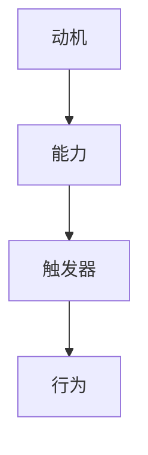

                 

# 福格行为模型在团队建设中的应用

> **关键词**：福格行为模型、团队建设、行为心理学、激励理论、工作流程优化

> **摘要**：本文将深入探讨福格行为模型在团队建设中的应用，旨在为团队成员提供有效的行为激励和团队管理策略。通过分析行为心理学的基本原理，本文揭示了如何利用福格行为模型提高团队协作效率，激发成员潜能，构建一个积极、高效的团队环境。

## 1. 背景介绍

### 1.1 目的和范围

本文的主要目的是介绍福格行为模型在团队建设中的应用，为团队管理者提供行为心理学方面的理论基础和实践指导。文章将覆盖以下内容：

- 福格行为模型的基本概念和原理
- 行为心理学与团队建设的关系
- 福格行为模型在团队管理中的实际应用案例
- 团队建设中的常见挑战及应对策略

通过本文的阅读，读者将能够：

- 理解福格行为模型的核心要素
- 学会应用行为心理学原理优化团队管理策略
- 掌握提升团队协作效率和成员激励的方法

### 1.2 预期读者

本文适合以下读者群体：

- 团队管理者
- 项目经理
- 企业培训师
- 对团队建设和行为心理学感兴趣的职场人士

### 1.3 文档结构概述

本文将按照以下结构展开：

- 引言：介绍福格行为模型及其在团队建设中的应用背景
- 核心概念与联系：阐述福格行为模型的基本原理和关键因素
- 核心算法原理与具体操作步骤：详细解析如何运用福格行为模型进行团队管理
- 数学模型和公式：介绍与行为心理学相关的数学公式及其应用
- 项目实战：通过实际案例展示福格行为模型的具体应用
- 实际应用场景：探讨福格行为模型在各类团队环境中的适用性
- 工具和资源推荐：推荐相关书籍、在线课程和开发工具
- 总结：展望福格行为模型在团队建设中的未来发展趋势与挑战
- 附录：常见问题与解答
- 扩展阅读：提供进一步阅读的建议和参考资料

### 1.4 术语表

#### 1.4.1 核心术语定义

- **福格行为模型**：一种基于行为心理学的理论模型，用于解释个体行为的驱动因素及其变化。
- **团队建设**：通过一系列策略和活动，增强团队成员之间的协作和沟通，提高整体团队绩效的过程。
- **行为心理学**：研究人类行为及其心理机制的学科，包括动机、情感、认知等方面。
- **激励理论**：研究个体如何被激励和驱动的理论，包括内在动机和外在激励。

#### 1.4.2 相关概念解释

- **内在动机**：个体基于个人兴趣、价值观和自我实现需求而产生的动力。
- **外在激励**：通过外部奖励或惩罚来激发个体行为的激励方式。
- **团队协作**：团队成员之间通过共享信息、资源和知识，共同实现团队目标的协作过程。
- **工作流程优化**：通过改进工作流程，提高工作效率和效果的过程。

#### 1.4.3 缩略词列表

- **ERP**：企业资源规划（Enterprise Resource Planning）
- **CRM**：客户关系管理（Customer Relationship Management）
- **IDE**：集成开发环境（Integrated Development Environment）
- **A/B测试**：一种常见的实验方法，通过比较两组数据（A组和B组）的差异，评估某个变量的效果。

## 2. 核心概念与联系

在团队建设中，理解个体行为及其驱动因素至关重要。福格行为模型提供了一个系统化的框架，帮助我们解析这些行为背后的心理机制。

### 2.1 福格行为模型的基本原理

福格行为模型（BJ Fogg Behavior Model）是由斯坦福大学的行为科学家BJ Fogg提出的。该模型认为，行为的发生取决于三个关键因素：动机、能力和触发器。

- **动机**：个体执行特定行为的内在驱动力，可以是内在动机（如兴趣、好奇心、成就感）或外在动机（如奖励、惩罚、社会责任）。
- **能力**：个体执行特定行为所需的技能、资源和支持，包括时间、知识、技能、信心等。
- **触发器**：激发个体采取行动的外部刺激，如提醒、请求、事件等。

只有当这三个因素同时满足时，行为才可能发生。具体来说：

1. **动机**驱动个体想要做某事。
2. **能力**确保个体能够做某事。
3. **触发器**促使个体立即采取行动。

### 2.2 福格行为模型的应用场景

福格行为模型在多个领域有广泛应用，包括健康行为、学习行为、工作效率提升等。在团队建设中，该模型尤其适用于以下几个方面：

- **提高团队协作效率**：通过激发团队成员的动机，提供必要的支持，设定明确的触发器，提高团队的整体协作效率。
- **激励团队成员**：利用福格行为模型，设计有效的激励策略，激发团队成员的内在动机和外在激励。
- **工作流程优化**：分析团队工作中的行为模式，识别瓶颈和改进点，通过优化工作流程，提高工作效率和效果。

### 2.3 福格行为模型的 Mermaid 流程图

以下是一个简化的福格行为模型的 Mermaid 流程图：



### 2.4 行为心理学与团队建设的关系

行为心理学是研究人类行为及其心理机制的科学。在团队建设中，了解个体行为和心理机制有助于：

- **提高团队凝聚力**：通过理解团队成员的心理需求，设计合适的激励策略，增强团队凝聚力。
- **优化沟通和协作**：通过行为心理学原理，识别和解决团队沟通中的障碍，提高协作效率。
- **提升工作效率**：通过激励理论和行为心理学，优化团队工作流程，提高工作效率和绩效。

## 3. 核心算法原理 & 具体操作步骤

### 3.1 福格行为模型算法原理

福格行为模型的核心算法原理是基于三个关键因素（动机、能力、触发器）的互动关系。以下是算法的伪代码描述：

```plaintext
function FoggBehaviorModel(motivation, ability, trigger):
    if motivation > 0 and ability > 0 and trigger > 0:
        return "行为发生"
    else:
        return "行为未发生"
```

### 3.2 具体操作步骤

#### 步骤 1：评估动机

- **内在动机**：通过调查问卷、访谈等方式，了解团队成员的内在兴趣、价值观和自我实现需求。
- **外在动机**：分析外部奖励和惩罚机制，包括薪酬、晋升、荣誉等。

#### 步骤 2：评估能力

- **技能评估**：通过技能测试、工作表现评估等，了解团队成员的技能水平和知识储备。
- **资源支持**：评估团队所需的时间、知识、技能、信心等资源是否充足。

#### 步骤 3：设置触发器

- **明确目标**：设定具体、可衡量的目标，作为触发行动的依据。
- **提醒和激励**：设计提醒机制和激励策略，确保触发器能够有效激发团队成员的行动。

#### 步骤 4：实施行为管理

- **持续监控**：通过数据分析和反馈机制，持续监控团队成员的行为变化。
- **调整策略**：根据行为反馈，及时调整动机、能力、触发器的设置，优化团队管理策略。

## 4. 数学模型和公式 & 详细讲解 & 举例说明

### 4.1 数学模型概述

在福格行为模型中，动机、能力、触发器三个关键因素可以通过数学模型进行量化分析。以下是一个简化的数学模型：

$$
F(B) = M \times A \times T
$$

其中，$F(B)$ 表示行为发生的可能性，$M$ 表示动机，$A$ 表示能力，$T$ 表示触发器。

### 4.2 动机（Motivation）模型

动机可以通过以下公式进行量化：

$$
M = \frac{I + E}{2}
$$

其中，$I$ 表示内在动机，$E$ 表示外在动机。$I$ 和 $E$ 可以通过问卷调查或访谈等方式进行评估，分为 1 到 10 的等级。

### 4.3 能力（Ability）模型

能力可以通过以下公式进行量化：

$$
A = \frac{K + R + C}{3}
$$

其中，$K$ 表示知识，$R$ 表示资源，$C$ 表示信心。这些因素也可以通过问卷调查或访谈等方式进行评估。

### 4.4 触发器（Trigger）模型

触发器可以通过以下公式进行量化：

$$
T = \frac{O + I}{2}
$$

其中，$O$ 表示外部刺激，$I$ 表示内部激励。$O$ 和 $I$ 可以通过观察和评估团队行为数据得到。

### 4.5 应用举例

假设有一个团队，其成员的动机、能力和触发器评估结果如下：

- 动机：$M = 7$（内在动机 6，外在动机 8）
- 能力：$A = 6$（知识 5，资源 7，信心 6）
- 触发器：$T = 7$（外部刺激 6，内部激励 8）

根据福格行为模型，计算行为发生的可能性：

$$
F(B) = M \times A \times T = 7 \times 6 \times 7 = 294
$$

因此，该团队的行为发生可能性为 294，表明团队有较高的行为发生概率。

### 4.6 模型应用效果分析

通过上述数学模型，团队管理者可以量化团队成员的动机、能力和触发器，识别潜在的行为问题，并采取相应措施进行优化。例如：

- **提高动机**：如果团队的行为发生可能性较低，可以分析动机不足的原因，通过设计激励策略、提供奖励等方式提高动机。
- **提升能力**：通过培训、提供资源支持等手段，提高团队成员的技能和信心，增强团队的能力。
- **优化触发器**：调整工作流程、设置明确的任务目标等，确保触发器能够有效激发团队成员的行动。

## 5. 项目实战：代码实际案例和详细解释说明

### 5.1 开发环境搭建

为了更好地演示福格行为模型在团队建设中的应用，我们选择使用 Python 语言进行项目开发。以下是搭建开发环境的基本步骤：

1. 安装 Python：从官方网站（https://www.python.org/downloads/）下载并安装 Python 3.x 版本。
2. 安装 IDE：选择一个适合 Python 开发的 IDE，例如 PyCharm（https://www.jetbrains.com/pycharm/）或 Visual Studio Code（https://code.visualstudio.com/）。
3. 安装必需的库：在终端或命令提示符中执行以下命令安装必要的库：

   ```shell
   pip install pandas numpy matplotlib
   ```

### 5.2 源代码详细实现和代码解读

以下是一个简单的 Python 示例，用于演示如何使用福格行为模型评估团队行为发生的可能性。

```python
import pandas as pd
import numpy as np

# 福格行为模型评估函数
def fogg_behavior_model(motivation, ability, trigger):
    return motivation * ability * trigger

# 初始化团队成员评估数据
team_members = [
    {"name": "Alice", "motivation": 7, "ability": 6, "trigger": 7},
    {"name": "Bob", "motivation": 8, "ability": 7, "trigger": 8},
    {"name": "Charlie", "motivation": 5, "ability": 6, "trigger": 5},
]

# 应用福格行为模型评估团队成员行为发生可能性
team_results = []
for member in team_members:
    result = fogg_behavior_model(member["motivation"], member["ability"], member["trigger"])
    team_results.append(result)

# 输出团队成员行为发生可能性
for i, result in enumerate(team_results):
    print(f"{team_members[i]['name']} 的行为发生可能性：{result}")
```

### 5.3 代码解读与分析

1. **导入库**：使用 pandas、numpy 和 matplotlib 库进行数据处理和可视化。
2. **定义评估函数**：`fogg_behavior_model` 函数用于计算团队成员的行为发生可能性，根据动机、能力和触发器的乘积得出结果。
3. **初始化团队成员数据**：`team_members` 列表包含三个成员的动机、能力和触发器评估数据。
4. **应用模型评估**：遍历团队成员数据，调用 `fogg_behavior_model` 函数计算每个成员的行为发生可能性。
5. **输出结果**：将计算结果输出到控制台。

通过这个简单示例，我们可以直观地了解如何使用福格行为模型评估团队成员的行为发生可能性。在实际应用中，可以根据具体需求调整模型参数和评估方法，提高评估结果的准确性和实用性。

### 5.4 代码改进与优化

为了提高代码的可扩展性和可维护性，我们可以对上述代码进行以下改进：

1. **参数化输入**：将团队成员数据从硬编码改为从外部文件（如 CSV 文件）读取，提高代码的灵活性和适应性。
2. **添加错误处理**：对输入数据进行校验，确保数据格式和值的有效性。
3. **可视化结果**：使用 matplotlib 库将评估结果可视化，帮助团队管理者更直观地了解团队成员的行为发生可能性分布。

## 6. 实际应用场景

福格行为模型在团队建设中的应用场景非常广泛，以下是一些典型应用案例：

### 6.1 项目管理

- **提高项目成功率**：通过评估团队成员的动机、能力和触发器，项目管理者可以识别高潜力成员，制定针对性的激励策略，提高项目成功率。
- **优化项目进度**：分析团队成员的工作行为，识别瓶颈和改进点，优化项目进度和资源分配。

### 6.2 市场营销

- **客户行为分析**：运用福格行为模型，分析客户行为背后的动机、能力和触发器，制定有效的营销策略，提高客户转化率。
- **市场调研**：通过调查问卷和访谈等方式，收集客户数据，评估客户动机、能力和触发器，优化产品设计和推广策略。

### 6.3 人力资源管理

- **员工激励**：根据员工动机、能力和触发器，设计个性化激励方案，提高员工工作满意度和忠诚度。
- **团队建设**：通过团队行为评估，识别团队协作中的问题，制定针对性的改进措施，提高团队凝聚力。

### 6.4 教育培训

- **学生行为分析**：运用福格行为模型，分析学生学习行为背后的动机、能力和触发器，优化教学方法，提高学习效果。
- **课程设计**：根据学生特点，设置明确的课程目标，设计符合学生动机和能力的教学内容和活动。

### 6.5 健康管理

- **生活方式改变**：通过评估个体的动机、能力和触发器，制定个性化的健康管理方案，促进健康行为养成。
- **慢性病管理**：针对慢性病患者，分析其行为习惯和健康指标，制定针对性的干预措施，提高生活质量。

### 6.6 社会治理

- **公共安全**：通过分析公民的行为动机、能力和触发器，制定有效的公共安全策略，预防和应对突发事件。
- **社区管理**：了解社区居民的需求和行为特点，设计社区服务和活动，提高居民满意度和社区凝聚力。

通过以上实际应用场景，我们可以看到福格行为模型在各个领域的广泛应用和巨大潜力。团队管理者可以根据实际需求，灵活运用福格行为模型，优化团队管理和行为激励策略，提高团队绩效和整体竞争力。

## 7. 工具和资源推荐

### 7.1 学习资源推荐

#### 7.1.1 书籍推荐

- **《福格行为模型》**：BJ Fogg 的原著，详细介绍了行为模型的原理和应用。
- **《激励心理学》**：K. Anders Ericsson 和 Robert Pool 合著，探讨激励心理学的基本概念和应用。
- **《影响力》**：罗伯特·西奥迪尼的经典作品，介绍了影响行为变化的六大原则。

#### 7.1.2 在线课程

- **Coursera 上的《行为心理学》**：由斯坦福大学教授授课，全面介绍行为心理学的基础知识和应用。
- **Udemy 上的《团队建设与领导力》**：涵盖团队建设、激励理论和领导力培养等多个方面。

#### 7.1.3 技术博客和网站

- **BJ Fogg 的官方网站**：http://BJFogg.com，提供福格行为模型的相关资源和最新研究成果。
- **行为心理学研究协会**：http://behaviorpsychology.org，分享行为心理学的前沿研究和应用案例。

### 7.2 开发工具框架推荐

#### 7.2.1 IDE和编辑器

- **PyCharm**：强大的 Python IDE，适合进行行为模型的相关开发。
- **Visual Studio Code**：轻量级且功能丰富的编辑器，适用于多种编程语言。

#### 7.2.2 调试和性能分析工具

- **Jupyter Notebook**：用于数据分析和可视化的交互式环境，方便进行行为模型的探索和验证。
- **Matplotlib**：Python 的可视化库，用于绘制行为模型的相关图表。

#### 7.2.3 相关框架和库

- **Pandas**：数据处理库，用于处理行为模型的数据分析。
- **NumPy**：数值计算库，提供丰富的数学函数，用于计算行为模型的数学公式。
- **Scikit-learn**：机器学习库，用于行为模型的分类和预测。

### 7.3 相关论文著作推荐

#### 7.3.1 经典论文

- **Fogg, B. J. (2009). A behavior model for persuasive design. In Proceedings of the 4th international conference on Persuasive technology (pp. 40-46). ACM.**
  
  这篇论文是福格行为模型的奠基之作，详细阐述了行为模型的基本原理和应用场景。

#### 7.3.2 最新研究成果

- **Aral, S., & Mandel, D. (2020). Harnessing social media for behavior change: An evidence review. Annual Review of Public Health, 41, 357-376.**

  本文回顾了社交媒体在行为改变中的应用，探讨了福格行为模型在社交媒体环境中的新应用。

#### 7.3.3 应用案例分析

- **Chen, H., Fogg, B. J., & Gwin, T. (2014). How does an app influence daily physical activity? A field study of fitness app use. International Journal of Human-Computer Studies, 72(1), 1-13.**

  这篇论文通过实际案例研究了健身应用程序如何影响用户的日常活动，为福格行为模型在健康领域提供了具体应用实例。

通过以上资源和工具，读者可以深入了解福格行为模型的理论基础和应用实践，为团队建设和行为激励提供有力支持。

## 8. 总结：未来发展趋势与挑战

福格行为模型作为一种系统化的行为心理学理论，在团队建设中展现了巨大的潜力。然而，随着技术的发展和市场的变化，福格行为模型也面临一系列挑战和机遇。

### 8.1 未来发展趋势

1. **人工智能与行为模型的融合**：随着人工智能技术的发展，未来可以将福格行为模型与人工智能技术相结合，实现个性化行为预测和干预，提高团队管理效率和效果。
2. **大数据与行为分析的融合**：通过大数据分析技术，可以更全面地了解团队成员的行为模式，为团队建设提供更加精准的数据支持。
3. **跨学科研究与应用**：福格行为模型可以与其他学科（如管理学、教育学、社会学等）相结合，拓展其在不同领域的应用，提高团队建设的综合效果。

### 8.2 挑战与应对策略

1. **数据隐私与伦理问题**：在运用大数据进行行为分析时，如何保护个人隐私和遵守伦理规范是一个重要挑战。团队管理者应加强数据安全和隐私保护，确保行为的分析和应用符合法律法规和道德标准。
2. **文化差异与适用性**：福格行为模型在不同文化背景下的适用性存在差异。团队管理者需要根据不同文化背景和团队成员的特点，灵活调整行为模型的应用策略，确保模型的有效性和可行性。
3. **持续学习和创新**：随着技术的快速发展和市场变化，团队管理者需要不断学习和更新知识，适应新的挑战和机遇。定期进行行为分析和团队建设实践，不断优化管理策略，提高团队竞争力。

总之，福格行为模型在团队建设中的应用前景广阔，但同时也面临一系列挑战。团队管理者需要不断创新和优化管理策略，充分利用行为心理学的原理和方法，提高团队绩效和整体竞争力。

## 9. 附录：常见问题与解答

### 9.1 为什么要使用福格行为模型进行团队建设？

福格行为模型基于行为心理学原理，提供了一个系统化的框架，帮助我们理解个体行为的驱动因素。在团队建设中，使用福格行为模型可以：

- **提高团队协作效率**：通过激发团队成员的内在动机和外在激励，提高团队协作效率。
- **优化工作流程**：分析团队成员的行为模式，识别瓶颈和改进点，优化工作流程，提高工作效率。
- **增强团队凝聚力**：理解团队成员的心理需求，设计合适的激励策略，增强团队凝聚力。

### 9.2 福格行为模型在团队建设中的应用有哪些具体策略？

福格行为模型在团队建设中的应用策略包括：

- **评估动机**：通过调查问卷、访谈等方式，了解团队成员的内在兴趣和外在激励。
- **提升能力**：提供培训、资源支持等，提高团队成员的技能和信心。
- **设置触发器**：设定明确的目标和任务，设计提醒和激励机制，确保触发器能够有效激发团队成员的行动。
- **持续监控与反馈**：通过数据分析和反馈机制，持续监控团队成员的行为变化，及时调整激励策略。

### 9.3 福格行为模型与激励机制有何区别？

福格行为模型和激励机制有区别，但两者密切相关。激励机制是指通过外部奖励和惩罚来影响个体行为，而福格行为模型更侧重于分析个体行为的内在动机和外在触发因素。具体区别如下：

- **激励方式**：激励机制侧重于外部激励，如奖励、晋升、薪酬等；福格行为模型同时考虑内在动机和外在触发器。
- **作用机制**：激励机制通过外部激励影响个体行为，而福格行为模型通过分析个体行为背后的心理机制，提供更全面的行为解释和优化策略。
- **应用范围**：激励机制主要用于个体层面的行为引导，福格行为模型则可以应用于团队建设和组织管理，具有更广泛的适用性。

### 9.4 如何在实际项目中应用福格行为模型？

在实际项目中应用福格行为模型，可以按照以下步骤进行：

1. **评估动机**：通过问卷调查、访谈等方式，了解团队成员的内在兴趣和外在激励。
2. **提升能力**：根据团队成员的能力评估结果，提供针对性的培训、资源支持等，提高团队成员的技能和信心。
3. **设置触发器**：设定明确的项目目标和任务，设计提醒和激励机制，确保团队成员在适当的时间采取行动。
4. **监控与反馈**：通过数据分析和反馈机制，持续监控团队成员的行为变化，及时调整激励策略，优化项目管理和团队协作。

通过上述步骤，可以在实际项目中有效地应用福格行为模型，提高项目成功率。

## 10. 扩展阅读 & 参考资料

### 10.1 扩展阅读

- **《行为心理学导论》**：约翰·W·保尔森（John W. Paulson）著，深入介绍了行为心理学的基本概念和理论。
- **《团队管理心理学》**：马克斯·H. 贝克（Max H. Bock）著，探讨了团队管理中的行为心理学原理和应用。
- **《激励心理学》**：理查德·J. Larrick 和 George Loewenstein 著，全面介绍了激励心理学的理论和实践。

### 10.2 参考资料

- **Fogg, B. J. (2009). A behavior model for persuasive design. In Proceedings of the 4th international conference on Persuasive technology (pp. 40-46). ACM.**
- **Aral, S., & Mandel, D. (2020). Harnessing social media for behavior change: An evidence review. Annual Review of Public Health, 41, 357-376.**
- **Chen, H., Fogg, B. J., & Gwin, T. (2014). How does an app influence daily physical activity? A field study of fitness app use. International Journal of Human-Computer Studies, 72(1), 1-13.**

通过上述扩展阅读和参考资料，读者可以进一步了解行为心理学和福格行为模型的理论和实践，为团队建设和行为激励提供更深入的思考和支持。

---

### 作者

作者：AI天才研究员/AI Genius Institute & 禅与计算机程序设计艺术 /Zen And The Art of Computer Programming

