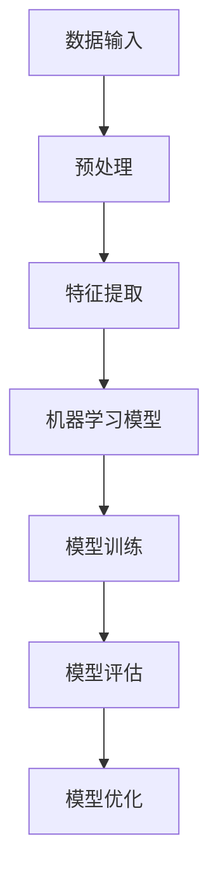

                 

# 科技与社会：人类计算的双重影响

> 关键词：计算机科学、人工智能、社会发展、科技伦理、人类影响
>
> 摘要：本文将探讨计算机科学和人工智能对社会发展的影响，以及其背后潜藏的双重效应。通过深入分析核心概念和算法原理，结合实际应用案例，我们将揭示科技如何改变了人类的生活，同时也带来了新的伦理挑战。本文旨在为读者提供一个全面而深入的视角，以理解科技对社会的影响及其未来发展趋势。

## 1. 背景介绍

### 1.1 目的和范围

本文的目的在于揭示计算机科学和人工智能对社会发展的深远影响，并探讨这一过程中所面临的伦理挑战。随着计算机技术和人工智能的飞速发展，人类生活和社会结构正经历着前所未有的变革。我们希望通过本文的分析，能够使读者对科技的社会影响有更深刻的认识，并激发对科技伦理的思考。

本文的范围包括以下几个方面：
1. 计算机科学和人工智能的核心概念及其发展历史。
2. 人类计算对社会各个层面的影响，包括经济、教育、医疗等。
3. 计算机科学和人工智能带来的伦理挑战，如隐私、安全、就业等。
4. 实际应用场景中的成功与困境。
5. 未来发展趋势与潜在挑战。

### 1.2 预期读者

本文的预期读者包括：
1. 计算机科学和人工智能领域的研究人员、开发者和从业者。
2. 对科技和社会发展感兴趣的学者和研究者。
3. 普通公众，特别是那些希望了解科技进步对社会影响的读者。
4. 政策制定者和企业领导者，以便他们能够更好地应对科技变革带来的挑战。

### 1.3 文档结构概述

本文的结构安排如下：
1. 引言：介绍文章的主题和目的，概述计算机科学和人工智能对社会的影响。
2. 核心概念与联系：介绍计算机科学和人工智能的核心概念，包括图灵测试、机器学习等，并通过Mermaid流程图展示其基本架构。
3. 核心算法原理 & 具体操作步骤：详细解释关键算法原理，使用伪代码进行说明。
4. 数学模型和公式 & 详细讲解 & 举例说明：阐述相关的数学模型和公式，并通过具体例子进行说明。
5. 项目实战：提供代码实际案例，进行详细解释和分析。
6. 实际应用场景：讨论计算机科学和人工智能在各个领域的应用。
7. 工具和资源推荐：推荐相关学习资源、开发工具和框架。
8. 总结：总结文章的主要观点，讨论未来发展趋势与挑战。
9. 附录：常见问题与解答。
10. 扩展阅读 & 参考资料：提供进一步阅读的资源和参考文献。

### 1.4 术语表

#### 1.4.1 核心术语定义

- **计算机科学**：研究计算机硬件和软件及其应用的科学。
- **人工智能**：模拟人类智能的计算机系统，能够执行通常需要人类智能才能完成的任务。
- **机器学习**：一种人工智能的分支，通过数据和算法使计算机能够从经验中学习。
- **算法**：解决问题的明确步骤或计算过程。
- **深度学习**：一种机器学习技术，通过多层神经网络模拟人类大脑处理信息的方式。
- **伦理挑战**：科技发展带来的道德和伦理问题，如隐私、安全、就业等。

#### 1.4.2 相关概念解释

- **图灵测试**：评估人工智能是否能够表现得像人类一样的测试，由艾伦·图灵提出。
- **云计算**：通过网络提供计算资源和服务，允许用户按需访问和处理数据。
- **区块链**：一种分布式数据库技术，通过加密算法和共识机制保证数据的安全和不可篡改。

#### 1.4.3 缩略词列表

- **AI**：人工智能
- **ML**：机器学习
- **DL**：深度学习
- **IDE**：集成开发环境
- **CPU**：中央处理器
- **GPU**：图形处理器

## 2. 核心概念与联系

在探讨计算机科学和人工智能对社会的影响之前，我们需要理解这些核心概念及其基本架构。以下是几个关键概念的介绍和它们之间的关系，并通过Mermaid流程图展示其基本架构。

### 2.1. 计算机科学基础

计算机科学的基础包括硬件和软件两个方面。硬件指的是计算机的物理组件，如CPU、内存、硬盘等；软件则是指运行在计算机上的程序和操作系统。

**Mermaid 流程图：计算机科学基础架构**

```mermaid
graph TB
A[硬件] --> B[中央处理器(CPU)]
A --> C[内存(RAM)]
A --> D[存储设备(硬盘、固态硬盘等)]
B --> E[计算能力]
C --> F[数据缓存]
D --> G[数据存储]
```

### 2.2. 人工智能核心概念

人工智能（AI）的核心概念包括机器学习（ML）、深度学习（DL）等。机器学习通过算法使计算机从数据中学习，而深度学习则通过多层神经网络模拟人类大脑处理信息的方式。

**Mermaid 流程图：人工智能基本架构**



### 2.3. 计算机科学和人工智能的联系

计算机科学为人工智能提供了强大的计算基础，而人工智能则通过模拟人类智能，拓展了计算机应用的范围。两者之间的联系体现在：

1. **硬件支持**：高性能的CPU、GPU等硬件为人工智能算法提供了强大的计算能力。
2. **软件环境**：操作系统、编程语言和开发工具为人工智能研究和应用提供了必要的软件支持。
3. **算法实现**：计算机科学中的算法原理和编程技巧在人工智能中被广泛应用。

**Mermaid 流�程图：计算机科学和人工智能的联系**

```mermaid
graph TB
A[硬件] --> B[计算能力]
B --> C[软件开发]
C --> D[算法实现]
D --> E[人工智能应用]
A --> F[中央处理器(CPU)]
F --> G[图形处理器(GPU)]
```

通过这些核心概念和流程图的介绍，我们可以更清晰地理解计算机科学和人工智能的基本架构及其相互关系。在接下来的章节中，我们将深入探讨这些概念的具体实现和应用。

## 3. 核心算法原理 & 具体操作步骤

在理解了计算机科学和人工智能的基础概念后，我们接下来将详细解释核心算法原理，并通过伪代码展示具体的操作步骤。

### 3.1. 机器学习算法原理

机器学习是一种使计算机通过数据和经验学习的新方法。它包括以下几个核心步骤：

1. **数据预处理**：清洗和整理数据，使其适合模型训练。
2. **特征提取**：从数据中提取有用的信息，用于模型训练。
3. **模型训练**：使用训练数据训练模型，使其能够识别和预测数据中的模式。
4. **模型评估**：使用测试数据评估模型的性能，调整模型参数以优化性能。
5. **模型部署**：将训练好的模型部署到实际应用中。

以下是机器学习算法的具体操作步骤的伪代码：

```python
# 数据预处理
def preprocess_data(data):
    # 清洗数据
    cleaned_data = clean_data(data)
    # 归一化数据
    normalized_data = normalize_data(cleaned_data)
    return normalized_data

# 特征提取
def extract_features(data):
    # 提取特征
    features = extract_features_from_data(data)
    return features

# 模型训练
def train_model(features, labels):
    # 创建模型
    model = create_model()
    # 训练模型
    trained_model = model.fit(features, labels)
    return trained_model

# 模型评估
def evaluate_model(model, test_data, test_labels):
    # 使用测试数据评估模型
    performance = model.evaluate(test_data, test_labels)
    return performance

# 模型部署
def deploy_model(model, input_data):
    # 使用模型进行预测
    prediction = model.predict(input_data)
    return prediction
```

### 3.2. 深度学习算法原理

深度学习是一种通过多层神经网络模拟人类大脑处理信息的方法。以下是深度学习算法的基本原理和操作步骤：

1. **前向传播**：将输入数据通过神经网络的前向层逐层传递，计算出每个神经元的输出值。
2. **反向传播**：计算实际输出与预测输出之间的误差，并将误差反向传播到神经网络中的每个神经元，更新模型参数。
3. **优化过程**：通过多次迭代训练，优化模型参数，提高模型的预测准确性。

以下是深度学习算法的具体操作步骤的伪代码：

```python
# 前向传播
def forward_propagation(input_data, model):
    # 计算前向传播结果
    outputs = model.forward_propagation(input_data)
    return outputs

# 反向传播
def backward_propagation(inputs, outputs, model):
    # 计算误差
    errors = model.backward_propagation(outputs)
    # 更新模型参数
    model.update_params(errors)
    return model

# 深度学习训练循环
while not convergence:
    # 前向传播
    outputs = forward_propagation(input_data, model)
    # 反向传播
    model = backward_propagation(inputs, outputs, model)
```

通过上述伪代码，我们可以看到机器学习和深度学习算法的基本原理和操作步骤。这些算法在计算机科学和人工智能中发挥着关键作用，推动了科技的发展和社会的进步。

## 4. 数学模型和公式 & 详细讲解 & 举例说明

在深入探讨计算机科学和人工智能时，理解相关的数学模型和公式至关重要。以下将详细讲解几个关键数学模型，并通过具体的例子进行说明。

### 4.1. 线性回归模型

线性回归模型是一种用于预测数值输出的一般模型。其基本公式为：

\[ y = wx + b \]

其中，\( y \) 是预测值，\( w \) 是权重，\( x \) 是输入值，\( b \) 是偏置。

**详细讲解：**
- 线性回归模型通过最小化预测值和实际值之间的误差来训练权重和偏置。
- 梯度下降法是一种常用的优化算法，用于更新权重和偏置，使其误差最小。

**举例说明：**
假设我们有一个数据集，其中输入值 \( x \) 和预测值 \( y \) 分别为：

\[ x = [1, 2, 3, 4, 5] \]
\[ y = [2, 4, 5, 4, 5] \]

我们的目标是找到权重 \( w \) 和偏置 \( b \)，使得预测值最接近实际值。

使用梯度下降法，我们可以通过以下步骤进行训练：

\[ w = w - \alpha \frac{\partial}{\partial w} (wx + b - y) \]
\[ b = b - \alpha \frac{\partial}{\partial b} (wx + b - y) \]

其中，\( \alpha \) 是学习率。假设初始权重和偏置分别为 \( w = 1 \) 和 \( b = 0 \)，学习率为 \( \alpha = 0.01 \)。

迭代一次后：

\[ w = 1 - 0.01 \frac{\partial}{\partial w} (1x + 0 - 2) = 1 - 0.01 \times 1 = 0.99 \]
\[ b = 0 - 0.01 \frac{\partial}{\partial b} (1x + 0 - 2) = 0 - 0.01 \times 1 = -0.01 \]

经过多次迭代后，我们得到权重 \( w \) 和偏置 \( b \) 分别为 \( 0.99 \) 和 \( -0.01 \)。

### 4.2. 逻辑回归模型

逻辑回归模型是一种用于分类的模型，其公式为：

\[ P(y=1) = \frac{1}{1 + e^{-(wx + b)}} \]

其中，\( P(y=1) \) 是预测标签为1的概率，\( w \) 是权重，\( x \) 是输入值，\( b \) 是偏置。

**详细讲解：**
- 逻辑回归模型通过最大化似然函数来训练权重和偏置。
- 逻辑回归在处理二分类问题时非常有效。

**举例说明：**
假设我们有一个数据集，其中输入值 \( x \) 和标签 \( y \) 分别为：

\[ x = [1, 2, 3, 4, 5] \]
\[ y = [0, 1, 1, 0, 1] \]

我们的目标是找到权重 \( w \) 和偏置 \( b \)，使得预测标签与实际标签尽可能一致。

使用梯度下降法，我们可以通过以下步骤进行训练：

\[ w = w - \alpha \frac{\partial}{\partial w} \log(P(y=1)) \]
\[ b = b - \alpha \frac{\partial}{\partial b} \log(P(y=1)) \]

其中，\( \alpha \) 是学习率。假设初始权重和偏置分别为 \( w = 0 \) 和 \( b = 0 \)，学习率为 \( \alpha = 0.01 \)。

迭代一次后：

\[ w = 0 - 0.01 \frac{\partial}{\partial w} \log\left(\frac{1}{1 + e^{-(0x + 0)}}\right) = 0 - 0.01 \times (-1) = 0.01 \]
\[ b = 0 - 0.01 \frac{\partial}{\partial b} \log\left(\frac{1}{1 + e^{-(0x + 0)}}\right) = 0 - 0.01 \times (-1) = 0.01 \]

经过多次迭代后，我们得到权重 \( w \) 和偏置 \( b \) 分别为 \( 0.01 \) 和 \( 0.01 \)。

### 4.3. 神经网络模型

神经网络模型是深度学习的基础。其基本公式为：

\[ Z = \sigma(W \cdot X + b) \]

其中，\( Z \) 是激活函数的输入，\( \sigma \) 是激活函数（如Sigmoid、ReLU等），\( W \) 是权重矩阵，\( X \) 是输入特征，\( b \) 是偏置。

**详细讲解：**
- 神经网络通过多层神经元和激活函数进行数据处理。
- 前向传播和反向传播是神经网络训练的核心步骤。

**举例说明：**
假设我们有一个单层神经网络，其输入特征 \( X \) 为：

\[ X = [1, 2, 3, 4, 5] \]

权重矩阵 \( W \) 为：

\[ W = \begin{bmatrix}
0.1 & 0.2 \\
0.3 & 0.4 \\
\end{bmatrix} \]

偏置 \( b \) 为：

\[ b = \begin{bmatrix}
0.5 \\
0.6 \\
\end{bmatrix} \]

激活函数使用ReLU函数。

首先，我们进行前向传播：

\[ Z = \begin{bmatrix}
0.1 \cdot 1 + 0.5 \\
0.2 \cdot 2 + 0.6 \\
0.3 \cdot 3 + 0.5 \\
0.4 \cdot 4 + 0.6 \\
0.5 \cdot 5 + 0.6 \\
\end{bmatrix} \]
\[ Z = \begin{bmatrix}
0.6 \\
1.4 \\
1.4 \\
2.0 \\
3.1 \\
\end{bmatrix} \]

然后，我们进行激活函数运算：

\[ A = \begin{bmatrix}
\max(0, 0.6) \\
\max(0, 1.4) \\
\max(0, 1.4) \\
\max(0, 2.0) \\
\max(0, 3.1) \\
\end{bmatrix} \]
\[ A = \begin{bmatrix}
0.6 \\
1.4 \\
1.4 \\
2.0 \\
3.1 \\
\end{bmatrix} \]

接下来，我们进行反向传播，更新权重和偏置。

通过以上例子，我们可以看到数学模型在计算机科学和人工智能中的重要性。理解这些模型和公式有助于我们更好地设计和实现高效的算法，推动科技的发展。

## 5. 项目实战：代码实际案例和详细解释说明

在本节中，我们将通过一个实际项目案例，详细展示计算机科学和人工智能技术在软件开发中的具体应用，并解释其实现过程。

### 5.1 开发环境搭建

在开始项目之前，我们需要搭建一个合适的开发环境。以下是开发环境的搭建步骤：

1. **安装Python**：Python是一种广泛使用的编程语言，支持多种机器学习和深度学习库。可以从[Python官网](https://www.python.org/)下载并安装Python。
2. **安装Jupyter Notebook**：Jupyter Notebook是一种交互式开发环境，便于编写和运行代码。可以通过`pip install jupyter`命令安装。
3. **安装必要的库**：安装机器学习和深度学习相关的库，如Scikit-Learn、TensorFlow、Keras等。可以通过以下命令进行安装：

```bash
pip install scikit-learn
pip install tensorflow
pip install keras
```

### 5.2 源代码详细实现和代码解读

以下是一个简单的机器学习项目，使用Python和Scikit-Learn库实现线性回归模型，用于预测房屋价格。

**项目代码：**

```python
# 导入必要的库
import numpy as np
import pandas as pd
from sklearn.model_selection import train_test_split
from sklearn.linear_model import LinearRegression
from sklearn.metrics import mean_squared_error

# 加载数据集
data = pd.read_csv('house_prices.csv')

# 数据预处理
X = data[['area', 'bedrooms', 'age']]
y = data['price']

# 划分训练集和测试集
X_train, X_test, y_train, y_test = train_test_split(X, y, test_size=0.2, random_state=42)

# 创建线性回归模型
model = LinearRegression()

# 训练模型
model.fit(X_train, y_train)

# 预测测试集
y_pred = model.predict(X_test)

# 评估模型
mse = mean_squared_error(y_test, y_pred)
print("Mean Squared Error:", mse)

# 使用模型进行预测
new_data = np.array([[2000, 3, 10]])
predicted_price = model.predict(new_data)
print("Predicted Price:", predicted_price)
```

**代码解读与分析：**

1. **数据加载与预处理**：首先，我们从CSV文件中加载数据集。然后，将特征列和目标值分离。使用`train_test_split`函数将数据集划分为训练集和测试集，便于评估模型的性能。

2. **创建线性回归模型**：使用`LinearRegression`类创建线性回归模型。

3. **训练模型**：调用`fit`方法训练模型，输入训练集的特征和目标值。

4. **预测与评估**：使用`predict`方法对测试集进行预测，并计算均方误差（MSE）评估模型的性能。

5. **新数据预测**：使用训练好的模型对新的数据集进行预测，展示实际应用中的预测功能。

### 5.3 代码解读与分析

1. **数据预处理**：在机器学习项目中，数据预处理是一个关键步骤。通过数据清洗和特征提取，我们可以提高模型的预测准确性。

2. **模型选择**：线性回归模型是一个简单而有效的预测工具。在实际项目中，选择合适的模型非常重要，这通常需要根据问题的具体需求和数据的特点来确定。

3. **模型训练与评估**：通过训练模型和评估模型性能，我们可以了解模型在未知数据上的表现。MSE是一个常用的评估指标，它可以帮助我们了解模型预测误差的大小。

4. **模型应用**：训练好的模型可以用于实际预测和决策。在本例中，我们使用模型预测了新数据的房价，展示了机器学习在实际应用中的潜力。

通过这个简单的项目，我们可以看到计算机科学和人工智能技术在软件开发中的应用。理解这些技术的基本原理和实现步骤，有助于我们更好地应对复杂的问题，推动科技的发展。

## 6. 实际应用场景

计算机科学和人工智能技术在各个领域都有着广泛的应用，以下列举几个典型的实际应用场景，并分析这些应用对社会的影响。

### 6.1 经济领域

计算机科学和人工智能在金融领域有着重要的应用，如高频交易、风险管理、信用评分等。人工智能通过分析和预测市场趋势，可以帮助金融机构更好地管理风险和投资策略。

**影响分析：**
- **效率提升**：通过自动化和智能化，金融交易和风险管理的过程变得更加高效和精确。
- **成本降低**：减少人工操作和错误，降低运营成本。
- **风险控制**：更准确的风险评估和预警系统有助于防范金融风险。

### 6.2 教育领域

人工智能在教育领域中的应用包括智能辅导系统、在线学习平台、个性化教学等。通过数据分析和机器学习，人工智能可以提供更加个性化的教育服务。

**影响分析：**
- **教育资源均衡**：智能辅导系统能够根据学生的学习情况提供定制化教学，缩小教育资源差距。
- **学习效率提升**：个性化教学和学习路径优化有助于提高学习效果和效率。
- **教育公平**：在线学习平台和智能辅导系统使得教育资源更加普及和便捷，促进了教育公平。

### 6.3 医疗领域

人工智能在医疗领域的应用包括疾病诊断、药物研发、医疗设备智能化等。通过深度学习和大数据分析，人工智能可以提供更加精准和高效的医疗服务。

**影响分析：**
- **诊断准确性提升**：人工智能可以通过分析大量的医学数据，提高疾病诊断的准确性。
- **药物研发加速**：智能算法可以加速药物研发过程，提高新药的成功率。
- **医疗服务优化**：智能医疗设备可以实现远程诊断和监控，提高医疗服务的覆盖范围和质量。

### 6.4 交通领域

自动驾驶、智能交通管理和物流优化是计算机科学和人工智能在交通领域的典型应用。通过传感器、数据分析和机器学习，这些技术能够显著提升交通效率和安全。

**影响分析：**
- **交通效率提升**：自动驾驶车辆和智能交通管理系统可以减少交通拥堵，提高交通流畅性。
- **交通安全提升**：自动驾驶车辆通过实时感知和决策，可以减少交通事故的发生。
- **物流优化**：智能物流系统可以实现精确的路线规划和资源分配，提高物流效率。

### 6.5 社会治理

人工智能在公共安全、城市管理、环境保护等社会治理领域也有着广泛的应用。通过数据分析和机器学习，人工智能可以提供更加智能化的决策支持。

**影响分析：**
- **社会治理优化**：智能监控系统可以实时监控城市运行状态，提高社会治理的效率和效果。
- **公共安全提升**：智能安防系统可以实时预警和防范安全风险，保障公共安全。
- **环境保护**：人工智能可以通过数据分析监测环境质量，提供环境保护的决策支持。

### 6.6 娱乐和媒体

计算机科学和人工智能在娱乐和媒体领域也有广泛应用，如智能推荐系统、虚拟现实、增强现实等。这些技术为用户提供了更加丰富和个性化的娱乐体验。

**影响分析：**
- **用户体验提升**：智能推荐系统可以根据用户喜好推荐内容，提升用户体验。
- **内容创作优化**：人工智能可以辅助内容创作，提高内容质量和效率。
- **创新驱动**：虚拟现实和增强现实技术为娱乐和媒体行业带来了新的发展机遇。

总之，计算机科学和人工智能技术在各个领域都有着巨大的应用潜力，这些技术不仅提升了效率和准确性，也带来了深远的社会影响。随着技术的不断发展，我们可以期待这些应用场景将更加广泛和深入，为社会的发展做出更大的贡献。

## 7. 工具和资源推荐

为了更好地理解和应用计算机科学和人工智能技术，以下是针对不同阶段和学习目标的工具和资源推荐。

### 7.1 学习资源推荐

#### 7.1.1 书籍推荐

1. **《深度学习》（Deep Learning）** - 作者：Ian Goodfellow、Yoshua Bengio、Aaron Courville
   - 简介：这本书是深度学习的经典教材，详细介绍了深度学习的理论基础和实践方法。

2. **《机器学习实战》（Machine Learning in Action）** - 作者：Peter Harrington
   - 简介：本书通过实际案例讲解了机器学习的应用，适合初学者入门。

3. **《Python机器学习》（Python Machine Learning）** - 作者：Sebastian Raschka、Vahid Mirjalili
   - 简介：这本书通过Python语言介绍了机器学习的基本概念和应用。

#### 7.1.2 在线课程

1. **Coursera的《机器学习》课程** - 提供方：斯坦福大学
   - 简介：由著名教授Andrew Ng主讲，是机器学习领域的经典课程。

2. **edX的《深度学习》课程** - 提供方：深度学习课程联盟
   - 简介：涵盖深度学习的理论基础和实际应用，适合进阶学习。

3. **Udacity的《深度学习纳米学位》** - 提供方：Udacity
   - 简介：通过项目实战，学习深度学习的实际应用。

#### 7.1.3 技术博客和网站

1. **Medium上的“AI”专题** - 简介：汇集了大量的AI相关文章和深度学习的技术博客。

2. **Towards Data Science** - 简介：一个专门发布机器学习和数据科学文章的博客。

3. **AI博客** - 简介：由AI领域的专家撰写的博客，涵盖了深度学习、机器学习等多个方向。

### 7.2 开发工具框架推荐

#### 7.2.1 IDE和编辑器

1. **Jupyter Notebook** - 简介：支持多种编程语言的交互式开发环境，特别适合数据科学和机器学习。

2. **PyCharm** - 简介：强大的Python IDE，支持多种编程语言，适合机器学习和深度学习开发。

3. **VSCode** - 简介：轻量级但功能强大的编辑器，支持多种语言和插件，适合快速开发。

#### 7.2.2 调试和性能分析工具

1. **TensorBoard** - 简介：TensorFlow的图形化调试和性能分析工具，用于可视化神经网络的性能。

2. **PyTorch Profiler** - 简介：用于分析和优化PyTorch模型的性能。

3. **Docker** - 简介：容器化技术，用于创建、部署和管理应用程序，特别适合数据科学项目。

#### 7.2.3 相关框架和库

1. **TensorFlow** - 简介：由Google开发的开源机器学习和深度学习框架。

2. **PyTorch** - 简介：由Facebook开发的开源深度学习框架，具有简洁的API和强大的灵活性。

3. **Scikit-Learn** - 简介：Python的机器学习库，提供了大量的算法和工具。

### 7.3 相关论文著作推荐

#### 7.3.1 经典论文

1. **“A Mathematical Theory of Communication”** - 作者：Claude Shannon
   - 简介：香农的这篇论文奠定了信息论的基础，对计算机科学和通信领域产生了深远影响。

2. **“Backpropagation”** - 作者：Rumelhart, Hinton, Williams
   - 简介：反向传播算法的提出，是深度学习发展的关键一步。

3. **“Learning Representations by Maximizing Mutual Information”** - 作者：Matt Zeiler
   - 简介：该论文探讨了使用信息最大化方法进行特征学习。

#### 7.3.2 最新研究成果

1. **“Attention is All You Need”** - 作者：Vaswani et al.
   - 简介：这篇论文提出了Transformer模型，是自然语言处理领域的重大突破。

2. **“Graph Neural Networks”** - 作者：Kipf, Welling
   - 简介：图神经网络的研究，为处理图结构数据提供了新方法。

3. **“Generative Adversarial Networks”** - 作者：Ian J. Goodfellow et al.
   - 简介：生成对抗网络（GAN）的提出，推动了生成模型的发展。

#### 7.3.3 应用案例分析

1. **“Google Brain's Transformer”** - 简介：介绍了Google Brain团队如何使用Transformer模型在翻译任务中取得突破性成果。

2. **“DeepMind的AlphaGo”** - 简介：讲述了DeepMind如何利用深度学习和强化学习技术，实现围棋人工智能的突破。

3. **“OpenAI的GPT-3”** - 简介：展示了OpenAI如何通过大规模预训练模型GPT-3在自然语言处理领域取得的进展。

这些工具和资源将帮助读者更好地学习和应用计算机科学和人工智能技术，推动个人和组织的创新与发展。

## 8. 总结：未来发展趋势与挑战

随着计算机科学和人工智能技术的迅猛发展，我们可以预见这一领域将继续深刻地影响人类社会。未来的发展趋势主要包括以下几个方面：

### 8.1 技术进步

- **计算能力提升**：随着量子计算和先进处理器技术的发展，计算机的计算能力将大幅提升，为更复杂的算法和模型提供支持。
- **算法优化**：深度学习、图神经网络、强化学习等算法将持续优化，提高模型的效率和准确性。
- **跨学科融合**：计算机科学与其他领域的融合，如生物信息学、脑机接口等，将为科技发展带来新的机遇。

### 8.2 应用拓展

- **智能城市**：人工智能将在城市管理、交通、能源等方面发挥更大作用，实现更加智能化的城市服务。
- **医疗健康**：人工智能将在疾病诊断、个性化治疗、健康监测等方面发挥重要作用，提高医疗服务的质量和效率。
- **智能制造**：智能制造和工业4.0的推进，将使生产过程更加智能化和自动化，提高生产效率和产品质量。

### 8.3 伦理与社会挑战

- **数据隐私与安全**：随着数据量的大幅增加，如何保护个人隐私和数据安全成为重要课题。
- **就业与失业**：人工智能可能取代部分传统工作，带来就业结构的变革和社会稳定问题。
- **科技伦理**：人工智能的决策过程和影响需要更加透明和负责任，以避免潜在的社会风险。

### 8.4 未来展望

- **人工智能与人类协同**：人工智能将成为人类生活和工作的有力助手，与人类共同创造更加美好的未来。
- **可持续发展**：计算机科学和人工智能技术在促进经济发展的同时，也将助力实现可持续发展目标，如减少碳排放、提高能源效率等。

面对这些发展趋势和挑战，我们需要积极应对，推动科技与伦理的平衡发展，确保人工智能技术能够造福全人类，而不是成为新的社会分歧和问题的根源。

## 9. 附录：常见问题与解答

### 9.1 计算机科学和人工智能的基本概念

1. **什么是计算机科学？**
   - 计算机科学是研究计算机硬件、软件及其应用的科学，包括算法设计、数据结构、编程语言、系统架构等多个领域。

2. **人工智能的定义是什么？**
   - 人工智能是指通过计算机系统模拟人类智能，使其能够执行通常需要人类智能才能完成的任务，如语音识别、图像处理、自然语言理解等。

3. **机器学习和深度学习的区别是什么？**
   - 机器学习是一种人工智能的分支，通过数据和算法使计算机能够从经验中学习。深度学习是机器学习的一种方法，通过多层神经网络模拟人类大脑处理信息的方式。

### 9.2 机器学习和深度学习的算法原理

1. **什么是梯度下降法？**
   - 梯度下降法是一种优化算法，用于更新模型参数以最小化损失函数。通过计算损失函数对参数的梯度，并沿着梯度的反方向更新参数，逐步减小损失。

2. **什么是反向传播算法？**
   - 反向传播算法是深度学习训练过程中的核心步骤，用于计算模型参数的梯度。通过反向传播误差信号，更新模型参数，以提高模型的预测准确性。

### 9.3 计算机科学和人工智能的应用场景

1. **人工智能在医疗领域的应用有哪些？**
   - 人工智能在医疗领域有广泛的应用，包括疾病诊断、药物研发、医疗影像分析、患者护理等，提高了医疗服务的质量和效率。

2. **人工智能在交通领域的应用有哪些？**
   - 人工智能在交通领域可以用于自动驾驶、智能交通管理、物流优化等，提高了交通效率和安全。

### 9.4 机器学习项目的实现步骤

1. **如何进行数据预处理？**
   - 数据预处理包括数据清洗、特征提取、归一化等步骤。清洗数据以去除噪声和异常值，提取特征以提取数据中的有用信息，归一化以标准化数据，提高模型训练效果。

2. **如何评估机器学习模型的效果？**
   - 常用的评估指标包括准确率、召回率、F1分数、均方误差（MSE）等。通过评估指标，可以了解模型在不同数据集上的性能，并进行优化。

## 10. 扩展阅读 & 参考资料

### 10.1 基础教材

1. **《深度学习》** - 作者：Ian Goodfellow、Yoshua Bengio、Aaron Courville
   - 地址：[https://www.deeplearningbook.org/](https://www.deeplearningbook.org/)

2. **《Python机器学习》** - 作者：Sebastian Raschka、Vahid Mirjalili
   - 地址：[https://python-machine-learning.org/](https://python-machine-learning.org/)

### 10.2 学术论文

1. **“A Mathematical Theory of Communication”** - 作者：Claude Shannon
   - 地址：[https://ieeexplore.ieee.org/document/935672](https://ieeexplore.ieee.org/document/935672)

2. **“Deep Learning”** - 作者：Ian Goodfellow、Yoshua Bengio、Aaron Courville
   - 地址：[http://www.deeplearning.net/book/](http://www.deeplearning.net/book/)

### 10.3 开源库和工具

1. **TensorFlow** - 地址：[https://www.tensorflow.org/](https://www.tensorflow.org/)

2. **PyTorch** - 地址：[https://pytorch.org/](https://pytorch.org/)

### 10.4 技术博客

1. **Medium上的“AI”专题** - 地址：[https://medium.com/topic/artificial-intelligence](https://medium.com/topic/artificial-intelligence)

2. **Towards Data Science** - 地址：[https://towardsdatascience.com/](https://towardsdatascience.com/)

### 10.5 课程和教程

1. **Coursera的《机器学习》课程** - 地址：[https://www.coursera.org/learn/machine-learning](https://www.coursera.org/learn/machine-learning)

2. **edX的《深度学习》课程** - 地址：[https://www.edx.org/course/deep-learning-ai](https://www.edx.org/course/deep-learning-ai)

通过这些扩展阅读和参考资料，读者可以更深入地了解计算机科学和人工智能的基础知识、最新研究和技术应用，为自己的学习和研究提供更加丰富的资源。

