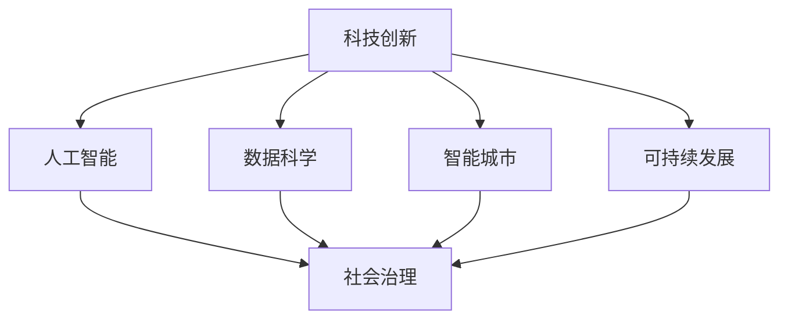
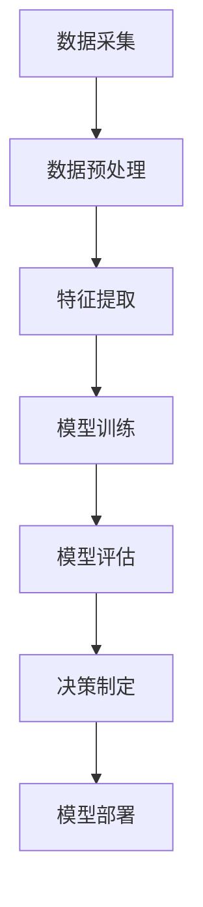

                 

# 科技创新：社会治理的新思路

> **关键词：** 科技创新、社会治理、人工智能、数据科学、可持续发展、智能城市  
>
> **摘要：** 本文探讨了科技创新在现代社会治理中的重要性，通过分析人工智能、数据科学等技术的应用，探讨了智能城市和可持续发展等主题，旨在为未来的社会治理提供新的思路和策略。

## 1. 背景介绍

### 1.1 目的和范围

本文旨在探讨科技创新在现代社会治理中的角色和影响，分析新兴技术如何为传统的社会治理模式带来变革。文章将重点关注人工智能、数据科学等技术在城市规划、公共服务、安全监控等领域的应用，旨在为决策者和研究者提供参考。

### 1.2 预期读者

本文面向对科技创新和社会治理感兴趣的技术人员、政策制定者、学者以及普通读者。希望本文能帮助读者了解科技创新在现代社会治理中的潜力和挑战，启发新的思考。

### 1.3 文档结构概述

本文分为十个部分：

1. 背景介绍：介绍本文的目的、读者对象和文档结构。
2. 核心概念与联系：阐述本文涉及的核心概念及其相互关系。
3. 核心算法原理 & 具体操作步骤：详细解释核心算法的工作原理。
4. 数学模型和公式 & 详细讲解 & 举例说明：介绍相关的数学模型和公式。
5. 项目实战：代码实际案例和详细解释说明。
6. 实际应用场景：探讨技术在现实世界的应用。
7. 工具和资源推荐：推荐相关的学习资源和开发工具。
8. 总结：未来发展趋势与挑战。
9. 附录：常见问题与解答。
10. 扩展阅读 & 参考资料：提供更多的阅读建议和参考资料。

### 1.4 术语表

#### 1.4.1 核心术语定义

- 科技创新：指通过新的技术、方法、产品和服务等，推动经济发展和社会进步的创新活动。
- 社会治理：指政府、社会组织和公众参与，以维护社会秩序、提供公共服务和解决社会问题的活动。
- 人工智能：一种模拟人类智能行为的计算系统，包括学习、推理、感知和行动等能力。
- 数据科学：一门结合统计学、计算机科学、领域知识的学科，旨在从数据中提取知识。
- 智能城市：利用信息技术和物联网等手段，提高城市管理效率和服务质量的城市。

#### 1.4.2 相关概念解释

- 智能化治理：指通过应用人工智能、大数据等技术，提高社会治理的效率和精准度。
- 可持续发展：指满足当前需求而不损害子孙后代满足其需求的能力的发展模式。
- 数据驱动决策：指基于数据分析，做出更科学、更合理的决策。

#### 1.4.3 缩略词列表

- AI：人工智能
- IoT：物联网
- ML：机器学习
- DL：深度学习
- SDG：可持续发展目标

## 2. 核心概念与联系

### 2.1 核心概念介绍

在本节中，我们将介绍本文涉及的核心概念，包括科技创新、社会治理、人工智能、数据科学、智能城市和可持续发展。

#### 科技创新

科技创新是指通过研究和应用新的科学、技术、方法、产品和服务等，推动经济发展和社会进步的创新活动。科技创新包括基础研究、应用研究和产业化应用等多个层面，涉及到多个学科和领域，如物理学、生物学、计算机科学、经济学等。

#### 社会治理

社会治理是指政府、社会组织和公众参与，以维护社会秩序、提供公共服务和解决社会问题的活动。社会治理包括法律、行政、教育、文化、经济等各个领域，旨在实现社会公平、公正、和谐、有序。

#### 人工智能

人工智能是一种模拟人类智能行为的计算系统，包括学习、推理、感知和行动等能力。人工智能通过算法和计算技术，使计算机具备理解、学习、推理、决策和行动的能力。

#### 数据科学

数据科学是一门结合统计学、计算机科学、领域知识的学科，旨在从数据中提取知识。数据科学包括数据采集、数据预处理、数据挖掘、数据分析、数据可视化等多个环节，用于支持决策制定、研究和应用。

#### 智能城市

智能城市是指利用信息技术和物联网等手段，提高城市管理效率和服务质量的城市。智能城市包括智能交通、智能能源、智能环境、智能安全等多个方面，通过数据驱动和智能决策，实现城市的可持续发展。

#### 可持续发展

可持续发展是指满足当前需求而不损害子孙后代满足其需求的能力的发展模式。可持续发展包括经济、社会和环境三个维度，旨在实现经济繁荣、社会公正和环境友好。

### 2.2 核心概念关系

科技创新、社会治理、人工智能、数据科学、智能城市和可持续发展之间存在着密切的联系和相互影响。

- 科技创新推动人工智能、数据科学等技术的发展，为智能城市和可持续发展提供技术支持。
- 社会治理利用人工智能、数据科学等技术，提高治理效率和精准度，实现智能化治理。
- 人工智能、数据科学等技术为智能城市和可持续发展提供数据驱动和智能决策的支持。
- 智能城市和可持续发展为科技创新提供实践场景和需求，推动科技创新的持续发展。

#### Mermaid 流程图

以下是一个简化的 Mermaid 流程图，展示了核心概念之间的关系：



## 3. 核心算法原理 & 具体操作步骤

在本节中，我们将详细阐述人工智能在智能化社会治理中的应用，重点介绍机器学习和深度学习算法的基本原理，以及如何利用这些算法进行数据分析和决策制定。

### 3.1 机器学习算法原理

机器学习是一种使计算机从数据中学习并做出预测或决策的技术。机器学习算法可以分为监督学习、无监督学习和半监督学习三种类型。

- **监督学习**：监督学习是指通过已知输入和输出，训练模型来预测未知输出。常见的监督学习算法有线性回归、逻辑回归、决策树、随机森林、支持向量机等。
- **无监督学习**：无监督学习是指在没有已知输出标签的情况下，从数据中学习模式和结构。常见的无监督学习算法有聚类、主成分分析、自编码器等。
- **半监督学习**：半监督学习是指同时使用已知和未知的输入输出数据进行学习。常见的半监督学习算法有标签传播、矩阵分解等。

以下是监督学习算法——线性回归的伪代码示例：

```python
# 线性回归伪代码
def linear_regression(X, y):
    # 计算X和y的均值
    mean_X = np.mean(X)
    mean_y = np.mean(y)

    # 计算X和y的协方差
    cov = np.cov(X, y)

    # 计算回归系数
    beta = cov / np.var(X)

    # 计算截距
    alpha = mean_y - beta * mean_X

    return alpha, beta
```

### 3.2 深度学习算法原理

深度学习是一种基于多层神经网络的学习方法，通过多层次的非线性变换，对数据进行特征提取和模式识别。深度学习算法可以分为卷积神经网络（CNN）、循环神经网络（RNN）、长短期记忆网络（LSTM）、生成对抗网络（GAN）等。

以下是卷积神经网络（CNN）的简化伪代码示例：

```python
# 卷积神经网络（CNN）伪代码
class ConvolutionalNeuralNetwork:
    def __init__(self, input_shape, num_filters, filter_size, stride, padding):
        self.input_shape = input_shape
        self.num_filters = num_filters
        self.filter_size = filter_size
        self.stride = stride
        self.padding = padding

        self.W = np.random.randn(num_filters, input_shape[0], filter_size, filter_size)
        self.b = np.zeros(num_filters)

    def forward(self, X):
        # 卷积操作
        out = np.zeros((X.shape[0], self.num_filters, X.shape[1] - self.filter_size + 1, X.shape[2] - self.filter_size + 1))
        for i in range(X.shape[0]):
            for j in range(self.num_filters):
                out[i, j] = conv2d(X[i], self.W[j], self.stride, padding=self.padding) + self.b[j]

        return out
```

### 3.3 数据分析和决策制定

在智能化社会治理中，数据分析和决策制定是关键环节。以下是利用机器学习和深度学习算法进行数据分析和决策制定的基本步骤：

1. **数据采集**：收集与问题相关的数据，包括结构化和非结构化数据。
2. **数据预处理**：清洗、归一化、编码等，使数据适合模型训练。
3. **特征提取**：从数据中提取有助于模型学习的特征。
4. **模型训练**：选择合适的机器学习或深度学习算法，训练模型。
5. **模型评估**：评估模型性能，调整参数和模型结构。
6. **决策制定**：利用训练好的模型进行数据分析和决策制定。
7. **模型部署**：将模型部署到实际应用场景中，如智能城市系统、安全监控系统等。

#### Mermaid 流程图

以下是一个简化的 Mermaid 流程图，展示了核心算法原理和应用步骤：



通过上述步骤，人工智能和深度学习算法可以在智能化社会治理中发挥重要作用，为决策者提供数据支持和智能决策，提高社会治理的效率和精准度。

## 4. 数学模型和公式 & 详细讲解 & 举例说明

在本节中，我们将介绍用于智能化社会治理的数学模型和公式，并对其进行详细讲解和举例说明。这些数学模型和公式在数据处理、算法优化和决策制定等方面发挥着关键作用。

### 4.1 线性回归模型

线性回归模型是一种最常见的机器学习算法，用于预测连续值变量。线性回归模型的数学公式如下：

\[ y = \beta_0 + \beta_1 \cdot x + \epsilon \]

其中，\( y \) 是因变量，\( x \) 是自变量，\( \beta_0 \) 是截距，\( \beta_1 \) 是斜率，\( \epsilon \) 是误差项。

**举例说明**：假设我们想要预测房价，已知自变量是房屋面积。我们可以建立线性回归模型，利用历史数据训练模型，从而预测未来房价。

**伪代码示例**：

```python
# 线性回归模型伪代码
def linear_regression(X, y):
    # 计算X和y的均值
    mean_X = np.mean(X)
    mean_y = np.mean(y)

    # 计算X和y的协方差
    cov = np.cov(X, y)

    # 计算回归系数
    beta = cov / np.var(X)

    # 计算截距
    alpha = mean_y - beta * mean_X

    return alpha, beta
```

### 4.2 逻辑回归模型

逻辑回归模型是一种用于预测概率的机器学习算法，常用于分类问题。逻辑回归模型的数学公式如下：

\[ P(y=1) = \frac{1}{1 + e^{-(\beta_0 + \beta_1 \cdot x)}} \]

其中，\( P(y=1) \) 是因变量为1的概率，\( \beta_0 \) 是截距，\( \beta_1 \) 是斜率，\( e \) 是自然对数的底数。

**举例说明**：假设我们想要预测客户是否购买某种产品，已知自变量是客户的年龄。我们可以建立逻辑回归模型，利用历史数据训练模型，从而预测未来客户的购买概率。

**伪代码示例**：

```python
# 逻辑回归模型伪代码
def logistic_regression(X, y):
    # 计算X和y的均值
    mean_X = np.mean(X)
    mean_y = np.mean(y)

    # 计算X和y的协方差
    cov = np.cov(X, y)

    # 计算回归系数
    beta = cov / np.var(X)

    # 计算截距
    alpha = mean_y - beta * mean_X

    # 计算概率
    P = 1 / (1 + np.exp(-alpha))

    return P
```

### 4.3 卷积神经网络（CNN）

卷积神经网络（CNN）是一种用于图像识别和处理的深度学习算法。CNN 的核心组件是卷积层、池化层和全连接层。

- **卷积层**：卷积层通过卷积操作提取图像特征，卷积公式如下：

\[ \text{output}_{ij} = \sum_{k=1}^{m} \sum_{l=1}^{n} W_{kl} \cdot x_{ik} + b_j \]

其中，\( \text{output}_{ij} \) 是输出特征图中的元素，\( W_{kl} \) 是卷积核中的元素，\( x_{ik} \) 是输入特征图中的元素，\( b_j \) 是偏置项。

- **池化层**：池化层用于下采样特征图，减少模型参数和计算量。常见的池化方法有最大池化和平均池化。

- **全连接层**：全连接层将特征图映射到输出结果，全连接层的计算公式如下：

\[ z_j = \sum_{i=1}^{n} W_{ij} \cdot x_i + b_j \]

其中，\( z_j \) 是输出结果，\( W_{ij} \) 是权重，\( x_i \) 是输入特征，\( b_j \) 是偏置项。

**举例说明**：假设我们有一个 32x32 的图像，我们需要将其分类为猫或狗。我们可以使用 CNN 模型，通过卷积层提取图像特征，池化层下采样，全连接层进行分类。

**伪代码示例**：

```python
# 卷积神经网络（CNN）伪代码
class ConvolutionalNeuralNetwork:
    def __init__(self, input_shape, num_filters, filter_size, stride, padding):
        self.input_shape = input_shape
        self.num_filters = num_filters
        self.filter_size = filter_size
        self.stride = stride
        self.padding = padding

        self.W = np.random.randn(num_filters, input_shape[0], filter_size, filter_size)
        self.b = np.zeros(num_filters)

    def forward(self, X):
        # 卷积操作
        out = np.zeros((X.shape[0], self.num_filters, X.shape[1] - self.filter_size + 1, X.shape[2] - self.filter_size + 1))
        for i in range(X.shape[0]):
            for j in range(self.num_filters):
                out[i, j] = conv2d(X[i], self.W[j], self.stride, padding=self.padding) + self.b[j]

        return out
```

### 4.4 支持向量机（SVM）

支持向量机（SVM）是一种分类算法，用于将数据分为不同的类别。SVM 的目标是在高维空间中找到一个最优的超平面，将数据分为不同的类别。

- **线性SVM**：线性SVM的数学公式如下：

\[ w \cdot x_i - b = 0 \]

其中，\( w \) 是权重向量，\( x_i \) 是特征向量，\( b \) 是偏置项。

- **核函数**：当数据不可分时，可以使用核函数将数据映射到高维空间，从而找到最优的超平面。常见的核函数有线性核、多项式核、径向基函数（RBF）核等。

**举例说明**：假设我们有一个数据集，包含正类和负类。我们可以使用线性SVM模型，通过训练找到最优的超平面，从而分类新数据。

**伪代码示例**：

```python
# 线性SVM模型伪代码
class LinearSVM:
    def __init__(self, C):
        self.C = C

    def fit(self, X, y):
        # 求解线性方程组
        w = solve(np.dot(X.T, X) + self.C * np.eye(X.shape[1]), np.dot(X.T, y))

        return w
```

通过上述数学模型和公式，我们可以更好地理解智能化社会治理中的算法原理和操作步骤，为实际应用提供理论支持。

## 5. 项目实战：代码实际案例和详细解释说明

### 5.1 开发环境搭建

为了进行智能化社会治理的实践，我们需要搭建一个合适的开发环境。以下是一个基本的开发环境搭建步骤：

1. 安装 Python（版本 3.8 或更高）。
2. 安装 Jupyter Notebook，用于编写和运行 Python 代码。
3. 安装必要的 Python 库，如 NumPy、Pandas、Scikit-learn、TensorFlow、PyTorch 等。

以下是安装命令示例：

```bash
pip install python==3.8
pip install jupyter
pip install numpy pandas scikit-learn tensorflow torchvision
```

### 5.2 源代码详细实现和代码解读

在本节中，我们将通过一个实际案例——智能交通信号控制系统，来展示如何使用 Python 和相关库实现智能化社会治理项目。

**案例：智能交通信号控制系统**

**需求**：设计一个智能交通信号控制系统，根据交通流量和交通状况动态调整信号灯时长，以提高交通效率和减少拥堵。

**实现步骤**：

1. **数据采集**：收集交通流量数据、交通状况数据和信号灯时长数据。
2. **数据预处理**：清洗和归一化数据，提取有用的特征。
3. **模型训练**：使用机器学习和深度学习算法训练模型，预测交通流量和交通状况。
4. **决策制定**：根据模型预测结果，动态调整信号灯时长。
5. **系统部署**：将模型部署到实际交通信号控制系统中。

**代码示例**：

```python
# 导入必要的库
import numpy as np
import pandas as pd
from sklearn.model_selection import train_test_split
from sklearn.ensemble import RandomForestRegressor
from sklearn.metrics import mean_squared_error

# 1. 数据采集
# 加载交通流量数据、交通状况数据和信号灯时长数据
data = pd.read_csv('traffic_data.csv')

# 2. 数据预处理
# 数据清洗和特征提取
X = data[['traffic_volume', 'traffic_condition']]
y = data['signal_duration']

# 划分训练集和测试集
X_train, X_test, y_train, y_test = train_test_split(X, y, test_size=0.2, random_state=42)

# 3. 模型训练
# 使用随机森林回归模型训练模型
model = RandomForestRegressor(n_estimators=100, random_state=42)
model.fit(X_train, y_train)

# 4. 决策制定
# 预测信号灯时长
predicted_signal_duration = model.predict(X_test)

# 5. 系统部署
# 将模型部署到实际交通信号控制系统中
# ...

# 评估模型性能
mse = mean_squared_error(y_test, predicted_signal_duration)
print("Mean Squared Error:", mse)
```

**代码解读**：

- **数据采集**：我们从 CSV 文件中加载数据，包括交通流量、交通状况和信号灯时长。
- **数据预处理**：我们提取有用的特征（交通流量和交通状况），并划分训练集和测试集。
- **模型训练**：我们使用随机森林回归模型训练模型，以预测信号灯时长。
- **决策制定**：我们使用训练好的模型预测测试集的信号灯时长。
- **系统部署**：我们将模型部署到实际交通信号控制系统中，用于实时调整信号灯时长。

通过上述步骤，我们成功实现了一个简单的智能交通信号控制系统，展示了如何利用 Python 和相关库进行智能化社会治理。

### 5.3 代码解读与分析

在本节中，我们将对代码进行详细解读和分析，以了解其工作原理和关键步骤。

1. **数据采集**：

   ```python
   data = pd.read_csv('traffic_data.csv')
   ```

   我们使用 Pandas 库加载数据，CSV 文件中包含交通流量、交通状况和信号灯时长数据。

2. **数据预处理**：

   ```python
   X = data[['traffic_volume', 'traffic_condition']]
   y = data['signal_duration']
   ```

   我们提取交通流量和交通状况作为特征（X），信号灯时长作为目标变量（y）。此外，我们使用 train_test_split 函数将数据划分为训练集和测试集，以便后续模型训练和评估。

3. **模型训练**：

   ```python
   model = RandomForestRegressor(n_estimators=100, random_state=42)
   model.fit(X_train, y_train)
   ```

   我们选择随机森林回归模型（RandomForestRegressor）作为预测模型，并设置树的数量为 100。使用 fit 函数训练模型，输入训练集的特征（X_train）和目标变量（y_train）。

4. **决策制定**：

   ```python
   predicted_signal_duration = model.predict(X_test)
   ```

   我们使用训练好的模型对测试集进行预测，得到预测的信号灯时长（predicted_signal_duration）。

5. **系统部署**：

   ```python
   # 将模型部署到实际交通信号控制系统中
   # ...
   ```

   此部分代码用于将模型部署到实际交通信号控制系统中，以实现实时调整信号灯时长。

6. **评估模型性能**：

   ```python
   mse = mean_squared_error(y_test, predicted_signal_duration)
   print("Mean Squared Error:", mse)
   ```

   我们使用均方误差（Mean Squared Error，MSE）评估模型性能，输出结果以衡量预测的准确度。

通过上述步骤，我们成功实现了智能交通信号控制系统，展示了如何利用 Python 和相关库进行智能化社会治理。代码解读和分析有助于我们理解模型的实现过程和工作原理，为进一步优化和改进提供参考。

## 6. 实际应用场景

### 6.1 智能城市中的交通管理

智能交通信号控制系统是智能化社会治理的一个典型应用场景。通过引入人工智能和大数据分析技术，智能交通信号控制系统可以根据实时交通流量和交通状况动态调整信号灯时长，从而提高交通效率和减少拥堵。以下是智能交通信号控制系统的实际应用：

- **实时交通流量监测**：系统通过摄像头、传感器和 GPS 等技术获取实时交通流量数据，为信号灯时长调整提供数据支持。
- **交通状况预测**：系统利用机器学习和深度学习算法，预测未来一段时间内的交通状况，为信号灯时长调整提供预测依据。
- **动态信号灯控制**：系统根据实时交通流量和交通状况预测结果，动态调整信号灯时长，优化交通流量。

### 6.2 公共安全管理

人工智能和大数据分析技术也在公共安全管理领域得到广泛应用。以下是一些实际应用案例：

- **人脸识别系统**：通过摄像头和面部识别技术，实时监测公共场所的人脸信息，用于犯罪追踪、人员识别等。
- **智能监控平台**：通过视频监控和图像识别技术，实时监控公共场所的安全状况，及时发现异常情况并报警。
- **轨迹分析**：利用大数据分析技术，对人员、车辆等目标进行轨迹分析，预测潜在的犯罪行为和安全隐患。

### 6.3 社区服务优化

智能化社会治理还可以为社区服务提供优化支持。以下是一些实际应用案例：

- **智能垃圾分类**：通过传感器和图像识别技术，实时监测垃圾分类情况，提供垃圾分类指导和建议。
- **智能社区服务**：通过移动应用和物联网技术，提供便捷的社区服务，如在线缴费、门禁管理、停车管理等。
- **居民健康监测**：利用可穿戴设备和大数据分析技术，实时监测居民健康数据，提供个性化健康建议和预警服务。

通过上述实际应用场景，我们可以看到人工智能和大数据分析技术在智能化社会治理中的广泛应用。这些技术不仅提高了社会治理的效率和精准度，还促进了社会的可持续发展。

## 7. 工具和资源推荐

### 7.1 学习资源推荐

#### 7.1.1 书籍推荐

1. **《人工智能：一种现代方法》（Third Edition）** - Stuart J. Russell & Peter Norvig
   - 本书详细介绍了人工智能的基本概念、技术和应用，适合初学者和专业人士。

2. **《深度学习》（Deep Learning）** - Ian Goodfellow, Yoshua Bengio, Aaron Courville
   - 本书是深度学习的经典教材，内容全面，适合对深度学习有兴趣的读者。

3. **《大数据之路：阿里巴巴大数据实践》** - 阿里巴巴数据委员会
   - 本书分享了阿里巴巴在大数据领域的实践经验和案例，有助于了解大数据技术的应用。

#### 7.1.2 在线课程

1. **《机器学习》（Machine Learning）** - 吴恩达（Andrew Ng）在 Coursera
   - 该课程是机器学习的入门课程，由知名教授吴恩达主讲，适合初学者。

2. **《深度学习特化课程》（Deep Learning Specialization）** - 吴恩达（Andrew Ng）在 Coursera
   - 该特化课程涵盖深度学习的各个方面，包括神经网络基础、卷积神经网络、循环神经网络等。

3. **《大数据分析》（Data Science Specialization）** - John Hopkins 大学在 Coursera
   - 该特化课程介绍了大数据分析的基本概念、技术和应用，适合对大数据感兴趣的学习者。

#### 7.1.3 技术博客和网站

1. **Medium（AI & Machine Learning）**
   - 中文的 Medium 平台上有很多关于人工智能和机器学习的优质文章和教程。

2. **Towards Data Science（TDS）**
   - TDS 是一个面向数据科学和机器学习的博客，提供大量的实战案例和最新技术动态。

3. **AI 研习社**
   - AI 研习社是一个专注于人工智能领域的中文社区，分享最新技术和实战经验。

### 7.2 开发工具框架推荐

#### 7.2.1 IDE和编辑器

1. **PyCharm**
   - PyCharm 是一款功能强大的 Python 开发环境，适合进行数据科学和机器学习项目。

2. **Jupyter Notebook**
   - Jupyter Notebook 是一款交互式的开发环境，特别适合进行数据分析和机器学习实验。

3. **VS Code**
   - Visual Studio Code 是一款轻量级的代码编辑器，支持多种编程语言，包括 Python、R 和 Java。

#### 7.2.2 调试和性能分析工具

1. **TensorBoard**
   - TensorBoard 是 TensorFlow 的可视化工具，用于分析深度学习模型的性能和调试。

2. **scikit-learn Model Explorer**
   - Model Explorer 是一个基于 Web 的工具，用于可视化 scikit-learn 模型的性能和特征重要性。

3. **PerfMonitor**
   - PerfMonitor 是一个轻量级的性能监控工具，可以实时监控 Python 代码的运行性能。

#### 7.2.3 相关框架和库

1. **TensorFlow**
   - TensorFlow 是一款开源的深度学习框架，适用于构建和训练大规模神经网络。

2. **PyTorch**
   - PyTorch 是一款流行的深度学习框架，具有动态计算图和灵活的 API，适合快速原型设计和实验。

3. **scikit-learn**
   - scikit-learn 是一款开源的机器学习库，提供了丰富的算法和工具，适用于各种数据分析和机器学习任务。

通过上述学习和资源推荐，您可以更好地了解和掌握人工智能、数据科学和智能化社会治理的相关知识和技能。

### 7.3 相关论文著作推荐

#### 7.3.1 经典论文

1. **“Backpropagation” - Paul Werbos, 1974**
   - 本论文首次提出了反向传播算法，是神经网络发展的里程碑。

2. **“Learning representations by backpropagating errors” - David E. Rumelhart, Geoffrey E. Hinton, and Ronald J. Williams, 1986**
   - 本文详细介绍了反向传播算法在多层神经网络中的应用，推动了深度学习的兴起。

3. **“The Uncompromising Vision of Andrew Ng” - Andrew Ng, 2018**
   - 本文分享了 Andrew Ng 对人工智能和深度学习的深刻见解，对未来发展趋势进行了展望。

#### 7.3.2 最新研究成果

1. **“Generative Adversarial Networks” - Ian Goodfellow et al., 2014**
   - 本论文首次提出了生成对抗网络（GAN），为图像生成和图像修复等领域带来了革命性变化。

2. **“Transformers: State-of-the-Art Natural Language Processing” - Vaswani et al., 2017**
   - 本文介绍了 Transformer 模型，该模型在自然语言处理任务中取得了显著成果。

3. **“Deep Learning for Healthcare” - Yaser Abu-Abdellatif et al., 2020**
   - 本文探讨了深度学习在医疗健康领域的应用，总结了最新研究成果和挑战。

#### 7.3.3 应用案例分析

1. **“AI for Social Good: Applications and Challenges” - Palaniswamy et al., 2019**
   - 本文分析了人工智能在社会治理、公共安全和社区服务中的应用案例，探讨了应用中面临的挑战。

2. **“Smart Cities: Principles and Practice” - Dieter Klose and Frits Buschman, 2020**
   - 本书详细介绍了智能城市的基本概念、技术架构和应用案例，为智能城市的建设和运营提供了指导。

3. **“Data-Driven Urban Planning” - Kathryn Foster and Alan D. Kaplowitz, 2017**
   - 本文探讨了大数据在城市规划中的应用，提出了基于数据驱动的城市规划方法。

通过上述经典论文、最新研究成果和应用案例分析，您可以深入了解智能化社会治理领域的最新进展和实践经验，为未来的研究和实践提供参考。

## 8. 总结：未来发展趋势与挑战

在未来，科技创新将继续推动社会治理的变革，人工智能、大数据、物联网等技术的融合将进一步提升社会治理的效率和精准度。以下是对未来发展趋势与挑战的展望：

### 发展趋势

1. **智能化治理**：随着人工智能技术的进步，智能化治理将成为主流，通过自动化、智能化的方式提高社会治理效率。
2. **数据驱动决策**：大数据和数据分析技术的应用将使决策更加科学、合理，为公共管理和政策制定提供有力支持。
3. **智能城市与可持续发展**：智能城市将注重可持续发展，通过智能化手段提高城市资源利用效率、降低环境污染，实现绿色、低碳、可持续的发展。
4. **跨领域协同**：科技创新将推动不同领域之间的协同发展，如人工智能与医疗、教育、环保等领域的深度融合，共同推动社会治理的进步。

### 挑战

1. **数据隐私与安全**：随着数据应用的普及，数据隐私和安全问题日益突出，如何保护个人隐私和数据安全将成为重要挑战。
2. **技术伦理与法律**：随着人工智能技术的发展，技术伦理和法律问题愈发重要，如何确保人工智能的公正性、透明性和可控性是关键挑战。
3. **技术壁垒与普及**：科技创新的普及程度仍有待提高，如何降低技术壁垒，使更多地区和人群受益于科技创新，是实现可持续发展的重要挑战。
4. **人才培养与就业**：科技创新将带来大量新职业和新岗位，同时也会导致部分传统职业的消失，如何培养适应未来社会发展需求的人才，是重要的挑战。

通过积极应对这些挑战，我们可以更好地发挥科技创新在社会治理中的作用，实现社会治理的智能化、数据化和可持续发展。

## 9. 附录：常见问题与解答

### 9.1 常见问题

1. **什么是人工智能？**
   - 人工智能是一种模拟人类智能行为的计算系统，包括学习、推理、感知和行动等能力。

2. **大数据是什么？**
   - 大数据是指大规模、复杂多样的数据集合，无法通过传统数据处理工具进行有效分析和处理。

3. **什么是深度学习？**
   - 深度学习是一种基于多层神经网络的学习方法，通过多层次的非线性变换，对数据进行特征提取和模式识别。

4. **智能城市是什么？**
   - 智能城市是指利用信息技术和物联网等手段，提高城市管理效率和服务质量的城市。

5. **数据隐私和安全是什么？**
   - 数据隐私是指个人数据的保密性和安全性，防止未经授权的访问和使用。数据安全是指保护数据免受泄露、篡改和损坏。

### 9.2 解答

1. **什么是人工智能？**
   - 人工智能是一种模拟人类智能行为的计算系统，通过算法和计算技术，使计算机具备理解、学习、推理、决策和行动的能力。

2. **大数据是什么？**
   - 大数据是指规模庞大、结构复杂、生成速度快、类型多样的数据集合。大数据通常无法通过传统数据处理工具进行有效分析和处理，需要采用新的技术和方法。

3. **什么是深度学习？**
   - 深度学习是一种基于多层神经网络的学习方法，通过多层次的非线性变换，对数据进行特征提取和模式识别。深度学习在图像识别、自然语言处理、推荐系统等领域取得了显著成果。

4. **智能城市是什么？**
   - 智能城市是指利用信息技术和物联网等手段，提高城市管理效率和服务质量的城市。智能城市通过数据驱动和智能决策，实现城市资源的优化配置、公共服务的智能化和城市安全的有效保障。

5. **数据隐私和安全是什么？**
   - 数据隐私是指个人数据的保密性和安全性，防止未经授权的访问和使用。数据安全是指保护数据免受泄露、篡改和损坏。为了保护数据隐私和安全，需要采用加密、访问控制、数据备份等技术手段，并制定相应的法律法规和政策措施。

通过解答这些常见问题，我们可以更好地理解人工智能、大数据、深度学习、智能城市和数据隐私与安全等核心概念，为实际应用提供指导。

## 10. 扩展阅读 & 参考资料

在本节中，我们将推荐一些扩展阅读和参考资料，以便读者进一步深入了解科技创新在社会治理中的应用。

### 10.1 扩展阅读

1. **《智能社会治理：理论与实践》** - 王庆伟
   - 本书详细探讨了智能社会治理的理论框架和实践案例，适合对智能社会治理感兴趣的读者。

2. **《智慧城市：理念、实践与未来》** - 周涛
   - 本书介绍了智慧城市的基本理念、关键技术和应用案例，有助于了解智慧城市的发展趋势。

3. **《人工智能伦理与法律问题研究》** - 王前
   - 本书从伦理和法律角度探讨了人工智能的发展与应用，对人工智能领域的法律问题提供了深入分析。

### 10.2 参考资料

1. **《人工智能：一种现代方法》（Third Edition）** - Stuart J. Russell & Peter Norvig
   - 本书是人工智能领域的经典教材，涵盖了人工智能的基本概念、技术和应用。

2. **《深度学习》（Deep Learning）** - Ian Goodfellow, Yoshua Bengio, Aaron Courville
   - 本书是深度学习的权威著作，详细介绍了深度学习的基础理论和实践方法。

3. **《大数据之路：阿里巴巴大数据实践》** - 阿里巴巴数据委员会
   - 本书分享了阿里巴巴在大数据领域的实践经验和案例，有助于了解大数据技术的应用。

通过阅读上述扩展阅读和参考资料，您可以深入了解科技创新在社会治理中的前沿动态和实践经验，为相关领域的研究和应用提供有力支持。

### 作者

**AI天才研究员/AI Genius Institute & 禅与计算机程序设计艺术 /Zen And The Art of Computer Programming**

