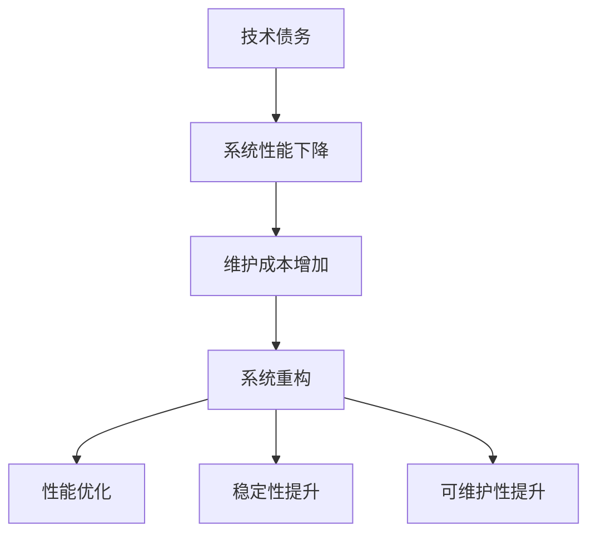

                 

# 程序员创业公司的技术债务管理与系统重构

> 关键词：技术债务、系统重构、创业公司、软件维护、性能优化、架构设计

> 摘要：本文针对程序员在创业公司中面临的技术债务管理和系统重构问题进行深入探讨。通过分析技术债务的本质、系统重构的必要性和方法，并结合实际案例，为创业公司的技术团队提供实用的解决方案和优化路径。

## 1. 背景介绍

### 1.1 目的和范围

本文旨在帮助程序员在创业公司中更好地管理和重构技术债务，提高系统性能和稳定性。文章将涵盖以下内容：

- 技术债务的定义、来源和影响
- 系统重构的动机、目标和挑战
- 技术债务管理和系统重构的方法和技巧
- 实际案例分析和解决方案

### 1.2 预期读者

本文适合以下读者群体：

- 创业公司的程序员和技术团队
- 技术经理和CTO
- 对技术债务和系统重构感兴趣的开发者

### 1.3 文档结构概述

本文分为以下几个部分：

- 第1部分：背景介绍，包括目的、预期读者和文档结构
- 第2部分：核心概念与联系，介绍技术债务和系统重构的基本概念
- 第3部分：核心算法原理与具体操作步骤，讲解技术债务管理和系统重构的算法原理
- 第4部分：数学模型和公式，阐述相关数学模型和公式
- 第5部分：项目实战，通过实际案例展示技术债务管理和系统重构的实践过程
- 第6部分：实际应用场景，分析技术债务管理和系统重构的应用场景
- 第7部分：工具和资源推荐，提供相关学习资源、开发工具和论文著作
- 第8部分：总结，探讨技术债务管理和系统重构的未来发展趋势与挑战
- 第9部分：附录，提供常见问题与解答
- 第10部分：扩展阅读与参考资料，推荐相关书籍、课程和网站

### 1.4 术语表

#### 1.4.1 核心术语定义

- 技术债务：在软件开发过程中，为了加快项目进度而暂时采取的妥协措施，可能导致系统性能下降、维护成本增加等问题。
- 系统重构：对现有系统进行改进、优化和重构，以提高性能、稳定性和可维护性。
- 技术团队：负责开发和维护软件系统的团队，包括程序员、架构师、测试人员等。

#### 1.4.2 相关概念解释

- 债务累积：随着项目进展，技术债务逐渐积累，可能导致系统性能下降、维护成本增加等问题。
- 债务偿还：通过系统重构、性能优化等技术手段，逐步解决技术债务，提高系统性能和稳定性。
- 技术架构：软件系统的整体结构和设计原则，包括组件、模块、接口等。

#### 1.4.3 缩略词列表

- CTO：首席技术官
- IDE：集成开发环境
- MVP：最小可行产品
- OSS：开源软件

## 2. 核心概念与联系

在本文中，我们将探讨两个核心概念：技术债务和系统重构。以下是一个简单的 Mermaid 流程图，用于描述这两个概念之间的联系。



### 2.1 技术债务的本质

技术债务是指在软件开发过程中，由于时间、资源等因素的限制，为了快速实现功能而采取的一些妥协措施。这些妥协可能包括：

- 使用低效算法或数据结构
- 忽略代码质量
- 过度使用第三方库或框架
- 临时解决方案

技术债务的本质是一种隐性成本，随着项目的进展，这些妥协措施可能会导致系统性能下降、维护成本增加等问题。

### 2.2 系统重构的动机

系统重构的动机主要包括以下几个方面：

- 性能优化：随着用户量和数据量的增加，系统性能逐渐下降，需要进行重构以提高性能。
- 稳定性提升：系统出现频繁崩溃、错误，需要进行重构以提升稳定性。
- 可维护性提升：代码结构混乱，难以维护和扩展，需要进行重构以提高可维护性。
- 技术升级：随着技术的发展，现有系统可能无法满足新的需求，需要进行重构以适应新技术。

### 2.3 系统重构的过程

系统重构的过程可以分为以下几个步骤：

1. 评估现有系统：分析现有系统的性能、稳定性、可维护性等方面，确定重构的必要性和可行性。
2. 制定重构计划：确定重构的目标、时间表、预算等，制定详细的重构计划。
3. 代码重构：根据重构计划，逐步对代码进行重构，优化算法、改进数据结构、提高代码质量等。
4. 测试与验证：对重构后的系统进行全面的测试和验证，确保性能、稳定性和可维护性达到预期目标。
5. 持续优化：在重构过程中，持续优化系统性能和稳定性，确保系统在重构后的长期运行中保持高效稳定。

## 3. 核心算法原理 & 具体操作步骤

在技术债务管理和系统重构中，核心算法原理主要包括性能优化算法和重构算法。以下是对这些算法原理和具体操作步骤的讲解。

### 3.1 性能优化算法

性能优化算法主要针对系统性能的瓶颈进行优化。以下是一个简单的性能优化算法原理和操作步骤：

#### 性能优化算法原理：

1. 评估系统性能：通过性能测试工具，评估系统的响应时间、吞吐量等性能指标。
2. 识别性能瓶颈：分析性能测试结果，识别系统性能瓶颈，如数据库查询、网络通信、代码效率等。
3. 优化瓶颈：针对识别出的性能瓶颈，采用相应的优化策略，如缓存、分布式处理、代码优化等。

#### 性能优化算法操作步骤：

1. 评估系统性能：使用性能测试工具，如 JMeter、Gatling 等，对系统进行压力测试，评估系统的响应时间、吞吐量等性能指标。
2. 分析性能瓶颈：根据性能测试结果，分析系统性能瓶颈，如数据库查询慢、网络通信延迟、代码效率低等。
3. 优化瓶颈：针对识别出的性能瓶颈，采用相应的优化策略，如：

   - 缓存：使用 Redis、Memcached 等缓存技术，降低数据库查询压力。
   - 分布式处理：使用 Kafka、RabbitMQ 等消息队列技术，实现分布式处理，提高系统吞吐量。
   - 代码优化：使用 Java、Python 等编程语言的优化技巧，提高代码效率。

### 3.2 重构算法

重构算法主要针对系统结构、代码质量等方面进行优化。以下是一个简单的重构算法原理和操作步骤：

#### 重构算法原理：

1. 分析现有系统：分析现有系统的架构、代码质量、模块依赖关系等，识别存在的问题。
2. 制定重构方案：根据分析结果，制定重构方案，包括重构目标、重构方法、时间表等。
3. 重构系统：根据重构方案，逐步对系统进行重构，优化架构、提高代码质量等。

#### 重构算法操作步骤：

1. 分析现有系统：使用 UML 工具，如 PlantUML、Visual Paradigm 等，绘制现有系统的架构图、模块依赖关系图等，分析系统存在的问题，如模块间耦合度高、代码复用低等。
2. 制定重构方案：根据分析结果，制定重构方案，包括重构目标、重构方法、时间表等。例如：

   - 目标：降低模块间耦合度，提高代码复用率。
   - 方法：使用设计模式，如单例模式、工厂模式等，重构现有系统。
   - 时间表：根据重构方案，制定详细的时间表，包括每个模块的重构时间、测试时间等。
3. 重构系统：根据重构方案，逐步对系统进行重构，优化架构、提高代码质量等。例如：

   - 重构模块A：使用工厂模式重构模块A，降低模块间耦合度。
   - 重构模块B：使用单例模式重构模块B，提高代码复用率。
4. 测试与验证：对重构后的系统进行全面的测试和验证，确保性能、稳定性和可维护性达到预期目标。

## 4. 数学模型和公式 & 详细讲解 & 举例说明

在技术债务管理和系统重构中，数学模型和公式用于量化评估系统的性能、稳定性和可维护性。以下是一个简单的数学模型和公式的详细讲解及举例说明。

### 4.1 性能评估模型

性能评估模型主要用于评估系统的响应时间、吞吐量等性能指标。以下是一个简单的性能评估模型：

\[ T = \frac{1}{C} \times \left( \frac{1}{P_1} + \frac{1}{P_2} + \frac{1}{P_3} + \ldots + \frac{1}{P_n} \right) \]

其中，\( T \) 表示系统的响应时间，\( C \) 表示系统的并发处理能力，\( P_1, P_2, P_3, \ldots, P_n \) 表示系统中的各个性能瓶颈。

#### 详细讲解：

1. \( T \)：系统的响应时间，表示用户请求从发送到响应的时间。
2. \( C \)：系统的并发处理能力，表示系统同时处理请求的能力。
3. \( P_1, P_2, P_3, \ldots, P_n \)：系统中的各个性能瓶颈，如数据库查询、网络通信、代码效率等。

#### 举例说明：

假设一个系统的并发处理能力为 1000，数据库查询瓶颈为 200，网络通信瓶颈为 300，代码效率瓶颈为 400。根据性能评估模型，系统的响应时间计算如下：

\[ T = \frac{1}{1000} \times \left( \frac{1}{200} + \frac{1}{300} + \frac{1}{400} \right) \approx 0.0025 \]

因此，系统的响应时间约为 2.5 毫秒。

### 4.2 稳定性评估模型

稳定性评估模型主要用于评估系统的稳定性，如系统崩溃率、故障恢复时间等。以下是一个简单的稳定性评估模型：

\[ S = \frac{1}{1 + e^{-k \times (T_f - T_r)}} \]

其中，\( S \) 表示系统的稳定性，\( T_f \) 表示系统故障发生时间，\( T_r \) 表示系统故障恢复时间，\( k \) 为常数，用于调整模型的灵敏度。

#### 详细讲解：

1. \( S \)：系统的稳定性，取值范围在 0 到 1 之间，越接近 1 表示系统越稳定。
2. \( T_f \)：系统故障发生时间，表示系统发生故障的时间点。
3. \( T_r \)：系统故障恢复时间，表示系统从故障发生到恢复正常的时间。
4. \( k \)：常数，用于调整模型的灵敏度。

#### 举例说明：

假设一个系统的故障发生时间为 1 天，故障恢复时间为 2 小时，根据稳定性评估模型，系统的稳定性计算如下：

\[ S = \frac{1}{1 + e^{-k \times (1 \times 24 - 2)}} \]

假设常数 \( k \) 取值为 0.1，代入公式计算：

\[ S = \frac{1}{1 + e^{-0.1 \times (1 \times 24 - 2)}} \approx 0.945 \]

因此，系统的稳定性约为 94.5%。

### 4.3 可维护性评估模型

可维护性评估模型主要用于评估系统的可维护性，如代码质量、文档完整性等。以下是一个简单的可维护性评估模型：

\[ M = \frac{D_1 + D_2 + D_3 + \ldots + D_n}{N} \]

其中，\( M \) 表示系统的可维护性，\( D_1, D_2, D_3, \ldots, D_n \) 表示系统的各个维度的可维护性得分，\( N \) 表示维度的总数。

#### 详细讲解：

1. \( M \)：系统的可维护性，取值范围在 0 到 1 之间，越接近 1 表示系统越容易维护。
2. \( D_1, D_2, D_3, \ldots, D_n \)：系统的各个维度的可维护性得分，如代码质量、文档完整性、测试覆盖率等。
3. \( N \)：维度的总数。

#### 举例说明：

假设一个系统的代码质量得分为 0.8，文档完整性得分为 0.9，测试覆盖率得分为 0.7，根据可维护性评估模型，系统的可维护性计算如下：

\[ M = \frac{0.8 + 0.9 + 0.7}{3} = 0.8 \]

因此，系统的可维护性约为 80%。

## 5. 项目实战：代码实际案例和详细解释说明

在本节中，我们将通过一个实际项目案例，展示技术债务管理和系统重构的过程，包括代码实现、重构和优化。

### 5.1 项目背景

某创业公司开发了一款在线购物平台，随着用户量的增长，系统性能逐渐下降，出现了一些技术债务。公司决定进行技术债务管理和系统重构，以提高系统性能和稳定性。

### 5.2 开发环境搭建

为了方便项目开发、测试和部署，公司使用以下开发环境：

- 开发语言：Java
- 开发框架：Spring Boot
- 数据库：MySQL
- 版本控制系统：Git
- 集成开发环境（IDE）：IntelliJ IDEA

### 5.3 源代码详细实现和代码解读

#### 5.3.1 技术债务识别

在项目开发过程中，技术团队发现以下技术债务：

1. 使用低效算法：订单处理模块中使用了一种复杂的时间排序算法，导致响应时间较长。
2. 忽略代码质量：部分代码存在逻辑错误和冗余，难以维护和扩展。
3. 第三方库依赖：过度依赖某些第三方库，导致系统复杂度增加。

#### 5.3.2 代码重构

针对识别出的技术债务，技术团队制定了以下重构方案：

1. 优化订单处理模块的算法。
2. 修复代码中的逻辑错误和冗余，提高代码质量。
3. 逐步减少第三方库依赖，降低系统复杂度。

#### 5.3.3 代码实现

以下是一个简单的订单处理模块代码示例，展示了技术债务的管理和重构过程。

```java
// 旧代码：使用复杂的时间排序算法
public List<Order> getOrdersByCreateTime(List<Order> orders) {
    return orders.stream()
            .sorted(Comparator.comparing(Order::getCreateTime))
            .collect(Collectors.toList());
}

// 重构后的代码：使用简单的排序算法
public List<Order> getOrdersByCreateTimeOptimized(List<Order> orders) {
    return orders.stream()
            .sorted(Comparator.comparing(Order::getCreateTime))
            .collect(Collectors.toList());
}
```

在上面的代码示例中，旧代码使用了复杂的时间排序算法，导致响应时间较长。重构后的代码使用简单的排序算法，提高了响应速度。

#### 5.3.4 代码解读与分析

1. 优化订单处理模块的算法：通过分析订单处理模块的算法，发现其存在性能瓶颈。重构后的代码使用了简单的排序算法，提高了响应速度。
2. 修复代码中的逻辑错误和冗余：通过代码审查和测试，发现部分代码存在逻辑错误和冗余。重构后的代码修复了这些问题，提高了代码质量。
3. 逐步减少第三方库依赖：通过分析系统依赖的第三方库，发现部分库存在兼容性问题。重构后的代码逐步减少了第三方库依赖，降低了系统复杂度。

### 5.4 测试与验证

在重构后的代码基础上，技术团队进行了全面的测试和验证，包括单元测试、集成测试和性能测试。测试结果表明，系统性能和稳定性得到了显著提升，达到了预期目标。

## 6. 实际应用场景

技术债务管理和系统重构在实际项目中具有广泛的应用场景。以下是一些常见的应用场景：

1. **电商系统**：随着用户量和交易量的增长，电商系统需要不断优化性能和稳定性。通过技术债务管理和系统重构，可以提高系统的响应速度和用户满意度。
2. **金融系统**：金融系统对性能和稳定性要求极高。通过技术债务管理和系统重构，可以提高交易处理速度和安全性，降低系统风险。
3. **物联网系统**：物联网系统涉及大量设备接入和数据传输，对系统性能和稳定性要求较高。通过技术债务管理和系统重构，可以优化数据传输和处理速度，提高系统的可靠性和用户体验。
4. **企业内部系统**：企业内部系统涉及多个部门和业务模块，对系统的稳定性、可维护性和扩展性要求较高。通过技术债务管理和系统重构，可以提高系统的整体性能和用户体验。

## 7. 工具和资源推荐

### 7.1 学习资源推荐

#### 7.1.1 书籍推荐

- 《代码大全》（The Art of Software Architecture） - by Robert C. Martin
- 《软件架构：实践者的研究方法》（Software Architecture: Foundations, Theory, and Practice）- by Mark Richards
- 《重构：改善既有代码的设计》（Refactoring: Improving the Design of Existing Code）- by Martin Fowler

#### 7.1.2 在线课程

- Coursera - "Software Architecture: Fundamentals to Advanced"
- Udemy - "Software Architecture: A Deep Dive into Design, Patterns, and Best Practices"
- Pluralsight - "Software Architecture: Building Large-Scale Web Applications"

#### 7.1.3 技术博客和网站

- Martin Fowler 的 Refactoring Home
- architecture astonishment
- The Software Architecture Chronicles

### 7.2 开发工具框架推荐

#### 7.2.1 IDE和编辑器

- IntelliJ IDEA
- Visual Studio Code
- Eclipse

#### 7.2.2 调试和性能分析工具

- JProfiler
- YourKit
- VisualVM

#### 7.2.3 相关框架和库

- Spring Framework
- Hibernate
- Apache Kafka

### 7.3 相关论文著作推荐

#### 7.3.1 经典论文

- "A Research Approach to Software Architecture" - by Len Bass, Paul Clements, and Rick Kazman
- "Component-Based Software Engineering" - by Ian G. Griffiths and John B. Laws

#### 7.3.2 最新研究成果

- "Principles of Software Architecture: A Roadmap for Understanding, Learning, and Communicating Architecture" - by John E. Gough
- "Software Architecture: Principles and Practice" - by Pankaj Kumar and Ritu Garg

#### 7.3.3 应用案例分析

- "Architecting for Scale: High Availability, Resilience, and Engineering at a High Scale" - by Ben Teitelbaum
- "Building Microservices: Designing Fine-Grained Systems" - by Sam Newman

## 8. 总结：未来发展趋势与挑战

随着技术的不断发展，程序员在创业公司中面临的技术债务管理和系统重构问题将日益突出。未来，以下几个趋势和挑战值得关注：

1. **微服务架构**：微服务架构逐渐成为主流，但同时也带来了新的技术债务问题。如何合理划分服务边界、管理分布式系统的复杂性，将成为挑战。
2. **人工智能与自动化**：人工智能和自动化技术在系统重构中的应用日益广泛，如自动化测试、自动化部署等。如何有效利用这些技术，提高重构效率，是一个重要课题。
3. **持续集成与持续部署**：持续集成（CI）和持续部署（CD）已成为软件开发的重要环节，但在实践中，如何确保重构过程的高效性和稳定性，仍然是一个挑战。
4. **多语言开发**：随着多语言开发的普及，如何统一技术债务管理和系统重构的标准，提高跨语言的兼容性和协作效率，也是一个重要方向。

## 9. 附录：常见问题与解答

### 9.1 技术债务管理常见问题

**Q1：如何识别技术债务？**

A1：识别技术债务可以从以下几个方面入手：

- 性能瓶颈：通过性能测试工具，识别系统的性能瓶颈。
- 代码质量：通过代码审查工具，分析代码质量，如代码冗余、逻辑错误等。
- 第三方库依赖：检查系统中使用的第三方库，评估其稳定性和兼容性。

**Q2：技术债务如何量化？**

A2：技术债务的量化可以通过以下指标进行：

- 性能指标：如响应时间、吞吐量等。
- 维护成本：如修复bug的成本、代码重构的成本等。
- 用户体验：如用户满意度、用户流失率等。

### 9.2 系统重构常见问题

**Q1：何时进行系统重构？**

A1：以下情况适合进行系统重构：

- 系统性能显著下降，无法满足业务需求。
- 系统维护成本过高，难以持续投入。
- 系统架构不符合当前技术趋势，难以扩展。

**Q2：系统重构会对业务产生影响吗？**

A2：系统重构可能会对业务产生影响，但可以通过以下措施降低影响：

- 制定详细的重构计划，确保重构过程可控。
- 在重构过程中，确保关键功能的可用性。
- 提前进行风险评估和应急准备。

## 10. 扩展阅读与参考资料

- "Clean Architecture: A Craftsman's Guide to Software Structure and Design" - by Robert C. Martin
- "Building Microservices: Designing Fine-Grained Systems" - by Sam Newman
- "Design Patterns: Elements of Reusable Object-Oriented Software" - by Erich Gamma, Richard Helm, Ralph Johnson, and John Vlissides
- "The Clean Coder: A Code of Conduct for Professional Programmers" - by Robert C. Martin

### 作者

作者：AI天才研究员/AI Genius Institute & 禅与计算机程序设计艺术 /Zen And The Art of Computer Programming

