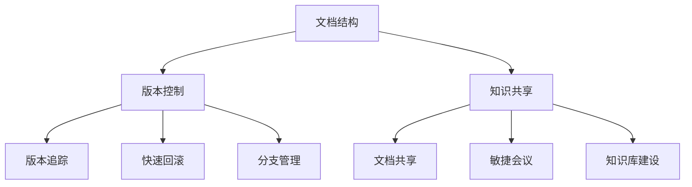

                 

# 程序员创业公司的技术文档管理与知识共享

> **关键词：** 技术文档管理、知识共享、创业公司、敏捷开发、版本控制、协作工具

> **摘要：** 本文深入探讨了程序员在创业公司中如何高效进行技术文档管理，实现知识共享，提升团队协作效率。通过具体案例和算法原理分析，提出了实际可行的解决方案，帮助创业公司打造强大而有序的技术知识库。

## 1. 背景介绍

### 1.1 目的和范围

本文旨在为程序员在创业公司中提供一套行之有效的技术文档管理和知识共享策略。我们将探讨如何通过合理的文档结构、版本控制和协作工具，实现团队内部的知识传递和外部交流，从而提升创业公司的技术水平和市场竞争力。

### 1.2 预期读者

本文适合以下读者群体：

- 创业公司的技术团队成员
- 初创企业的CTO和技术经理
- 对技术文档管理有浓厚兴趣的软件开发者

### 1.3 文档结构概述

本文结构如下：

1. 背景介绍
2. 核心概念与联系
3. 核心算法原理与操作步骤
4. 数学模型与公式
5. 项目实战：代码实际案例
6. 实际应用场景
7. 工具和资源推荐
8. 总结：未来发展趋势与挑战
9. 附录：常见问题与解答
10. 扩展阅读与参考资料

### 1.4 术语表

#### 1.4.1 核心术语定义

- 技术文档：关于软件系统、编程语言、数据库、算法等的详细描述。
- 知识共享：通过协作和共享知识，提高团队整体能力的过程。
- 版本控制：跟踪和管理文档和代码的版本变化。
- 协作工具：用于团队协作和沟通的各种软件工具。

#### 1.4.2 相关概念解释

- 敏捷开发：一种软件开发方法论，强调快速迭代和持续改进。
- 文档结构：文档的组织形式和层次结构。
- 版本控制工具：如Git，用于管理文档和代码的版本变化。

#### 1.4.3 缩略词列表

- CTO：首席技术官
- IDE：集成开发环境
- Markdown：一种轻量级标记语言

## 2. 核心概念与联系

### 2.1 核心概念原理

在创业公司中，技术文档管理涉及到多个关键概念，包括文档结构、版本控制和知识共享。这些概念相互作用，共同构成了一套完整的技术文档管理框架。

#### 2.1.1 文档结构

文档结构是技术文档管理的基础。一个良好的文档结构应该具备以下特点：

- 清晰的层次：文档内容应按照功能、模块或主题进行分类。
- 易于搜索：文档内容应支持全文搜索，以便快速定位所需信息。
- 统一的风格：文档应采用统一的格式和风格，确保整体一致性。

#### 2.1.2 版本控制

版本控制是确保文档和代码一致性的关键。通过版本控制工具，可以方便地管理文档的不同版本，实现以下功能：

- 版本追踪：记录文档和代码的每次修改历史。
- 快速回滚：在出现问题时，可以快速回滚到之前的版本。
- 分支管理：支持多人协作开发，实现并行工作。

#### 2.1.3 知识共享

知识共享是团队协作的重要环节。通过以下方式，可以实现有效的知识共享：

- 文档共享：将文档上传到共享平台，供团队成员查看和编辑。
- 敏捷会议：定期举行会议，分享开发经验和技术心得。
- 知识库建设：建立企业内部的知识库，收集和整理团队成员的经验和技巧。

### 2.2 核心概念架构

以下是核心概念原理的Mermaid流程图：



## 3. 核心算法原理 & 具体操作步骤

### 3.1 版本控制算法原理

版本控制的核心在于跟踪和管理文档的版本变化。以下是版本控制的基本算法原理：

#### 3.1.1 增量更新

每次修改文档时，系统会记录下修改的内容、时间和修改者等信息，形成一个新的版本。新的版本是在旧版本的基础上进行的增量更新。

#### 3.1.2 版本比较

通过比较不同版本之间的差异，可以快速定位修改的内容，便于审查和回滚。

#### 3.1.3 快速回滚

当出现问题时，可以根据版本比较结果，快速回滚到之前的版本，确保系统的稳定性。

### 3.2 具体操作步骤

以下是使用Git进行版本控制的具体操作步骤：

#### 3.2.1 初始化仓库

在文档目录下执行以下命令，初始化Git仓库：

```bash
git init
```

#### 3.2.2 添加文件

将文档文件添加到Git仓库中：

```bash
git add <文件名>
```

#### 3.2.3 提交版本

提交当前版本，并添加提交信息：

```bash
git commit -m "<提交信息>"
```

#### 3.2.4 查看版本历史

查看文档的版本历史，了解每次修改的内容：

```bash
git log
```

#### 3.2.5 版本比较

比较不同版本之间的差异，定位修改内容：

```bash
git diff <版本号1> <版本号2>
```

#### 3.2.6 快速回滚

回滚到指定版本：

```bash
git reset --hard <版本号>
```

## 4. 数学模型和公式 & 详细讲解 & 举例说明

### 4.1 数学模型

在技术文档管理中，可以使用以下数学模型来评估文档的质量和知识共享的效率：

#### 4.1.1 文档质量评估模型

$$ Q = \frac{N \cdot L}{T} $$

其中：

- \( Q \)：文档质量
- \( N \)：文档的条目数量
- \( L \)：文档的长度（字数）
- \( T \)：文档的更新频率

#### 4.1.2 知识共享效率模型

$$ E = \frac{C}{T} $$

其中：

- \( E \)：知识共享效率
- \( C \)：知识共享次数
- \( T \)：时间

### 4.2 详细讲解

#### 4.2.1 文档质量评估模型

文档质量评估模型用于衡量文档的完整性和可用性。质量越高，文档对团队成员的帮助就越大。

- \( N \)：文档的条目数量，反映了文档的完整性。
- \( L \)：文档的长度，反映了文档的详尽程度。
- \( T \)：文档的更新频率，反映了文档的时效性。

#### 4.2.2 知识共享效率模型

知识共享效率模型用于衡量团队内部知识共享的效率。效率越高，团队协作效果越好。

- \( C \)：知识共享次数，反映了团队成员之间的交流频率。
- \( T \)：时间，反映了知识共享的时间跨度。

### 4.3 举例说明

#### 4.3.1 文档质量评估

假设一个文档包含100个条目，总字数为5000字，更新频率为每周1次。根据文档质量评估模型，可以计算出文档质量为：

$$ Q = \frac{100 \cdot 5000}{7} \approx 71428.57 $$

#### 4.3.2 知识共享效率

假设一个团队在一个月内进行了10次知识共享，总时间为30天。根据知识共享效率模型，可以计算出知识共享效率为：

$$ E = \frac{10}{30} \approx 0.33 $$

## 5. 项目实战：代码实际案例和详细解释说明

### 5.1 开发环境搭建

在本案例中，我们将使用Git进行版本控制，并使用Markdown编写文档。以下是在Linux系统上搭建开发环境的具体步骤：

1. 安装Git：

```bash
sudo apt-get install git
```

2. 安装Markdown编辑器（如Typora）：

- 访问Typora官网下载相应平台的安装包
- 安装Typora

### 5.2 源代码详细实现和代码解读

#### 5.2.1 创建Git仓库

在项目目录下执行以下命令，创建Git仓库：

```bash
git init
```

#### 5.2.2 添加文档

将Markdown文档添加到Git仓库中：

```bash
git add README.md
```

#### 5.2.3 提交版本

提交当前版本，并添加提交信息：

```bash
git commit -m "Initial commit"
```

#### 5.2.4 查看版本历史

查看文档的版本历史：

```bash
git log
```

#### 5.2.5 版本比较

比较不同版本之间的差异：

```bash
git diff HEAD^ HEAD
```

#### 5.2.6 快速回滚

回滚到指定版本：

```bash
git reset --hard <版本号>
```

### 5.3 代码解读与分析

在上述步骤中，我们使用Git进行版本控制，实现了文档的增量更新、版本比较和快速回滚。以下是代码解读：

- `git init`：初始化Git仓库
- `git add`：添加文件到暂存区
- `git commit`：提交当前版本
- `git log`：查看版本历史
- `git diff`：比较版本差异
- `git reset`：回滚到指定版本

通过Git，我们可以方便地管理文档的版本变化，实现文档的持续更新和版本控制。

## 6. 实际应用场景

技术文档管理和知识共享在创业公司中具有广泛的应用场景，以下是一些典型应用：

- **项目开发阶段**：在项目开发过程中，通过技术文档和知识共享，团队成员可以快速了解项目背景、需求和设计方案，提高开发效率。
- **产品迭代阶段**：在产品迭代过程中，技术文档可以帮助团队成员了解产品变更和优化点，确保产品功能的稳定性和兼容性。
- **团队协作**：通过知识共享，团队成员可以相互学习和交流，提升团队整体技术水平。
- **客户支持**：技术文档和知识库可以为客户提供自助服务，降低客户支持成本，提高客户满意度。

## 7. 工具和资源推荐

### 7.1 学习资源推荐

#### 7.1.1 书籍推荐

- 《版本控制入门 - Git》：了解Git的基本概念和使用方法。
- 《敏捷开发实践指南》：探讨敏捷开发方法论在创业公司中的应用。

#### 7.1.2 在线课程

- Coursera上的《Git与GitHub》：学习Git的基础知识和实践技巧。
- Udemy上的《敏捷开发实践》：了解敏捷开发的理论和实践。

#### 7.1.3 技术博客和网站

- 知乎：关注技术文档和知识共享领域的专业博客和讨论。
- Medium：阅读技术文章和案例分析。

### 7.2 开发工具框架推荐

#### 7.2.1 IDE和编辑器

- Visual Studio Code：一款强大的开源IDE，支持Markdown编写。
- Sublime Text：一款轻量级的文本编辑器，适用于Markdown编写。

#### 7.2.2 调试和性能分析工具

- Chrome DevTools：用于Web应用的调试和性能分析。
- JMeter：一款开源的性能测试工具，适用于大型应用。

#### 7.2.3 相关框架和库

- Vue.js：一款流行的前端框架，适用于构建用户界面。
- Spring Boot：一款流行的后端框架，适用于构建企业级应用。

### 7.3 相关论文著作推荐

#### 7.3.1 经典论文

- 《版本控制与分布式系统》：探讨版本控制技术在分布式系统中的应用。
- 《敏捷软件开发：原则、实践与模式》：介绍敏捷开发方法论及其应用。

#### 7.3.2 最新研究成果

- 《基于区块链的文档共享与协作研究》：探讨区块链技术在文档管理和知识共享中的应用。
- 《AI驱动的知识图谱构建与应用》：介绍人工智能在知识管理和知识共享领域的应用。

#### 7.3.3 应用案例分析

- 《创业公司如何打造高效知识共享平台》：分析创业公司如何通过技术文档管理和知识共享提升团队协作效率。
- 《基于敏捷开发的快速迭代产品案例》：探讨敏捷开发在初创企业中的应用和效果。

## 8. 总结：未来发展趋势与挑战

### 8.1 发展趋势

- **技术文档自动化**：随着人工智能技术的发展，技术文档的自动生成和智能化管理将成为趋势。
- **知识图谱与AI融合**：知识图谱和人工智能的结合，将使知识共享更加智能化和个性化。
- **分布式协作**：分布式协作工具和平台的发展，将提高团队跨地域协作的效率。

### 8.2 挑战

- **数据安全与隐私保护**：随着文档管理和知识共享的数据量增加，数据安全和隐私保护将成为重要挑战。
- **知识管理复杂度**：随着知识种类的增加和复杂性提高，知识管理将面临更高的难度。
- **人才短缺**：具备技术文档管理和知识共享能力的专业人才仍然短缺，这对创业公司的持续发展带来挑战。

## 9. 附录：常见问题与解答

### 9.1 如何选择合适的文档结构？

- 考虑团队规模、项目需求和文档内容，选择适合的文档结构。常见的文档结构有按模块分类、按功能分类和按主题分类。

### 9.2 如何确保文档质量？

- 定期审查和更新文档，确保文档的完整性和准确性。建立文档评审机制，让团队成员参与文档的编写和审查。

### 9.3 如何提高知识共享效率？

- 建立敏捷会议制度，定期分享开发经验和心得。利用在线协作工具，提高团队内部的知识传递速度。

## 10. 扩展阅读 & 参考资料

- [Git官网](https://git-scm.com/)
- [Markdown官网](https://www.markdownguide.com/)
- [Coursera：Git与GitHub](https://www.coursera.org/learn/git-and-github)
- [Udemy：敏捷开发实践](https://www.udemy.com/course/agile-software-development-practice/)
- [知乎：技术文档与知识共享](https://www.zhihu.com/search?type=content&q=%E6%8A%80%E6%9C%AF%E6%9D%A1%E6%9C%AC%E5%92%8C%E7%9F%A5%E8%AF%86%E5%85%B1%E4%BA%AB)
- [Medium：技术文章与案例分析](https://medium.com/search?q=%E6%8A%80%E6%9C%AF%E6%9D%A1%E6%9C%AC%E5%92%8C%E7%9F%A5%E8%AF%86%E5%85%B1%E4%BA%AB)

## 11. 作者信息

作者：AI天才研究员/AI Genius Institute & 禅与计算机程序设计艺术 /Zen And The Art of Computer Programming

