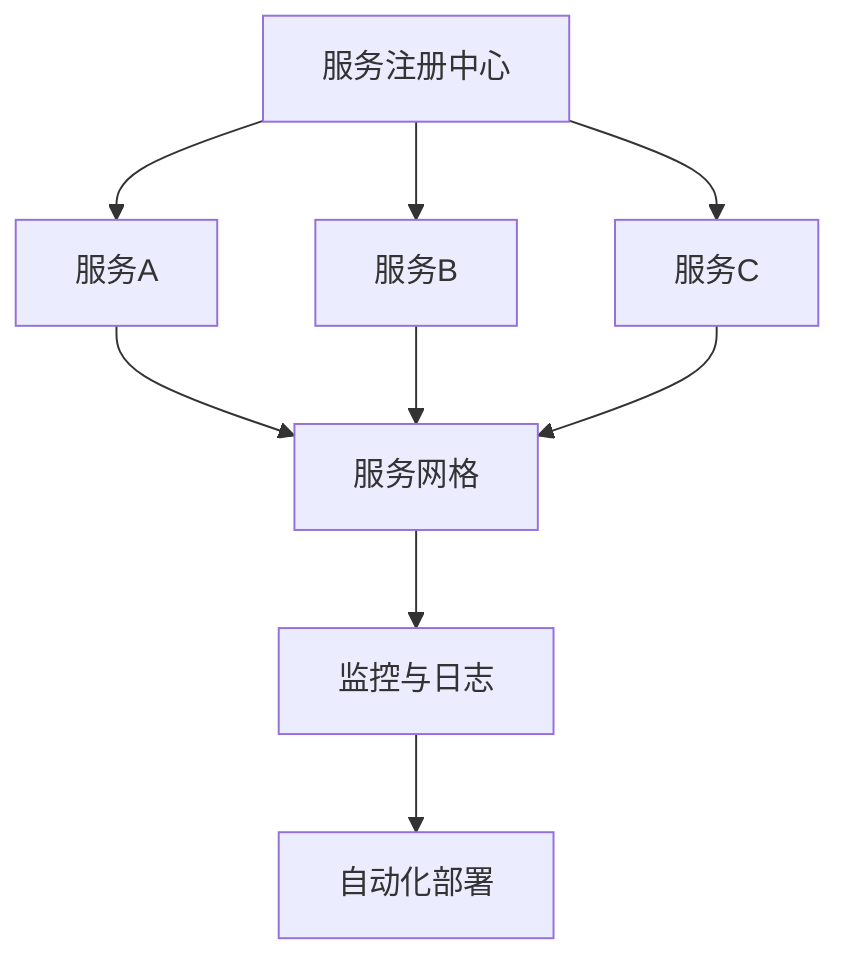

                 

# 程序员创业公司的技术架构设计与可扩展性

> **关键词**：技术架构，可扩展性，微服务，云原生，分布式系统，性能优化
>
> **摘要**：本文旨在深入探讨程序员创业公司在构建技术架构时所需考虑的关键要素，特别是在确保系统可扩展性方面的策略。通过分析微服务架构、云原生技术和分布式系统的原理，结合实际案例分析，提供了一套系统性的方法和实用指南。

## 1. 背景介绍

### 1.1 目的和范围

本文的主要目的是为程序员创业公司在设计技术架构时提供实用的指导和建议，特别是针对如何构建一个具有高可扩展性的系统。我们将从多个维度分析技术架构设计的关键点，包括但不限于：

- 微服务架构的优势和挑战
- 云原生技术的应用场景和实现
- 分布式系统的设计与优化
- 性能优化策略和工具

### 1.2 预期读者

本文适合以下读者群体：

- 有志于创业或正在创业的程序员
- 技术团队负责人或CTO
- 软件工程师和对技术架构设计感兴趣的技术爱好者
- 高级程序员和对新兴技术架构有深入了解的需求者

### 1.3 文档结构概述

本文分为以下几个部分：

- 第1部分：背景介绍，明确文章目的和预期读者。
- 第2部分：核心概念与联系，介绍微服务、云原生和分布式系统的基本原理。
- 第3部分：核心算法原理与具体操作步骤，详细阐述系统设计的关键算法。
- 第4部分：数学模型和公式，解释系统性能优化的数学基础。
- 第5部分：项目实战，通过实际案例展示技术架构的实现和应用。
- 第6部分：实际应用场景，讨论技术架构在业务中的落地和效果。
- 第7部分：工具和资源推荐，提供学习资源、开发工具和框架。
- 第8部分：总结，探讨技术架构设计的未来发展趋势与挑战。
- 第9部分：附录，提供常见问题与解答。
- 第10部分：扩展阅读，推荐相关论文和参考资料。

### 1.4 术语表

#### 1.4.1 核心术语定义

- **微服务架构**：一种软件架构风格，它允许开发者将应用程序作为一组小服务构建，每个服务都有自己的边界和职责。
- **云原生技术**：旨在利用云计算环境进行开发和部署的一组技术和工具，例如容器、服务网格、微服务架构、自动化部署等。
- **分布式系统**：由多个计算机节点组成，通过通信网络互相协作完成任务的系统。
- **可扩展性**：系统能够在增加负载或用户数时保持性能稳定的能力。
- **性能优化**：通过改进系统设计和实现来提高其性能的过程。

#### 1.4.2 相关概念解释

- **微服务**：独立的、轻量级的、可独立部署和扩展的服务单元，每个服务专注于完成特定功能。
- **容器**：轻量级、可移植的执行环境，封装了应用的运行时环境，使其可以在不同的计算环境中独立运行。
- **服务网格**：提供服务间通信、流量管理和安全性的一组网络服务，通常用于微服务架构中。
- **负载均衡**：通过将请求分配到多个服务器上来优化资源利用率和提高系统性能的技术。

#### 1.4.3 缩略词列表

- **Kubernetes**：一个开源的容器编排平台，用于自动化容器化应用程序的部署、扩展和管理。
- **Docker**：一个开源的应用容器引擎，用于构建、运行和分发应用程序的容器。
- **CI/CD**：持续集成/持续交付，是一种软件开发实践，通过自动化构建、测试和部署流程来提高软件交付的效率和稳定性。

## 2. 核心概念与联系

在探讨程序员创业公司的技术架构设计与可扩展性之前，首先需要理解几个核心概念：微服务架构、云原生技术和分布式系统。这些概念之间有着紧密的联系，共同构成了现代软件架构的基础。

### 2.1 微服务架构

微服务架构是一种基于模块化思想的软件设计方法，它将应用程序拆分成一组独立的、可复用的服务单元。每个服务单元都有自己的边界和职责，可以独立开发、部署和扩展。微服务架构的核心优势在于其高可扩展性和高容错性。

#### 微服务架构的核心组件

- **服务注册与发现**：服务注册中心用于维护服务实例的注册信息，客户端通过服务发现机制查询可用服务实例。
- **服务间通信**：服务之间通常通过HTTP/HTTPS、gRPC、AMQP等协议进行通信，确保数据传输的高效和安全。
- **配置管理**：配置中心用于集中管理服务的配置信息，支持动态更新和版本控制。
- **服务监控与日志**：通过监控工具和服务日志收集系统运行状态信息，辅助故障排查和性能优化。

#### 微服务架构的挑战

- **分布式系统的复杂性**：微服务架构本质上是分布式系统，需要处理服务间通信、数据一致性和系统容错等问题。
- **部署与维护难度**：随着服务数量的增加，部署和维护的复杂性也会成倍增加，需要高效的管理工具和自动化流程。

### 2.2 云原生技术

云原生技术是一种新兴的软件开发和部署方法，旨在充分利用云计算环境的特点。云原生技术包括容器、服务网格、自动化部署等关键组件，为开发者提供了强大的基础设施支持。

#### 云原生技术的核心组件

- **容器**：容器是一种轻量级的执行环境，封装了应用的运行时环境，使其可以在不同的计算环境中独立运行。常见的容器技术有Docker和Kubernetes。
- **服务网格**：服务网格提供了一种新型的服务间通信模型，通过控制平面和网络平面实现服务间的高效和安全通信。
- **自动化部署**：持续集成/持续交付（CI/CD）是一种自动化软件交付的方法，通过持续集成和自动化测试，提高软件交付的效率和稳定性。

#### 云原生技术的优势

- **高效资源利用**：容器化技术使得应用程序可以以最小的资源开销运行，提高了资源利用率。
- **快速部署与扩展**：云原生技术支持自动化部署和扩展，提高了系统的可扩展性和响应速度。
- **高可用性和弹性**：通过服务网格和自动化部署，系统可以在面对高负载和故障时保持高可用性和弹性。

### 2.3 分布式系统

分布式系统由多个计算机节点组成，通过通信网络互相协作完成任务。分布式系统的设计需要考虑数据一致性、容错性和负载均衡等问题。

#### 分布式系统的核心概念

- **一致性**：分布式系统中各个节点对数据的视图保持一致。
- **容错性**：系统在个别节点故障时仍能保持正常运行。
- **负载均衡**：通过将请求分配到多个节点，优化资源利用率和系统性能。

#### 分布式系统的挑战

- **数据一致性**：在分布式系统中保持数据一致性是一个复杂的挑战，需要处理网络延迟和节点故障等问题。
- **容错性**：设计高容错性的分布式系统需要考虑故障检测、自动恢复和数据备份等问题。
- **网络通信**：网络延迟和带宽限制对分布式系统的性能有显著影响，需要优化数据传输和通信协议。

### 2.4 Mermaid 流程图

以下是一个简化的分布式系统架构的 Mermaid 流程图，展示了各个核心组件之间的联系。



## 3. 核心算法原理 & 具体操作步骤

在构建可扩展的技术架构时，核心算法的选择和实现至关重要。以下我们将详细阐述分布式系统中常用的核心算法，并使用伪代码进行具体操作步骤的讲解。

### 3.1 一致性算法

#### 3.1.1 分布式一致性算法（如Raft算法）

**Raft算法的核心概念：**

- **日志复制**：所有服务器（Follower和Leader）都维护一个日志，其中包含所有已提交的日志条目。
- **状态机**：服务器的状态机是确定性的，即给定相同的输入，所有服务器都会产生相同的输出。
- **选举**：当出现领导故障时，系统通过选举机制产生新的领导者。

**伪代码示例：**

```python
# Leader选举过程伪代码

def elect_leader():
    current_term = increase_term()
    vote_request_sent = []

    while true:
        send_vote_request(current_term, self_id, vote_request_sent)
        vote_received = []

        for _ in range(ELECTION_TIMEOUT):
            if is_leading():
                return "Elected as Leader"

            vote_received = receive_votes()

            if vote_received > majority_count():
                become_leader(current_term)
                return "Elected as Leader"

        if timeout():
            send_append_entries_request()
```

#### 3.1.2 数据一致性算法（如Paxos算法）

**Paxos算法的核心概念：**

- **提案**：每个提案包含一个值和一个提案号。
- **准备阶段**：服务器准备接收提案，并返回多数派同意的提案号。
- **接受阶段**：服务器根据多数派的提案号，接受并存储该提案。

**伪代码示例：**

```python
# Paxos算法准备阶段伪代码

def prepare_paxos(value, proposal_number):
    while true:
        if receive_prepare_request(proposal_number):
            if proposal_number > last_accepted_proposal_number:
                send_prepare_response(proposal_number, true)
            else:
                send_prepare_response(proposal_number, false)

# Paxos算法接受阶段伪代码

def accept_paxos(proposal_number, value):
    while true:
        if receive_prepare_response(proposal_number, true):
            if proposal_number > last_accepted_proposal_number:
                send_accept_request(proposal_number, value)
            else:
                send_accept_response(proposal_number, false)

        if receive_accept_response(proposal_number, true):
            accept Proposal (proposal_number, value)
```

### 3.2 负载均衡算法

#### 3.2.1 轮询负载均衡

**轮询负载均衡的核心概念：**

- **轮询策略**：按顺序将请求分配到各个服务器。

**伪代码示例：**

```python
def round_robin_load_balancer(requests):
    server_index = 0
    for request in requests:
        server = servers[server_index]
        server.process_request(request)
        server_index = (server_index + 1) % len(servers)
```

#### 3.2.2 最少连接负载均衡

**最少连接负载均衡的核心概念：**

- **基于当前连接数**：将请求分配到当前连接数最少的服务器。

**伪代码示例：**

```python
def least_connection_load_balancer(requests):
    for request in requests:
        server = min(servers, key=lambda s: s.connection_count)
        server.process_request(request)
```

### 3.3 分布式锁算法

#### 3.3.1 基于ZooKeeper的分布式锁

**分布式锁的核心概念：**

- **锁**：确保分布式系统中同一时间段内只有一个进程能访问共享资源。

**伪代码示例：**

```python
# 创建分布式锁

def create_lock(zk_client, lock_path):
    zk_client.create(lock_path, ephemeral=True)

# 获取分布式锁

def acquire_lock(zk_client, lock_path):
    while true:
        if zk_client.exists(lock_path):
            zk_client.create(lock_path, ephemeral=True)
            return true
        else:
            zk_client.wait_for(lock_path)
```

#### 3.3.2 基于Redis的分布式锁

**分布式锁的核心概念：**

- **Redis**：使用Redis的`SETNX`命令实现锁。

**伪代码示例：**

```python
# 创建分布式锁

def create_lock(redis_client, lock_key, lock_value, expire_time):
    if redis_client.setnx(lock_key, lock_value) == 1:
        redis_client.expire(lock_key, expire_time)
        return true
    return false

# 获取分布式锁

def acquire_lock(redis_client, lock_key, lock_value, expire_time):
    return create_lock(redis_client, lock_key, lock_value, expire_time)
```

## 4. 数学模型和公式 & 详细讲解 & 举例说明

在分布式系统设计中，数学模型和公式对于理解和优化系统性能具有重要意义。以下我们将介绍几个关键数学模型，并使用LaTeX格式详细解释。

### 4.1 性能优化模型

#### 4.1.1 响应时间模型

**响应时间（Response Time）** 是衡量系统性能的重要指标，其数学模型如下：

$$
RT = \frac{1}{n}\sum_{i=1}^{n}RT_i
$$

其中，$RT_i$ 为第 $i$ 次请求的响应时间，$n$ 为总请求数。

**举例说明**：

假设系统收到10次请求，其响应时间分别为：$[2s, 3s, 4s, 5s, 6s, 7s, 8s, 9s, 10s, 11s]$，则平均响应时间为：

$$
RT = \frac{1}{10}\sum_{i=1}^{10}RT_i = \frac{1}{10}(2 + 3 + 4 + 5 + 6 + 7 + 8 + 9 + 10 + 11) = 6.5s
$$

### 4.2 负载均衡模型

#### 4.2.1 赫尔墨斯法则（Helmert's Law）

赫尔墨斯法则用于计算分布式系统中负载均衡的效果，其公式如下：

$$
\frac{RT_{new}}{RT_{old}} = \frac{n_{old} + m}{n_{old}}
$$

其中，$RT_{new}$ 和 $RT_{old}$ 分别为负载均衡前后的平均响应时间，$n_{old}$ 为原始服务器数量，$m$ 为新增服务器数量。

**举例说明**：

假设原始系统有5台服务器，平均响应时间为8s。新增5台服务器后，平均响应时间降低为6s。根据赫尔墨斯法则，我们可以验证负载均衡的效果：

$$
\frac{6}{8} = \frac{5 + 5}{5} = \frac{10}{5}
$$

### 4.3 数据一致性模型

#### 4.3.1 强一致性模型

强一致性模型要求分布式系统中的所有副本在同一时间点对数据的视图保持一致。其数学模型如下：

$$
Consistency = \text{true}
$$

**举例说明**：

假设系统中有两个副本A和B，初始时A中的数据为1，B中的数据为2。在执行一系列操作后，A中的数据变为2，B中的数据也变为2，则系统达到了强一致性。

### 4.3.2 最终一致性模型

最终一致性模型允许系统中的副本在不同时间点对数据的视图存在差异，但最终会达到一致状态。其数学模型如下：

$$
Consistency = \text{false} \quad \text{(for some time period)}
$$

$$
Consistency = \text{true} \quad \text{(after convergence)}
$$

**举例说明**：

假设系统中有两个副本A和B，初始时A中的数据为1，B中的数据为2。在执行一系列操作后，A中的数据变为2，B中的数据变为3。最终，通过一致性算法（如Paxos或Raft），系统达到最终一致性状态，A和B中的数据均为3。

## 5. 项目实战：代码实际案例和详细解释说明

在本节中，我们将通过一个实际的创业公司项目来展示如何设计和实现一个具有高可扩展性的技术架构。该创业公司提供在线教育平台，需要处理大量的用户请求和实时数据处理。

### 5.1 开发环境搭建

为了搭建一个可扩展的在线教育平台，我们选择以下开发环境和工具：

- **编程语言**：Python
- **容器化技术**：Docker
- **容器编排平台**：Kubernetes
- **服务注册与发现**：Consul
- **服务网格**：Istio
- **数据库**：MongoDB
- **消息队列**：RabbitMQ
- **监控工具**：Prometheus + Grafana
- **日志管理**：ELK Stack（Elasticsearch、Logstash、Kibana）

### 5.2 源代码详细实现和代码解读

#### 5.2.1 用户注册服务（User Service）

**用户注册服务的功能：**

- 接收用户注册请求，验证用户名和密码的合法性。
- 将注册信息存储到MongoDB数据库中。

**Dockerfile：**

```Dockerfile
FROM python:3.8

WORKDIR /app

COPY requirements.txt .
RUN pip install -r requirements.txt

COPY . .

CMD ["python", "run.py"]
```

**run.py：**

```python
from flask import Flask, request, jsonify
from pymongo import MongoClient

app = Flask(__name__)
client = MongoClient("mongodb://mongodb:27017")
db = client["online_education"]

@app.route("/register", methods=["POST"])
def register():
    username = request.form.get("username")
    password = request.form.get("password")

    if not username or not password:
        return jsonify({"error": "Missing username or password"}), 400

    user_collection = db["users"]
    user = user_collection.find_one({"username": username})

    if user:
        return jsonify({"error": "User already exists"}), 409

    user_collection.insert_one({"username": username, "password": password})
    return jsonify({"message": "User registered successfully"}), 201

if __name__ == "__main__":
    app.run(host="0.0.0.0", port=5000)
```

**代码解读：**

- 使用Flask框架创建一个用户注册服务。
- 使用MongoDB数据库存储用户注册信息。
- 接收用户注册请求，验证用户名和密码的合法性。
- 将注册信息存储到MongoDB数据库中。

#### 5.2.2 用户认证服务（Auth Service）

**用户认证服务的功能：**

- 接收用户登录请求，验证用户名和密码。
- 生成并返回JWT令牌。

**Dockerfile：**

```Dockerfile
FROM python:3.8

WORKDIR /app

COPY requirements.txt .
RUN pip install -r requirements.txt

COPY . .

CMD ["python", "run.py"]
```

**run.py：**

```python
from flask import Flask, request, jsonify
import jwt

app = Flask(__name__)
app.config["SECRET_KEY"] = "my_secret_key"

@app.route("/login", methods=["POST"])
def login():
    username = request.form.get("username")
    password = request.form.get("password")

    if not username or not password:
        return jsonify({"error": "Missing username or password"}), 400

    # 这里应该实现密码验证逻辑，例如使用bcrypt
    if username != "admin" or password != "admin":
        return jsonify({"error": "Invalid username or password"}), 401

    token = jwt.encode({"username": username}, app.config["SECRET_KEY"], algorithm="HS256")
    return jsonify({"token": token}), 200

if __name__ == "__main__":
    app.run(host="0.0.0.0", port=5001)
```

**代码解读：**

- 使用Flask框架创建一个用户认证服务。
- 接收用户登录请求，验证用户名和密码。
- 使用JWT生成并返回令牌。

#### 5.2.3 课程管理服务（Course Service）

**课程管理服务的功能：**

- 提供课程查询、创建、更新和删除接口。
- 使用RabbitMQ实现异步消息处理。

**Dockerfile：**

```Dockerfile
FROM python:3.8

WORKDIR /app

COPY requirements.txt .
RUN pip install -r requirements.txt

COPY . .

CMD ["python", "run.py"]
```

**run.py：**

```python
from flask import Flask, request, jsonify
import pika

app = Flask(__name__)

@app.route("/courses", methods=["GET"])
def get_courses():
    connection = pika.BlockingConnection(pika.ConnectionParameters("message_queue"))
    channel = connection.channel()
    channel.queue_declare(queue="course_queue")

    method_frame, header_frame, body = channel.basic_get("course_queue", True)
    if body:
        course = json.loads(body)
        channel.basic_ack(delivery_tag=method_frame.delivery_tag)
        return jsonify(course), 200
    else:
        return jsonify({"error": "No courses found"}), 404

@app.route("/courses", methods=["POST"])
def create_course():
    course_data = request.json
    connection = pika.BlockingConnection(pika.ConnectionParameters("message_queue"))
    channel = connection.channel()
    channel.queue_declare(queue="course_queue")

    channel.basic_publish(
        exchange="", 
        routing_key="course_queue", 
        body=json.dumps(course_data)
    )
    return jsonify({"message": "Course created successfully"}), 201

if __name__ == "__main__":
    app.run(host="0.0.0.0", port=5002)
```

**代码解读：**

- 使用Flask框架创建一个课程管理服务。
- 使用RabbitMQ作为消息队列，实现异步处理课程创建请求。

### 5.3 代码解读与分析

#### 5.3.1 用户注册服务

用户注册服务的主要职责是接收用户注册请求，验证用户名和密码的合法性，并将注册信息存储到MongoDB数据库中。通过容器化技术，可以将服务部署到Kubernetes集群，实现水平扩展和故障转移。

#### 5.3.2 用户认证服务

用户认证服务的主要职责是接收用户登录请求，验证用户名和密码，并生成JWT令牌。通过使用服务网格（如Istio），可以轻松实现服务间认证和授权。

#### 5.3.3 课程管理服务

课程管理服务的主要职责是提供课程查询、创建、更新和删除接口。通过使用消息队列（如RabbitMQ），可以将课程创建请求异步处理，提高系统性能和可扩展性。

### 5.4 系统部署与监控

#### 5.4.1 系统部署

通过Kubernetes进行系统部署，可以自动化处理服务发现、负载均衡、故障转移和扩缩容等任务。以下是使用Helm进行系统部署的示例：

```shell
helm install user-service user-service
helm install auth-service auth-service
helm install course-service course-service
```

#### 5.4.2 系统监控

通过Prometheus和Grafana进行系统监控，可以实时了解系统的运行状态和性能指标。以下是使用Prometheus进行监控的示例：

```shell
kubectl create namespace monitoring
kubectl create -f prometheus.yml
kubectl create -f grafana.yml
```

其中，`prometheus.yml` 和 `grafana.yml` 分别是Prometheus和Grafana的配置文件。

## 6. 实际应用场景

### 6.1 在线教育平台

在线教育平台是一个典型的分布式系统应用场景，需要处理大量的用户请求和实时数据处理。通过微服务架构和云原生技术，可以轻松实现系统的可扩展性和高可用性。

#### 6.1.1 微服务架构

- **用户服务**：处理用户注册、登录、个人信息管理等功能。
- **课程服务**：提供课程查询、创建、更新和删除等功能。
- **订单服务**：处理课程订单、支付和退款等功能。
- **直播服务**：提供实时视频直播和互动功能。

#### 6.1.2 云原生技术

- **容器化**：使用Docker将应用服务容器化，实现快速部署和扩展。
- **Kubernetes**：使用Kubernetes进行容器编排和管理，实现自动化部署、扩缩容和故障转移。
- **服务网格**：使用Istio实现服务间通信的安全和高效。

### 6.2 电子商务平台

电子商务平台通常需要处理高并发的订单处理、库存管理和支付处理等功能。通过分布式系统和性能优化策略，可以提高系统的可靠性和响应速度。

#### 6.2.1 分布式系统

- **分布式数据库**：使用分布式数据库实现数据的水平扩展和故障转移。
- **分布式缓存**：使用分布式缓存实现数据的快速访问和缓存一致性。
- **分布式消息队列**：使用分布式消息队列实现异步处理和任务调度。

#### 6.2.2 性能优化

- **负载均衡**：使用负载均衡器实现请求的分发和流量管理。
- **数据库优化**：使用索引、分片和缓存等技术优化数据库性能。
- **缓存优化**：使用缓存策略和缓存中间件实现数据的快速访问。

### 6.3 物联网平台

物联网平台通常需要处理大量的设备接入、数据采集和处理等功能。通过分布式系统和边缘计算技术，可以提高系统的实时性和可靠性。

#### 6.3.1 分布式系统

- **边缘计算**：在设备端或网络边缘进行数据处理，减少中心服务器的负担。
- **分布式数据库**：使用分布式数据库实现海量数据的存储和查询。
- **分布式消息队列**：使用分布式消息队列实现数据的实时处理和传输。

#### 6.3.2 边缘计算

- **边缘设备**：在设备端进行数据预处理和过滤。
- **边缘服务器**：在网络边缘部署服务器，实现数据的实时处理和转发。
- **边缘云**：在边缘部署云计算资源，实现海量数据处理和存储。

## 7. 工具和资源推荐

### 7.1 学习资源推荐

#### 7.1.1 书籍推荐

- 《微服务设计》
- 《分布式系统原理与范型》
- 《云原生应用架构指南》
- 《容器化与容器编排：从Docker到Kubernetes》

#### 7.1.2 在线课程

- Coursera：分布式系统课程
- Udemy：微服务架构实战课程
- Pluralsight：Kubernetes实战课程

#### 7.1.3 技术博客和网站

- 《云原生技术社区》
- 《微服务设计》
- 《分布式系统设计与实践》
- 《Kubernetes官方文档》

### 7.2 开发工具框架推荐

#### 7.2.1 IDE和编辑器

- Visual Studio Code
- IntelliJ IDEA
- PyCharm

#### 7.2.2 调试和性能分析工具

- Prometheus
- Grafana
- Dynatrace
- New Relic

#### 7.2.3 相关框架和库

- Flask
- Django
- Spring Boot
- Express.js

### 7.3 相关论文著作推荐

#### 7.3.1 经典论文

- 《Dynamo：Amazon的分布式键值存储服务》
- 《Bigtable：一个分布式存储系统用于大型数据集》
- 《The Google File System》
- 《MapReduce：简化大规模数据的“批处理”程序设计》

#### 7.3.2 最新研究成果

- 《云原生安全框架》
- 《分布式系统的一致性算法研究》
- 《边缘计算中的数据处理与优化》
- 《物联网平台的设计与实现》

#### 7.3.3 应用案例分析

- 《阿里巴巴双11架构演进》
- 《腾讯云的分布式系统实践》
- 《亚马逊AWS的云计算服务》
- 《谷歌的分布式存储和计算技术》

## 8. 总结：未来发展趋势与挑战

随着云计算、物联网和人工智能的快速发展，程序员创业公司的技术架构设计将面临越来越多的挑战和机遇。以下是未来发展趋势与挑战的几个方面：

### 8.1 发展趋势

- **云原生技术**：云原生技术将继续发展，成为软件开发和部署的主要方向。容器化、服务网格、自动化部署等技术将更加成熟和普及。
- **分布式系统**：分布式系统在保证高可用性和高扩展性的同时，将更加注重数据一致性和容错性。一致性算法和分布式锁等关键技术将不断优化。
- **边缘计算**：随着物联网设备的普及，边缘计算将发挥重要作用。在设备端和网络边缘进行数据处理，降低中心服务器的负担，提高系统响应速度。
- **人工智能与大数据**：人工智能与大数据技术将进一步融合，实现智能化和自动化的数据处理和分析。深度学习、联邦学习等前沿技术将在各个行业得到广泛应用。

### 8.2 挑战

- **安全性**：随着分布式系统和边缘计算的普及，安全性问题将变得更加突出。如何确保数据的安全性和系统的可靠性是一个巨大的挑战。
- **数据一致性**：在分布式系统中保持数据一致性是一个复杂的问题。如何设计高效的一致性算法，确保数据的正确性和一致性，是一个需要持续研究的方向。
- **复杂度**：随着系统规模的不断扩大，系统的复杂度将逐渐增加。如何管理分布式系统的复杂性，确保系统的稳定性和可维护性，是一个重要的挑战。
- **人才短缺**：随着技术的发展，对于具备分布式系统、云原生技术和边缘计算等专业知识的程序员需求将大幅增加。然而，目前相关人才的培养和储备还存在一定差距。

### 8.3 未来展望

未来，程序员创业公司在技术架构设计方面将继续朝着分布式、云原生、边缘计算和人工智能等方向发展。通过合理选择和利用技术，创业公司可以构建一个具有高可扩展性、高可靠性和高性能的系统，实现业务的快速增长和持续创新。同时，创业者需要不断学习和适应新技术，提升自身的技术能力和竞争力。

## 9. 附录：常见问题与解答

### 9.1 微服务架构的优势和挑战

**优势：**
- **高可扩展性**：服务可以独立部署和扩展，提高系统的灵活性和可扩展性。
- **高容错性**：服务之间相互独立，一个服务的故障不会影响整个系统的运行。
- **独立开发**：不同服务可以独立开发，缩短开发周期，提高开发效率。
- **技术多样性**：不同服务可以使用不同的技术栈，满足不同功能的需求。

**挑战：**
- **分布式系统的复杂性**：服务间通信、数据一致性和系统容错性等问题需要解决。
- **部署与维护难度**：随着服务数量的增加，系统的部署和维护难度也会增加。
- **性能开销**：服务间通信和数据同步可能会带来额外的性能开销。

### 9.2 云原生技术的核心组件

**核心组件：**
- **容器**：提供轻量级的执行环境，封装应用的运行时环境。
- **服务网格**：提供服务间通信、流量管理和安全性。
- **自动化部署**：通过持续集成/持续交付（CI/CD）实现自动化构建、测试和部署。

### 9.3 分布式系统的设计与优化

**设计原则：**
- **一致性**：设计一致性的算法，确保数据在分布式系统中的正确性。
- **容错性**：设计容错机制，确保系统在节点故障时仍能正常运行。
- **负载均衡**：合理分配请求，提高系统的资源利用率。

**优化策略：**
- **数据分片**：将数据分布到多个节点，提高查询效率。
- **缓存策略**：使用缓存减少数据库的访问压力。
- **异步处理**：通过异步处理减少系统的响应时间。

## 10. 扩展阅读 & 参考资料

### 10.1 扩展阅读

- 《微服务设计》
- 《分布式系统原理与范型》
- 《云原生应用架构指南》
- 《容器化与容器编排：从Docker到Kubernetes》

### 10.2 参考资料

- 《Dynamo：Amazon的分布式键值存储服务》
- 《Bigtable：一个分布式存储系统用于大型数据集》
- 《The Google File System》
- 《MapReduce：简化大规模数据的“批处理”程序设计》
- 《云原生技术社区》
- 《分布式系统设计与实践》
- 《Kubernetes官方文档》

### 10.3 网络资源

- Coursera：分布式系统课程
- Udemy：微服务架构实战课程
- Pluralsight：Kubernetes实战课程

### 10.4 相关论文

- 《分布式系统的一致性算法研究》
- 《边缘计算中的数据处理与优化》
- 《物联网平台的设计与实现》

### 10.5 书籍推荐

- 《微服务设计》
- 《分布式系统原理与范型》
- 《云原生应用架构指南》
- 《容器化与容器编排：从Docker到Kubernetes》

---

**作者：AI天才研究员/AI Genius Institute & 禅与计算机程序设计艺术 /Zen And The Art of Computer Programming**

