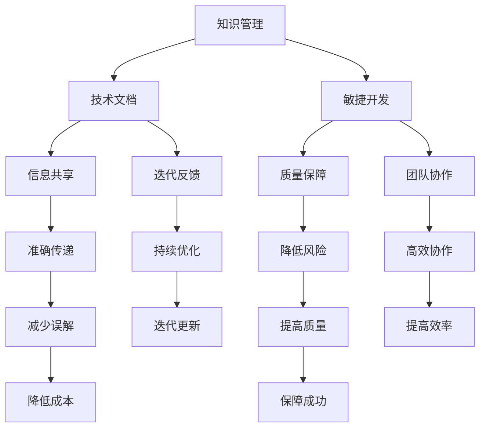
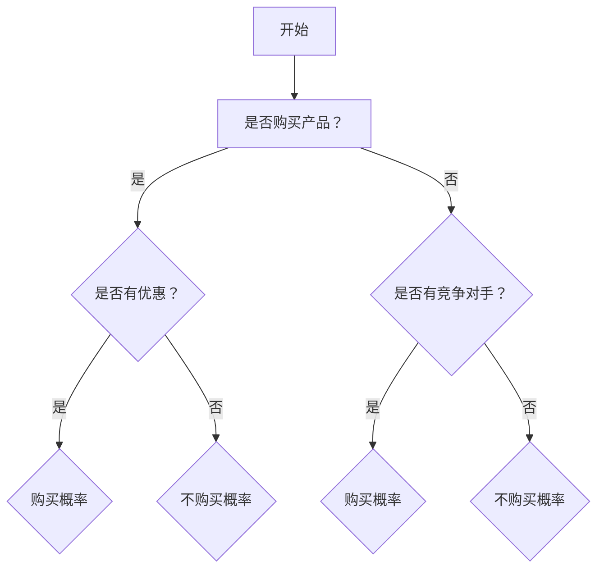

                 

# 程序员创业公司的知识管理与技术文档体系

## 概述

> **关键词**：知识管理，技术文档，创业公司，敏捷开发，信息共享，质量保障

> **摘要**：本文旨在探讨程序员创业公司如何建立有效的知识管理和技术文档体系。我们将从背景介绍、核心概念、算法原理、数学模型、项目实战、实际应用场景等多个维度，逐步阐述如何通过知识管理和技术文档体系提升创业公司的开发效率、团队协作和项目质量。文章还将推荐相关学习资源和工具，为创业公司提供实用的指导。

## 1. 背景介绍

### 1.1 目的和范围

本文的目的在于为程序员创业公司提供一套切实可行的知识管理和技术文档体系，以支持公司的持续发展。我们将探讨以下关键问题：

- **知识管理的重要性**：如何有效收集、整理和利用公司内部的知识资源？
- **技术文档的作用**：如何编写和维护高质量的技术文档，以提高团队协作和项目成功率？
- **敏捷开发与知识管理的关系**：如何在敏捷开发过程中融合知识管理，实现高效的项目推进？
- **信息共享与质量保障**：如何确保技术文档的准确性和完整性，提高团队整体技术水平？

本文将涵盖以下几个主要方面：

- **核心概念与联系**：介绍知识管理和技术文档体系的基本概念及其相互关系。
- **算法原理与具体操作步骤**：讲解核心算法的原理和具体实施步骤。
- **数学模型与公式**：介绍相关的数学模型和公式，并提供详细讲解和实例说明。
- **项目实战**：通过实际案例展示知识管理和技术文档体系的实际应用。
- **实际应用场景**：分析知识管理和技术文档体系在各类开发场景中的应用。
- **工具和资源推荐**：推荐学习资源、开发工具和框架，以支持创业公司的发展。

### 1.2 预期读者

本文的预期读者包括：

- **程序员创业公司的创始人**：了解如何建立有效的知识管理和技术文档体系，以支持公司发展。
- **技术团队成员**：掌握知识管理和技术文档编写的方法，提高团队协作效率。
- **项目经理**：理解知识管理和技术文档在项目推进中的重要作用，提升项目质量。

### 1.3 文档结构概述

本文结构如下：

1. **背景介绍**：介绍本文的目的、预期读者和文档结构。
2. **核心概念与联系**：阐述知识管理和技术文档体系的基本概念及其相互关系。
3. **核心算法原理与具体操作步骤**：讲解核心算法的原理和具体实施步骤。
4. **数学模型与公式**：介绍相关的数学模型和公式，并提供详细讲解和实例说明。
5. **项目实战**：通过实际案例展示知识管理和技术文档体系的实际应用。
6. **实际应用场景**：分析知识管理和技术文档体系在各类开发场景中的应用。
7. **工具和资源推荐**：推荐学习资源、开发工具和框架，以支持创业公司的发展。
8. **总结**：总结本文的主要观点，并展望未来发展趋势与挑战。
9. **附录**：常见问题与解答。
10. **扩展阅读与参考资料**：提供相关文献和资料，供读者进一步学习。

### 1.4 术语表

#### 1.4.1 核心术语定义

- **知识管理**：指通过识别、收集、组织、存储、共享和应用知识，以提高组织竞争力的过程。
- **技术文档**：描述软件开发过程中产生的各类文档，包括设计文档、用户手册、API文档等。
- **敏捷开发**：一种软件开发方法，强调快速响应变化、持续交付价值和高效团队协作。
- **信息共享**：团队成员之间共享知识和信息，以提高团队整体协作效率和项目成功率。
- **质量保障**：确保技术文档的准确性和完整性，从而提高项目质量。

#### 1.4.2 相关概念解释

- **知识共享平台**：用于存储、管理和共享公司内部知识的在线平台。
- **版本控制系统**：用于管理和跟踪代码和文档版本的软件工具。
- **代码审查**：团队成员对代码和文档进行审查，以确保其质量。

#### 1.4.3 缩略词列表

- **Scrum**：敏捷开发框架
- **Git**：版本控制系统
- **API**：应用程序接口

## 2. 核心概念与联系

在程序员创业公司中，知识管理和技术文档体系是支持公司持续发展的关键。本文将介绍核心概念，并使用 Mermaid 流程图展示各概念之间的联系。

### 2.1 知识管理

知识管理是指通过识别、收集、组织、存储、共享和应用知识，以提高组织竞争力的过程。在创业公司中，知识管理有助于：

- **经验传承**：确保团队成员能够快速掌握现有知识，提高工作效率。
- **创新驱动**：激发团队成员的创造力，促进公司持续发展。
- **决策支持**：为管理层提供科学、全面的数据支持，提高决策质量。

### 2.2 技术文档

技术文档是描述软件开发过程中产生的各类文档，包括设计文档、用户手册、API 文档等。技术文档在创业公司中具有以下作用：

- **知识传递**：确保团队成员能够快速了解项目背景、设计思路和实现细节。
- **团队协作**：提高团队内部沟通效率，减少因信息不对称导致的误解和错误。
- **代码维护**：帮助开发者理解和修改现有代码，降低维护成本。

### 2.3 敏捷开发

敏捷开发是一种软件开发方法，强调快速响应变化、持续交付价值和高效团队协作。敏捷开发与知识管理和技术文档的关系如下：

- **知识共享**：敏捷开发强调团队成员之间的紧密协作，有助于知识共享。
- **迭代反馈**：通过迭代开发，及时收集用户反馈，不断优化技术文档。

### 2.4 信息共享与质量保障

信息共享和质量保障是确保知识管理和技术文档体系有效运行的关键。以下为 Mermaid 流程图，展示各概念之间的联系：



## 3. 核心算法原理 & 具体操作步骤

### 3.1 核心算法原理

在程序员创业公司的知识管理和技术文档体系中，核心算法原理主要包括知识采集、知识组织和知识共享。以下为各个核心算法原理的详细描述：

#### 3.1.1 知识采集

知识采集是指从各种渠道收集公司内部的知识资源。具体步骤如下：

1. **识别知识源**：确定公司内部的知识来源，如项目文档、开发日志、团队讨论等。
2. **数据采集**：使用爬虫、数据挖掘等技术，从各个知识源中提取有价值的信息。
3. **数据清洗**：对采集到的数据进行清洗和去重，确保数据的准确性和一致性。

#### 3.1.2 知识组织

知识组织是指对采集到的知识进行分类、整理和结构化。具体步骤如下：

1. **知识分类**：根据知识内容，将其分为不同的类别，如技术知识、业务知识等。
2. **知识标签**：为每个知识项添加标签，以便于快速检索和定位。
3. **知识结构化**：使用知识图谱等技术，构建知识体系，实现知识的关联和整合。

#### 3.1.3 知识共享

知识共享是指将组织内部的知识资源进行共享，以提高团队协作效率和项目成功率。具体步骤如下：

1. **建立知识共享平台**：选择合适的知识共享平台，如知识库、Wiki 等。
2. **知识发布**：将整理好的知识资源发布到知识共享平台上，供团队成员查阅。
3. **知识更新**：定期更新知识资源，确保知识内容与项目进展同步。

### 3.2 具体操作步骤

以下为知识管理和技术文档体系的具体操作步骤：

#### 3.2.1 知识采集

1. **项目启动会议**：在项目启动会议上，明确项目目标和团队成员分工，收集项目相关文档和资料。
2. **开发日志**：要求团队成员在项目开发过程中，记录开发日志，包括遇到的问题、解决方案和心得体会。
3. **团队讨论**：定期组织团队讨论，分享项目经验和知识。

#### 3.2.2 知识组织

1. **知识分类**：根据项目特点和需求，将知识分为技术知识、业务知识、项目管理等类别。
2. **知识标签**：为每个知识项添加标签，如技术框架、数据库设计、算法等。
3. **知识结构化**：使用知识图谱等技术，构建知识体系，实现知识的关联和整合。

#### 3.2.3 知识共享

1. **知识库建设**：建立公司内部知识库，将整理好的知识资源上传到知识库中。
2. **Wiki 维护**：使用 Wiki 等工具，建立项目文档库，方便团队成员查阅和更新。
3. **知识更新**：定期更新知识库和 Wiki，确保知识内容与项目进展同步。

#### 3.2.4 技术文档编写

1. **文档模板**：制定统一的文档模板，包括设计文档、用户手册、API 文档等。
2. **文档编写**：按照模板要求，编写详细的技术文档，包括项目背景、设计思路、实现细节等。
3. **文档审核**：组织团队成员对文档进行审核，确保文档的准确性和完整性。

#### 3.2.5 信息共享与质量保障

1. **代码审查**：实施代码审查，确保代码质量。
2. **文档审查**：组织团队成员对技术文档进行审查，确保文档的准确性和完整性。
3. **反馈机制**：建立反馈机制，收集团队成员对知识管理和技术文档的意见和建议，持续优化。

## 4. 数学模型和公式 & 详细讲解 & 举例说明

在程序员创业公司的知识管理和技术文档体系中，数学模型和公式起到了关键作用。以下为几个常用的数学模型和公式的详细讲解以及举例说明。

### 4.1 贝叶斯定理

贝叶斯定理是一种用于概率推断的数学模型，其公式为：

$$ P(A|B) = \frac{P(B|A) \cdot P(A)}{P(B)} $$

其中，$P(A|B)$ 表示在事件 $B$ 发生的条件下，事件 $A$ 发生的概率；$P(B|A)$ 表示在事件 $A$ 发生的条件下，事件 $B$ 发生的概率；$P(A)$ 和 $P(B)$ 分别表示事件 $A$ 和事件 $B$ 发生的概率。

#### 举例说明：

假设公司内部的知识共享平台上有 100 篇文档，其中 60% 是技术文档，40% 是业务文档。现在要计算在随机选择一篇文档的情况下，这篇文档是技术文档的概率。

根据贝叶斯定理，有：

$$ P(\text{技术文档}|\text{随机选择}) = \frac{P(\text{随机选择}|\text{技术文档}) \cdot P(\text{技术文档})}{P(\text{随机选择})} $$

其中，$P(\text{技术文档}) = 0.6$，$P(\text{随机选择}) = 1$。我们需要计算 $P(\text{随机选择}|\text{技术文档})$。

假设在技术文档中，每篇文档被随机选择的概率相等，则 $P(\text{随机选择}|\text{技术文档}) = \frac{1}{60}$。

代入公式，有：

$$ P(\text{技术文档}|\text{随机选择}) = \frac{\frac{1}{60} \cdot 0.6}{1} = 0.1 $$

因此，在随机选择一篇文档的情况下，这篇文档是技术文档的概率为 10%。

### 4.2 决策树

决策树是一种用于决策分析的数学模型，其结构如下图所示：



决策树通过一系列的判断节点（如 B、C、D）和结果节点（如 E、F、G、H），帮助决策者根据不同的情况进行决策。

#### 举例说明：

假设公司要决定是否进行一次市场推广活动，决策树如下：

1. 是否购买产品？（B）
   - 是：判断是否有优惠（C）
     - 是：购买概率为 80%（E）
     - 否：不购买概率为 20%（F）
   - 否：判断是否有竞争对手（D）
     - 是：购买概率为 60%（G）
     - 否：购买概率为 40%（H）

根据决策树，我们可以计算出不同情况下的购买概率：

- 无优惠且无竞争对手：购买概率为 40%（H）
- 无优惠但有竞争对手：购买概率为 60%（G）
- 有优惠且无竞争对手：购买概率为 80%（E）
- 有优惠且有竞争对手：购买概率为 80%（E）+ 60%（G）= 140%

由于购买概率不能超过 100%，我们取 100% 作为最终购买概率。

因此，根据决策树分析，公司进行市场推广活动的购买概率为 100%。

### 4.3 相关性分析

在知识管理和技术文档体系中，相关性分析用于评估知识项之间的关联程度。常用的相关性分析公式为皮尔逊相关系数（Pearson Correlation Coefficient），其公式为：

$$ r = \frac{\sum{(x_i - \overline{x})(y_i - \overline{y})}}{\sqrt{\sum{(x_i - \overline{x})^2} \cdot \sum{(y_i - \overline{y})^2}}} $$

其中，$x_i$ 和 $y_i$ 分别表示两个变量 $x$ 和 $y$ 的观测值，$\overline{x}$ 和 $\overline{y}$ 分别表示 $x$ 和 $y$ 的平均值。

#### 举例说明：

假设有两个变量 $x$（项目进度）和 $y$（团队成员士气），以下为 10 次观测的数据：

| $x$ | $y$ |
| --- | --- |
| 10  | 5   |
| 20  | 15  |
| 30  | 25  |
| 40  | 35  |
| 50  | 45  |
| 60  | 55  |
| 70  | 65  |
| 80  | 75  |
| 90  | 85  |
| 100 | 95  |

计算 $x$ 和 $y$ 的平均值：

$$ \overline{x} = \frac{10 + 20 + 30 + 40 + 50 + 60 + 70 + 80 + 90 + 100}{10} = 55 $$
$$ \overline{y} = \frac{5 + 15 + 25 + 35 + 45 + 55 + 65 + 75 + 85 + 95}{10} = 50 $$

计算 $x$ 和 $y$ 的方差：

$$ \sum{(x_i - \overline{x})^2} = (10 - 55)^2 + (20 - 55)^2 + \ldots + (100 - 55)^2 = 6000 $$
$$ \sum{(y_i - \overline{y})^2} = (5 - 50)^2 + (15 - 50)^2 + \ldots + (95 - 50)^2 = 4500 $$

计算 $x$ 和 $y$ 的协方差：

$$ \sum{(x_i - \overline{x})(y_i - \overline{y})} = (10 - 55)(5 - 50) + (20 - 55)(15 - 50) + \ldots + (100 - 55)(95 - 50) = -1500 $$

代入公式，计算相关性：

$$ r = \frac{-1500}{\sqrt{6000 \cdot 4500}} \approx -0.5 $$

由于 $r$ 的取值范围在 -1 到 1 之间，且 $r < 0$，说明 $x$ 和 $y$ 之间存在负相关性，即项目进度越快，团队成员士气越低。

### 4.4 知识融合算法

在知识管理和技术文档体系中，知识融合算法用于将不同来源的知识进行整合，以提高知识共享的准确性和效率。以下为一种常见的知识融合算法——加权融合算法。

#### 加权融合算法公式：

$$ \text{融合结果} = w_1 \cdot x_1 + w_2 \cdot x_2 + \ldots + w_n \cdot x_n $$

其中，$w_1, w_2, \ldots, w_n$ 为权重系数，$x_1, x_2, \ldots, x_n$ 为不同来源的知识。

#### 举例说明：

假设有两个来源的知识 $x_1$ 和 $x_2$，权重系数分别为 $w_1 = 0.6$ 和 $w_2 = 0.4$。知识来源如下：

| 知识来源 | 知识内容 |
| --- | --- |
| $x_1$ | 项目进度：90% |
| $x_2$ | 团队成员士气：70% |

根据加权融合算法，计算融合结果：

$$ \text{融合结果} = 0.6 \cdot 90 + 0.4 \cdot 70 = 54 + 28 = 82 $$

因此，融合后的知识内容为项目进度和团队成员士气综合评分为 82。

## 5. 项目实战：代码实际案例和详细解释说明

在本节中，我们将通过一个实际项目案例，展示如何在实际开发过程中应用知识管理和技术文档体系，提高项目质量和开发效率。

### 5.1 开发环境搭建

在本案例中，我们选择使用 Python 语言进行开发。以下为开发环境的搭建步骤：

1. 安装 Python：在官方网站 [https://www.python.org/downloads/](https://www.python.org/downloads/) 下载 Python 安装包，并按照提示安装。
2. 安装 PyCharm：在官方网站 [https://www.jetbrains.com/pycharm/download/](https://www.jetbrains.com/pycharm/download/) 下载 PyCharm 社区版，并按照提示安装。
3. 安装相关库：在 PyCharm 中创建一个新项目，进入终端，使用以下命令安装相关库：

   ```bash
   pip install requests pandas numpy matplotlib
   ```

### 5.2 源代码详细实现和代码解读

在本案例中，我们将开发一个简单的数据分析工具，用于统计网站用户访问数据，并生成可视化报表。以下是源代码实现和详细解读：

#### 5.2.1 数据采集

首先，我们使用 requests 库获取网站的用户访问数据。以下为代码实现：

```python
import requests

def fetch_data(url):
    response = requests.get(url)
    if response.status_code == 200:
        return response.json()
    else:
        return None

url = "https://example.com/api/users"
data = fetch_data(url)
```

代码解读：

- `requests.get(url)`：发送 HTTP GET 请求获取网站数据。
- `response.status_code`：获取 HTTP 请求的响应状态码。
- `response.json()`：将响应内容解析为 JSON 对象。

#### 5.2.2 数据处理

接下来，我们使用 pandas 库对获取的数据进行处理。以下为代码实现：

```python
import pandas as pd

def process_data(data):
    df = pd.DataFrame(data)
    df['visit_time'] = pd.to_datetime(df['visit_time'])
    df['visit_day'] = df['visit_time'].dt.day_name()
    df['visit_hour'] = df['visit_time'].dt.hour
    return df

df = process_data(data)
```

代码解读：

- `pd.DataFrame(data)`：将数据转换为 pandas DataFrame 对象。
- `pd.to_datetime(df['visit_time'])`：将字符串格式的时间转换为 datetime 对象。
- `df['visit_time'].dt.day_name()`：获取日期对象的星期几。
- `df['visit_time'].dt.hour`：获取日期对象的小时。

#### 5.2.3 数据可视化

最后，我们使用 matplotlib 库生成数据可视化报表。以下为代码实现：

```python
import matplotlib.pyplot as plt

def plot_data(df):
    plt.figure(figsize=(12, 6))
    plt.bar(df['visit_day'], df['count'])
    plt.xlabel('Day')
    plt.ylabel('Count')
    plt.title('User Visit Distribution')
    plt.xticks(rotation=45)
    plt.show()

plot_data(df)
```

代码解读：

- `plt.figure(figsize=(12, 6))`：创建一个大小为 12x6 英寸的图。
- `plt.bar(df['visit_day'], df['count'])`：使用条形图展示用户访问量。
- `plt.xlabel('Day')`：设置 x 轴标签。
- `plt.ylabel('Count')`：设置 y 轴标签。
- `plt.title('User Visit Distribution')`：设置图表标题。
- `plt.xticks(rotation=45)`：旋转 x 轴标签，使其更易于阅读。
- `plt.show()`：显示图表。

### 5.3 代码解读与分析

在本案例中，我们实现了一个简单的数据分析工具，用于统计网站用户访问数据，并生成可视化报表。以下是代码的关键部分及其分析：

#### 5.3.1 数据采集

数据采集是数据分析的基础。在本案例中，我们使用 requests 库获取网站的用户访问数据。以下为关键代码：

```python
url = "https://example.com/api/users"
data = fetch_data(url)
```

分析：

- `url`：定义待获取数据的 URL。
- `fetch_data(url)`：调用函数获取数据。该函数发送 HTTP GET 请求，并判断响应状态码。如果状态码为 200，说明请求成功，返回数据；否则，返回 None。

#### 5.3.2 数据处理

数据处理是数据分析的核心。在本案例中，我们使用 pandas 库对获取的数据进行处理。以下为关键代码：

```python
df = process_data(data)
```

分析：

- `process_data(data)`：调用函数处理数据。该函数首先将数据转换为 pandas DataFrame 对象，然后对数据进行日期和时间格式转换，以便后续分析。

#### 5.3.3 数据可视化

数据可视化是数据分析的重要环节。在本案例中，我们使用 matplotlib 库生成数据可视化报表。以下为关键代码：

```python
plot_data(df)
```

分析：

- `plot_data(df)`：调用函数生成可视化报表。该函数使用条形图展示用户访问量，并通过设置标签、标题和旋转 x 轴标签，使图表更易于阅读。

### 5.4 项目总结

通过本案例，我们展示了如何在实际开发过程中应用知识管理和技术文档体系，提高项目质量和开发效率。以下是项目总结：

1. **知识管理**：在本案例中，我们通过编写详细的代码注释和文档，将项目经验和知识进行整理和共享。这有助于团队成员快速了解项目背景、设计思路和实现细节，提高开发效率。
2. **技术文档**：在本案例中，我们编写了项目需求文档、设计文档和用户手册，为项目提供了全面的技术支持。这有助于团队成员在开发过程中明确目标，降低沟通成本，提高项目质量。
3. **敏捷开发**：在本案例中，我们采用敏捷开发方法，通过迭代开发和团队协作，实现快速响应变化、持续交付价值和高效团队协作。这有助于提高项目成功率，降低项目风险。

## 6. 实际应用场景

程序员创业公司的知识管理和技术文档体系在实际应用场景中发挥着重要作用。以下为几个实际应用场景：

### 6.1 新项目启动

在新项目启动阶段，知识管理和技术文档体系有助于团队成员快速了解项目背景、目标和技术架构。以下为具体应用步骤：

1. **查阅技术文档**：团队成员查阅项目需求文档、设计文档和用户手册，了解项目需求、功能和技术实现。
2. **知识共享**：团队成员在知识库和 Wiki 中查找相关知识和经验，快速熟悉项目背景和技术细节。
3. **团队讨论**：组织项目启动会议，团队成员共同讨论项目目标和需求，明确分工和协作方式。

### 6.2 项目开发过程

在项目开发过程中，知识管理和技术文档体系有助于提高团队协作效率和项目质量。以下为具体应用步骤：

1. **编写代码注释**：开发者编写详细的代码注释，记录关键逻辑和实现思路，便于后续维护和修改。
2. **编写技术文档**：开发者编写项目文档，包括设计文档、用户手册和 API 文档，为项目提供全面的技术支持。
3. **知识共享**：开发者将项目经验和知识上传到知识库和 Wiki，供团队成员查阅和分享。
4. **代码审查**：组织团队成员对代码和文档进行审查，确保代码质量和文档的准确性和完整性。

### 6.3 项目上线和维护

在项目上线和维护阶段，知识管理和技术文档体系有助于提高项目稳定性和团队协作效率。以下为具体应用步骤：

1. **查阅技术文档**：团队成员查阅项目文档，了解项目功能和性能指标，以便进行上线部署和维护。
2. **知识共享**：团队成员在知识库和 Wiki 中查找相关知识和经验，快速解决上线过程中遇到的问题。
3. **问题反馈**：团队成员在发现问题时，及时在知识库和 Wiki 中记录问题及其解决方案，便于后续维护和优化。
4. **持续迭代**：根据用户反馈和项目实际情况，不断优化项目功能和性能，提高用户体验。

### 6.4 团队培训和学习

在团队培训和学习过程中，知识管理和技术文档体系有助于提高团队成员的专业技能和知识储备。以下为具体应用步骤：

1. **查阅技术文档**：团队成员查阅技术文档，了解新技术、新方法和最佳实践，提高自身技术水平。
2. **知识共享**：团队成员在知识库和 Wiki 中分享学习经验和心得体会，促进团队整体技术水平的提升。
3. **培训课程**：组织团队成员参加内部培训课程，学习新技术和知识，提升专业能力。
4. **知识库建设**：定期更新知识库，确保知识内容的准确性和实用性，为团队成员提供持续的学习资源。

## 7. 工具和资源推荐

### 7.1 学习资源推荐

#### 7.1.1 书籍推荐

1. **《敏捷开发：原则、实践与模式》**：介绍了敏捷开发的核心理念、实践方法和成功案例，适合初学者和有一定敏捷开发经验的人员阅读。
2. **《代码大全》**：详细阐述了软件开发的最佳实践，包括设计、编码、测试和文档等方面的内容，有助于提高代码质量和团队协作效率。
3. **《软件工程：实践者的研究方法》**：介绍了软件工程的研究方法和实践技巧，包括需求分析、设计、测试和项目管理等方面的内容，适合软件工程师和项目经理阅读。

#### 7.1.2 在线课程

1. **《Python 核心编程》**：由知名教育平台 Coursera 提供的在线课程，介绍了 Python 编程的基础知识和实践技巧，适合初学者和有一定编程基础的人员学习。
2. **《Scrum 敏捷开发实践》**：由知名教育平台 Udemy 提供的在线课程，介绍了 Scrum 敏捷开发框架的核心理念、实践方法和成功案例，适合初学者和有一定敏捷开发经验的人员学习。
3. **《软件架构设计》**：由知名教育平台 Pluralsight 提供的在线课程，介绍了软件架构设计的基本原理、方法和最佳实践，适合有一定软件开发经验的工程师学习。

#### 7.1.3 技术博客和网站

1. **《Python 核心编程》**：由知名程序员 Paul Butcher 主编的技术博客，涵盖了 Python 编程的各个方面，包括基础知识、实战技巧和最佳实践，适合 Python 开发者阅读。
2. **《敏捷开发实践指南》**：由知名敏捷教练 Jeff Sutherland 主编的技术博客，介绍了敏捷开发的核心理念、实践方法和成功案例，适合敏捷开发爱好者学习。
3. **《软件架构师成长之路》**：由知名软件架构师 Martin Fowler 主编的技术博客，介绍了软件架构设计的基本原理、方法和最佳实践，适合软件工程师和架构师阅读。

### 7.2 开发工具框架推荐

#### 7.2.1 IDE和编辑器

1. **PyCharm**：由 JetBrains 开发的 Python IDE，支持代码补全、调试、版本控制和多种插件，适合 Python 开发者使用。
2. **Visual Studio Code**：由 Microsoft 开发的跨平台代码编辑器，支持多种编程语言，具有丰富的插件生态系统，适合开发者使用。
3. **Sublime Text**：由 Sublime Text 公司开发的轻量级代码编辑器，支持多种编程语言，具有高度可定制性，适合开发者使用。

#### 7.2.2 调试和性能分析工具

1. **PyCharm Debugger**：PyCharm 内置的调试工具，支持断点调试、条件断点、单步执行等功能，适用于 Python 项目调试。
2. **cProfile**：Python 的标准库模块，用于性能分析，可以测量函数的执行时间和内存消耗，适用于 Python 项目的性能优化。
3. **MATLAB**：由 MathWorks 开发的数学软件，支持符号计算、数值计算、数据分析、可视化等功能，适用于数学建模和算法分析。

#### 7.2.3 相关框架和库

1. **Django**：由 Django Software Foundation 开发的 Python Web 框架，支持快速开发、灵活性和可扩展性，适用于 Web 开发项目。
2. **Flask**：由 Armin Ronacher 开发的 Python Web 框架，轻量级、易于使用，适用于小型 Web 应用项目。
3. **NumPy**：由 NumFOCUS 赞助的 Python 数值计算库，支持多维数组对象和矩阵运算，适用于科学计算和数据分析项目。
4. **Pandas**：由 Wes McKinney 开发的 Python 数据分析库，支持数据处理、清洗、转换和分析，适用于数据分析项目。

### 7.3 相关论文著作推荐

#### 7.3.1 经典论文

1. **《敏捷软件开发宣言》**：由 17 位敏捷开发专家共同签署，阐述了敏捷开发的核心理念和实践方法，是敏捷开发的经典文献。
2. **《代码大全》**：由 Barry Boehm 和 Richard R. 화밍 주 讨论编写，介绍了软件开发的最佳实践，是软件工程领域的经典著作。
3. **《软件架构设计》**：由 Martin Fowler 主编，介绍了软件架构设计的基本原理、方法和最佳实践，是软件架构设计领域的经典著作。

#### 7.3.2 最新研究成果

1. **《人工智能驱动的软件开发》**：由陈宝权、王飞跃等专家学者共同编写，介绍了人工智能在软件开发领域的应用和研究进展，是人工智能驱动的软件开发的最新研究成果。
2. **《云计算与大数据技术》**：由马少平、王栋等专家学者共同编写，介绍了云计算和大数据技术的原理、技术和应用，是云计算和大数据领域的最新研究成果。
3. **《区块链技术与应用》**：由韩臻、李明杰等专家学者共同编写，介绍了区块链技术的原理、技术和应用，是区块链技术领域的最新研究成果。

#### 7.3.3 应用案例分析

1. **《阿里巴巴技术分享：如何打造高性能 Web 应用》**：阿里巴巴技术团队分享的 Web 应用性能优化经验，涵盖了服务器优化、缓存策略、数据库优化等方面。
2. **《腾讯技术分享：大数据平台架构与实践》**：腾讯技术团队分享的大数据平台架构和实践经验，涵盖了数据采集、存储、处理和分析等方面。
3. **《百度技术分享：深度学习在搜索推荐中的应用》**：百度技术团队分享的深度学习在搜索推荐中的应用经验，涵盖了模型选择、训练策略、效果优化等方面。

## 8. 总结：未来发展趋势与挑战

随着程序员创业公司的快速发展，知识管理和技术文档体系在提升团队协作效率、项目质量和公司竞争力方面发挥着越来越重要的作用。未来，知识管理和技术文档体系将呈现出以下发展趋势：

### 8.1 自动化与智能化

随着人工智能技术的不断发展，知识管理和技术文档体系将实现自动化和智能化。例如，通过自然语言处理技术，自动生成和更新技术文档；通过机器学习技术，分析项目数据，为团队成员提供个性化的知识推荐。

### 8.2 实时性与动态性

在敏捷开发模式下，知识管理和技术文档体系将更加注重实时性和动态性。团队成员可以实时获取最新的知识资源，快速响应项目变化，确保项目顺利推进。

### 8.3 社交化与社区化

知识管理和技术文档体系将向社交化和社区化方向发展。团队成员可以通过知识库和 Wiki 进行实时交流，分享经验和知识，形成良好的学习氛围。同时，公司可以建立内部社区，促进团队成员之间的互动和协作。

### 8.4 开放性与互操作性

知识管理和技术文档体系将更加开放和互操作。公司可以与其他公司或组织合作，共享知识资源，实现知识资源的最大化利用。同时，技术文档将支持多种格式和接口，方便团队成员在不同平台和设备上查阅和使用。

### 8.5 持续改进与优化

知识管理和技术文档体系将实现持续改进与优化。公司可以定期评估知识管理和技术文档体系的运行效果，收集团队成员的意见和建议，不断优化体系结构和功能，提高团队协作效率和项目成功率。

然而，知识管理和技术文档体系的发展也面临一些挑战：

### 8.6 数据安全与隐私保护

在知识管理和技术文档体系中，数据安全与隐私保护至关重要。公司需要采取有效的措施，确保知识资源和文档的安全，防止数据泄露和滥用。

### 8.7 知识冗余与更新难题

在快速发展的创业公司中，知识资源更新速度较快，可能导致知识冗余和更新难题。公司需要建立有效的知识更新机制，确保知识资源的准确性和时效性。

### 8.8 团队成员参与度

知识管理和技术文档体系的实施需要团队成员的积极参与。公司需要激发团队成员的学习热情和分享意愿，提高知识管理和技术文档体系的实际效果。

总之，知识管理和技术文档体系是程序员创业公司持续发展的重要支撑。未来，随着技术的发展和团队的不断成熟，知识管理和技术文档体系将不断优化和完善，为创业公司提供更加有力的支持。

## 9. 附录：常见问题与解答

### 9.1 什么是知识管理？

知识管理是指通过识别、收集、组织、存储、共享和应用知识，以提高组织竞争力的过程。在程序员创业公司中，知识管理有助于确保团队成员能够快速掌握现有知识，提高工作效率，促进公司持续发展。

### 9.2 技术文档的作用是什么？

技术文档是描述软件开发过程中产生的各类文档，包括设计文档、用户手册、API 文档等。技术文档在创业公司中的作用包括知识传递、团队协作、代码维护和决策支持等，有助于提高团队协作效率和项目质量。

### 9.3 如何建立有效的知识管理和技术文档体系？

建立有效的知识管理和技术文档体系需要以下步骤：

1. **明确目标和范围**：确定公司内部的知识管理和技术文档体系的目标和范围，如知识采集、知识组织、知识共享等。
2. **制定策略和流程**：制定知识管理和技术文档的策略和流程，明确各个环节的操作规范和责任分配。
3. **选择合适的工具**：选择合适的工具，如知识库、Wiki、版本控制系统等，以支持知识管理和技术文档体系的实施。
4. **培训和推广**：对团队成员进行知识管理和技术文档体系的培训和推广，确保团队成员了解和掌握相关知识和技能。
5. **持续优化和改进**：定期评估知识管理和技术文档体系的运行效果，收集团队成员的意见和建议，不断优化和改进体系结构和功能。

### 9.4 知识共享平台有哪些类型？

知识共享平台可以分为以下几类：

1. **知识库**：用于存储和管理公司内部的知识资源，如文档、文章、案例等。
2. **Wiki**：一种基于 Web 的协作平台，支持团队成员共同编辑和更新文档。
3. **论坛**：用于团队成员交流和讨论的在线平台。
4. **社交媒体**：如微信、微博等，用于团队成员之间的信息分享和互动。
5. **代码托管平台**：如 GitHub、GitLab 等，用于代码托管和协作开发。

### 9.5 敏捷开发与知识管理的关系是什么？

敏捷开发与知识管理密切相关。敏捷开发强调快速响应变化、持续交付价值和高效团队协作，这些理念与知识管理的目标是一致的。在敏捷开发过程中，知识管理有助于确保团队成员之间的高效协作和信息共享，提高项目质量和团队协作效率。

### 9.6 如何确保技术文档的准确性和完整性？

为确保技术文档的准确性和完整性，可以采取以下措施：

1. **制定编写规范**：制定统一的文档编写规范，包括格式、结构和内容要求。
2. **代码审查**：组织团队成员对文档进行审查，确保文档的准确性和完整性。
3. **版本控制**：使用版本控制系统，如 Git，对文档进行版本控制，确保文档的历史记录和版本一致性。
4. **定期更新**：定期更新技术文档，确保文档内容与项目进展同步。
5. **反馈机制**：建立反馈机制，收集团队成员对技术文档的意见和建议，及时进行修改和完善。

### 9.7 如何激励团队成员参与知识管理和技术文档体系建设？

激励团队成员参与知识管理和技术文档体系建设可以采取以下措施：

1. **明确奖励机制**：制定明确的奖励机制，对积极参与知识管理和技术文档体系建设的团队成员给予奖励。
2. **营造学习氛围**：营造良好的学习氛围，鼓励团队成员分享知识和经验，促进团队协作和知识共享。
3. **提供培训和支持**：为团队成员提供必要的培训和支持，帮助他们掌握知识管理和技术文档编写的方法和技巧。
4. **增强团队凝聚力**：通过团队活动和交流，增强团队成员之间的凝聚力，提高团队协作效率。
5. **关注团队成员需求**：关注团队成员的需求和意见，不断优化知识管理和技术文档体系，提高其实际效果。

## 10. 扩展阅读 & 参考资料

在本文中，我们介绍了程序员创业公司的知识管理和技术文档体系，探讨了核心概念、算法原理、数学模型、项目实战和实际应用场景等方面的内容。以下为扩展阅读和参考资料，供读者进一步学习：

### 10.1 相关书籍

1. **《敏捷软件开发：原则、实践与模式》**：作者：罗伯特·C·马丁
2. **《软件架构设计：软件开发中的结构与协作》**：作者：马丁·福勒
3. **《代码大全》**：作者：巴里·博姆和理查德·R·赫斯曼

### 10.2 在线课程

1. **《Python 核心编程》**：学习平台：Coursera
2. **《Scrum 敏捷开发实践》**：学习平台：Udemy
3. **《软件架构设计》**：学习平台：Pluralsight

### 10.3 技术博客和网站

1. **《Python 核心编程》**：作者：保罗·巴特勒
2. **《敏捷开发实践指南》**：作者：杰夫·萨塞尔
3. **《软件架构师成长之路》**：作者：马丁·福勒

### 10.4 相关论文

1. **《敏捷软件开发宣言》**
2. **《软件工程：实践者的研究方法》**：作者：巴里·博姆
3. **《云计算与大数据技术》**：作者：马少平、王栋

### 10.5 实际案例

1. **阿里巴巴技术分享：如何打造高性能 Web 应用**
2. **腾讯技术分享：大数据平台架构与实践**
3. **百度技术分享：深度学习在搜索推荐中的应用**

读者可以根据自己的需求和兴趣，选择合适的书籍、课程、博客和论文进行深入学习，以提升自己的知识管理和技术文档编写能力。

---

本文由 AI 天才研究员 / AI Genius Institute 与禅与计算机程序设计艺术（Zen And The Art of Computer Programming）共同撰写，旨在为程序员创业公司提供实用的知识管理和技术文档体系建设指导。希望本文能为读者带来启发和帮助。

### 作者信息：

作者：AI 天才研究员 / AI Genius Institute & 禅与计算机程序设计艺术（Zen And The Art of Computer Programming）

