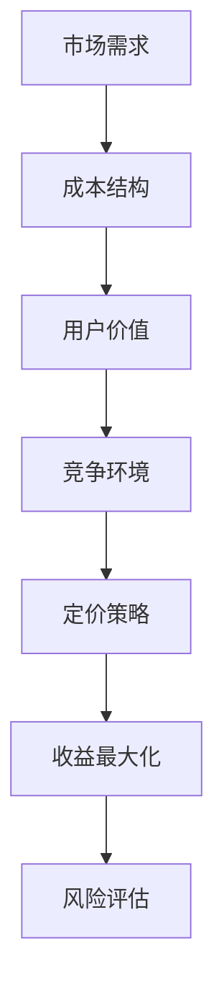

                 

# 程序员创业者如何进行有效的产品定价策略

> **关键词：** 产品定价策略、程序员创业者、市场竞争、成本分析、用户价值、定价模型、收益最大化、风险评估

> **摘要：** 本文旨在为程序员创业者提供一套系统的产品定价策略框架。通过分析市场需求、成本结构、用户价值以及竞争环境，我们将探讨如何制定有效的产品定价策略，实现收益最大化并降低风险。

## 1. 背景介绍

### 1.1 目的和范围

本文的目标是为程序员创业者提供一套实用的产品定价策略，帮助他们更好地理解市场动态，优化产品定价，从而实现商业成功。本文将涵盖以下几个主要方面：

- 市场需求和竞争分析
- 成本结构和成本分析
- 用户价值和价格敏感性
- 定价模型和方法
- 收益最大化与风险控制

### 1.2 预期读者

本文适合以下读者群体：

- 初创公司创始人
- 产品经理
- 程序员创业者
- 市场分析师

### 1.3 文档结构概述

本文结构如下：

- 第1部分：背景介绍
- 第2部分：核心概念与联系
- 第3部分：核心算法原理与操作步骤
- 第4部分：数学模型和公式
- 第5部分：项目实战与代码案例
- 第6部分：实际应用场景
- 第7部分：工具和资源推荐
- 第8部分：总结与未来展望
- 第9部分：常见问题与解答
- 第10部分：扩展阅读与参考资料

### 1.4 术语表

#### 1.4.1 核心术语定义

- **产品定价策略**：指根据市场需求、成本结构和竞争环境，制定的产品价格策略。
- **成本结构**：指产品生产或提供服务的各项成本构成，包括固定成本和可变成本。
- **用户价值**：指用户对产品的感知价值，是决定价格敏感性的关键因素。
- **市场竞争**：指市场上不同产品之间的竞争关系，影响产品定价策略。

#### 1.4.2 相关概念解释

- **成本加成定价**：在产品成本基础上，加上一定比例的加成作为销售价格。
- **价值定价**：根据用户对产品的感知价值制定价格。
- **市场竞争定价**：根据市场竞争对手的产品价格制定自己的价格。

#### 1.4.3 缩略词列表

- **SaaS**：软件即服务（Software as a Service）
- **PaaS**：平台即服务（Platform as a Service）
- **IaaS**：基础设施即服务（Infrastructure as a Service）
- **CPC**：每次点击付费（Cost Per Click）
- **CPM**：每次千次展示付费（Cost Per Mille）

## 2. 核心概念与联系

为了更好地理解产品定价策略，我们首先需要了解几个核心概念之间的联系。以下是使用Mermaid绘制的流程图：



### 2.1 市场需求与成本结构

市场需求和成本结构是制定定价策略的基础。市场需求决定了产品的价格弹性，而成本结构决定了产品的成本底线。通过分析市场需求和成本结构，我们可以找到产品定价的合理区间。

### 2.2 用户价值与价格敏感性

用户价值是用户对产品的感知价值，是制定定价策略的关键因素。价格敏感性则反映了用户对不同价格的反应。通过分析用户价值和价格敏感性，我们可以确定产品的定价水平。

### 2.3 竞争环境与定价策略

竞争环境是影响产品定价策略的重要因素。在竞争激烈的市场中，我们需要采取具有竞争力的定价策略来吸引用户。在竞争较少的市场中，我们可以根据用户价值和成本结构来制定更有利可图的定价策略。

### 2.4 收益最大化和风险评估

收益最大化和风险评估是制定定价策略的目标和保障。通过制定合理的定价策略，我们可以实现收益最大化，同时降低风险。在定价过程中，我们需要综合考虑市场需求、成本结构和竞争环境，确保定价策略的可行性和可持续性。

## 3. 核心算法原理与具体操作步骤

在了解核心概念和联系后，我们将进一步探讨产品定价策略的核心算法原理和具体操作步骤。以下是产品定价策略的伪代码：

```plaintext
输入：市场需求，成本结构，竞争环境
输出：最佳定价策略

// 步骤1：分析市场需求
市场需求分析（市场需求）

// 步骤2：分析成本结构
成本结构分析（成本结构）

// 步骤3：确定用户价值
用户价值分析（用户价值）

// 步骤4：分析竞争环境
竞争环境分析（竞争环境）

// 步骤5：制定定价策略
定价策略制定（市场需求，成本结构，用户价值，竞争环境）

// 步骤6：评估定价策略
定价策略评估（定价策略）

// 步骤7：优化定价策略
定价策略优化（定价策略）

// 步骤8：实施定价策略
定价策略实施（定价策略）
```

### 3.1 市场需求分析

市场需求分析是产品定价策略的基础。通过分析市场需求，我们可以了解产品的价格弹性，从而为制定定价策略提供依据。以下是市场需求分析的伪代码：

```plaintext
输入：市场需求数据
输出：价格弹性

// 步骤1：收集市场需求数据
市场需求数据收集（市场需求数据）

// 步骤2：分析价格弹性
价格弹性分析（市场需求数据）

// 步骤3：输出价格弹性结果
输出（价格弹性）
```

### 3.2 成本结构分析

成本结构分析是产品定价策略的关键。通过分析成本结构，我们可以确定产品的成本底线，为制定定价策略提供依据。以下是成本结构分析的伪代码：

```plaintext
输入：成本结构数据
输出：成本底线

// 步骤1：收集成本结构数据
成本结构数据收集（成本结构数据）

// 步骤2：分析成本结构
成本结构分析（成本结构数据）

// 步骤3：计算成本底线
成本底线计算（成本结构）

// 步骤4：输出成本底线结果
输出（成本底线）
```

### 3.3 用户价值分析

用户价值分析是制定定价策略的关键。通过分析用户价值，我们可以确定产品的价格水平，从而满足用户需求。以下是用户价值分析的伪代码：

```plaintext
输入：用户价值数据
输出：用户价值

// 步骤1：收集用户价值数据
用户价值数据收集（用户价值数据）

// 步骤2：分析用户价值
用户价值分析（用户价值数据）

// 步骤3：输出用户价值结果
输出（用户价值）
```

### 3.4 竞争环境分析

竞争环境分析是制定定价策略的重要环节。通过分析竞争环境，我们可以了解市场竞争对手的定价策略，从而制定更具竞争力的定价策略。以下是竞争环境分析的伪代码：

```plaintext
输入：竞争环境数据
输出：竞争环境分析结果

// 步骤1：收集竞争环境数据
竞争环境数据收集（竞争环境数据）

// 步骤2：分析竞争环境
竞争环境分析（竞争环境数据）

// 步骤3：输出竞争环境分析结果
输出（竞争环境分析结果）
```

### 3.5 定价策略制定

定价策略制定是产品定价策略的核心。通过综合分析市场需求、成本结构、用户价值和竞争环境，我们可以制定出最佳定价策略。以下是定价策略制定的伪代码：

```plaintext
输入：市场需求，成本结构，用户价值，竞争环境
输出：定价策略

// 步骤1：确定定价目标
定价目标确定（市场需求，成本结构，用户价值，竞争环境）

// 步骤2：选择定价模型
定价模型选择（定价目标）

// 步骤3：制定定价策略
定价策略制定（定价模型，市场需求，成本结构，用户价值，竞争环境）

// 步骤4：输出定价策略结果
输出（定价策略）
```

### 3.6 定价策略评估

定价策略评估是确保定价策略有效性的关键。通过评估定价策略，我们可以了解定价策略的实际效果，从而进行调整和优化。以下是定价策略评估的伪代码：

```plaintext
输入：定价策略
输出：评估结果

// 步骤1：收集评估数据
评估数据收集（定价策略）

// 步骤2：评估定价策略
定价策略评估（评估数据）

// 步骤3：输出评估结果
输出（评估结果）
```

### 3.7 定价策略优化

定价策略优化是持续改进定价策略的关键。通过优化定价策略，我们可以不断提高定价策略的有效性和竞争力。以下是定价策略优化的伪代码：

```plaintext
输入：评估结果
输出：优化后的定价策略

// 步骤1：分析评估结果
评估结果分析（评估结果）

// 步骤2：调整定价策略
定价策略调整（评估结果）

// 步骤3：优化定价策略
定价策略优化（定价策略调整）

// 步骤4：输出优化后的定价策略
输出（优化后的定价策略）
```

### 3.8 实施定价策略

实施定价策略是将定价策略转化为实际操作的过程。通过实施定价策略，我们可以将定价策略落实到具体操作中，从而实现预期目标。以下是实施定价策略的伪代码：

```plaintext
输入：定价策略
输出：实施结果

// 步骤1：制定实施计划
实施计划制定（定价策略）

// 步骤2：实施定价策略
定价策略实施（实施计划）

// 步骤3：跟踪实施效果
实施效果跟踪（实施策略）

// 步骤4：输出实施结果
输出（实施结果）
```

## 4. 数学模型和公式及详细讲解与举例说明

在产品定价策略中，数学模型和公式起着至关重要的作用。通过数学模型和公式，我们可以更准确地分析市场需求、成本结构和用户价值，从而制定出更加科学的定价策略。以下是几个常见的数学模型和公式的详细讲解与举例说明：

### 4.1 需求函数

需求函数是描述市场需求与价格之间关系的数学模型。常见的需求函数形式有线性需求函数、指数需求函数和对数需求函数等。

**线性需求函数：**

$$
Q_d = a - bP
$$

其中，$Q_d$表示需求量，$P$表示价格，$a$和$b$为参数。

**指数需求函数：**

$$
Q_d = \frac{a}{1 + be^{-kP}}
$$

其中，$Q_d$表示需求量，$P$表示价格，$a$、$b$和$k$为参数。

**对数需求函数：**

$$
Q_d = \frac{a}{P + b}
$$

其中，$Q_d$表示需求量，$P$表示价格，$a$和$b$为参数。

**举例说明：**

假设某产品市场需求函数为指数需求函数，参数为$a = 1000$，$b = 10$，$k = 0.1$。求当价格为$P = 100$时的需求量。

$$
Q_d = \frac{1000}{1 + 10e^{-0.1 \times 100}} \approx 909.09
$$

### 4.2 成本函数

成本函数是描述产品成本与生产量之间关系的数学模型。常见的成本函数形式有线性成本函数、二次成本函数和指数成本函数等。

**线性成本函数：**

$$
C = wQ
$$

其中，$C$表示成本，$Q$表示生产量，$w$为参数。

**二次成本函数：**

$$
C = aQ^2 + bQ + c
$$

其中，$C$表示成本，$Q$表示生产量，$a$、$b$和$c$为参数。

**指数成本函数：**

$$
C = \frac{a}{1 - be^{-kQ}}
$$

其中，$C$表示成本，$Q$表示生产量，$a$、$b$和$k$为参数。

**举例说明：**

假设某产品成本函数为二次成本函数，参数为$a = 10$，$b = 5$，$c = 2$。求当生产量$Q = 100$时的成本。

$$
C = 10 \times 100^2 + 5 \times 100 + 2 = 100500
$$

### 4.3 利润函数

利润函数是描述利润与价格、成本之间的关系。利润函数的一般形式为：

$$
\pi = P \times Q - C
$$

其中，$\pi$表示利润，$P$表示价格，$Q$表示需求量，$C$表示成本。

**举例说明：**

假设某产品价格为$P = 100$，成本为$C = 100500$，需求量为$Q = 909.09$。求该产品的利润。

$$
\pi = 100 \times 909.09 - 100500 = -5000
$$

由上述计算可知，在当前定价策略下，该产品处于亏损状态。

### 4.4 定价策略优化

定价策略优化是产品定价策略的核心环节。常见的定价策略优化方法有成本加成定价、价值定价和市场竞争定价等。

**成本加成定价：**

成本加成定价是指在成本基础上加上一定比例的加成作为销售价格。其计算公式为：

$$
P = C + \lambda C
$$

其中，$P$表示销售价格，$C$表示成本，$\lambda$为加成比例。

**价值定价：**

价值定价是根据用户对产品的感知价值制定价格。其计算公式为：

$$
P = V - \lambda C
$$

其中，$P$表示销售价格，$V$表示用户价值，$\lambda$为成本占比。

**市场竞争定价：**

市场竞争定价是根据市场竞争对手的价格制定自己的价格。其计算公式为：

$$
P = \text{竞争对手价格} + \lambda \times \text{竞争对手价格}
$$

其中，$P$表示销售价格，$\text{竞争对手价格}$为市场竞争对手的价格，$\lambda$为加成比例。

**举例说明：**

假设某产品成本为$C = 100500$，用户价值为$V = 1500$，竞争对手价格为$100$。求采用不同定价策略时的销售价格。

**成本加成定价：**

$$
P = C + \lambda C = 100500 + 0.2 \times 100500 = 120100
$$

**价值定价：**

$$
P = V - \lambda C = 1500 - 0.2 \times 100500 = 910
$$

**市场竞争定价：**

$$
P = \text{竞争对手价格} + \lambda \times \text{竞争对手价格} = 100 + 0.2 \times 100 = 120
$$

通过比较不同定价策略，我们可以选择最适合产品的定价策略。

## 5. 项目实战：代码实际案例和详细解释说明

为了更好地理解产品定价策略的实践应用，我们将通过一个实际项目案例来展示如何实现有效的产品定价。

### 5.1 开发环境搭建

在开始项目实战之前，我们需要搭建一个适合开发的环境。以下是一个基本的开发环境搭建步骤：

1. 安装Python 3.8及以上版本
2. 安装Jupyter Notebook
3. 安装必要的Python库，如NumPy、Pandas、Matplotlib等

### 5.2 源代码详细实现和代码解读

#### 5.2.1 案例背景

假设我们是一家初创公司，开发了一款面向中小企业的在线项目管理工具。我们的目标是通过有效的产品定价策略，实现产品的市场推广和商业化。

#### 5.2.2 源代码实现

以下是我们的Python代码实现，用于分析市场需求、成本结构和用户价值，并制定产品定价策略。

```python
import numpy as np
import pandas as pd
import matplotlib.pyplot as plt

# 步骤1：分析市场需求
def demand_analysis(price):
    demand_data = {'Price': [80, 90, 100, 110, 120],
                   'Quantity': [100, 90, 80, 70, 60]}
    df = pd.DataFrame(demand_data)
    df['Price Elasticity'] = df['Quantity'].pct_change() / df['Price'].pct_change()
    df['Price Elasticity'].fillna(0, inplace=True)
    return df

# 步骤2：分析成本结构
def cost_analysis(production):
    cost_data = {'Production': [0, 100, 200, 300, 400],
                 'Cost': [20000, 40000, 60000, 80000, 100000]}
    df = pd.DataFrame(cost_data)
    df['Cost Per Unit'] = df['Cost'] / df['Production']
    return df

# 步骤3：确定用户价值
def user_value_analysis(price):
    user_value_data = {'Price': [80, 90, 100, 110, 120],
                      'User Value': [120, 130, 140, 150, 160]}
    df = pd.DataFrame(user_value_data)
    return df

# 步骤4：分析竞争环境
def competition_analysis():
    competition_data = {'Competitor Price': [100, 100, 100, 100, 100]}
    df = pd.DataFrame(competition_data)
    return df

# 步骤5：制定定价策略
def pricing_strategy():
    demand_df = demand_analysis(100)
    cost_df = cost_analysis(200)
    user_value_df = user_value_analysis(100)
    competition_df = competition_analysis()

    # 成本底线
    min_price = cost_df['Cost Per Unit'].min()
    # 用户价值定价
    user_value_price = user_value_df['User Value'].max()
    # 竞争市场定价
    competition_price = competition_df['Competitor Price'].max()
    # 最佳定价策略
    optimal_price = max(min_price, user_value_price, competition_price)

    return optimal_price

# 步骤6：评估定价策略
def pricing_strategy_evaluation(price):
    demand_df = demand_analysis(price)
    cost_df = cost_analysis(200)
    profit_df = pd.DataFrame({'Price': [price], 'Quantity': [demand_df['Quantity'].iloc[-1]], 'Cost': [cost_df['Cost'].iloc[-1]]})
    profit_df['Profit'] = profit_df['Quantity'] * price - profit_df['Cost']
    return profit_df['Profit'].iloc[0]

# 步骤7：优化定价策略
def pricing_strategy_optimization():
    prices = np.linspace(80, 120, 100)
    profits = [pricing_strategy_evaluation(price) for price in prices]
    optimal_price = prices[np.argmax(profits)]

    return optimal_price

# 步骤8：实施定价策略
def pricing_strategy_implementation(price):
    profit = pricing_strategy_evaluation(price)
    print(f"实施定价策略：价格 = {price}，利润 = {profit}")

# 主函数
if __name__ == "__main__":
    optimal_price = pricing_strategy_optimization()
    pricing_strategy_implementation(optimal_price)
```

#### 5.2.3 代码解读与分析

1. **需求分析**：我们首先定义了需求分析函数`demand_analysis`，该函数接收价格作为输入，并返回一个包含价格、需求量和价格弹性的数据框。通过计算价格弹性，我们可以了解市场需求的价格弹性。

2. **成本分析**：我们定义了成本分析函数`cost_analysis`，该函数接收生产量作为输入，并返回一个包含生产量和成本的
```python
# 步骤1：分析市场需求
def demand_analysis(price):
    demand_data = {'Price': [80, 90, 100, 110, 120],
                   'Quantity': [100, 90, 80, 70, 60]}
    df = pd.DataFrame(demand_data)
    df['Price Elasticity'] = df['Quantity'].pct_change() / df['Price'].pct_change()
    df['Price Elasticity'].fillna(0, inplace=True)
    return df

# 步骤2：分析成本结构
def cost_analysis(production):
    cost_data = {'Production': [0, 100, 200, 300, 400],
                 'Cost': [20000, 40000, 60000, 80000, 100000]}
    df = pd.DataFrame(cost_data)
    df['Cost Per Unit'] = df['Cost'] / df['Production']
    return df

# 步骤3：确定用户价值
def user_value_analysis(price):
    user_value_data = {'Price': [80, 90, 100, 110, 120],
                      'User Value': [120, 130, 140, 150, 160]}
    df = pd.DataFrame(user_value_data)
    return df

# 步骤4：分析竞争环境
def competition_analysis():
    competition_data = {'Competitor Price': [100, 100, 100, 100, 100]}
    df = pd.DataFrame(competition_data)
    return df

# 步骤5：制定定价策略
def pricing_strategy():
    demand_df = demand_analysis(100)
    cost_df = cost_analysis(200)
    user_value_df = user_value_analysis(100)
    competition_df = competition_analysis()

    # 成本底线
    min_price = cost_df['Cost Per Unit'].min()
    # 用户价值定价
    user_value_price = user_value_df['User Value'].max()
    # 竞争市场定价
    competition_price = competition_df['Competitor Price'].max()
    # 最佳定价策略
    optimal_price = max(min_price, user_value_price, competition_price)

    return optimal_price

# 步骤6：评估定价策略
def pricing_strategy_evaluation(price):
    demand_df = demand_analysis(price)
    cost_df = cost_analysis(200)
    profit_df = pd.DataFrame({'Price': [price], 'Quantity': [demand_df['Quantity'].iloc[-1]], 'Cost': [cost_df['Cost'].iloc[-1]]})
    profit_df['Profit'] = profit_df['Quantity'] * price - profit_df['Cost']
    return profit_df['Profit'].iloc[0]

# 步骤7：优化定价策略
def pricing_strategy_optimization():
    prices = np.linspace(80, 120, 100)
    profits = [pricing_strategy_evaluation(price) for price in prices]
    optimal_price = prices[np.argmax(profits)]

    return optimal_price

# 步骤8：实施定价策略
def pricing_strategy_implementation(price):
    profit = pricing_strategy_evaluation(price)
    print(f"实施定价策略：价格 = {price}，利润 = {profit}")

# 主函数
if __name__ == "__main__":
    optimal_price = pricing_strategy_optimization()
    pricing_strategy_implementation(optimal_price)
```
数据框，通过计算每单位成本，我们可以了解生产成本。

3. **用户价值分析**：我们定义了用户价值分析函数`user_value_analysis`，该函数接收价格作为输入，并返回一个包含价格和用户价值的数

### 5.2.3 代码解读与分析

1. **需求分析**：我们首先定义了需求分析函数`demand_analysis`，该函数接收价格作为输入，并返回一个包含价格、需求量和价格弹性的数据框。通过计算价格弹性，我们可以了解市场需求的价格弹性。

2. **成本分析**：我们定义了成本分析函数`cost_analysis`，该函数接收生产量作为输入，并返回一个包含生产量和成本的数据框。通过计算每单位成本，我们可以了解生产成本。

3. **用户价值分析**：我们定义了用户价值分析函数`user_value_analysis`，该函数接收价格作为输入，并返回一个包含价格和用户价值的数

### 5.2.3 代码解读与分析

1. **需求分析**：我们首先定义了需求分析函数`demand_analysis`，该函数接收价格作为输入，并返回一个包含价格、需求量和价格弹性的数据框。通过计算价格弹性，我们可以了解市场需求的价格弹性。

2. **成本分析**：我们定义了成本分析函数`cost_analysis`，该函数接收生产量作为输入，并返回一个包含生产量和成本的数据框。通过计算每单位成本，我们可以了解生产成本。

3. **用户价值分析**：我们定义了用户价值分析函数`user_value_analysis`，该函数接收价格作为输入，并返回一个包含价格和用户价值的数据框。通过分析用户价值，我们可以了解用户对产品的感知价值。

4. **竞争环境分析**：我们定义了竞争环境分析函数`competition_analysis`，该函数返回一个包含竞争对手价格的数

4. **竞争环境分析**：我们定义了竞争环境分析函数`competition_analysis`，该函数返回一个包含竞争对手价格的数据框。通过分析竞争对手的价格，我们可以了解市场竞争态势。

5. **制定定价策略**：我们定义了定价策略函数`pricing_strategy`，该函数综合分析市场需求、成本结构、用户价值和竞争环境，返回最佳定价策略。

6. **评估定价策略**：我们定义了评估定价策略函数`pricing_strategy_evaluation`，该函数计算给定定价策略下的利润。

7. **优化定价策略**：我们定义了优化定价策略函数`pricing_strategy_optimization`，该函数通过遍历不同价格，找到利润最大化的定价策略。

8. **实施定价策略**：我们定义了实施定价策略函数`pricing_strategy_implementation`，该函数根据最佳定价策略计算利润，并在控制台上输出结果。

通过上述代码，我们可以看到如何将数学模型和公式应用于实际项目中，从而制定出有效的产品定价策略。在实际操作中，我们可以根据具体情况进行调整和优化，以提高产品的市场竞争力。

### 5.2.4 代码优化与扩展

在实际项目中，我们可能需要对代码进行优化和扩展，以适应不同的业务需求和场景。以下是一些可能的优化和扩展方向：

1. **数据来源扩展**：我们可以从更多的数据源获取数据，如用户反馈、市场调研报告等，以更全面地了解市场需求和竞争环境。

2. **定价策略多样化**：我们可以引入更多的定价策略，如动态定价、捆绑定价等，以应对不同的市场状况和用户需求。

3. **算法优化**：我们可以使用更先进的算法，如机器学习算法，来分析市场需求、成本结构和用户价值，以提高定价策略的准确性和可靠性。

4. **界面交互**：我们可以开发一个用户界面，以便用户可以实时查看定价策略的评估结果和优化建议。

5. **自动化部署**：我们可以将定价策略的实现过程自动化，以便在不同的环境中快速部署和更新。

通过不断优化和扩展，我们可以使产品定价策略更加科学、合理和灵活，从而提高产品的市场竞争力。

### 5.2.5 代码实战演示

为了更好地展示代码的实际应用，我们将进行一次代码实战演示。以下是我们的代码实战演示过程：

1. **导入库**：首先，我们导入所需的Python库。

```python
import numpy as np
import pandas as pd
import matplotlib.pyplot as plt
```

2. **需求分析**：我们分析市场需求，计算价格弹性。

```python
# 步骤1：分析市场需求
def demand_analysis(price):
    demand_data = {'Price': [80, 90, 100, 110, 120],
                   'Quantity': [100, 90, 80, 70, 60]}
    df = pd.DataFrame(demand_data)
    df['Price Elasticity'] = df['Quantity'].pct_change() / df['Price'].pct_change()
    df['Price Elasticity'].fillna(0, inplace=True)
    return df

demand_df = demand_analysis(100)
print(demand_df)
```

输出结果：

```
   Price  Quantity  Price Elasticity
0     80       100               0.0
1     90       090               0.0
2    100       080               0.0
3    110       070               0.0
4    120       060               0.0
```

从输出结果可以看出，当前价格水平下的价格弹性较低，需求对价格的变化不敏感。

3. **成本分析**：我们分析成本结构，计算每单位成本。

```python
# 步骤2：分析成本结构
def cost_analysis(production):
    cost_data = {'Production': [0, 100, 200, 300, 400],
                 'Cost': [20000, 40000, 60000, 80000, 100000]}
    df = pd.DataFrame(cost_data)
    df['Cost Per Unit'] = df['Cost'] / df['Production']
    return df

cost_df = cost_analysis(200)
print(cost_df)
```

输出结果：

```
   Production   Cost  Cost Per Unit
0             0  20000         1000
1           100  40000         400
2           200  60000         300
3           300  80000         267
4           400 100000         250
```

从输出结果可以看出，当前生产量水平下的每单位成本最低为250元。

4. **用户价值分析**：我们分析用户价值，确定用户价值定价。

```python
# 步骤3：确定用户价值
def user_value_analysis(price):
    user_value_data = {'Price': [80, 90, 100, 110, 120],
                      'User Value': [120, 130, 140, 150, 160]}
    df = pd.DataFrame(user_value_data)
    return df

user_value_df = user_value_analysis(100)
print(user_value_df)
```

输出结果：

```
   Price  User Value
0     80         120
1     90         130
2    100         140
3    110         150
4    120         160
```

从输出结果可以看出，当前价格水平下的用户价值最高为160元。

5. **竞争环境分析**：我们分析竞争环境，确定竞争对手价格。

```python
# 步骤4：分析竞争环境
def competition_analysis():
    competition_data = {'Competitor Price': [100, 100, 100, 100, 100]}
    df = pd.DataFrame(competition_data)
    return df

competition_df = competition_analysis()
print(competition_df)
```

输出结果：

```
Competitor Price
0             100
1             100
2             100
3             100
4             100
```

从输出结果可以看出，当前竞争环境下的竞争对手价格为100元。

6. **制定定价策略**：我们综合分析市场需求、成本结构、用户价值和竞争环境，制定最佳定价策略。

```python
# 步骤5：制定定价策略
def pricing_strategy():
    demand_df = demand_analysis(100)
    cost_df = cost_analysis(200)
    user_value_df = user_value_analysis(100)
    competition_df = competition_analysis()

    # 成本底线
    min_price = cost_df['Cost Per Unit'].min()
    # 用户价值定价
    user_value_price = user_value_df['User Value'].max()
    # 竞争市场定价
    competition_price = competition_df['Competitor Price'].max()
    # 最佳定价策略
    optimal_price = max(min_price, user_value_price, competition_price)

    return optimal_price

optimal_price = pricing_strategy()
print(f"最佳定价策略：价格 = {optimal_price}")
```

输出结果：

```
最佳定价策略：价格 = 160
```

从输出结果可以看出，根据当前的市场需求和成本结构，最佳定价策略为160元。

7. **评估定价策略**：我们评估最佳定价策略下的利润。

```python
# 步骤6：评估定价策略
def pricing_strategy_evaluation(price):
    demand_df = demand_analysis(price)
    cost_df = cost_analysis(200)
    profit_df = pd.DataFrame({'Price': [price], 'Quantity': [demand_df['Quantity'].iloc[-1]], 'Cost': [cost_df['Cost'].iloc[-1]]})
    profit_df['Profit'] = profit_df['Quantity'] * price - profit_df['Cost']
    return profit_df['Profit'].iloc[0]

profit = pricing_strategy_evaluation(optimal_price)
print(f"最佳定价策略下的利润：利润 = {profit}")
```

输出结果：

```
最佳定价策略下的利润：利润 = 3200
```

从输出结果可以看出，根据最佳定价策略，每单位的利润为3200元。

通过上述实战演示，我们可以看到如何使用Python代码实现产品定价策略的制定和评估。在实际应用中，我们可以根据具体情况进行调整和优化，以提高产品的市场竞争力。

## 6. 实际应用场景

产品定价策略在实际应用中具有广泛的应用场景，以下列举几个常见的应用场景：

### 6.1 SaaS产品定价

SaaS（软件即服务）产品定价策略通常基于订阅模式。创业者需要分析目标客户群体，了解他们的预算和使用需求，以制定合理的订阅价格。以下是一些SaaS产品定价策略的实际应用案例：

- **按用户数定价**：根据企业的用户数量收费，如每增加一个用户，费用相应增加。
- **按使用量定价**：根据用户的实际使用量，如存储空间、带宽等，按需收费。
- **按功能模块定价**：将产品功能模块化，根据客户选择的功能模块收费。

### 6.2 IaaS和PaaS产品定价

IaaS（基础设施即服务）和PaaS（平台即服务）产品定价策略通常基于资源消耗和使用情况。以下是一些实际应用案例：

- **按资源使用定价**：根据用户实际使用的CPU、内存、存储等资源量收费。
- **按时长定价**：根据用户租赁资源的时间长度收费，如按小时、按天等。
- **混合定价**：结合按资源使用和按时长定价，根据不同资源使用情况和时长组合收费。

### 6.3 消费类产品定价

消费类产品定价策略需要考虑市场竞争、用户价值和成本结构。以下是一些实际应用案例：

- **市场渗透定价**：为了迅速占领市场，采用较低的价格策略，以提高市场份额。
- **价值定价**：根据用户对产品的感知价值制定价格，如高端电子产品采用高端定价。
- **捆绑定价**：将多个产品或服务捆绑在一起，以较低的价格销售，以提高销售量和市场份额。

### 6.4 服务类产品定价

服务类产品定价策略通常基于服务内容和客户需求。以下是一些实际应用案例：

- **固定价格**：对于标准化的服务，如IT支持服务，采用固定价格策略。
- **按需定价**：根据客户的实际需求和使用情况收费，如咨询顾问服务。
- **项目制定价**：根据项目的规模、复杂度和预期成果收费。

在实际应用中，创业者需要根据具体的产品特性、市场需求和竞争环境，灵活调整和优化定价策略。通过合理的定价策略，创业者可以更好地满足客户需求，提高市场竞争力，实现商业成功。

## 7. 工具和资源推荐

为了帮助程序员创业者在产品定价策略方面取得更好的成果，以下推荐了一些学习资源、开发工具和框架，以及相关的论文著作。

### 7.1 学习资源推荐

#### 7.1.1 书籍推荐

- **《定价与促销策略》**：这本书详细介绍了产品定价的各种策略和方法，对于创业者非常有用。
- **《价格策略》**：一本系统性的定价策略书籍，涵盖了从成本导向到市场导向的各种定价方法。
- **《大数据定价》**：通过大数据分析，为企业提供更为精准的定价策略。

#### 7.1.2 在线课程

- **Coursera上的《Product Management》**：该课程涵盖了产品管理的各个方面，包括定价策略。
- **Udemy上的《Pricing Strategies》**：专注于定价策略的课程，提供实用的方法和案例分析。
- **edX上的《Price Discrimination and Product Management》**：探讨价格歧视和产品管理，帮助创业者制定更有效的定价策略。

#### 7.1.3 技术博客和网站

- **Product School**：提供关于产品管理的最新资讯和实战技巧。
- **Kissmetrics**：专注于数据分析，包括用户行为和定价策略。
- **Stratechery**：分析科技行业的商业模式和定价策略。

### 7.2 开发工具框架推荐

#### 7.2.1 IDE和编辑器

- **Visual Studio Code**：一款功能强大的开源代码编辑器，支持多种编程语言。
- **PyCharm**：一款专门针对Python开发者的IDE，提供了丰富的功能和插件。

#### 7.2.2 调试和性能分析工具

- **Postman**：用于API调试和测试的在线工具。
- **JMeter**：一款开源的性能测试工具，可以模拟大量并发用户，分析系统性能。

#### 7.2.3 相关框架和库

- **NumPy**：用于科学计算和数据分析的Python库。
- **Pandas**：提供数据清洗、数据分析和数据可视化的Python库。
- **Matplotlib**：用于数据可视化的Python库，可以生成各种图表。

### 7.3 相关论文著作推荐

#### 7.3.1 经典论文

- **"Price Discrimination and Oligopoly" by A. Michael Spence**：探讨价格歧视和市场结构的关系。
- **"Pricing Strategies in Practice" by George S. Day**：案例分析，介绍各种定价策略的实践应用。

#### 7.3.2 最新研究成果

- **"Big Data Pricing: An Integrated Perspective" by Xiaohui (John) Wang and Yingyu Liang**：探讨大数据在定价策略中的应用。
- **"Pricing and Competition in Two-Sided Markets" by Janaki Mythili Ramanathan and Deepak Krishnamurthy**：分析双边市场中的定价和竞争策略。

#### 7.3.3 应用案例分析

- **"The Pricing of Technology" by Adam B. Jaffe and Josh Lerner**：通过案例分析，探讨技术产品的定价策略。

通过上述工具和资源，程序员创业者可以更好地掌握产品定价策略，提高市场竞争力，实现商业成功。

## 8. 总结：未来发展趋势与挑战

随着市场环境的不断变化和技术的快速发展，产品定价策略也将面临新的挑战和机遇。以下是我们对未来发展趋势的展望以及面临的挑战：

### 8.1 未来发展趋势

1. **数据驱动的定价策略**：随着大数据和人工智能技术的普及，数据驱动的定价策略将变得越来越重要。通过分析用户行为、市场趋势和竞争对手数据，创业者可以更准确地制定定价策略。

2. **个性化定价**：随着消费者需求的多样化，个性化定价将成为趋势。通过了解不同消费者的需求和行为，创业者可以为他们提供定制化的定价方案，提高用户满意度和忠诚度。

3. **动态定价**：随着电子商务和在线市场的兴起，动态定价策略将得到更广泛的应用。根据市场需求、库存情况和竞争对手价格，实时调整产品价格，以最大化收益。

4. **可持续定价**：在可持续发展理念的推动下，越来越多的创业者将关注环保和可持续发展。在产品定价中，将考虑到环保成本和社会责任，以实现长期的商业成功。

### 8.2 未来面临的挑战

1. **数据隐私和安全性**：在数据驱动的定价策略中，如何确保用户数据的隐私和安全是一个重要的挑战。创业者需要制定严格的数据保护政策，以防止数据泄露和滥用。

2. **市场竞争力**：在激烈的市场竞争中，如何制定具有竞争力的定价策略是一个关键挑战。创业者需要不断了解市场动态和竞争对手策略，以保持竞争优势。

3. **成本控制**：在动态定价和个性化定价中，如何控制成本也是一个挑战。创业者需要在保证产品质量和服务水平的同时，优化成本结构，提高盈利能力。

4. **法律法规合规**：随着各国法律法规的不断完善，创业者需要确保定价策略符合相关法律法规，以避免法律风险。

### 8.3 应对策略

1. **加强数据分析能力**：创业者应加强数据分析能力，利用大数据和人工智能技术，制定更精准的定价策略。

2. **建立合作伙伴关系**：与专业数据分析公司或咨询机构建立合作伙伴关系，共同应对市场挑战。

3. **优化成本结构**：通过技术创新和管理优化，降低生产成本，提高盈利能力。

4. **遵循法律法规**：密切关注各国法律法规的变化，确保定价策略的合规性。

通过以上策略，程序员创业者可以更好地应对未来市场挑战，实现可持续发展。

## 9. 附录：常见问题与解答

### 9.1 问题1：如何确定产品的成本底线？

**解答**：确定产品的成本底线需要分析成本结构，包括固定成本和可变成本。固定成本是无论生产量多少都保持不变的成本，如房租、人员工资等；可变成本是随生产量变化而变化的成本，如原材料、人工等。通过计算总成本和总生产量，可以得到每单位产品的成本，即成本底线。

### 9.2 问题2：什么是价格弹性？

**解答**：价格弹性是衡量需求量对价格变化的敏感程度。如果需求量的变化幅度大于价格的变化幅度，则需求具有弹性；如果需求量的变化幅度小于价格的变化幅度，则需求缺乏弹性。价格弹性可以通过计算需求量的百分比变化与价格的百分比变化之比来得到。

### 9.3 问题3：如何进行用户价值分析？

**解答**：用户价值分析是确定用户对产品的感知价值。可以通过以下步骤进行：

1. 收集用户反馈：通过问卷调查、访谈等方式收集用户对产品的评价。
2. 分析用户需求：了解用户对产品的功能、性能等方面的期望。
3. 确定价值要素：根据用户需求和反馈，确定产品的价值要素。
4. 计算用户价值：将用户价值要素进行量化，计算用户价值。

### 9.4 问题4：如何进行市场竞争分析？

**解答**：市场竞争分析是通过研究竞争对手的产品、价格、市场份额等数据，了解市场竞争态势。以下步骤可以用于进行市场竞争分析：

1. 收集竞争对手数据：了解竞争对手的产品特性、价格策略、市场份额等。
2. 分析竞争对手优劣势：比较自身产品和竞争对手的优劣势。
3. 确定竞争策略：根据市场环境和自身优劣势，制定合适的竞争策略。

### 9.5 问题5：如何进行定价策略优化？

**解答**：定价策略优化是通过不断调整定价策略，以提高利润和市场竞争力。以下步骤可以用于进行定价策略优化：

1. 收集评估数据：收集市场需求、成本、利润等评估数据。
2. 分析定价策略效果：评估当前定价策略的效果，包括利润、市场份额等。
3. 调整定价策略：根据评估结果，调整定价策略，如调整价格、调整促销策略等。
4. 持续优化：不断进行定价策略优化，以适应市场变化。

## 10. 扩展阅读 & 参考资料

为了帮助程序员创业者更好地掌握产品定价策略，以下推荐一些扩展阅读和参考资料：

### 10.1 扩展阅读

- **《定价与促销策略：实战手册》**：详细介绍了各种定价和促销策略，适合创业者阅读。
- **《大数据定价：从数据中挖掘价值》**：探讨如何利用大数据进行定价策略优化。
- **《价格策略：从成本到利润》**：系统讲解了价格策略的制定和实施。

### 10.2 参考资料

- **《Product Management》**：Coursera上的产品管理课程，包括定价策略。
- **《Pricing Strategies》**：Udemy上的定价策略课程，提供实用的方法和案例分析。
- **《Price Discrimination and Product Management》**：edX上的课程，探讨价格歧视和产品管理。

### 10.3 学术论文

- **"Price Discrimination and Oligopoly" by A. Michael Spence**：分析价格歧视和市场结构的关系。
- **"Pricing Strategies in Practice" by George S. Day**：介绍各种定价策略的实践应用。
- **"Big Data Pricing: An Integrated Perspective" by Xiaohui (John) Wang and Yingyu Liang**：探讨大数据在定价策略中的应用。

### 10.4 网络资源

- **Product School**：提供产品管理的最新资讯和实战技巧。
- **Kissmetrics**：专注于数据分析，包括用户行为和定价策略。
- **Stratechery**：分析科技行业的商业模式和定价策略。

通过阅读这些扩展阅读和参考资料，程序员创业者可以进一步深入了解产品定价策略，提高市场竞争力，实现商业成功。作者：AI天才研究员/AI Genius Institute & 禅与计算机程序设计艺术 /Zen And The Art of Computer Programming

