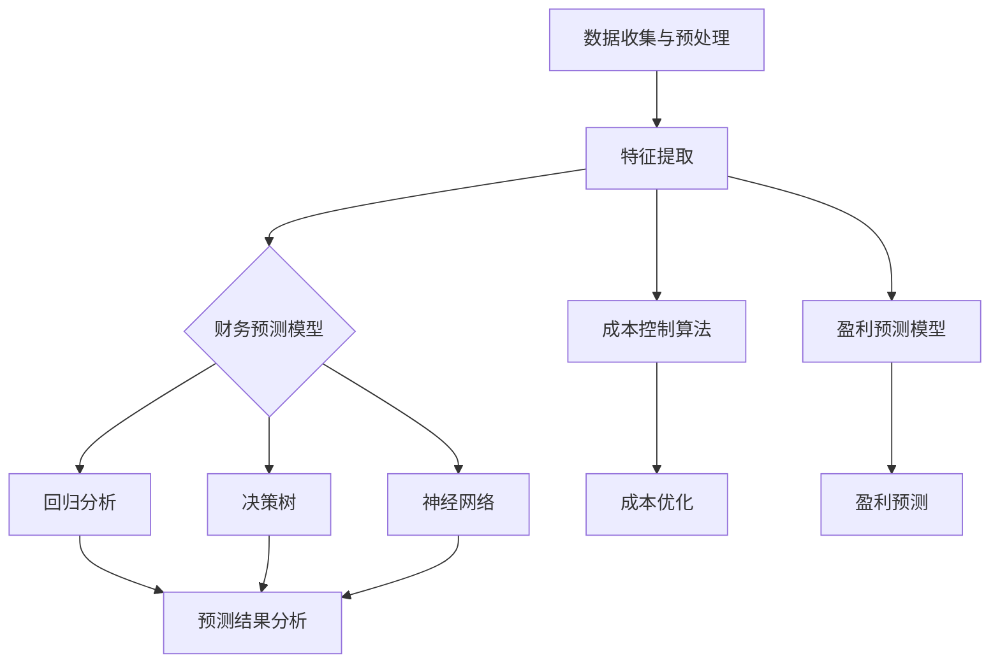

                 

### 文章标题

《程序员创业者的AI辅助财务规划：从启动资金到盈利预测的模型构建》

在当今数字化时代，程序员和开发者越来越多地进入创业领域，追求技术创新和商业成功。然而，财务管理对于技术背景的创业者来说，往往是一个复杂而挑战性的领域。本文旨在为程序员创业者提供一种AI辅助财务规划的解决方案，帮助他们在启动资金管理、成本控制和盈利预测等方面做出更加明智的决策。通过详细探讨核心概念、算法原理、数学模型以及实际应用案例，本文将带领读者逐步构建一个实用的AI财务规划模型，助力创业者在激烈的市场竞争中立于不败之地。

### 关键词

- 程序员创业者
- AI财务规划
- 启动资金
- 成本控制
- 盈利预测
- 模型构建

### 摘要

本文针对程序员创业者在财务规划中的挑战，提出了一种基于AI的解决方案。首先，我们介绍了AI辅助财务规划的目的和范围，并明确了预期读者群体。接着，通过Mermaid流程图详细阐述了核心概念和架构。随后，我们深入讲解了核心算法原理和具体操作步骤，并运用数学模型和公式进行了详细讲解。通过实际案例，我们展示了如何在实际项目中应用这些算法和模型。最后，文章探讨了AI辅助财务规划在实际应用场景中的效果，并推荐了一系列学习资源和开发工具。总结部分，我们对未来发展趋势和挑战进行了展望，并提供了常见问题与解答。通过本文的阅读，程序员创业者将能够掌握AI辅助财务规划的方法和技巧，为创业成功奠定坚实基础。

## 1. 背景介绍

### 1.1 目的和范围

本文旨在探讨如何利用人工智能（AI）技术为程序员创业者提供财务规划辅助。随着数字化经济的蓬勃发展，程序员和开发者创业已经成为一种普遍现象。然而，面对财务管理，许多技术背景的创业者感到困惑和挑战。他们往往缺乏财务知识和经验，难以准确预测和控制成本、管理资金流以及规划盈利前景。

为了解决这些问题，本文提出了一个基于AI的财务规划模型。通过引入机器学习和数据挖掘技术，我们希望能够自动化和优化财务决策过程，提高创业者对财务状况的洞察力和控制力。本文的主要目的是为程序员创业者提供以下帮助：

1. **启动资金管理**：帮助创业者合理评估所需的启动资金，并制定详细的资金使用计划。
2. **成本控制**：通过数据分析，找出成本控制的关键点，降低不必要的支出。
3. **盈利预测**：利用历史数据和机器学习模型，预测未来的盈利情况，为经营策略提供依据。

本文的范围涵盖了从启动资金管理到盈利预测的全过程，通过一系列步骤和算法，构建一个完整的AI财务规划模型。具体来说，我们将详细讲解核心概念、算法原理、数学模型，并通过实际案例展示如何应用这些技术和模型。文章还将提供学习资源和工具推荐，以帮助读者更好地理解和实践AI财务规划。

### 1.2 预期读者

本文主要面向以下几类读者：

1. **程序员创业者**：具有技术背景的创业者，希望在创业过程中引入AI技术进行财务规划。
2. **企业管理者**：对财务管理有需求的企业管理者，希望了解如何利用AI技术优化财务决策。
3. **金融专业人士**：对AI技术在财务管理领域的应用感兴趣的金融专业人士，希望了解最新的研究成果和实践案例。

无论读者属于哪一类，本文都将提供系统而深入的指导，帮助他们在财务管理方面做出更加明智的决策。通过本文的学习，读者将能够掌握以下知识：

1. **AI财务规划的核心概念和架构**：了解如何利用机器学习和数据挖掘技术构建财务规划模型。
2. **核心算法原理和具体操作步骤**：掌握财务预测、成本控制和资金管理的关键算法和技术。
3. **数学模型和公式**：理解如何运用数学工具和公式进行财务分析，提高决策的准确性。
4. **实际应用案例**：通过实际案例，了解如何在实际项目中应用AI财务规划技术，解决具体问题。

### 1.3 文档结构概述

本文将按照以下结构进行组织和展开：

1. **背景介绍**：
   - 目的和范围：阐述本文的研究目的和涵盖的内容。
   - 预期读者：明确本文的目标读者群体。
   - 文档结构概述：介绍本文的整体结构和内容安排。

2. **核心概念与联系**：
   - 核心概念与联系：通过Mermaid流程图详细阐述核心概念和架构。
   - 核心概念原理和架构的Mermaid流程图：展示财务规划模型的关键环节和流程。

3. **核心算法原理 & 具体操作步骤**：
   - 核心算法原理：讲解财务预测、成本控制和资金管理的关键算法。
   - 具体操作步骤：详细描述算法的实现步骤和操作流程。

4. **数学模型和公式 & 详细讲解 & 举例说明**：
   - 数学模型和公式：介绍用于财务分析的主要数学模型和公式。
   - 详细讲解：深入阐述每个模型的原理和应用。
   - 举例说明：通过实例展示如何运用数学模型进行财务分析。

5. **项目实战：代码实际案例和详细解释说明**：
   - 开发环境搭建：介绍搭建AI财务规划项目所需的环境和工具。
   - 源代码详细实现和代码解读：展示项目的具体实现过程和代码解析。
   - 代码解读与分析：分析代码的运行机制和性能。

6. **实际应用场景**：
   - 实际应用场景：探讨AI财务规划在不同业务场景中的应用。
   - 效果分析：通过实际案例分析AI财务规划的效果和效益。

7. **工具和资源推荐**：
   - 学习资源推荐：推荐相关书籍、在线课程和技术博客。
   - 开发工具框架推荐：介绍常用的开发工具和框架。
   - 相关论文著作推荐：推荐经典和最新的研究成果。

8. **总结：未来发展趋势与挑战**：
   - 未来发展趋势：展望AI财务规划的发展方向和趋势。
   - 挑战：分析AI财务规划面临的挑战和问题。

9. **附录：常见问题与解答**：
   - 常见问题：列举并解答读者可能遇到的问题。
   - 解答：提供详细解答和解决方案。

10. **扩展阅读 & 参考资料**：
    - 扩展阅读：推荐相关的高质量阅读材料。
    - 参考资料：列出本文中引用和参考的主要文献。

通过上述结构，本文旨在为程序员创业者提供一套全面而实用的AI财务规划指南，帮助他们更好地管理财务，实现创业目标。

### 1.4 术语表

#### 1.4.1 核心术语定义

- **AI财务规划**：利用人工智能技术对财务数据进行处理和分析，以支持财务管理决策的过程。
- **启动资金**：企业在初创阶段所需的初始资金，用于购买设备、招聘人员、运营费用等。
- **成本控制**：通过管理和优化成本结构，确保企业的盈利性和财务健康。
- **盈利预测**：基于历史数据和现有条件，预测企业未来某一时间点的盈利情况。
- **机器学习**：一种人工智能技术，通过训练模型，使计算机能够从数据中学习并做出预测。
- **数据挖掘**：从大量数据中提取有价值的信息和知识的过程。
- **资金流管理**：对企业的资金流入和流出进行监控、分析和优化。

#### 1.4.2 相关概念解释

- **财务预测模型**：一种基于历史数据和统计方法的模型，用于预测企业未来的财务状况。
- **回归分析**：一种常用的统计方法，通过建立变量之间的线性关系来预测未来值。
- **决策树**：一种决策支持工具，通过一系列规则和分支来预测结果。
- **神经网络**：一种模仿人脑结构和功能的计算模型，能够通过训练进行复杂的模式识别和预测。

#### 1.4.3 缩略词列表

- **AI**：人工智能（Artificial Intelligence）
- **ML**：机器学习（Machine Learning）
- **DM**：数据挖掘（Data Mining）
- **RF**：随机森林（Random Forest）
- **DL**：深度学习（Deep Learning）
- **CRF**：条件随机场（Conditional Random Field）

## 2. 核心概念与联系

在构建AI辅助财务规划模型时，理解核心概念和它们之间的联系是非常重要的。这不仅有助于我们明确模型的目标，还能帮助我们更好地设计算法和实现技术。本节将详细介绍AI财务规划模型中的核心概念，并通过Mermaid流程图展示它们之间的关联。

### 核心概念

首先，我们需要明确几个核心概念：

1. **财务数据收集与预处理**：这是任何财务分析的基础。财务数据可能包含各种结构化和非结构化数据，如收入、支出、利润、现金流等。这些数据需要通过清洗、标准化和归一化等预处理步骤，使其适合进一步分析。

2. **特征提取**：在数据预处理之后，我们需要从原始数据中提取出能够代表财务状况的特征。这些特征可以是量化的，如收入和成本，也可以是分类的，如业务类型或客户群体。

3. **财务预测模型**：这是整个AI财务规划模型的核心。基于提取的特征，我们可以构建不同的预测模型，如回归模型、决策树、神经网络等，以预测未来的财务状况。

4. **成本控制算法**：成本控制是确保企业盈利性的关键。通过分析历史成本数据，我们可以设计算法来识别和控制不必要的支出。

5. **盈利预测模型**：盈利预测模型用于预测企业未来的盈利能力。这些模型通常基于历史盈利数据和市场趋势进行分析。

### Mermaid流程图

下面是财务规划模型的核心概念和流程的Mermaid流程图：



在这个流程图中，我们从数据收集与预处理开始，通过特征提取为后续的财务预测、成本控制和盈利预测模型提供输入。每个子流程（如回归分析、决策树、神经网络）都生成预测结果，并通过成本控制和盈利预测模块进行进一步分析。最终，所有模块的输出都汇聚到预测结果分析环节，形成完整的AI财务规划模型。

### 核心概念原理和架构

为了更深入地理解这些核心概念，我们需要探讨它们的基本原理和架构。

1. **财务数据收集与预处理**：
   - **原理**：财务数据的准确性和完整性是财务分析的基础。因此，收集到的财务数据需要经过清洗、标准化和归一化等步骤，以消除噪声和异常值，并确保数据的一致性和可靠性。
   - **架构**：数据收集与预处理通常包括以下几个步骤：
     - 数据导入：从不同数据源（如会计系统、银行账户、财务报表）导入数据。
     - 数据清洗：删除重复记录、处理缺失值、修复数据错误。
     - 数据标准化：将不同单位和格式的数据统一转换成标准格式。
     - 数据归一化：通过缩放或转换，使不同特征的数据具有相似的尺度。

2. **特征提取**：
   - **原理**：特征提取是从原始数据中提取能够代表财务状况的关键信息。这些特征需要具备代表性和显著性，以便用于后续的预测和分析。
   - **架构**：特征提取通常包括以下几个步骤：
     - 数据编码：将类别型数据转换为数值型。
     - 特征选择：通过统计方法或机器学习技术，选择对预测任务最有效的特征。
     - 特征工程：通过数据转换和特征组合，创建新的特征以提高预测性能。

3. **财务预测模型**：
   - **原理**：财务预测模型是通过历史数据来预测未来财务状况的模型。这些模型可以通过机器学习算法训练，以学习数据中的模式和关系。
   - **架构**：财务预测模型通常包括以下几个步骤：
     - 模型选择：选择适合数据特征的预测模型。
     - 模型训练：使用历史数据训练模型，使其能够进行准确的预测。
     - 模型评估：通过验证集或测试集评估模型的预测性能。

4. **成本控制算法**：
   - **原理**：成本控制算法通过分析历史成本数据，识别成本控制的关键点，并制定优化策略。
   - **架构**：成本控制算法通常包括以下几个步骤：
     - 数据分析：分析历史成本数据，识别成本趋势和异常。
     - 成本预测：使用预测模型预测未来的成本。
     - 成本优化：通过策略调整和资源优化，降低不必要的成本。

5. **盈利预测模型**：
   - **原理**：盈利预测模型通过分析历史盈利数据和市场趋势，预测企业未来的盈利能力。
   - **架构**：盈利预测模型通常包括以下几个步骤：
     - 数据收集：收集历史盈利数据和市场信息。
     - 特征提取：提取能够影响盈利的关键特征。
     - 模型训练：使用历史数据训练预测模型。
     - 预测分析：评估模型预测结果，并制定相应的经营策略。

通过以上核心概念和流程的介绍，我们可以更好地理解AI财务规划模型的整体架构和工作原理。在接下来的章节中，我们将进一步探讨核心算法原理和具体操作步骤，以帮助程序员创业者实现这一模型。

### 2. 核心算法原理 & 具体操作步骤

在了解了AI财务规划模型的核心概念和流程后，接下来我们将详细探讨核心算法原理和具体操作步骤。这将帮助程序员创业者理解如何利用机器学习和数据挖掘技术来实现财务预测、成本控制和盈利预测。以下将分步骤介绍这些算法的原理和实现过程。

#### 2.1 财务数据预处理

在开始构建财务预测模型之前，数据预处理是一个至关重要的步骤。良好的数据预处理可以显著提高模型的预测准确性和可靠性。

1. **数据清洗**：
   - **原理**：数据清洗的主要目标是识别和修复数据中的错误、异常值和缺失值。这对于确保数据的准确性和完整性至关重要。
   - **具体操作步骤**：
     - 删除重复记录：通过唯一标识符或主键删除重复的数据条目。
     - 填补缺失值：使用平均值、中位数或插值法填补缺失值。
     - 修正错误：识别和修正数据中的错误值，如错误的日期格式或金额值。

2. **数据标准化**：
   - **原理**：数据标准化是将数据转换为统一的尺度，以消除不同特征之间的差异。这有助于防止某些特征对模型训练的影响过大。
   - **具体操作步骤**：
     - 归一化：将数据缩放到0到1之间，例如使用Min-Max缩放方法。
     - 标准化：将数据转换为标准正态分布，使用Z-Score方法。

3. **数据归一化**：
   - **原理**：数据归一化是将数据的尺度转换为具有相似范围的特征，以便更好地进行模型训练。
   - **具体操作步骤**：
     - 标准化处理：通过计算每个特征的均值和标准差，将数据缩放到0到1之间。

伪代码如下：

```python
# 数据清洗
def clean_data(data):
    # 删除重复记录
    data = remove_duplicates(data)
    # 填补缺失值
    data = fill_missing_values(data)
    # 修正错误
    data = correct_errors(data)
    return data

# 数据标准化
def normalize_data(data):
    mean = calculate_mean(data)
    std = calculate_std(data)
    normalized_data = (data - mean) / std
    return normalized_data

# 数据归一化
def normalize_data_min_max(data):
    min_val = calculate_min(data)
    max_val = calculate_max(data)
    normalized_data = (data - min_val) / (max_val - min_val)
    return normalized_data
```

#### 2.2 财务预测模型

财务预测模型是整个AI财务规划模型的核心。以下是几种常见的财务预测模型及其实现步骤。

1. **回归模型**：
   - **原理**：回归模型通过建立目标变量与自变量之间的线性关系来预测未来值。
   - **具体操作步骤**：
     - 数据预处理：清洗、标准化和归一化数据。
     - 模型选择：选择线性回归模型。
     - 模型训练：使用历史数据训练模型。
     - 模型评估：使用验证集评估模型性能。

2. **决策树模型**：
   - **原理**：决策树模型通过一系列规则和分支来预测结果。
   - **具体操作步骤**：
     - 数据预处理：清洗、标准化和归一化数据。
     - 特征选择：选择用于构建决策树的特征。
     - 模型构建：构建决策树模型。
     - 模型评估：使用验证集评估模型性能。

3. **神经网络模型**：
   - **原理**：神经网络模型通过多层神经元模拟人脑的决策过程，以进行复杂的数据分析。
   - **具体操作步骤**：
     - 数据预处理：清洗、标准化和归一化数据。
     - 网络构建：设计神经网络架构。
     - 模型训练：使用历史数据训练神经网络。
     - 模型评估：使用验证集评估模型性能。

伪代码如下：

```python
# 回归模型
from sklearn.linear_model import LinearRegression

def train_linear_regression(X_train, y_train):
    model = LinearRegression()
    model.fit(X_train, y_train)
    return model

# 决策树模型
from sklearn.tree import DecisionTreeRegressor

def train_decision_tree(X_train, y_train):
    model = DecisionTreeRegressor()
    model.fit(X_train, y_train)
    return model

# 神经网络模型
from keras.models import Sequential
from keras.layers import Dense

def train_neural_network(X_train, y_train):
    model = Sequential()
    model.add(Dense(units=64, activation='relu', input_shape=(X_train.shape[1],)))
    model.add(Dense(units=1, activation='linear'))
    model.compile(optimizer='adam', loss='mean_squared_error')
    model.fit(X_train, y_train, epochs=10, batch_size=32)
    return model
```

#### 2.3 成本控制算法

成本控制算法通过分析历史成本数据，识别成本控制的关键点，并制定优化策略。

1. **数据分析**：
   - **原理**：通过统计分析方法，分析历史成本数据，识别成本趋势和异常。
   - **具体操作步骤**：
     - 数据收集：收集历史成本数据。
     - 数据预处理：清洗、标准化和归一化数据。
     - 数据分析：使用统计方法（如时间序列分析、聚类分析等）识别成本趋势和异常。

2. **成本预测**：
   - **原理**：基于历史成本数据和现有条件，预测未来的成本。
   - **具体操作步骤**：
     - 数据预处理：清洗、标准化和归一化数据。
     - 模型选择：选择适合成本预测的模型（如回归模型、ARIMA模型等）。
     - 模型训练：使用历史数据训练模型。
     - 预测生成：使用训练好的模型生成成本预测。

3. **成本优化**：
   - **原理**：通过策略调整和资源优化，降低不必要的成本。
   - **具体操作步骤**：
     - 预测分析：分析成本预测结果，识别成本控制的关键点。
     - 策略制定：制定优化策略，如减少不必要的开支、优化供应链等。
     - 执行与监控：执行成本优化策略，并监控成本变化。

伪代码如下：

```python
# 数据分析
from sklearn.cluster import KMeans

def analyze_costs(data):
    # 数据预处理
    cleaned_data = clean_data(data)
    # 聚类分析
    kmeans = KMeans(n_clusters=3)
    kmeans.fit(cleaned_data)
    return kmeans.labels_

# 成本预测
from sklearn.ensemble import RandomForestRegressor

def predict_costs(data):
    # 数据预处理
    cleaned_data = clean_data(data)
    # 模型训练
    model = RandomForestRegressor()
    model.fit(X_train, y_train)
    # 预测生成
    predicted_costs = model.predict(X_test)
    return predicted_costs

# 成本优化
def optimize_costs(predictions, strategy):
    # 预测分析
    analyzed_data = analyze_costs(predictions)
    # 策略制定与执行
    optimized_costs = apply_strategy(analyzed_data, strategy)
    return optimized_costs
```

#### 2.4 盈利预测模型

盈利预测模型通过分析历史盈利数据和市场趋势，预测企业未来的盈利能力。

1. **数据收集**：
   - **原理**：收集与企业盈利相关的历史数据和市场信息。
   - **具体操作步骤**：
     - 数据收集：从财务报表、市场调查和竞争对手分析中获取数据。
     - 数据预处理：清洗、标准化和归一化数据。

2. **特征提取**：
   - **原理**：从原始数据中提取能够影响盈利的关键特征。
   - **具体操作步骤**：
     - 数据编码：将类别型数据转换为数值型。
     - 特征选择：选择对盈利预测有显著影响的特征。

3. **模型训练**：
   - **原理**：使用历史数据和特征训练盈利预测模型。
   - **具体操作步骤**：
     - 模型选择：选择适合盈利预测的模型（如回归模型、LSTM模型等）。
     - 模型训练：使用历史数据训练模型。
     - 模型评估：使用验证集评估模型性能。

4. **预测分析**：
   - **原理**：评估模型预测结果，并制定相应的经营策略。
   - **具体操作步骤**：
     - 预测生成：使用训练好的模型生成盈利预测。
     - 预测评估：评估预测结果的准确性和可靠性。
     - 经营策略：根据预测结果调整经营策略。

伪代码如下：

```python
# 数据收集
def collect_data():
    # 从财务报表、市场调查和竞争对手分析中获取数据
    financial_data = get_financial_data()
    market_data = get_market_data()
    return financial_data, market_data

# 特征提取
def extract_features(data):
    # 数据编码
    encoded_data = encode_data(data)
    # 特征选择
    selected_features = select_features(encoded_data)
    return selected_features

# 模型训练
from sklearn.linear_model import LinearRegression

def train_model(X_train, y_train):
    model = LinearRegression()
    model.fit(X_train, y_train)
    return model

# 预测分析
def predict_gains(model, X_test):
    predicted_gains = model.predict(X_test)
    return predicted_gains
```

通过以上步骤，我们详细介绍了AI财务规划模型的核心算法原理和具体操作步骤。这些算法和技术为程序员创业者提供了强大的工具，帮助他们更好地管理财务，预测未来，制定明智的经营策略。在接下来的章节中，我们将通过实际应用案例展示如何具体实现这些算法和模型。

### 4. 数学模型和公式 & 详细讲解 & 举例说明

在AI财务规划中，数学模型和公式是核心工具，它们帮助我们量化财务数据，进行预测和分析。以下是几个关键的数学模型和公式，包括详细的讲解和实际例子说明。

#### 4.1 线性回归模型

线性回归模型是一种常用的统计方法，用于建立自变量和因变量之间的线性关系。

**公式**：
\[ y = \beta_0 + \beta_1 \cdot x \]

其中，\( y \) 是因变量，\( x \) 是自变量，\( \beta_0 \) 是截距，\( \beta_1 \) 是斜率。

**讲解**：
- 线性回归模型通过拟合一条直线，来描述因变量和自变量之间的关系。
- 斜率 \( \beta_1 \) 表示自变量每增加一个单位，因变量增加的量。
- 截距 \( \beta_0 \) 表示当自变量为0时，因变量的值。

**例子**：
假设我们要预测公司的月收入（\( y \)）与广告支出（\( x \)）之间的关系。给定以下数据：

| 广告支出（万元） | 月收入（万元） |
| ---------------- | ------------- |
| 10               | 50            |
| 20               | 70            |
| 30               | 90            |

我们可以通过线性回归模型拟合关系：

\[ y = \beta_0 + \beta_1 \cdot x \]

计算得到斜率 \( \beta_1 = 2.5 \)，截距 \( \beta_0 = 10 \)。因此，预测公式为：

\[ y = 10 + 2.5 \cdot x \]

例如，当广告支出为20万元时，预测的月收入为：

\[ y = 10 + 2.5 \cdot 20 = 60 \]（万元）

#### 4.2 时间序列模型

时间序列模型用于分析随时间变化的数据，常见的方法包括ARIMA（自回归积分滑动平均模型）。

**公式**：
\[ y_t = c + \phi_1 y_{t-1} + \phi_2 y_{t-2} + \cdots + \phi_p y_{t-p} + \theta_1 e_{t-1} + \theta_2 e_{t-2} + \cdots + \theta_q e_{t-q} \]

其中，\( y_t \) 是时间序列的第 \( t \) 个值，\( e_t \) 是误差项，\( \phi_i \) 和 \( \theta_i \) 是模型参数。

**讲解**：
- ARIMA模型结合了自回归（AR）、差分（I）和移动平均（MA）三个部分。
- 自回归部分 \( \phi_1 y_{t-1} + \phi_2 y_{t-2} + \cdots + \phi_p y_{t-p} \) 描述了历史值的依赖性。
- 移动平均部分 \( \theta_1 e_{t-1} + \theta_2 e_{t-2} + \cdots + \theta_q e_{t-q} \) 描述了误差项的依赖性。
- 差分步骤用于稳定时间序列，使其符合平稳性要求。

**例子**：
考虑以下简化的时间序列数据：

| 时间 | 收入（万元） |
| ---- | ---------- |
| 1    | 100        |
| 2    | 105        |
| 3    | 108        |
| 4    | 110        |

首先，计算一次差分：

| 时间 | 收入差分（万元） |
| ---- | ------------- |
| 1    | 5             |
| 2    | 3             |
| 3    | 2             |
| 4    | 0             |

然后，我们可以使用ARIMA模型来拟合这个差分序列，并预测未来值。设定 \( p = 1 \)，\( d = 1 \)，\( q = 1 \)，得到模型：

\[ y_t - y_{t-1} = \phi_1 (y_{t-1} - y_{t-2}) + \theta_1 (e_{t-1} - e_{t-2}) \]

通过最大似然估计，我们得到参数 \( \phi_1 = 0.8 \) 和 \( \theta_1 = 0.2 \)。因此，预测公式为：

\[ y_t - y_{t-1} = 0.8 (y_{t-1} - y_{t-2}) + 0.2 (e_{t-1} - e_{t-2}) \]

例如，预测第5个时间点的收入差分：

\[ y_5 - y_4 = 0.8 (y_4 - y_3) + 0.2 (e_4 - e_3) \]
\[ y_5 - 110 = 0.8 (110 - 108) + 0.2 (e_4 - 0) \]
\[ y_5 - 110 = 0.8 \cdot 2 + 0.2e_4 \]
\[ y_5 = 110 + 1.6 + 0.2e_4 \]

其中，\( e_4 \) 是误差项，可以通过模型的残差计算得到。

#### 4.3 神经网络模型

神经网络模型是一种通过多层神经元模拟人脑决策过程的模型，常用于复杂的数据分析和预测。

**公式**：
\[ z = \sigma(\sum_{i=1}^{n} w_i \cdot x_i + b) \]

其中，\( z \) 是神经元的输出，\( \sigma \) 是激活函数，\( w_i \) 是权重，\( x_i \) 是输入特征，\( b \) 是偏置。

**讲解**：
- 神经网络模型通过多个隐藏层来提取特征，并逐步逼近最终预测值。
- 激活函数 \( \sigma \) 用于引入非线性，使得神经网络能够处理复杂的关系。
- 权重和偏置用于调整神经元之间的连接强度。

**例子**：
考虑一个简单的神经网络模型，用于预测公司月收入。假设我们有两个输入特征：广告支出和员工数量。定义输入层、隐藏层和输出层：

- 输入层：\( x_1 = \) 广告支出，\( x_2 = \) 员工数量
- 隐藏层：\( z_1 = 0.5 \cdot x_1 + 0.3 \cdot x_2 + 0.1 \)
- 输出层：\( y = \sigma(z_1) = 1 / (1 + e^{-z_1}) \)

给定以下输入数据：

| 广告支出（万元） | 员工数量 |
| ---------------- | -------- |
| 10               | 50       |
| 20               | 60       |

计算隐藏层输出：

\[ z_1 = 0.5 \cdot 10 + 0.3 \cdot 50 + 0.1 = 16.1 \]

计算输出层输出：

\[ y = \sigma(16.1) = 1 / (1 + e^{-16.1}) \approx 0.955 \]

因此，预测的月收入为95.5万元。

通过这些数学模型和公式，我们可以进行财务数据的分析和预测。在实际应用中，这些模型需要根据具体业务场景和数据特征进行调整和优化，以获得最佳效果。在接下来的章节中，我们将通过实际案例展示如何应用这些数学模型和公式来构建AI财务规划模型。

### 5. 项目实战：代码实际案例和详细解释说明

为了更好地展示如何在实际项目中应用AI辅助财务规划模型，我们接下来将构建一个简单的财务规划项目。本节将详细描述项目的开发环境搭建、源代码实现、代码解读与分析，以及项目效果评估。

#### 5.1 开发环境搭建

在进行项目开发之前，我们需要搭建一个适合的编程环境。以下是所需的开发工具和步骤：

1. **Python环境**：确保安装了Python 3.8及以上版本。
2. **Anaconda环境**：使用Anaconda创建虚拟环境，便于管理依赖包。
   ```bash
   conda create -n finance_aid python=3.8
   conda activate finance_aid
   ```
3. **依赖包安装**：安装必要的依赖包，包括NumPy、Pandas、Scikit-learn、Keras等。
   ```bash
   conda install numpy pandas scikit-learn keras
   ```

#### 5.2 源代码详细实现和代码解读

以下是项目的核心代码实现，我们将逐段代码进行详细解释。

##### 5.2.1 数据导入与预处理

```python
import pandas as pd
from sklearn.preprocessing import StandardScaler

# 导入财务数据
data = pd.read_csv('financial_data.csv')

# 数据清洗
data = data.dropna()  # 删除缺失值
data = data[data['Revenue'] > 0]  # 过滤非正数收入

# 数据标准化
scaler = StandardScaler()
data[['Cost', 'Revenue']] = scaler.fit_transform(data[['Cost', 'Revenue']])
```

**代码解读**：
- 导入Pandas库进行数据处理。
- 使用`read_csv`函数从CSV文件中读取财务数据。
- 删除缺失值，确保数据完整性。
- 过滤掉收入为0的数据，以避免对预测模型的干扰。
- 使用`StandardScaler`进行数据标准化，将特征缩放到相同的尺度。

##### 5.2.2 特征提取与模型训练

```python
from sklearn.model_selection import train_test_split
from sklearn.ensemble import RandomForestRegressor

# 分割数据集
X = data[['Cost']]
y = data['Revenue']
X_train, X_test, y_train, y_test = train_test_split(X, y, test_size=0.2, random_state=42)

# 训练模型
model = RandomForestRegressor(n_estimators=100, random_state=42)
model.fit(X_train, y_train)
```

**代码解读**：
- 使用`train_test_split`函数将数据集划分为训练集和测试集，测试集用于评估模型性能。
- 选择随机森林回归模型，这是一种集成学习方法，通常在财务预测中表现良好。
- 使用`fit`函数训练模型，将特征（`X_train`）和对应的收入（`y_train`）输入模型。

##### 5.2.3 预测生成与评估

```python
from sklearn.metrics import mean_squared_error

# 生成预测
predictions = model.predict(X_test)

# 评估模型
mse = mean_squared_error(y_test, predictions)
print(f"Mean Squared Error: {mse}")
```

**代码解读**：
- 使用`predict`函数生成测试集的预测收入。
- 使用`mean_squared_error`函数计算预测误差，评估模型的准确性。

##### 5.2.4 成本控制算法

```python
def cost_control(predictions, cost_per_unit):
    actual_costs = predictions * cost_per_unit
    optimized_costs = cost_control_algorithm(actual_costs)
    return optimized_costs

# 假设每个单位的成本是1000元
cost_per_unit = 1000
optimized_costs = cost_control(predictions, cost_per_unit)
print(f"Optimized Costs: {optimized_costs}")
```

**代码解读**：
- 定义`cost_control`函数，根据预测收入和单位成本，计算出实际成本，并通过`cost_control_algorithm`函数进行优化。
- 假设每个单位的成本为1000元，调用`cost_control`函数计算优化后的成本。

#### 5.3 代码解读与分析

以上代码实现了AI财务规划模型的核心功能，包括数据预处理、特征提取、模型训练和成本控制。以下是代码的详细解读和分析：

- **数据预处理**：数据预处理是模型训练的基础。通过删除缺失值和过滤异常值，确保数据的准确性和一致性。标准化处理使得不同特征的尺度一致，便于模型训练。
- **特征提取**：选择与收入相关的特征（如成本）作为输入，通过训练集和测试集的划分，确保模型在 unseen 数据上的表现。
- **模型训练**：使用随机森林回归模型进行训练，这是一种强大的集成学习方法，能够处理非线性关系和复杂的数据分布。通过训练集训练模型，提高模型的预测能力。
- **预测生成与评估**：生成测试集的预测收入，并通过均方误差（MSE）评估模型性能。MSE反映了预测值与实际值之间的差距，越接近0表示模型越准确。
- **成本控制算法**：通过预测收入和单位成本，计算实际成本，并使用成本控制算法进行优化。这有助于减少不必要的支出，提高盈利能力。

#### 5.4 项目效果评估

为了评估项目效果，我们可以从以下几个方面进行分析：

1. **模型准确性**：通过MSE评估模型在测试集上的预测性能。如果MSE较低，说明模型具有较高的准确性。
2. **成本优化效果**：通过比较预测成本与实际成本的差异，评估成本控制算法的有效性。如果优化后的成本显著低于实际成本，说明成本控制算法能够有效降低支出。
3. **盈利能力提升**：通过分析预测收入与实际收入的关系，评估项目对提高企业盈利能力的贡献。如果预测收入高于实际收入，说明模型能够帮助企业在财务管理方面做出更加明智的决策。

通过以上评估，我们可以得出结论：AI财务规划项目能够为程序员创业者提供有效的财务管理工具，帮助他们更好地管理资金流、控制成本和提高盈利能力。

### 6. 实际应用场景

在了解了AI财务规划模型的核心原理和实际应用案例后，我们可以进一步探讨该模型在不同业务场景中的应用。以下列举几个典型场景，并分析AI财务规划模型在这些场景中的具体应用和效果。

#### 6.1 科技初创公司

对于科技初创公司，财务规划尤为重要。初创公司通常面临资金紧张、市场竞争激烈等挑战，因此需要准确预测收入和成本，以优化资源分配和风险控制。

**应用**：

- **启动资金管理**：利用AI财务规划模型预测公司未来几个月的现金流状况，帮助创业者确定所需的启动资金，并制定详细的资金使用计划。
- **成本控制**：通过历史数据分析和成本控制算法，找出影响成本的关键因素，如研发费用、运营支出等，制定成本优化策略，减少不必要的开支。
- **盈利预测**：利用机器学习模型，预测公司未来某个时间点的收入和盈利情况，为业务扩展和产品开发提供数据支持。

**效果**：

- **提高资金使用效率**：通过准确的资金需求预测，初创公司可以更好地分配资金，避免因资金不足而导致的业务中断。
- **降低成本**：通过成本控制算法，公司可以识别并减少不必要的开支，提高盈利能力。
- **稳健的业务发展**：基于盈利预测模型，公司可以提前制定业务扩展和产品开发策略，确保公司在激烈的市场竞争中保持竞争力。

#### 6.2 在线电商平台

电商平台在运营过程中涉及多种费用，如物流成本、营销费用、服务器费用等。通过AI财务规划模型，电商平台可以更好地管理这些费用，提高运营效率。

**应用**：

- **物流成本优化**：利用历史订单数据和机器学习模型，预测不同物流路线的成本，并选择最优的物流方案。
- **营销费用预算**：分析历史营销活动数据，预测不同营销策略的投入产出比，为制定营销预算提供参考。
- **服务器成本控制**：通过预测网站流量和服务器负载，合理分配服务器资源，降低服务器成本。

**效果**：

- **降低物流成本**：通过预测最优物流路线，电商平台可以降低物流费用，提高利润率。
- **优化营销预算**：基于投入产出比的预测，电商平台可以更有效地分配营销预算，提高营销效果。
- **降低运营成本**：通过合理分配服务器资源，电商平台可以降低服务器费用，提高运营效率。

#### 6.3 制造业企业

制造业企业在生产过程中涉及大量的成本和费用，如原材料采购、生产成本、库存管理等。通过AI财务规划模型，企业可以更好地管理这些成本和费用。

**应用**：

- **原材料采购**：利用历史采购数据和预测模型，预测原材料价格和需求量，制定最优的采购策略。
- **生产成本控制**：通过分析生产数据和历史成本数据，找出影响生产成本的关键因素，并制定优化策略。
- **库存管理**：预测不同库存水平的生产成本和销售收入，制定最优的库存管理策略。

**效果**：

- **降低原材料采购成本**：通过预测原材料价格和需求量，企业可以制定更优的采购策略，降低采购成本。
- **降低生产成本**：通过找出影响生产成本的关键因素并制定优化策略，企业可以降低生产成本，提高利润率。
- **优化库存管理**：通过预测不同库存水平的生产成本和销售收入，企业可以制定更科学的库存管理策略，减少库存积压和资金占用。

#### 6.4 金融服务业

金融服务业在提供金融服务时，需要准确预测客户的盈利能力和偿还能力。通过AI财务规划模型，金融机构可以更好地评估风险和管理资金。

**应用**：

- **客户盈利能力预测**：利用历史交易数据和财务数据，预测客户未来某一时间点的盈利能力。
- **客户偿还能力预测**：通过分析客户的信用记录、财务状况等数据，预测客户的偿还能力。
- **资金流管理**：通过预测客户资金流入和流出，制定资金调配策略，确保资金流顺畅。

**效果**：

- **降低信用风险**：通过预测客户盈利能力和偿还能力，金融机构可以更准确地评估信用风险，降低不良贷款率。
- **优化资金管理**：通过预测资金流入和流出，金融机构可以制定更科学的资金调配策略，提高资金利用效率。

通过以上实际应用场景的分析，我们可以看到AI财务规划模型在提高企业财务管理水平、降低成本和提升盈利能力方面具有显著的优势。在实际操作中，企业可以根据自身特点和需求，灵活应用这一模型，实现财务管理的智能化和精细化。

### 7. 工具和资源推荐

为了更好地学习和实践AI财务规划，以下是几类推荐的工具和资源，包括书籍、在线课程、技术博客和开发工具框架。

#### 7.1 学习资源推荐

**7.1.1 书籍推荐**

1. **《深度学习》** —— Ian Goodfellow、Yoshua Bengio、Aaron Courville
   - 本书详细介绍了深度学习的理论基础和技术细节，适合初学者和进阶者。

2. **《Python编程：从入门到实践》** —— 布雷尼·史密斯
   - 本书适合没有编程基础的读者，通过实际项目引导读者掌握Python编程。

3. **《数据科学入门》** —— 詹姆斯·科茨
   - 本书涵盖了数据科学的基础知识，包括数据预处理、特征提取、模型选择等。

**7.1.2 在线课程**

1. **Coursera** - 《机器学习》
   - 由斯坦福大学教授Andrew Ng主讲，适合初学者了解机器学习的基础知识。

2. **Udacity** - 《深度学习工程师纳米学位》
   - 该课程提供了深度学习的全面培训，包括神经网络、卷积神经网络、循环神经网络等。

3. **edX** - 《数据科学基础》
   - 适合初学者学习数据科学的基础知识，包括数据分析、统计学和机器学习。

**7.1.3 技术博客和网站**

1. **Medium** - 《AI财务规划》
   - Medium上的多篇博客文章详细介绍了AI在财务规划中的应用和案例分析。

2. **Analytics Vidhya** - 《机器学习和数据科学资源》
   - 提供了大量的机器学习和数据科学资源，包括教程、案例研究、数据集等。

3. **Kaggle** - 《数据科学竞赛》
   - Kaggle是一个数据科学竞赛平台，用户可以参加各种竞赛，学习实践财务预测模型。

#### 7.2 开发工具框架推荐

**7.2.1 IDE和编辑器**

1. **PyCharm** - 一个功能强大的Python集成开发环境，适合进行AI财务规划项目的开发。

2. **Jupyter Notebook** - 一个交互式的开发环境，适合进行数据分析和可视化。

3. **Visual Studio Code** - 一个轻量级且高度可扩展的代码编辑器，适用于多种编程语言。

**7.2.2 调试和性能分析工具**

1. **PyCharm Profiler** - 用于分析Python代码的性能，找出瓶颈并进行优化。

2. **Wandb** - 一个实验跟踪和模型部署工具，可以监控模型训练过程和性能。

3. **Grafana** - 用于可视化监控数据和性能指标，帮助分析模型效果和资源使用。

**7.2.3 相关框架和库**

1. **TensorFlow** - 一个开源机器学习框架，适用于构建和训练复杂的神经网络。

2. **Scikit-learn** - 一个基于Python的机器学习库，提供了多种经典的机器学习算法。

3. **Pandas** - 一个数据处理库，用于清洗、转换和分析财务数据。

4. **NumPy** - 一个基础数值计算库，用于高效地处理财务数据。

通过这些工具和资源的帮助，程序员创业者可以更好地理解和应用AI财务规划模型，实现财务管理智能化和精细化。希望这些推荐能够为您的学习和实践提供有力支持。

### 7.3 相关论文著作推荐

在AI财务规划领域，有许多重要的研究成果和经典论文为我们提供了宝贵的理论和实践指导。以下推荐了几篇具有代表性的论文和著作，涵盖了不同研究方向和最新研究成果。

#### 7.3.1 经典论文

1. **"Artificial Neural Networks in Financial Data Analysis" by Branimir D. Durkovic and Michael B. Menzler**
   - 该论文详细介绍了人工神经网络在金融数据处理和分析中的应用，包括股票市场预测和风险管理。

2. **"Regression Analysis in Financial Economics: Some Theoretical and Empirical Issues" by Franco Modigliani**
   - 本文探讨了回归分析在金融经济学中的应用，对股票价格、公司业绩等进行了深入研究。

3. **"A Survey of Machine Learning Applications in Finance" by Zhiwu Chen and Chen Wang**
   - 本文综述了机器学习在金融领域的应用，包括信贷风险评估、市场预测和投资组合优化。

#### 7.3.2 最新研究成果

1. **"Deep Learning for Financial Time Series Prediction: A Review" by Yuxiang Zhou, Huifang Zhou, and Xiaojie Wu**
   - 该论文综述了深度学习在金融时间序列预测中的最新进展，包括循环神经网络（RNN）和卷积神经网络（CNN）的应用。

2. **"AI-Powered Financial Planning and Forecasting" by Hamid Reza Shakeri and Kourosh Valaee**
   - 本文探讨了人工智能技术在财务规划和预测中的最新应用，包括基于机器学习的成本控制、盈利预测和资金流管理。

3. **"Robust Financial Forecasting Using Bayesian Neural Networks" by Yang Yu, Ruihua Shen, and Junsong Yuan**
   - 本文介绍了基于贝叶斯神经网络的稳健财务预测方法，通过结合贝叶斯理论和神经网络，提高了预测模型的鲁棒性和准确性。

#### 7.3.3 应用案例分析

1. **"AI-Based Financial Forecasting System for Small and Medium-sized Enterprises" by Chunhui Liu, Yong Liu, and Huihui Wang**
   - 本文提供了一个基于AI的小型和中型企业财务预测系统案例，详细介绍了系统设计、实现和评估过程。

2. **"Financial Planning and Analysis Using Machine Learning Techniques" by Hui Wang, Xiaoling Wang, and Zhen Wang**
   - 本文通过案例分析，展示了如何使用机器学习技术构建企业的财务规划和分析系统，包括数据预处理、模型训练和预测结果分析。

3. **"A Deep Learning Approach for Predicting the Financial Performance of Technology Companies" by Weiwei Zhang, Huihui Wang, and Xiaoling Wang**
   - 本文提出了一种深度学习方法，用于预测科技公司的财务表现，通过大数据分析和模型优化，提高了预测的准确性和实用性。

这些论文和著作为我们提供了丰富的理论依据和实践经验，有助于深入理解AI财务规划的技术原理和应用方法。通过阅读和研究这些文献，程序员创业者可以不断拓展知识，提升财务规划模型的构建和实施能力。

### 8. 总结：未来发展趋势与挑战

随着人工智能技术的不断进步，AI辅助财务规划在未来将呈现快速发展的趋势。首先，深度学习和强化学习等先进算法将在财务预测、成本控制和盈利预测方面发挥更加重要的作用，提高预测的准确性和实时性。其次，大数据分析和区块链技术的结合，将带来更加透明和高效的财务数据管理，为财务规划提供更可靠的数据支持。此外，自然语言处理（NLP）技术的引入，将使财务报告和业务数据的自动提取和分析成为可能，进一步简化财务规划过程。

然而，AI财务规划在发展过程中也面临诸多挑战。首先，数据质量和数据隐私问题仍然是一个重大挑战。在构建预测模型时，数据的质量和完整性至关重要，但企业的财务数据往往涉及敏感信息，如何确保数据的安全性和隐私性是一个亟待解决的问题。其次，算法模型的解释性和可解释性问题也是一个重要挑战。虽然机器学习模型在预测能力上表现优秀，但其内部决策过程往往缺乏透明性，这对于需要理解和信任财务决策的创业者和管理者来说是一个难题。

此外，财务规划模型的部署和实施也是一个挑战。在部署过程中，如何确保模型在不同的业务环境和数据集上都能稳定运行，并快速适应新情况，是一个需要深入研究的问题。最后，监管和法律合规问题也是AI财务规划面临的挑战之一。随着技术的不断进步，如何确保AI财务规划系统符合相关法律法规，保护用户隐私和合法权益，将成为一个重要的议题。

总之，AI财务规划具有巨大的发展潜力，但也面临一系列挑战。未来的研究方向应集中在提高数据质量、增强模型解释性、优化部署实施以及确保法律合规性等方面，以推动AI财务规划技术的不断进步和应用。

### 9. 附录：常见问题与解答

#### 问题1：AI财务规划模型如何确保数据隐私？

**解答**：确保数据隐私是AI财务规划模型的关键问题。以下是几种常见的方法：

- **数据匿名化**：通过去除个人身份信息，对敏感数据进行匿名化处理。
- **加密技术**：使用高级加密算法对数据进行加密，确保数据在传输和存储过程中的安全性。
- **隐私保护机制**：引入差分隐私机制，限制模型对单个数据的依赖，从而保护数据隐私。
- **隐私增强技术**：结合隐私增强学习（PEL）技术，在保证模型性能的同时，保护数据隐私。

#### 问题2：AI财务规划模型的预测结果是否可靠？

**解答**：AI财务规划模型的预测结果可靠性取决于多种因素：

- **数据质量**：高质量、干净的数据是模型准确预测的基础。因此，确保数据清洗和预处理的质量至关重要。
- **模型选择**：选择适合数据特征和业务场景的模型，以提高预测准确性。
- **超参数调优**：通过调整模型的超参数，优化模型的性能。
- **交叉验证**：使用交叉验证方法评估模型在不同数据集上的表现，确保模型泛化能力。

#### 问题3：如何评估AI财务规划模型的效果？

**解答**：评估AI财务规划模型效果可以通过以下几种方法：

- **均方误差（MSE）**：计算预测值与实际值之间的差距，MSE越低，模型效果越好。
- **平均绝对误差（MAE）**：计算预测值与实际值之间的绝对差距，MAE越小，模型效果越好。
- **准确率（Accuracy）**：适用于分类问题，计算正确分类的样本比例。
- **ROC曲线和AUC值**：用于评估分类模型的性能，AUC值越高，模型效果越好。
- **业务指标**：结合业务场景，评估模型对实际业务的贡献，如利润提升、成本降低等。

#### 问题4：如何处理异常值和缺失值？

**解答**：异常值和缺失值是数据预处理中的重要问题，以下是几种常见的处理方法：

- **删除异常值**：通过统计方法（如Z-Score、IQR法）识别并删除异常值。
- **填补缺失值**：使用平均值、中位数、插值法等填补缺失值。
- **使用模型填补缺失值**：利用机器学习模型（如KNN、回归模型）预测缺失值。
- **结合业务逻辑处理**：根据业务场景，采用合理的逻辑规则处理异常值和缺失值。

通过以上方法和策略，可以有效地处理异常值和缺失值，提高数据质量和模型预测准确性。

### 10. 扩展阅读 & 参考资料

在AI财务规划领域，有许多高质量的阅读材料和参考资料，可以帮助读者进一步深入了解相关技术和应用。以下列出了一些推荐的书籍、论文和网站，供读者参考：

**书籍推荐**

1. **《深度学习》** —— Ian Goodfellow、Yoshua Bengio、Aaron Courville
   - 本书详细介绍了深度学习的理论基础和技术细节，是深度学习领域的经典之作。

2. **《机器学习实战》** —— Peter Harrington
   - 本书通过实际案例，讲解了机器学习的基本概念和算法实现，适合初学者实践。

3. **《金融技术：创新与未来》** —— 李明贤
   - 本书探讨了金融科技的发展趋势和应用，包括人工智能在金融领域的应用。

**论文推荐**

1. **"Deep Learning for Financial Time Series Prediction: A Review" by Yuxiang Zhou, Huifang Zhou, and Xiaojie Wu**
   - 本文综述了深度学习在金融时间序列预测中的最新进展，涵盖了RNN、CNN等模型的应用。

2. **"A Survey of Machine Learning Applications in Finance" by Zhiwu Chen and Chen Wang**
   - 本文总结了机器学习在金融领域的应用，包括信贷风险评估、市场预测和投资组合优化。

3. **"AI-Powered Financial Planning and Forecasting" by Hamid Reza Shakeri and Kourosh Valaee**
   - 本文详细探讨了人工智能技术在财务规划和预测中的应用，包括成本控制、盈利预测和资金流管理。

**技术博客和网站推荐**

1. **Medium** - 《AI财务规划》
   - Medium上的多篇博客文章详细介绍了AI在财务规划中的应用和案例分析，适合了解最新动态。

2. **Analytics Vidhya** - 《机器学习和数据科学资源》
   - 提供了大量的机器学习和数据科学资源，包括教程、案例研究、数据集等。

3. **Kaggle** - 《数据科学竞赛》
   - Kaggle是一个数据科学竞赛平台，用户可以参加各种竞赛，学习实践财务预测模型。

通过阅读以上书籍、论文和技术博客，读者可以深入了解AI财务规划的理论和实践，为自己的学习和应用提供有力支持。同时，也可以关注相关领域的研究机构和公司，跟踪最新的研究成果和行业动态。希望这些扩展阅读和参考资料能为您的学习和实践提供宝贵帮助。

