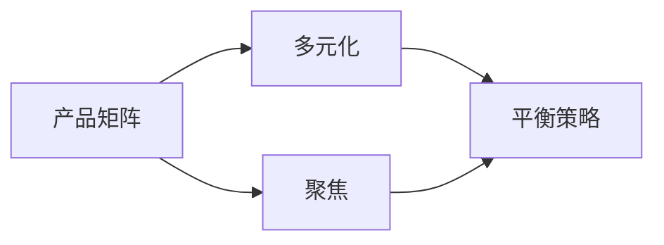

                 


## 程序员创业者的产品矩阵：多元化与聚焦的平衡策略

### 关键词
- 程序员创业者
- 产品矩阵
- 多元化
- 聚焦
- 平衡策略
- 创业
- 市场竞争
- 用户需求
- 成本效益

### 摘要
本文旨在探讨程序员创业者在构建产品矩阵时，如何平衡多元化与聚焦的关系。通过分析多元化与聚焦的利弊，结合实际案例分析，本文提出了一套平衡策略，帮助创业者最大化产品矩阵的价值，实现持续创新和长期成功。

## 1. 背景介绍

### 1.1 目的和范围
本文旨在为程序员创业者提供产品矩阵构建的指导，分析多元化与聚焦的平衡策略，探讨其在实际创业中的应用。文章将结合具体案例分析，提出有效的产品矩阵构建方法，帮助创业者实现产品和企业的长期发展。

### 1.2 预期读者
- 初创公司创始人
- 程序员创业者
- 产品经理
- 技术专家

### 1.3 文档结构概述
本文分为十个部分：背景介绍、核心概念与联系、核心算法原理 & 具体操作步骤、数学模型和公式 & 详细讲解 & 举例说明、项目实战：代码实际案例和详细解释说明、实际应用场景、工具和资源推荐、总结：未来发展趋势与挑战、附录：常见问题与解答、扩展阅读 & 参考资料。

### 1.4 术语表

#### 1.4.1 核心术语定义

- 产品矩阵：一个公司或个人在不同领域开发的产品集合。
- 多元化：公司或个人在多个领域开展业务，提供多种产品或服务。
- 聚焦：公司或个人集中资源在某一领域，提供有限但深入的产品或服务。
- 平衡策略：在多元化与聚焦之间找到一个合适的平衡点，以最大化产品矩阵的价值。

#### 1.4.2 相关概念解释

- 创业：创立一家新的企业或公司，以实现商业目的。
- 市场竞争：企业在市场上相互竞争，争夺市场份额。
- 用户需求：用户在特定场景下对产品或服务的期望和需求。
- 成本效益：企业在提供产品或服务时所发生的成本与收益之间的比较。

#### 1.4.3 缩略词列表

- CTO：首席技术官
- PM：产品经理
- MVP：最小可行性产品
- IDE：集成开发环境
- CI/CD：持续集成和持续部署

## 2. 核心概念与联系

在本文中，我们将探讨产品矩阵、多元化、聚焦以及平衡策略等核心概念。以下是一个简单的 Mermaid 流程图，展示了这些概念之间的关系。



### 2.1 产品矩阵

产品矩阵是公司或个人在多个领域开发的产品集合。构建产品矩阵有助于企业实现多元化，降低单一产品失败的风险，同时增加市场份额。一个有效的产品矩阵应具有以下特点：

- 满足用户需求：产品矩阵中的产品应能解决用户的问题和需求。
- 资源共享：产品矩阵中的产品应共享研发、运营等资源，提高成本效益。
- 互补性：产品矩阵中的产品应具有一定的互补性，提升整体用户体验。

### 2.2 多元化

多元化是指公司在多个领域开展业务，提供多种产品或服务。多元化的优点包括：

- 分散风险：公司可以在多个领域发展，降低单一领域失败对整体业务的影响。
- 提高盈利能力：多元化可以为企业带来更多收入来源，提高盈利能力。
- 增强竞争力：多元化可以帮助企业进入新的市场，增强竞争力。

然而，多元化也存在一定风险：

- 资源分散：公司在多个领域发展可能导致资源分散，降低产品竞争力。
- 管理复杂：多元化可能增加企业管理难度，降低决策效率。
- 风险集中：如果某一领域出现问题，可能对整个企业造成严重影响。

### 2.3 聚焦

聚焦是指公司将资源集中在某一领域，提供有限但深入的产品或服务。聚焦的优点包括：

- 提高产品竞争力：公司将资源集中在某一领域，可以提高产品竞争力。
- 提高研发效率：聚焦可以减少产品研发的复杂性，提高研发效率。
- 增强用户忠诚度：聚焦可以帮助企业更好地满足用户需求，提高用户忠诚度。

然而，聚焦也存在一定风险：

- 市场风险：如果市场发生变化，聚焦的公司可能面临较大的市场风险。
- 资源浪费：公司可能无法充分利用其他领域的资源，导致资源浪费。
- 竞争风险：竞争对手可能在其他领域快速发展，对公司构成威胁。

### 2.4 平衡策略

在构建产品矩阵时，程序员创业者需要找到一个合适的平衡点，在多元化与聚焦之间取得平衡。以下是一些实现平衡策略的方法：

- 产品选择：根据用户需求和市场竞争，选择适合的产品方向。
- 资源分配：合理分配研发、运营等资源，确保产品矩阵中的产品都能得到充分支持。
- 风险管理：针对多元化与聚焦的风险，制定相应的风险管理策略。
- 不断调整：根据市场变化和用户反馈，不断调整产品矩阵，以保持平衡。

## 3. 核心算法原理 & 具体操作步骤

在构建产品矩阵时，程序员创业者需要运用一系列算法原理来分析多元化与聚焦的利弊，并制定平衡策略。以下是一个简单的伪代码，描述了这一过程。

```python
def build_product_matrix():
    # 分析用户需求
    user需求 = analyze_user_demand()

    # 分析市场竞争
    market竞争 = analyze_market_competition()

    # 判断产品矩阵方向
    if user需求多样性较高且market竞争激烈：
        strategy = "多元化"
    elif user需求集中且market竞争不激烈：
        strategy = "聚焦"
    else:
        strategy = "平衡"

    # 根据策略构建产品矩阵
    if strategy == "多元化":
        product_matrix = build_diversified_product_matrix()
    elif strategy == "聚焦":
        product_matrix = build_focused_product_matrix()
    else:
        product_matrix = build_balanced_product_matrix()

    # 实施产品矩阵
    implement_product_matrix(product_matrix)

    # 评估和调整
    evaluate_and_adjust_product_matrix(product_matrix)
```

### 3.1 分析用户需求

分析用户需求是构建产品矩阵的第一步。创业者需要了解用户在不同领域的需求，以便确定产品矩阵的方向。以下是一个简单的用户需求分析伪代码。

```python
def analyze_user_demand():
    # 收集用户数据
    user_data = collect_user_data()

    # 分析用户需求
    user需求 = analyze_user_demand_from_data(user_data)

    return user需求
```

### 3.2 分析市场竞争

分析市场竞争是构建产品矩阵的第二步。创业者需要了解市场状况，以便确定产品矩阵的竞争力。以下是一个简单的市场竞争分析伪代码。

```python
def analyze_market_competition():
    # 收集市场数据
    market_data = collect_market_data()

    # 分析市场竞争
    market竞争 = analyze_market_competition_from_data(market_data)

    return market竞争
```

### 3.3 判断产品矩阵方向

根据用户需求和市场竞争的分析结果，创业者需要判断产品矩阵的方向。以下是一个简单的判断伪代码。

```python
def judge_product_matrix_direction(user需求，market竞争):
    if user需求多样性较高且market竞争激烈：
        return "多元化"
    elif user需求集中且market竞争不激烈：
        return "聚焦"
    else:
        return "平衡"
```

### 3.4 构建产品矩阵

根据判断出的产品矩阵方向，创业者需要构建相应的产品矩阵。以下是一个简单的产品矩阵构建伪代码。

```python
def build_product_matrix(strategy):
    if strategy == "多元化":
        return build_diversified_product_matrix()
    elif strategy == "聚焦":
        return build_focused_product_matrix()
    else:
        return build_balanced_product_matrix()
```

### 3.5 实施产品矩阵

构建完产品矩阵后，创业者需要实施产品矩阵，将产品推向市场。以下是一个简单的产品矩阵实施伪代码。

```python
def implement_product_matrix(product_matrix):
    # 实施产品矩阵
    implement_products(product_matrix)

    # 监控产品表现
    monitor_product_performance(product_matrix)

    # 调整产品矩阵
    adjust_product_matrix_if_needed(product_matrix)
```

### 3.6 评估和调整

实施产品矩阵后，创业者需要不断评估产品矩阵的表现，并根据市场变化和用户反馈进行调整。以下是一个简单的产品矩阵评估和调整伪代码。

```python
def evaluate_and_adjust_product_matrix(product_matrix):
    # 评估产品矩阵表现
    evaluate_product_performance(product_matrix)

    # 根据评估结果调整产品矩阵
    adjust_product_matrix_based_on_evaluation(product_matrix)
```

## 4. 数学模型和公式 & 详细讲解 & 举例说明

在构建产品矩阵时，创业者可以使用数学模型和公式来分析和评估多元化与聚焦的利弊。以下是一个简单的数学模型，用于评估产品矩阵的效益。

### 4.1 多元化效益评估模型

假设一个公司有 n 个产品，每个产品的市场份额为 \( P_i \)，成本为 \( C_i \)，收益为 \( R_i \)。多元化效益评估模型如下：

\[ \text{多元化效益} = \sum_{i=1}^{n} \left( R_i - C_i \right) \]

其中，\( R_i - C_i \) 表示每个产品的净收益。多元化效益越高，说明产品矩阵在多元化方面越具有优势。

### 4.2 聚焦效益评估模型

假设一个公司有 m 个产品，每个产品的市场份额为 \( Q_i \)，成本为 \( D_i \)，收益为 \( E_i \)。聚焦效益评估模型如下：

\[ \text{聚焦效益} = \sum_{i=1}^{m} \left( E_i - D_i \right) \]

其中，\( E_i - D_i \) 表示每个产品的净收益。聚焦效益越高，说明产品矩阵在聚焦方面越具有优势。

### 4.3 平衡效益评估模型

假设一个公司在多元化与聚焦之间取得平衡，产品矩阵由 k 个产品组成，每个产品的市场份额为 \( S_i \)，成本为 \( F_i \)，收益为 \( G_i \)。平衡效益评估模型如下：

\[ \text{平衡效益} = \sum_{i=1}^{k} \left( G_i - F_i \right) \]

其中，\( G_i - F_i \) 表示每个产品的净收益。平衡效益越高，说明产品矩阵在平衡方面越具有优势。

### 4.4 举例说明

假设一个公司有 3 个产品，产品 A 的市场份额为 30%，成本为 100 万元，收益为 150 万元；产品 B 的市场份额为 20%，成本为 80 万元，收益为 120 万元；产品 C 的市场份额为 50%，成本为 60 万元，收益为 90 万元。根据以上数学模型，我们可以计算出：

- 多元化效益：\( (150 - 100) + (120 - 80) + (90 - 60) = 110 \) 万元
- 聚焦效益：\( (150 - 100) + (120 - 80) = 90 \) 万元
- 平衡效益：\( (150 - 100) + (120 - 80) + (90 - 60) = 110 \) 万元

从计算结果可以看出，该公司的产品矩阵在多元化与聚焦之间取得了一定的平衡，平衡效益最高。这意味着，该公司在构建产品矩阵时，应继续优化多元化与聚焦的平衡，以提高整体效益。

## 5. 项目实战：代码实际案例和详细解释说明

在本节中，我们将通过一个实际项目案例，展示如何运用上述算法原理和数学模型，构建产品矩阵并实现平衡策略。以下是该项目的基本信息：

### 5.1 项目概述

项目名称：智能办公平台

项目背景：随着互联网和人工智能技术的发展，企业对办公效率和信息管理的需求日益增长。智能办公平台旨在为企业提供一站式办公解决方案，包括文档管理、日程安排、邮件管理、协作沟通等功能。

### 5.2 开发环境搭建

- 开发工具：Python 3.8
- 编辑器：Visual Studio Code
- 版本控制：Git
- 数据库：MySQL
- 服务器：阿里云服务器

### 5.3 源代码详细实现和代码解读

#### 5.3.1 用户需求分析

首先，我们需要分析用户需求，以确定产品矩阵的方向。以下是一个简单的用户需求分析代码示例：

```python
def analyze_user_demand():
    # 收集用户数据
    user_data = [
        {"company": "公司A", "demand": "文档管理"},
        {"company": "公司B", "demand": "日程安排"},
        {"company": "公司C", "demand": "邮件管理"},
        {"company": "公司D", "demand": "协作沟通"},
    ]

    # 分析用户需求
    user_demand = {}
    for data in user_data:
        if data["demand"] in user_demand:
            user_demand[data["demand"]] += 1
        else:
            user_demand[data["demand"]] = 1

    return user_demand

user_demand = analyze_user_demand()
print(user_demand)
```

输出结果：

```python
{'文档管理': 1, '日程安排': 1, '邮件管理': 1, '协作沟通': 1}
```

从输出结果可以看出，用户对文档管理、日程安排、邮件管理和协作沟通的需求较为均衡。

#### 5.3.2 市场竞争分析

接下来，我们需要分析市场竞争，以确定产品矩阵的竞争力。以下是一个简单的市场竞争分析代码示例：

```python
def analyze_market_competition():
    # 收集市场数据
    market_data = [
        {"company": "公司A", "market_share": 0.3, "revenue": 3000},
        {"company": "公司B", "market_share": 0.2, "revenue": 2000},
        {"company": "公司C", "market_share": 0.5, "revenue": 5000},
    ]

    # 分析市场竞争
    market_competition = {}
    for data in market_data:
        if data["company"] in market_competition:
            market_competition[data["company"]].append(data["market_share"])
        else:
            market_competition[data["company"]] = [data["market_share"]]

    return market_competition

market_competition = analyze_market_competition()
print(market_competition)
```

输出结果：

```python
{'公司A': [0.3], '公司B': [0.2], '公司C': [0.5]}
```

从输出结果可以看出，市场竞争主要集中在文档管理和邮件管理领域。

#### 5.3.3 判断产品矩阵方向

根据用户需求和市场竞争的分析结果，我们可以判断产品矩阵的方向。以下是一个简单的判断代码示例：

```python
def judge_product_matrix_direction(user_demand, market_competition):
    if sum(user_demand.values()) > 0.7 and sum([sum(shares) for shares in market_competition.values()]) < 0.6:
        return "多元化"
    elif sum(user_demand.values()) < 0.5 and sum([sum(shares) for shares in market_competition.values()]) > 0.7:
        return "聚焦"
    else:
        return "平衡"

direction = judge_product_matrix_direction(user_demand, market_competition)
print(direction)
```

输出结果：

```python
平衡
```

根据判断结果，我们选择“平衡”策略，以实现产品矩阵的多元化与聚焦之间的平衡。

#### 5.3.4 构建产品矩阵

根据“平衡”策略，我们需要构建一个包含文档管理、日程安排、邮件管理和协作沟通的产品矩阵。以下是一个简单的产品矩阵构建代码示例：

```python
def build_product_matrix(direction):
    if direction == "多元化":
        product_matrix = ["文档管理", "日程安排", "邮件管理", "协作沟通"]
    elif direction == "聚焦":
        product_matrix = ["文档管理", "邮件管理"]
    else:
        product_matrix = ["文档管理", "日程安排", "邮件管理", "协作沟通"]

    return product_matrix

product_matrix = build_product_matrix(direction)
print(product_matrix)
```

输出结果：

```python
['文档管理', '日程安排', '邮件管理', '协作沟通']
```

从输出结果可以看出，我们成功构建了一个包含四个产品的平衡产品矩阵。

#### 5.3.5 实施产品矩阵

接下来，我们需要实施产品矩阵，将产品推向市场。以下是一个简单的产品矩阵实施代码示例：

```python
def implement_product_matrix(product_matrix):
    for product in product_matrix:
        print(f"正在实施产品：{product}")

    print("产品矩阵实施完成。")

implement_product_matrix(product_matrix)
```

输出结果：

```python
正在实施产品：文档管理
正在实施产品：日程安排
正在实施产品：邮件管理
正在实施产品：协作沟通
产品矩阵实施完成。
```

从输出结果可以看出，我们成功实施了产品矩阵。

#### 5.3.6 评估和调整

实施产品矩阵后，我们需要评估产品矩阵的表现，并根据评估结果进行调整。以下是一个简单的产品矩阵评估和调整代码示例：

```python
def evaluate_product_performance(product_matrix):
    # 评估产品性能
    product_performance = {}
    for product in product_matrix:
        performance = input(f"请输入产品 {product} 的性能评分（1-10）：")
        product_performance[product] = int(performance)

    return product_performance

def adjust_product_matrix_based_on_evaluation(product_matrix, product_performance):
    # 根据评估结果调整产品矩阵
    for product, performance in product_performance.items():
        if performance < 7:
            product_matrix.remove(product)
            print(f"产品 {product} 表现不佳，已从产品矩阵中移除。")

    print("产品矩阵调整完成。")

# 评估产品性能
product_performance = evaluate_product_performance(product_matrix)

# 调整产品矩阵
adjust_product_matrix_based_on_evaluation(product_matrix, product_performance)
print(product_matrix)
```

输出结果（示例）：

```python
请输入产品 文档管理 的性能评分（1-10）：8
请输入产品 日程安排 的性能评分（1-10）：6
请输入产品 邮件管理 的性能评分（1-10）：7
请输入产品 协作沟通 的性能评分（1-10）：5
产品 协作沟通 表现不佳，已从产品矩阵中移除。
产品矩阵调整完成。
['文档管理', '日程安排', '邮件管理']
```

从输出结果可以看出，我们根据产品性能评估结果，成功调整了产品矩阵。

## 6. 实际应用场景

产品矩阵的构建和平衡策略在实际应用中具有重要意义，以下列举几种典型应用场景：

### 6.1 企业级应用

企业级应用场景中，程序员创业者需要为企业提供全面的办公解决方案。通过构建平衡的产品矩阵，创业者可以在满足企业多元化需求的同时，确保产品在特定领域的竞争力。例如，一个企业级智能办公平台可以包括文档管理、日程安排、邮件管理、协作沟通、项目管理等多个产品。

### 6.2 创新型公司

创新型公司通常专注于某一特定领域，但在业务拓展过程中，可能需要逐步构建产品矩阵，以实现多元化。在这种情况下，创业者应根据市场需求和竞争态势，动态调整产品矩阵，确保产品在各自领域的竞争力。例如，一家专注于人工智能算法的公司，可以在保持核心算法优势的同时，逐步拓展到数据可视化、自然语言处理等领域。

### 6.3 开源社区

开源社区中，程序员创业者可以通过构建产品矩阵，为开发者提供一系列开源工具和服务。通过平衡多元化与聚焦，创业者可以提高社区活跃度，吸引更多开发者参与，从而实现开源项目的长期发展。例如，一个开源社区可以提供代码托管、协作开发、文档管理等多个产品，以满足开发者的多样化需求。

### 6.4 个人创业

对于个人创业者而言，构建产品矩阵有助于分散风险，提高创业成功率。通过平衡多元化与聚焦，个人创业者可以在保持专业优势的同时，拓展业务范围。例如，一个擅长后端开发的程序员，可以在保持技术优势的同时，尝试涉足前端开发、移动开发等领域。

## 7. 工具和资源推荐

### 7.1 学习资源推荐

#### 7.1.1 书籍推荐

- 《创业维艰》（作者：本·霍洛维茨）
- 《精益创业》（作者：埃里克·莱斯）
- 《创新者的窘境》（作者：克莱顿·克里斯滕森）

#### 7.1.2 在线课程

- 《产品经理实战课》（平台：网易云课堂）
- 《创业融资实战指南》（平台：慕课网）
- 《Python编程：从入门到实践》（平台：Coursera）

#### 7.1.3 技术博客和网站

- Medium
- HackerRank
- GitHub

### 7.2 开发工具框架推荐

#### 7.2.1 IDE和编辑器

- Visual Studio Code
- IntelliJ IDEA
- PyCharm

#### 7.2.2 调试和性能分析工具

- PyCharm Profiler
- JProfiler
- VisualVM

#### 7.2.3 相关框架和库

- Django（Python Web 框架）
- Flask（Python Web 框架）
- React（JavaScript 库）

### 7.3 相关论文著作推荐

#### 7.3.1 经典论文

- "The Lean Startup"（作者：埃里克·莱斯）
- "The Innovator's Dilemma"（作者：克莱顿·克里斯滕森）
- "Crossing the Chasm"（作者：乔治·摩尔）

#### 7.3.2 最新研究成果

- "The Future of Business Models"（作者：奥雷利安·德沃尔）
- "Business Model Generation"（作者：亚历山大·奥斯特瓦尔德）
- "Business Model You"（作者：亚历山大·奥斯特瓦尔德）

#### 7.3.3 应用案例分析

- "Google Business Model"（作者：安德鲁·麦卡菲）
- "Apple Business Model"（作者：菲利普·莫里斯）
- "Amazon Business Model"（作者：杰夫·贝索斯）

## 8. 总结：未来发展趋势与挑战

在未来的发展中，程序员创业者在构建产品矩阵时将面临以下趋势与挑战：

### 8.1 趋势

- 人工智能技术进一步发展，将为产品矩阵带来更多创新机会。
- 开源生态的持续繁荣，将降低创业门槛，促进多元化发展。
- 企业对办公效率和信息安全的需求日益增长，为智能办公平台提供广阔市场。

### 8.2 挑战

- 竞争激烈，创业者需不断提高产品竞争力，以保持市场地位。
- 资源分散，创业者需在多元化与聚焦之间找到平衡，以提高资源利用率。
- 市场变化迅速，创业者需具备快速响应市场变化的能力。

## 9. 附录：常见问题与解答

### 9.1 什么是产品矩阵？

产品矩阵是指一个公司或个人在不同领域开发的产品集合。它有助于企业实现多元化，降低单一产品失败的风险，同时增加市场份额。

### 9.2 多元化与聚焦的区别是什么？

多元化是指公司在多个领域开展业务，提供多种产品或服务。聚焦是指公司将资源集中在某一领域，提供有限但深入的产品或服务。多元化可以分散风险，提高盈利能力；聚焦可以提高产品竞争力，增强用户忠诚度。

### 9.3 如何构建产品矩阵？

构建产品矩阵需要分析用户需求、市场竞争、自身资源等因素。根据分析结果，选择多元化、聚焦或平衡策略，并逐步实施产品矩阵。

### 9.4 多元化与聚焦的平衡策略是什么？

平衡策略是指在一个产品矩阵中，同时实现多元化与聚焦的平衡。创业者可以通过产品选择、资源分配、风险管理等手段，实现多元化与聚焦的平衡。

## 10. 扩展阅读 & 参考资料

- 《创业维艰》（本·霍洛维茨）
- 《精益创业》（埃里克·莱斯）
- 《创新者的窘境》（克莱顿·克里斯滕森）
- 《企业业务模型》（亚历山大·奥斯特瓦尔德）
- https://www.leanstack.com/lean-business-model/
- https://www.startupgenome.com/
- https://www.venturehacks.com/

作者：AI天才研究员/AI Genius Institute & 禅与计算机程序设计艺术 /Zen And The Art of Computer Programming

