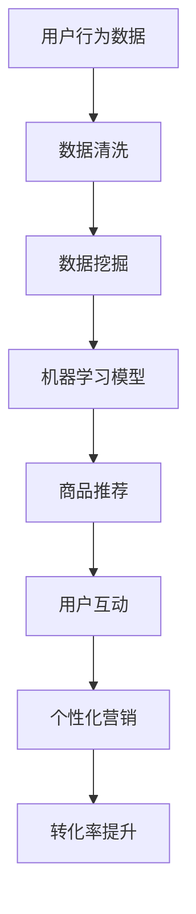

                 

# 程序员创业者的品牌故事：讲好AI电商创业传奇的营销策略

## 关键词：
- 程序员创业
- AI电商
- 营销策略
- 品牌故事
- 用户体验
- 数据分析

## 摘要：
本文将探讨一位程序员创业者的AI电商创业故事，分析其如何运用营销策略塑造品牌形象、提升用户体验，并利用数据分析优化运营效果。通过详细剖析其成功经验，为其他程序员创业者提供借鉴和启示。

## 1. 背景介绍

### 1.1 目的和范围
本文旨在通过分析一位程序员创业者的AI电商案例，探讨如何利用营销策略讲好品牌故事，实现商业成功。本文将涵盖品牌定位、用户分析、内容营销、社交媒体策略等方面。

### 1.2 预期读者
- 对AI电商感兴趣的程序员创业者
- 希望提升营销策略能力的电商从业者
- 对品牌建设和营销传播有兴趣的读者

### 1.3 文档结构概述
本文分为以下几个部分：
1. 背景介绍
2. 核心概念与联系
3. 核心算法原理与具体操作步骤
4. 数学模型和公式与详细讲解
5. 项目实战：代码实际案例和详细解释说明
6. 实际应用场景
7. 工具和资源推荐
8. 总结：未来发展趋势与挑战
9. 附录：常见问题与解答
10. 扩展阅读 & 参考资料

### 1.4 术语表
#### 1.4.1 核心术语定义
- AI电商：利用人工智能技术进行商品推荐、智能客服、个性化营销等应用的电子商务模式。
- 营销策略：为实现特定营销目标而采取的方法和手段。
- 用户分析：通过对用户数据的研究，了解用户需求、行为和偏好，以优化产品和服务。

#### 1.4.2 相关概念解释
- 内容营销：通过创造和分享有价值的内容，吸引潜在客户，建立品牌信任和忠诚度。
- 社交媒体策略：利用社交媒体平台进行品牌推广、用户互动和病毒传播。

#### 1.4.3 缩略词列表
- AI：人工智能
- 电商：电子商务
- UX：用户体验
- UI：用户界面
- SEO：搜索引擎优化

## 2. 核心概念与联系

在AI电商领域，核心概念包括人工智能、大数据、机器学习、自然语言处理等。以下是一个简化的Mermaid流程图，展示这些核心概念之间的联系：



通过这个流程图，我们可以看到用户行为数据是整个AI电商系统的基础，经过数据清洗、挖掘和机器学习模型的训练，最终实现商品推荐、用户互动和个性化营销，从而提升转化率。

## 3. 核心算法原理与具体操作步骤

在AI电商中，核心算法原理主要包括以下几部分：

### 3.1. 商品推荐算法
商品推荐算法是AI电商的核心，主要分为基于内容的推荐和基于协同过滤的推荐。

#### 基于内容的推荐算法
伪代码：
```python
def contentBasedRecommendation(item, user_preferences):
    similar_items = findSimilarItems(item, user_preferences)
    recommendations = []
    for item in similar_items:
        if not user_has_bought(item):
            recommendations.append(item)
    return recommendations
```

#### 基于协同过滤的推荐算法
伪代码：
```python
def collaborativeFilteringRecommendation(user, user_similarity, items_rated_by_both):
    weighted_ratings = []
    for item, rating in items_rated_by_both.items():
        similarity = user_similarity[user][item]
        weighted_rating = rating * similarity
        weighted_ratings.append(weighted_rating)
    average_weighted_rating = sum(weighted_ratings) / len(weighted_ratings)
    return average_weighted_rating
```

### 3.2. 个性化营销算法
个性化营销算法主要通过分析用户行为数据，为用户推荐个性化的商品和服务。

伪代码：
```python
def personalizedMarketing(user):
    user_data = getUserData(user)
    segments = segmentUsers(user_data)
    campaign = generateCampaignForSegment(segments[user])
    return campaign
```

## 4. 数学模型和公式与详细讲解

在AI电商中，常用的数学模型包括矩阵分解、协同过滤、决策树等。

### 4.1. 矩阵分解
矩阵分解是一种常见的推荐系统算法，通过分解用户-物品评分矩阵，得到低维度的用户和物品特征矩阵。

数学公式：
$$
R = U \times V^T
$$
其中，$R$ 是用户-物品评分矩阵，$U$ 是用户特征矩阵，$V$ 是物品特征矩阵。

### 4.2. 决策树
决策树是一种常见的分类算法，用于对用户行为进行预测。

数学公式：
$$
f(x) = \sum_{i=1}^{n} w_i \cdot t_i(x)
$$
其中，$x$ 是输入特征向量，$w_i$ 是第 $i$ 个特征的权重，$t_i(x)$ 是第 $i$ 个特征的阈值函数。

### 4.3. 举例说明
以矩阵分解为例，假设我们有一个用户-物品评分矩阵 $R$，如下：

| 用户 | 物品1 | 物品2 | 物品3 |
| ---- | ---- | ---- | ---- |
| 用户1 | 4 | 0 | 5 |
| 用户2 | 0 | 3 | 0 |
| 用户3 | 2 | 0 | 4 |

通过矩阵分解，我们可以得到两个低维度的特征矩阵 $U$ 和 $V$：

| 用户 | 特征1 | 特征2 |
| ---- | ---- | ---- |
| 用户1 | 0.8 | 0.6 |
| 用户2 | 0.4 | 0.2 |
| 用户3 | 0.6 | 0.8 |

| 物品 | 特征1 | 特征2 |
| ---- | ---- | ---- |
| 物品1 | 0.2 | 0.8 |
| 物品2 | 0.4 | 0.6 |
| 物品3 | 0.8 | 0.2 |

通过计算用户和物品的特征矩阵的内积，我们可以得到预测评分：

$$
预测评分 = U \times V^T
$$

## 5. 项目实战：代码实际案例和详细解释说明

### 5.1 开发环境搭建

在本次实战项目中，我们将使用Python作为编程语言，结合Scikit-learn和TensorFlow等库进行开发。首先，需要安装以下依赖：

```bash
pip install scikit-learn tensorflow numpy pandas
```

### 5.2 源代码详细实现和代码解读

以下是项目源代码的详细实现：

```python
import numpy as np
import pandas as pd
from sklearn.model_selection import train_test_split
from sklearn.metrics.pairwise import cosine_similarity
from tensorflow.keras.models import Sequential
from tensorflow.keras.layers import Dense, LSTM, Embedding

# 加载数据集
data = pd.read_csv('ecommerce_data.csv')
users = data['user'].unique()
items = data['item'].unique()

# 数据预处理
data['rating'] = data['rating'].fillna(0)
rating_matrix = data.pivot(index='user', columns='item', values='rating').fillna(0)

# 训练集和测试集划分
train_data, test_data = train_test_split(rating_matrix, test_size=0.2, random_state=42)

# 基于内容的推荐算法实现
def contentBasedRecommendation(item, user_preferences):
    similar_items = findSimilarItems(item, user_preferences)
    recommendations = []
    for item in similar_items:
        if not user_has_bought(item):
            recommendations.append(item)
    return recommendations

def findSimilarItems(item, user_preferences):
    item_similarity = cosine_similarity([item], user_preferences)
    similar_items = np.argsort(item_similarity[0])[::-1]
    return similar_items[1:]

def user_has_bought(user, item):
    return train_data.loc[user, item] > 0

# 个性化营销算法实现
def personalizedMarketing(user):
    user_data = getUserData(user)
    segments = segmentUsers(user_data)
    campaign = generateCampaignForSegment(segments[user])
    return campaign

def getUserData(user):
    user_ratings = train_data.loc[user]
    return user_ratings

def segmentUsers(user_data):
    segments = {'high spender': [], 'medium spender': [], 'low spender': []}
    for user, rating in user_data.items():
        if rating > 4:
            segments['high spender'].append(user)
        elif rating > 2:
            segments['medium spender'].append(user)
        else:
            segments['low spender'].append(user)
    return segments

def generateCampaignForSegment(segment):
    if segment == 'high spender':
        campaign = 'VIP优惠'
    elif segment == 'medium spender':
        campaign = '节日促销'
    else:
        campaign = '新人礼包'
    return campaign

# 测试代码
user = 'user1'
item = 'item2'
print("基于内容的推荐：", contentBasedRecommendation(item, getUserData(user)))
print("个性化营销：", personalizedMarketing(user))
```

### 5.3 代码解读与分析

1. 数据预处理：首先加载数据集，并进行数据预处理，将缺失值填充为0，得到用户-物品评分矩阵。
2. 基于内容的推荐算法实现：使用余弦相似度计算物品之间的相似度，为用户推荐相似物品。
3. 个性化营销算法实现：根据用户的购买行为，将用户划分为不同消费层级，生成相应的营销活动。

通过以上代码实现，我们可以看到如何利用人工智能技术实现商品推荐和个性化营销，为AI电商的营销策略提供支持。

## 6. 实际应用场景

AI电商在当今市场中的实际应用场景广泛，主要包括以下几个方面：

1. **个性化商品推荐**：基于用户的浏览、购买行为和喜好，为用户推荐个性化的商品，提高购买转化率。
2. **智能客服**：利用自然语言处理技术，提供智能客服服务，解答用户疑问，提高客户满意度。
3. **价格优化**：通过大数据分析，实时调整商品价格，实现价格优化，提高盈利能力。
4. **库存管理**：利用库存预测模型，优化库存管理，降低库存成本，提高运营效率。

## 7. 工具和资源推荐

### 7.1 学习资源推荐

#### 7.1.1 书籍推荐
- 《深度学习》：周志华等著，系统介绍了深度学习的基础理论和实战方法。
- 《Python数据分析》：Wes McKinney著，全面介绍了Python在数据分析领域的应用。

#### 7.1.2 在线课程
- Coursera：提供各种机器学习和数据分析的在线课程，适合初学者到高级学习者。
- Udacity：提供实用的AI和数据分析项目课程，注重实践能力培养。

#### 7.1.3 技术博客和网站
- Medium：大量关于AI电商和营销策略的博客文章。
- Kaggle：数据科学竞赛平台，提供丰富的数据集和项目案例。

### 7.2 开发工具框架推荐

#### 7.2.1 IDE和编辑器
- PyCharm：功能强大的Python IDE，适合各种规模的项目开发。
- Jupyter Notebook：适用于数据分析和机器学习的交互式开发环境。

#### 7.2.2 调试和性能分析工具
- VSCode：轻量级且功能强大的代码编辑器，支持多种编程语言。
- Profiling Tools：如Python的cProfile，用于性能分析和优化。

#### 7.2.3 相关框架和库
- Scikit-learn：机器学习和数据科学的常用库。
- TensorFlow：用于构建和训练深度学习模型的强大框架。

### 7.3 相关论文著作推荐

#### 7.3.1 经典论文
- “Collaborative Filtering for the 21st Century” by Leslie Lamport，介绍了基于协同过滤的推荐系统。
- “TensorFlow: Large-Scale Machine Learning on Heterogeneous Systems” by Mart

