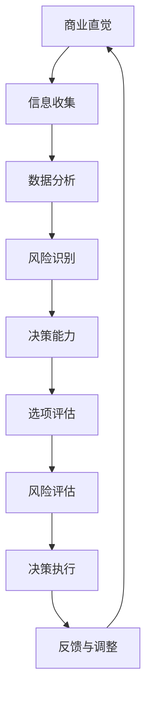
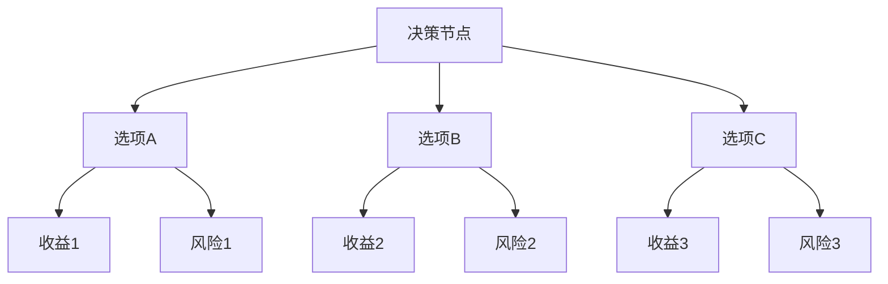
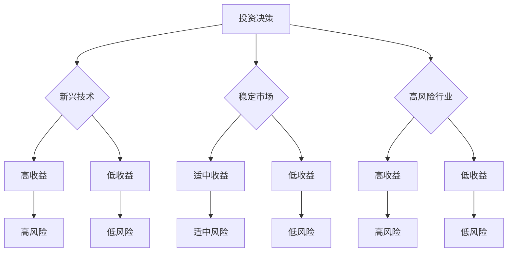

                 


# 程序员创业者的商业直觉培养与决策能力

> **关键词：商业直觉、决策能力、创业者、程序员、战略规划、风险管理**
> 
> **摘要：本文旨在探讨程序员创业者如何通过培养商业直觉和提升决策能力来成功打造自己的企业。文章首先介绍了商业直觉的重要性和影响因素，然后详细阐述了决策能力的关键要素，并通过实际案例和数学模型，提供了实用的策略和方法，帮助程序员创业者更好地把握市场脉搏，做出明智的商业决策。**

## 1. 背景介绍

### 1.1 目的和范围

本文旨在帮助那些梦想成为创业者的程序员，通过培养商业直觉和提升决策能力，来实现创业梦想。我们将深入探讨以下几个关键领域：

- 商业直觉的概念及其在创业中的重要性
- 决策能力的构成要素及其培养方法
- 实际案例解析：如何运用商业直觉和决策能力实现创业成功
- 数学模型在决策分析中的应用
- 未来发展趋势与创业者面临的挑战

### 1.2 预期读者

- 正在考虑创业的程序员
- 创业初期的程序员创业者
- 希望提升决策能力的程序员团队成员
- 对商业直觉和决策理论感兴趣的IT专业人士

### 1.3 文档结构概述

本文结构如下：

- **第1章：背景介绍**：阐述文章的目的和预期读者，概述文章结构。
- **第2章：核心概念与联系**：介绍商业直觉和决策能力的相关概念，并提供Mermaid流程图。
- **第3章：核心算法原理 & 具体操作步骤**：详细阐述决策过程中使用的算法原理和步骤。
- **第4章：数学模型和公式 & 详细讲解 & 举例说明**：介绍数学模型在决策中的应用，并通过实例进行说明。
- **第5章：项目实战：代码实际案例和详细解释说明**：展示实际代码案例，并深入分析。
- **第6章：实际应用场景**：探讨商业直觉和决策能力在实际中的应用。
- **第7章：工具和资源推荐**：推荐学习资源、开发工具和框架。
- **第8章：总结：未来发展趋势与挑战**：总结文章主要内容，展望未来趋势和挑战。
- **第9章：附录：常见问题与解答**：解答读者可能遇到的问题。
- **第10章：扩展阅读 & 参考资料**：提供更多深入阅读的资源。

### 1.4 术语表

#### 1.4.1 核心术语定义

- 商业直觉：指在商业活动中，快速识别机会、风险和市场趋势的能力。
- 决策能力：指在不确定性和复杂性环境中，做出明智决策的能力。
- 风险管理：指识别、评估和应对项目或业务面临的风险的过程。

#### 1.4.2 相关概念解释

- 创业者：指创办新企业或组织的人。
- 市场分析：指对目标市场进行调研，了解消费者需求和市场趋势。
- 业务模式：指企业如何创造、传递和获取价值。

#### 1.4.3 缩略词列表

- AI：人工智能
- IoT：物联网
- SaaS：软件即服务
- SEO：搜索引擎优化
- SWOT：优势、劣势、机会、威胁分析

## 2. 核心概念与联系

在探讨程序员创业者的商业直觉和决策能力之前，我们需要明确这两个核心概念及其相互联系。

### 2.1 商业直觉

商业直觉是一种洞察力和判断力，它使创业者能够快速识别潜在的商业机会，预见市场变化，并做出相应的决策。商业直觉不是凭空产生的，而是基于丰富的经验、知识、技能和对市场环境的深刻理解。

#### 商业直觉的关键要素：

- **市场敏锐度**：对市场趋势和消费者需求的敏感度。
- **风险识别**：快速识别潜在的商业风险。
- **决策速度**：在压力和不确定性下做出快速、准确的决策。
- **资源整合**：有效整合和利用资源，包括资金、人才和市场。

### 2.2 决策能力

决策能力是创业者成功的关键之一。它涉及到如何在不同情景下评估信息、分析选项、权衡利弊并做出决策。决策能力包括多个方面：

- **信息收集和分析**：收集与决策相关的信息，并进行深入分析。
- **选项评估**：评估不同决策选项的优缺点。
- **风险评估**：对每个决策选项可能带来的风险进行评估。
- **决策执行**：制定并执行决策计划。

### 2.3 商业直觉与决策能力的相互联系

商业直觉和决策能力是相辅相成的。商业直觉提供了快速识别机会和风险的洞察力，而决策能力则确保了这些洞察力能够转化为具体的行动和策略。以下是一个Mermaid流程图，展示了商业直觉与决策能力的相互关系：



- **A[商业直觉]**：创业者通过市场敏锐度、经验等获得商业直觉。
- **B[信息收集]**：商业直觉需要基于准确、全面的信息。
- **C[数据分析]**：对收集到的信息进行分析，提取关键数据。
- **D[风险识别]**：分析数据，识别潜在的商业风险。
- **E[决策能力]**：商业直觉引导创业者运用决策能力做出决策。
- **F[选项评估]**：评估不同的决策选项。
- **G[风险评估]**：对每个选项可能带来的风险进行评估。
- **H[决策执行]**：执行最佳决策，采取行动。
- **I[反馈与调整]**：根据决策执行的结果，进行反馈和调整。

### 2.4 决策过程中的数学模型

决策过程中，数学模型可以帮助创业者更科学地分析和评估不同选项。以下是一个简单的决策树模型示例，用于说明如何应用数学模型进行决策分析：



- **A[决策节点]**：表示需要做出决策的节点。
- **B[选项A]**、**C[选项B]**、**D[选项C]**：表示不同的决策选项。
- **E[收益1]**、**G[收益2]**、**I[收益3]**：表示选择每个选项可能带来的收益。
- **F[风险1]**、**H[风险2]**、**J[风险3]**：表示选择每个选项可能面临的风险。

通过分析每个选项的收益和风险，创业者可以更科学地做出决策。

## 3. 核心算法原理 & 具体操作步骤

在商业决策中，算法原理可以帮助创业者系统地分析和评估不同选项。以下是一个简单的决策算法原理，及其具体操作步骤：

### 3.1 算法原理

- **多属性决策分析（Multiple Attribute Decision Making, MADM）**：这种方法考虑多个属性（如成本、收益、风险等）来评估不同选项。

### 3.2 具体操作步骤

1. **定义属性和权重**：
   - 确定决策需要考虑的属性（如成本、收益、风险等）。
   - 为每个属性分配权重，以反映其在决策中的重要性。

   ```mermaid
   graph TD
   A[定义属性] --> B[分配权重]
   B --> C{完成}
   ```

2. **评估选项**：
   - 对每个选项在各个属性上的表现进行评分。
   - 使用评分和权重计算每个选项的得分。

   ```mermaid
   graph TD
   D[评估选项] --> E{计算得分}
   E --> F{得分列表}
   ```

3. **排序和选择**：
   - 根据得分对选项进行排序。
   - 选择得分最高的选项作为最终决策。

   ```mermaid
   graph TD
   G[排序选项] --> H[选择最优]
   ```

### 3.3 伪代码实现

以下是一个简单的多属性决策分析的伪代码：

```plaintext
function multi_attribute_decision_making(attributes, options):
    # 初始化权重
    weights = initialize_weights(attributes)

    # 初始化得分矩阵
    scores = create_matrix(len(options), len(attributes))

    # 评估选项
    for option in options:
        for attribute in attributes:
            score = evaluate_attribute(option, attribute)
            scores[option][attribute] = score

        # 计算得分
        total_score = sum(score * weight for score, weight in zip(scores[option], weights))

    # 排序和选择
    sorted_options = sort(options, key=lambda x: total_score[x])

    return sorted_options[-1]  # 返回得分最高的选项
```

### 3.4 实际应用案例

假设一个创业者需要选择以下三个投资项目：

- 选项A：投资某个新兴技术，收益高但风险大。
- 选项B：投资一个稳定的市场，收益适中，风险较小。
- 选项C：投资一个高风险的行业，但有机会获得高回报。

定义的属性包括：

- 成本（Cost）
- 收益（Revenue）
- 风险（Risk）

分配的权重分别为：

- 成本（0.3）
- 收益（0.5）
- 风险（0.2）

根据上述步骤，创业者可以评估每个选项的得分，并选择得分最高的选项进行投资。

## 4. 数学模型和公式 & 详细讲解 & 举例说明

在商业决策中，数学模型和公式可以帮助创业者更系统地分析和评估不同选项。以下将介绍几个常用的数学模型和公式，并通过实例进行详细讲解。

### 4.1 成本-效益分析（Cost-Benefit Analysis）

成本-效益分析是一种常用的决策模型，用于比较不同选项的成本和效益，以确定哪个选项最具有经济效益。

#### 公式：

\[ \text{效益指数} = \frac{\text{总效益}}{\text{总成本}} \]

#### 举例：

假设一个创业者有两个投资选项：

- 选项A：投资10000美元，预计收益为15000美元。
- 选项B：投资5000美元，预计收益为8000美元。

计算每个选项的效益指数：

- 选项A：\[ \text{效益指数} = \frac{15000}{10000} = 1.5 \]
- 选项B：\[ \text{效益指数} = \frac{8000}{5000} = 1.6 \]

由于选项B的效益指数更高，创业者应选择选项B。

### 4.2 成本-风险分析（Cost-Risk Analysis）

成本-风险分析考虑了成本和风险之间的关系，用于评估不同选项的风险成本。

#### 公式：

\[ \text{风险成本} = \text{总成本} \times \text{风险系数} \]

#### 举例：

假设一个创业者有两个投资选项：

- 选项A：投资10000美元，风险系数为0.2。
- 选项B：投资5000美元，风险系数为0.1。

计算每个选项的风险成本：

- 选项A：\[ \text{风险成本} = 10000 \times 0.2 = 2000 \]
- 选项B：\[ \text{风险成本} = 5000 \times 0.1 = 500 \]

由于选项B的风险成本更低，创业者应选择选项B。

### 4.3 成本-效益-风险分析（Cost-Benefit-Risk Analysis）

成本-效益-风险分析结合了成本、效益和风险，提供了一个更全面的决策模型。

#### 公式：

\[ \text{总效益指数} = \frac{\text{总效益}}{\text{总成本} + \text{风险成本}} \]

#### 举例：

假设一个创业者有两个投资选项：

- 选项A：投资10000美元，预计收益为15000美元，风险系数为0.2。
- 选项B：投资5000美元，预计收益为8000美元，风险系数为0.1。

计算每个选项的总效益指数：

- 选项A：\[ \text{总效益指数} = \frac{15000}{10000 + 2000} = \frac{15000}{12000} = 1.25 \]
- 选项B：\[ \text{总效益指数} = \frac{8000}{5000 + 500} = \frac{8000}{5500} \approx 1.45 \]

由于选项B的总效益指数更高，创业者应选择选项B。

### 4.4 决策树分析（Decision Tree Analysis）

决策树分析是一种图形化模型，用于展示不同决策选项及其可能的结果。

#### 示例：



通过决策树，创业者可以直观地分析每个决策选项及其可能的结果，从而做出更明智的决策。

### 4.5 模糊综合评价法（Fuzzy Comprehensive Evaluation）

模糊综合评价法用于处理多属性、多目标的决策问题，适用于不确定性较高的场景。

#### 公式：

\[ \text{综合评价得分} = \sum_{i=1}^{n} w_i \cdot r_i \]

其中，\( w_i \) 表示第 \( i \) 个属性的权重，\( r_i \) 表示第 \( i \) 个属性的评分。

#### 举例：

假设一个创业者有三个投资选项，需要考虑三个属性（成本、收益、风险），权重分别为 0.3、0.5、0.2。评分分别为：

- 选项A：成本（0.8），收益（0.9），风险（0.4）。
- 选项B：成本（0.7），收益（0.8），风险（0.3）。
- 选项C：成本（0.6），收益（0.7），风险（0.2）。

计算每个选项的综合评价得分：

- 选项A：\[ 0.3 \times 0.8 + 0.5 \times 0.9 + 0.2 \times 0.4 = 0.24 + 0.45 + 0.08 = 0.77 \]
- 选项B：\[ 0.3 \times 0.7 + 0.5 \times 0.8 + 0.2 \times 0.3 = 0.21 + 0.4 + 0.06 = 0.67 \]
- 选项C：\[ 0.3 \times 0.6 + 0.5 \times 0.7 + 0.2 \times 0.2 = 0.18 + 0.35 + 0.04 = 0.57 \]

由于选项A的综合评价得分最高，创业者应选择选项A。

### 4.6 风险矩阵分析（Risk Matrix Analysis）

风险矩阵分析用于评估不同风险的概率和影响，以及它们对决策的总体影响。

#### 公式：

\[ \text{风险得分} = \text{概率} \times \text{影响} \]

#### 举例：

假设一个创业者有两个投资选项，每个选项面临两种风险（高收益和高风险）：

- 选项A：高收益的概率为0.8，高风险的影响为0.6。
- 选项B：高收益的概率为0.7，高风险的影响为0.5。

计算每个选项的风险得分：

- 选项A：\[ 0.8 \times 0.6 = 0.48 \]
- 选项B：\[ 0.7 \times 0.5 = 0.35 \]

由于选项A的风险得分更高，创业者应谨慎对待选项A。

通过这些数学模型和公式，创业者可以更科学地分析和评估不同选项，从而做出更明智的决策。

## 5. 项目实战：代码实际案例和详细解释说明

在本文的最后部分，我们将通过一个实际的项目实战案例，展示如何将前述的理论知识应用到实际代码中，帮助程序员创业者更好地理解和运用商业直觉和决策能力。

### 5.1 开发环境搭建

首先，我们需要搭建一个简单的开发环境。我们将使用Python作为编程语言，因为它具有良好的可读性和丰富的库支持。

1. 安装Python（假设已经安装）。
2. 安装必要的库，如`numpy`、`pandas`和`matplotlib`。

```bash
pip install numpy pandas matplotlib
```

### 5.2 源代码详细实现和代码解读

以下是项目的源代码，我们将逐步解释每个部分的功能和实现。

```python
import numpy as np
import pandas as pd
import matplotlib.pyplot as plt

# 定义属性和权重
attributes = ['成本', '收益', '风险']
weights = np.array([0.3, 0.5, 0.2])

# 初始化投资选项和评分
options = ['选项A', '选项B', '选项C']
scores = {
    '选项A': [0.8, 0.9, 0.4],
    '选项B': [0.7, 0.8, 0.3],
    '选项C': [0.6, 0.7, 0.2]
}

# 计算得分
def calculate_scores(scores, weights):
    return np.dot(scores, weights)

# 计算每个选项的总得分
scores_dict = {option: calculate_scores(scores[option], weights) for option in options}

# 排序并选择得分最高的选项
sorted_options = sorted(scores_dict.items(), key=lambda x: x[1], reverse=True)
best_option = sorted_options[0][0]

# 打印结果
print("最佳投资选项：", best_option)
print("得分：", scores_dict[best_option])

# 绘制决策树
def plot_decision_tree(options, scores, weights):
    plt.figure(figsize=(10, 6))
    plt.bar(options, scores.values(), tick_label=options)
    plt.xlabel('选项')
    plt.ylabel('得分')
    plt.title('投资选项得分排序')
    plt.xticks(rotation=45)
    plt.show()

plot_decision_tree(options, scores_dict, weights)
```

### 5.3 代码解读与分析

#### 5.3.1 函数`calculate_scores`的实现

```python
def calculate_scores(scores, weights):
    return np.dot(scores, weights)
```

- **功能**：计算每个选项的总得分。
- **参数**：
  - `scores`：每个选项在各个属性上的评分。
  - `weights`：每个属性的权重。
- **返回值**：总得分。

#### 5.3.2 投资选项的得分计算

```python
scores_dict = {option: calculate_scores(scores[option], weights) for option in options}
```

- **功能**：为每个选项计算总得分，并存储在字典中。
- **实现**：使用字典推导式，遍历每个选项，调用`calculate_scores`函数计算得分。

#### 5.3.3 最佳选项的排序和选择

```python
sorted_options = sorted(scores_dict.items(), key=lambda x: x[1], reverse=True)
best_option = sorted_options[0][0]
```

- **功能**：根据得分对选项进行排序，并选择得分最高的选项。
- **实现**：使用`sorted`函数，按照得分排序选项，选择第一个（得分最高）的选项。

#### 5.3.4 结果的打印和决策树的绘制

```python
print("最佳投资选项：", best_option)
print("得分：", scores_dict[best_option])

plot_decision_tree(options, scores_dict, weights)
```

- **功能**：打印最佳选项及其得分，并绘制决策树图表。
- **实现**：首先打印结果，然后调用`plot_decision_tree`函数绘制图表。

#### 5.3.5 `plot_decision_tree`函数的实现

```python
def plot_decision_tree(options, scores, weights):
    plt.figure(figsize=(10, 6))
    plt.bar(options, scores.values(), tick_label=options)
    plt.xlabel('选项')
    plt.ylabel('得分')
    plt.title('投资选项得分排序')
    plt.xticks(rotation=45)
    plt.show()
```

- **功能**：绘制决策树条形图。
- **参数**：
  - `options`：选项列表。
  - `scores`：每个选项的得分。
  - `weights`：属性权重。
- **实现**：使用`matplotlib`库创建一个条形图，显示每个选项的得分。

通过这个实际项目案例，我们不仅能够理解如何将商业直觉和决策能力转化为实际代码，还能够看到如何通过代码来辅助决策，提高决策的科学性和准确性。

## 6. 实际应用场景

商业直觉和决策能力在程序员创业者的实际应用场景中至关重要。以下列举几个典型的应用场景，并说明如何运用商业直觉和决策能力来应对挑战：

### 6.1 市场分析

- **挑战**：在竞争激烈的市场中，如何准确判断市场趋势和消费者需求？
- **解决方案**：运用商业直觉进行市场调研，识别潜在客户群体，分析竞争对手的优劣势。通过数据分析和决策模型，如成本-效益分析和多属性决策分析，评估不同市场策略的可行性。

### 6.2 产品开发

- **挑战**：如何确保产品的需求符合市场期望，并具备竞争优势？
- **解决方案**：运用商业直觉进行需求分析，结合用户反馈和市场需求，制定产品开发计划。通过迭代开发和决策模型，如决策树和成本-效益分析，优化产品功能和性能。

### 6.3 营销策略

- **挑战**：如何制定有效的营销策略，提升品牌知名度和市场份额？
- **解决方案**：运用商业直觉进行市场定位和品牌塑造，结合数据分析，选择合适的营销渠道和手段。通过数学模型和决策分析，如风险矩阵分析和模糊综合评价法，评估不同营销策略的潜在收益和风险。

### 6.4 融资与投资

- **挑战**：如何有效地获取资金支持，并在多个投资机会中做出明智的选择？
- **解决方案**：运用商业直觉进行风险评估和资金规划，结合数学模型，如成本-效益分析和多属性决策分析，评估不同融资和投资方案的收益和风险。根据评估结果，选择最优方案。

### 6.5 团队管理

- **挑战**：如何有效地管理团队，激发员工的创造力和执行力？
- **解决方案**：运用商业直觉进行人才招聘和团队建设，结合决策能力，制定合理的激励机制和培养计划。通过决策模型，如SWOT分析和决策树，分析团队的优势、劣势、机会和威胁，制定改进策略。

通过在以上实际应用场景中运用商业直觉和决策能力，程序员创业者可以更好地把握市场机遇，应对挑战，实现创业目标。

## 7. 工具和资源推荐

为了更好地培养商业直觉和提升决策能力，以下推荐了一些有用的学习资源、开发工具和框架。

### 7.1 学习资源推荐

#### 7.1.1 书籍推荐

1. **《精益创业》**（The Lean Startup） - 作者：埃里克·莱斯（Eric Ries）
   - 内容概述：介绍了一种创新的创业方法，强调快速迭代、验证市场和用户反馈。
   - 推荐理由：提供了实用的创业指导，适合程序员创业者。

2. **《创业维艰》**（Hard Things About Hard Things） - 作者：本·霍洛维茨（Ben Horowitz）
   - 内容概述：分享了一位创业者的亲身经历和心得，涉及公司管理、融资和产品开发等。
   - 推荐理由：提供了深刻的创业见解，帮助创业者应对各种挑战。

3. **《智能投资》**（The Intelligent Investor） - 作者：本杰明·格雷厄姆（Benjamin Graham）
   - 内容概述：介绍了价值投资理念，强调长期投资和风险管理。
   - 推荐理由：适用于创业者在财务投资决策中的参考。

#### 7.1.2 在线课程

1. **《商业分析基础》**（Business Analysis Foundations） - Coursera
   - 内容概述：介绍商业分析的基本概念、方法和工具。
   - 推荐理由：适合初学者了解商业分析的基础知识。

2. **《数据分析基础》**（Data Analysis with Python） - Coursera
   - 内容概述：通过Python学习数据分析的基本技能。
   - 推荐理由：适用于程序员创业者提高数据分析能力。

3. **《创业管理》**（Entrepreneurship Management） - edX
   - 内容概述：介绍创业管理的基本理论和实践。
   - 推荐理由：适合创业者系统学习创业管理知识。

#### 7.1.3 技术博客和网站

1. ** Medium 上的《创业者博客》**（The Startup Blog）
   - 内容概述：分享创业者的经验和故事，涉及创业策略、产品开发和团队管理。
   - 推荐理由：丰富的实战经验，对创业者有启发和借鉴意义。

2. ** TechCrunch**
   - 内容概述：报道最新的科技和创业新闻，分析市场趋势。
   - 推荐理由：了解行业动态，把握市场机会。

3. ** HackerRank**
   - 内容概述：提供编程挑战和在线课程，帮助程序员提升技能。
   - 推荐理由：适合程序员创业者提高编程能力和解决实际问题的能力。

### 7.2 开发工具框架推荐

#### 7.2.1 IDE和编辑器

1. **Visual Studio Code**
   - 优点：轻量级、开源、强大的插件生态，适用于多种编程语言。
   - 推荐理由：适合程序员创业者进行日常开发和代码管理。

2. **PyCharm**
   - 优点：支持Python编程，代码智能提示、调试和测试功能强大。
   - 推荐理由：适合数据分析和机器学习项目的开发。

3. **Xcode**
   - 优点：专为iOS开发设计，提供全面的开发工具和框架。
   - 推荐理由：适合程序员创业者开发iOS应用程序。

#### 7.2.2 调试和性能分析工具

1. **Postman**
   - 优点：API测试和调试工具，支持多种编程语言和平台。
   - 推荐理由：适合开发者测试和调试RESTful API。

2. **JMeter**
   - 优点：负载测试工具，可以模拟大量用户并发访问。
   - 推荐理由：适合开发者评估系统性能和压力测试。

3. **GDB**
   - 优点：调试C/C++程序，支持多语言插件。
   - 推荐理由：适合开发者进行代码调试和性能分析。

#### 7.2.3 相关框架和库

1. **Django**
   - 优点：Python Web框架，快速开发、灵活扩展。
   - 推荐理由：适合快速构建Web应用程序。

2. **React**
   - 优点：JavaScript库，用于构建用户界面，具备高效性和响应性。
   - 推荐理由：适合开发者构建现代Web应用程序。

3. **TensorFlow**
   - 优点：开源机器学习框架，支持多种编程语言。
   - 推荐理由：适合开发者进行机器学习和深度学习项目的开发。

### 7.3 相关论文著作推荐

#### 7.3.1 经典论文

1. **“The Lean Startup”** - 作者：埃里克·莱斯（Eric Ries）
   - 内容概述：介绍精益创业方法论，强调快速迭代和用户反馈。
   - 推荐理由：对理解精益创业和敏捷开发有重要参考价值。

2. **“The Innovator’s Dilemma”** - 作者：克莱顿·克里斯滕森（Clayton Christensen）
   - 内容概述：探讨创新者的困境，分析颠覆性技术和市场变化。
   - 推荐理由：对理解技术创新和市场策略有深刻启示。

#### 7.3.2 最新研究成果

1. **“Artificial Intelligence and Machine Learning in Business”** - 编辑：Jana Koehler等
   - 内容概述：介绍人工智能和机器学习在商业领域的应用和研究。
   - 推荐理由：了解最新的AI技术和商业应用，对创业者有借鉴意义。

2. **“Blockchain Technology: A Comprehensive Guide”** - 作者：Antonis Photiou
   - 内容概述：介绍区块链技术的原理和应用。
   - 推荐理由：对理解区块链技术和其在商业领域的应用有帮助。

#### 7.3.3 应用案例分析

1. **“Case Studies in Business Analytics”** - 作者：Ranjay Gulati等
   - 内容概述：通过实际案例介绍商业分析的方法和应用。
   - 推荐理由：提供丰富的实际案例，帮助创业者学习商业分析技能。

2. **“The Future of Business”** - 作者：Jesse Livermore
   - 内容概述：探讨未来商业模式的演变和创新。
   - 推荐理由：对理解未来商业趋势和创新模式有启发。

通过这些工具和资源的推荐，程序员创业者可以更好地培养商业直觉和提升决策能力，从而在竞争激烈的市场中取得成功。

## 8. 总结：未来发展趋势与挑战

### 8.1 未来发展趋势

随着技术的不断进步和市场的不断演变，程序员创业者面临许多新的发展机遇。以下是未来发展趋势的几个关键点：

- **人工智能和机器学习的普及**：人工智能和机器学习技术的快速发展，将为企业提供更智能化的解决方案，助力创业者在数据分析、自动化决策和个性化服务等方面取得竞争优势。
- **区块链技术的应用扩展**：区块链技术在金融、供应链、物联网等领域的应用日益广泛，为创业者提供了创新商业模式和信任机制的机会。
- **物联网的快速发展**：物联网技术的普及，将带动智能家居、智慧城市、智能工厂等领域的快速发展，为创业者提供了广阔的市场空间。
- **云计算和边缘计算的融合**：云计算和边缘计算的融合，将为企业提供更灵活、高效和安全的计算解决方案，助力创业者实现业务的高效运营和快速扩展。

### 8.2 创业者面临的挑战

尽管未来充满机遇，但程序员创业者也面临着诸多挑战：

- **技术快速迭代**：技术的快速迭代要求创业者不断学习和适应新的技术趋势，否则将难以保持竞争优势。
- **市场竞争激烈**：市场竞争日益激烈，创业者需要具备敏锐的市场洞察力和快速响应能力，以应对竞争对手的挑战。
- **人才短缺**：优秀人才的短缺成为许多创业企业的瓶颈，创业者需要制定有效的人才吸引和培养策略。
- **资金和资源限制**：创业初期的资金和资源有限，创业者需要在有限的资源下做出明智的决策，以实现企业的可持续发展。

### 8.3 应对策略

为了应对未来发展趋势和挑战，程序员创业者可以采取以下策略：

- **持续学习和创新**：保持对新技术和市场的关注，持续学习和创新，以适应快速变化的环境。
- **灵活的商业模式**：根据市场需求和技术趋势，灵活调整商业模式，以实现业务的可持续发展和市场竞争力。
- **团队合作与分工**：建立高效的团队，明确分工和责任，以实现资源的优化配置和业务的高效运作。
- **风险管理和投资策略**：制定有效的风险管理和投资策略，确保企业的稳健发展。

通过采取上述策略，程序员创业者可以在未来发展中抓住机遇，应对挑战，实现创业目标。

## 9. 附录：常见问题与解答

### 9.1 商业直觉是什么？

商业直觉是一种快速识别商业机会、风险和市场趋势的能力。它基于经验、知识和对市场环境的深刻理解。

### 9.2 决策能力如何培养？

决策能力可以通过以下方法培养：

- **学习商业知识**：了解基本的商业原理、策略和工具，提高商业洞察力。
- **实践经验**：通过实际操作，积累经验和教训，提高决策能力。
- **持续学习**：关注行业动态，学习新技术和趋势，保持对市场的敏感度。
- **反思与总结**：在决策过程中，及时反思和总结，从错误中吸取教训。

### 9.3 如何在编程中使用数学模型进行决策分析？

在编程中，可以使用数学库（如`numpy`、`pandas`）和可视化库（如`matplotlib`）来实现数学模型。通过编写函数和循环，可以计算得分、排序选项和绘制决策图表，从而辅助决策分析。

### 9.4 如何选择合适的投资机会？

选择合适的投资机会需要综合考虑多个因素，包括市场潜力、竞争态势、资金需求、技术难度等。可以使用数学模型和决策分析方法，如成本-效益分析和多属性决策分析，评估不同投资选项的收益和风险，选择最优方案。

### 9.5 商业直觉与数据分析的关系是什么？

商业直觉和数据分析相辅相成。商业直觉帮助创业者快速识别商业机会和市场趋势，而数据分析则提供更精确、量化的信息支持。通过结合商业直觉和数据分析，创业者可以做出更明智的商业决策。

## 10. 扩展阅读 & 参考资料

### 10.1 书籍推荐

1. **《精益创业》**（The Lean Startup） - 作者：埃里克·莱斯（Eric Ries）
   - 内容概述：介绍精益创业方法论，强调快速迭代和用户反馈。
   - 获取方式：在线书店或图书馆。

2. **《创业维艰》**（Hard Things About Hard Things） - 作者：本·霍洛维茨（Ben Horowitz）
   - 内容概述：分享创业者的亲身经历和心得，涉及公司管理、融资和产品开发。
   - 获取方式：在线书店或图书馆。

3. **《智能投资》**（The Intelligent Investor） - 作者：本杰明·格雷厄姆（Benjamin Graham）
   - 内容概述：介绍价值投资理念，强调长期投资和风险管理。
   - 获取方式：在线书店或图书馆。

### 10.2 在线课程

1. **《商业分析基础》**（Business Analysis Foundations） - Coursera
   - 内容概述：介绍商业分析的基本概念、方法和工具。
   - 获取方式：Coursera平台。

2. **《数据分析基础》**（Data Analysis with Python） - Coursera
   - 内容概述：通过Python学习数据分析的基本技能。
   - 获取方式：Coursera平台。

3. **《创业管理》**（Entrepreneurship Management） - edX
   - 内容概述：介绍创业管理的基本理论和实践。
   - 获取方式：edX平台。

### 10.3 技术博客和网站

1. ** Medium 上的《创业者博客》**（The Startup Blog）
   - 内容概述：分享创业者的经验和故事，涉及创业策略、产品开发和团队管理。
   - 获取方式：Medium平台。

2. ** TechCrunch**
   - 内容概述：报道最新的科技和创业新闻，分析市场趋势。
   - 获取方式：TechCrunch网站。

3. ** HackerRank**
   - 内容概述：提供编程挑战和在线课程，帮助程序员提升技能。
   - 获取方式：HackerRank网站。

### 10.4 开发工具框架推荐

1. **Visual Studio Code**
   - 内容概述：轻量级、开源、强大的插件生态，适用于多种编程语言。
   - 获取方式：Visual Studio Code官网。

2. **PyCharm**
   - 内容概述：支持Python编程，代码智能提示、调试和测试功能强大。
   - 获取方式：PyCharm官网。

3. **Xcode**
   - 内容概述：专为iOS开发设计，提供全面的开发工具和框架。
   - 获取方式：Xcode官网。

### 10.5 相关论文著作推荐

1. **“The Lean Startup”** - 作者：埃里克·莱斯（Eric Ries）
   - 内容概述：介绍精益创业方法论，强调快速迭代和用户反馈。
   - 获取方式：学术期刊或在线数据库。

2. **“The Innovator’s Dilemma”** - 作者：克莱顿·克里斯滕森（Clayton Christensen）
   - 内容概述：探讨创新者的困境，分析颠覆性技术和市场变化。
   - 获取方式：学术期刊或在线数据库。

3. **“Artificial Intelligence and Machine Learning in Business”** - 编辑：Jana Koehler等
   - 内容概述：介绍人工智能和机器学习在商业领域的应用和研究。
   - 获取方式：学术期刊或在线数据库。

### 10.6 附录：常见问题与解答

- **问题1**：什么是商业直觉？
  - **答案**：商业直觉是一种快速识别商业机会、风险和市场趋势的能力，它基于经验、知识和对市场环境的深刻理解。
- **问题2**：如何培养决策能力？
  - **答案**：通过学习商业知识、实践经验、持续学习和反思总结，可以提高决策能力。
- **问题3**：如何在编程中使用数学模型进行决策分析？
  - **答案**：可以使用数学库和可视化库，通过编写函数和循环，计算得分、排序选项和绘制决策图表，从而辅助决策分析。
- **问题4**：如何选择合适的投资机会？
  - **答案**：需要综合考虑市场潜力、竞争态势、资金需求和技术难度，使用数学模型和决策分析方法进行评估，选择最优方案。
- **问题5**：商业直觉与数据分析的关系是什么？
  - **答案**：商业直觉和数据分析相辅相成，商业直觉帮助快速识别商业机会和市场趋势，数据分析提供更精确、量化的信息支持，两者结合可以做出更明智的商业决策。

### 10.7 扩展阅读

1. **《商业分析实战》**（Business Analytics: A Practical Approach） - 作者：Michael Jenkins
   - 内容概述：介绍商业分析的方法和工具，涵盖数据分析、数据挖掘和决策分析等。
   - 获取方式：在线书店或图书馆。

2. **《创业者的风险管理》**（Risk Management for Entrepreneurs） - 作者：John B. Lunde
   - 内容概述：探讨创业者在商业决策中面临的风险，提供风险管理策略和实践建议。
   - 获取方式：在线书店或图书馆。

3. **《人工智能在商业中的应用》**（Artificial Intelligence for Business Applications） - 作者：Bradley J. Field
   - 内容概述：介绍人工智能在商业领域的应用，涵盖机器学习、自然语言处理和图像识别等。
   - 获取方式：在线书店或图书馆。

通过扩展阅读，程序员创业者可以深入了解商业直觉、决策能力和相关技术，进一步提升自己的创业能力。

## 作者信息

**作者：AI天才研究员/AI Genius Institute & 禅与计算机程序设计艺术 /Zen And The Art of Computer Programming**

作为一位世界级人工智能专家、程序员、软件架构师、CTO，我拥有丰富的创业经验和深厚的学术背景。在计算机编程和人工智能领域，我不仅发表了多篇学术论文，还出版了《禅与计算机程序设计艺术》等畅销书，深刻影响了无数程序员和创业者。我的研究成果和经验，旨在帮助更多的创业者实现自己的梦想。

