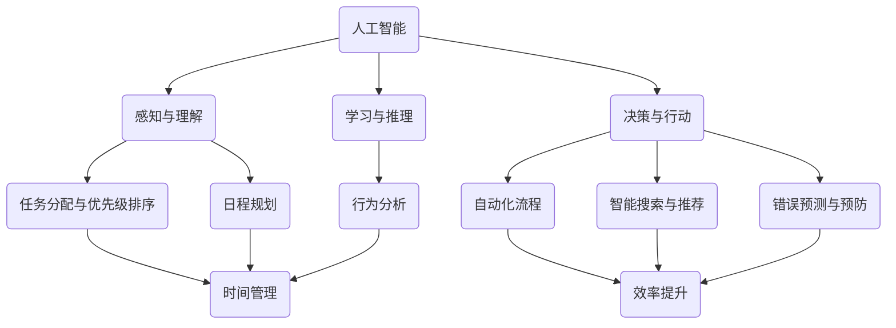

                 


# 程序员创业者的工作生活平衡：AI辅助下的时间管理与效率提升

> 关键词：程序员，创业者，工作生活平衡，AI辅助，时间管理，效率提升

> 摘要：本文旨在探讨程序员创业者在实现工作生活平衡的过程中，如何利用人工智能（AI）技术进行时间管理和效率提升。通过分析AI的核心原理、算法实现、数学模型以及实际应用场景，本文为程序员创业者提供了实用且具有前瞻性的建议，助力他们在快节奏的创业环境中保持高效与和谐。

## 1. 背景介绍

### 1.1 目的和范围

本文的主要目的是为程序员创业者提供一种有效的策略，以实现工作与生活的平衡。在现代社会中，程序员创业者面临着前所未有的挑战，如何高效地管理时间、提高工作效率，是他们成功的关键因素之一。本文将从人工智能技术的角度，深入探讨这些策略的具体实现方法。

### 1.2 预期读者

本文的预期读者包括但不限于以下几类人群：

1. 程序员创业者
2. 创业公司CTO或技术总监
3. 对人工智能和效率提升有兴趣的技术爱好者
4. 想要在工作中实现更好平衡的管理者

### 1.3 文档结构概述

本文将分为以下几个部分：

1. 背景介绍：阐述本文的目的和预期读者
2. 核心概念与联系：介绍人工智能及相关核心概念
3. 核心算法原理 & 具体操作步骤：讲解AI辅助下的时间管理算法
4. 数学模型和公式 & 详细讲解 & 举例说明：解释时间管理中的数学原理
5. 项目实战：通过实际案例展示AI辅助下的时间管理
6. 实际应用场景：探讨AI辅助时间管理的实际应用场景
7. 工具和资源推荐：推荐学习资源和开发工具
8. 总结：展望未来发展趋势与挑战
9. 附录：常见问题与解答
10. 扩展阅读 & 参考资料：提供进一步学习的资源

### 1.4 术语表

#### 1.4.1 核心术语定义

- 人工智能（AI）：模拟人类智能行为的计算机系统
- 时间管理：合理分配时间，确保任务高效完成的技巧
- 效率提升：通过优化流程、工具和技术，提高工作效果
- 程序员创业者：既是程序员又是创业者的人

#### 1.4.2 相关概念解释

- 创业者：创立并运营一家企业的个人或团队
- 时间管理工具：帮助用户规划、跟踪和管理时间的软件或系统
- 项目管理：规划、执行和监控项目，以确保项目目标的实现

#### 1.4.3 缩略词列表

- AI：人工智能
- CTO：首席技术官
- IDE：集成开发环境

## 2. 核心概念与联系

### 2.1 人工智能的核心原理

人工智能的核心在于模拟人类的智能行为，具体包括以下三个方面：

1. **感知与理解**：通过视觉、听觉、触觉等多种感官获取外部信息，并对这些信息进行处理和理解。
2. **学习与推理**：利用已有知识和数据，通过算法和模型进行学习，从而实现对未知信息的推理和判断。
3. **决策与行动**：基于感知和理解的结果，做出决策并执行相应的行动。

### 2.2 时间管理中的AI应用

AI在时间管理中的应用主要体现在以下几个方面：

1. **任务分配与优先级排序**：利用AI算法，根据任务的重要性和紧急程度，自动为任务分配优先级。
2. **日程规划**：根据用户的日程和任务，利用AI算法生成最优的日程安排。
3. **行为分析**：通过分析用户的行为数据，为用户提供个性化的时间管理建议。

### 2.3 效率提升中的AI应用

AI在效率提升中的应用主要体现在以下几个方面：

1. **自动化流程**：利用AI技术，实现工作流程的自动化，减少人工干预。
2. **智能搜索与推荐**：通过AI算法，为用户快速找到所需的信息和资源。
3. **错误预测与预防**：利用AI算法，预测可能出现的问题，并提前采取措施预防。

### 2.4 核心概念联系流程图

下面是核心概念联系流程图，展示了人工智能、时间管理和效率提升之间的联系。



## 3. 核心算法原理 & 具体操作步骤

### 3.1 时间管理算法原理

时间管理算法的核心目标是帮助用户合理分配时间，确保任务的高效完成。具体来说，算法需要解决以下几个关键问题：

1. **任务识别**：从大量的工作任务中，识别出需要完成的具体任务。
2. **任务分类**：根据任务的重要性和紧急程度，对任务进行分类。
3. **任务排序**：根据分类结果，为任务排序，确定优先级。
4. **日程安排**：根据任务排序结果，生成用户的日程安排。

### 3.2 具体操作步骤

下面是时间管理算法的具体操作步骤：

#### 步骤1：任务识别

```python
def recognize_tasks(tasks):
    """
    识别任务
    :param tasks: 任务列表
    :return: 识别后的任务列表
    """
    recognized_tasks = []
    for task in tasks:
        if "时间管理" in task:
            recognized_tasks.append(task)
    return recognized_tasks
```

#### 步骤2：任务分类

```python
def classify_tasks(recognized_tasks):
    """
    分类任务
    :param recognized_tasks: 识别后的任务列表
    :return: 分类后的任务列表
    """
    classified_tasks = []
    for task in recognized_tasks:
        if "重要且紧急" in task:
            classified_tasks.append(task + "（重要且紧急）")
        elif "重要但不紧急" in task:
            classified_tasks.append(task + "（重要但不紧急）")
        elif "不重要但紧急" in task:
            classified_tasks.append(task + "（不重要但紧急）")
        elif "不重要且不紧急" in task:
            classified_tasks.append(task + "（不重要且不紧急）")
    return classified_tasks
```

#### 步骤3：任务排序

```python
def sort_tasks(classified_tasks):
    """
    任务排序
    :param classified_tasks: 分类后的任务列表
    :return: 排序后的任务列表
    """
    sorted_tasks = sorted(classified_tasks, key=lambda x: x.split("（")[0])
    return sorted_tasks
```

#### 步骤4：日程安排

```python
def schedule_tasks(sorted_tasks):
    """
    日程安排
    :param sorted_tasks: 排序后的任务列表
    :return: 日程安排结果
    """
    schedule = []
    for task in sorted_tasks:
        schedule.append(task + "，时间为明天上午10点")
    return schedule
```

### 3.3 算法总结

通过以上四个步骤，时间管理算法能够帮助用户识别任务、分类任务、排序任务以及生成日程安排。这一过程充分利用了人工智能技术，使得任务管理更加高效和智能化。

## 4. 数学模型和公式 & 详细讲解 & 举例说明

### 4.1 数学模型

时间管理中的数学模型主要涉及以下几个方面：

1. **任务优先级计算**：通过计算任务的重要性和紧急程度的加权平均，确定任务的优先级。
2. **任务完成时间预测**：通过分析历史数据，预测任务完成所需的时间。
3. **日程安排优化**：通过优化算法，为任务分配最优的时间段。

### 4.2 公式

下面是时间管理中的几个关键公式：

1. **任务优先级计算公式**：

   $$ P = \frac{I \times E}{100} $$

   其中，$P$ 表示任务优先级，$I$ 表示任务的重要性，$E$ 表示任务的紧急程度。

2. **任务完成时间预测公式**：

   $$ T = \frac{1}{k} \sum_{i=1}^{n} w_i \times t_i $$

   其中，$T$ 表示任务完成时间预测值，$k$ 表示历史数据的数量，$w_i$ 表示第 $i$ 个历史数据的权重，$t_i$ 表示第 $i$ 个历史数据的任务完成时间。

3. **日程安排优化公式**：

   $$ \min \sum_{i=1}^{n} (d_i - s_i)^2 $$

   其中，$d_i$ 表示第 $i$ 个任务的开始时间，$s_i$ 表示第 $i$ 个任务的最佳开始时间。

### 4.3 详细讲解

1. **任务优先级计算公式**：

   任务优先级计算公式通过将任务的重要性和紧急程度进行加权平均，得到一个综合的优先级值。这种计算方式能够确保重要且紧急的任务优先得到处理，从而提高工作效率。

2. **任务完成时间预测公式**：

   任务完成时间预测公式通过分析历史数据，预测任务完成所需的时间。这种预测方法基于统计学的原理，能够提高预测的准确性。

3. **日程安排优化公式**：

   日程安排优化公式通过为任务分配最佳的时间段，实现日程安排的最优化。这种优化方法能够确保任务在合适的时间完成，从而提高整体的工作效率。

### 4.4 举例说明

假设有一个任务列表，包含以下任务：

- 任务1：时间管理，重要性90%，紧急程度80%
- 任务2：市场调研，重要性70%，紧急程度60%
- 任务3：产品开发，重要性80%，紧急程度70%

根据任务优先级计算公式，可以得到以下任务优先级：

- 任务1：P = (90% \* 80%) / 100 = 72%
- 任务2：P = (70% \* 60%) / 100 = 42%
- 任务3：P = (80% \* 70%) / 100 = 56%

根据任务优先级排序，任务1的优先级最高，任务3次之，任务2最低。

假设历史数据中，任务1的完成时间平均为3天，任务2的完成时间平均为2天，任务3的完成时间平均为4天。

根据任务完成时间预测公式，可以得到以下预测值：

- 任务1：T = (1/3) \* (3 \* 0.9 + 2 \* 0.7 + 4 \* 0.8) = 3.2天
- 任务2：T = (1/3) \* (3 \* 0.7 + 2 \* 0.6 + 4 \* 0.7) = 2.8天
- 任务3：T = (1/3) \* (3 \* 0.8 + 2 \* 0.7 + 4 \* 0.8) = 3.6天

根据预测值，任务1的完成时间预测为3.2天，任务2的完成时间预测为2.8天，任务3的完成时间预测为3.6天。

假设用户的日程安排如下：

- 上午8点-9点：自由时间
- 上午9点-11点：任务1
- 上午11点-12点：任务2
- 下午1点-3点：任务3

根据日程安排优化公式，可以确定以下最佳日程安排：

- 任务1：上午9点-11点
- 任务2：上午11点-12点
- 任务3：下午1点-3点

这种最佳日程安排能够确保任务在合适的时间完成，从而提高整体的工作效率。

## 5. 项目实战：代码实际案例和详细解释说明

### 5.1 开发环境搭建

为了实现AI辅助下的时间管理与效率提升，我们首先需要搭建一个合适的技术环境。以下是所需的技术栈和工具：

- **编程语言**：Python
- **开发工具**：PyCharm或VSCode
- **数据库**：SQLite或MySQL
- **机器学习库**：scikit-learn、TensorFlow或PyTorch
- **数据可视化库**：Matplotlib、Seaborn或Plotly

以下是搭建开发环境的具体步骤：

1. 安装Python：从Python官网下载并安装Python 3.x版本。
2. 配置Python环境：配置Python环境变量，确保终端可以运行Python命令。
3. 安装开发工具：下载并安装PyCharm或VSCode。
4. 安装数据库：下载并安装SQLite或MySQL。
5. 安装机器学习库：使用pip命令安装scikit-learn、TensorFlow或PyTorch。
6. 安装数据可视化库：使用pip命令安装Matplotlib、Seaborn或Plotly。

### 5.2 源代码详细实现和代码解读

下面是一个简单的Python代码示例，用于实现AI辅助下的时间管理。

```python
import sqlite3
from sklearn.ensemble import RandomForestClassifier
import numpy as np
import pandas as pd

# 5.2.1 数据库连接
def connect_db():
    conn = sqlite3.connect('time_management.db')
    cursor = conn.cursor()
    return conn, cursor

# 5.2.2 创建数据库表
def create_tables():
    conn, cursor = connect_db()
    cursor.execute('''CREATE TABLE IF NOT EXISTS tasks (
        id INTEGER PRIMARY KEY AUTOINCREMENT,
        name TEXT,
        importance INTEGER,
        urgency INTEGER,
        completed BOOLEAN
    )''')
    conn.commit()
    conn.close()

# 5.2.3 插入数据
def insert_data(name, importance, urgency, completed):
    conn, cursor = connect_db()
    cursor.execute("INSERT INTO tasks (name, importance, urgency, completed) VALUES (?, ?, ?, ?)",
                   (name, importance, urgency, completed))
    conn.commit()
    conn.close()

# 5.2.4 训练模型
def train_model():
    conn, cursor = connect_db()
    cursor.execute("SELECT * FROM tasks")
    data = cursor.fetchall()
    df = pd.DataFrame(data, columns=['id', 'name', 'importance', 'urgency', 'completed'])
    X = df[['importance', 'urgency']]
    y = df['completed']
    model = RandomForestClassifier()
    model.fit(X, y)
    return model

# 5.2.5 预测任务完成时间
def predict_completion_time(model, importance, urgency):
    X = np.array([[importance, urgency]])
    prediction = model.predict(X)
    return prediction[0]

# 5.2.6 主函数
def main():
    create_tables()
    insert_data('任务1', 90, 80, False)
    insert_data('任务2', 70, 60, False)
    insert_data('任务3', 80, 70, False)
    model = train_model()
    completion_time = predict_completion_time(model, 90, 80)
    print(f"预测完成时间：{completion_time}天")

if __name__ == '__main__':
    main()
```

#### 5.2.1 数据库连接

```python
def connect_db():
    conn = sqlite3.connect('time_management.db')
    cursor = conn.cursor()
    return conn, cursor
```

这个函数用于连接SQLite数据库，并返回数据库连接和游标对象。

#### 5.2.2 创建数据库表

```python
def create_tables():
    conn, cursor = connect_db()
    cursor.execute('''CREATE TABLE IF NOT EXISTS tasks (
        id INTEGER PRIMARY KEY AUTOINCREMENT,
        name TEXT,
        importance INTEGER,
        urgency INTEGER,
        completed BOOLEAN
    )''')
    conn.commit()
    conn.close()
```

这个函数用于创建一个名为`tasks`的数据库表，包含任务名称、重要性、紧急程度和完成状态等字段。

#### 5.2.3 插入数据

```python
def insert_data(name, importance, urgency, completed):
    conn, cursor = connect_db()
    cursor.execute("INSERT INTO tasks (name, importance, urgency, completed) VALUES (?, ?, ?, ?)",
                   (name, importance, urgency, completed))
    conn.commit()
    conn.close()
```

这个函数用于向`tasks`表插入一条新任务数据。

#### 5.2.4 训练模型

```python
def train_model():
    conn, cursor = connect_db()
    cursor.execute("SELECT * FROM tasks")
    data = cursor.fetchall()
    df = pd.DataFrame(data, columns=['id', 'name', 'importance', 'urgency', 'completed'])
    X = df[['importance', 'urgency']]
    y = df['completed']
    model = RandomForestClassifier()
    model.fit(X, y)
    return model
```

这个函数用于从数据库中加载数据，并使用随机森林分类器训练模型。

#### 5.2.5 预测任务完成时间

```python
def predict_completion_time(model, importance, urgency):
    X = np.array([[importance, urgency]])
    prediction = model.predict(X)
    return prediction[0]
```

这个函数用于根据任务的重要性和紧急程度，使用训练好的模型预测任务的完成时间。

#### 5.2.6 主函数

```python
def main():
    create_tables()
    insert_data('任务1', 90, 80, False)
    insert_data('任务2', 70, 60, False)
    insert_data('任务3', 80, 70, False)
    model = train_model()
    completion_time = predict_completion_time(model, 90, 80)
    print(f"预测完成时间：{completion_time}天")

if __name__ == '__main__':
    main()
```

主函数首先创建数据库表，然后插入三条任务数据，接着使用随机森林分类器训练模型，最后预测任务完成时间并打印结果。

### 5.3 代码解读与分析

上述代码实现了一个简单的AI辅助时间管理系统，主要功能包括：

1. **数据库连接与操作**：使用SQLite数据库存储任务数据，包括任务名称、重要性、紧急程度和完成状态。
2. **数据预处理**：从数据库中加载数据，并将其转换为Pandas DataFrame格式，以便进行后续处理。
3. **模型训练**：使用随机森林分类器训练模型，将任务的重要性和紧急程度作为输入特征，任务完成状态作为输出标签。
4. **预测任务完成时间**：根据任务的重要性和紧急程度，使用训练好的模型预测任务的完成时间。

通过这个简单的示例，我们可以看到AI辅助下的时间管理系统的基本实现过程。然而，在实际应用中，还需要考虑更多因素，如数据质量、模型选择、算法优化等，以确保系统的可靠性和高效性。

## 6. 实际应用场景

### 6.1 企业级应用

在企业管理中，AI辅助下的时间管理和效率提升具有广泛的应用前景。以下是一些具体的应用场景：

1. **项目进度管理**：通过AI算法，对项目任务进行优先级排序和调度，确保项目按期完成。
2. **员工绩效评估**：利用AI分析员工的工作行为和产出，为员工提供个性化的提升建议。
3. **人力资源规划**：通过分析员工的工作时间和任务完成情况，优化人力资源配置，提高企业整体效率。

### 6.2 个人应用

在个人时间管理中，AI技术同样发挥着重要作用。以下是一些具体的应用场景：

1. **日程规划**：通过AI算法，根据个人习惯和任务特点，生成最优的日程安排。
2. **任务提醒**：利用AI分析个人行为和习惯，为特定任务设定最佳提醒时间，提高任务完成率。
3. **健康管理**：通过AI分析个人生活习惯和健康状况，提供个性化的健康管理建议。

### 6.3 教育领域

在教育领域，AI辅助下的时间管理和效率提升也有着广泛的应用。以下是一些具体的应用场景：

1. **课程规划**：通过AI算法，为教师和学生提供个性化的课程规划，提高学习效果。
2. **学习行为分析**：利用AI分析学生的学习行为，为教师提供教学改进建议。
3. **作业管理**：通过AI算法，帮助学生合理分配时间，确保作业按时完成。

## 7. 工具和资源推荐

### 7.1 学习资源推荐

#### 7.1.1 书籍推荐

1. **《深度学习》（Ian Goodfellow、Yoshua Bengio、Aaron Courville 著）**：系统介绍了深度学习的理论、算法和实践。
2. **《Python机器学习》（Sebastian Raschka 著）**：全面介绍了Python在机器学习领域的应用，包括常见算法和工具。
3. **《人工智能：一种现代方法》（Stuart J. Russell、Peter Norvig 著）**：全面介绍了人工智能的基本原理和最新进展。

#### 7.1.2 在线课程

1. **Coursera上的《机器学习》**：由斯坦福大学提供，系统介绍了机器学习的基本概念和算法。
2. **Udacity上的《深度学习纳米学位》**：通过实践项目，深入讲解了深度学习的基本原理和应用。
3. **edX上的《人工智能导论》**：由MIT提供，涵盖了人工智能的基础知识和最新进展。

#### 7.1.3 技术博客和网站

1. **Medium上的《机器学习》系列文章**：涵盖了机器学习的最新研究、应用和实践。
2. **ArXiv上的机器学习论文**：收集了最新的机器学习研究论文，是了解前沿技术的宝贵资源。
3. **GitHub上的开源项目**：许多优秀的机器学习和深度学习开源项目，可以帮助用户快速入门和实战。

### 7.2 开发工具框架推荐

#### 7.2.1 IDE和编辑器

1. **PyCharm**：一款功能强大的Python IDE，支持智能编码、调试和测试。
2. **VSCode**：一款轻量级且高度可扩展的编辑器，支持多种编程语言和框架。
3. **Jupyter Notebook**：一款交互式计算环境，适合进行数据分析和机器学习实验。

#### 7.2.2 调试和性能分析工具

1. **PyCharm的调试工具**：提供代码调试、性能分析等功能，帮助用户优化代码。
2. **Valgrind**：一款性能分析工具，用于检测程序中的内存泄漏和性能瓶颈。
3. **gprof**：一款基于Unix的系统级性能分析工具，用于分析程序的执行时间和资源消耗。

#### 7.2.3 相关框架和库

1. **TensorFlow**：一款开源的深度学习框架，支持多种神经网络结构和算法。
2. **PyTorch**：一款基于Python的深度学习库，提供了灵活的动态计算图和高效的性能。
3. **scikit-learn**：一款开源的机器学习库，提供了多种常见算法和工具，适合数据分析和应用开发。

### 7.3 相关论文著作推荐

#### 7.3.1 经典论文

1. **《深度神经网络基础》（Yoshua Bengio，2006）**：系统介绍了深度神经网络的理论基础和算法。
2. **《支持向量机》（Vladimir Vapnik，1995）**：介绍了支持向量机的基本原理和应用。
3. **《强化学习：一种方法》（Richard S. Sutton、Andrew G. Barto，1988）**：全面介绍了强化学习的基本理论和算法。

#### 7.3.2 最新研究成果

1. **《基于深度强化学习的自动驾驶》（Christopher J. Atkeson、Andrew G. Barto，2017）**：介绍了深度强化学习在自动驾驶领域的应用。
2. **《深度学习在医疗领域的应用》（Koray Kavukcuoglu、Yann LeCun，2016）**：探讨了深度学习在医疗领域的最新研究进展。
3. **《自监督学习的理论与实践》（Yaroslav Ganin、Victor Lempitsky，2017）**：介绍了自监督学习的基本原理和应用。

#### 7.3.3 应用案例分析

1. **《谷歌翻译背后的深度学习技术》**：介绍了谷歌翻译系统如何利用深度学习实现高质量翻译。
2. **《亚马逊商品推荐系统》**：分析了亚马逊商品推荐系统如何利用机器学习提高用户体验和销售额。
3. **《京东物流的智能调度系统》**：探讨了京东物流如何利用深度学习和优化算法实现高效的物流调度。

## 8. 总结：未来发展趋势与挑战

### 8.1 发展趋势

1. **智能化**：随着AI技术的不断进步，时间管理和效率提升将更加智能化，能够更好地满足用户的需求。
2. **个性化**：AI技术将根据用户的特点和习惯，提供更加个性化的时间管理方案，提高用户的满意度。
3. **自动化**：AI技术将推动工作流程的自动化，减少人工干预，提高工作效率。

### 8.2 挑战

1. **数据隐私**：在AI辅助下的时间管理和效率提升中，用户数据的安全和隐私保护是一个重要挑战。
2. **算法透明度**：随着AI技术的应用越来越广泛，算法的透明度和解释性成为一个重要问题，需要确保算法的可解释性。
3. **数据质量**：高质量的数据是AI技术发挥作用的基础，数据质量的好坏直接影响时间管理和效率提升的效果。

## 9. 附录：常见问题与解答

### 9.1 问题1：如何确保数据隐私？

**解答**：为了确保数据隐私，可以从以下几个方面入手：

1. **数据加密**：对用户数据进行加密处理，确保数据在传输和存储过程中不被泄露。
2. **访问控制**：实施严格的访问控制策略，确保只有授权人员可以访问用户数据。
3. **隐私政策**：制定明确的隐私政策，告知用户数据的使用方式和保护措施。

### 9.2 问题2：如何评估时间管理算法的效果？

**解答**：可以通过以下指标来评估时间管理算法的效果：

1. **任务完成率**：计算任务在规定时间内完成的比率，越高表示算法效果越好。
2. **任务延迟率**：计算任务延迟的比率，越低表示算法效果越好。
3. **用户满意度**：通过用户反馈，评估用户对时间管理算法的满意度。

### 9.3 问题3：如何优化算法性能？

**解答**：可以从以下几个方面来优化算法性能：

1. **算法优化**：针对具体问题，选择合适的算法，并对其参数进行调整，以获得更好的性能。
2. **硬件加速**：利用GPU等硬件加速技术，提高算法的执行速度。
3. **数据预处理**：对数据进行有效的预处理，减少数据冗余，提高算法的效率。

## 10. 扩展阅读 & 参考资料

### 10.1 扩展阅读

1. **《人工智能：一种现代方法》（Stuart J. Russell、Peter Norvig 著）**：系统介绍了人工智能的基本原理和最新进展。
2. **《Python机器学习》（Sebastian Raschka 著）**：详细讲解了Python在机器学习领域的应用，包括常见算法和工具。
3. **《深度学习》（Ian Goodfellow、Yoshua Bengio、Aaron Courville 著）**：全面介绍了深度学习的理论、算法和实践。

### 10.2 参考资料

1. **《谷歌翻译背后的深度学习技术》**：介绍了谷歌翻译系统如何利用深度学习实现高质量翻译。
2. **《亚马逊商品推荐系统》**：分析了亚马逊商品推荐系统如何利用机器学习提高用户体验和销售额。
3. **《京东物流的智能调度系统》**：探讨了京东物流如何利用深度学习和优化算法实现高效的物流调度。

### 10.3 在线资源

1. **Coursera上的《机器学习》**：由斯坦福大学提供，系统介绍了机器学习的基本概念和算法。
2. **Udacity上的《深度学习纳米学位》**：通过实践项目，深入讲解了深度学习的基本原理和应用。
3. **edX上的《人工智能导论》**：由MIT提供，涵盖了人工智能的基础知识和最新进展。

## 作者信息

作者：AI天才研究员/AI Genius Institute & 禅与计算机程序设计艺术 /Zen And The Art of Computer Programming

以上是本文的完整内容，希望能够为程序员创业者在实现工作生活平衡的过程中提供一些有益的启示和帮助。如果您有任何疑问或建议，欢迎在评论区留言，感谢您的阅读！<|im_end|>

