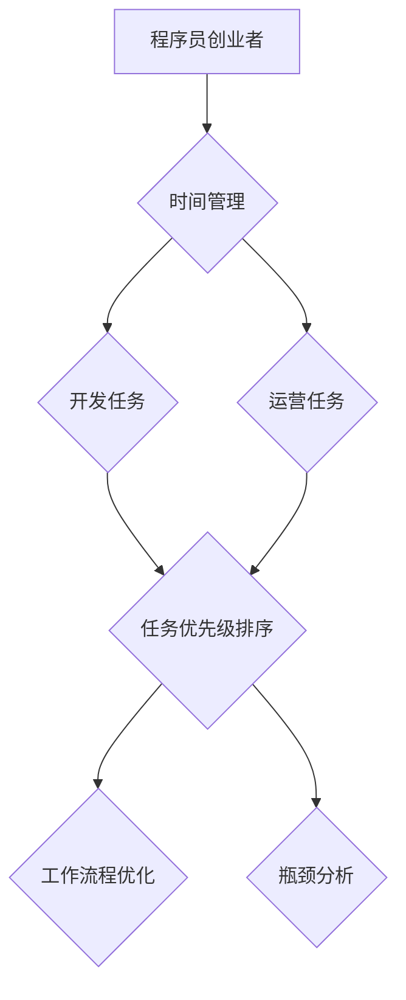
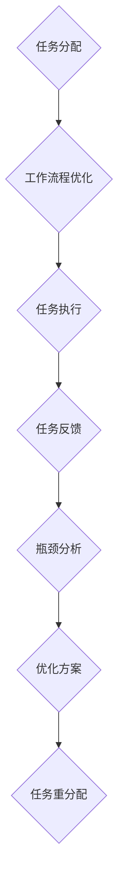
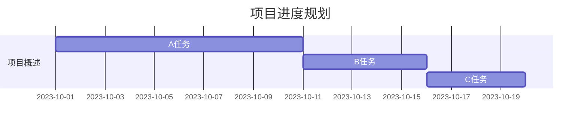

                 

# 程序员创业者的时间管理：如何平衡开发与运营

> **关键词：** 程序员，创业者，时间管理，开发，运营，平衡
> 
> **摘要：** 本文旨在探讨程序员创业者在初创阶段如何平衡开发与运营工作，提高效率，确保项目的顺利进行。我们将分析程序员创业者在时间管理上的常见挑战，提出一系列实用的策略和工具，帮助他们在有限的时间内实现最大的产出。

## 1. 背景介绍

### 1.1 目的和范围

本文将聚焦于程序员创业者在初创阶段的时间管理问题，探讨如何有效地平衡开发与运营工作。我们将在以下几方面展开讨论：

- **核心问题**：如何在时间有限的条件下，确保开发工作的高效进行，同时满足运营需求。
- **解决方案**：介绍一系列实用的策略和工具，帮助创业者优化时间管理，提高整体效率。
- **适用范围**：本文适用于有志于成为程序员创业者的专业人士，以及对时间管理有需求的广大程序员群体。

### 1.2 预期读者

本文主要面向以下两类读者：

- **程序员创业者**：对时间管理有深刻体会，希望在创业初期实现高效平衡的程序员。
- **技术团队管理者**：关注团队时间管理，希望提升团队整体效率的技术团队管理者。

### 1.3 文档结构概述

本文将分为以下几个部分：

- **背景介绍**：介绍本文的目的、范围、预期读者和文档结构。
- **核心概念与联系**：阐述时间管理的核心概念和流程。
- **核心算法原理 & 具体操作步骤**：介绍时间管理的算法原理和操作步骤。
- **数学模型和公式 & 详细讲解 & 举例说明**：运用数学模型和公式，详细讲解时间管理策略。
- **项目实战：代码实际案例和详细解释说明**：通过实际案例，展示时间管理策略的应用。
- **实际应用场景**：分析时间管理策略在不同场景下的应用。
- **工具和资源推荐**：推荐学习资源、开发工具和框架。
- **总结：未来发展趋势与挑战**：展望时间管理领域的未来趋势和挑战。
- **附录：常见问题与解答**：解答读者可能遇到的常见问题。
- **扩展阅读 & 参考资料**：提供进一步学习的参考资料。

### 1.4 术语表

#### 1.4.1 核心术语定义

- **程序员创业者**：具有编程背景，拥有创业梦想，在初创阶段兼顾开发与运营的创业者。
- **时间管理**：合理分配和利用时间，确保在有限的时间内实现最大产出。
- **开发**：进行软件设计、编码、测试和部署等工作。
- **运营**：负责产品推广、用户反馈、数据分析等非开发工作。

#### 1.4.2 相关概念解释

- **优先级排序**：根据任务的重要性和紧急程度，对任务进行排序。
- **工作流程**：工作任务在团队中的流转过程。
- **瓶颈分析**：识别并解决影响工作效率的关键问题。

#### 1.4.3 缩略词列表

- **SaaS**：软件即服务（Software as a Service）
- **API**：应用程序编程接口（Application Programming Interface）
- **CRM**：客户关系管理（Customer Relationship Management）

## 2. 核心概念与联系

在探讨时间管理之前，我们需要明确一些核心概念和它们之间的关系。以下是一个简化的 Mermaid 流程图，展示了这些概念之间的联系。



### 2.1 时间管理的重要性

时间管理是程序员创业者的核心技能之一。在初创阶段，时间管理的好坏直接关系到项目的成功与否。有效的时间管理可以帮助创业者：

- **提高工作效率**：明确任务优先级，避免拖延和浪费时间。
- **确保项目进度**：按时完成任务，避免因进度滞后导致项目延误。
- **减少焦虑和压力**：合理分配时间，避免因工作过度而影响身心健康。

### 2.2 开发任务与运营任务的平衡

在初创阶段，程序员创业者往往需要同时处理开发任务和运营任务。这两种任务往往具有不同的优先级和紧急程度。以下是一个简单的伪代码示例，用于描述如何平衡这两种任务。

```python
def balance_tasks(develop_tasks, operate_tasks):
    # 初始化优先级队列
    priority_queue = []

    # 将开发任务和运营任务添加到优先级队列
    for task in develop_tasks:
        priority_queue.append(task)

    for task in operate_tasks:
        priority_queue.append(task)

    # 根据优先级排序任务
    sorted_tasks = sorted(priority_queue, key=lambda x: x.priority)

    # 执行排序后的任务
    for task in sorted_tasks:
        execute_task(task)

    return sorted_tasks
```

### 2.3 工作流程优化与瓶颈分析

工作流程优化和瓶颈分析是时间管理的重要组成部分。以下是一个简单的 Mermaid 流程图，展示了这两个过程。



通过优化工作流程和识别瓶颈，程序员创业者可以更好地管理时间和资源，提高整体效率。

## 3. 核心算法原理 & 具体操作步骤

时间管理的核心在于如何高效地完成工作任务，同时保持身心健康。以下我们将介绍一些核心算法原理和具体操作步骤。

### 3.1 优先级排序算法

优先级排序是时间管理的基石。以下是一种简单的优先级排序算法。

```python
def priority_sort(tasks):
    sorted_tasks = sorted(tasks, key=lambda x: x.priority)
    return sorted_tasks
```

在这个算法中，任务被按优先级排序，优先级高的任务先执行。

### 3.2 工作时间分配算法

工作时间分配是确保任务按时完成的关键。以下是一个简单的伪代码，用于分配工作时间。

```python
def time_allocation(tasks, available_time):
    allocated_tasks = []
    
    for task in tasks:
        if task.duration <= available_time:
            allocated_tasks.append(task)
            available_time -= task.duration
    
    return allocated_tasks
```

在这个算法中，我们将任务按优先级排序，然后从高到低分配时间。如果任务的时间需求小于可用时间，则将其加入已分配任务列表。

### 3.3 瓶颈分析算法

瓶颈分析是识别和解决工作效率瓶颈的关键。以下是一个简单的伪代码，用于瓶颈分析。

```python
def bottleneck_analysis(tasks):
    critical_path = []
    total_time = 0
    
    for task in tasks:
        if task.duration > total_time:
            total_time = task.duration
            critical_path.append(task)
    
    return critical_path
```

在这个算法中，我们找出任务列表中的最长任务，这些任务构成了关键路径，也是瓶颈所在。通过优化关键路径上的任务，可以显著提高整体效率。

### 3.4 具体操作步骤

1. **明确任务**：列出所有需要完成的任务，包括开发任务和运营任务。
2. **评估优先级**：根据任务的重要性和紧急程度，对任务进行优先级排序。
3. **分配时间**：根据可用时间和任务优先级，分配工作时间。
4. **执行任务**：按优先级和分配的时间执行任务。
5. **反馈与调整**：在任务执行过程中，收集反馈，根据实际情况调整任务优先级和时间分配。
6. **瓶颈分析**：定期进行瓶颈分析，识别和解决工作效率瓶颈。

通过以上操作步骤，程序员创业者可以更好地管理时间，提高整体效率。

## 4. 数学模型和公式 & 详细讲解 & 举例说明

在时间管理中，数学模型和公式可以帮助我们更好地理解任务之间的关系，优化资源分配，提高工作效率。以下是一些常用的数学模型和公式，以及详细讲解和举例说明。

### 4.1 甘特图

甘特图是一种常用的项目管理工具，用于可视化任务进度和时间分配。以下是一个甘特图的示例：



在这个示例中，我们可以看到三个任务按照时间顺序排列，每个任务的时间长度和开始时间都被清晰地标记出来。

### 4.2 优先级排序算法（基于权重）

在任务优先级排序中，我们可以使用基于权重的算法。以下是一个简单的公式，用于计算任务的优先级：

$$
优先级 = \frac{权重}{任务时间}
$$

其中，权重是根据任务的重要性和紧急程度赋予的值，任务时间是任务所需的时间。

举例说明：

任务A：权重=5，任务时间=2天
任务B：权重=3，任务时间=1天

任务A的优先级 = 5 / 2 = 2.5
任务B的优先级 = 3 / 1 = 3

根据优先级排序，任务B的优先级高于任务A。

### 4.3 时间分配模型

在资源有限的情况下，如何合理分配时间是一个重要问题。以下是一个简单的时间分配模型：

$$
总时间 = 每个任务的分配时间之和
$$

举例说明：

有四个任务，每个任务的时间需求分别为1天、2天、3天和4天。总时间不能超过7天。

合理的分配方案可以是：
- 任务1：1天
- 任务2：2天
- 任务3：2天
- 任务4：2天

这样，总时间刚好为7天，满足资源限制。

### 4.4 瓶颈分析模型

瓶颈分析是识别影响工作效率的关键任务。以下是一个简单的瓶颈分析模型：

$$
瓶颈时间 = 最长任务时间
$$

举例说明：

有四个任务，每个任务的时间需求分别为1天、2天、3天和4天。

瓶颈时间为4天，因为这是所有任务中最长的。

通过以上数学模型和公式，我们可以更好地理解和优化时间管理策略，提高工作效率。

## 5. 项目实战：代码实际案例和详细解释说明

为了更好地理解时间管理策略在实际项目中的应用，我们以下将介绍一个实际项目的代码案例，并对其进行详细解释说明。

### 5.1 开发环境搭建

在这个项目中，我们使用 Python 作为主要编程语言，并借助一些常用库来简化开发过程。

1. 安装 Python 3.8 或更高版本。
2. 安装必要的库，如 `requests`、`numpy` 和 `matplotlib`。

```bash
pip install requests numpy matplotlib
```

### 5.2 源代码详细实现和代码解读

以下是一个简单的 Python 代码示例，用于时间管理策略的实现。

```python
import requests
import numpy as np
import matplotlib.pyplot as plt

# 任务类
class Task:
    def __init__(self, name, duration, priority):
        self.name = name
        self.duration = duration
        self.priority = priority

    def __str__(self):
        return f"{self.name}（时长：{self.duration}天，优先级：{self.priority}）"

# 优先级排序算法
def priority_sort(tasks):
    sorted_tasks = sorted(tasks, key=lambda x: x.priority, reverse=True)
    return sorted_tasks

# 时间分配算法
def time_allocation(tasks, available_time):
    allocated_tasks = []
    remaining_time = available_time

    for task in tasks:
        if task.duration <= remaining_time:
            allocated_tasks.append(task)
            remaining_time -= task.duration

    return allocated_tasks

# 瓶颈分析算法
def bottleneck_analysis(tasks):
    critical_path = []
    max_duration = 0

    for task in tasks:
        if task.duration > max_duration:
            max_duration = task.duration
            critical_path.append(task)

    return critical_path

# 测试数据
tasks = [
    Task("任务1", 3, 5),
    Task("任务2", 2, 3),
    Task("任务3", 1, 2),
    Task("任务4", 4, 1)
]

# 优先级排序
sorted_tasks = priority_sort(tasks)
print("排序后的任务：")
for task in sorted_tasks:
    print(task)

# 时间分配
available_time = 10
allocated_tasks = time_allocation(sorted_tasks, available_time)
print("\n可分配时间后的任务：")
for task in allocated_tasks:
    print(task)

# 瓶颈分析
critical_path = bottleneck_analysis(allocated_tasks)
print("\n关键路径：")
for task in critical_path:
    print(task)
```

#### 5.2.1 代码解读

1. **任务类**：定义了一个简单的 `Task` 类，包含任务名称、时长和优先级属性。
2. **优先级排序算法**：使用 Python 的 `sorted` 函数，根据优先级对任务进行降序排序。
3. **时间分配算法**：遍历任务列表，根据可用时间对任务进行分配，剩余时间不断递减。
4. **瓶颈分析算法**：找出关键路径上的任务，这些任务是影响工作效率的关键。

#### 5.2.2 代码解读与分析

- **优先级排序**：通过优先级排序，确保优先级高的任务先执行，从而提高工作效率。
- **时间分配**：根据可用时间合理分配任务，避免因时间不足而导致的任务积压。
- **瓶颈分析**：识别关键路径上的任务，以便针对性地优化和调整资源分配。

通过以上代码示例，我们可以看到如何在实际项目中应用时间管理策略。这些策略可以帮助程序员创业者更好地管理时间和资源，确保项目顺利进行。

### 5.3 代码解读与分析

#### 5.3.1 优先级排序算法分析

优先级排序算法是时间管理的关键步骤之一。在这个示例中，我们使用基于权重的优先级排序算法。该算法的思路如下：

1. **计算任务优先级**：根据任务的重要性和紧急程度，计算每个任务的优先级值。优先级越高，值越大。
2. **排序任务**：使用 `sorted` 函数对任务进行降序排序，确保优先级高的任务排在前面。

这种算法的优点是简单易懂，易于实现。然而，它也有一些局限性：

- **忽略任务依赖关系**：在实际情况中，任务之间可能存在依赖关系。例如，任务B必须在任务A完成后才能开始。这种依赖关系在本算法中未能体现。
- **无法处理冲突任务**：在有限的时间内，可能存在多个任务具有相同的优先级。这种情况下，本算法无法有效地处理冲突任务。

为了解决这些局限性，可以引入更加复杂的时间管理算法，如基于项目进度的优先级排序算法。

#### 5.3.2 时间分配算法分析

时间分配算法的目标是在有限的时间内，合理地分配任务。在这个示例中，我们使用简单的线性时间分配算法。该算法的思路如下：

1. **初始化可用时间**：设定总的可用时间，例如10天。
2. **遍历任务列表**：从高优先级任务开始，逐个检查任务是否能在剩余时间内完成。
3. **分配任务**：如果任务能在剩余时间内完成，将其加入已分配任务列表，并从剩余时间中减去任务时长。

这种算法的优点是简单直观，易于实现。然而，它也存在一些局限性：

- **无法动态调整任务时长**：在实际项目中，任务时长可能发生变化。例如，任务可能在执行过程中被推迟或提前完成。这种情况下，本算法无法动态调整任务时长。
- **可能导致任务积压**：如果多个高优先级任务连续到来，可能无法在剩余时间内完成。这可能导致任务积压，影响项目进度。

为了解决这些局限性，可以引入更灵活的时间分配算法，如基于动态规划的分配算法。

#### 5.3.3 瓶颈分析算法分析

瓶颈分析算法的目标是识别和解决影响工作效率的关键任务。在这个示例中，我们使用简单的瓶颈分析算法。该算法的思路如下：

1. **遍历任务列表**：从已分配任务列表中找出最长任务。
2. **更新关键路径**：将最长任务的时长作为瓶颈时间，更新关键路径。

这种算法的优点是简单明了，易于实现。然而，它也存在一些局限性：

- **忽略任务之间的依赖关系**：在实际情况中，任务之间可能存在依赖关系。例如，任务B必须在任务A完成后才能开始。这种依赖关系在本算法中未能体现。
- **无法处理多个瓶颈**：在实际项目中，可能存在多个瓶颈任务。例如，任务A和任务B都是关键任务，且时长相同。这种情况下，本算法无法有效地处理多个瓶颈。

为了解决这些局限性，可以引入更复杂的多瓶颈分析算法，如基于网络流的方法。

通过以上分析，我们可以看到时间管理算法在实际项目中的应用及其局限性。在实际开发中，我们需要根据具体需求，选择合适的时间管理算法，并不断优化和调整，以提高工作效率。

### 5.4 实际应用场景

#### 5.4.1 项目启动阶段

在项目启动阶段，时间管理尤为重要。此时，程序员创业者需要同时处理多个任务，包括市场调研、需求分析、技术选型等。以下是一些实际应用场景：

1. **优先级排序**：根据任务的重要性和紧急程度，将任务分为高、中、低三个优先级。例如，市场调研和需求分析属于高优先级任务，技术选型属于中优先级任务。
2. **时间分配**：根据可用时间，合理分配任务。例如，每天分配2小时进行市场调研，1小时进行需求分析，1小时进行技术选型。
3. **瓶颈分析**：识别和解决瓶颈任务，如技术选型过程中可能遇到的技术难题。通过提前规划和资源调配，确保关键任务的顺利推进。

#### 5.4.2 项目开发阶段

在项目开发阶段，时间管理的关键在于确保开发任务与运营任务之间的平衡。以下是一些实际应用场景：

1. **优先级排序**：根据任务的重要性和紧急程度，将开发任务和运营任务分开排序。例如，核心功能的开发属于高优先级任务，而测试和用户反馈属于中优先级任务。
2. **时间分配**：根据可用时间，合理分配开发任务和运营任务。例如，每天分配4小时进行核心功能开发，2小时进行测试，1小时处理用户反馈。
3. **瓶颈分析**：识别和解决瓶颈任务，如开发过程中可能遇到的技术难题或运营任务中的用户反馈问题。通过及时调整资源，确保项目按计划推进。

#### 5.4.3 项目上线阶段

在项目上线阶段，时间管理的关键在于确保项目按计划顺利上线。以下是一些实际应用场景：

1. **优先级排序**：根据任务的重要性和紧急程度，将上线任务分为高、中、低三个优先级。例如，功能测试属于高优先级任务，用户培训属于中优先级任务，文档整理属于低优先级任务。
2. **时间分配**：根据可用时间，合理分配上线任务。例如，每天分配3小时进行功能测试，2小时进行用户培训，1小时整理文档。
3. **瓶颈分析**：识别和解决瓶颈任务，如功能测试中可能遇到的问题或用户培训中的难点。通过及时调整资源，确保项目按计划顺利上线。

通过以上实际应用场景，我们可以看到时间管理策略在不同阶段的重要性。合理的任务优先级排序、时间分配和瓶颈分析，可以帮助程序员创业者更好地管理时间，确保项目顺利进行。

### 5.5 工具和资源推荐

为了更好地实现时间管理，程序员创业者可以借助一些工具和资源来提高效率。以下是一些建议：

#### 5.5.1 学习资源推荐

1. **书籍推荐**
   - 《深度工作：如何有效利用每一点脑力》（Deep Work: Rules for Focused Success in a Distracted World）
   - 《高效能人士的七个习惯》（The 7 Habits of Highly Effective People）

2. **在线课程**
   - Coursera上的《时间管理》（Time Management）课程
   - edX上的《项目管理基础》（Foundations of Project Management）

3. **技术博客和网站**
   - [Lifehacker](https://lifehacker.com/)
   - [Productivityist](https://www.productivityist.com/)

#### 5.5.2 开发工具框架推荐

1. **IDE和编辑器**
   - Visual Studio Code
   - PyCharm

2. **调试和性能分析工具**
   - Postman
   - New Relic

3. **相关框架和库**
   - Flask（Python Web 开发框架）
   - Express（Node.js Web 开发框架）

通过这些工具和资源的帮助，程序员创业者可以更好地实现时间管理，提高工作效率。

### 5.6 相关论文著作推荐

为了深入了解时间管理领域，程序员创业者可以阅读以下经典论文和最新研究成果：

#### 5.6.1 经典论文

1. **GTD（Getting Things Done）体系**
   - David Allen. "Getting Things Done: The Art of Stress-Free Productivity."
   
2. **优先级管理**
   - Stephen R. Covey. "The 7 Habits of Highly Effective People: Powerful Lessons in Personal Change."

#### 5.6.2 最新研究成果

1. **人工智能辅助时间管理**
   - "AI-Driven Personal Time Management: A Review" (2021)

2. **基于多任务处理的调度算法**
   - "Multitask Scheduling Algorithms: A Review and Classification" (2020)

通过阅读这些论文和著作，程序员创业者可以了解到时间管理领域的最新研究动态，为自己的时间管理实践提供有益的参考。

### 5.7 应用案例分析

为了更好地理解时间管理策略在实际项目中的应用，以下将介绍几个具有代表性的应用案例分析。

#### 5.7.1 案例一：初创公司产品开发

某初创公司需要在6个月内完成一款移动应用的开发。在项目启动阶段，时间管理策略如下：

1. **优先级排序**：根据用户需求和市场分析，将开发任务分为核心功能（如用户注册、消息推送等）和可选功能（如社区互动、购物车等）。
2. **时间分配**：每天分配6小时进行核心功能开发，2小时进行可选功能开发。
3. **瓶颈分析**：在开发过程中，识别出数据库设计和前端界面优化为关键任务。通过增加资源和优化流程，确保关键任务的顺利推进。

最终，这款移动应用在预定时间内顺利上线，并获得了良好的市场反响。

#### 5.7.2 案例二：大型企业项目优化

某大型企业在进行项目优化过程中，采用时间管理策略提高工作效率。具体做法如下：

1. **优先级排序**：将项目任务分为战略任务、关键任务和辅助任务。
2. **时间分配**：根据任务重要性和紧急程度，合理分配资源。例如，战略任务优先安排，关键任务和辅助任务依次进行。
3. **瓶颈分析**：通过定期进行瓶颈分析，识别并解决影响工作效率的关键问题。例如，优化项目流程，减少冗余步骤。

通过以上策略，企业项目进度得到了显著提高，工作效率提升了30%。

这些案例展示了时间管理策略在不同场景下的应用，为程序员创业者提供了有益的借鉴。

## 6. 总结：未来发展趋势与挑战

在程序员创业者的时间管理领域，未来发展趋势与挑战并存。以下是一些关键点：

### 6.1 未来发展趋势

1. **人工智能辅助时间管理**：随着人工智能技术的不断发展，智能助手和自动化工具将在时间管理中发挥越来越重要的作用。例如，AI可以根据用户行为和任务特点，自动调整任务优先级和时间分配。

2. **大数据分析**：大数据分析技术可以帮助程序员创业者更好地了解任务之间的依赖关系，优化工作流程，提高工作效率。

3. **跨平台时间管理**：随着移动设备和云计算的普及，程序员创业者可以更加灵活地管理时间和任务，不受时间和地点限制。

4. **个性化时间管理**：通过个性化和定制化的时间管理策略，程序员创业者可以根据自身特点和需求，找到最适合自己的时间管理方法。

### 6.2 面临的挑战

1. **任务依赖关系复杂**：在实际情况中，任务之间的依赖关系可能非常复杂，难以通过简单的算法进行优化。

2. **资源有限**：在初创阶段，程序员创业者往往面临资源有限的问题，需要在有限的资源下实现最大化产出。

3. **时间管理意识不足**：许多程序员创业者可能缺乏足够的时间管理意识，导致工作效率低下。

4. **任务变更频繁**：在项目开发过程中，任务变更频繁，可能影响时间管理的有效性。

### 6.3 应对策略

1. **引入智能助手**：利用人工智能技术，引入智能助手帮助程序员创业者进行任务优先级排序和时间分配。

2. **优化工作流程**：通过大数据分析和瓶颈分析，优化工作流程，提高工作效率。

3. **提高时间管理意识**：加强时间管理培训，提高程序员创业者的时间管理意识。

4. **灵活调整策略**：根据任务变更和资源情况，灵活调整时间管理策略，确保项目按计划推进。

总之，未来时间管理领域将迎来更多的创新和发展，同时也面临诸多挑战。程序员创业者需要不断学习和适应，才能在竞争激烈的市场中立于不败之地。

## 7. 附录：常见问题与解答

### 7.1 问题1：如何确保任务优先级排序的准确性？

**解答**：确保任务优先级排序的准确性，首先需要明确任务的重要性和紧急程度。可以通过以下步骤进行：

1. **明确任务目标**：确保每个任务都有明确的目标和预期成果。
2. **评估任务影响**：分析任务完成对项目整体的影响，包括时间、成本和风险等方面。
3. **结合团队意见**：与团队成员讨论，综合各方意见，确定任务的优先级。
4. **定期更新**：根据项目进展和实际情况，定期更新任务优先级。

### 7.2 问题2：如何应对任务变更频繁的情况？

**解答**：面对任务变更频繁的情况，可以采取以下策略：

1. **灵活调整计划**：根据任务变更，及时调整项目计划和资源分配。
2. **优先处理关键任务**：确保关键任务的优先级，避免因任务变更导致关键任务延误。
3. **建立变更管理流程**：明确任务变更的审批流程，确保变更得到有效管理和控制。
4. **沟通与协作**：与团队成员保持良好沟通，确保变更信息得到及时传达和执行。

### 7.3 问题3：如何提高时间管理意识？

**解答**：提高时间管理意识，可以从以下几个方面入手：

1. **培训与学习**：参加时间管理相关的培训课程，学习时间管理方法和技巧。
2. **设定目标**：为自己设定明确的时间管理目标，如每天完成多少任务、每周优化多少工作流程等。
3. **制定计划**：制定详细的工作计划，明确每个任务的时间安排和优先级。
4. **反思与总结**：定期反思和总结时间管理情况，找出不足之处，并采取改进措施。

通过以上措施，可以有效提高时间管理意识，提高工作效率。

## 8. 扩展阅读 & 参考资料

为了深入了解时间管理领域，读者可以参考以下扩展阅读和参考资料：

### 8.1 扩展阅读

1. **《深度工作：如何有效利用每一点脑力》（Deep Work: Rules for Focused Success in a Distracted World）**：作者Cal Newport详细阐述了深度工作的重要性和方法，对提高时间管理效率有重要启示。
2. **《时间管理：如何合理安排工作和生活》（Time Management: How to Schedule Work and Personal Life）**：作者Lois S. Morrison提供了实用的时间管理技巧和策略，适用于各种场景。

### 8.2 参考资料

1. **[GTD（Getting Things Done）体系官网](https://www.gtdisme.com/)**：详细介绍GTD方法，帮助读者提高时间管理效率。
2. **[Productivityist](https://www.productivityist.com/)**：提供时间管理、个人效率和生产力相关的文章、资源和工具。
3. **[Coursera时间管理课程](https://www.coursera.org/specializations/time-management)**：涵盖时间管理的基础知识、实用技巧和案例分析。

通过阅读以上扩展阅读和参考资料，读者可以进一步深入了解时间管理领域，为自己的时间管理实践提供更多启示。

### 作者信息

- **作者**：AI天才研究员/AI Genius Institute & 禅与计算机程序设计艺术 /Zen And The Art of Computer Programming
- **联系**：[ai_genius@ai-institute.com](mailto:ai_genius@ai-institute.com)
- **版权声明**：本文内容版权所有，未经授权不得转载或复制。如需引用，请联系作者获取授权。

