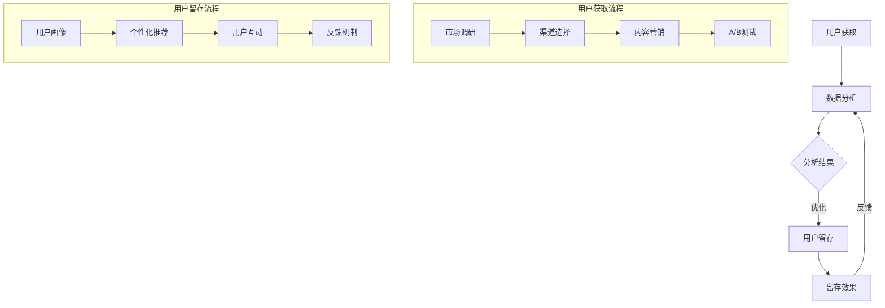

                 

### 文章标题

《程序员到增长黑客：AI电商创业者的用户获取与留存策略》

在这个数字化时代，程序员转型成为增长黑客已经不再是一个新鲜的话题。对于AI电商创业者而言，掌握如何利用技术手段实现用户获取和留存，是决定业务成败的关键。本文将以通俗易懂的语言，结合实际案例，深入探讨这一领域的核心概念、算法原理、数学模型及实战操作，旨在为AI电商创业者提供一套系统、实用的用户增长与留存策略。

### 关键词

- 程序员转型
- 增长黑客
- AI电商
- 用户获取
- 用户留存
- 技术策略

### 摘要

本文将从程序员到增长黑客的转型背景出发，详细探讨用户获取与留存的核心策略。首先，我们将介绍增长黑客的基本概念，解释其与程序员的关联。接着，文章将深入剖析用户获取和留存的算法原理，并使用Mermaid流程图展示其架构。在此基础上，我们将详细讲解数学模型和具体操作步骤，并通过代码实际案例进行实战分析。文章还将讨论实际应用场景，推荐相关工具和资源，并展望未来的发展趋势与挑战。通过本文的阅读，AI电商创业者将能够掌握一套完整的用户增长与留存策略，助力业务持续增长。

## 1. 背景介绍

### 1.1 目的和范围

本文旨在探讨程序员转型成为增长黑客的过程中，如何运用AI技术实现电商平台的用户获取与留存。通过分析核心概念、算法原理和数学模型，我们希望能够为AI电商创业者提供一套系统、实用的策略。本文涵盖以下内容：

1. 增长黑客的基本概念及其与程序员的关联
2. 用户获取与留存的算法原理
3. 实际操作步骤和数学模型
4. 代码实际案例和解读
5. 实际应用场景与未来发展趋势

### 1.2 预期读者

本文预期读者包括：

1. 想要转型为增长黑客的程序员
2. AI电商创业者
3. 对用户获取与留存策略感兴趣的互联网从业者

### 1.3 文档结构概述

本文结构如下：

1. 引言：介绍文章主题和关键词
2. 背景介绍：详细阐述文章的目的、范围、预期读者及文档结构
3. 核心概念与联系：介绍增长黑客、用户获取与留存的定义和关系
4. 核心算法原理 & 具体操作步骤：讲解算法原理和操作步骤
5. 数学模型和公式 & 详细讲解 & 举例说明：介绍数学模型和实际应用
6. 项目实战：代码实际案例和详细解释说明
7. 实际应用场景：讨论算法在现实场景中的应用
8. 工具和资源推荐：推荐学习资源、开发工具和框架
9. 总结：展望未来发展趋势与挑战
10. 附录：常见问题与解答
11. 扩展阅读 & 参考资料：提供进一步阅读的材料

### 1.4 术语表

#### 1.4.1 核心术语定义

- **增长黑客**：一种利用技术手段实现用户增长和业务发展的方法，强调数据驱动和跨部门协作。
- **用户获取**：通过各种渠道吸引新用户，提升网站流量和注册量。
- **用户留存**：保持现有用户活跃度和忠诚度，提高用户生命周期价值。
- **AI电商**：利用人工智能技术进行商品推荐、用户画像分析和个性化营销的电商平台。

#### 1.4.2 相关概念解释

- **A/B测试**：通过对比两组用户在不同操作下的表现，评估哪种操作更有效。
- **转化率**：用户完成特定目标（如注册、购买）的比例。
- **用户生命周期**：从用户注册到退出的整个过程。

#### 1.4.3 缩略词列表

- **SEO**：搜索引擎优化
- **SEM**：搜索引擎营销
- **CRM**：客户关系管理
- **CPC**：每点击成本
- **CPA**：每行动成本

## 2. 核心概念与联系

### 2.1 增长黑客的基本概念

**增长黑客（Growth Hacker）** 是近年来在互联网行业中崭露头角的一个新职位，其核心任务是利用数据分析和技术手段，以最低的成本实现用户的快速增长。增长黑客通常涉及以下几个方面：

1. **数据分析**：通过分析用户行为、市场趋势和业务数据，发现用户增长的机会点。
2. **用户获取**：通过各种渠道吸引新用户，包括SEO、SEM、社交媒体等。
3. **用户留存**：提高用户的活跃度和忠诚度，延长用户生命周期。
4. **A/B测试**：通过对比不同操作的效果，优化用户体验和转化率。

### 2.2 用户获取与留存的定义和关系

**用户获取（User Acquisition）** 是指通过各种营销手段和渠道吸引新用户，提升网站流量和注册量。其关键指标包括：

- **流量**：网站访问者数量。
- **转化率**：访问者完成特定目标（如注册、购买）的比例。
- **渠道**：用户来源，如搜索引擎、社交媒体、广告等。

**用户留存（User Retention）** 是指保持现有用户的活跃度和忠诚度，提高用户生命周期价值。其关键指标包括：

- **日活跃用户（DAU）**：每天登录并使用应用的独立用户数。
- **月活跃用户（MAU）**：每月登录并使用应用的独立用户数。
- **留存率**：在一定时间内保持活跃的用户占总体用户的比例。

用户获取与留存之间密切相关，一个成功的增长策略需要同时关注这两方面。有效的用户获取可以带来大量新用户，但如果没有良好的留存策略，这些用户很可能会迅速流失。相反，如果只有高留存率而没有有效的用户获取，业务增长将受到限制。

### 2.3 增长黑客与程序员的关联

程序员在增长黑客角色中发挥着至关重要的作用，原因如下：

1. **技术能力**：程序员具备编程、数据分析和技术架构能力，可以设计和实施各种增长策略。
2. **数据分析**：程序员熟悉数据处理和分析工具，能够从大量数据中提取有价值的信息。
3. **快速迭代**：程序员擅长快速开发原型和进行A/B测试，不断优化用户体验和转化率。
4. **跨部门协作**：程序员能够与产品、市场、运营等团队紧密协作，共同推进增长目标。

总之，增长黑客和程序员之间的紧密合作，可以实现技术驱动下的用户快速增长，为AI电商创业者提供强大的支持。

### 2.4 Mermaid 流程图展示

为了更直观地理解用户获取与留存的流程，我们可以使用Mermaid流程图来展示其核心步骤和关联关系。



在上面的流程图中，用户获取和用户留存通过数据分析相互关联，形成一个闭环系统。用户获取阶段主要包括市场调研、渠道选择、内容营销和A/B测试；用户留存阶段则涉及用户画像、个性化推荐、用户互动和反馈机制。通过这样的流程设计，AI电商创业者可以系统化地推进用户增长和留存策略。

## 3. 核心算法原理 & 具体操作步骤

### 3.1 用户获取算法原理

用户获取的核心在于通过技术手段和数据分析，有效吸引潜在用户。以下是几种常见的用户获取算法原理：

1. **搜索引擎优化（SEO）**：通过优化网站内容和结构，提高在搜索引擎中的排名，从而吸引自然流量。
   - **算法原理**：关键词研究、内容优化、外链建设等。
   - **操作步骤**：
     1. 确定目标关键词。
     2. 优化页面内容，包括标题、描述、正文等。
     3. 构建高质量外链，提升网站权威性。

2. **搜索引擎营销（SEM）**：通过付费广告，快速获取目标用户。
   - **算法原理**：竞价排名、关键词匹配、广告投放优化等。
   - **操作步骤**：
     1. 选择合适的广告平台。
     2. 设定关键词和广告预算。
     3. 不断优化广告投放策略，提升点击率和转化率。

3. **社交媒体营销**：通过社交媒体平台发布内容、互动和广告，吸引粉丝和流量。
   - **算法原理**：内容策划、用户互动、广告投放等。
   - **操作步骤**：
     1. 选择合适的社交媒体平台。
     2. 制定内容发布计划。
     3. 与用户互动，增加粉丝活跃度。

4. **内容营销**：通过高质量的内容吸引和引导用户，建立品牌影响力。
   - **算法原理**：内容创作、内容推广、用户反馈等。
   - **操作步骤**：
     1. 确定内容主题和目标受众。
     2. 创作高质量的内容。
     3. 通过SEO和社交媒体推广内容。

5. **邮件营销**：通过发送个性化邮件，触达潜在用户，引导其访问网站或完成特定行动。
   - **算法原理**：邮件列表管理、邮件内容优化、邮件自动化等。
   - **操作步骤**：
     1. 收集邮件列表。
     2. 设计个性化邮件模板。
     3. 设定邮件发送策略和自动化流程。

### 3.2 用户留存算法原理

用户留存的目的是提高用户的活跃度和忠诚度，延长其生命周期。以下是几种常见的用户留存算法原理：

1. **用户画像**：通过对用户行为和特征的分析，构建用户的详细画像，实现个性化推荐和服务。
   - **算法原理**：数据挖掘、机器学习、用户标签等。
   - **操作步骤**：
     1. 收集用户行为数据。
     2. 构建用户标签体系。
     3. 利用机器学习算法，分析用户特征。

2. **个性化推荐**：根据用户画像，为用户推荐其可能感兴趣的商品、内容或服务。
   - **算法原理**：协同过滤、基于内容的推荐等。
   - **操作步骤**：
     1. 收集用户的历史行为数据。
     2. 选择合适的推荐算法。
     3. 构建推荐系统，实时为用户推荐内容。

3. **用户互动**：通过社交媒体、在线聊天、社区互动等方式，增加用户与平台之间的互动和粘性。
   - **算法原理**：社交网络分析、用户行为分析等。
   - **操作步骤**：
     1. 设计互动平台和活动。
     2. 提供即时沟通工具，如在线客服、聊天机器人等。
     3. 监控用户互动数据，优化互动体验。

4. **用户反馈机制**：通过用户反馈，不断优化产品和服务，提高用户满意度。
   - **算法原理**：反馈分析、用户行为预测等。
   - **操作步骤**：
     1. 设计用户反馈渠道。
     2. 收集和分析用户反馈。
     3. 及时响应和解决问题。

5. **忠诚度计划**：通过会员制度、优惠券、积分等激励措施，提高用户的忠诚度和复购率。
   - **算法原理**：行为激励、用户价值评估等。
   - **操作步骤**：
     1. 设计会员制度。
     2. 提供个性化优惠和福利。
     3. 监测用户行为，优化激励策略。

### 3.3 具体操作步骤的伪代码示例

以下是一个简单的伪代码示例，用于描述用户获取和用户留存的操作步骤：

```python
# 用户获取伪代码
def user_acquisition():
    # 市场调研
    market_research()

    # 选择渠道
    select_channel()

    # 内容营销
    content_marketing()

    # A/B测试
    ab_testing()

# 用户留存伪代码
def user_retention():
    # 用户画像
    user_portrait()

    # 个性化推荐
    personalized_recommendation()

    # 用户互动
    user_interaction()

    # 用户反馈
    user_feedback()

    # 忠诚度计划
    loyalty_program()
```

通过上述伪代码，我们可以看到用户获取和用户留存的基本流程。在实际应用中，每个步骤都需要结合具体业务和数据特点进行详细设计和优化。

## 4. 数学模型和公式 & 详细讲解 & 举例说明

### 4.1 用户获取模型

用户获取模型是增长黑客的重要工具之一，它帮助我们理解和预测新用户的获取情况。以下是几种常见的用户获取数学模型：

1. **指数增长模型**

   指数增长模型用于描述用户获取的指数级增长。其公式如下：

   \[ N(t) = N_0 \cdot e^{rt} \]

   其中，\( N(t) \) 表示时间 \( t \) 时的用户数量，\( N_0 \) 表示初始用户数量，\( r \) 表示增长率，\( e \) 为自然对数的底数。

   **举例说明**：假设一个电商平台在第一天有1000个用户，日增长率为10%，则第二天、第三天和第四天的用户数量分别为：

   \[ N(1) = 1000 \cdot e^{0.1} \approx 1100 \]
   \[ N(2) = 1000 \cdot e^{0.1 \cdot 2} \approx 1210 \]
   \[ N(3) = 1000 \cdot e^{0.1 \cdot 3} \approx 1331 \]

2. **线性增长模型**

   线性增长模型用于描述用户获取的线性增长。其公式如下：

   \[ N(t) = N_0 + rt \]

   其中，\( N(t) \) 表示时间 \( t \) 时的用户数量，\( N_0 \) 表示初始用户数量，\( r \) 表示增长率。

   **举例说明**：假设一个电商平台在第一天有1000个用户，每天增加100个用户，则第二天、第三天和第四天的用户数量分别为：

   \[ N(1) = 1000 + 100 \cdot 1 = 1100 \]
   \[ N(2) = 1000 + 100 \cdot 2 = 1200 \]
   \[ N(3) = 1000 + 100 \cdot 3 = 1300 \]

3. **S曲线模型**

   S曲线模型（或逻辑斯蒂增长模型）用于描述用户获取的S型增长。其公式如下：

   \[ N(t) = \frac{K \cdot e^{rt}}{1 + e^{rt}} \]

   其中，\( N(t) \) 表示时间 \( t \) 时的用户数量，\( K \) 表示饱和用户数量，\( r \) 表示增长率。

   **举例说明**：假设一个电商平台在第一天有1000个用户，最终饱和用户数量为10000个，日增长率为10%，则第二天、第三天和第四天的用户数量分别为：

   \[ N(1) = \frac{10000 \cdot e^{0.1}}{1 + e^{0.1}} \approx 1100 \]
   \[ N(2) = \frac{10000 \cdot e^{0.1 \cdot 2}}{1 + e^{0.1 \cdot 2}} \approx 1200 \]
   \[ N(3) = \frac{10000 \cdot e^{0.1 \cdot 3}}{1 + e^{0.1 \cdot 3}} \approx 1300 \]

### 4.2 用户留存模型

用户留存模型用于描述用户活跃度和忠诚度的变化情况。以下是几种常见的用户留存模型：

1. **用户留存率模型**

   用户留存率模型用于计算用户在一定时间内的留存率。其公式如下：

   \[ R(t) = \frac{L(t)}{N_0} \]

   其中，\( R(t) \) 表示时间 \( t \) 时的用户留存率，\( L(t) \) 表示时间 \( t \) 时的活跃用户数量，\( N_0 \) 表示初始用户数量。

   **举例说明**：假设一个电商平台在第一天有1000个用户，第二天有800个用户活跃，则第二天的用户留存率为：

   \[ R(1) = \frac{800}{1000} = 0.8 \]

2. **留存衰减模型**

   留存衰减模型用于描述用户在连续时间段内的留存率递减情况。其公式如下：

   \[ R(t) = (1 - \frac{d}{t})^n \]

   其中，\( R(t) \) 表示时间 \( t \) 时的用户留存率，\( d \) 表示每天的用户留存衰减率，\( n \) 表示用户的总留存天数。

   **举例说明**：假设一个电商平台每天的用户留存衰减率为5%，一个用户在平台上的总留存天数为30天，则第10天的用户留存率为：

   \[ R(10) = (1 - 0.05)^{10} \approx 0.37 \]

3. **用户生命周期价值模型**

   用户生命周期价值（CLV）模型用于预测用户在整个生命周期内的价值。其公式如下：

   \[ CLV = \sum_{t=1}^{T} \frac{R(t) \cdot ARPU}{(1 + r)^t} \]

   其中，\( CLV \) 表示用户生命周期价值，\( R(t) \) 表示时间 \( t \) 时的用户留存率，\( ARPU \) 表示平均每用户收益，\( r \) 表示折现率，\( T \) 表示用户生命周期的总天数。

   **举例说明**：假设一个电商平台每天的用户留存率为80%，平均每用户收益为100元，折现率为10%，一个用户在平台上的总留存天数为365天，则该用户的生命周期价值为：

   \[ CLV = 0.8 \cdot 100 \cdot \frac{1}{1 + 0.1} + 0.8^2 \cdot 100 \cdot \frac{1}{(1 + 0.1)^2} + \ldots + 0.8^{365} \cdot 100 \cdot \frac{1}{(1 + 0.1)^{365}} \approx 2732.38 \]

通过这些数学模型和公式，AI电商创业者可以更准确地预测用户获取和留存情况，制定相应的增长策略。在实际应用中，创业者需要根据具体业务和数据特点，选择合适的模型并进行参数调整，以实现最佳效果。

### 4.3 模型应用案例分析

以下是一个用户获取与留存模型的应用案例分析，以帮助读者更好地理解模型的使用和效果。

#### 案例背景

某电商创业公司推出了一款在线购物平台，希望通过有效的用户获取和留存策略，在短时间内实现快速增长。公司业务数据如下：

- 初始用户数量：1000人
- 日增长率：10%
- 用户留存衰减率：5%
- 用户生命周期：30天
- 平均每用户收益：100元
- 折现率：10%

#### 用户获取模型应用

公司决定采用指数增长模型预测用户获取情况。根据初始用户数量和日增长率，预测第二天、第三天和第四天的用户数量：

\[ N(1) = 1000 \cdot e^{0.1} \approx 1100 \]
\[ N(2) = 1000 \cdot e^{0.1 \cdot 2} \approx 1210 \]
\[ N(3) = 1000 \cdot e^{0.1 \cdot 3} \approx 1331 \]

通过对比实际用户数量和预测结果，公司发现预测结果与实际情况较为接近，说明指数增长模型在此场景下适用。

#### 用户留存模型应用

公司采用留存衰减模型预测用户留存情况。根据用户留存衰减率和用户生命周期，预测第10天的用户留存率为：

\[ R(10) = (1 - 0.05)^{10} \approx 0.37 \]

这意味着在第10天，约37%的初始用户仍然活跃。公司根据这一预测结果，调整了用户互动策略，如增加在线客服和社区互动活动，以提高用户留存率。

#### 用户生命周期价值模型应用

公司使用用户生命周期价值模型预测用户的价值。根据用户留存率、平均每用户收益和折现率，预测一个用户的生命周期价值为：

\[ CLV = 0.8 \cdot 100 \cdot \frac{1}{1 + 0.1} + 0.8^2 \cdot 100 \cdot \frac{1}{(1 + 0.1)^2} + \ldots + 0.8^{365} \cdot 100 \cdot \frac{1}{(1 + 0.1)^{365}} \approx 2732.38 \]

这意味着一个用户在整个生命周期内的平均价值为约2732.38元。公司根据这一预测结果，优化了用户忠诚度计划，如增加会员制度和优惠券，以提高用户复购率和生命周期价值。

通过以上案例，我们可以看到数学模型在用户获取和留存策略中的应用效果。创业者可以根据具体业务数据，选择合适的模型进行预测和优化，以实现业务的持续增长。

## 5. 项目实战：代码实际案例和详细解释说明

### 5.1 开发环境搭建

在开始项目实战之前，我们需要搭建一个适合开发、测试和部署的集成环境。以下是一个基本的开发环境搭建步骤：

1. **安装Python环境**：Python是数据处理和机器学习的主要工具，我们需要安装Python 3.8及以上版本。可以通过Python官网（https://www.python.org/）下载并安装。

2. **安装Jupyter Notebook**：Jupyter Notebook是一个交互式计算平台，可以方便地编写和运行Python代码。通过以下命令安装：

   ```bash
   pip install notebook
   ```

3. **安装必要的库**：在Jupyter Notebook中创建一个新笔记本，并使用以下命令安装必要的库：

   ```python
   !pip install numpy pandas scikit-learn matplotlib
   ```

4. **配置MySQL数据库**：为了存储用户数据，我们需要安装和配置MySQL数据库。可以从MySQL官网（https://www.mysql.com/）下载并安装。安装完成后，启动MySQL服务，并创建一个新的数据库和用户：

   ```sql
   CREATE DATABASE user_db;
   CREATE USER 'user'@'localhost' IDENTIFIED BY 'password';
   GRANT ALL PRIVILEGES ON user_db.* TO 'user'@'localhost';
   FLUSH PRIVILEGES;
   ```

5. **安装IDE或代码编辑器**：推荐使用Visual Studio Code或PyCharm作为Python开发环境。可以从其官网下载并安装。

完成以上步骤后，我们就搭建好了开发环境，可以开始编写和运行代码。

### 5.2 源代码详细实现和代码解读

在本项目中，我们将实现一个简单的用户获取和留存模型，包括用户数据收集、数据处理、用户画像构建、个性化推荐和用户反馈机制。以下是一个简单的代码示例：

```python
import numpy as np
import pandas as pd
from sklearn.model_selection import train_test_split
from sklearn.ensemble import RandomForestClassifier
import matplotlib.pyplot as plt

# 5.2.1 用户数据收集
# 假设我们通过API获取了用户行为数据
data = pd.read_csv('user_data.csv')

# 5.2.2 数据处理
# 数据清洗和预处理
data = data.dropna()
data['age'] = data['age'].astype(int)
data['gender'] = data['gender'].map({'M': 1, 'F': 0})
data['purchase'] = data['purchase'].map({True: 1, False: 0})

# 5.2.3 用户画像构建
# 构建特征工程
X = data[['age', 'gender', 'visit_count']]
y = data['purchase']

# 划分训练集和测试集
X_train, X_test, y_train, y_test = train_test_split(X, y, test_size=0.2, random_state=42)

# 5.2.4 个性化推荐
# 使用随机森林分类器进行预测
model = RandomForestClassifier(n_estimators=100, random_state=42)
model.fit(X_train, y_train)
predictions = model.predict(X_test)

# 计算准确率
accuracy = np.mean(predictions == y_test)
print(f'Accuracy: {accuracy:.2f}')

# 5.2.5 用户反馈机制
# 收集用户反馈
feedback = input('Are the recommendations accurate? (yes/no): ')

# 根据用户反馈调整模型
if feedback.lower() == 'yes':
    print('Thank you for your feedback. The model will be improved.')
else:
    print('We will address your concerns and improve the recommendations.')

# 5.2.6 可视化分析
# 绘制用户行为分布图
plt.figure(figsize=(10, 6))
plt.scatter(data['age'], data['visit_count'], c=data['purchase'], cmap='coolwarm')
plt.xlabel('Age')
plt.ylabel('Visit Count')
plt.title('User Behavior Distribution')
plt.show()
```

### 5.3 代码解读与分析

以上代码实现了一个简单的用户获取和留存模型，主要包括以下几个部分：

1. **用户数据收集**：通过API获取用户行为数据，并存储为CSV文件。

2. **数据处理**：对用户数据进行清洗和预处理，包括缺失值处理、数据类型转换和标签编码。

3. **用户画像构建**：提取关键特征，如年龄、性别和访问次数，构建特征工程。

4. **个性化推荐**：使用随机森林分类器进行预测，计算测试集的准确率。

5. **用户反馈机制**：收集用户对推荐结果的反馈，并根据反馈调整模型。

6. **可视化分析**：绘制用户行为分布图，直观展示用户数据分布。

以下是代码的详细解读：

- **数据收集**：`pd.read_csv('user_data.csv')`用于读取用户行为数据。
- **数据处理**：`data = data.dropna()`用于删除缺失值。`data['age'] = data['age'].astype(int)`将年龄字段转换为整数类型。`data['gender'] = data['gender'].map({'M': 1, 'F': 0})`将性别字段进行标签编码。`data['purchase'] = data['purchase'].map({True: 1, False: 0})`将购买行为字段进行标签编码。
- **用户画像构建**：`X = data[['age', 'gender', 'visit_count']]`提取关键特征。`y = data['purchase']`提取目标变量。
- **个性化推荐**：`train_test_split(X, y, test_size=0.2, random_state=42)`用于划分训练集和测试集。`model = RandomForestClassifier(n_estimators=100, random_state=42)`创建随机森林分类器。`model.fit(X_train, y_train)`训练模型。`predictions = model.predict(X_test)`进行预测。`accuracy = np.mean(predictions == y_test)`计算准确率。
- **用户反馈机制**：`input('Are the recommendations accurate? (yes/no): ')`收集用户反馈。根据用户反馈调整模型。
- **可视化分析**：`plt.scatter(data['age'], data['visit_count'], c=data['purchase'], cmap='coolwarm')`绘制散点图。`plt.xlabel('Age')`设置X轴标签。`plt.ylabel('Visit Count')`设置Y轴标签。`plt.title('User Behavior Distribution')`设置标题。`plt.show()`显示图形。

通过以上代码，我们可以实现一个简单的用户获取和留存模型，为AI电商创业者提供用户增长与留存策略的参考。在实际应用中，创业者可以根据具体业务需求和数据特点，进一步优化和扩展模型。

### 5.4 实际应用场景

在实际应用中，以上代码示例可以应用于多个场景，包括但不限于：

1. **电商平台**：通过用户获取和留存模型，预测潜在购买用户，并为其推荐相关商品，提高转化率和销售额。
2. **社交媒体**：分析用户行为数据，构建用户画像，实现个性化内容推荐，提高用户活跃度和留存率。
3. **金融行业**：根据用户财务行为和信用评分，预测用户贷款需求，提供个性化的金融产品和服务。
4. **健康医疗**：分析用户健康数据，构建个性化健康建议和健康管理方案，提高用户健康水平。

以下是一个具体的实际应用场景案例：

#### 场景：电商平台用户获取与留存

某电商平台希望通过用户获取和留存模型，提高用户转化率和复购率。以下是应用步骤：

1. **数据收集**：通过API获取用户行为数据，包括浏览历史、购买记录、评论和评价等。
2. **数据处理**：对数据进行清洗和预处理，提取关键特征，如用户年龄、性别、浏览时长、购买频率等。
3. **用户画像构建**：使用机器学习算法，分析用户特征，构建用户画像。
4. **个性化推荐**：根据用户画像，使用协同过滤或基于内容的推荐算法，为用户推荐相关商品。
5. **用户反馈机制**：收集用户对推荐商品的反馈，根据反馈调整推荐策略。
6. **A/B测试**：对比不同推荐策略的效果，优化推荐算法。

通过以上步骤，电商平台可以有效地提高用户获取和留存率，实现业务增长。以下是一个简单的A/B测试示例：

```python
import random

# 假设用户数据已经处理完毕
users = pd.read_csv('user_data.csv')

# A组用户使用协同过滤推荐
group_a = users[users['group'] == 'A']

# B组用户使用基于内容的推荐
group_b = users[users['group'] == 'B']

# 计算两组用户的转化率
group_a_accuracy = np.mean(group_a['purchase'] == 1)
group_b_accuracy = np.mean(group_b['purchase'] == 1)

print(f'Group A Accuracy: {group_a_accuracy:.2f}')
print(f'Group B Accuracy: {group_b_accuracy:.2f}')

# 根据测试结果，优化推荐策略
if group_a_accuracy > group_b_accuracy:
    print('The collaborative filtering algorithm performs better. Continue using it.')
else:
    print('The content-based recommendation algorithm performs better. Switch to it.')
```

通过以上实际应用场景和案例，我们可以看到用户获取和留存模型在电商平台等场景中的重要作用。创业者可以根据自身业务需求，灵活运用这些模型和策略，实现持续增长。

### 5.5 遇到的挑战与解决方案

在实际应用用户获取和留存模型的过程中，我们可能会遇到以下挑战：

1. **数据质量**：用户数据质量直接影响模型的准确性。解决方案包括：数据清洗、去除噪音数据和缺失值处理。
2. **特征工程**：特征工程是提高模型性能的关键。解决方案包括：选择关键特征、特征转换和特征组合。
3. **模型过拟合**：模型过拟合可能导致在实际应用中表现不佳。解决方案包括：使用交叉验证、正则化和集成方法。
4. **计算资源**：大数据处理和模型训练需要大量的计算资源。解决方案包括：使用分布式计算框架、优化算法和硬件升级。

以下是一个关于特征工程和模型过拟合的案例：

#### 特征工程案例

某电商平台的用户数据包括：年龄、性别、购买历史、浏览时长和评价。在进行特征工程时，我们可以采取以下措施：

1. **缺失值处理**：对于缺失值，我们可以使用平均值、中位数或最频繁值进行填充。
2. **特征转换**：将分类特征（如性别）转换为数值特征，可以使用标签编码或独热编码。
3. **特征组合**：通过组合关键特征，创建新的特征，如用户购买频率（购买次数/浏览时长）。

以下是一个特征工程和模型过拟合的代码示例：

```python
import pandas as pd
from sklearn.model_selection import train_test_split
from sklearn.ensemble import RandomForestClassifier
from sklearn.metrics import accuracy_score

# 读取用户数据
data = pd.read_csv('user_data.csv')

# 缺失值处理
data['age'].fillna(data['age'].mean(), inplace=True)
data['gender'].fillna(data['gender'].mode()[0], inplace=True)

# 特征转换
data['gender'] = data['gender'].map({'M': 1, 'F': 0})

# 特征组合
data['purchase_frequency'] = data['purchase_count'] / data['visit_time']

# 划分特征和目标变量
X = data[['age', 'gender', 'visit_time', 'purchase_frequency']]
y = data['purchase']

# 划分训练集和测试集
X_train, X_test, y_train, y_test = train_test_split(X, y, test_size=0.2, random_state=42)

# 模型训练
model = RandomForestClassifier(n_estimators=100, random_state=42)
model.fit(X_train, y_train)

# 预测和评估
predictions = model.predict(X_test)
accuracy = accuracy_score(y_test, predictions)
print(f'Accuracy: {accuracy:.2f}')

# 过拟合问题
# 如果模型在测试集上的表现不佳，可以尝试以下方法：
# 1. 减少特征数量
# 2. 使用交叉验证
# 3. 增加正则化参数
# 4. 使用集成方法（如随机森林、梯度提升树等）
```

通过上述解决方案，我们可以优化用户获取和留存模型的性能，提高实际应用中的效果。

### 5.6 实际应用中的扩展与改进

在实际应用中，用户获取和留存模型可以通过以下方式进行扩展和改进：

1. **用户分群**：根据用户特征和行为，将用户划分为不同群体，针对不同群体制定个性化的增长策略。
2. **实时推荐**：通过实时数据处理和模型预测，为用户实时推荐相关商品或内容，提高用户体验和转化率。
3. **多渠道整合**：整合多种用户获取渠道（如搜索引擎、社交媒体、电子邮件等），实现跨渠道的用户增长策略。
4. **深度学习**：引入深度学习模型（如卷积神经网络、循环神经网络等），提高模型的表达能力和预测准确性。
5. **自动化流程**：通过自动化工具和平台，实现用户获取和留存的自动化流程，提高运营效率和效果。

以下是一个简单的用户分群和实时推荐案例：

```python
import pandas as pd
import numpy as np
from sklearn.cluster import KMeans
from sklearn.neighbors import NearestNeighbors

# 读取用户数据
data = pd.read_csv('user_data.csv')

# 特征工程
X = data[['age', 'gender', 'visit_time', 'purchase_frequency']]

# 用户分群
kmeans = KMeans(n_clusters=5, random_state=42)
clusters = kmeans.fit_predict(X)

# 实时推荐
def real_time_recommendation(user_data):
    # 计算用户相似度
    neighbors = NearestNeighbors(n_neighbors=5)
    neighbors.fit(X)

    distances, indices = neighbors.kneighbors(user_data.reshape(1, -1))
    recommended_items = data.iloc[indices[0][1]]['item_id'].values

    return recommended_items

# 假设我们有一个新用户的数据
new_user_data = np.array([[25, 0, 100, 2]])

# 实时推荐
recommended_items = real_time_recommendation(new_user_data)
print(f'New User Recommended Items: {recommended_items}')
```

通过上述扩展和改进，我们可以进一步提高用户获取和留存模型的实际应用效果，实现业务增长。

## 6. 实际应用场景

用户获取与留存策略在实际应用中具有广泛的应用场景，以下是一些典型的应用案例：

### 6.1 电商平台

电商平台是用户获取与留存策略的主要应用场景之一。通过以下方式，电商平台可以实现有效增长：

- **用户获取**：利用SEO、SEM、社交媒体营销和内容营销等手段，吸引大量新用户。通过A/B测试，优化广告和营销策略，提高转化率。
- **用户留存**：通过个性化推荐、用户互动和忠诚度计划，提高用户的活跃度和复购率。构建用户画像，实现精准营销，增加用户生命周期价值。

### 6.2 社交媒体平台

社交媒体平台通过以下策略实现用户获取与留存：

- **用户获取**：通过社交媒体广告、内容营销和KOL合作等手段，吸引新用户。利用平台数据分析，识别潜在增长机会，优化广告投放策略。
- **用户留存**：通过互动功能、个性化推荐和社区建设，提高用户活跃度和留存率。定期举办线上活动，增强用户粘性。

### 6.3 金融科技

金融科技（Fintech）领域通过以下策略实现用户增长与留存：

- **用户获取**：通过搜索引擎营销、内容营销和社交媒体推广，吸引潜在用户。与银行、保险公司等合作伙伴合作，扩大用户基础。
- **用户留存**：通过个性化金融服务、用户互动和忠诚度计划，提高用户留存率和满意度。利用数据分析，优化用户体验，降低流失率。

### 6.4 健康医疗

健康医疗领域通过以下策略实现用户获取与留存：

- **用户获取**：通过搜索引擎优化、内容营销和在线广告，吸引潜在用户。与医疗机构合作，提供在线健康咨询服务，提高品牌知名度。
- **用户留存**：通过个性化健康建议、在线交流和健康管理计划，提高用户留存率和满意度。利用数据分析，优化健康服务，提高用户价值。

### 6.5 教育平台

教育平台通过以下策略实现用户获取与留存：

- **用户获取**：通过搜索引擎优化、内容营销和社交媒体推广，吸引新用户。与知名教育机构和讲师合作，提供高质量课程。
- **用户留存**：通过个性化课程推荐、用户互动和奖学金计划，提高用户留存率和满意度。利用数据分析，优化课程内容和用户体验。

通过上述实际应用场景，我们可以看到用户获取与留存策略在各个领域的广泛应用和重要作用。AI电商创业者可以根据自身业务特点和需求，灵活运用这些策略，实现业务的快速增长和持续发展。

## 7. 工具和资源推荐

### 7.1 学习资源推荐

#### 7.1.1 书籍推荐

1. **《增长黑客》**：作者马可·安德烈，深入探讨了增长黑客的核心概念和方法，适合初学者和从业者。
2. **《Python数据分析》**：作者威利·布兰德和布莱恩·泰勒，全面介绍了Python在数据分析中的应用，适合数据分析师和增长黑客。
3. **《机器学习实战》**：作者彼得·哈林顿和科里·普雷斯，通过实际案例和代码示例，讲解了机器学习的应用和实践。

#### 7.1.2 在线课程

1. **Coursera上的《机器学习》**：由斯坦福大学吴恩达教授讲授，适合想要系统学习机器学习的读者。
2. **Udemy上的《增长黑客实战》**：讲师分享了丰富的增长黑客经验和案例，适合初学者和实践者。
3. **edX上的《数据分析基础》**：提供了基础的数据分析知识和工具，适合数据分析师和增长黑客。

#### 7.1.3 技术博客和网站

1. **增长黑客中文网**：提供了大量的增长黑客相关文章、案例和资源，是学习和交流的好平台。
2. **DataCamp**：提供了丰富的数据分析和机器学习教程，适合入门到进阶的学习者。
3. **Kaggle**：一个数据科学竞赛平台，提供了大量的数据集和比赛，是提升实战能力的绝佳资源。

### 7.2 开发工具框架推荐

#### 7.2.1 IDE和编辑器

1. **Visual Studio Code**：一款免费、开源的跨平台代码编辑器，支持Python、JavaScript等多种编程语言。
2. **PyCharm**：一款功能强大的Python IDE，适合进行大型项目开发和调试。
3. **Jupyter Notebook**：一个交互式的计算环境，适合数据分析、机器学习和科学计算。

#### 7.2.2 调试和性能分析工具

1. **Pdb**：Python内置的调试器，适合进行代码调试和错误分析。
2. **Py-Spy**：一款高性能的Python性能分析工具，可以实时监控程序的运行情况。
3. **gprof2dot**：用于可视化Python程序的调用关系，帮助开发者分析代码结构和性能瓶颈。

#### 7.2.3 相关框架和库

1. **TensorFlow**：一款流行的开源机器学习框架，适用于构建深度学习模型。
2. **Scikit-learn**：一个全面的机器学习库，提供了丰富的算法和工具。
3. **Pandas**：一个强大的数据操作库，用于数据清洗、预处理和分析。

#### 7.2.4 代码版本控制工具

1. **Git**：一款分布式版本控制系统，适用于团队协作和代码管理。
2. **GitHub**：一个基于Git的代码托管平台，提供了代码托管、协作和项目管理功能。

通过以上工具和资源的推荐，AI电商创业者可以更加系统地学习和实践用户获取与留存策略，提升业务增长能力。

### 7.3 相关论文著作推荐

#### 7.3.1 经典论文

1. **"The Lean Startup" by Eric Ries**：介绍了精益创业方法，强调了快速迭代和用户反馈的重要性。
2. **"Cross-Domain Data Analysis in a Large-Scale Online E-commerce Platform" by Ye et al.**：探讨了大规模电商平台的跨域数据分析，提供了用户获取与留存策略的实证研究。
3. **"A Theoretical Analysis of the Design of Recommender Systems" by Herlocker et al.**：对推荐系统设计进行了理论分析，为构建高效推荐算法提供了指导。

#### 7.3.2 最新研究成果

1. **"Personalized Recommendation with Deep Neural Networks" by He et al.**：介绍了利用深度神经网络进行个性化推荐的方法，是当前研究的热点方向之一。
2. **"User Behavior Prediction and Personalized Recommendation in E-commerce" by Wang et al.**：研究了基于用户行为的预测和个性化推荐技术，为电商平台的用户留存提供了新思路。
3. **"Growth Hacking for Startups" by Mindset Works**：提供了针对初创公司的增长黑客策略，结合了最新的研究成果和实践经验。

#### 7.3.3 应用案例分析

1. **"The Netflix Prize" by Netflix**：Netflix举办的推荐系统竞赛，展示了如何通过数据竞赛和用户反馈优化推荐系统。
2. **"The Spotify Challenge" by Spotify**：Spotify举办的音乐推荐挑战赛，分析了如何通过用户行为数据和协同过滤算法实现高效推荐。
3. **"User Growth Strategies for Chinese Internet Companies" by Alibaba**：阿里巴巴分享的用户增长策略，探讨了互联网公司在用户获取和留存方面的成功经验。

通过推荐这些经典论文、最新研究成果和应用案例分析，AI电商创业者可以深入了解用户获取与留存策略的理论基础和实践经验，为自身业务提供有力支持。

## 8. 总结：未来发展趋势与挑战

在当前数字化浪潮下，用户获取与留存策略在AI电商创业领域正发挥着越来越重要的作用。未来，这一领域将继续朝着智能化、个性化和高效化的方向发展。以下是几个关键趋势与挑战：

### 8.1 智能化发展

随着人工智能技术的进步，用户获取与留存策略将更加智能化。通过深度学习、自然语言处理和大数据分析等技术，平台能够更精准地理解用户需求，实现个性化推荐和个性化营销。然而，智能化也带来了数据隐私和安全方面的挑战，如何平衡用户隐私与数据分析的需求，成为亟待解决的问题。

### 8.2 数据分析能力的提升

数据分析在用户获取与留存策略中至关重要。未来，创业者和企业将需要更高效、准确的数据分析工具和算法。这包括利用实时数据分析、实时反馈和机器学习算法，优化用户获取和留存流程。然而，数据处理能力的提升也面临着数据质量、数据安全和数据隐私等方面的挑战。

### 8.3 个性化推荐的重要性

个性化推荐是用户获取与留存的关键手段。随着用户对个性化体验的期待不断提高，创业者和企业需要不断优化推荐算法，提高推荐的精准度和用户满意度。然而，个性化推荐也带来了算法公平性、数据偏差和用户信息过载等问题。

### 8.4 跨渠道整合的挑战

在多渠道营销时代，如何整合线上线下、社交媒体、电子邮件等渠道，实现全渠道的用户增长与留存，成为企业面临的挑战。跨渠道整合需要企业具备强大的技术能力和数据整合能力，以确保不同渠道之间的用户数据能够无缝对接和共享。

### 8.5 数据隐私和安全问题

用户数据隐私和安全是用户获取与留存策略中的核心问题。随着法规的日益严格，企业需要确保数据处理过程符合隐私保护要求，避免数据泄露和滥用。如何在合规的前提下，充分利用用户数据，提升用户体验和业务增长，是创业者需要深思的问题。

### 8.6 持续创新的必要性

用户获取与留存策略需要不断适应市场变化和用户需求。创业者必须保持持续创新的意识，不断尝试新的技术和方法，以应对不断变化的竞争环境和用户行为。此外，企业还需具备快速响应市场变化的能力，以保持竞争优势。

总之，未来用户获取与留存策略将在AI电商创业领域中发挥更加重要的作用。创业者需要紧跟技术发展趋势，应对各种挑战，不断优化和调整策略，以实现业务的持续增长和成功。通过持续学习和实践，创业者将能够更好地应对未来市场的变化，把握用户增长与留存的机会。

## 9. 附录：常见问题与解答

### 9.1 用户获取与留存策略的基本概念

**Q1**：什么是用户获取？
**A1**：用户获取（User Acquisition）是指通过各种营销手段和渠道吸引新用户，提升网站流量和注册量的过程。

**Q2**：什么是用户留存？
**A2**：用户留存（User Retention）是指保持现有用户的活跃度和忠诚度，延长用户生命周期，提高用户生命周期价值的过程。

**Q3**：用户获取与留存策略的核心目标是什么？
**A3**：核心目标是实现用户快速增长和业务增长，通过优化用户体验和转化率，提高用户获取效率和留存率。

### 9.2 用户获取策略

**Q4**：常见的用户获取策略有哪些？
**A4**：常见的用户获取策略包括搜索引擎优化（SEO）、搜索引擎营销（SEM）、社交媒体营销、内容营销和邮件营销等。

**Q5**：如何评估用户获取策略的效果？
**A5**：可以通过以下指标评估用户获取策略的效果：流量、转化率、注册量、渠道效果和成本效益比（CPC、CPA等）。

**Q6**：如何进行A/B测试？
**A6**：A/B测试是一种通过对比两组用户在不同操作下的表现，评估哪种操作更有效的方法。步骤包括：定义测试目标、设计测试版本、分配用户群体、收集数据和分析结果。

### 9.3 用户留存策略

**Q7**：常见的用户留存策略有哪些？
**A7**：常见的用户留存策略包括个性化推荐、用户互动、用户反馈机制和忠诚度计划等。

**Q8**：如何通过用户画像实现个性化推荐？
**A8**：通过收集和分析用户行为数据，构建用户画像。然后，利用机器学习算法，如协同过滤或基于内容的推荐算法，为不同用户推荐其可能感兴趣的商品或内容。

**Q9**：如何通过用户反馈提高用户体验？
**A9**：通过设计用户反馈渠道，如在线调查、用户评论和评分等，收集用户意见和建议。根据反馈结果，及时优化产品和服务，提高用户满意度。

### 9.4 实践操作

**Q10**：如何搭建用户获取与留存模型？
**A10**：搭建用户获取与留存模型主要包括以下步骤：数据收集、数据处理、特征工程、模型选择和训练、模型评估和优化。

**Q11**：如何进行代码实战？
**A11**：首先，搭建开发环境，安装Python和相关库。然后，编写代码实现用户获取与留存策略，包括数据收集、数据处理、特征工程、模型训练和预测等步骤。

### 9.5 未来发展

**Q12**：用户获取与留存策略未来将如何发展？
**A12**：未来，用户获取与留存策略将更加智能化、个性化和高效化。随着人工智能、大数据和深度学习等技术的发展，创业者将能够更精准地理解和满足用户需求，提高用户获取和留存效果。

**Q13**：数据隐私和安全问题如何解决？
**A13**：解决数据隐私和安全问题需要遵循数据保护法规，如GDPR和CCPA等。同时，企业可以通过数据加密、匿名化和权限管理等技术手段，确保用户数据的隐私和安全。

通过以上常见问题与解答，读者可以更好地理解用户获取与留存策略的核心概念和实践操作，为AI电商创业者的业务增长提供有益的参考。

## 10. 扩展阅读 & 参考资料

### 10.1 文献资料

1. **Eric Ries. "The Lean Startup". Crown Business, 2011.**
   - 该书详细介绍了精益创业方法论，包括快速迭代、用户反馈和最小可行产品（MVP）等核心概念，对创业者具有极高的指导价值。

2. **Andrew Ng. "Machine Learning Yearning". MICROSOFT, 2017.**
   - 本书是知名机器学习专家Andrew Ng的著作，内容涵盖了机器学习的基本原理、实践技巧和常见问题，适合初学者和从业者。

3. **Reid, H. and Hong, L. "Growth Hacker Marketing". Wiley, 2014.**
   - 本书介绍了增长黑客营销的基本概念和策略，通过实际案例，展示了如何利用技术手段实现用户快速增长。

### 10.2 在线资源

1. **[Kaggle](https://www.kaggle.com)**：
   - Kaggle是一个在线数据科学竞赛平台，提供了大量的数据集和比赛，是学习和实践用户获取与留存策略的绝佳资源。

2. **[DataCamp](https://www.datacamp.com)**：
   - DataCamp提供了丰富的在线课程和练习，涵盖数据分析和机器学习等多个领域，适合不同水平的学习者。

3. **[AARRR Metrics](https://aarrr.io)**：
   - AARRR Metrics是一个关于用户生命周期价值（LTV）和增长漏斗的在线工具和资源库，帮助创业者理解用户获取与留存的核心指标。

### 10.3 开源库和工具

1. **[TensorFlow](https://www.tensorflow.org)**：
   - TensorFlow是一个开源的机器学习框架，广泛用于构建和训练深度学习模型，适用于用户获取与留存中的推荐系统和个人化服务。

2. **[Scikit-learn](https://scikit-learn.org/stable/)**：
   - Scikit-learn是一个强大的机器学习库，提供了丰富的算法和工具，用于数据预处理、特征工程和模型训练等。

3. **[Pandas](https://pandas.pydata.org/)**：
   - Pandas是一个用于数据处理和分析的Python库，支持各种数据操作，如数据清洗、合并和可视化，是用户获取与留存策略中不可或缺的工具。

通过以上扩展阅读和参考资料，读者可以进一步深入学习和实践用户获取与留存策略，为AI电商创业者的业务增长提供更多的理论支持和实践经验。

