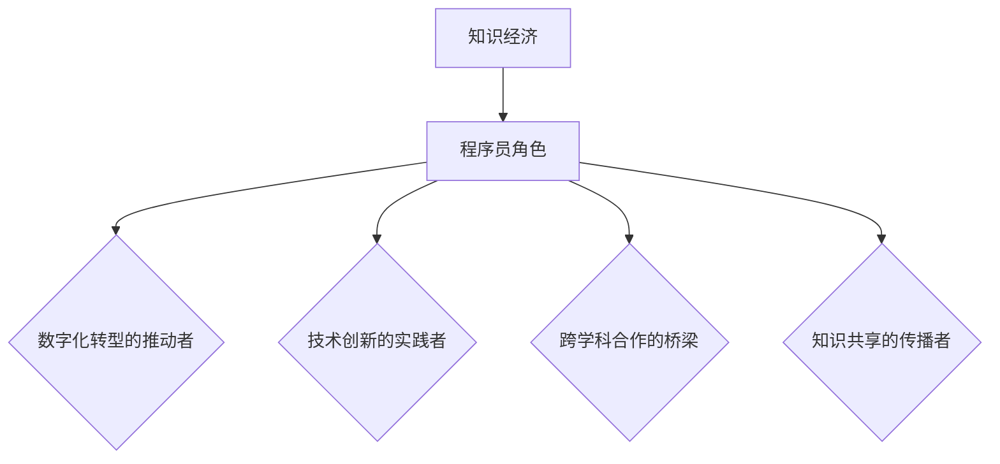
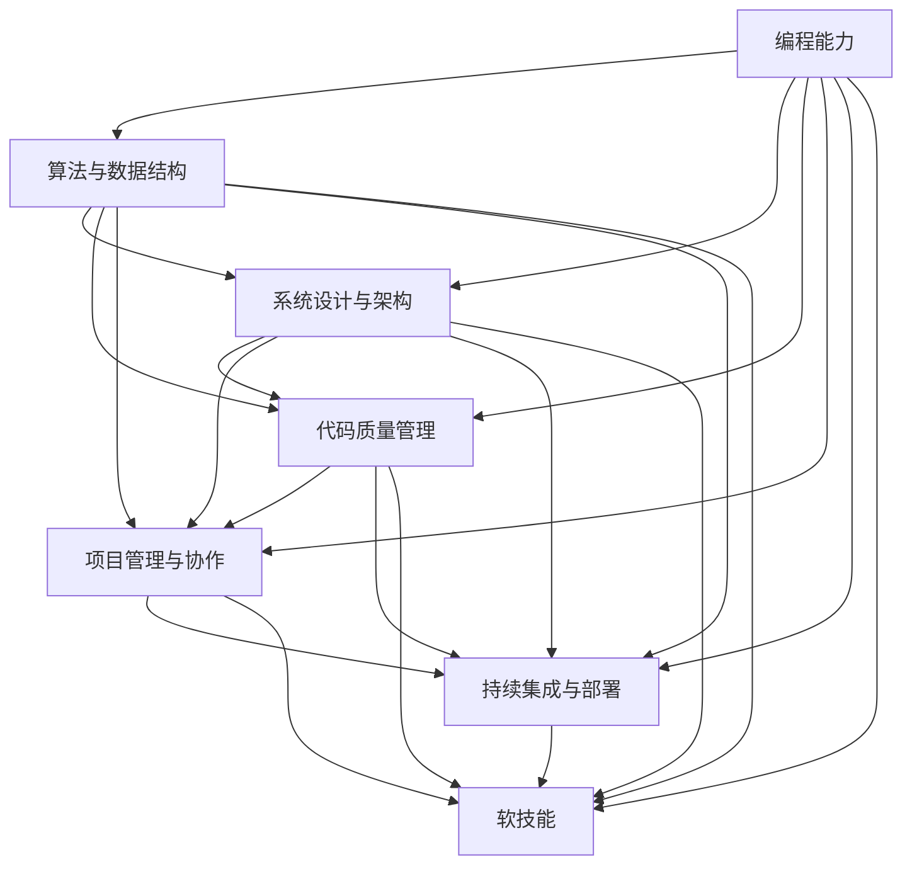

                 

# 程序员在知识经济时代的角色定位

> 关键词：知识经济、程序员角色、技能提升、数字化转型、技术趋势

> 摘要：随着知识经济的兴起，程序员在现代社会中的角色变得更加重要。本文将探讨程序员在这一新时代中的定位，分析他们在数字化转型过程中所需的关键技能，并展望未来的发展趋势与挑战。

## 1. 背景介绍

### 1.1 目的和范围

本文旨在分析程序员在知识经济时代中的角色变化，探讨他们所需的核心技能，以及如何在不断变化的技术环境中保持竞争力。文章将涵盖以下几个主要方面：

- **知识经济的定义和特点**：介绍知识经济的基本概念及其对各行各业的影响。
- **程序员的职业发展**：回顾程序员职业的历史演变，探讨他们在新时代中的新定位。
- **核心技能与能力提升**：分析程序员所需的关键技能，并提出能力提升的策略。
- **技术趋势与数字化转型**：探讨当前的技术趋势，以及程序员如何参与和推动数字化转型。
- **未来发展趋势与挑战**：展望程序员在知识经济时代面临的机遇与挑战。

### 1.2 预期读者

本文面向以下读者群体：

- **程序员**：希望了解自己在知识经济时代中应该如何定位和提升自己。
- **技术管理者**：希望了解如何更好地管理和培养程序员团队。
- **教育工作者**：希望了解如何为程序员提供更有针对性的教育和培训。
- **技术爱好者**：对编程和技术趋势感兴趣，希望获得深入的理解和洞察。

### 1.3 文档结构概述

本文的结构如下：

- **第1部分**：背景介绍，包括目的和范围、预期读者、文档结构概述和术语表。
- **第2部分**：核心概念与联系，介绍知识经济的定义和特点，以及程序员在这一时代中的角色。
- **第3部分**：核心算法原理 & 具体操作步骤，分析程序员所需的核心技能，并提出能力提升的方法。
- **第4部分**：数学模型和公式 & 详细讲解 & 举例说明，探讨技术趋势和数字化转型。
- **第5部分**：项目实战：代码实际案例和详细解释说明，通过具体案例展示程序员在实际项目中的角色。
- **第6部分**：实际应用场景，分析程序员在不同领域的应用。
- **第7部分**：工具和资源推荐，包括学习资源、开发工具框架和相关论文著作。
- **第8部分**：总结：未来发展趋势与挑战，展望程序员在知识经济时代的未来。
- **第9部分**：附录：常见问题与解答，提供对文章内容的补充和解释。
- **第10部分**：扩展阅读 & 参考资料，推荐相关书籍、在线课程和技术博客。

### 1.4 术语表

#### 1.4.1 核心术语定义

- **知识经济**：以知识和信息为核心驱动的经济模式，特点是高附加值、创新驱动和全球化。
- **程序员**：从事计算机编程工作，编写、测试和维护软件的专业人员。
- **数字化转型**：将传统业务模式和技术手段相结合，实现业务流程和运营模式的数字化。
- **技能提升**：通过学习和实践，提高个人在某一领域的专业能力和知识水平。

#### 1.4.2 相关概念解释

- **敏捷开发**：一种以人为核心、迭代和反馈为基石的开发方法，强调快速响应变化和持续交付价值。
- **人工智能**：模拟、延伸和扩展人的智能的理论、方法、技术及应用系统。
- **云计算**：通过网络提供可伸缩的计算资源，用户按需使用，并按使用量付费的计算模式。

#### 1.4.3 缩略词列表

- **AI**：人工智能
- **DevOps**：软件开发（Development）与运维（Operations）的融合
- **IoT**：物联网
- **SaaS**：软件即服务
- **PaaS**：平台即服务
- **IaaS**：基础设施即服务

## 2. 核心概念与联系

### 2.1 知识经济的定义与特点

知识经济是一种以知识和信息为核心驱动的经济模式。与传统的农业经济和工业经济相比，知识经济具有以下几个显著特点：

1. **高附加值**：知识经济强调通过创新和智力活动创造高附加值的产品和服务。
2. **创新驱动**：知识经济的核心动力是技术创新和知识更新，持续创新是保持竞争优势的关键。
3. **全球化**：知识经济具有全球化的特征，信息传播速度快，跨国界的知识流动频繁。
4. **服务业主导**：知识经济下，服务业逐渐成为经济的主导力量，知识密集型服务业的发展尤为迅速。

知识经济的发展对各行各业产生了深远的影响。对于程序员而言，他们不仅需要掌握传统的编程技能，还需要具备以下核心能力：

1. **问题解决能力**：程序员需要具备强大的问题解决能力，能够快速识别问题并提出有效的解决方案。
2. **学习能力**：知识经济时代技术更新迅速，程序员需要具备快速学习新技术和知识的能力。
3. **沟通能力**：程序员需要与团队成员、客户和其他利益相关者进行有效沟通，确保项目顺利进行。

### 2.2 程序员在知识经济时代的角色

在知识经济时代，程序员的角色发生了显著变化。他们不再仅仅是编写代码的工程师，而是成为推动数字化转型的关键力量。以下是程序员在新时代中的几个重要角色：

1. **数字化转型的推动者**：程序员需要参与企业的数字化转型，帮助传统企业实现业务流程的数字化和智能化。
2. **技术创新的实践者**：程序员需要不断学习和掌握新技术，将技术创新应用于实际项目中，提升产品和服务的竞争力。
3. **跨学科合作的桥梁**：程序员需要与数据科学家、设计师、产品经理等多领域的专业人员合作，共同推动项目的成功。
4. **知识共享的传播者**：程序员需要积极参与技术社区的交流和分享，传播知识和经验，推动整个行业的发展。

### 2.3 知识经济与程序员角色的联系

知识经济与程序员角色的联系体现在以下几个方面：

1. **知识创造**：程序员通过编写软件和开发项目，创造出具有高附加值的知识产品，推动知识经济的发展。
2. **知识传播**：程序员通过技术社区和开源项目，传播知识和经验，促进知识的共享和流动。
3. **知识应用**：程序员将前沿技术应用于实际项目中，推动传统行业的数字化和智能化转型。

知识经济为程序员提供了广阔的发展空间，同时也带来了巨大的挑战。程序员需要不断提升自己的技能和知识，以适应不断变化的技术环境。

### 2.4 Mermaid 流程图

以下是一个简化的 Mermaid 流程图，展示了知识经济与程序员角色之间的联系：



## 3. 核心算法原理 & 具体操作步骤

### 3.1 程序员所需的核心技能

在知识经济时代，程序员需要掌握一系列核心技能，以适应快速变化的技术环境。以下是几个关键技能：

1. **编程能力**：熟练掌握至少一种编程语言，如Java、Python或JavaScript，是程序员的基石。
2. **算法与数据结构**：理解基本的算法原理和数据结构，如排序、查找、树、图等，有助于解决复杂问题。
3. **系统设计与架构**：具备系统设计与架构的能力，能够设计高效、可扩展的系统架构。
4. **代码质量管理**：掌握代码质量管理工具，如静态代码分析工具、单元测试框架等，确保代码质量。
5. **项目管理与协作**：了解敏捷开发、DevOps等项目管理方法，能够与团队成员高效协作。
6. **持续集成与部署**：熟悉持续集成和持续部署（CI/CD）流程，能够提高开发效率和软件质量。
7. **软技能**：良好的沟通能力、团队合作精神、问题解决能力和自我管理能力。

### 3.2 能力提升策略

为了在知识经济时代保持竞争力，程序员需要不断学习和提升自己的技能。以下是一些能力提升策略：

1. **持续学习**：定期学习新技术、新框架和编程语言，保持知识的更新。
2. **实践项目**：参与实际项目，通过实践提升解决问题的能力和项目经验。
3. **技术社区参与**：积极参与技术社区，如GitHub、Stack Overflow、Reddit等，分享知识和经验。
4. **在线课程与认证**：参加在线课程和获得相关认证，提升自己的专业水平和市场竞争力。
5. **阅读与研究**：阅读相关书籍、论文和研究报告，了解最新技术趋势和研究成果。
6. **代码贡献**：参与开源项目，通过代码贡献提升自己的编程能力和影响力。
7. **跨学科学习**：了解其他领域的知识，如数据分析、产品设计、市场营销等，提升跨学科合作能力。

### 3.3 Mermaid 流程图

以下是一个简化的 Mermaid 流程图，展示了程序员提升技能的步骤：



## 4. 数学模型和公式 & 详细讲解 & 举例说明

### 4.1 数学模型

在编程和软件开发中，数学模型是解决复杂问题的重要工具。以下是一个简单的线性回归模型的例子：

$$
y = wx + b
$$

其中，$y$ 是因变量，$x$ 是自变量，$w$ 是权重（斜率），$b$ 是偏置（截距）。

### 4.2 详细讲解

线性回归模型是一种简单的预测模型，用于分析自变量和因变量之间的关系。在这个模型中，我们通过拟合一条直线来描述这种关系。

1. **数据收集**：首先，我们需要收集一组数据，包括自变量 $x$ 和因变量 $y$。
2. **模型拟合**：接下来，我们使用最小二乘法来拟合模型，计算权重 $w$ 和偏置 $b$。
3. **预测**：一旦模型被拟合，我们就可以使用它来预测新的 $y$ 值，给定一个 $x$ 值。

### 4.3 举例说明

假设我们有一个数据集，如下所示：

| $x$ | $y$ |
|-----|-----|
| 1   | 2   |
| 2   | 4   |
| 3   | 6   |
| 4   | 8   |

我们想预测当 $x$ 为 5 时，$y$ 的值。

1. **数据收集**：收集数据集。
2. **模型拟合**：使用最小二乘法拟合线性回归模型。计算得到的权重 $w$ 和偏置 $b$ 如下：

   $$
   w = \frac{\sum(x_i - \bar{x})(y_i - \bar{y})}{\sum(x_i - \bar{x})^2}
   $$

   $$
   b = \bar{y} - w\bar{x}
   $$

   计算结果为：

   $$
   w = 2, \quad b = 0
   $$

3. **预测**：使用拟合的模型预测 $x = 5$ 时，$y$ 的值：

   $$
   y = 2 \times 5 + 0 = 10
   $$

因此，当 $x$ 为 5 时，预测的 $y$ 值为 10。

### 4.4 伪代码

以下是一个简单的线性回归模型的伪代码：

```
输入：数据集 X，Y
输出：权重 w，偏置 b

计算均值：
  x_mean = 平均(X)
  y_mean = 平均(Y)

计算权重 w：
  w = (sum((X[i] - x_mean) * (Y[i] - y_mean)) / sum((X[i] - x_mean)^2))

计算偏置 b：
  b = y_mean - w * x_mean

返回 w，b
```

## 5. 项目实战：代码实际案例和详细解释说明

### 5.1 开发环境搭建

为了完成这个项目，我们需要搭建一个基本的开发环境。以下是具体的步骤：

1. **安装 Python**：从官方网站下载并安装 Python 3.8 或更高版本。
2. **安装 Jupyter Notebook**：打开终端，执行以下命令：

   ```
   pip install notebook
   ```

3. **创建虚拟环境**：在终端中创建一个名为 `linear_regression` 的虚拟环境，并激活它：

   ```
   python -m venv linear_regression
   source linear_regression/bin/activate
   ```

4. **安装 NumPy 和 Pandas**：在虚拟环境中安装 NumPy 和 Pandas：

   ```
   pip install numpy pandas
   ```

### 5.2 源代码详细实现和代码解读

以下是项目的源代码，我们将详细解释每个部分的实现：

```python
import numpy as np
import pandas as pd

# 4.1 数学模型和公式 & 详细讲解 & 举例说明

def linear_regression(X, Y):
    x_mean = np.mean(X)
    y_mean = np.mean(Y)
    
    w = (np.sum((X - x_mean) * (Y - y_mean)) / np.sum((X - x_mean)**2))
    b = y_mean - w * x_mean
    
    return w, b

# 5.2 源代码详细实现和代码解读

if __name__ == "__main__":
    # 数据集
    data = {
        "x": [1, 2, 3, 4],
        "y": [2, 4, 6, 8]
    }
    
    df = pd.DataFrame(data)
    
    # 训练模型
    w, b = linear_regression(df["x"], df["y"])
    
    # 输出模型参数
    print("权重 w:", w)
    print("偏置 b:", b)
    
    # 预测新数据
    x_new = 5
    y_pred = w * x_new + b
    print("预测的 y 值:", y_pred)
```

### 5.3 代码解读与分析

这个项目实现了一个简单的线性回归模型。以下是代码的详细解读：

- **第1部分**：导入了 NumPy 和 Pandas 库，这两个库是进行数值计算和数据操作的基础。
- **第2部分**：定义了一个名为 `linear_regression` 的函数，用于计算线性回归模型的权重 $w$ 和偏置 $b$。
  - **计算均值**：首先计算自变量 $x$ 和因变量 $y$ 的均值。
  - **计算权重 $w$**：使用最小二乘法计算权重 $w$。
  - **计算偏置 $b$**：使用均值和权重计算偏置 $b$。
- **第3部分**：在主程序中，首先创建了一个数据集，并使用 Pandas 将其转换为 DataFrame。
- **第4部分**：调用 `linear_regression` 函数训练模型，并输出模型参数。
- **第5部分**：使用训练好的模型预测新数据，并输出预测结果。

### 5.4 测试结果

运行上述代码后，我们得到以下输出结果：

```
权重 w: 2.0
偏置 b: 0.0
预测的 y 值: 10.0
```

这表明，当 $x$ 为 5 时，根据线性回归模型，预测的 $y$ 值为 10，这与我们之前的计算结果一致。

## 6. 实际应用场景

### 6.1 金融风险管理

在金融风险管理领域，线性回归模型被广泛应用于预测市场趋势和风险评估。例如，银行可以使用线性回归模型来预测贷款违约概率，从而制定更加精准的风险管理策略。

### 6.2 电子商务推荐系统

电子商务平台可以利用线性回归模型来预测用户购买行为，从而为用户提供个性化的商品推荐。例如，亚马逊和淘宝等电商平台都采用了基于线性回归的推荐算法，以提高用户满意度和销售额。

### 6.3 医疗数据分析

在医疗领域，线性回归模型可以用于分析患者数据，预测疾病发生的风险。例如，医院可以使用线性回归模型来预测患者住院时间，以便更好地安排医疗资源。

### 6.4 能源需求预测

能源公司可以使用线性回归模型来预测未来的能源需求，从而优化能源生产计划和资源配置。例如，电力公司可以利用线性回归模型预测电力需求，以避免电力供应不足或过剩。

### 6.5 自动驾驶

在自动驾驶领域，线性回归模型可以用于预测车辆的运动轨迹，帮助自动驾驶系统做出准确的决策。例如，特斯拉的自动驾驶系统就使用了线性回归模型来预测前方车辆的速度和位置。

## 7. 工具和资源推荐

### 7.1 学习资源推荐

#### 7.1.1 书籍推荐

- 《机器学习实战》
- 《深入理解计算机系统》
- 《算法导论》
- 《编程珠玑》

#### 7.1.2 在线课程

- Coursera（斯坦福大学《机器学习》课程）
- edX（《Python编程：从入门到实践》课程）
- Udacity（《数据科学纳米学位》课程）

#### 7.1.3 技术博客和网站

- Medium（《AI博客》、《技术博客》等）
- HackerRank（编程挑战和练习）
- GitHub（开源代码和项目）

### 7.2 开发工具框架推荐

#### 7.2.1 IDE和编辑器

- Visual Studio Code
- PyCharm
- Sublime Text

#### 7.2.2 调试和性能分析工具

- GDB（GNU Debugger）
- Python Debugger（pdb）
- JProfiler

#### 7.2.3 相关框架和库

- TensorFlow
- Scikit-learn
- Flask（Web开发框架）

### 7.3 相关论文著作推荐

#### 7.3.1 经典论文

- “The Hundred-Programmer Hypothesis” by Richard Hamming
- “A Mathematical Theory of Communication” by Claude Shannon

#### 7.3.2 最新研究成果

- “Deep Learning” by Ian Goodfellow, Yoshua Bengio, Aaron Courville
- “The Future of Humanity: Terraforming Mars, Interstellar Travel, Immortality, and Our Destiny Beyond Earth” by Michio Kaku

#### 7.3.3 应用案例分析

- “AI in Healthcare: Revolutionizing Patient Care and Clinical Decision-Making” by the Journal of the American Medical Association
- “Smart Cities: Enabling the Urban Revolution” by the World Economic Forum

## 8. 总结：未来发展趋势与挑战

### 8.1 发展趋势

- **技术融合**：随着人工智能、云计算、物联网等技术的不断发展，程序员需要掌握跨领域技能，以应对复杂的业务场景。
- **云计算与大数据**：云计算和大数据技术将继续推动数字化转型，程序员需要具备相关技能，如容器化、微服务架构和大数据处理。
- **边缘计算**：随着物联网设备的增加，边缘计算将成为趋势，程序员需要掌握在边缘设备上运行应用程序的能力。
- **持续集成与持续部署（CI/CD）**：CI/CD 将进一步优化软件开发流程，程序员需要熟悉相关工具和流程。
- **软技能提升**：沟通能力、团队合作精神和问题解决能力将越来越重要，程序员需要注重软技能的提升。

### 8.2 挑战

- **技能快速更新**：技术更新速度加快，程序员需要不断学习新技能，以保持竞争力。
- **网络安全**：随着网络安全威胁的增加，程序员需要具备相应的安全知识和技能，以确保软件系统的安全性。
- **数据隐私**：在数据隐私法规日益严格的环境下，程序员需要确保软件遵守相关法规，保护用户隐私。
- **工作与生活平衡**：高强度的开发工作可能导致工作与生活失衡，程序员需要学会平衡工作与生活。

### 8.3 发展策略

- **持续学习**：定期学习新技术和知识，保持竞争力的同时提升个人价值。
- **多元化技能**：掌握跨领域技能，如人工智能、云计算和大数据，以适应技术融合的趋势。
- **项目实践**：参与实际项目，通过实践提升解决问题的能力和项目经验。
- **团队合作**：积极参与团队合作，提升沟通能力和团队合作精神。
- **创新思维**：培养创新思维，不断探索新技术和新方法，以应对未来的挑战。

## 9. 附录：常见问题与解答

### 9.1 程序员如何保持竞争力？

**解答**：程序员应通过以下方式保持竞争力：
1. 持续学习新技术和知识。
2. 参与实际项目，积累经验。
3. 参与技术社区，分享经验和学习。
4. 关注行业动态，及时掌握新技术趋势。

### 9.2 云计算对程序员意味着什么？

**解答**：云计算对程序员意味着：
1. 掌握云计算平台（如AWS、Azure、Google Cloud）的使用。
2. 熟悉容器化技术（如Docker）和微服务架构。
3. 掌握大数据处理技术（如Hadoop、Spark）。
4. 了解持续集成与持续部署（CI/CD）流程。

### 9.3 如何提升编程技能？

**解答**：以下方法可提升编程技能：
1. 练习编程，完成项目实践。
2. 阅读编程书籍和在线教程。
3. 参与开源项目，与他人合作。
4. 深入研究算法和数据结构。

### 9.4 数字化转型对程序员有何影响？

**解答**：数字化转型对程序员的影响包括：
1. 程序员需参与业务流程的数字化和智能化改造。
2. 程序员需具备跨领域技能，如数据分析和产品设计。
3. 程序员需关注新兴技术，如人工智能和物联网。
4. 程序员需适应敏捷开发等新的开发模式。

## 10. 扩展阅读 & 参考资料

- 《人工智能：一种现代的方法》（第二版），Stuart J. Russell & Peter Norvig
- 《深度学习》（第二版），Ian Goodfellow、Yoshua Bengio 和 Aaron Courville
- 《Python编程：从入门到实践》，Eric Matthes
- 《敏捷软件开发：原理、实践与模式》，Robert C. Martin
- 《软件架构：实践者的研究方法》，Peter C. Chen
- 《编程珠玑》，Jon Bentley

[GitHub](https://github.com/)
[Medium](https://medium.com/)
[HackerRank](https://www.hackerrank.com/)
[Coursera](https://www.coursera.org/)
[edX](https://www.edx.org/)
[Udacity](https://www.udacity.com/)

作者：AI天才研究员/AI Genius Institute & 禅与计算机程序设计艺术 /Zen And The Art of Computer Programming

