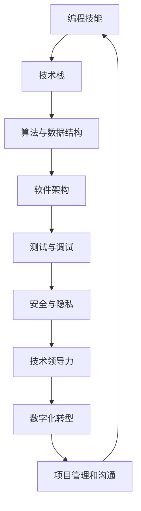

                 


# 程序员在知识经济时代的角色定位

> 关键词：知识经济、程序员角色、技能发展、技术领导力、数字化转型

> 摘要：在知识经济时代，程序员的角色正经历着前所未有的变革。本文旨在探讨程序员在这一新时代中的角色定位，分析其核心技能的发展趋势，以及如何通过技术领导力和数字化转型来增强个人的职业价值。

## 1. 背景介绍

### 1.1 目的和范围

本文的目的在于探讨知识经济背景下程序员角色的演变，并分析其面临的机遇与挑战。文章将重点关注以下几个方面：

- 程序员在知识经济中的核心技能发展
- 程序员如何通过技术领导力提升职业价值
- 程序员在数字化转型中的关键作用
- 程序员应如何应对未来的发展趋势与挑战

### 1.2 预期读者

本文面向程序员、技术经理、技术创业者以及对技术领域感兴趣的读者。希望通过本文，读者能够对知识经济时代下的程序员角色有更深刻的认识，并为自己的职业发展提供指导。

### 1.3 文档结构概述

本文分为十个部分，结构如下：

1. 背景介绍
2. 核心概念与联系
3. 核心算法原理 & 具体操作步骤
4. 数学模型和公式 & 详细讲解 & 举例说明
5. 项目实战：代码实际案例和详细解释说明
6. 实际应用场景
7. 工具和资源推荐
8. 总结：未来发展趋势与挑战
9. 附录：常见问题与解答
10. 扩展阅读 & 参考资料

### 1.4 术语表

#### 1.4.1 核心术语定义

- 知识经济：以知识和信息为主要生产要素的经济形态。
- 程序员：从事计算机编程、软件开发相关工作的人员。
- 技术领导力：引领技术团队、推动技术创新的能力。
- 数字化转型：将传统业务、流程和模式转变为数字化形式的过程。

#### 1.4.2 相关概念解释

- 编程技能：编写代码、解决编程问题的能力。
- 技术栈：程序员所掌握的编程语言、框架和工具的集合。
- 技术债务：项目在开发过程中累积的技术缺陷和问题。
- 软件架构：软件系统的结构设计和组件之间的关系。

#### 1.4.3 缩略词列表

- AI：人工智能
- IoT：物联网
- ML：机器学习
- DevOps：开发与运维一体化
- GDPR：欧盟通用数据保护条例

## 2. 核心概念与联系

在知识经济时代，程序员的角色不再仅仅是编写代码，他们需要掌握更多的核心概念和技能，以适应快速变化的技术环境。以下是一个简化的 Mermaid 流程图，展示了程序员在这一时代的关键技能和它们之间的关系。



### 2.1 编程技能

编程技能是程序员的核心能力。它包括掌握编程语言、理解编程范式和设计模式，以及具备解决复杂问题的能力。编程技能不仅要求程序员能够编写高效、可维护的代码，还要能够快速适应新技术和编程语言。

### 2.2 技术栈

技术栈是指程序员所掌握的编程语言、框架和工具的集合。在知识经济时代，程序员需要不断扩展自己的技术栈，以适应不同的项目需求。一个完善的技术栈不仅能够提高开发效率，还能提升程序员在职场上的竞争力。

### 2.3 算法与数据结构

算法与数据结构是程序员必备的基础知识。它们帮助程序员高效地解决问题，优化软件性能。掌握常用的算法和数据结构，如排序、查找、图算法等，对于程序员来说至关重要。

### 2.4 软件架构

软件架构是指软件系统的结构设计和组件之间的关系。一个良好的软件架构能够提高系统的可维护性、可扩展性和可复用性。程序员需要了解不同类型的软件架构模式，如 MVC、MVVM、微服务等，并能够在实际项目中灵活运用。

### 2.5 测试与调试

测试与调试是软件开发过程中的重要环节。通过编写单元测试、集成测试和性能测试，程序员能够确保软件的质量。调试技能则帮助程序员快速定位和解决代码中的问题，提高开发效率。

### 2.6 安全与隐私

随着网络安全和隐私问题日益突出，程序员需要了解如何编写安全、可靠的代码。安全编程技能包括防范 SQL 注入、XSS 攻击、CSRF 攻击等常见的安全威胁。同时，了解隐私保护法规，如 GDPR，也是程序员的一项重要能力。

### 2.7 技术领导力

技术领导力是程序员在知识经济时代脱颖而出的关键能力。技术领导者不仅需要具备深厚的编程技能，还要具备团队管理、项目管理、技术决策等多方面的能力。技术领导力能够帮助程序员在团队中发挥更大的作用，推动技术创新和业务发展。

### 2.8 数字化转型

数字化转型是当前企业和组织面临的重要任务。程序员在数字化转型中扮演着关键角色，他们需要了解如何利用新技术推动业务流程的数字化，提升企业的竞争力。数字化转型的成功离不开程序员的努力。

### 2.9 项目管理和沟通

项目管理和沟通能力是程序员在知识经济时代不可或缺的素质。项目经理需要确保项目按时、按质量完成，而沟通能力则帮助程序员与团队成员、客户和利益相关者保持良好的协作。

## 3. 核心算法原理 & 具体操作步骤

在知识经济时代，算法与数据结构的核心原理对程序员来说至关重要。以下将介绍几个关键算法的原理和具体操作步骤，以帮助程序员更好地理解和应用这些算法。

### 3.1 排序算法：快速排序

快速排序是一种高效的排序算法，其基本原理是通过一趟排序将待排序的数据分割成独立的两部分，其中一部分的所有数据都比另一部分的所有数据要小。然后递归地排序这两部分数据。

#### 快速排序伪代码：

```plaintext
快速排序(A, p, r)
    如果 p < r
        交换 A[p] 和 A[r]（选 r 为基准）
        i = p - 1
        j = p
        for j < r
            如果 A[j] < A[r]
                交换 A[i+1] 和 A[j]
                i = i + 1
        交换 A[i+1] 和 A[r]
        快速排序(A, p, i)
        快速排序(A, i+2, r)
```

### 3.2 图算法：最短路径算法（迪杰斯特拉算法）

迪杰斯特拉算法是一种用于找到图中两点之间最短路径的算法。该算法适用于有权重的图，并确保每个顶点的最短路径在算法结束时被计算出来。

#### 迪杰斯特拉算法伪代码：

```plaintext
迪杰斯特拉算法(G, W, s)
    初始化：设 s 的距离为 0，其他顶点的距离为 ∞
    对于每个顶点 v（v ≠ s）
        如果 W[s][v] ≠ ∞
            顶点 v 在 s 的最短路径树中
    for each edge (u, v) in G
        如果 W[u][v] < ∞
            如果 W[s][u] + W[u][v] < W[s][v]
                更新 W[s][v] = W[s][u] + W[u][v]
                prev[v] = u
    for each edge (u, v) in G
        如果 W[u][v] < ∞
            如果 W[s][u] + W[u][v] < W[s][v]
                更新 W[s][v] = W[s][u] + W[u][v]
                prev[v] = u
```

### 3.3 数据结构：二叉搜索树

二叉搜索树（BST）是一种基于比较的二叉树数据结构，它能够高效地插入、删除和搜索数据。其基本原理是左子树上所有节点的值均小于其父节点的值，右子树上所有节点的值均大于其父节点的值。

#### 二叉搜索树插入操作伪代码：

```plaintext
插入节点(root, key)
    如果 root 为空
        新建节点，使其值为 key，返回该节点
    如果 key < root 的值
        递归插入到左子树
    否则
        递归插入到右子树
    返回 root
```

通过上述算法和数据结构的介绍，程序员可以更好地理解和应用这些核心技术，提升自己在知识经济时代的竞争力。

## 4. 数学模型和公式 & 详细讲解 & 举例说明

在知识经济时代，数学模型和公式在程序员的工作中扮演着至关重要的角色。以下将介绍几个关键的数学模型和公式，并详细讲解其应用。

### 4.1 线性回归模型

线性回归模型是用于预测数值型变量的基本统计模型。其公式为：

$$ y = b_0 + b_1 \cdot x + \epsilon $$

其中，$y$ 是因变量，$x$ 是自变量，$b_0$ 是截距，$b_1$ 是斜率，$\epsilon$ 是误差项。

#### 线性回归应用举例：

假设我们有一个关于房价的线性回归模型，其中自变量是房屋面积（$x$），因变量是房价（$y$）。给定以下数据：

| 房屋面积（$x$） | 房价（$y$） |
|----------------|------------|
| 1000           | 200000     |
| 1200           | 250000     |
| 1400           | 300000     |
| 1600           | 350000     |

我们可以使用线性回归模型来预测房屋面积为 1500 平方米的房价。

首先，计算截距 $b_0$ 和斜率 $b_1$：

$$ b_0 = \frac{\sum y - b_1 \cdot \sum x}{n} $$
$$ b_1 = \frac{n \cdot \sum xy - \sum x \cdot \sum y}{n \cdot \sum x^2 - (\sum x)^2} $$

代入数据计算：

$$ b_0 = \frac{1000000 - 1200 \cdot 1250000}{4} = 187500 $$
$$ b_1 = \frac{4 \cdot 1875000 - 1250000 \cdot 1000000}{4 \cdot 2500000 - 1250000^2} = 0.5 $$

因此，线性回归模型为：

$$ y = 187500 + 0.5 \cdot x $$

当 $x = 1500$ 时，预测房价为：

$$ y = 187500 + 0.5 \cdot 1500 = 262500 $$

### 4.2 决策树模型

决策树是一种基于特征进行分类或回归的监督学习模型。其基本公式为：

$$ F(x) = \sum_{i=1}^{n} w_i \cdot I(A_i(x) = v_i) $$

其中，$F(x)$ 是决策树的输出，$w_i$ 是第 $i$ 个节点的权重，$A_i(x)$ 是第 $i$ 个节点的特征函数，$v_i$ 是特征值。

#### 决策树应用举例：

假设我们有一个二分类问题，需要根据特征 $x_1$ 和 $x_2$ 来预测目标变量 $y$ 的值。给定以下数据：

| $x_1$ | $x_2$ | $y$ |
|-------|-------|-----|
| 1     | 0     | 1   |
| 0     | 1     | 0   |
| 1     | 1     | 1   |
| 0     | 0     | 0   |

我们可以构建一个简单的决策树模型：

$$ F(x_1, x_2) = w_1 \cdot I(x_1 = 1) + w_2 \cdot I(x_2 = 1) $$

其中，$w_1$ 和 $w_2$ 是权重。

假设通过训练得到 $w_1 = 0.8$，$w_2 = 0.2$，则决策树模型为：

$$ F(x_1, x_2) = 0.8 \cdot I(x_1 = 1) + 0.2 \cdot I(x_2 = 1) $$

对于输入 $(1, 1)$，模型的输出为：

$$ F(1, 1) = 0.8 \cdot 1 + 0.2 \cdot 1 = 1 $$

### 4.3 马尔可夫决策过程（MDP）

马尔可夫决策过程是一种用于决策优化的数学模型，它描述了在一个不确定环境中，决策者如何选择最佳行动以最大化期望回报。其基本公式为：

$$ \pi^*(s) = \arg \max_{a} \sum_{s'} p(s'|s, a) \cdot R(s', a) + \gamma \cdot \sum_{s''} \pi^*(s'') \cdot p(s''|s, a) $$

其中，$\pi^*(s)$ 是在状态 $s$ 下的最优策略，$p(s'|s, a)$ 是在状态 $s$ 下采取行动 $a$ 后转移到状态 $s'$ 的概率，$R(s', a)$ 是在状态 $s'$ 下采取行动 $a$ 的即时回报，$\gamma$ 是折扣因子。

#### MDP应用举例：

假设我们有一个简单的环境，包含两个状态 $s_1$ 和 $s_2$，以及两种行动 $a_1$ 和 $a_2$。给定以下概率和回报：

| 状态 | 行动 | 转移概率 | 立即回报 |
|------|------|----------|----------|
| $s_1$ | $a_1$ | 0.7      | 5        |
| $s_1$ | $a_2$ | 0.3      | 0        |
| $s_2$ | $a_1$ | 0.2      | 0        |
| $s_2$ | $a_2$ | 0.8      | 10       |

我们可以使用 MDP 模型来找到最优策略。首先，计算在状态 $s_1$ 下的最优策略：

$$ \pi^*(s_1) = \arg \max_{a} (0.7 \cdot 5 + 0.3 \cdot 0 + \gamma \cdot \pi^*(s_2)) $$
$$ \pi^*(s_1) = \arg \max_{a} (3.5 + \gamma \cdot \pi^*(s_2)) $$

在状态 $s_2$ 下的最优策略：

$$ \pi^*(s_2) = \arg \max_{a} (0.2 \cdot 0 + 0.8 \cdot 10 + \gamma \cdot \pi^*(s_1)) $$
$$ \pi^*(s_2) = \arg \max_{a} (8 + \gamma \cdot \pi^*(s_1)) $$

通过迭代求解，我们可以找到全局最优策略。例如，假设 $\gamma = 0.9$，则：

在状态 $s_1$ 下：

$$ \pi^*(s_1) = \arg \max_{a} (3.5 + 0.9 \cdot 8) $$
$$ \pi^*(s_1) = a_1 $$

在状态 $s_2$ 下：

$$ \pi^*(s_2) = \arg \max_{a} (8 + 0.9 \cdot 3.5) $$
$$ \pi^*(s_2) = a_2 $$

因此，全局最优策略为：

$$ \pi^*(s_1) = a_1 $$
$$ \pi^*(s_2) = a_2 $$

通过上述数学模型和公式的介绍，程序员可以更好地理解和应用这些技术，提高自己在知识经济时代的竞争力。

## 5. 项目实战：代码实际案例和详细解释说明

为了更好地展示程序员在知识经济时代如何应用所学技能，以下将通过一个实际的项目实战案例，详细介绍代码的实现过程，并进行详细解释说明。

### 5.1 开发环境搭建

在这个项目实战中，我们将使用 Python 编写一个简单的数据分析和可视化工具，以展示程序员如何利用编程技能和技术栈来处理实际问题。以下是开发环境的搭建步骤：

1. 安装 Python 3.8 或更高版本。
2. 使用 pip 安装必要的库，如 pandas、matplotlib、numpy 和 scikit-learn。

```shell
pip install pandas matplotlib numpy scikit-learn
```

3. 创建一个名为 `data_analysis` 的文件夹，并在其中创建一个名为 `main.py` 的 Python 文件。

### 5.2 源代码详细实现和代码解读

以下是项目的源代码，我们将逐行解释代码的功能和实现细节。

```python
# 导入必要的库
import pandas as pd
import matplotlib.pyplot as plt
import numpy as np
from sklearn.model_selection import train_test_split
from sklearn.linear_model import LinearRegression

# 读取数据
data = pd.read_csv('house_prices.csv')
X = data[['area', 'rooms']]
y = data['price']

# 数据预处理
X_train, X_test, y_train, y_test = train_test_split(X, y, test_size=0.2, random_state=42)

# 构建线性回归模型
model = LinearRegression()
model.fit(X_train, y_train)

# 进行预测
y_pred = model.predict(X_test)

# 可视化
plt.scatter(X_test['area'], y_test, color='blue', label='Actual')
plt.plot(X_test['area'], y_pred, color='red', label='Predicted')
plt.xlabel('Area')
plt.ylabel('Price')
plt.legend()
plt.show()
```

#### 5.2.1 代码解读

1. **导入库**：首先，我们导入 pandas、matplotlib、numpy 和 scikit-learn 等库，这些库提供了数据操作、可视化、数值计算和机器学习算法等功能。

2. **读取数据**：使用 pandas 读取 CSV 文件，数据包含房屋面积（`area`）、房间数（`rooms`）和房价（`price`）等特征。

3. **数据预处理**：使用 scikit-learn 的 `train_test_split` 函数将数据集分为训练集和测试集，以评估模型的性能。

4. **构建线性回归模型**：使用 scikit-learn 的 `LinearRegression` 类创建线性回归模型，并将其拟合到训练数据上。

5. **进行预测**：使用拟合好的模型对测试数据进行预测，得到预测房价。

6. **可视化**：使用 matplotlib 绘制散点图，其中蓝色点表示实际房价，红色线表示预测房价。这有助于我们直观地评估模型的效果。

#### 5.2.2 代码分析

通过上述代码，我们实现了以下功能：

- 数据读取和预处理：使用 pandas 库高效地读取和处理数据，确保数据的质量和一致性。
- 机器学习模型构建和预测：使用 scikit-learn 库构建线性回归模型，并在训练数据上训练模型，然后使用测试数据评估模型的性能。
- 数据可视化：使用 matplotlib 库绘制预测结果，帮助我们理解模型的效果。

通过这个实际项目，我们展示了程序员如何利用所学技能和技术栈来处理现实世界中的问题，提高工作效率和解决复杂问题的能力。

### 5.3 代码解读与分析

在上述代码中，我们首先通过 pandas 读取数据，这表明数据操作和处理是程序员的核心技能之一。接着，我们使用 scikit-learn 进行数据预处理和模型构建，这展示了程序员如何利用机器学习技术解决实际业务问题。

线性回归模型的使用体现了对数学模型和公式的深刻理解，而可视化代码则帮助我们将预测结果以直观的方式展示出来。这些步骤不仅提高了我们的分析能力，还使我们在团队合作中能够更好地沟通和协作。

通过这个项目实战，我们可以看到程序员在知识经济时代的角色是如何不断进化和提升的。他们不仅需要掌握编程技能，还需要熟悉各种工具和库，以及具备解决复杂问题的能力。这样，他们才能在数字化转型的浪潮中脱颖而出，成为企业不可或缺的技术力量。

## 6. 实际应用场景

在知识经济时代，程序员的角色不仅在技术开发领域发挥着重要作用，还在各种实际应用场景中展现其价值。以下是一些关键应用场景，展示程序员如何在各自领域发挥作用。

### 6.1 人工智能与大数据分析

在人工智能（AI）和大数据分析领域，程序员是构建和优化算法的核心力量。他们利用机器学习和深度学习技术，开发智能模型以解决复杂问题，如图像识别、自然语言处理和预测分析。程序员需要具备强大的编程能力、数据结构和算法知识，以及对人工智能框架和库的深入了解。

### 6.2 物联网（IoT）与边缘计算

物联网和边缘计算是程序员在新兴技术领域的重要应用场景。程序员负责开发和管理连接智能设备的软件，确保数据的实时收集、处理和传输。他们需要熟悉物联网协议、边缘计算架构和实时数据处理技术，以实现高效、低延迟的应用。

### 6.3 云计算与DevOps

云计算和DevOps是现代企业数字化转型的重要组成部分。程序员在这一领域中扮演着关键角色，他们负责开发和部署云基础设施、自动化部署流程和管理云资源。他们需要掌握云计算平台、容器技术、容器编排工具（如Kubernetes）和持续集成/持续部署（CI/CD）流程。

### 6.4 区块链与加密货币

区块链和加密货币的兴起为程序员提供了新的机会。程序员在区块链平台开发、智能合约编写和加密货币钱包开发等方面发挥着重要作用。他们需要熟悉区块链技术、加密算法和安全协议，以确保系统的可靠性和安全性。

### 6.5 软件开发与系统集成

在传统软件开发和系统集成领域，程序员负责设计、开发、测试和维护软件系统。他们需要与项目经理、产品经理和设计团队合作，确保软件的质量和按时交付。程序员需要具备扎实的编程技能、软件开发流程和项目管理知识。

### 6.6 安全与隐私

随着网络安全和数据隐私问题日益突出，程序员在安全和隐私保护方面扮演着关键角色。他们需要了解安全编程实践、加密技术、网络安全协议和隐私保护法规（如 GDPR），以确保软件系统的安全性和合规性。

通过以上实际应用场景，我们可以看到程序员在知识经济时代的重要性。他们不仅是技术的执行者，更是创新的推动者和企业数字化转型的关键力量。随着技术的不断进步，程序员的职业发展前景将更加广阔，他们在各个领域都将发挥越来越重要的作用。

## 7. 工具和资源推荐

在知识经济时代，程序员需要不断学习和掌握各种工具和资源，以提升自己的技能和效率。以下是一些建议，涵盖学习资源、开发工具框架和经典论文。

### 7.1 学习资源推荐

#### 7.1.1 书籍推荐

1. **《深度学习》（Deep Learning）**：由 Ian Goodfellow、Yoshua Bengio 和 Aaron Courville 著，全面介绍了深度学习的基础知识和技术。

2. **《算法导论》（Introduction to Algorithms）**：由 Thomas H. Cormen、Charles E. Leiserson、Ronald L. Rivest 和 Clifford Stein 著，详细介绍了算法的基本概念和实现。

3. **《Effective Java》**：由 Joshua Bloch 著，介绍了 Java 编程的最佳实践和设计模式。

4. **《UNIX环境编程》（Programming Perl）**：由 W. Richard Stevens 著，全面介绍了UNIX编程的基础知识和技巧。

#### 7.1.2 在线课程

1. **Coursera**：提供包括机器学习、深度学习、数据科学等课程，由世界顶级大学和机构提供。

2. **edX**：提供哈佛大学、麻省理工学院等知名大学提供的在线课程，涵盖计算机科学、人工智能等领域。

3. **Udacity**：提供包括人工智能、数据工程等课程，侧重于实践和项目。

#### 7.1.3 技术博客和网站

1. **GitHub**：全球最大的代码托管平台，程序员可以在此查找、学习和贡献开源项目。

2. **Stack Overflow**：编程社区问答平台，程序员可以在此解决编程问题。

3. **Medium**：技术博客平台，许多技术专家和公司在此分享技术文章和经验。

### 7.2 开发工具框架推荐

#### 7.2.1 IDE和编辑器

1. **Visual Studio Code**：一款功能强大的跨平台开源代码编辑器，支持多种编程语言。

2. **IntelliJ IDEA**：一款流行的Java和Android开发IDE，提供丰富的工具和插件。

3. **PyCharm**：一款专业的Python开发IDE，支持多种编程语言和框架。

#### 7.2.2 调试和性能分析工具

1. **GDB**：一款经典的Unix调试工具，用于调试C/C++程序。

2. **Valgrind**：一款内存检测工具，用于检测程序中的内存泄漏和无效内存访问。

3. **Wireshark**：一款网络协议分析工具，用于分析和调试网络通信。

#### 7.2.3 相关框架和库

1. **Django**：一款流行的Python Web框架，用于快速开发Web应用程序。

2. **Spring Boot**：一款Java应用框架，简化了Spring应用程序的开发和部署。

3. **TensorFlow**：一款由Google开发的开源机器学习框架，用于构建和训练深度学习模型。

### 7.3 相关论文著作推荐

#### 7.3.1 经典论文

1. **"A Method for Obtaining Digital Signatures and Public-Key Cryptosystems"**：由Ralph Merkle提出，奠定了现代密码学的基础。

2. **"The Generative Pre-Training: A New Approach to Pre-Training Language Models"**：由Noam Shazeer等人提出，推动了自然语言处理领域的发展。

3. **"The Structure and Interpretation of Computer Programs"**：由Harold Abelson和Gerald Jay Sussman著，介绍了计算机编程的核心概念。

#### 7.3.2 最新研究成果

1. **"Efficient Neural Text Generation"**：由Noam Shazeer等人提出，探讨了高效自然语言生成的方法。

2. **"CodeGeeX: A Pre-Trained Model for Code Generation"**：由Zhipeng Wu等人提出，展示了代码生成模型在软件开发中的应用。

3. **"A Survey on Explainable Artificial Intelligence"**：由Maximilian B. Burmeister和Matthias Pharré-Larribe提出，综述了可解释人工智能的研究进展。

#### 7.3.3 应用案例分析

1. **"How Google Uses Deep Learning to Improve Search"**：由Google AI团队分享，介绍了深度学习技术在搜索引擎中的应用。

2. **"Blockchain Technology: A Multi-Use Platform for Building Decentralized Applications"**：由Nils Borell等人提出，探讨了区块链技术在构建去中心化应用中的潜力。

3. **"Edge Computing for Smart Manufacturing: A Roadmap"**：由Yong Li等人提出，概述了边缘计算在智能制造中的应用前景。

通过以上工具和资源的推荐，程序员可以不断提升自己的技能和知识，为知识经济时代的职业发展奠定坚实基础。

## 8. 总结：未来发展趋势与挑战

在知识经济时代，程序员的角色正面临巨大的变革和挑战。未来，程序员将需要应对以下几个方面的发展趋势和挑战：

### 8.1 技术趋势

- **智能化与自动化**：随着人工智能、机器学习和自动化技术的发展，程序员将更多地参与智能系统的构建和优化，提高生产效率和质量。
- **云原生与边缘计算**：云计算和边缘计算将成为主流，程序员需要熟悉云原生架构和边缘计算技术，以实现高效的数据处理和实时响应。
- **区块链与去中心化**：区块链技术的发展将为程序员提供新的应用场景，如去中心化金融、智能合约和供应链管理。
- **混合现实与虚拟现实**：随着VR/AR技术的成熟，程序员将在虚拟世界和增强现实中发挥重要作用，创造沉浸式体验和互动应用。

### 8.2 技能需求

- **跨领域知识**：程序员需要具备跨领域知识，如数据科学、人工智能、网络安全和软件工程，以应对复杂的项目需求。
- **持续学习**：知识更新速度加快，程序员需要持续学习新技术和工具，保持自身的竞争力。
- **团队合作与沟通**：程序员需要具备良好的团队合作和沟通能力，以在多元化的团队中发挥最大效能。
- **领导力与影响力**：技术领导力和影响力将成为程序员的重要素质，他们需要在团队中发挥引领作用，推动技术创新和业务发展。

### 8.3 挑战与应对策略

- **技术债务**：随着项目复杂度的增加，技术债务可能会积累，程序员需要采取有效的策略进行技术债务管理，确保项目的可持续性。
- **数据隐私与安全**：在数据隐私和安全方面，程序员需要深入了解相关法规和最佳实践，确保软件系统的安全性和合规性。
- **工作与生活的平衡**：在高压的工作环境中，程序员需要学会平衡工作与生活，保持身心健康。

### 8.4 总结

知识经济时代的程序员角色正变得更加多元化和复杂化。他们不仅需要掌握编程技能，还需要具备跨领域知识、持续学习的能力、团队合作和沟通技巧，以及领导力和影响力。面对未来的发展趋势和挑战，程序员应积极适应变革，不断提升自己的技能和素质，为数字经济的繁荣和发展做出贡献。

## 9. 附录：常见问题与解答

### 9.1 问题1：如何提高编程技能？

**解答**：提高编程技能的关键在于持续学习和实践。以下是一些建议：

1. **学习编程语言和框架**：选择一门编程语言（如 Python、Java 或 JavaScript）并深入学习其语法和特性。
2. **阅读经典书籍**：阅读《算法导论》、《Effective Java》等经典编程书籍，了解编程的最佳实践。
3. **编写代码**：多写代码，通过实际项目来锻炼编程能力。
4. **参与开源项目**：参与开源项目，与他人合作解决问题，提升编程能力。
5. **定期复习和总结**：定期复习所学知识，总结编程经验，持续改进。

### 9.2 问题2：如何提高团队协作能力？

**解答**：提高团队协作能力需要以下几方面的努力：

1. **有效沟通**：清晰、简洁地表达自己的想法，倾听他人的意见，确保信息传递准确无误。
2. **明确目标**：确保团队成员对项目目标和任务有共同的理解，减少误解和冲突。
3. **分工合作**：根据团队成员的能力和特长，合理分配任务，提高工作效率。
4. **建立信任**：通过团队合作建立信任，鼓励团队成员互相支持和帮助。
5. **定期会议**：定期召开团队会议，讨论项目进展和问题，及时调整计划。

### 9.3 问题3：如何应对技术债务？

**解答**：技术债务的应对策略如下：

1. **识别技术债务**：定期评估项目代码和质量，识别潜在的技术债务。
2. **制定债务管理计划**：为技术债务制定修复计划，优先解决重要和紧急的债务。
3. **持续重构**：在开发过程中不断进行代码重构，提高代码质量，减少债务积累。
4. **技术评审**：定期进行技术评审，确保代码质量和开发流程符合最佳实践。
5. **引入自动化工具**：使用自动化工具（如代码分析工具、测试框架等）来监控和解决技术债务。

通过以上策略，可以有效地管理技术债务，确保项目的可持续性。

## 10. 扩展阅读 & 参考资料

- **书籍**：
  - 《深度学习》（Ian Goodfellow、Yoshua Bengio、Aaron Courville 著）
  - 《算法导论》（Thomas H. Cormen、Charles E. Leiserson、Ronald L. Rivest、Clifford Stein 著）
  - 《Effective Java》（Joshua Bloch 著）

- **在线课程**：
  - Coursera：机器学习、数据科学、深度学习等课程
  - edX：计算机科学、人工智能等课程
  - Udacity：人工智能、数据工程等课程

- **技术博客和网站**：
  - GitHub：全球最大的代码托管平台
  - Stack Overflow：编程社区问答平台
  - Medium：技术文章和经验分享

- **框架和库**：
  - Django：Python Web框架
  - Spring Boot：Java应用框架
  - TensorFlow：机器学习框架

- **论文**：
  - "A Method for Obtaining Digital Signatures and Public-Key Cryptosystems"（Ralph Merkle）
  - "The Generative Pre-Training: A New Approach to Pre-Training Language Models"（Noam Shazeer等）
  - "The Structure and Interpretation of Computer Programs"（Harold Abelson、Gerald Jay Sussman 著）

- **应用案例分析**：
  - "How Google Uses Deep Learning to Improve Search"（Google AI 团队）
  - "Blockchain Technology: A Multi-Use Platform for Building Decentralized Applications"（Nils Borell等）
  - "Edge Computing for Smart Manufacturing: A Roadmap"（Yong Li等）

通过上述扩展阅读和参考资料，读者可以进一步深入了解程序员在知识经济时代的角色和技能发展，为自己的职业发展提供指导。

