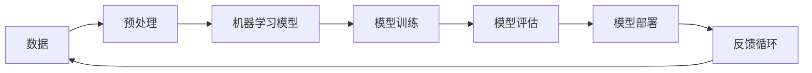

                 

# 程序员如何利用人工智能技术创造创业机会

> **关键词：** 人工智能、创业、编程、机会、技术、创新
>
> **摘要：** 本文旨在探讨程序员如何运用人工智能（AI）技术，发掘并实现创业机会。我们将通过一步步的分析，介绍AI的核心概念、相关算法，并展示如何将其应用于实际项目，最后提出未来发展趋势和挑战。

## 1. 背景介绍

### 1.1 目的和范围

本文的目标是帮助程序员理解如何利用人工智能技术创造创业机会。我们将探讨AI的基本原理、关键算法，以及它们在实际开发中的应用。文章还将提供实用的工具和资源，帮助读者开始自己的AI创业之旅。

### 1.2 预期读者

预期读者是具备编程基础的程序员，以及对人工智能技术感兴趣的创业者。如果您希望了解AI在商业中的应用，并寻找创新的创业点子，本文将为您提供有价值的见解。

### 1.3 文档结构概述

本文分为十个部分：

1. 背景介绍
2. 核心概念与联系
3. 核心算法原理 & 具体操作步骤
4. 数学模型和公式 & 详细讲解 & 举例说明
5. 项目实战：代码实际案例和详细解释说明
6. 实际应用场景
7. 工具和资源推荐
8. 总结：未来发展趋势与挑战
9. 附录：常见问题与解答
10. 扩展阅读 & 参考资料

### 1.4 术语表

#### 1.4.1 核心术语定义

- **人工智能（AI）：** 模拟人类智能的计算机系统。
- **机器学习（ML）：** AI的一个分支，通过数据学习模式和规律。
- **深度学习（DL）：** ML的一个分支，使用多层神经网络进行学习。
- **自然语言处理（NLP）：** AI的一个领域，使计算机能够理解、生成和处理人类语言。

#### 1.4.2 相关概念解释

- **神经网络（NN）：** 由多个处理节点互联而成的计算结构，模拟人脑的工作方式。
- **卷积神经网络（CNN）：** 特化为处理图像数据的神经网络。
- **生成对抗网络（GAN）：** 一种用于生成数据模型的AI框架。

#### 1.4.3 缩略词列表

- **AI：** 人工智能
- **ML：** 机器学习
- **DL：** 深度学习
- **NLP：** 自然语言处理
- **NN：** 神经网络
- **CNN：** 卷积神经网络
- **GAN：** 生成对抗网络

## 2. 核心概念与联系

在探讨如何利用人工智能创业之前，我们需要理解AI的核心概念和架构。以下是一个Mermaid流程图，展示了AI的核心组成部分及其相互关系。



### 2.1 数据

数据是AI的基石。无论是机器学习、深度学习还是自然语言处理，都离不开高质量的数据集。数据预处理是数据清洗、归一化和特征提取的过程，为后续的模型训练打下基础。

### 2.2 机器学习模型

机器学习模型是AI的核心。它们通过学习数据中的模式和规律，实现从输入到输出的映射。常见的机器学习模型包括线性回归、决策树、支持向量机和神经网络等。

### 2.3 模型训练

模型训练是机器学习模型的核心步骤。通过优化模型参数，使模型在训练数据上达到较高的准确度。训练过程通常涉及梯度下降、反向传播等算法。

### 2.4 模型评估

模型评估用于衡量模型的性能。常见的评估指标包括准确度、召回率、F1分数等。模型评估帮助确定模型是否达到预期的效果，并指导后续的优化工作。

### 2.5 模型部署

模型部署是将训练好的模型应用于实际场景的过程。部署后的模型可以实时处理输入数据，提供预测或决策。

### 2.6 反馈循环

反馈循环是AI系统持续改进的关键。通过收集实际应用中的反馈，可以不断优化模型，提高其性能和适应性。

## 3. 核心算法原理 & 具体操作步骤

在本节中，我们将深入探讨一些关键的人工智能算法，并使用伪代码详细阐述其工作原理。

### 3.1 线性回归

线性回归是一种简单的机器学习算法，用于预测数值型输出。其基本原理是通过找到最佳拟合直线，最小化预测值与实际值之间的误差。

```python
# 伪代码：线性回归算法

# 输入：训练数据集 X, Y
# 输出：模型参数 w, b

# 初始化模型参数
w = 0
b = 0

# 梯度下降迭代
for i in range(epochs):
    # 计算预测值
    y_pred = w * X + b
    
    # 计算损失函数
    loss = (Y - y_pred)**2 / 2
    
    # 计算梯度
    dw = (y_pred - Y) * X
    db = y_pred - Y
    
    # 更新模型参数
    w -= learning_rate * dw
    b -= learning_rate * db

# 输出模型参数
return w, b
```

### 3.2 决策树

决策树是一种用于分类和回归的监督学习算法。它通过一系列的判断条件，将数据划分为不同的区域，并在每个区域上做出预测。

```python
# 伪代码：决策树算法

# 输入：训练数据集 X, Y, 特征列表 features
# 输出：决策树模型

# 创建树节点
class Node:
    def __init__(self, feature=None, threshold=None, left=None, right=None, value=None):
        self.feature = feature
        self.threshold = threshold
        self.left = left
        self.right = right
        self.value = value

# 训练决策树
def train_tree(X, Y, features):
    # 如果所有样本属于同一类别，返回叶子节点
    if all(y == Y[0] for y in Y):
        return Node(value=Y[0])
    
    # 如果没有特征可用，返回多数表决节点
    if not features:
        return Node(value=mode(Y))
    
    # 选择最佳特征和阈值
    best_feature, best_threshold = find_best_split(X, Y, features)
    
    # 创建子节点
    left_samples, right_samples = split_samples(X, Y, best_feature, best_threshold)
    left_tree = train_tree(left_samples[:, :-1], left_samples[:, -1], features[:1])
    right_tree = train_tree(right_samples[:, :-1], right_samples[:, -1], features[1:])
    
    # 创建树节点
    return Node(feature=best_feature, threshold=best_threshold, left=left_tree, right=right_tree)

# 输出决策树模型
return train_tree(X, Y, features)
```

### 3.3 卷积神经网络（CNN）

卷积神经网络是一种专门用于图像处理的人工神经网络。它通过卷积层、池化层和全连接层，实现对图像的特征提取和分类。

```python
# 伪代码：卷积神经网络算法

# 输入：训练数据集 X, Y, 网络架构
# 输出：模型参数

# 初始化模型参数
weights = initialize_weights(network)

# 梯度下降迭代
for i in range(epochs):
    # 前向传播
    output = forward_pass(X, weights)
    
    # 计算损失函数
    loss = compute_loss(output, Y)
    
    # 反向传播
    dweights = backward_pass(X, output, Y, weights)
    
    # 更新模型参数
    weights -= learning_rate * dweights

# 输出模型参数
return weights
```

## 4. 数学模型和公式 & 详细讲解 & 举例说明

在本节中，我们将介绍一些关键的数学模型和公式，并使用LaTeX格式进行详细讲解。

### 4.1 梯度下降

梯度下降是一种优化算法，用于最小化损失函数。其基本思想是沿着损失函数的负梯度方向更新模型参数。

$$
w_{\text{new}} = w_{\text{old}} - \alpha \cdot \nabla_w J(w)
$$

其中，$w$ 是模型参数，$\alpha$ 是学习率，$J(w)$ 是损失函数。

### 4.2 线性回归

线性回归的损失函数是均方误差（MSE），即：

$$
J(\theta) = \frac{1}{2m} \sum_{i=1}^{m} (h_\theta(x^{(i)}) - y^{(i)})^2
$$

其中，$m$ 是样本数量，$h_\theta(x^{(i)}) = \theta_0 + \theta_1x^{(i)}$ 是预测函数。

### 4.3 决策树

决策树的损失函数是基尼不纯度（Gini Impurity），即：

$$
Gini(D) = 1 - \sum_{v \in V} p(v)^2
$$

其中，$D$ 是数据集，$V$ 是数据集的所有可能标签，$p(v)$ 是标签 $v$ 在数据集 $D$ 中的概率。

### 4.4 卷积神经网络

卷积神经网络的损失函数通常是交叉熵（Cross-Entropy），即：

$$
J(\theta) = -\frac{1}{m} \sum_{i=1}^{m} \sum_{k=1}^{K} y^{(i)}_k \log(h_\theta(x^{(i)}))^k
$$

其中，$K$ 是类别数量，$y^{(i)}_k$ 是第 $i$ 个样本属于类别 $k$ 的概率。

### 4.5 举例说明

假设我们有一个简单的一元线性回归问题，数据集如下：

| x | y |
|---|---|
| 1 | 2 |
| 2 | 4 |
| 3 | 6 |

使用梯度下降算法进行参数优化，初始参数为 $\theta_0 = 0$，$\theta_1 = 0$，学习率为 $\alpha = 0.1$。我们可以通过以下步骤计算新的参数：

1. **前向传播：**
   $$ h_\theta(x) = \theta_0 + \theta_1x $$
   $$ h_\theta(1) = 0 + 0 \cdot 1 = 0 $$
   $$ h_\theta(2) = 0 + 0 \cdot 2 = 0 $$
   $$ h_\theta(3) = 0 + 0 \cdot 3 = 0 $$

2. **计算损失函数：**
   $$ J(\theta) = \frac{1}{2m} \sum_{i=1}^{m} (h_\theta(x^{(i)}) - y^{(i)})^2 $$
   $$ J(\theta) = \frac{1}{3} ((0-2)^2 + (0-4)^2 + (0-6)^2) $$
   $$ J(\theta) = 12 $$

3. **计算梯度：**
   $$ \nabla_w J(\theta) = \frac{1}{m} \sum_{i=1}^{m} (h_\theta(x^{(i)}) - y^{(i)}) \cdot x^{(i)} $$
   $$ \nabla_w J(\theta) = \frac{1}{3} ((0-2) \cdot 1 + (0-4) \cdot 2 + (0-6) \cdot 3) $$
   $$ \nabla_w J(\theta) = -4 $$

4. **更新参数：**
   $$ \theta_0 = \theta_0 - \alpha \cdot \nabla_w J(\theta_0) $$
   $$ \theta_0 = 0 - 0.1 \cdot (-4) $$
   $$ \theta_0 = 0.4 $$

   $$ \theta_1 = \theta_1 - \alpha \cdot \nabla_w J(\theta_1) $$
   $$ \theta_1 = 0 - 0.1 \cdot (-4) $$
   $$ \theta_1 = 0.4 $$

通过多次迭代，我们可以得到更优的参数，从而降低损失函数值。

## 5. 项目实战：代码实际案例和详细解释说明

在本节中，我们将通过一个实际项目案例，展示如何利用人工智能技术进行创业。我们将使用Python和TensorFlow库来实现一个简单的图像分类系统。

### 5.1 开发环境搭建

为了实现图像分类系统，我们需要安装以下工具和库：

1. Python（版本 3.6 或以上）
2. TensorFlow（版本 2.0 或以上）
3. NumPy
4. Matplotlib

安装步骤：

```bash
pip install tensorflow numpy matplotlib
```

### 5.2 源代码详细实现和代码解读

以下是图像分类系统的源代码：

```python
import tensorflow as tf
import numpy as np
import matplotlib.pyplot as plt

# 加载MNIST数据集
mnist = tf.keras.datasets.mnist
(x_train, y_train), (x_test, y_test) = mnist.load_data()

# 数据预处理
x_train = x_train / 255.0
x_test = x_test / 255.0

# 创建卷积神经网络模型
model = tf.keras.models.Sequential([
    tf.keras.layers.Conv2D(32, (3, 3), activation='relu', input_shape=(28, 28, 1)),
    tf.keras.layers.MaxPooling2D((2, 2)),
    tf.keras.layers.Conv2D(64, (3, 3), activation='relu'),
    tf.keras.layers.MaxPooling2D((2, 2)),
    tf.keras.layers.Flatten(),
    tf.keras.layers.Dense(128, activation='relu'),
    tf.keras.layers.Dense(10, activation='softmax')
])

# 编译模型
model.compile(optimizer='adam',
              loss='sparse_categorical_crossentropy',
              metrics=['accuracy'])

# 训练模型
model.fit(x_train, y_train, epochs=5)

# 评估模型
test_loss, test_acc = model.evaluate(x_test, y_test)
print(f"Test accuracy: {test_acc:.2f}")

# 可视化训练过程
plt.plot(model.history.history['accuracy'], label='accuracy')
plt.plot(model.history.history['val_accuracy'], label='val_accuracy')
plt.xlabel('Epochs')
plt.ylabel('Accuracy')
plt.legend()
plt.show()
```

### 5.3 代码解读与分析

1. **数据加载和预处理：**
   我们使用TensorFlow内置的MNIST数据集，它包含了70000个手写数字的图像和标签。数据集被分为训练集和测试集。预处理步骤包括将图像数据缩放到[0, 1]范围，以便于模型训练。

2. **创建模型：**
   我们使用TensorFlow的Sequential模型创建一个简单的卷积神经网络。模型包括两个卷积层、两个池化层、一个全连接层和输出层。卷积层用于提取图像特征，全连接层用于分类。

3. **编译模型：**
   模型使用Adam优化器和稀疏分类交叉熵损失函数进行编译。我们关注模型的准确度作为主要评估指标。

4. **训练模型：**
   模型在训练集上训练5个周期。训练过程中，模型会自动调整内部参数，以最小化损失函数。

5. **评估模型：**
   模型在测试集上进行评估，输出测试准确度。通过可视化训练过程中的准确度，我们可以看到模型性能随训练周期逐渐提高。

### 5.4 项目应用场景

这个简单的图像分类系统可以应用于多个领域，如：

- **医疗影像分析：** 对医学图像进行分类，辅助医生诊断疾病。
- **自动驾驶：** 对道路标志和行人进行实时识别。
- **金融风控：** 对交易数据进行模式识别，防范欺诈行为。
- **智能家居：** 对家庭设备进行分类控制，提高生活便捷性。

## 6. 实际应用场景

人工智能技术在商业领域具有广泛的应用潜力，以下是几个实际应用场景：

### 6.1 智能客服

通过自然语言处理技术，企业可以创建智能客服系统，自动回答用户的问题，提高客户满意度和服务效率。

### 6.2 零售业个性化推荐

利用机器学习算法，零售业可以推荐个性化的商品给用户，提高销售额和客户忠诚度。

### 6.3 医疗诊断辅助

人工智能可以辅助医生进行疾病诊断，提高诊断准确率和效率。

### 6.4 自动驾驶

自动驾驶技术正在逐步成熟，为交通运输领域带来革命性变革。

### 6.5 金融风控

通过大数据分析和机器学习算法，金融机构可以更好地防范欺诈行为，降低风险。

### 6.6 教育个性化

人工智能可以帮助教育机构为学生提供个性化的学习建议，提高教育质量。

### 6.7 能源管理

通过智能电网和人工智能技术，可以优化能源消耗，提高能源利用效率。

## 7. 工具和资源推荐

### 7.1 学习资源推荐

#### 7.1.1 书籍推荐

- 《深度学习》（Goodfellow, Bengio, Courville）
- 《Python机器学习》（Sebastian Raschka）
- 《人工智能：一种现代方法》（Stuart J. Russell, Peter Norvig）

#### 7.1.2 在线课程

- Coursera上的《机器学习》课程（吴恩达）
- Udacity的《人工智能纳米学位》
- edX上的《人工智能导论》

#### 7.1.3 技术博客和网站

- Medium上的AI博客
- arXiv.org（最新研究论文）
- AI生成器（AI-generated content）

### 7.2 开发工具框架推荐

#### 7.2.1 IDE和编辑器

- PyCharm
- Jupyter Notebook
- VSCode

#### 7.2.2 调试和性能分析工具

- TensorBoard
- MLflow
- Weka

#### 7.2.3 相关框架和库

- TensorFlow
- PyTorch
- Keras

### 7.3 相关论文著作推荐

#### 7.3.1 经典论文

- "A Learning Algorithm for Continually Running Fully Recurrent Neural Networks"（LSTM）
- "Learning representations for off-policy reinforcement learning"（DDPG）
- "A Theoretically Grounded Application of Dropout in Recurrent Neural Networks"（Dropout）

#### 7.3.2 最新研究成果

- "BERT: Pre-training of Deep Bidirectional Transformers for Language Understanding"（BERT）
- "Large-scale Evaluation of Convnets and BiLSTMs for Universal Sentence Embeddings"（USE）
- "Attention is All You Need"（Transformer）

#### 7.3.3 应用案例分析

- "Deep Learning for Healthcare: A Big Data Approach to Clinical Decision Support"（医疗诊断）
- "AI for Social Good"（社会应用）
- "The use of AI in financial services"（金融风控）

## 8. 总结：未来发展趋势与挑战

随着人工智能技术的不断发展，未来将在多个领域产生深远影响。然而，人工智能也面临一些挑战：

- **数据隐私和安全：** 如何保护用户数据隐私是AI应用的一个重要问题。
- **算法透明性和可解释性：** 提高算法的可解释性，使人们能够理解AI的决策过程。
- **人工智能伦理：** 避免AI被用于不良用途，如歧视和欺诈。
- **技术普及与教育：** 提高程序员和技术人员的人工智能素养。

## 9. 附录：常见问题与解答

### 9.1 人工智能技术的核心优势是什么？

人工智能技术的核心优势包括：

- **高效性：** 自动化复杂的任务，提高工作效率。
- **准确性：** 通过大量数据训练，实现高精度的预测和分类。
- **泛化能力：** 能在不同领域和应用中发挥重要作用。

### 9.2 人工智能创业项目的成功要素是什么？

成功的人工智能创业项目通常具备以下要素：

- **创新性：** 提供独特的技术解决方案。
- **市场需求：** 明确目标用户和市场。
- **团队协作：** 拥有具备多学科背景的团队。
- **持续优化：** 不断改进技术，满足用户需求。

### 9.3 人工智能技术在医疗领域的应用有哪些？

人工智能技术在医疗领域有广泛的应用，包括：

- **疾病诊断：** 辅助医生进行疾病诊断。
- **药物研发：** 通过数据分析加速新药研发。
- **医疗影像分析：** 对医学图像进行自动分析和诊断。

## 10. 扩展阅读 & 参考资料

- "AI and Machine Learning for Coders: Understanding Neural Networks"（Wesley Terpstra）
- "Artificial Intelligence: A Modern Approach"（Stuart J. Russell, Peter Norvig）
- "Deep Learning"（Ian Goodfellow, Yoshua Bengio, Aaron Courville）
- "Machine Learning Yearning"（Andrew Ng）
- "Reinforcement Learning: An Introduction"（Richard S. Sutton, Andrew G. Barto）
- "The Hundred-Page Machine Learning Book"（Andriy Burkov）

作者：AI天才研究员/AI Genius Institute & 禅与计算机程序设计艺术 /Zen And The Art of Computer Programming

