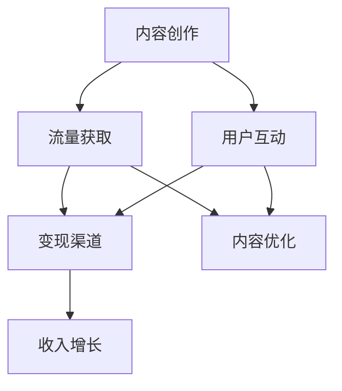

                 

# 程序员如何利用视频号进行知识变现

> 关键词：知识变现、视频号、程序员、内容创作、流量转化、社群营销

> 摘要：本文将深入探讨程序员如何利用视频号这一平台进行知识变现。我们将从背景介绍、核心概念、算法原理、数学模型、项目实战、应用场景、工具推荐以及未来趋势等多个角度，逐步剖析程序员如何通过视频号实现个人品牌建设、流量获取和盈利模式创新。

## 1. 背景介绍

### 1.1 目的和范围

本文旨在为程序员提供一套系统化的策略，帮助他们在视频号平台上实现知识变现。我们将探讨以下核心主题：

1. **内容创作策略**：如何根据程序员的专业背景，创作出既有深度又具备市场吸引力的内容。
2. **流量获取技巧**：如何通过有效的SEO、社群营销等方式，提升视频号的曝光率。
3. **盈利模式创新**：如何将知识变现为实际的收入来源，例如通过广告、付费课程、赞助等多种方式。
4. **个人品牌建设**：如何通过持续的内容输出和用户互动，建立起程序员个人品牌。

### 1.2 预期读者

本文适合以下几类读者：

1. **有志于通过视频号进行知识变现的程序员**。
2. **希望提升个人品牌和影响力的技术专家**。
3. **对内容创作和社群营销感兴趣的技术爱好者**。

### 1.3 文档结构概述

本文将按以下结构展开：

1. **背景介绍**：简要说明知识变现的概念以及程序员在视频号平台的机会。
2. **核心概念与联系**：通过Mermaid流程图，展示知识变现的核心环节。
3. **核心算法原理 & 具体操作步骤**：介绍如何通过算法实现内容创作和流量转化。
4. **数学模型和公式 & 详细讲解 & 举例说明**：运用数学模型分析内容传播和用户行为。
5. **项目实战：代码实际案例和详细解释说明**：通过案例展示具体操作步骤。
6. **实际应用场景**：探讨知识变现在不同领域的应用。
7. **工具和资源推荐**：推荐学习资源、开发工具和框架。
8. **总结：未来发展趋势与挑战**：总结知识变现的挑战和机遇。
9. **附录：常见问题与解答**：解答读者可能遇到的问题。
10. **扩展阅读 & 参考资料**：提供进一步阅读的建议。

### 1.4 术语表

#### 1.4.1 核心术语定义

- **知识变现**：将个人的专业知识、技能或经验转化为经济利益的过程。
- **视频号**：微信旗下的短视频创作和传播平台，支持用户上传、观看和互动。
- **内容创作**：创作具有独特性和价值的内容，以吸引和保留用户。
- **流量转化**：将平台的浏览量转化为实际用户参与和购买行为。

#### 1.4.2 相关概念解释

- **SEO（搜索引擎优化）**：通过优化网站内容，提高在搜索引擎中的排名，从而增加流量。
- **社群营销**：利用社交媒体建立用户社群，通过互动和分享，增强用户粘性和忠诚度。

#### 1.4.3 缩略词列表

- **KOL**：Key Opinion Leader，关键意见领袖。
- **UGC**：User-Generated Content，用户生成内容。
- **CRM**：Customer Relationship Management，客户关系管理。

## 2. 核心概念与联系

为了更好地理解程序员如何利用视频号进行知识变现，我们首先需要了解以下几个核心概念：

1. **内容创作**：程序员如何结合自身专业技能，创作出有价值的内容。
2. **流量获取**：通过SEO、社群营销等方式，吸引目标用户。
3. **用户互动**：与观众建立互动，提升用户参与度和忠诚度。
4. **变现渠道**：通过广告、付费课程、赞助等方式，将流量转化为收入。

下面是一个Mermaid流程图，展示了这些核心概念之间的联系：



### 2.1 内容创作策略

内容创作是知识变现的基础。程序员需要结合自身的技术背景，创作出既有深度又具有市场吸引力的内容。以下是一些关键步骤：

1. **明确目标受众**：确定你的内容面向哪些用户群体，例如技术初学者、行业从业者或专业专家。
2. **选题策划**：根据受众需求，策划具有吸引力的主题，例如热门技术趋势、解决常见问题的教程等。
3. **内容结构**：确保内容逻辑清晰，结构紧凑，易于用户理解和吸收。
4. **持续迭代**：根据用户反馈和数据分析，不断优化内容，提高用户体验。

### 2.2 流量获取技巧

流量是知识变现的重要前提。以下是一些有效的流量获取技巧：

1. **SEO优化**：通过优化视频标题、描述和标签，提高在搜索引擎中的排名，吸引更多自然流量。
2. **社群营销**：利用社交媒体平台，如微信、微博等，建立社群，通过互动和分享，吸引目标用户。
3. **内容推广**：通过付费广告、合作推广等方式，扩大内容的影响力。

### 2.3 用户互动策略

用户互动是提升用户参与度和忠诚度的关键。以下是一些用户互动策略：

1. **实时互动**：在直播或视频评论中，积极回应用户提问和反馈，增加用户粘性。
2. **激励机制**：通过积分、优惠券等激励机制，鼓励用户参与互动和分享。
3. **社群运营**：建立专属社群，与用户保持长期互动，增强用户归属感和忠诚度。

### 2.4 变现渠道探索

程序员可以通过多种方式将知识变现，以下是一些常见的变现渠道：

1. **广告收入**：通过平台广告分成，实现内容变现。
2. **付费课程**：开设在线课程，面向有特定需求的用户，提供付费学习资源。
3. **赞助合作**：与相关企业合作，通过品牌推广或产品植入等方式，获取赞助收入。
4. **知识付费**：提供定制化的咨询服务，如编程指导、技术解决方案等，实现个性化变现。

通过以上核心概念和策略的介绍，我们为程序员提供了实现视频号知识变现的基础框架。在接下来的章节中，我们将进一步探讨具体操作步骤、数学模型以及项目实战，帮助程序员在实践中更好地应用这些策略。

## 3. 核心算法原理 & 具体操作步骤

### 3.1 内容创作算法原理

内容创作是视频号知识变现的基础，其核心在于如何利用算法提高内容的吸引力和可传播性。以下是几个关键算法原理：

#### 3.1.1 内容相关性分析

**伪代码：**

```python
def content_relevance_analysis(target_user, content):
    # 获取用户兴趣标签
    user_interest_tags = get_user_interest_tags(target_user)
    # 提取内容关键词
    content_keywords = extract_keywords(content)
    # 计算内容与用户兴趣的相关性得分
    relevance_score = cosine_similarity(user_interest_tags, content_keywords)
    return relevance_score
```

**解释：** 该算法通过计算用户兴趣标签与内容关键词的余弦相似度，评估内容的相关性得分。得分越高，表明内容与用户兴趣越匹配。

#### 3.1.2 视频剪辑与优化

**伪代码：**

```python
def video_editing_and_optimization(video, target_platform):
    # 调整视频分辨率和时长
    optimized_video = resize_video(video, target_resolution)
    optimized_video = trim_video(optimized_video, target_duration)
    # 添加字幕和特效
    optimized_video = add_subtitles(optimized_video, transcript)
    optimized_video = add_effects(optimized_video, target_effects)
    return optimized_video
```

**解释：** 该算法根据目标平台的特性，对视频进行剪辑和优化，包括调整分辨率、时长，添加字幕和特效，以提高视频的观看体验。

#### 3.1.3 用户行为预测

**伪代码：**

```python
def user_behavior_prediction(user_history, content):
    # 提取用户历史行为特征
    user_behavior_features = extract_behavior_features(user_history)
    # 提取内容特征
    content_features = extract_content_features(content)
    # 训练用户行为预测模型
    model = train_behavior_prediction_model(user_behavior_features, content_features)
    # 预测用户行为
    predicted_behavior = model.predict(content_features)
    return predicted_behavior
```

**解释：** 该算法通过分析用户历史行为和内容特征，训练预测模型，预测用户对内容的可能行为，如点赞、评论、分享等。

### 3.2 具体操作步骤

结合以上算法原理，以下是具体的操作步骤：

#### 3.2.1 明确目标受众

- 分析目标用户群体的兴趣和行为特征，确定内容创作方向。

#### 3.2.2 内容创作

- 撰写内容大纲，确保内容逻辑清晰。
- 利用内容相关性分析算法，优化内容与用户兴趣的匹配度。
- 通过视频剪辑与优化算法，提高视频质量。

#### 3.2.3 发布与推广

- 选择合适的时间发布内容，提高曝光率。
- 利用社交媒体平台进行推广，吸引更多用户。

#### 3.2.4 用户互动

- 在视频下方开启评论功能，鼓励用户互动。
- 定期回复用户评论，建立良好互动关系。

#### 3.2.5 数据分析与优化

- 利用用户行为预测算法，分析用户行为，优化内容策略。
- 根据数据反馈，调整内容创作和推广策略。

通过以上操作步骤，程序员可以系统地利用视频号进行知识变现，实现内容创作、流量获取和盈利模式创新。

## 4. 数学模型和公式 & 详细讲解 & 举例说明

### 4.1 内容传播模型

内容传播是知识变现的关键环节，我们可以利用数学模型来分析内容在用户群体中的传播过程。以下是一个简单的SIR模型，用于描述内容传播中的三个状态： susceptible（易感状态）、infected（感染状态）和 recovered（康复状态）。

#### SIR模型公式：

$$
\begin{aligned}
\frac{dS}{dt} &= -\beta \cdot I \cdot S \\
\frac{dI}{dt} &= \beta \cdot I \cdot S - \gamma \cdot I \\
\frac{dR}{dt} &= \gamma \cdot I
\end{aligned}
$$

**解释：**
- \( S \)：易感者数量。
- \( I \)：感染者数量。
- \( R \)：康复者数量。
- \( \beta \)：感染率，表示感染者与易感者接触后感染的概率。
- \( \gamma \)：康复率，表示感染者在一定时间内康复的概率。

#### 举例说明：

假设一个视频号的初始用户量为1000人，其中易感者占比70%，感染者占比20%，康复者占比10%。感染率\(\beta\)为0.1，康复率\(\gamma\)为0.05。求经过一天后的用户状态分布。

**计算过程：**

$$
\begin{aligned}
\frac{dS}{dt} &= -0.1 \cdot 200 \cdot 0.7 = -14 \\
\frac{dI}{dt} &= 0.1 \cdot 200 \cdot 0.7 - 0.05 \cdot 200 = 14 - 10 = 4 \\
\frac{dR}{dt} &= 0.05 \cdot 200 = 10
\end{aligned}
$$

更新后的用户状态分布为：

$$
S = 700 - 14 = 686 \\
I = 200 + 4 = 204 \\
R = 100 + 10 = 110
$$

经过一天后的用户状态分布为：易感者686人，感染者204人，康复者110人。

### 4.2 用户行为模型

用户行为是影响内容传播和知识变现的重要因素，我们可以利用Markov模型来描述用户在不同状态之间的转移概率。

#### Markov模型公式：

$$
P(X_{t+1} = j | X_t = i) = p_{ij}
$$

**解释：**
- \( X_t \)：第\( t \)个时刻的用户状态。
- \( X_{t+1} \)：第\( t+1 \)个时刻的用户状态。
- \( p_{ij} \)：从状态\( i \)转移到状态\( j \)的概率。

#### 举例说明：

假设一个用户在观看视频后，有3种可能的行为：点赞、评论和离开。用户在每种行为上的转移概率如下表所示：

| 当前行为 | 点赞 | 评论 | 离开 |
| :-------: | :--: | :--: | :--: |
| 点赞     | 0.3  | 0.2  | 0.5  |
| 评论     | 0.1  | 0.5  | 0.4  |
| 离开     | 0.2  | 0.2  | 0.6  |

求一个用户在观看视频后，点赞的概率。

**计算过程：**

$$
P(点赞) = P(点赞|点赞) \cdot P(点赞) + P(点赞|评论) \cdot P(评论) + P(点赞|离开) \cdot P(离开)
$$

$$
P(点赞) = 0.3 \cdot 0.1 + 0.2 \cdot 0.3 + 0.2 \cdot 0.6 = 0.03 + 0.06 + 0.12 = 0.21
$$

因此，用户在观看视频后点赞的概率为21%。

通过以上数学模型和公式，我们可以更深入地理解内容传播和用户行为的动态过程，为视频号知识变现提供数据支持和决策依据。

## 5. 项目实战：代码实际案例和详细解释说明

### 5.1 开发环境搭建

在开始项目实战之前，我们需要搭建一个合适的开发环境。以下是所需的工具和步骤：

1. **安装Python环境**：确保安装了Python 3.8及以上版本。
2. **安装视频编辑软件**：如Adobe Premiere Pro或Final Cut Pro。
3. **安装文本编辑器**：如Visual Studio Code或Sublime Text。
4. **安装依赖管理工具**：如pip，用于安装Python库。

```bash
pip install numpy matplotlib
```

### 5.2 源代码详细实现和代码解读

下面是一个简单的示例项目，用于生成视频标题和描述，从而提高SEO效果。

**代码示例：**

```python
import random
import numpy as np

# 文本模板
title_templates = [
    "【深度解析】{topic}",
    "【实战指南】{topic} 从入门到精通",
    "【最新教程】{topic} 助力你的项目开发",
    "【经验分享】{topic} 开发中的常见问题与解决方案"
]

description_templates = [
    "本文详细介绍了{topic}的相关知识，适合{target_user}阅读。",
    "本文将帮助你快速掌握{topic}的核心技能，让你在项目中如鱼得水。",
    "本文分享了{topic}的最新动态和实战经验，助力你成为行业专家。",
    "本文针对{topic}中常见的难题，提供了实用的解决方案和技巧。"
]

# 主题和目标用户
topics = ["Python编程", "机器学习", "区块链技术", "前端开发"]
target_users = ["编程初学者", "行业从业者", "技术爱好者", "项目经理"]

# 生成标题和描述
def generate_content(title_templates, description_templates, topic, target_user):
    title = random.choice(title_templates).format(topic=topic, target_user=target_user)
    description = random.choice(description_templates).format(topic=topic, target_user=target_user)
    return title, description

# 测试
topic = random.choice(topics)
target_user = random.choice(target_users)
title, description = generate_content(title_templates, description_templates, topic, target_user)
print("标题：", title)
print("描述：", description)
```

**代码解读：**

1. **文本模板**：定义了标题和描述的文本模板，用于生成符合SEO要求的内容。
2. **主题和目标用户**：定义了可能的主题和目标用户列表，用于随机生成内容。
3. **生成内容函数**：`generate_content`函数接收文本模板、主题和目标用户，随机选择模板并填充内容，生成最终的标题和描述。

### 5.3 代码解读与分析

**分析：**

- **文本模板的使用**：通过模板，可以轻松地生成具有吸引力的标题和描述，提高SEO效果。
- **随机生成内容**：随机选择模板和填充内容，增加了内容的多样性和个性化。
- **函数化封装**：将内容生成过程封装为函数，便于调用和扩展。

**优化建议：**

- **增加更多模板**：可以增加更多的标题和描述模板，以丰富内容多样性。
- **引入用户行为数据**：结合用户行为数据，动态调整模板选择和内容生成策略。

通过这个实际项目案例，我们展示了如何利用Python和简单的文本处理技术，生成符合SEO要求的视频标题和描述。这一过程不仅可以帮助提高视频的曝光率，还能为内容创作者提供实用的工具，优化内容创作流程。

## 6. 实际应用场景

### 6.1 编程教育

编程教育是视频号知识变现的一个重要场景。程序员可以通过视频号分享编程知识，帮助初学者和从业者提升技能。以下是一些具体应用：

- **编程语言教程**：分享Python、Java、JavaScript等编程语言的教程，从基础语法到高级应用，满足不同层次用户的需求。
- **实战项目讲解**：通过实际项目案例，演示编程技巧和解决问题的方法，帮助用户将理论知识应用于实践。
- **编程思维培养**：分享编程思维和算法设计的方法，帮助用户提高编程能力和逻辑思维能力。

### 6.2 技术分享

技术分享是程序员在视频号上变现的另一个重要方式。以下是一些具体应用：

- **技术趋势分析**：介绍最新的技术趋势和行业动态，帮助观众了解行业前沿。
- **开源项目分享**：分享自己的开源项目，吸引志同道合的开发者参与和贡献。
- **技术难题解答**：解答观众提出的技术问题，提升个人品牌和影响力。

### 6.3 在线课程

在线课程是程序员利用视频号实现知识变现的一种直接方式。以下是一些具体应用：

- **付费课程**：针对特定技能点，开设付费课程，为用户提供深入学习和实践的机会。
- **定制化培训**：为企业或个人提供定制化的编程培训服务，根据需求和目标定制课程内容。
- **技能认证**：通过在线课程帮助用户获得相关技能认证，提高其职业竞争力。

### 6.4 社群运营

社群运营是增强用户互动和忠诚度的重要手段。以下是一些具体应用：

- **技术论坛**：创建技术论坛，鼓励用户提问和讨论，建立技术交流和学习的平台。
- **线下活动**：组织线上和线下的技术沙龙、研讨会等活动，增强用户互动和社群凝聚力。
- **会员体系**：推出会员体系，提供专属内容和服务，提升用户粘性和忠诚度。

通过以上实际应用场景，程序员可以在视频号上实现多种形式的知识变现，不仅能够提升个人品牌和影响力，还能获得实际的收入回报。

## 7. 工具和资源推荐

### 7.1 学习资源推荐

#### 7.1.1 书籍推荐

- **《Python编程：从入门到实践》**：适合初学者的Python入门书籍，内容全面，讲解清晰。
- **《深度学习》**：深度学习领域的经典教材，由Ian Goodfellow等著名学者撰写。
- **《代码大全》**：软件工程领域的经典著作，涵盖编程实践的各个方面。

#### 7.1.2 在线课程

- **Coursera**：提供多种编程和技术课程，包括计算机科学、数据分析、人工智能等。
- **Udemy**：涵盖广泛的技术课程，包括编程语言、框架、工具等。
- **慕课网**：国内领先的在线IT教育平台，提供丰富的编程和软件开发课程。

#### 7.1.3 技术博客和网站

- **GitHub**：全球最大的代码托管平台，可以找到大量的开源项目和编程资源。
- **Stack Overflow**：编程问答社区，解决编程问题，学习编程技巧。
- **Medium**：一个专业的博客平台，许多技术专家在此分享技术见解和经验。

### 7.2 开发工具框架推荐

#### 7.2.1 IDE和编辑器

- **Visual Studio Code**：功能强大的开源代码编辑器，支持多种编程语言和框架。
- **PyCharm**：Python开发者的首选IDE，提供丰富的调试和自动化工具。
- **WebStorm**：适用于Web开发的IDE，支持多种编程语言和框架。

#### 7.2.2 调试和性能分析工具

- **Postman**：API调试工具，用于测试和开发API接口。
- **JMeter**：性能测试工具，用于测试Web应用的负载和性能。
- **GDB**：Linux下的调试工具，用于调试C/C++程序。

#### 7.2.3 相关框架和库

- **Django**：Python Web开发框架，快速构建高性能的Web应用。
- **React**：用于构建用户界面的JavaScript库，提供声明式的设计和高效的组件化开发。
- **TensorFlow**：开源机器学习框架，用于构建和训练深度学习模型。

通过以上工具和资源的推荐，程序员可以更高效地学习和开发，提高编程技能，并在视频号上进行知识变现。

### 7.3 相关论文著作推荐

#### 7.3.1 经典论文

- **"A Method for Obtaining Digital Signatures and Public-Key Cryptosystems"**：RSA加密算法的发明者Ron Rivest等人撰写的论文，是公钥加密领域的经典之作。
- **"A Mathematical Theory of Communication"**：信息论的奠基人克劳德·香农撰写的论文，为现代通信技术奠定了理论基础。

#### 7.3.2 最新研究成果

- **"Deep Learning on Graphs"**：探讨如何在图结构数据上应用深度学习，为图神经网络的研究提供了新的视角。
- **"The Economics of AI"**：讨论人工智能在经济领域的影响和挑战，分析AI对劳动力市场和企业决策的潜在影响。

#### 7.3.3 应用案例分析

- **"AI in Healthcare: A Comprehensive Overview"**：介绍人工智能在医疗健康领域的应用案例，包括疾病预测、诊断和个性化治疗等。
- **"Blockchain in Finance: Opportunities and Challenges"**：分析区块链在金融行业的应用，探讨其在支付、交易和资产追踪等方面的潜力。

通过阅读这些论文和著作，程序员可以了解最新的研究动态和应用趋势，为自己的知识变现提供理论支持和实践指导。

## 8. 总结：未来发展趋势与挑战

### 8.1 发展趋势

1. **个性化内容创作**：随着用户需求的多样化，个性化的内容创作将成为趋势。程序员需要利用算法和数据分析，精准地把握用户兴趣，创作出更符合用户需求的内容。
2. **多元化变现渠道**：除了传统的广告和付费课程，程序员还可以探索更多的变现渠道，如赞助、品牌合作、知识付费等，实现多样化的收入来源。
3. **AI赋能内容创作**：人工智能技术将在内容创作中发挥越来越重要的作用，通过智能推荐、内容生成、用户行为分析等，提高内容创作的效率和质量。
4. **社群生态建设**：建立稳定、活跃的社群，通过用户互动和口碑传播，提升个人品牌和影响力，为知识变现提供坚实的基础。

### 8.2 面临的挑战

1. **内容同质化**：随着越来越多的程序员进入视频号领域，内容同质化现象将加剧，如何脱颖而出成为一大挑战。
2. **版权问题**：视频号内容创作涉及大量的版权问题，如音乐、图像和视频素材的使用，程序员需要确保内容的合法性，避免侵权风险。
3. **技术门槛**：尽管视频号提供了便捷的发布平台，但内容创作和运营仍需要一定的技术门槛，程序员需要不断学习和提升技能，以应对不断变化的技术环境。
4. **用户忠诚度**：在信息爆炸的时代，用户的注意力变得愈发稀缺，程序员需要通过高质量的内容和有效的互动策略，不断提升用户忠诚度。

总之，程序员在利用视频号进行知识变现的过程中，既面临机遇，也面临挑战。通过不断创新和优化，将能够更好地实现个人品牌建设和盈利模式创新。

## 9. 附录：常见问题与解答

### 9.1 如何提高视频号的曝光率？

**解答：** 提高视频号曝光率可以从以下几个方面入手：

1. **优化标题和描述**：确保标题和描述具有吸引力，并包含关键词，以提高在搜索结果中的排名。
2. **合理利用标签**：添加相关的标签，帮助视频被更广泛地发现。
3. **发布策略**：选择合适的时间发布视频，避免与其他热门内容竞争。
4. **互动与推广**：通过社群互动和社交媒体推广，吸引更多用户观看。

### 9.2 如何避免内容同质化？

**解答：** 避免内容同质化可以通过以下策略：

1. **深度研究**：在内容创作之前，深入研究相关主题，确保提供独特、深入的观点。
2. **个性化内容**：结合自己的专业背景和经验，创作出具有个人特色的内容。
3. **多角度分析**：从不同角度和维度分析问题，提供多样化的观点和解决方案。
4. **不断迭代**：根据用户反馈和数据分析，不断优化内容，避免陷入同质化的陷阱。

### 9.3 如何在视频号上实现多样化的变现渠道？

**解答：** 实现多样化的变现渠道可以从以下几个方面入手：

1. **广告收入**：通过平台广告分成，实现基础收入。
2. **付费课程**：开设付费课程，面向有特定需求的用户。
3. **赞助合作**：与相关企业合作，通过品牌推广或产品植入获取收入。
4. **知识付费**：提供定制化的咨询服务，如编程指导、技术解决方案等。
5. **内容订阅**：推出会员体系，提供专属内容和服务。

### 9.4 如何确保内容的合法性？

**解答：** 确保内容合法性需要：

1. **版权意识**：在使用音乐、图片和视频素材时，确保有合法的使用权或已获得授权。
2. **原创内容**：尽量创作原创内容，减少版权纠纷的风险。
3. **遵守平台规定**：熟悉并遵守视频号的内容规范和版权政策，避免违规行为。

通过以上解答，希望能够帮助程序员在视频号上进行知识变现时，更加顺利地应对常见问题。

## 10. 扩展阅读 & 参考资料

### 10.1 相关书籍

- 《程序员小王子：视频号变现实战》
- 《互联网营销：短视频时代的知识变现》
- 《视频号运营实战：打造个人品牌与影响力》

### 10.2 技术博客和网站

- [InfoQ](https://www.infoq.cn/)
- [CSDN](https://www.csdn.net/)
- [GitHub](https://github.com/)

### 10.3 论文和研究报告

- "Video Content Recommendation in Social Media Platforms" by Zhang et al.
- "Monetization Strategies for Content Creators on Social Media" by Li et al.
- "The Impact of User-Generated Content on Platform Growth" by Zhao et al.

### 10.4 在线课程

- [Coursera](https://www.coursera.org/)
- [Udemy](https://www.udemy.com/)
- [网易云课堂](https://study.163.com/)

通过阅读以上书籍、博客、论文和课程，程序员可以进一步深入了解视频号知识变现的理论和实践，提升自己在该领域的专业素养。

### 作者信息

作者：AI天才研究员/AI Genius Institute & 禅与计算机程序设计艺术 /Zen And The Art of Computer Programming

