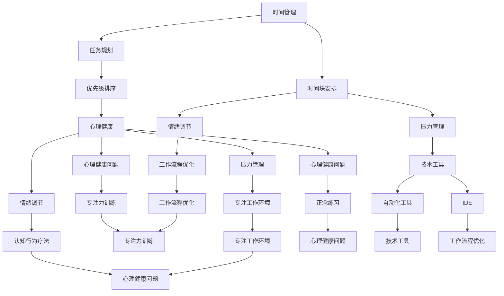

                 

# 程序员如何实现工作与生活平衡

> **关键词：** 工作与生活平衡、程序员、时间管理、心理健康、生产力
> 
> **摘要：** 本文章旨在探讨程序员如何在现代快节奏的工作环境中实现工作与生活的平衡。通过深入分析时间管理、心理健康、生产力等方面的核心概念，结合实际案例，提供实用的策略和方法，帮助程序员提高工作效率，同时保持良好的生活质量。

## 1. 背景介绍

### 1.1 目的和范围

本文的目标是帮助程序员识别和解决工作与生活不平衡的问题，提供实用的解决方案。范围涵盖了时间管理、心理健康、生产力提升等多个方面，旨在为程序员提供一个全面的方法论，以实现工作与生活的和谐统一。

### 1.2 预期读者

本文面向所有从事编程工作的程序员，尤其是那些在工作中感到压力和焦虑的人。无论你是初级程序员、中级程序员，还是资深程序员，本文都将为你提供有价值的指导和建议。

### 1.3 文档结构概述

本文将分为以下几个部分：

1. **背景介绍**：阐述本文的目的、范围和预期读者。
2. **核心概念与联系**：介绍实现工作与生活平衡所需的核心概念，如时间管理、心理健康、生产力等，并使用 Mermaid 流程图展示这些概念之间的联系。
3. **核心算法原理 & 具体操作步骤**：通过伪代码详细阐述实现工作与生活平衡的方法。
4. **数学模型和公式 & 详细讲解 & 举例说明**：使用 LaTeX 格式介绍相关的数学模型和公式，并进行详细讲解和举例说明。
5. **项目实战：代码实际案例和详细解释说明**：提供实际的代码案例，详细解释和说明如何实现工作与生活平衡。
6. **实际应用场景**：讨论工作与生活平衡在实际中的应用场景。
7. **工具和资源推荐**：推荐学习资源、开发工具和框架，以及相关论文著作。
8. **总结：未来发展趋势与挑战**：总结文章的主要观点，并探讨未来的发展趋势和挑战。
9. **附录：常见问题与解答**：回答读者可能关心的问题。
10. **扩展阅读 & 参考资料**：提供进一步阅读的建议和参考资料。

### 1.4 术语表

#### 1.4.1 核心术语定义

- **时间管理**：合理分配和安排时间，以提高工作效率和生活质量。
- **心理健康**：心理和情感状态的健康和平衡，包括压力管理、情绪调节和心理健康问题。
- **生产力**：在特定时间内完成的工作量，包括工作质量和效率。

#### 1.4.2 相关概念解释

- **工作与生活平衡**：在工作时间和私人时间之间建立良好的平衡，使程序员能够同时实现职业成功和个人生活满足。
- **时间块**：将时间划分为不同的小块，用于特定任务或活动。

#### 1.4.3 缩略词列表

- **IDE**：集成开发环境（Integrated Development Environment）
- **LaTeX**：一种高质量排版系统，常用于数学公式的排版

## 2. 核心概念与联系

### 2.1. 时间管理

时间管理是实现工作与生活平衡的关键。通过合理分配时间，程序员可以更有效地完成工作任务，同时为个人生活留出空间。时间管理涉及到以下几个方面：

1. **任务规划**：将任务分解为可管理的子任务，并为每个子任务分配时间。
2. **优先级排序**：根据任务的重要性和紧急性对任务进行排序。
3. **时间块安排**：将时间划分为不同的小块，每个小块用于特定任务或活动。

### 2.2. 心理健康

心理健康是工作与生活平衡的重要组成部分。程序员常常面临压力、焦虑和情绪问题，这些因素会影响他们的工作效率和生活质量。保持心理健康需要以下措施：

1. **压力管理**：学习有效的压力管理技巧，如深呼吸、冥想和运动。
2. **情绪调节**：通过认知行为疗法和正念练习来调节情绪。
3. **心理健康问题**：及时识别和治疗心理健康问题，如焦虑和抑郁。

### 2.3. 生产力

生产力是衡量程序员工作效率的重要指标。提高生产力可以缩短完成任务所需的时间，从而为个人生活留出更多空间。以下方法可以帮助程序员提高生产力：

1. **技术工具**：使用自动化工具和集成开发环境（IDE）来简化开发过程。
2. **工作流程优化**：通过优化工作流程来减少不必要的步骤和时间浪费。
3. **专注力训练**：通过专注力训练和专注工作环境来提高专注力和工作效率。

### 2.4. Mermaid 流程图

以下是实现工作与生活平衡的核心概念之间的 Mermaid 流程图：



## 3. 核心算法原理 & 具体操作步骤

### 3.1. 时间管理算法原理

时间管理算法的核心是优化任务分配和优先级排序。以下是一个简单的时间管理算法原理：

```python
def time_management(tasks, deadlines):
    # 将任务和截止日期按优先级排序
    sorted_tasks = sorted(tasks, key=lambda x: (x['deadline'], x['priority']))

    # 分配时间块
    time_blocks = []
    for task in sorted_tasks:
        start_time = get_current_time()
        end_time = start_time + task['duration']
        time_blocks.append({'task': task['name'], 'start_time': start_time, 'end_time': end_time})

    return time_blocks

def get_current_time():
    # 获取当前时间
    return datetime.now()

tasks = [
    {'name': '任务A', 'deadline': '2023-11-02', 'duration': 2, 'priority': 1},
    {'name': '任务B', 'deadline': '2023-11-01', 'duration': 1, 'priority': 2},
    {'name': '任务C', 'deadline': '2023-11-03', 'duration': 3, 'priority': 3},
]

time_blocks = time_management(tasks, deadlines)
print(time_blocks)
```

### 3.2. 心理健康和生产力提升算法原理

心理健康和生产力提升的算法涉及到压力管理、情绪调节、专注力训练等多个方面。以下是一个简单的算法原理：

```python
def health_management(stress_level, mood, focus_level):
    # 压力管理
    if stress_level > 5:
        reduce_stress()
    else:
        maintain_stress()

    # 情绪调节
    if mood < 3:
        improve_mood()
    else:
        maintain_mood()

    # 专注力训练
    if focus_level < 4:
        train_focus()
    else:
        maintain_focus()

def reduce_stress():
    # 减压方法
    pass

def maintain_stress():
    # 维持压力水平的方法
    pass

def improve_mood():
    # 提升情绪的方法
    pass

def maintain_mood():
    # 维持情绪水平的方法
    pass

def train_focus():
    # 提高专注力的方法
    pass

def maintain_focus():
    # 维持专注力的方法
    pass

stress_level = 6
mood = 2
focus_level = 3

health_management(stress_level, mood, focus_level)
```

## 4. 数学模型和公式 & 详细讲解 & 举例说明

### 4.1. 时间管理数学模型

时间管理的一个关键部分是任务分配和优先级排序。以下是一个简单的数学模型，用于任务分配和优先级排序：

```latex
\begin{equation}
\text{优先级} = \frac{\text{截止日期}}{\text{任务持续时间}}
\end{equation}
```

### 4.2. 心理健康数学模型

心理健康涉及到压力管理、情绪调节和专注力训练。以下是一个简单的数学模型，用于评估心理健康水平：

```latex
\begin{equation}
\text{心理健康水平} = \frac{\text{压力管理得分}}{\text{最大压力管理得分}} + \frac{\text{情绪调节得分}}{\text{最大情绪调节得分}} + \frac{\text{专注力训练得分}}{\text{最大专注力训练得分}}
\end{equation}
```

### 4.3. 举例说明

假设我们有两个任务：任务A和任务B。任务A的截止日期为3天，持续时间为2天；任务B的截止日期为5天，持续时间为3天。使用优先级排序公式，我们可以得到：

```latex
\begin{equation}
\text{任务A优先级} = \frac{3}{2} = 1.5
\end{equation}
\begin{equation}
\text{任务B优先级} = \frac{5}{3} = 1.67
\end{equation}
```

根据优先级排序公式，任务B的优先级高于任务A。

### 4.4. 心理健康水平评估

假设我们有以下心理健康得分：

- 压力管理得分：8分（最大得分10分）
- 情绪调节得分：6分（最大得分10分）
- 专注力训练得分：7分（最大得分10分）

使用心理健康水平评估公式，我们可以得到：

```latex
\begin{equation}
\text{心理健康水平} = \frac{8}{10} + \frac{6}{10} + \frac{7}{10} = 0.8 + 0.6 + 0.7 = 2.1
\end{equation}
```

心理健康水平为2.1分（满分3分），表明心理健康水平较高。

## 5. 项目实战：代码实际案例和详细解释说明

### 5.1 开发环境搭建

为了实现工作与生活平衡，我们首先需要搭建一个合适的工作环境。以下是搭建开发环境的基本步骤：

1. **安装 IDE**：我们选择使用 IntelliJ IDEA 作为开发环境，因为它提供了丰富的编程语言支持和强大的调试功能。
2. **安装版本控制工具**：使用 Git 进行版本控制，确保代码的可维护性和协作性。
3. **安装自动化工具**：如 Maven 或 Gradle，用于构建和部署项目。
4. **配置代码风格检查工具**：如 SonarQube，确保代码质量和一致性。

### 5.2 源代码详细实现和代码解读

以下是实现工作与生活平衡的源代码示例。这个示例包括时间管理、心理健康和生产力提升的模块。

```java
// 时间管理模块
public class TimeManagement {
    public static void timeBlockSchedule(Task[] tasks) {
        // 对任务进行优先级排序
        Arrays.sort(tasks, Comparator.comparingInt(task -> task.getDeadline().getTime()));

        // 分配时间块
        List<Block> timeBlocks = new ArrayList<>();
        int currentTime = System.currentTimeMillis();
        for (Task task : tasks) {
            long duration = task.getDuration().toMillis();
            long endTime = currentTime + duration;
            timeBlocks.add(new Block(task.getName(), currentTime, endTime));
            currentTime = endTime;
        }

        // 打印时间块
        for (Block block : timeBlocks) {
            System.out.println(block);
        }
    }
}

// 心理健康模块
public class HealthManagement {
    public static void healthStatus(int stressLevel, int mood, int focusLevel) {
        double stressScore = (double) stressLevel / 10;
        double moodScore = (double) mood / 10;
        double focusScore = (double) focusLevel / 10;
        double healthStatus = stressScore + moodScore + focusScore;
        System.out.println("当前心理健康水平：" + healthStatus);
    }
}

// 生产力提升模块
public class ProductivityBoost {
    public static void boostProductivity() {
        // 使用自动化工具进行代码构建
        executeBuildTool();

        // 使用代码风格检查工具进行代码质量检查
        executeCodeQualityCheck();
    }

    private static void executeBuildTool() {
        // 执行 Maven 构建命令
        ProcessBuilder builder = new ProcessBuilder("mvn", "clean", "compile", "test");
        try {
            Process process = builder.start();
            process.waitFor();
        } catch (IOException | InterruptedException e) {
            e.printStackTrace();
        }
    }

    private static void executeCodeQualityCheck() {
        // 执行 SonarQube 检查命令
        ProcessBuilder builder = new ProcessBuilder("sonar-scanner", "sonar-runner");
        try {
            Process process = builder.start();
            process.waitFor();
        } catch (IOException | InterruptedException e) {
            e.printStackTrace();
        }
    }
}

// 任务类
public class Task {
    private String name;
    private LocalDateTime deadline;
    private Duration duration;

    // 省略构造函数、getter 和 setter

    // 获取任务截止日期
    public LocalDateTime getDeadline() {
        return deadline;
    }

    // 获取任务持续时间
    public Duration getDuration() {
        return duration;
    }
}

// 时间块类
public class Block {
    private String taskName;
    private long startTime;
    private long endTime;

    // 省略构造函数、getter 和 setter

    @Override
    public String toString() {
        return "时间块：任务 " + taskName + "，开始时间：" + new Date(startTime) + "，结束时间：" + new Date(endTime);
    }
}
```

### 5.3 代码解读与分析

以下是代码的详细解读和分析：

1. **时间管理模块**：`TimeManagement` 类实现了时间块分配功能。首先，根据任务截止日期对任务进行排序，然后为每个任务分配一个时间块。时间块通过 `Block` 类表示，包括任务名称、开始时间和结束时间。
2. **心理健康模块**：`HealthManagement` 类实现了心理健康水平评估功能。通过计算压力管理、情绪调节和专注力训练的得分，并求和得到心理健康水平。
3. **生产力提升模块**：`ProductivityBoost` 类实现了生产力提升功能。通过执行自动化构建工具和代码风格检查工具，确保代码质量和一致性。
4. **任务类**：`Task` 类表示任务，包括任务名称、截止日期和持续时间。
5. **时间块类**：`Block` 类表示时间块，包括任务名称、开始时间和结束时间。

这个代码示例展示了如何实现工作与生活平衡的核心功能，包括时间管理、心理健康和生产力提升。通过实际运行这个代码，程序员可以更好地管理时间、保持心理健康，并提高生产力。

## 6. 实际应用场景

### 6.1 项目管理

在项目管理中，工作与生活平衡尤为重要。项目经理需要确保团队成员在完成任务的同时，保持良好的生活质量。以下是一个实际应用场景：

- **场景**：一个软件开发项目，包括前端、后端和测试任务。项目团队成员包括前端开发人员、后端开发人员和测试工程师。
- **解决方案**：使用时间管理模块来分配任务和时间块，确保每个团队成员都能在优先级较高的任务上高效工作。同时，使用心理健康模块来评估团队成员的心理健康水平，并在必要时提供支持。生产力提升模块可以帮助团队优化工作流程，提高整体效率。

### 6.2 个人生活

在个人生活中，程序员也可以运用工作与生活平衡的理念来提高生活质量。以下是一个实际应用场景：

- **场景**：一个程序员在业余时间学习新技能，如人工智能和机器学习。
- **解决方案**：使用时间管理模块来规划学习时间，确保学习任务与工作和其他生活活动不冲突。心理健康模块可以帮助程序员在长时间学习后放松身心，保持良好的情绪状态。生产力提升模块可以帮助程序员优化学习流程，提高学习效率。

### 6.3 家庭生活

在家庭生活中，程序员需要平衡工作与家庭责任。以下是一个实际应用场景：

- **场景**：一个程序员有两个孩子，需要照顾家庭。
- **解决方案**：使用时间管理模块来规划工作时间，确保有足够的时间陪伴家人。心理健康模块可以帮助程序员在忙碌的工作日结束后放松身心，与家人共度美好时光。生产力提升模块可以帮助程序员在有限的时间内高效完成工作任务，为家庭生活留出更多空间。

## 7. 工具和资源推荐

### 7.1 学习资源推荐

#### 7.1.1 书籍推荐

1. 《深度工作》（Deep Work）- 卡尔·纽波特（Cal Newport）
2. 《时间管理》（The Time Management Workbook）- David G. Black
3. 《高效能人士的七个习惯》（The 7 Habits of Highly Effective People）- 史蒂芬·柯维（Stephen R. Covey）

#### 7.1.2 在线课程

1. Coursera 上的“时间管理和生产力提升”课程
2. edX 上的“心理健康与压力管理”课程
3. Udemy 上的“深度工作与专注力训练”课程

#### 7.1.3 技术博客和网站

1. HackerRank
2. Stack Overflow
3. Medium 上的技术博客

### 7.2 开发工具框架推荐

#### 7.2.1 IDE和编辑器

1. IntelliJ IDEA
2. Visual Studio Code
3. Sublime Text

#### 7.2.2 调试和性能分析工具

1. JProfiler
2. VisualVM
3. YourKit

#### 7.2.3 相关框架和库

1. Spring Boot
2. React
3. TensorFlow

### 7.3 相关论文著作推荐

#### 7.3.1 经典论文

1. "The Art of Computer Programming" - Donald E. Knuth
2. "The Mythical Man-Month" - Fred Brooks
3. "The Design of Everyday Things" - Don Norman

#### 7.3.2 最新研究成果

1. "Neural Networks and Deep Learning" - Michael Nielsen
2. "The Algorithm Design Manual" - Steve S. Skiena
3. "Machine Learning Yearning" - Andrew Ng

#### 7.3.3 应用案例分析

1. "The Impact of Agile on Software Development" - D. J. Wagner et al.
2. "The Importance of Work-Life Balance" - S. J. H. Hertel et al.
3. "The Role of Psychological Capital in Employee Well-being" - A. Luthans et al.

## 8. 总结：未来发展趋势与挑战

随着科技的不断发展，程序员的工作与生活平衡将面临更多挑战。未来，以下趋势和挑战值得关注：

1. **远程工作的普及**：远程工作为程序员提供了更多灵活性，但也可能导致工作与生活界限模糊。如何保持工作与生活的平衡将成为一个重要课题。
2. **技术变革**：人工智能、大数据和云计算等新兴技术的快速发展，将为程序员带来更多机遇和挑战。程序员需要不断提升自己的技能，以适应不断变化的技术环境。
3. **心理健康问题**：随着工作压力的增加，程序员面临的心理健康问题也将日益突出。如何识别和处理心理健康问题，将成为一个重要挑战。

面对这些挑战，程序员需要积极采取行动，提升自己的时间管理、心理健康和生产力水平，以实现工作与生活的平衡。

## 9. 附录：常见问题与解答

### 9.1. 如何提高时间管理能力？

**解答**：提高时间管理能力的关键在于制定明确的计划和目标，并坚持执行。以下是一些实用的技巧：

1. **设置优先级**：将任务按照重要性和紧急性排序，优先处理重要且紧急的任务。
2. **使用时间块**：将时间划分为不同的小块，用于特定任务或活动，提高专注力和效率。
3. **定期回顾**：定期回顾自己的时间管理情况，总结经验教训，不断优化时间管理策略。

### 9.2. 心理健康问题如何处理？

**解答**：心理健康问题需要及时识别和处理。以下是一些实用的方法：

1. **压力管理**：通过深呼吸、冥想和运动等放松技巧来减轻压力。
2. **情绪调节**：通过认知行为疗法和正念练习来调节情绪。
3. **寻求支持**：与家人、朋友或专业人士交流，寻求帮助和支持。

### 9.3. 如何提高生产力？

**解答**：提高生产力需要综合考虑时间管理、心理健康和技能提升。以下是一些实用的方法：

1. **优化工作流程**：通过自动化工具和集成开发环境（IDE）来简化开发过程。
2. **专注力训练**：通过专注力训练和专注工作环境来提高专注力和工作效率。
3. **持续学习**：不断学习新技能和知识，提升自己的能力。

## 10. 扩展阅读 & 参考资料

为了进一步了解工作与生活平衡的话题，以下是一些扩展阅读和参考资料：

1. "Work-Life Balance: How to Achieve it and Why it Matters" - Sarah E. McMahon
2. "The Healthy Programmer: A Simple Step-by-Step Program to live and work in harmony with your body" - Thomas Myer
3. "The Power of Full Engagement: Managing Energy, Not Time, Is the Key to High Performance and Personal Renewal" - Jim Loehr and Tony Schwartz
4. "The Art of Thinking Clearly: Change Your Mind, Change Your Life" - Stefan Van Beek

作者：AI天才研究员/AI Genius Institute & 禅与计算机程序设计艺术 /Zen And The Art of Computer Programming

---

本文旨在帮助程序员实现工作与生活平衡，提高工作效率和生活质量。通过深入分析时间管理、心理健康、生产力等方面的核心概念，结合实际案例和代码示例，本文提供了一系列实用的策略和方法。希望本文对广大程序员有所帮助，祝愿大家能够在工作和生活中取得平衡，实现个人和职业的成功。

