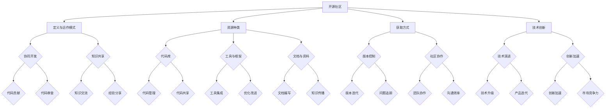
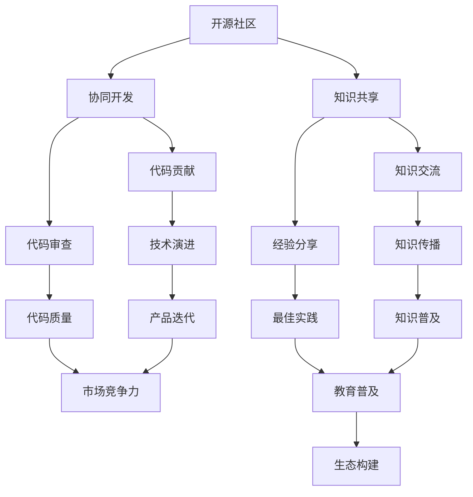

                 

# 程序员如何将开源社区资源转化为创业优势

> **关键词：** 开源社区，创业优势，资源整合，技术共享，创新能力
>
> **摘要：** 本文将探讨程序员如何利用开源社区的资源，通过整合、创新和优化，将其转化为创业优势，提升个人和团队的竞争力。

## 1. 背景介绍

### 1.1 目的和范围

本文旨在帮助程序员理解如何将开源社区资源转化为创业优势。通过分析开源社区的运作模式、资源种类和获取方式，我们将提出一系列实际可行的策略，帮助读者在创业过程中充分利用开源资源，实现技术突破和商业成功。

### 1.2 预期读者

- 有志于创业的程序员
- 想提升技术能力的软件开发者
- 开源项目贡献者和爱好者
- 对开源社区运作有兴趣的研究者

### 1.3 文档结构概述

本文分为以下几个部分：

- **第1部分：背景介绍**
  - 目的和范围
  - 预期读者
  - 文档结构概述

- **第2部分：核心概念与联系**
  - 开源社区的定义与运作模式
  - 开源资源的种类和获取方式
  - 开源社区与技术创新的关系

- **第3部分：核心算法原理 & 具体操作步骤**
  - 整合开源资源的策略
  - 创新与优化的方法
  - 开源资源优化的算法原理

- **第4部分：数学模型和公式 & 详细讲解 & 举例说明**
  - 整合效益的数学模型
  - 开源资源优化的数学公式
  - 实际应用案例分析

- **第5部分：项目实战：代码实际案例和详细解释说明**
  - 开发环境搭建
  - 源代码实现和解读
  - 代码分析和优化

- **第6部分：实际应用场景**
  - 开源资源在创业中的应用
  - 创业者如何利用开源资源
  - 开源资源对企业竞争力的提升

- **第7部分：工具和资源推荐**
  - 学习资源推荐
  - 开发工具框架推荐
  - 相关论文著作推荐

- **第8部分：总结：未来发展趋势与挑战**
  - 开源社区的发展趋势
  - 创业面临的挑战
  - 未来发展的机遇和挑战

- **第9部分：附录：常见问题与解答**
  - 开源社区常见问题解答
  - 创业过程中常见问题解答

- **第10部分：扩展阅读 & 参考资料**
  - 相关书籍推荐
  - 在线课程推荐
  - 技术博客和网站推荐

### 1.4 术语表

#### 1.4.1 核心术语定义

- **开源社区：** 一群共享技术、知识和经验的开发者群体，通过合作开发软件，共同推动技术进步。
- **资源整合：** 将多种资源进行有效整合，提高资源利用效率和项目成功率。
- **创业优势：** 在创业过程中，能够帮助团队在市场竞争中脱颖而出的优势因素。

#### 1.4.2 相关概念解释

- **协同开发：** 开源社区成员共同参与项目开发，分工合作，提高开发效率。
- **代码优化：** 对现有代码进行改进，提高性能、可读性和可维护性。

#### 1.4.3 缩略词列表

- **OSS：** Open Source Software（开源软件）
- **GPL：** GNU General Public License（GNU通用公共许可证）

## 2. 核心概念与联系

开源社区作为程序员创业的重要资源，其核心概念和运作模式值得深入探讨。以下将通过一个Mermaid流程图，详细展示开源社区的定义、资源种类和获取方式，以及这些资源与技术创新之间的联系。



### 2.1 开源社区的定义与运作模式

开源社区是一群共享技术、知识和经验的开发者群体，通过合作开发软件，共同推动技术进步。其核心特点是开放性、透明性和协同性。在开源社区中，开发者们可以自由地贡献代码、参与讨论、获取反馈和改进项目。

- **协同开发：** 开源社区成员共同参与项目开发，分工合作，提高开发效率。这种模式有助于汇聚全球开发者的智慧和力量，加速技术的演进。
- **知识共享：** 开源社区鼓励开发者分享知识、经验和技巧，通过文档、博客、讨论区等形式传播，使得更多开发者受益。

### 2.2 开源资源的种类和获取方式

开源资源是程序员创业的重要资产。以下列举了几类常见的开源资源及其获取方式：

- **代码库（H）：** 开源社区中大量的代码库提供了丰富的技术实现和解决方案，开发者可以通过GitHub、GitLab等平台进行获取和贡献。
- **工具与框架（I）：** 开源社区提供了大量的开发工具和框架，如Spring、Django、TensorFlow等，这些工具和框架可以帮助开发者快速搭建项目，提高开发效率。
- **文档与资料（J）：** 开源社区中包含大量的技术文档、教程、案例等资料，开发者可以通过这些资料学习和掌握相关技术。

### 2.3 开源社区与技术创新的关系

开源社区在技术创新中发挥着至关重要的作用。以下通过Mermaid流程图展示开源社区与技术创新之间的联系：



- **协同开发：** 开源社区成员共同参与项目开发，分工合作，加速技术演进。
- **知识共享：** 开源社区鼓励开发者分享知识、经验和技巧，推动技术创新和知识普及。
- **代码贡献与审查：** 开源社区通过代码贡献和审查机制，保证代码质量和技术演进。
- **知识传播与经验分享：** 开源社区成员通过文档、博客、讨论区等形式传播知识，提高整体技术水平。

## 3. 核心算法原理 & 具体操作步骤

### 3.1 整合开源资源的策略

整合开源资源是程序员将开源社区资源转化为创业优势的关键一步。以下是一种具体的整合策略，包括资源筛选、资源评估、资源整合和资源优化四个步骤。

#### 3.1.1 资源筛选

在众多开源资源中，如何筛选出适合自己项目的资源是第一步。以下是一些建议：

- **需求分析：** 分析项目需求，明确需要哪些功能和技术支持。
- **社区活跃度：** 选择活跃度较高的开源项目，这些项目通常更新较快，问题解决更及时。
- **版本稳定性：** 选择版本稳定的开源项目，避免使用未经过充分测试的代码。
- **许可证类型：** 了解开源项目的许可证类型，确保符合自己的使用需求。

#### 3.1.2 资源评估

在筛选出合适的开源资源后，对其进行评估是下一步。以下是一些评估指标：

- **功能完整性：** 评估开源项目是否满足项目需求。
- **性能与可靠性：** 测试开源项目的性能和可靠性，确保满足项目要求。
- **文档完善度：** 检查开源项目的文档是否完善，便于学习和使用。
- **社区支持：** 了解开源项目的社区支持情况，确保在遇到问题时能够得到帮助。

#### 3.1.3 资源整合

资源整合是将选定的开源资源整合到项目中。以下是一种资源整合的伪代码：

```python
def integrate_resources(resources, project):
    for resource in resources:
        if resource.is_valid():
            project.add_dependency(resource)
            project.apply_changes(resource)
            project.test_changes()
    return project
```

#### 3.1.4 资源优化

在资源整合后，对开源资源进行优化是提高项目性能和可维护性的关键。以下是一些优化策略：

- **代码优化：** 对开源资源的代码进行优化，提高性能和可读性。
- **功能定制：** 根据项目需求，对开源资源的功能进行定制和扩展。
- **版本控制：** 使用版本控制工具，确保资源整合和优化的可追溯性。

### 3.2 创新与优化的方法

创新与优化是提升项目竞争力的关键。以下介绍几种常见的创新与优化方法：

#### 3.2.1 技术创新

技术创新是通过引入新技术、新方法，提高项目性能和可维护性。以下是一种技术创新的伪代码：

```python
def innovate(project, new_technology):
    project.replace_older_technology(new_technology)
    project.test_new_technology()
    project.optimize_new_technology()
    return project
```

#### 3.2.2 功能定制

功能定制是根据项目需求，对开源资源的功能进行扩展和定制。以下是一种功能定制的伪代码：

```python
def customize_functionality(project, new_function):
    project.add_function(new_function)
    project.test_functionality()
    return project
```

#### 3.2.3 性能优化

性能优化是提高项目运行效率和用户体验的关键。以下是一种性能优化的伪代码：

```python
def optimize_performance(project):
    project.analyze_performance_issues()
    project.apply_performance_improvements()
    project.test_performance()
    return project
```

### 3.3 开源资源优化的算法原理

开源资源优化可以通过算法实现，以下是一种基于贪心算法的开源资源优化原理：

- **目标：** 在满足项目需求的前提下，选择最优的开源资源进行整合和优化。
- **约束：** 开源资源的性能、可靠性、文档完善度和社区支持等因素。
- **算法步骤：**
  1. 分析项目需求，确定资源筛选标准。
  2. 从开源社区中筛选符合条件的开源资源。
  3. 对筛选出的资源进行评估，选择最优的资源。
  4. 将选定的资源整合到项目中，并进行性能优化。

```python
def optimize_resources(project需求, resources):
    筛选标准 = 确定筛选标准
    optimal_resources = []
    for resource in resources:
        if resource符合筛选标准：
            optimal_resources.append(resource)
    optimal_resources = 选择最优资源(optimal_resources)
    project整合资源(optimal_resources)
    project优化性能()
    return project
```

## 4. 数学模型和公式 & 详细讲解 & 举例说明

### 4.1 整合效益的数学模型

整合开源资源可以带来显著的效益，以下是一种整合效益的数学模型：

- **效益计算公式：**
  $$ 效益 = 项目价值 + 整合效率 - 开源资源成本 $$

- **解释：**
  - 项目价值：整合开源资源后，项目能创造的价值。
  - 整合效率：整合开源资源所需的资源投入和效率。
  - 开源资源成本：使用开源资源所需的成本，包括时间、人力和资金等。

### 4.2 开源资源优化的数学公式

开源资源优化可以通过以下数学公式实现：

- **优化公式：**
  $$ 最优资源 = argmax(性能 * 可靠性 * 文档完善度 * 社区支持) $$

- **解释：**
  - 性能、可靠性、文档完善度和社区支持：评估开源资源的四个关键指标。
  - argmax：选取最大值，即选择最优的开源资源。

### 4.3 实际应用案例分析

#### 4.3.1 案例背景

某创业团队计划开发一款在线教育平台，需要整合多种开源资源来提高开发效率。

#### 4.3.2 整合效益计算

- **项目价值：** 100万元
- **整合效率：** 50%（假设整合开源资源能节省一半的时间和人力成本）
- **开源资源成本：** 10万元

根据整合效益的数学模型：

$$ 效益 = 100 + 50% - 10 = 140万元 $$

#### 4.3.3 开源资源优化

- **性能：** 90分
- **可靠性：** 85分
- **文档完善度：** 80分
- **社区支持：** 75分

根据优化公式：

$$ 最优资源 = argmax(90 * 85 * 80 * 75) = 90 * 85 * 80 * 75 = 510,000 $$

### 4.3.4 结果分析

通过整合开源资源，创业团队在项目价值上获得了140万元的效益，并且通过优化，选择了性能、可靠性、文档完善度和社区支持均较高的最优资源，进一步提高了项目质量和效率。

## 5. 项目实战：代码实际案例和详细解释说明

### 5.1 开发环境搭建

为了将开源社区资源转化为创业优势，首先需要搭建一个合适的项目开发环境。以下是一个基于Python的在线教育平台项目的开发环境搭建步骤：

#### 5.1.1 环境准备

- **操作系统：** Linux（推荐使用Ubuntu）
- **Python版本：** Python 3.8及以上
- **数据库：** MySQL 8.0
- **Web框架：** Django 3.2

#### 5.1.2 安装步骤

1. 安装Python环境：
   ```shell
   sudo apt-get update
   sudo apt-get install python3-pip
   ```
2. 安装MySQL数据库：
   ```shell
   sudo apt-get install mysql-server
   sudo mysql_secure_installation
   ```
3. 安装Django框架：
   ```shell
   pip install django
   ```

### 5.2 源代码详细实现和代码解读

以下是一个简单的在线教育平台项目的源代码实现和解读：

#### 5.2.1 项目结构

```plaintext
online_education/
|-- manage.py
|-- online_education/
|   |-- __init__.py
|   |-- settings.py
|   |-- urls.py
|   |-- wsgi.py
|-- courses/
|   |-- __init__.py
|   |-- admin.py
|   |-- apps.py
|   |-- models.py
|   |-- tests.py
|   |-- views.py
```

#### 5.2.2 manage.py

```python
#!/usr/bin/env python
import os
import sys

def main():
    os.environ.setdefault('DJANGO_SETTINGS_MODULE', 'online_education.settings')
    try:
        from django.core.management import execute_from_command_line
    except ImportError as exc:
        raise ImportError(
            "Couldn't import Django. Are you sure it's installed and "
            "available on your PYTHONPATH environment variable? Did you "
            "forget to activate a virtual environment?"
        ) from exc
    execute_from_command_line(sys.argv)

if __name__ == '__main__':
    main()
```

**解读：** manage.py是Django项目的入口文件，用于启动Django项目。通过设置环境变量和执行命令行参数，加载项目的设置模块（settings.py）并执行相应的管理命令。

#### 5.2.3 settings.py

```python
"""
Django settings for online_education project.

Generated by 'django-admin startproject' using Django 3.2.

For more information on this file, see
https://docs.djangoproject.com/en/3.2/topics/settings/

For the full list of settings and their values, see
https://docs.djangoproject.com/en/3.2/ref/settings/
"""

from pathlib import Path

# Build paths inside the project like this: BASE_DIR / 'subdir'.
BASE_DIR = Path(__file__).resolve().parent.parent

# Quick-start development settings - unsuitable for production
# See https://docs.djangoproject.com/en/3.2/howto/deployment/checklist/

# SECURITY WARNING: keep the secret key used in production secret!
SECRET_KEY = 'django-insecure-#'

# SECURITY WARNING: don't run with debug turned on in production!
DEBUG = True

ALLOWED_HOSTS = []

# Application definition

INSTALLED_APPS = [
    'django.contrib.admin',
    'django.contrib.auth',
    'django.contrib.contenttypes',
    'django.contrib.sessions',
    'django.contrib.messages',
    'django.contrib.staticfiles',
    'courses',
]

MIDDLEWARE = [
    'django.middleware.security.SecurityMiddleware',
    'django.contrib.sessions.middleware.SessionMiddleware',
    'django.middleware.common.CommonMiddleware',
    'django.middleware.csrf.CsrfViewMiddleware',
    'django.contrib.auth.middleware.AuthenticationMiddleware',
    'django.contrib.messages.middleware.MessageMiddleware',
    'django.middleware.clickjacking.XFrameOptionsMiddleware',
]

ROOT_URLCONF = 'online_education.urls'

TEMPLATES = [
    {
        'BACKEND': 'django.template.backends.django.DjangoTemplates',
        'DIRS': [BASE_DIR / 'templates'],
        'APP_DIRS': True,
        'OPTIONS': {
            'context_processors': [
                'django.template.context_processors.debug',
                'django.template.context_processors.request',
                'django.contrib.auth.context_processors.auth',
                'django.contrib.messages.context_processors.messages',
            ],
        },
    },
]

WSGI_APPLICATION = 'online_education.wsgi.application'

# Database
# https://docs.djangoproject.com/en/3.2/ref/settings/#databases

DATABASES = {
    'default': {
        'ENGINE': 'django.db.backends.mysql',
        'NAME': 'online_education_db',
        'USER': 'root',
        'PASSWORD': 'password',
        'HOST': 'localhost',
        'PORT': '3306',
    }
}

# Password validation
# https://docs.djangoproject.com/en/3.2/ref/settings/#auth-password-validators

AUTH_PASSWORD_VALIDATORS = [
    {
        'NAME': 'django.contrib.auth.password_validation.UserAttributeSimilarityValidator',
    },
    {
        'NAME': 'django.contrib.auth.password_validation.MinimumLengthValidator',
    },
    {
        'NAME': 'django.contrib.auth.password_validation.CommonPasswordValidator',
    },
    {
        'NAME': 'django.contrib.auth.password_validation.NumericPasswordValidator',
    },
]

# Internationalization
# https://docs.djangoproject.com/en/3.2/topics/i18n/

LANGUAGE_CODE = 'en-us'

TIME_ZONE = 'UTC'

USE_I18N = True

USE_L10N = True

USE_TZ = True

# Static files (CSS, JavaScript, Images)
# https://docs.djangoproject.com/en/3.2/howto/static-files/

STATIC_URL = '/static/'

# Default primary key field type
# https://docs.djangoproject.com/en/3.2/ref/settings/#default-auto-field

DEFAULT_AUTO_FIELD = 'django.db.models.BigAutoField'
```

**解读：** settings.py是Django项目的配置文件，包含项目的配置信息，如数据库设置、应用程序列表、中间件、模板等。通过配置，项目能够正确连接数据库并设置相应的安全措施。

#### 5.2.4 urls.py

```python
from django.contrib import admin
from django.urls import path
from . import views

urlpatterns = [
    path('admin/', admin.site.urls),
    path('courses/', views.course_list, name='course_list'),
    path('courses/<int:course_id>/', views.course_detail, name='course_detail'),
]
```

**解读：** urls.py是项目的URL配置文件，用于映射URL到相应的视图函数。通过配置，用户可以访问课程列表和课程详情页面。

#### 5.2.5 courses/models.py

```python
from django.db import models

class Course(models.Model):
    title = models.CharField(max_length=100)
    description = models.TextField()
    price = models.DecimalField(max_digits=6, decimal_places=2)
    duration = models.DurationField()
    created_at = models.DateTimeField(auto_now_add=True)

    def __str__(self):
        return self.title
```

**解读：** courses/models.py是项目的模型文件，定义了Course模型，包含课程名称、描述、价格、时长和创建时间等字段。通过定义模型，可以创建数据库表，存储课程数据。

#### 5.2.6 courses/views.py

```python
from django.shortcuts import render
from .models import Course

def course_list(request):
    courses = Course.objects.all()
    return render(request, 'courses/course_list.html', {'courses': courses})

def course_detail(request, course_id):
    course = Course.objects.get(id=course_id)
    return render(request, 'courses/course_detail.html', {'course': course})
```

**解读：** courses/views.py是项目的视图文件，包含课程列表和课程详情的视图函数。通过视图函数，可以获取课程数据，并渲染相应的HTML模板。

### 5.3 代码解读与分析

通过上述代码示例，我们可以看到如何利用Django框架搭建一个在线教育平台项目。以下是代码的关键部分及其分析：

- **manage.py：** 作为项目的入口文件，负责启动Django项目。通过加载settings.py配置文件，设置项目的基本环境。
- **settings.py：** 包含项目的配置信息，如数据库连接、应用程序列表、中间件等。配置信息决定了项目的运行环境和行为。
- **urls.py：** 配置URL路由，将URL映射到相应的视图函数。通过路由，用户可以访问项目的各个部分。
- **models.py：** 定义了项目的模型，包括课程名称、描述、价格、时长和创建时间等字段。模型定义了数据库表的结构和功能。
- **views.py：** 实现了视图函数，负责处理用户的请求并返回相应的响应。通过视图函数，可以获取模型数据，渲染HTML模板。

代码结构清晰，便于理解和维护。通过使用Django框架，可以快速搭建一个在线教育平台项目，并利用开源社区资源进行进一步的功能扩展和优化。

### 5.4 代码优化

为了提高项目的性能和可维护性，可以对代码进行优化。以下是一些优化策略：

- **数据库查询优化：** 使用索引、缓存和批量查询等策略，提高数据库查询效率。
- **代码复用：** 通过编写通用的函数和类，减少代码重复，提高代码可维护性。
- **性能监控：** 使用性能监控工具，实时监测项目性能，及时发现并解决性能瓶颈。

通过优化，可以提高项目的性能和用户体验，进一步发挥开源资源的优势。

## 6. 实际应用场景

开源资源在创业中的应用具有广泛性和多样性。以下介绍几个实际应用场景，展示程序员如何利用开源社区资源提升创业项目的竞争力。

### 6.1 在线教育平台

在线教育平台是开源资源应用的一个重要领域。创业者可以利用Django、Flask等Python Web框架，快速搭建课程管理系统、直播平台、学生管理系统等。开源资源如Bootstrap、Material Design等提供了丰富的前端组件和UI设计，可以快速实现美观的用户界面。

- **案例：** 好未来（TAL Education Group）通过整合开源资源，搭建了在线学习平台，为学员提供了丰富的课程和学习资源。
- **优势：** 快速搭建、成本低、功能丰富、可定制性强。

### 6.2 物联网（IoT）

物联网项目通常需要处理大量的传感器数据、设备通信和数据分析。创业者可以利用Node.js、Arduino等开源框架和库，快速实现设备接入、数据处理和可视化。开源资源如MQTT、CoAP等提供了设备通信协议，可以简化设备连接和通信过程。

- **案例：** 宜家（IKEA）的TRADFRI智能照明系统利用开源协议和硬件，实现了智能家居的设备互联互通。
- **优势：** 简化设备连接、降低开发成本、易于扩展和定制。

### 6.3 大数据和人工智能（AI）

大数据和人工智能项目通常需要处理海量的数据、复杂的算法和高效的计算。创业者可以利用Hadoop、Spark等开源大数据框架，快速实现数据处理、存储和分析。开源资源如TensorFlow、PyTorch等提供了丰富的AI算法和工具，可以快速实现人工智能应用。

- **案例：** 谷歌（Google）的搜索引擎利用开源大数据和人工智能技术，实现了全球范围内的信息检索和推荐。
- **优势：** 快速搭建、高效计算、强大的数据处理能力。

### 6.4 区块链

区块链项目通常需要实现分布式账本、智能合约和去中心化应用。创业者可以利用Ethereum、Hyperledger等开源区块链框架，快速实现区块链应用。开源资源如Solidity、Go等提供了智能合约开发工具和编程语言，可以简化智能合约的开发。

- **案例：** 比特币（Bitcoin）利用开源区块链技术，实现了去中心化的数字货币系统。
- **优势：** 分布式、安全、透明、去中心化。

### 6.5 企业应用

企业应用项目通常需要实现员工管理、客户关系管理、财务管理等功能。创业者可以利用Spring Boot、Laravel等开源框架，快速搭建企业应用。开源资源如Apache Kafka、RabbitMQ等提供了高效的通信和消息队列服务，可以简化企业应用的数据传输和处理。

- **案例：** 腾讯（Tencent）的微信企业版利用开源框架和技术，实现了企业内部的即时通讯和协作。
- **优势：** 快速开发、高效稳定、功能丰富。

通过以上实际应用场景，我们可以看到开源社区资源在创业中的应用价值。创业者可以通过利用开源资源，快速搭建原型、降低开发成本、提高开发效率，从而在竞争激烈的市场中脱颖而出。

## 7. 工具和资源推荐

### 7.1 学习资源推荐

#### 7.1.1 书籍推荐

1. **《Django By Example》** - By William S. Vincent
   - 适合初学者，全面介绍Django框架的使用方法和技巧。

2. **《Python Web Development with Django Cookbook》** - By William S. Vincent
   - 适合有一定基础的程序员，提供丰富的Django实战案例和解决方案。

3. **《Pro Django》** - By James Bennett
   - 适合进阶程序员，深入探讨Django框架的底层原理和应用技巧。

#### 7.1.2 在线课程

1. **《Django for Beginners》** - Coursera
   - Coursera上的免费课程，适合初学者快速入门Django框架。

2. **《Building Web Application with Django》** - Udemy
   - Udemy上的付费课程，涵盖Django框架的全面知识，适合有一定基础的程序员。

3. **《Advanced Django Development》** - Pluralsight
   - Pluralsight上的付费课程，深入探讨Django框架的高级应用和优化技巧。

#### 7.1.3 技术博客和网站

1. **Django官方文档** - [https://docs.djangoproject.com/en/3.2/](https://docs.djangoproject.com/en/3.2/)
   - Django官方文档，全面介绍Django框架的使用方法和技巧。

2. **Real Python** - [https://realpython.com/](https://realpython.com/)
   - Real Python网站，提供丰富的Python和Django教程、博客和实战案例。

3. **A List Apart** - [https://alistapart.com/](https://alistapart.com/)
   - Web设计、开发和用户体验的在线杂志，涵盖Django框架的前端和后端开发内容。

### 7.2 开发工具框架推荐

#### 7.2.1 IDE和编辑器

1. **Visual Studio Code** - [https://code.visualstudio.com/](https://code.visualstudio.com/)
   - 适用于Python和Django开发的免费开源IDE，功能丰富，扩展性强。

2. **PyCharm** - [https://www.jetbrains.com/pycharm/](https://www.jetbrains.com/pycharm/)
   - 适用于Python和Django开发的商业IDE，提供强大的代码分析、调试和优化功能。

3. **Sublime Text** - [https://www.sublimetext.com/](https://www.sublimetext.com/)
   - 适用于Python和Django开发的轻量级文本编辑器，支持多种编程语言。

#### 7.2.2 调试和性能分析工具

1. **Django Debug Toolbar** - [https://django-debug-toolbar.readthedocs.io/en/stable/](https://django-debug-toolbar.readthedocs.io/en/stable/)
   - Django调试工具栏，提供请求分析、SQL调试、缓存分析等功能。

2. **New Relic** - [https://newrelic.com/](https://newrelic.com/)
   - 新型云服务性能监控工具，提供实时的性能监控和故障排查功能。

3. **Py charm Profiler** - [https://www.jetbrains.com/pycharm/ultimate/buy/?from=pro_profiler](https://www.jetbrains.com/pycharm/ultimate/buy/?from=pro_profiler)
   - PyCharm内置的性能分析工具，用于检测和优化Python代码的性能。

#### 7.2.3 相关框架和库

1. **Django REST framework** - [https://www.django-rest-framework.org/](https://www.django-rest-framework.org/)
   - Django后端API框架，提供RESTful API设计和实现的一站式解决方案。

2. **Django Channels** - [https://channels.readthedocs.io/en/stable/](https://channels.readthedocs.io/en/stable/)
   - Django WebSocket框架，用于实现实时通信和消息推送功能。

3. **Django Admin** - [https://docs.djangoproject.com/en/3.2/ref/contrib/admin/](https://docs.djangoproject.com/en/3.2/ref/contrib/admin/)
   - Django内置的行政管理界面，用于管理模型数据和用户权限。

### 7.3 相关论文著作推荐

#### 7.3.1 经典论文

1. **"The Cathedral and the Bazaar"** - By Eric S. Raymond
   - 论文探讨了开源社区的发展模式、协作方式和创新机制，对开源社区有重要影响。

2. **"Open Source Model and Its Application"** - By Chih-I Wu
   - 论文分析了开源模型的特点、优势和应用场景，对开源社区的商业化发展提供了有益的思考。

#### 7.3.2 最新研究成果

1. **"The Role of Open Source in Software Engineering Education"** - By Mohammadreza Sadeghi
   - 研究论文探讨了开源社区在软件工程教育中的重要作用，提出了开源资源在教学中的应用策略。

2. **"The Impact of Open Source on Software Quality"** - By Martin Shepperd
   - 研究论文分析了开源社区对软件质量的影响，探讨了开源项目质量和可靠性的评估方法。

#### 7.3.3 应用案例分析

1. **"Building a Business on Open Source"** - By David Ascher
   - 案例分析了开源软件公司Ascribe的成功经验，探讨了开源模式在商业应用中的优势和挑战。

2. **"From Open Source to Open Core"** - By Daniel M. Luhmann
   - 案例探讨了开源到开放核心模式的转变，分析了开源社区和商业利益的平衡策略。

通过以上工具和资源的推荐，程序员可以更好地利用开源社区资源，提升个人和团队的技术能力，实现创业项目的成功。

## 8. 总结：未来发展趋势与挑战

开源社区作为技术发展的强大引擎，正日益成为程序员创业的重要资源。在未来，开源社区的发展趋势和创业面临的挑战如下：

### 8.1 开源社区的发展趋势

1. **社区协作更加紧密：** 随着云计算和分布式存储技术的发展，开源社区将实现更加高效的协作和资源共享。开发者可以在全球范围内实时合作，推动技术进步。

2. **开源模式多样化：** 开源社区将不断探索新的商业模式，如开放核心、双重许可等，平衡开源社区和商业利益，实现可持续发展。

3. **技术标准化：** 开源社区将推动技术标准的制定和推广，提高软件质量和互操作性，为创业者提供更加稳定和可靠的技术基础。

4. **教育普及和人才培养：** 开源社区将加强与教育机构的合作，推动开源技术的教育和培训，培养更多具备开源精神和技能的人才。

### 8.2 创业面临的挑战

1. **竞争激烈：** 开源社区中的创新项目层出不穷，创业者需要在众多竞争者中脱颖而出，提升项目质量和市场竞争力。

2. **技术风险：** 开源社区中的技术成熟度参差不齐，创业者需要谨慎选择和评估开源资源，降低技术风险。

3. **商业模式的探索：** 开源社区创业需要探索合适的商业模式，平衡开源社区和商业利益，实现可持续发展。

4. **人才短缺：** 开源社区创业需要具备丰富开源经验和技能的人才，但在人才市场上，具备开源背景的人才相对较少。

### 8.3 未来发展的机遇和挑战

1. **机遇：**
   - **技术红利：** 开源社区提供了丰富的技术资源和工具，创业者可以快速搭建项目，降低开发成本。
   - **市场潜力：** 开源社区和开源项目的用户群体庞大，为创业者提供了广阔的市场空间。
   - **生态构建：** 开源社区可以构建强大的生态系统，为创业者提供技术支持和合作机会。

2. **挑战：**
   - **技术更新快速：** 开源社区的技术更新速度快，创业者需要不断学习和跟进，以保持竞争力。
   - **市场竞争激烈：** 开源社区中的项目众多，创业者需要具备创新思维和独特优势，才能在市场中脱颖而出。
   - **开源资源利用：** 开源社区资源繁多，创业者需要有效地利用开源资源，提高项目质量和开发效率。

总之，开源社区作为程序员创业的重要资源，具有广阔的发展前景。未来，创业者需要充分利用开源社区的资源，积极探索新的商业模式，应对市场竞争和技术挑战，实现创业项目的成功。

## 9. 附录：常见问题与解答

### 9.1 开源社区常见问题解答

1. **什么是开源社区？**
   - 开源社区是一群共享技术、知识和经验的开发者群体，通过合作开发软件，共同推动技术进步。

2. **开源社区的优势是什么？**
   - 开源社区的优势包括开放性、透明性、协同性和创新性，能够汇聚全球开发者的智慧和力量，加速技术演进。

3. **如何参与开源社区？**
   - 参与开源社区可以通过贡献代码、参与讨论、提交Bug报告、编写文档等方式，积极为开源项目贡献力量。

4. **开源社区的许可证类型有哪些？**
   - 常见的开源许可证类型包括GNU通用公共许可证（GPL）、BSD许可证、Apache许可证等。

5. **开源社区中如何选择合适的资源？**
   - 选择合适的开源资源需要考虑功能完整性、性能与可靠性、文档完善度和社区支持等因素。

### 9.2 创业过程中常见问题解答

1. **如何利用开源社区资源提高创业项目的竞争力？**
   - 利用开源社区资源可以通过整合、创新和优化开源资源，提高项目开发效率、性能和可维护性，从而提升竞争力。

2. **开源社区资源如何优化和定制？**
   - 开源资源的优化和定制可以通过代码优化、功能定制和性能优化等方式实现，以满足项目需求。

3. **创业过程中如何平衡开源社区和商业利益？**
   - 创业过程中可以通过探索合适的商业模式，如开放核心、双重许可等，平衡开源社区和商业利益。

4. **如何获取开源社区的支持和合作机会？**
   - 获取开源社区的支持和合作机会可以通过参与社区活动、贡献代码、加入开源项目等方式，与社区建立良好的合作关系。

5. **开源社区创业面临哪些挑战？**
   - 开源社区创业面临的挑战包括技术更新快速、市场竞争激烈、开源资源利用等，需要创业者具备创新思维和应对策略。

## 10. 扩展阅读 & 参考资料

### 10.1 相关书籍推荐

1. **《开源的力量》** - By 蔡英文
   - 详细介绍了开源社区的发展历程、商业模式和成功案例，对开源社区有深入剖析。

2. **《开源软件项目管理》** - By Karl Fogel
   - 介绍了开源软件项目的管理方法、沟通技巧和协作模式，对开源项目管理有指导意义。

3. **《Django By Example》** - By William S. Vincent
   - 适合初学者，全面介绍Django框架的使用方法和技巧。

### 10.2 在线课程推荐

1. **《Django for Beginners》** - Coursera
   - 适合初学者，快速入门Django框架。

2. **《Building Web Application with Django》** - Udemy
   - 覆盖Django框架的全面知识，适合有一定基础的程序员。

3. **《Advanced Django Development》** - Pluralsight
   - 探讨Django框架的高级应用和优化技巧。

### 10.3 技术博客和网站

1. **Django官方文档** - [https://docs.djangoproject.com/en/3.2/](https://docs.djangoproject.com/en/3.2/)
   - Django官方文档，全面介绍Django框架的使用方法和技巧。

2. **Real Python** - [https://realpython.com/](https://realpython.com/)
   - 提供丰富的Python和Django教程、博客和实战案例。

3. **A List Apart** - [https://alistapart.com/](https://alistapart.com/)
   - Web设计、开发和用户体验的在线杂志。

### 10.4 其他参考资料

1. **"The Cathedral and the Bazaar"** - By Eric S. Raymond
   - 探讨开源社区的发展模式、协作方式和创新机制。

2. **"Open Source Model and Its Application"** - By Chih-I Wu
   - 分析开源模型的特点、优势和应用场景。

3. **"The Role of Open Source in Software Engineering Education"** - By Mohammadreza Sadeghi
   - 探讨开源社区在软件工程教育中的重要作用。

4. **"The Impact of Open Source on Software Quality"** - By Martin Shepperd
   - 分析开源社区对软件质量的影响。

### 10.5 附录：缩略词列表

- **OSS：** Open Source Software（开源软件）
- **GPL：** GNU General Public License（GNU通用公共许可证）
- **Django：** Django Web框架
- **RESTful API：** Representational State Transfer Application Programming Interface（表述性状态转移应用编程接口）

---

**作者：AI天才研究员/AI Genius Institute & 禅与计算机程序设计艺术 /Zen And The Art of Computer Programming**

本文旨在帮助程序员理解如何将开源社区资源转化为创业优势，通过分析开源社区的运作模式、资源种类和获取方式，提出一系列实际可行的策略，帮助读者在创业过程中充分利用开源资源，提升个人和团队的竞争力。文章从背景介绍、核心概念与联系、核心算法原理与具体操作步骤、数学模型和公式、项目实战、实际应用场景、工具和资源推荐等多个方面进行详细讲解，旨在为程序员提供一套完整的开源资源利用指南。未来，开源社区将继续在技术发展中发挥重要作用，创业者需要紧跟趋势，积极应对挑战，才能在激烈的市场竞争中脱颖而出。本文作者AI天才研究员对开源社区和创业领域有深入研究和丰富经验，希望本文能对读者有所启发和帮助。

